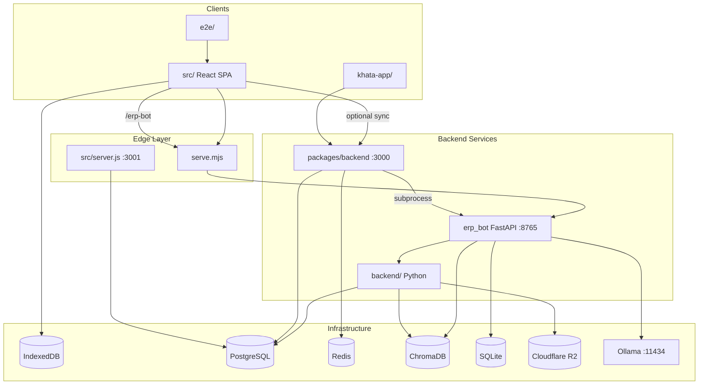

# 02 — Dependency Graph

**Project:** Sutra ERP  
**Generated:** 2026-07-10

---

## 1. Package-Level Dependency Graph



---

## 2. Frontend Internal Dependency Graph

```
main.tsx
  └── App.tsx
        ├── auth screens (SignUpWizard, GatewayScreen, CompanyLoginScreen)
        └── Layout.tsx
              ├── TopMenuBar, BusyMenuBar, Sidebar (mobile)
              ├── AI Providers (Falcon, Nios, EKhata, SutraAi — gated)
              └── renderPage() → pages/*

pages/* ──depends──► useStore (store/index.ts)
                        ├── lib/db.ts (Dexie)
                        ├── lib/accounting.ts
                        ├── store/slices/*
                        └── lib/* engines

AI stores:
  sutraAiStore ──► ai/core/IntelligenceCore ──► ai/* (rag, guard, routing)
  falconStore  ──► lib/falcon/falconBrain ──► erpBotClient
  eKhataStore  ──► lib/ekhata/processMessage ──► orbixQwenClient ──► erpBotClient
  niosStore    ──► nios/client/niosClient ──► /nios/v1

erpBotClient ──► serve.mjs /erp-bot OR localhost:8765
               └── when VITE_NIOS_PLATFORM_V3 → niosClient
```

---

## 3. erp_bot Intelligence Stack Dependencies

```
api/server.py (entry)
  ├── agent/agent_builder          [Legacy: /chat, /orbix/chat/stream]
  │     ├── cascade_router → intent_router
  │     ├── unified_tools → knowledge/unified_retriever
  │     ├── khata/khata_engine
  │     └── vectorstore/*
  │
  ├── orbix/api                    [Orbix v2: /orbix/v2/*]
  │     └── orbix/bootstrap → reasoning/engine
  │           ├── planner, verifier, answerer
  │           └── tools/registry → ledger_tools, code_tools
  │
  ├── nios/api                     [NIOS v3: /nios/v1/*]
  │     └── nios/gateway
  │           ├── nios/kernel (singleton)
  │           ├── cognitive_os, research_loop
  │           ├── federation → unified_retriever, backend/knowledge
  │           └── agent/cascade_router (fallback)
  │
  ├── conversation/manager         [/v2/chat]
  │     ├── nlu/engine
  │     ├── reasoning/accounting_reasoner
  │     └── bridges/session_data
  │
  └── backend.* (conditional mount)
        ├── backend.api.health_routes
        └── backend.knowledge.api + jobs/worker
```

---

## 4. RAG / Retrieval Dependency Graph

```
unified_retriever.retrieve()
  ├── nepal_knowledge_store     → erp_bot/knowledge/nepal/*.md
  ├── hybrid_rag.search         → ca_knowledge_store + BM25
  └── chroma_store              → erp_codebase (ingestion/embedder)

nios/knowledge/federation.py
  ├── ErpFederationAdapter      → world_state, session_data
  ├── VectorFederationAdapter   → hybrid_rag
  ├── GovFederationAdapter      → feeds (IRD/NRB/SEBON)
  ├── NepseFederationAdapter    → feeds
  ├── WebFederationAdapter      → duckduckgo
  └── FilesFederationAdapter    → backend/knowledge (tenant docs)

nlu/hybrid_nlu_search.py
  └── nlu_knowledge_store       → ingest_nlu_knowledge_embeddings.py
```

---

## 5. Khata NLU Dependency Chain

```
Client: lib/ekhata/parseKhata.ts
  └── processMessage.ts → caEntryEngine → confirmKhata → store

Server path 1 (conversation):
  conversation/manager.py
    └── nlu/engine.py
          ├── text_normalize → falcon_trader/normalizer
          ├── nearest_neighbor_intent → hybrid_nlu_search
          ├── knowledge_enrich
          └── accounting_reasoner → journal_verifier_chain

Server path 2 (legacy):
  khata/khata_engine.py → khata_parser → khata_validator

Server path 3 (mobile API):
  packages/backend/routes/khata.ts
    └── falconNlu.ts → parse_khata_cli.py → falcon_trader

Server path 4 (Orbix):
  orbix/tools/ledger_tools.py → simulate_voucher
```

---

## 6. npm Runtime Dependencies (root)

| Package | Used by |
|---------|---------|
| react, react-dom | SPA |
| zustand | store |
| dexie, dexie-react-hooks | lib/db.ts |
| @tanstack/react-query | selective data fetching |
| express, pg, ioredis, jsonwebtoken | src/server.js, packages/backend |
| vite, @vitejs/plugin-react, tailwindcss | build |
| jspdf, jspdf-autotable, xlsx | export/print |
| nepali-date-converter | date UI |
| @aws-sdk/client-s3 | potential S3 (also backend Python) |
| cors, multer, nodemailer | server layers |

---

## 7. Python Runtime Dependencies

### erp_bot/requirements.txt (selected)

| Package | Used by |
|---------|---------|
| fastapi, uvicorn | api/server |
| langchain, langchain-ollama | agent, khata, conversation |
| chromadb | vectorstore |
| tree-sitter, tree-sitter-* | ingestion/ts_chunker |
| rank-bm25 | knowledge/hybrid_rag |
| httpx, pydantic | orbix, nios |
| psycopg2 | nios memory_bus_pg (optional) |
| boto3 | via backend mount |
| watchdog | watcher |
| redis | declared, unused in erp_bot code |

### backend/requirements.txt

| Package | Used by |
|---------|---------|
| boto3 | storage (R2) |
| psycopg2 | knowledge/repository |
| redis | knowledge/jobs/queue (optional) |
| chromadb, langchain | knowledge/adapters |
| fastapi | knowledge/api (mounted on erp_bot) |

---

## 8. Cross-Package Import Graph

| From | To | Mechanism |
|------|-----|-----------|
| `erp_bot/src/api/server.py` | `backend.api`, `backend.knowledge` | try/except import, PYTHONPATH=repo root |
| `erp_bot/src/nios/knowledge/federation.py` | `backend.knowledge.container` | Runtime import |
| `backend/knowledge/adapters/ocr.py` | `erp_bot.src.nios.ocr.invoice_parser` | Cross-package |
| `packages/backend/lib/falconNlu.ts` | `erp_bot/scripts/parse_khata_cli.py` | subprocess spawn |
| `src/lib/erpBotClient.ts` | erp_bot HTTP | fetch /erp-bot |
| `src/lib/syncEngine.ts` | packages/backend HTTP | fetch /api/sync |

---

## 9. Build-Time Dependencies

```
npm run build
  ├── python3 erp_bot/scripts/export_nepal_ai_runtime_maps.py
  │     └── writes src/lib/nepal-ai/generated/runtimeMaps.ts
  ├── node scripts/build-falcon-page-index.mjs
  │     └── writes src/lib/falcon/generatedPageIndex.ts
  └── vite build
        └── manual chunks: nepal-ai, ekhata-brain, sutra-ai, react, db, pdf, xlsx
```

---

## 10. Singleton Dependency Hubs

| Singleton | Dependents |
|-----------|------------|
| `useStore` (Zustand) | 190+ pages, AI stores, sync |
| `openDB()` / Dexie | store, accounting, all CRUD |
| `get_kernel()` | nios/api, gateway, capabilities |
| `get_gateway()` | nios/api |
| `get_engine()` (Orbix) | orbix/api |
| `get_knowledge_container()` | backend/knowledge api, federation |
| `get_storage_container()` | backend/storage, knowledge/r2_storage |
| `unified_retriever` | agent, nios, citation_qa, orbix tools |

---

## 11. Circular / Bidirectional Dependencies (observed)

| Cycle | Nature |
|-------|--------|
| `nlu/engine` ↔ `knowledge_enrich` | TYPE_CHECKING + runtime enrichment |
| `nios/gateway` → `agent/cascade_router` → shared RAG | Logical stack layering |
| `store/index.ts` internal | Monolithic store composition |
| Frontend eKhata ↔ erp_bot khata | Same engines, dual client/server paths |

---

## 12. Deployment Dependency Chain

```
Git push main
  → GitHub Actions (lint, tsc, ekhata-ci)
  → render-deploy.yml → Render build (render-build.sh)
  → serve.mjs serves dist/
  → ERP_BOT_BACKEND_URL points to GPU erp_bot

Optional:
  → frontend-deploy.yml → Vercel
  → docker-compose.yml → local PG + Redis + packages/backend
```
