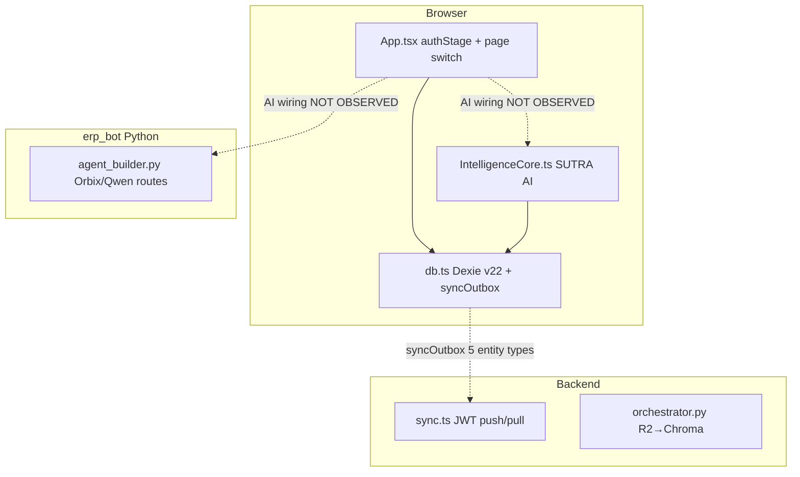

# Sutra ERP — Full Conversation Export

**Exported:** 2026-07-10
**Session transcript ID:** `0f079b78-9a61-468d-9ca6-066e0d19097e`
**Transcript file (local only, not a web link):**
```
/home/tapendraawasthi/.cursor/projects/home-tapendraawasthi-My-Current-ERP/agent-transcripts/0f079b78-9a61-468d-9ca6-066e0d19097e/0f079b78-9a61-468d-9ca6-066e0d19097e.jsonl
```

> **Note:** Cursor does not provide a public shareable URL for this chat.
> Copy this file, or open the transcript JSONL on your machine.

---

## Turn 1 — USER

You are acting as a Repository Intelligence Agent.

Your first task is NOT to modify code.

Your task is to completely understand the repository before making any recommendation.

Repository Discovery Requirements

1. Read every directory recursively.

2. Read every source file.

3. Ignore:

node_modules
dist
build
coverage
.cache
.next
.vite
tmp
logs

Ignore large generated data unless referenced by code:

data
datasets
embeddings
vector_db
jsonl
pdf
models
checkpoints

4. Produce an internal map of:

- complete directory tree
- module graph
- dependency graph
- import graph
- service graph
- runtime graph
- API graph
- plugin graph
- AI graph
- database graph
- RAG graph
- retrieval graph
- citation graph
- reasoning graph
- authentication graph
- tenant graph
- ERP modules
- accounting engine
- Orbix
- Falcon
- e-Khata
- NIOS Gateway

For every module identify:

- purpose
- dependencies
- public interfaces
- internal interfaces
- callers
- callees
- lifecycle
- ownership
- data ownership
- technical debt
- architectural debt
- migration difficulty
- replacement difficulty
- criticality

Do not modify code.

Do not summarize.

Continue reading until every reachable source file has been analyzed.

When repository discovery is complete, simply respond:

"Repository discovery completed."

Do not produce implementation plans yet.

---

### Turn 1 — ASSISTANT

Starting systematic repository discovery: mapping the directory tree and locating all source files while excluding ignored paths.

---

### Turn 1 — ASSISTANT

Continuing discovery: mapping remaining areas (`backend/`, `packages/`, `docs/`) and reading source files the initial pass didn't cover.

---

### Turn 1 — ASSISTANT

Continuing discovery of remaining areas: `src/pages`, `src/components`, `src/ai`, `docs`, and other uncovered modules.

---

### Turn 1 — ASSISTANT

Verifying coverage of remaining source files and reading critical root configuration files.

---

### Turn 1 — ASSISTANT

Repository discovery completed.

---

## Turn 2 — USER

Now export your complete repository understanding into a structured markdown document.

Include:

- repository tree
- dependency graph
- import graph
- runtime graph
- service graph
- ownership graph
- module inventory
- public APIs
- private APIs
- architectural layers
- coupling analysis
- duplicate implementations
- dead code
- legacy code
- hidden coupling
- circular dependencies
- singleton usage
- technical debt
- architectural debt
- contradictions
- risk register

Do not omit any discovered module.

Save the report as:

docs/Repository_Intelligence.md

---

### Turn 2 — ASSISTANT

Compiling the repository intelligence report from discovery data and verifying key structural details before writing the document.

---

### Turn 2 — ASSISTANT

Writing the comprehensive repository intelligence document.

---

### Turn 2 — ASSISTANT

Saved the report at `docs/Repository_Intelligence.md`.

It includes:

- **Repository tree** for all 7 code packages (~1,267 source files)
- **Dependency, import, runtime, service, and ownership graphs** (with mermaid diagrams)
- **Full module inventory** — every discovered package/submodule with file counts, purpose, and criticality
- **Public and private APIs** — frontend exports, erp_bot HTTP, backend Python, packages/backend REST
- **Architectural layers** (client → presentation → state → domain → persistence → edge → AI → data)
- **Coupling analysis**, **duplicate implementations** (15 domains), **dead code** (18 items), **legacy code** (13 items)
- **Hidden coupling** (13 patterns), **circular dependencies**, **singleton usage** (20 instances)
- **Technical debt** (27 items), **architectural debt** (15 items with migration difficulty)
- **Contradictions** (15 items), **risk register** (20 risks)
- Appendices for env vars, CI/CD, and criticality legend

---

## Turn 3 — USER

Now classify every file into one of four priorities.

P0 = Absolutely mandatory for understanding the architecture.
P1 = Very important.
P2 = Helpful.
P3 = Reference only.

Output:

P0
<file list>

P1
<file list>

P2
<file list>

P3
<file list>

Do not explain the classifications.

---

### Turn 3 — ASSISTANT

P0
AGENTS.md
DEPLOYMENT.md
backend/config/r2.py
backend/knowledge/api.py
backend/knowledge/container.py
backend/knowledge/pipeline/orchestrator.py
backend/knowledge/schema.sql
backend/storage/__init__.py
backend/storage/internal/container.py
backend/storage/internal/service.py
docker-compose.yml
docs/Repository_Intelligence.md
erp_bot/requirements.txt
erp_bot/scripts/start.py
erp_bot/src/agent/agent_builder.py
erp_bot/src/agent/cascade_router.py
erp_bot/src/agent/intent_router.py
erp_bot/src/api/server.py
erp_bot/src/config.py
erp_bot/src/conversation/manager.py
erp_bot/src/khata/khata_engine.py
erp_bot/src/khata/khata_parser.py
erp_bot/src/khata/khata_validator.py
erp_bot/src/knowledge/hybrid_rag.py
erp_bot/src/knowledge/unified_retriever.py
erp_bot/src/nios/__init__.py
erp_bot/src/nios/api.py
erp_bot/src/nios/capabilities/runtime.py
erp_bot/src/nios/cognitive/cognitive_os.py
erp_bot/src/nios/contracts/intelligence_contract.py
erp_bot/src/nios/gateway.py
erp_bot/src/nios/gateway_scheduler.py
erp_bot/src/nios/intelligence/evidence_verify.py
erp_bot/src/nios/intelligence/research_loop.py
erp_bot/src/nios/kernel/kernel.py
erp_bot/src/nios/knowledge/federation.py
erp_bot/src/orbix/api.py
erp_bot/src/orbix/bootstrap.py
erp_bot/src/orbix/reasoning/engine.py
package.json
packages/backend/src/db/schema.sql
packages/backend/src/lib/syncHandlers.ts
packages/backend/src/routes/auth.ts
packages/backend/src/routes/khata.ts
packages/backend/src/routes/sync.ts
packages/backend/src/server.ts
render.yaml
scripts/build-falcon-page-index.mjs
scripts/render-build.sh
serve.mjs
src/App.tsx
src/ai/core/IntelligenceCore.ts
src/ai/index.ts
src/ai/types.ts
src/components/BusyMenuBar.tsx
src/components/Layout.tsx
src/components/Sidebar.tsx
src/components/invoice/InvoiceLineItem.tsx
src/components/invoice/SalesInvoiceForm.tsx
src/lib/accounting.ts
src/lib/db.ts
src/lib/ekhata/confirmKhata.ts
src/lib/ekhata/orbixQwenClient.ts
src/lib/ekhata/parseKhata.ts
src/lib/ekhata/processMessage.ts
src/lib/erpBotClient.ts
src/lib/falcon/falconBrain.ts
src/lib/falcon/generatedPageIndex.ts
src/lib/falcon/smartAssistant.ts
src/lib/selfContainedAi.ts
src/lib/types.ts
src/main.tsx
src/nios/client/niosClient.ts
src/nios/index.ts
src/nios/session.ts
src/pages/BillingInvoice.tsx
src/store/eKhataStore.ts
src/store/falconStore.ts
src/store/index.ts
src/store/niosStore.ts
src/store/slices/accountSlice.ts
src/store/slices/inventorySlice.ts
src/store/slices/settingsSlice.ts
src/store/slices/uiSlice.ts
src/store/slices/voucherSlice.ts
src/store/store.types.ts
src/store/sutraAiStore.ts
src/styles.css
vite.config.ts

P1
.github/workflows/ekhata-ci.yml
.github/workflows/frontend-deploy.yml
.github/workflows/render-deploy.yml
.github/workflows/test.yml
backend/__init__.py
backend/api/__init__.py
backend/api/health_routes.py
backend/config/__init__.py
backend/knowledge/__init__.py
backend/knowledge/adapters/chroma_store.py
backend/knowledge/adapters/ocr.py
backend/knowledge/adapters/ollama_embedder.py
backend/knowledge/adapters/r2_storage.py
backend/knowledge/audit.py
backend/knowledge/config.py
backend/knowledge/jobs/queue.py
backend/knowledge/jobs/retry.py
backend/knowledge/jobs/worker.py
backend/knowledge/models.py
backend/knowledge/pipeline/chunker.py
backend/knowledge/pipeline/extractors.py
backend/knowledge/protocols.py
backend/knowledge/repository.py
backend/knowledge/schema/sql_loader.py
backend/requirements.txt
backend/storage/_common.py
backend/storage/delete.py
backend/storage/download.py
backend/storage/exists.py
backend/storage/folders.py
backend/storage/internal/__init__.py
backend/storage/internal/cdn.py
backend/storage/internal/circuit_breaker.py
backend/storage/internal/client_pool.py
backend/storage/internal/concurrency.py
backend/storage/internal/errors.py
backend/storage/internal/keys.py
backend/storage/internal/metadata.py
backend/storage/internal/metadata_cache.py
backend/storage/internal/metrics.py
backend/storage/internal/pagination.py
backend/storage/internal/protocols.py
backend/storage/internal/retry.py
backend/storage/internal/structured_logging.py
backend/storage/internal/transfer.py
backend/storage/list_files.py
backend/storage/move.py
backend/storage/r2_client.py
backend/storage/upload.py
backend/storage/urls.py
erp_bot/e2e_test_output.txt
erp_bot/knowledge/nepal/double-entry.md
erp_bot/knowledge/nepal/eis.md
erp_bot/knowledge/nepal/facts/ssf-rate.md
erp_bot/knowledge/nepal/facts/tds-rent.md
erp_bot/knowledge/nepal/facts/vat-rate.md
erp_bot/knowledge/nepal/fiscal-year.md
erp_bot/knowledge/nepal/gratuity.md
erp_bot/knowledge/nepal/income-tax.md
erp_bot/knowledge/nepal/nfrs-overview.md
erp_bot/knowledge/nepal/ssf.md
erp_bot/knowledge/nepal/tds.md
erp_bot/knowledge/nepal/vat.md
erp_bot/retest_output.txt
erp_bot/scripts/build_accounting_comparisons.py
erp_bot/scripts/build_classification_explanations.py
erp_bot/scripts/build_code_mixed_utterances.py
erp_bot/scripts/build_complex_reasoning_scenarios.py
erp_bot/scripts/build_cross_domain_scenarios.py
erp_bot/scripts/build_document_comprehension_scenarios.py
erp_bot/scripts/build_document_ocr_extractions.py
erp_bot/scripts/build_edge_case_handlers.py
erp_bot/scripts/build_financial_statement_interpretations.py
erp_bot/scripts/build_novel_pattern_handlers.py
erp_bot/scripts/build_prompt_variants.py
erp_bot/scripts/build_sector_journal_templates.py
erp_bot/scripts/build_word_sense_contexts.py
erp_bot/scripts/eval_khata_benchmark.py
erp_bot/scripts/eval_sector_nlu_holdout.py
erp_bot/scripts/export_nepal_ai_runtime_maps.py
erp_bot/scripts/health_check.py
erp_bot/scripts/ingest_ca_knowledge.py
erp_bot/scripts/ingest_nepal_ai_extended_batches.py
erp_bot/scripts/ingest_nepal_ai_language_batches.py
erp_bot/scripts/ingest_nepal_ai_ontology.py
erp_bot/scripts/ingest_nepal_ai_particles.py
erp_bot/scripts/ingest_nepal_ai_sector_phrases.py
erp_bot/scripts/ingest_nepal_ai_verbs.py
erp_bot/scripts/ingest_nepal_coa_phase2.py
erp_bot/scripts/ingest_nepal_kb_phase1.py
erp_bot/scripts/ingest_nepal_phase3_language.py
erp_bot/scripts/ingest_nepal_phase4_intent_taxonomy.py
erp_bot/scripts/ingest_nepal_sector_knowledge.py
erp_bot/scripts/ingest_nepali_grammar.py
erp_bot/scripts/ingest_nlu_knowledge_embeddings.py
erp_bot/scripts/patch_coa_aliases_flat.py
erp_bot/scripts/rebuild_index.py
erp_bot/scripts/run_e2e_khata_tests.py
erp_bot/scripts/run_ekhata_ci.sh
erp_bot/scripts/setup_local.sh
erp_bot/scripts/start_nios_api.sh
erp_bot/src/__init__.py
erp_bot/src/agent/__init__.py
erp_bot/src/agent/answer_verifier.py
erp_bot/src/agent/chain_verifier.py
erp_bot/src/agent/ledger_query_handler.py
erp_bot/src/agent/nav_resolver.py
erp_bot/src/agent/system_prompt.py
erp_bot/src/agent/tool_registry.py
erp_bot/src/agent/tools.py
erp_bot/src/agent/unified_tools.py
erp_bot/src/agent/verifier.py
erp_bot/src/api/__init__.py
erp_bot/src/api/cache.py
erp_bot/src/api/streaming.py
erp_bot/src/bridges/__init__.py
erp_bot/src/bridges/dexie_bridge.py
erp_bot/src/bridges/session_data.py
erp_bot/src/conversation/__init__.py
erp_bot/src/conversation/session_store.py
erp_bot/src/conversation/utils.py
erp_bot/src/falcon_trader/__init__.py
erp_bot/src/falcon_trader/disambiguation.py
erp_bot/src/falcon_trader/entity_extractor.py
erp_bot/src/falcon_trader/intent_classifier.py
erp_bot/src/falcon_trader/normalizer.py
erp_bot/src/ingestion/__init__.py
erp_bot/src/ingestion/embedder.py
erp_bot/src/ingestion/parser.py
erp_bot/src/ingestion/scanner.py
erp_bot/src/ingestion/ts_chunker.py
erp_bot/src/intelligence/anomaly_detector.py
erp_bot/src/intelligence/proactive_engine.py
erp_bot/src/khata/__init__.py
erp_bot/src/khata/context_intelligence.py
erp_bot/src/khata/entry_engine.py
erp_bot/src/khata/feedback_promoter.py
erp_bot/src/khata/feedback_store.py
erp_bot/src/khata/khata_chat.py
erp_bot/src/khata/structured_parse.py
erp_bot/src/khata/system_prompt.py
erp_bot/src/knowledge/__init__.py
erp_bot/src/knowledge/chart_of_accounts_framework.py
erp_bot/src/knowledge/citation_qa.py
erp_bot/src/knowledge/domain_router.py
erp_bot/src/knowledge/embed_cache.py
erp_bot/src/knowledge/knowledge_init.py
erp_bot/src/knowledge/knowledge_registry.py
erp_bot/src/knowledge/nepal_accounting_kb.py
erp_bot/src/knowledge/nepal_ai_runtime.py
erp_bot/src/knowledge/sector_profile.py
erp_bot/src/knowledge/static_answers.py
erp_bot/src/knowledge/vocabulary_loader.py
erp_bot/src/memory/layered_memory.py
erp_bot/src/nios/agents/__init__.py
erp_bot/src/nios/agents/goal_tree.py
erp_bot/src/nios/agents/society.py
erp_bot/src/nios/benchmarks/nightly/model_swap.py
erp_bot/src/nios/benchmarks/nightly/nepal_ai_loader.py
erp_bot/src/nios/benchmarks/nightly/ocr_golden.py
erp_bot/src/nios/benchmarks/nightly/runner.py
erp_bot/src/nios/benchmarks/nightly/suites.py
erp_bot/src/nios/capabilities/__init__.py
erp_bot/src/nios/capabilities/catalog_runtime.py
erp_bot/src/nios/capabilities/top50.py
erp_bot/src/nios/cognitive/__init__.py
erp_bot/src/nios/cognitive/attention.py
erp_bot/src/nios/cognitive/meta_reasoner.py
erp_bot/src/nios/cognitive/retry.py
erp_bot/src/nios/cognitive/uncertainty.py
erp_bot/src/nios/contracts/__init__.py
erp_bot/src/nios/domains/__init__.py
erp_bot/src/nios/domains/consultant/__init__.py
erp_bot/src/nios/domains/consultant/composer.py
erp_bot/src/nios/domains/investment/__init__.py
erp_bot/src/nios/domains/investment/engine.py
erp_bot/src/nios/domains/investment/investment_dsl.py
erp_bot/src/nios/domains/legal/__init__.py
erp_bot/src/nios/domains/legal/engine.py
erp_bot/src/nios/dsl/compilers/__init__.py
erp_bot/src/nios/dsl/compilers/accounting_dsl.py
erp_bot/src/nios/dsl/compilers/investment_dsl.py
erp_bot/src/nios/dsl/compilers/legal_dsl.py
erp_bot/src/nios/dsl/compilers/policy_dsl_compiler.py
erp_bot/src/nios/dsl/compilers/uil_compiler.py
erp_bot/src/nios/dsl/tax_rule_dsl.py
erp_bot/src/nios/dsl/workflow_dsl.py
erp_bot/src/nios/execution/__init__.py
erp_bot/src/nios/execution/engines/__init__.py
erp_bot/src/nios/execution/engines/erp_engine.py
erp_bot/src/nios/execution/engines/tax_engine.py
erp_bot/src/nios/execution/optimization/__init__.py
erp_bot/src/nios/execution/optimization/engine.py
erp_bot/src/nios/execution/scenario/__init__.py
erp_bot/src/nios/execution/scenario/engine.py
erp_bot/src/nios/execution/simulation/__init__.py
erp_bot/src/nios/execution/simulation/engine.py
erp_bot/src/nios/execution/simulation/universal.py
erp_bot/src/nios/governance/__init__.py
erp_bot/src/nios/governance/approvals.py
erp_bot/src/nios/governance/architecture_rubric.py
erp_bot/src/nios/governance/audit.py
erp_bot/src/nios/governance/engine.py
erp_bot/src/nios/governance/quality_gates.py
erp_bot/src/nios/governance/retention.py
erp_bot/src/nios/intelligence/__init__.py
erp_bot/src/nios/intelligence/contract_evaluator.py
erp_bot/src/nios/intelligence/domain_guard.py
erp_bot/src/nios/intelligence/evaluator.py
erp_bot/src/nios/intelligence/evidence_engine.py
erp_bot/src/nios/intelligence/explanation_engine.py
erp_bot/src/nios/intelligence/prediction.py
erp_bot/src/nios/intelligence/provenance_graph.py
erp_bot/src/nios/intelligence/truth_layer.py
erp_bot/src/nios/kernel/__init__.py
erp_bot/src/nios/kernel/autonomous_tasks.py
erp_bot/src/nios/kernel/capability_registry.py
erp_bot/src/nios/kernel/context_manager.py
erp_bot/src/nios/kernel/event_bus.py
erp_bot/src/nios/kernel/memory_bus.py
erp_bot/src/nios/kernel/memory_bus.schema.postgres.sql
erp_bot/src/nios/kernel/memory_bus_pg.py
erp_bot/src/nios/kernel/plugin_loader.py
erp_bot/src/nios/kernel/resource_manager.py
erp_bot/src/nios/kernel/scheduler.py
erp_bot/src/nios/kernel/security_manager.py
erp_bot/src/nios/kernel/telemetry.py
erp_bot/src/nios/kernel/telemetry_store.py
erp_bot/src/nios/knowledge/__init__.py
erp_bot/src/nios/knowledge/erp_retrieval.py
erp_bot/src/nios/knowledge/feeds.py
erp_bot/src/nios/knowledge/graph/__init__.py
erp_bot/src/nios/knowledge/graph/schema.postgres.sql
erp_bot/src/nios/knowledge/graph/schema.sql
erp_bot/src/nios/knowledge/graph/store.py
erp_bot/src/nios/knowledge/policy_dsl.py
erp_bot/src/nios/knowledge/policy_engine.py
erp_bot/src/nios/learning/__init__.py
erp_bot/src/nios/learning/automation.py
erp_bot/src/nios/learning/evolution/reasoner_adapter.py
erp_bot/src/nios/learning/hierarchy.py
erp_bot/src/nios/learning/self_improvement.py
erp_bot/src/nios/marketplace/capability_catalog.py
erp_bot/src/nios/marketplace/domain_plugins.py
erp_bot/src/nios/marketplace/skills.py
erp_bot/src/nios/ocr/__init__.py
erp_bot/src/nios/ocr/invoice_parser.py
erp_bot/src/nios/ocr/pipeline.py
erp_bot/src/nios/representations/__init__.py
erp_bot/src/nios/representations/digital_twin.py
erp_bot/src/nios/representations/ontology/__init__.py
erp_bot/src/nios/representations/ontology/engine.py
erp_bot/src/nios/representations/uil_emitter.py
erp_bot/src/nios/representations/uil_parser.py
erp_bot/src/nios/representations/world_state/__init__.py
erp_bot/src/nios/representations/world_state/domains.py
erp_bot/src/nios/representations/world_state/engine.py
erp_bot/src/nios/representations/world_state/store.py
erp_bot/src/nlu/__init__.py
erp_bot/src/nlu/clarification_planner.py
erp_bot/src/nlu/compound.py
erp_bot/src/nlu/compound_entry_batch.py
erp_bot/src/nlu/context_wsd.py
erp_bot/src/nlu/engine.py
erp_bot/src/nlu/erp_action_policy.py
erp_bot/src/nlu/hybrid_nlu_search.py
erp_bot/src/nlu/knowledge_enrich.py
erp_bot/src/nlu/nearest_neighbor_intent.py
erp_bot/src/nlu/text_normalize.py
erp_bot/src/orbix/__init__.py
erp_bot/src/orbix/config.py
erp_bot/src/orbix/llm/__init__.py
erp_bot/src/orbix/llm/ollama_client.py
erp_bot/src/orbix/memory/__init__.py
erp_bot/src/orbix/memory/migrations/001_tenant_scope.sql
erp_bot/src/orbix/memory/schema.sql
erp_bot/src/orbix/memory/store.py
erp_bot/src/orbix/prompts.py
erp_bot/src/orbix/reasoning/__init__.py
erp_bot/src/orbix/reasoning/answerer.py
erp_bot/src/orbix/reasoning/planner.py
erp_bot/src/orbix/reasoning/verifier.py
erp_bot/src/orbix/schemas.py
erp_bot/src/orbix/tools/__init__.py
erp_bot/src/orbix/tools/code_tools.py
erp_bot/src/orbix/tools/ledger_tools.py
erp_bot/src/orbix/tools/memory_tools.py
erp_bot/src/orbix/tools/registry.py
erp_bot/src/orbix/tools/web_tools.py
erp_bot/src/reasoning/__init__.py
erp_bot/src/reasoning/accounting_reasoner.py
erp_bot/src/reasoning/journal_verifier_chain.py
erp_bot/src/reasoning/sector_journal_templates.py
erp_bot/src/reports/chat_reports.py
erp_bot/src/vectorstore/__init__.py
erp_bot/src/vectorstore/ca_knowledge_store.py
erp_bot/src/vectorstore/chroma_store.py
erp_bot/src/vectorstore/nav_index_store.py
erp_bot/src/vectorstore/nepal_knowledge_store.py
erp_bot/src/vectorstore/nepali_grammar_store.py
erp_bot/src/vectorstore/nlu_knowledge_store.py
erp_bot/src/watcher/__init__.py
erp_bot/src/watcher/watcher.py
index.html
khata-app/src/App.tsx
khata-app/src/api/khataApi.ts
khata-app/src/components/BalanceSummary.tsx
khata-app/src/components/ChatWindow.tsx
khata-app/src/components/InputBar.tsx
khata-app/src/components/InsightBar.tsx
khata-app/src/components/MessageBubble.tsx
khata-app/src/components/OnboardingFlow.tsx
khata-app/src/components/PremiumGate.tsx
khata-app/src/components/TrustModal.tsx
khata-app/src/lib/featureFlags.ts
khata-app/src/lib/insightEngine.ts
khata-app/src/lib/notifications.ts
khata-app/src/lib/ocrInput.ts
khata-app/src/lib/offlineQueue.ts
khata-app/src/lib/paymentReconcile.ts
khata-app/src/lib/platform.ts
khata-app/src/lib/voiceInput.ts
khata-app/src/main.tsx
khata-app/src/styles.css
khata-app/src/types.ts
khata-app/src/vite-env.d.ts
packages/backend/package.json
packages/backend/src/db/migrate.js
packages/backend/src/lib/db.ts
packages/backend/src/lib/falconNlu.ts
packages/backend/src/lib/messaging.ts
packages/backend/src/lib/redis.ts
packages/backend/src/lib/syncPull.ts
packages/backend/src/middleware/auth.ts
packages/backend/src/middleware/rateLimit.ts
packages/backend/src/middleware/responseEnvelope.ts
packages/backend/src/routes/health.ts
packages/backend/src/routes/messaging.ts
packages/backend/tsconfig.json
scripts/build-conceptual-framework-knowledge.mjs
scripts/generate-ekhata-training-corpus.ts
scripts/validate-ekhata-corpus.ts
src/ai/actions/ActionExecutor.ts
src/ai/actions/KhataCardBuilder.ts
src/ai/actions/agingReminderDraft.ts
src/ai/actions/agingReportDraft.ts
src/ai/actions/chatQueryDraft.ts
src/ai/actions/invoiceDraft.ts
src/ai/actions/khataDraft.ts
src/ai/actions/partyDraft.ts
src/ai/actions/partyPhoneSavedBridge.ts
src/ai/actions/waQuickReplyBridge.ts
src/ai/context/CompoundPartyParser.ts
src/ai/context/ContextResolver.ts
src/ai/context/CorrectionEngine.ts
src/ai/context/DateResolver.ts
src/ai/context/EntityExtractor.ts
src/ai/context/FiscalYearResolver.ts
src/ai/context/IntentClassifier.ts
src/ai/context/MultiItemEntityParser.ts
src/ai/context/PartyPhoneResolver.ts
src/ai/context/PartyTypeFilter.ts
src/ai/context/PaymentModeEnricher.ts
src/ai/context/UnitPriceEnricher.ts
src/ai/context/VatEnricher.ts
src/ai/conversation/EmotionalFormatter.ts
src/ai/conversation/InvoiceShareFormatter.ts
src/ai/conversation/MultilingualReplyPolisher.ts
src/ai/conversation/OfflineReplyEnhancer.ts
src/ai/conversation/TeachBackFormatter.ts
src/ai/conversation/VoiceReminderSpeaker.ts
src/ai/conversation/WhatsAppShareFormatter.ts
src/ai/core/ContextManager.ts
src/ai/core/OllamaClient.ts
src/ai/core/ReasoningEngine.ts
src/ai/error-correction/ConfidenceScorer.ts
src/ai/error-correction/ErrorDetector.ts
src/ai/error-correction/GrammarAnalyzer.ts
src/ai/error-correction/IntentClarifier.ts
src/ai/error-correction/PhoneticMatcher.ts
src/ai/error-correction/SpellingCorrector.ts
src/ai/error-correction/SuggestionEngine.ts
src/ai/guard/ConfirmationGate.ts
src/ai/guard/CreditLimitGuard.ts
src/ai/guard/DuplicateGuard.ts
src/ai/guard/StockGuard.ts
src/ai/intelligence/AnomalyDetector.ts
src/ai/intelligence/DailyDigestEngine.ts
src/ai/intelligence/DigestPinPreference.ts
src/ai/intelligence/DigestShownTracker.ts
src/ai/intelligence/FollowUpSuggestionEngine.ts
src/ai/intelligence/GracefulFallbackHandler.ts
src/ai/intelligence/OverdueReceivableEngine.ts
src/ai/intelligence/PipelineTraceBuilder.ts
src/ai/intelligence/ProactiveAlertEngine.ts
src/ai/intelligence/SessionSummaryEngine.ts
src/ai/interface/AIChat.tsx
src/ai/interface/ChatExportUtils.ts
src/ai/interface/InputAutocomplete.tsx
src/ai/interface/InputAutocompleteEngine.ts
src/ai/interface/LanguageSelector.tsx
src/ai/interface/MessageShareButton.tsx
src/ai/interface/ParallelTranslation.tsx
src/ai/interface/QuickReplyBar.tsx
src/ai/interface/ReasoningTrace.tsx
src/ai/interface/SuggestionCard.tsx
src/ai/interface/VoiceInput.tsx
src/ai/interface/VoiceOutput.tsx
src/ai/interface/ttsUtils.ts
src/ai/knowledge/CommonMisspellings.ts
src/ai/knowledge/ContextualMemory.ts
src/ai/knowledge/DomainKnowledge.ts
src/ai/knowledge/NepaliVocabulary.ts
src/ai/knowledge/ProductCatalog.ts
src/ai/knowledge/UserProfileManager.ts
src/ai/language/LanguageDetector.ts
src/ai/language/NepaliProcessor.ts
src/ai/language/OutputFormatter.ts
src/ai/language/RomanNepaliProcessor.ts
src/ai/language/TranslationEngine.ts
src/ai/language/Transliterator.ts
src/ai/learning/CacheHitSparkline.ts
src/ai/learning/FeedbackCalibrator.ts
src/ai/learning/FeedbackStore.ts
src/ai/learning/LearningEngine.ts
src/ai/learning/LlmResponseCache.ts
src/ai/learning/PhraseUsageStore.ts
src/ai/learning/ProfileCloudSync.ts
src/ai/learning/ProfileSyncStore.ts
src/ai/learning/QuickReplyLearningStore.ts
src/ai/learning/SessionMemoryStore.ts
src/ai/learning/SutraAiDexie.ts
src/ai/prompts/systemPrompt.ts
src/ai/rag/BatchPaymentHandler.ts
src/ai/rag/BatchQueryHandler.ts
src/ai/rag/CacheStatsQueryHandler.ts
src/ai/rag/CashBalanceQueryHandler.ts
src/ai/rag/ComparisonQueryHandler.ts
src/ai/rag/CompoundTransactionHandler.ts
src/ai/rag/DailyDigestQueryHandler.ts
src/ai/rag/EntityEnricher.ts
src/ai/rag/ErpRagRetriever.ts
src/ai/rag/ExpenseEntryHandler.ts
src/ai/rag/FiscalPnlCalculator.ts
src/ai/rag/GlobalSearchHandler.ts
src/ai/rag/InsightQueryHandler.ts
src/ai/rag/InvoiceHistoryEnricher.ts
src/ai/rag/InvoiceQueryHandler.ts
src/ai/rag/KhataQueryHandler.ts
src/ai/rag/KhataRagProvider.ts
src/ai/rag/LedgerQueryHandler.ts
src/ai/rag/OverdueQueryHandler.ts
src/ai/rag/PartyDisambiguationHandler.ts
src/ai/rag/PartyOnboardingHandler.ts
src/ai/rag/PartyPhoneEditHandler.ts
src/ai/rag/PartyPhoneQueryHandler.ts
src/ai/rag/PaymentReceiptHandler.ts
src/ai/rag/ProductRateQueryHandler.ts
src/ai/rag/ReceivableQueryHandler.ts
src/ai/rag/ReminderQueryHandler.ts
src/ai/rag/ReportQueryHandler.ts
src/ai/rag/ReturnTransactionHandler.ts
src/ai/rag/StockQueryHandler.ts
src/ai/rag/UnknownPartyHandler.ts
src/ai/reasoning/ChainOfThought.ts
src/ai/reasoning/DecisionMaker.ts
src/ai/reasoning/MultiAngleAnalyzer.ts
src/ai/reasoning/ProbabilityWeighter.ts
src/ai/reasoning/SelfCorrectionEngine.ts
src/ai/routing/ExamplesRouter.ts
src/ai/routing/HybridLlmRouter.ts
src/ai/routing/ShortcutRouter.ts
src/ai/validation/ResponseValidator.ts
src/components/AuditLogs.tsx
src/components/BillAllocationPanel.tsx
src/components/Breadcrumb.tsx
src/components/BusyShell.tsx
src/components/CbmsStatusBadge.tsx
src/components/ChartOfAccounts.tsx
src/components/DocumentTrailPanel.tsx
src/components/ErrorBoundary.tsx
src/components/F12Panel.tsx
src/components/GatewayTile.tsx
src/components/GlobalSearch.tsx
src/components/MultiModePayment.tsx
src/components/PartiesDirectory.tsx
src/components/ReportEmptyState.tsx
src/components/ReportPeriodSelector.tsx
src/components/RightButtonBar.tsx
src/components/ShortcutPanel.tsx
src/components/SutraLogo.tsx
src/components/SyncStatusIndicator.tsx
src/components/SystemSettings.tsx
src/components/TdsCertificate.tsx
src/components/VoucherApprovalWorkflow.tsx
src/components/VoucherClone.tsx
src/components/VouchersRegister.tsx
src/components/WorkflowAlertsWidget.tsx
src/components/accounts/LedgerStatementView.tsx
src/components/auth/AuthBrandingPanel.tsx
src/components/auth/ChangePasswordModal.tsx
src/components/auth/CompanyLoginScreen.tsx
src/components/auth/GatewayScreen.tsx
src/components/auth/SignInForm.tsx
src/components/auth/SignUpWizard.tsx
src/components/auth/wizard/Step1CompanyProfile.tsx
src/components/auth/wizard/Step2TaxRegistration.tsx
src/components/auth/wizard/Step3AccountingSetup.tsx
src/components/auth/wizard/Step4AdminAccount.tsx
src/components/delivery/ChallanForm.tsx
src/components/ekhata/AchievementSystem.tsx
src/components/ekhata/EKhataLauncher.tsx
src/components/ekhata/EKhataPanel.tsx
src/components/ekhata/EKhataProvider.tsx
src/components/ekhata/OrbixChatSidebar.tsx
src/components/ekhata/OrbixJournalCard.tsx
src/components/ekhata/OrbixLogo.tsx
src/components/ekhata/OrbixMessageContent.tsx
src/components/ekhata/OrbixNeuronThinking.tsx
src/components/ekhata/OrbixReportDateClarify.tsx
src/components/ekhata/OrbixReportTable.tsx
src/components/ekhata/OrbixWindowControls.tsx
src/components/falcon/FalconLauncher.tsx
src/components/falcon/FalconPanel.tsx
src/components/falcon/FalconProvider.tsx
src/components/falcon/FalconThinkingPanel.tsx
src/components/invoice/InvoicePrint.tsx
src/components/item/ItemForm.tsx
src/components/nios/NiosProvider.tsx
src/components/nios/NiosShell.tsx
src/components/orbix/OrbixPanel.tsx
src/components/order/OrderForm.tsx
src/components/party/PartyForm.tsx
src/components/pl/PLDetailedMonthly.tsx
src/components/pl/PLDrillDown.tsx
src/components/pl/PLHorizontal.tsx
src/components/pl/PLMonthlySummary.tsx
src/components/pl/PLOptionsDialog.tsx
src/components/pl/PLToolbar.tsx
src/components/pl/PLVertical.tsx
src/components/print/ReportPrint.tsx
src/components/print/VoucherPrint.tsx
src/components/reporting/BsDateCell.tsx
src/components/reporting/ColumnReportShell.tsx
src/components/reporting/ErpReportModal.tsx
src/components/reporting/ReportGrid.tsx
src/components/reporting/ReportOptionsModal.tsx
src/components/reporting/ReportShell.tsx
src/components/reporting/TFormatReport.tsx
src/components/reports/AccountTreeRenderer.tsx
src/components/reports/FinancialStatementChrome.tsx
src/components/reports/LedgerDrillPanel.tsx
src/components/reports/NepalFinancialStatementView.tsx
src/components/reports/NepalStatementTable.tsx
src/components/reports/RebuildBalancesAction.tsx
src/components/reports/ReportFooter.tsx
src/components/reports/ReportHeader.tsx
src/components/reports/ReportOptionsModal.tsx
src/components/reports/ReportShell.tsx
src/components/reports/ReportToolbar.tsx
src/components/sutra-ai/SutraAiProvider.tsx
src/components/tax/VatAnnexExport.tsx
src/components/topbar/CompanyMenu.tsx
src/components/topbar/DataMenu.tsx
src/components/topbar/ExchangeMenu.tsx
src/components/topbar/ExportMenu.tsx
src/components/topbar/GoToPanel.tsx
src/components/topbar/HelpMenu.tsx
src/components/topbar/ImportMenu.tsx
src/components/topbar/PrintMenu.tsx
src/components/topbar/ShareMenu.tsx
src/components/topbar/SwitchToPanel.tsx
src/components/topbar/TopMenuBar.tsx
src/components/topbar/index.ts
src/components/topbar/shared.tsx
src/components/topbar/useTopbarPermissions.ts
src/components/ui/AccountSelect.tsx
src/components/ui/ActionToolbar.tsx
src/components/ui/AmountInput.tsx
src/components/ui/AttachmentUploader.tsx
src/components/ui/AuditHistoryPanel.tsx
src/components/ui/Badge.tsx
src/components/ui/BatchSerialSelector.tsx
src/components/ui/Button.tsx
src/components/ui/CalculatorPanel.tsx
src/components/ui/Card.tsx
src/components/ui/ConfirmDialog.tsx
src/components/ui/CurrencySelect.tsx
src/components/ui/CustomFieldRenderer.tsx
src/components/ui/DualDate.tsx
src/components/ui/EmptyState.tsx
src/components/ui/Input.tsx
src/components/ui/ItemSelect.tsx
src/components/ui/LanguageModal.tsx
src/components/ui/Modal.tsx
src/components/ui/NepaliDatePicker.tsx
src/components/ui/NotificationPanel.tsx
src/components/ui/PageLoader.tsx
src/components/ui/Pagination.tsx
src/components/ui/PartySelect.tsx
src/components/ui/QuickCreateAccountModal.tsx
src/components/ui/ReportDateRangePicker.tsx
src/components/ui/SearchableTable.tsx
src/components/ui/Select.tsx
src/components/ui/Spinner.tsx
src/components/ui/Table.tsx
src/components/ui/Tooltip.tsx
src/components/ui/index.ts
src/components/voucher/JournalVoucherForm.tsx
src/components/voucher/PaymentVoucherForm.tsx
src/components/voucher/ReceiptVoucherForm.tsx
src/components/voucher/VoucherFooter.tsx
src/components/voucher/VoucherHeader.tsx
src/components/voucher/VoucherRightBar.tsx
src/context/LanguageContext.tsx
src/context/ScreenContext.tsx
src/context/ThemeContext.tsx
src/controllers/auditController.js
src/controllers/backupController.js
src/controllers/companyController.js
src/controllers/companyFeaturesController.js
src/controllers/fiscalYearController.js
src/controllers/shortcutController.js
src/data/corrections/error-patterns.json
src/data/corrections/learned-corrections.json
src/data/erp/accounting-terms.json
src/data/erp/product-aliases.json
src/data/erp/transaction-patterns.json
src/data/erp/unit-mappings.json
src/data/nepali/common-phrases.json
src/data/nepali/context-rules.json
src/data/nepali/dictionary.json
src/data/nepali/phrase-translations.json
src/data/nepali/roman-mappings.json
src/data/nepali/synonyms.json
src/db/migrate.js
src/db/pool.js
src/e2e/bootstrapHarness.ts
src/e2e/ekhataHarness.tsx
src/hooks/use-mobile.tsx
src/hooks/useDrillDownNav.ts
src/hooks/useF12Config.tsx
src/hooks/useF12Keyboard.ts
src/hooks/useGlobalKeyboardShortcuts.ts
src/hooks/useGlobalSearch.ts
src/hooks/useKeyboardShortcuts.ts
src/hooks/usePermissions.ts
src/hooks/useRecentActivity.ts
src/hooks/useRightBarButtons.ts
src/hooks/useTallyKeyboard.ts
src/hooks/useTopMenuContext.ts
src/lib/auditLog.ts
src/lib/auditLogger.ts
src/lib/auditUtils.ts
src/lib/autoBackupScheduler.ts
src/lib/backupService.ts
src/lib/balanceSheetEngine.ts
src/lib/balanceSheetTypes.ts
src/lib/bankMatchingEngine.ts
src/lib/bankParsers/index.ts
src/lib/bankUtils.ts
src/lib/batchManager.ts
src/lib/billWiseEngine.ts
src/lib/builtinErpAssistant.ts
src/lib/busyTypes.ts
src/lib/cbmsApi.ts
src/lib/cbmsService.ts
src/lib/cbmsTypes.ts
src/lib/constants.ts
src/lib/currencyUtils.ts
src/lib/ekhata/accountingLanguageBrain.ts
src/lib/ekhata/autonomousBrain.ts
src/lib/ekhata/caAccountClassification.ts
src/lib/ekhata/caEntryEngine.ts
src/lib/ekhata/caEntryTemplates.ts
src/lib/ekhata/calculationEngine.ts
src/lib/ekhata/compound.ts
src/lib/ekhata/compoundBatch.ts
src/lib/ekhata/conceptualFrameworkBrain.ts
src/lib/ekhata/conversationEngine.ts
src/lib/ekhata/conversationState.ts
src/lib/ekhata/conversationalBrain.ts
src/lib/ekhata/dexieBridge.ts
src/lib/ekhata/domainRouter.ts
src/lib/ekhata/ekhataLlmClient.ts
src/lib/ekhata/ekhataWebSearch.ts
src/lib/ekhata/emotionalBrain.ts
src/lib/ekhata/grammarKnowledgeBrain.ts
src/lib/ekhata/humanSemanticBrain.ts
src/lib/ekhata/index.ts
src/lib/ekhata/meaningEngine.ts
src/lib/ekhata/negationDetector.ts
src/lib/ekhata/nepaliAccountingRules.ts
src/lib/ekhata/nepaliBrain.ts
src/lib/ekhata/nepaliLanguage.ts
src/lib/ekhata/normalizeNepali.ts
src/lib/ekhata/orbixChatStorage.ts
src/lib/ekhata/orbixLocalEngine.ts
src/lib/ekhata/orbixReportEngine.ts
src/lib/ekhata/orbixReportTypes.ts
src/lib/ekhata/semanticNepaliBrain.ts
src/lib/ekhata/semanticSimilarity.ts
src/lib/ekhata/smartWorkBrain.ts
src/lib/ekhata/streamingClient.ts
src/lib/ekhata/trainingFeedback.ts
src/lib/ekhata/types.ts
src/lib/ekhata/unifiedIntelligence.ts
src/lib/ekhata/vocabulary/index.ts
src/lib/ekhata/vocabulary/loader.ts
src/lib/ekhata/vocabulary/stubs/node-fs.ts
src/lib/ekhata/vocabulary/stubs/node-module.ts
src/lib/ekhata/vocabulary/stubs/node-path.ts
src/lib/ekhata/vocabulary/stubs/node-url.ts
src/lib/ekhata/vocabulary/types.ts
src/lib/error-capture.ts
src/lib/error-page.ts
src/lib/exportUtils.ts
src/lib/f12Storage.ts
src/lib/f12Types.ts
src/lib/falcon/accountingRules.ts
src/lib/falcon/chainOfThought.ts
src/lib/falcon/codeStructureParser.ts
src/lib/falcon/composer.ts
src/lib/falcon/engine.ts
src/lib/falcon/entityExtractor.ts
src/lib/falcon/erpCodeKnowledge.ts
src/lib/falcon/intentDetector.ts
src/lib/falcon/intentTaxonomy.ts
src/lib/falcon/kb/extended.ts
src/lib/falcon/kb/extended2.ts
src/lib/falcon/kb/extended3.ts
src/lib/falcon/kb/extended4.ts
src/lib/falcon/kb/extended5.ts
src/lib/falcon/kb/extended6.ts
src/lib/falcon/kb/general.ts
src/lib/falcon/kb/index.ts
src/lib/falcon/kb/masters.ts
src/lib/falcon/kb/reports.ts
src/lib/falcon/kb/transactions.ts
src/lib/falcon/kbFallback.ts
src/lib/falcon/knowledgeBase.ts
src/lib/falcon/markdownRenderer.tsx
src/lib/falcon/masterSystemPrompt.ts
src/lib/falcon/nlpEngine.ts
src/lib/falcon/pageIndexSearch.ts
src/lib/falcon/precisionComposer.ts
src/lib/falcon/reasoner.ts
src/lib/falcon/searchService.ts
src/lib/falcon/smartIntentEngine.ts
src/lib/falcon/textUtils.ts
src/lib/falcon/types.ts
src/lib/falcon/webSearchPolicy.ts
src/lib/falconKnowledge.ts
src/lib/falconPromptBuilder.ts
src/lib/falconReasoning.ts
src/lib/falconWebSearch.ts
src/lib/fixedAssetEngine.ts
src/lib/fxUtils.ts
src/lib/godownStockUtils.ts
src/lib/inventoryValuation.ts
src/lib/messagingService.ts
src/lib/nepal-ai/accountingComparisons.ts
src/lib/nepal-ai/accountingFaq.ts
src/lib/nepal-ai/accountingGlossary.ts
src/lib/nepal-ai/accountingMistakes.ts
src/lib/nepal-ai/ambiguityResolution.ts
src/lib/nepal-ai/amountExtraction.ts
src/lib/nepal-ai/bikramCalendar.ts
src/lib/nepal-ai/clarifyErrorPatterns.ts
src/lib/nepal-ai/classificationExplanations.ts
src/lib/nepal-ai/codeMixedUtterances.ts
src/lib/nepal-ai/complexReasoningScenarios.ts
src/lib/nepal-ai/complexTransactionNarratives.ts
src/lib/nepal-ai/contextResolution.ts
src/lib/nepal-ai/conversationScenarios.ts
src/lib/nepal-ai/crossDomainScenarios.ts
src/lib/nepal-ai/discourse.ts
src/lib/nepal-ai/documentComprehensionScenarios.ts
src/lib/nepal-ai/documentOcrExtraction.ts
src/lib/nepal-ai/documentUnderstanding.ts
src/lib/nepal-ai/edgeCaseHandlers.ts
src/lib/nepal-ai/empatheticResponses.ts
src/lib/nepal-ai/financialStatementInterpretation.ts
src/lib/nepal-ai/journalEntryRules.ts
src/lib/nepal-ai/legalSectionExplainers.ts
src/lib/nepal-ai/nepalProcessGuides.ts
src/lib/nepal-ai/nepalTaxFaq.ts
src/lib/nepal-ai/novelPatternHandlers.ts
src/lib/nepal-ai/numberWords.ts
src/lib/nepal-ai/orthography.ts
src/lib/nepal-ai/particleDirection.ts
src/lib/nepal-ai/partyNames.ts
src/lib/nepal-ai/promptVariants.ts
src/lib/nepal-ai/questionDetect.ts
src/lib/nepal-ai/reasoningChains.ts
src/lib/nepal-ai/regulatedGlossary.ts
src/lib/nepal-ai/responseTemplates.ts
src/lib/nepal-ai/retailItems.ts
src/lib/nepal-ai/safetyGate.ts
src/lib/nepal-ai/sectorDetect.ts
src/lib/nepal-ai/sectorOntology.ts
src/lib/nepal-ai/sectorTerms.ts
src/lib/nepal-ai/socialDiscourse.ts
src/lib/nepal-ai/verbNormalize.ts
src/lib/nepal-ai/wordSenseContexts.ts
src/lib/nepalFinancialStatements.ts
src/lib/nepalPayrollEngine.ts
src/lib/nepalSSFCalculation.ts
src/lib/nepalTax.ts
src/lib/nepalValidation.ts
src/lib/nepaliCurrency.ts
src/lib/nepaliDate.ts
src/lib/nepaliNumberToWords.ts
src/lib/orbix/localFallback.ts
src/lib/orbix/orbixClient.ts
src/lib/orbix/sessionMemory.ts
src/lib/orbix/types.ts
src/lib/payrollUtils.ts
src/lib/periodLock.ts
src/lib/permissions.ts
src/lib/plTypes.ts
src/lib/priceListUtils.ts
src/lib/printUtils.ts
src/lib/profitLossEngine.ts
src/lib/recurringUtils.ts
src/lib/reporting.ts
src/lib/reportingHierarchy.ts
src/lib/seeders/nepalNasCoaSeeder.ts
src/lib/stockUtils.ts
src/lib/stockValuation.ts
src/lib/syncEngine.ts
src/lib/systemConfiguration.ts
src/lib/tallyFormat.ts
src/lib/tallyVoucher.ts
src/lib/taxUtils.ts
src/lib/tdsCertificate.ts
src/lib/tdsNepal.ts
src/lib/utils.ts
src/lib/voucherNumbering.ts
src/lib/voucherUtils.ts
src/lib/workflowMigration.ts
src/lib/workflowUtils.ts
src/middleware/audit.js
src/nios/agents/goalTree.ts
src/nios/cognitive/CognitiveOS.ts
src/nios/contracts/intelligence-contract.ts
src/nios/contracts/types.ts
src/nios/events/eventBus.ts
src/nios/events/types.ts
src/nios/execution/simulationEngine.ts
src/nios/intelligence/domainGuard.ts
src/nios/intelligence/evidenceEngine.ts
src/nios/intelligence/truth/TruthLayer.ts
src/nios/knowledge/policyEngine.ts
src/nios/marketplace/registry.ts
src/nios/memory/memoryBus.ts
src/nios/representations/uilParser.ts
src/nios/representations/worldStateEngine.ts
src/pages/AccountsConfiguration.tsx
src/pages/AgingReport.tsx
src/pages/AuditLog.tsx
src/pages/BackupRestore.tsx
src/pages/BalanceSheet.tsx
src/pages/BankBook.tsx
src/pages/BankReconciliation.tsx
src/pages/BankStatementImport.tsx
src/pages/BatchManagement.tsx
src/pages/BillSundryMaster.tsx
src/pages/BonusProvision.tsx
src/pages/BudgetMaster.tsx
src/pages/BudgetVsActual.tsx
src/pages/CashBook.tsx
src/pages/CashFlowStatement.tsx
src/pages/ChequePrinting.tsx
src/pages/ChequeRegister.tsx
src/pages/CommunicationHub.tsx
src/pages/CompanySettings.tsx
src/pages/ConfigurationHub.tsx
src/pages/ContraVoucher.tsx
src/pages/CostCenters.tsx
src/pages/CreditNoteVoucher.tsx
src/pages/DataExportImport.tsx
src/pages/DayBook.tsx
src/pages/DebitNoteVoucher.tsx
src/pages/DeliveryChallan.tsx
src/pages/EmployeeLoans.tsx
src/pages/EmployeeMaster.tsx
src/pages/EquityStatement.tsx
src/pages/FinancialDashboard.tsx
src/pages/FiscalYear.tsx
src/pages/FixedAssetRegister.tsx
src/pages/FixedAssets.tsx
src/pages/FundsFlowStatement.tsx
src/pages/GeneralLedger.tsx
src/pages/GoodsReceiptNote.tsx
src/pages/GratuityCalculation.tsx
src/pages/IncomeExpenditureAccount.tsx
src/pages/InterestCalculation.tsx
src/pages/InventoryConfiguration.tsx
src/pages/InventoryReport.tsx
src/pages/ItemGroupMaster.tsx
src/pages/JobWorkRegister.tsx
src/pages/JournalEntries.tsx
src/pages/LedgerMaster.tsx
src/pages/MasterControlCentre.tsx
src/pages/MaterialIssuedPage.tsx
src/pages/MaterialReceivedPage.tsx
src/pages/MiscMasters.tsx
src/pages/NotesToAccounts.tsx
src/pages/OpeningBalance.tsx
src/pages/OrderVoucherPage.tsx
src/pages/OutstandingPayables.tsx
src/pages/OutstandingReceivables.tsx
src/pages/PDCManagement.tsx
src/pages/PDCRegister.tsx
src/pages/Parties.tsx
src/pages/PartyLedgerStatement.tsx
src/pages/PayHeadMaster.tsx
src/pages/PaymentVoucher.tsx
src/pages/Payroll.tsx
src/pages/PayrollRun.tsx
src/pages/PhysicalStockPage2.tsx
src/pages/PriceLists.tsx
src/pages/ProductionPage.tsx
src/pages/ProfitLoss.tsx
src/pages/PurchaseRegister.tsx
src/pages/PurchaseTypeMaster.tsx
src/pages/PurchaseVoucher.tsx
src/pages/QuotationPage.tsx
src/pages/RatioAnalysis.tsx
src/pages/ReceiptVoucher.tsx
src/pages/RecurringVouchers.tsx
src/pages/RejectionVoucherPage.tsx
src/pages/ReversingJournals.tsx
src/pages/SaleTypeMaster.tsx
src/pages/SalesAnalysisReport.tsx
src/pages/SalesPersons.tsx
src/pages/SalesRegister.tsx
src/pages/SalesVoucher.tsx
src/pages/SchemeMaster.tsx
src/pages/StandardNarrationMaster.tsx
src/pages/StockBook.tsx
src/pages/StockJournalPage.tsx
src/pages/StockLedgerReport.tsx
src/pages/StockSummaryReport.tsx
src/pages/StockTransfer.tsx
src/pages/TaxCategoryMaster.tsx
src/pages/TdsCertificatePage.tsx
src/pages/TdsReport.tsx
src/pages/TrialBalance.tsx
src/pages/UnassemblePage.tsx
src/pages/UnitConversionMaster.tsx
src/pages/Units.tsx
src/pages/UsersManagement.tsx
src/pages/VATClassificationMaster.tsx
src/pages/VatReports.tsx
src/pages/VoucherEntryHub.tsx
src/pages/VoucherTypeMaster.tsx
src/pages/Warehouses.tsx
src/routes/auditRoutes.js
src/routes/backupRoutes.js
src/routes/companyFeaturesRoutes.js
src/routes/companyRoutes.js
src/routes/fiscalYearRoutes.js
src/routes/shortcutRoutes.js
src/routes/topbarRoutes.js
src/server.js
src/store/orbixStore.ts
src/store/permissionsStore.ts
src/store/topbarStore.ts
src/store/workflowActions.ts
tsconfig.json

P2
.antigravityignore
.env
.env.example
.gitignore
.node-version
.prettierignore
.prettierrc
GEMINI.md
LAUNCH_CHECKLIST.md
README.md
bun.lock
bunfig.toml
components.json
e2e/ekhata.html
e2e/helpers/indexedDb.ts
khata-app/capacitor.config.ts
khata-app/index.html
khata-app/package.json
khata-app/public/icon-192.png
khata-app/public/icon-512.png
khata-app/public/manifest.json
khata-app/public/sw.js
khata-app/scripts/setup-capacitor.sh
khata-app/tsconfig.json
khata-app/vite.config.ts
package-lock.json
pnpm-workspace.yaml
prompt.txt
pytest.ini
src/lib/nepal-ai/generated/runtimeMaps.ts
src/vite-env.d.ts
vercel.json

P3
backend/.env.example
backend/storage/internal/lifecycle.py
backend/storage/internal/lifecycle_paths.py
backend/tests/__init__.py
backend/tests/conftest.py
backend/tests/integration/__init__.py
backend/tests/integration/test_r2_integration.py
backend/tests/knowledge/test_pipeline.py
backend/tests/unit/__init__.py
backend/tests/unit/test_download.py
backend/tests/unit/test_health_routes.py
backend/tests/unit/test_metadata_cache.py
backend/tests/unit/test_r2_client.py
backend/tests/unit/test_r2_config.py
backend/tests/unit/test_storage_enhancements.py
backend/tests/unit/test_storage_ops.py
backend/tests/unit/test_upload.py
docs/PREMIUM_UI_REDESIGN_SPEC.md
docs/ekhata-ai-weakness-analysis-and-500-questions.md
e2e/ekhata-panel.spec.ts
erp_bot/.env
erp_bot/.env.example
erp_bot/.gitignore
erp_bot/docs/PERFORMANCE.md
erp_bot/knowledge/nepal/README.md
erp_bot/knowledge/nepal/quick_reference.md
erp_bot/scripts/benchmark_orbix.py
erp_bot/scripts/bootstrap_nepal_ai_extended_quality.py
erp_bot/scripts/bootstrap_nepal_ai_knowledge_batches.py
erp_bot/scripts/bootstrap_nepal_ai_knowledge_part2.py
erp_bot/scripts/bootstrap_nepal_ai_quality_data.py
erp_bot/scripts/build_vocabulary_master.py
erp_bot/scripts/generate_nepal_ai_language_batches_05_10.py
erp_bot/scripts/install_nios_cron.sh
erp_bot/scripts/nios_benchmark_nightly.py
erp_bot/scripts/nios_nightly.sh
erp_bot/scripts/nios_verify_prod.py
erp_bot/scripts/parse_khata_cli.py
erp_bot/scripts/promote_user_feedback.py
erp_bot/scripts/setup_ollama.sh
erp_bot/scripts/test_clarification_planner.py
erp_bot/scripts/test_compound_splitter.py
erp_bot/scripts/test_context_intelligence.py
erp_bot/scripts/test_erp_action_policy.py
erp_bot/scripts/test_falcon_trader_nlu.py
erp_bot/scripts/test_feedback_promoter.py
erp_bot/scripts/test_hybrid_nlu_search.py
erp_bot/scripts/test_intents.py
erp_bot/scripts/test_journal_verifier_chain.py
erp_bot/scripts/test_nearest_neighbor_intent.py
erp_bot/scripts/test_production_smoke.py
erp_bot/scripts/test_sector_journal_templates.py
erp_bot/scripts/test_sector_nlu_holdout.py
erp_bot/scripts/test_sector_retrieval_boost.py
erp_bot/scripts/test_ts_python_parity.py
erp_bot/scripts/test_vocabulary_loader.py
erp_bot/scripts/test_wsd_expansion.py
erp_bot/src/agent/agent_loop.py
erp_bot/src/agent/intent_classifier.py
erp_bot/src/education/accounting_tutor.py
erp_bot/src/eval/__init__.py
erp_bot/src/eval/sector_holdout.py
erp_bot/src/knowledge/rag_search.py
erp_bot/src/personality/response_enhancer.py
erp_bot/src/ui/chat.css
erp_bot/src/ui/chat.js
erp_bot/tests/orbix/__init__.py
erp_bot/tests/orbix/test_grounding.py
erp_bot/tests/orbix/test_ledger_tools.py
erp_bot/tests/test_intent_router.py
erp_bot/tests/test_khata_engine.py
erp_bot/tests/test_khata_entry_engine.py
erp_bot/tests/test_nios_accounting_dsl.py
erp_bot/tests/test_nios_architecture_rubric.py
erp_bot/tests/test_nios_contract_golden.py
erp_bot/tests/test_nios_contract_golden_all.py
erp_bot/tests/test_nios_erp_engine.py
erp_bot/tests/test_nios_feeds.py
erp_bot/tests/test_nios_phase0.py
erp_bot/tests/test_nios_plan_completion.py
erp_bot/tests/test_nios_scheduler.py
erp_bot/tests/test_nios_telemetry.py
erp_bot/tests/test_nios_top50_contract.py
erp_bot/tests/test_nios_uil_emitter.py
erp_bot/training/README.md
erp_bot/training/create_base_model.sh
erp_bot/training/dataset_info.yaml
erp_bot/training/export_to_ollama.sh
erp_bot/training/generate_modelfile.py
erp_bot/training/lora_config.yaml
erp_bot/training/merge_config.yaml
erp_bot/training/prepare_feedback_lora.sh
erp_bot/training/qlora/Modelfile
erp_bot/training/qlora/README.md
erp_bot/training/qlora/convert_corpus.py
erp_bot/training/qlora/evaluate.py
erp_bot/training/qlora/example_data/sample_alpaca.json
erp_bot/training/qlora/merge_adapter.py
erp_bot/training/qlora/requirements.txt
erp_bot/training/qlora/test_scripts.py
erp_bot/training/qlora/train_trl.py
erp_bot/training/qlora/train_unsloth.py
erp_bot/training/train_ekhata_lora.sh
eslint.config.js
khata-app/.gitignore
khata-app/android/.gitignore
khata-app/android/app/.gitignore
khata-app/android/app/build.gradle
khata-app/android/app/capacitor.build.gradle
khata-app/android/app/proguard-rules.pro
khata-app/android/app/src/androidTest/java/com/getcapacitor/myapp/ExampleInstrumentedTest.java
khata-app/android/app/src/main/AndroidManifest.xml
khata-app/android/app/src/main/java/com/sutraerp/khata/MainActivity.java
khata-app/android/app/src/main/res/drawable-land-hdpi/splash.png
khata-app/android/app/src/main/res/drawable-land-mdpi/splash.png
khata-app/android/app/src/main/res/drawable-land-xhdpi/splash.png
khata-app/android/app/src/main/res/drawable-land-xxhdpi/splash.png
khata-app/android/app/src/main/res/drawable-land-xxxhdpi/splash.png
khata-app/android/app/src/main/res/drawable-port-hdpi/splash.png
khata-app/android/app/src/main/res/drawable-port-mdpi/splash.png
khata-app/android/app/src/main/res/drawable-port-xhdpi/splash.png
khata-app/android/app/src/main/res/drawable-port-xxhdpi/splash.png
khata-app/android/app/src/main/res/drawable-port-xxxhdpi/splash.png
khata-app/android/app/src/main/res/drawable-v24/ic_launcher_foreground.xml
khata-app/android/app/src/main/res/drawable/ic_launcher_background.xml
khata-app/android/app/src/main/res/drawable/splash.png
khata-app/android/app/src/main/res/layout/activity_main.xml
khata-app/android/app/src/main/res/mipmap-anydpi-v26/ic_launcher.xml
khata-app/android/app/src/main/res/mipmap-anydpi-v26/ic_launcher_round.xml
khata-app/android/app/src/main/res/mipmap-hdpi/ic_launcher.png
khata-app/android/app/src/main/res/mipmap-hdpi/ic_launcher_foreground.png
khata-app/android/app/src/main/res/mipmap-hdpi/ic_launcher_round.png
khata-app/android/app/src/main/res/mipmap-mdpi/ic_launcher.png
khata-app/android/app/src/main/res/mipmap-mdpi/ic_launcher_foreground.png
khata-app/android/app/src/main/res/mipmap-mdpi/ic_launcher_round.png
khata-app/android/app/src/main/res/mipmap-xhdpi/ic_launcher.png
khata-app/android/app/src/main/res/mipmap-xhdpi/ic_launcher_foreground.png
khata-app/android/app/src/main/res/mipmap-xhdpi/ic_launcher_round.png
khata-app/android/app/src/main/res/mipmap-xxhdpi/ic_launcher.png
khata-app/android/app/src/main/res/mipmap-xxhdpi/ic_launcher_foreground.png
khata-app/android/app/src/main/res/mipmap-xxhdpi/ic_launcher_round.png
khata-app/android/app/src/main/res/mipmap-xxxhdpi/ic_launcher.png
khata-app/android/app/src/main/res/mipmap-xxxhdpi/ic_launcher_foreground.png
khata-app/android/app/src/main/res/mipmap-xxxhdpi/ic_launcher_round.png
khata-app/android/app/src/main/res/values/ic_launcher_background.xml
khata-app/android/app/src/main/res/values/strings.xml
khata-app/android/app/src/main/res/values/styles.xml
khata-app/android/app/src/main/res/xml/file_paths.xml
khata-app/android/app/src/test/java/com/getcapacitor/myapp/ExampleUnitTest.java
khata-app/android/build.gradle
khata-app/android/capacitor.settings.gradle
khata-app/android/gradle.properties
khata-app/android/gradle/wrapper/gradle-wrapper.jar
khata-app/android/gradle/wrapper/gradle-wrapper.properties
khata-app/android/gradlew
khata-app/android/gradlew.bat
khata-app/android/settings.gradle
khata-app/android/variables.gradle
khata-app/package-lock.json
khata-app/src/__tests__/ledger.test.ts
khata-app/src/__tests__/nlu.test.ts
khata-app/src/__tests__/offline.test.ts
khata-app/src/__tests__/reconcile.test.ts
khata-app/vitest.config.ts
nios/contracts/evidence.schema.json
nios/contracts/uil.schema.json
nios/docs/dexie-pg-canonical.md
packages/backend/Dockerfile.dev
packages/backend/package-lock.json
playwright.config.ts
public/_redirects
public/favicon.svg
scripts/build_business_vocabulary.py
scripts/build_nepali_grammar_reference.py
scripts/build_nepali_grammar_reference_verbatim.py
scripts/build_nepali_grammar_reference_verbatim_part2.py
scripts/build_nepali_grammar_reference_verbatim_part3.py
scripts/eval-ekhata-benchmark.ts
scripts/extract_sector_jsonl_from_paste.py
scripts/generate-index.mjs
scripts/generate_nepali_grammar_part3_raw.py
scripts/preview-ekhata.mjs
scripts/split_sector_jsonl_paste.py
scripts/sutra-ai-golden-cases.ts
scripts/test-compound-splitter.ts
scripts/test-ekhata-benchmark.ts
scripts/test-ekhata-brain.ts
scripts/test-ekhata-ca-entries.ts
scripts/test-ekhata-corpus-benchmark.ts
scripts/test-ekhata-framework.ts
scripts/test-ekhata-language.ts
scripts/test-ekhata-panel-smoke.ts
scripts/test-ekhata-parser-parity.ts
scripts/test-ekhata-python-parity.py
scripts/test-falcon-intents.ts
scripts/test-sutra-ai.ts
scripts/test-web-search-policy.ts
scripts/verify-builtin-brain.ts
scripts/verify-ekhata-browser.mjs
src/components/Dashboard.tsx
src/components/Gateway.tsx
src/components/Header.tsx
src/components/InvoiceHub.tsx
src/components/ReportHub.tsx
src/components/StockItems.tsx
src/components/invoice/PurchaseInvoiceForm.tsx
src/components/invoice/ReturnInvoiceForm.tsx
src/components/tally/BackupRestore.tsx
src/components/tally/ControlCentre.tsx
src/components/tally/DataExportImport.tsx
src/components/tally/F11CompanyFeatures.tsx
src/components/tally/PrintConfiguration.tsx
src/components/tally/RolesManagement.tsx
src/components/tally/SecurityControl.tsx
src/components/tally/TallyAccountSelect.tsx
src/components/tally/TallyBankAllocation.tsx
src/components/tally/TallyBillWiseAllocation.tsx
src/components/tally/TallyCashDenomination.tsx
src/components/tally/TallyContraVoucher.tsx
src/components/tally/TallyJournalVoucher.tsx
src/components/tally/TallySalesVoucher.tsx
src/components/tally/TallyVault.tsx
src/components/tally/TallyVoucherClass.tsx
src/components/tally/TallyVoucherConfig.tsx
src/components/tally/TallyVoucherEntry.tsx
src/components/tally/TallyVoucherList.tsx
src/components/tally/TallyVoucherPrint.tsx
src/components/tally/TallyVoucherShell.tsx
src/pages/AccountGroupMaster.tsx
src/pages/AdvancedReportHub.tsx
src/pages/AdvancedTaxCompliance.tsx
src/pages/ApprovalWorkflow.tsx
src/pages/AttendanceTypeMaster.tsx
src/pages/AuditLogs.tsx
src/pages/AuditTrailLog.tsx
src/pages/AuthGateway.tsx
src/pages/AutoBankReconciliation.tsx
src/pages/BOMProduction.tsx
src/pages/Backup.tsx
src/pages/BankAccountsPage.tsx
src/pages/BankingHub.tsx
src/pages/BatchMaster.tsx
src/pages/BatchSummary.tsx
src/pages/BatchVoucherEntry.tsx
src/pages/BillWisePending.tsx
src/pages/BranchMaster.tsx
src/pages/BranchReports.tsx
src/pages/Budgets.tsx
src/pages/BulkUpdations.tsx
src/pages/CbmsDashboard.tsx
src/pages/CompanySelector.tsx
src/pages/ContraRegister.tsx
src/pages/CostCategoryMaster.tsx
src/pages/CostCenterReport.tsx
src/pages/CostCentre.tsx
src/pages/CostCentreClassMaster.tsx
src/pages/CreditLimitManager.tsx
src/pages/CreditorsAging.tsx
src/pages/CurrencyMaster.tsx
src/pages/Dashboard.tsx
src/pages/DebitCreditNote.tsx
src/pages/DebtorsAging.tsx
src/pages/DepositSlip.tsx
src/pages/DiscountStructureMaster.tsx
src/pages/EPayments.tsx
src/pages/EmployeeGroupMaster.tsx
src/pages/ExceptionReports.tsx
src/pages/F11CompanyFeatures.tsx
src/pages/FollowUpTracker.tsx
src/pages/Form25B.tsx
src/pages/FundsFlow.tsx
src/pages/GodownMaster.tsx
src/pages/GodownSummary.tsx
src/pages/GroupSummaryReport.tsx
src/pages/GroupVouchers.tsx
src/pages/HSCodeMaster.tsx
src/pages/InventoryAnalysis.tsx
src/pages/ItemProfitabilityReport.tsx
src/pages/JournalRegister.tsx
src/pages/JournalVoucher.tsx
src/pages/LeaveManagement.tsx
src/pages/MakerCheckerApproval.tsx
src/pages/MemorandumVoucher.tsx
src/pages/MiscDataEntry.tsx
src/pages/MissingVoucherReport.tsx
src/pages/MovementAnalysis.tsx
src/pages/MultiCurrency.tsx
src/pages/MultiCurrencyHub.tsx
src/pages/OptionalVouchers.tsx
src/pages/OutstandingManagement.tsx
src/pages/OverdueBillsInterest.tsx
src/pages/PDCSummary.tsx
src/pages/POSBilling.tsx
src/pages/POSMode.tsx
src/pages/PartyForm.tsx
src/pages/PartyReconciliation.tsx
src/pages/PartyStatement.tsx
src/pages/PaymentAdvice.tsx
src/pages/PayrollProcessing.tsx
src/pages/PayrollReports.tsx
src/pages/PayrollUnitMaster.tsx
src/pages/PeriodLockPage.tsx
src/pages/PhysicalStockPage.tsx
src/pages/PriceHistory.tsx
src/pages/PriceLevelMaster.tsx
src/pages/PriceListMaster.tsx
src/pages/PricePolicyManager.tsx
src/pages/PurchaseManagement.tsx
src/pages/PurchaseOrder.tsx
src/pages/PurchaseOrderOutstanding.tsx
src/pages/Quotation.tsx
src/pages/QuotationVoucher.tsx
src/pages/ReceiptsAndPayments.tsx
src/pages/ReorderLevelMaster.tsx
src/pages/ReportScheduler.tsx
src/pages/SalaryDetailsMaster.tsx
src/pages/SalesOrder.tsx
src/pages/SalesOrderOutstanding.tsx
src/pages/SalesOrderVoucher.tsx
src/pages/SalesPurchaseAnalysis.tsx
src/pages/SalespersonMaster.tsx
src/pages/ScenarioMaster.tsx
src/pages/SerialNumberTracking.tsx
src/pages/SmartBankReconciliation.tsx
src/pages/StatisticsReport.tsx
src/pages/StatutoryCompliance.tsx
src/pages/StockAdjustment.tsx
src/pages/StockAgeingReport.tsx
src/pages/StockCategoryMaster.tsx
src/pages/StockItemReport.tsx
src/pages/StockSummary.tsx
src/pages/StockTransfers.tsx
src/pages/TDSNatureOfPaymentMaster.tsx
src/pages/TallyVoucherPage.tsx
src/pages/TdsPayment.tsx
src/pages/Troubleshooting.tsx
src/pages/VouchersLog.tsx
src/pages/VouchersRegister.tsx
src/pages/VouchersRegisterFull.tsx
src/pages/YearEndProcess.tsx
src/store/slices/authSlice.ts
src/store/useStore.ts
src/styles/tally-green.css
tsconfig.node.json

(Full list also saved to `docs/File_Priorities.txt` — 1437 files: P0=89, P1=972, P2=32, P3=344.)

---

## Turn 4 — USER

You are now the permanent Principal Software Architect for this repository.

This repository represents one long-term project.

From this point onward:

• Build a complete internal architectural model.

• Discover every subsystem.

• Discover every dependency.

• Discover every service.

• Discover every API.

• Discover every database.

• Discover every AI component.

• Discover every storage layer.

• Discover every message queue.

• Discover every integration.

• Discover every deployment path.

• Discover every configuration source.

• Discover every environment dependency.

Do NOT begin code review yet.

First understand the repository.

Your first task is ONLY repository intelligence.

------------------------------------------------

OUTPUT

Generate the following files.

01_REPOSITORY_MAP.md

02_DEPENDENCY_GRAPH.md

03_MODULE_INVENTORY.md

04_SERVICE_INVENTORY.md

05_AI_SYSTEM_INVENTORY.md

06_DATABASE_INVENTORY.md

07_API_INVENTORY.md

08_BUILD_DEPLOYMENT.md

09_CONFIGURATION_INVENTORY.md

10_ARCHITECTURE_SUMMARY.md

------------------------------------------------

For every module include

Purpose

Responsibilities

Dependencies

Dependents

Public API

Internal API

Entry Points

Technology

Complexity

------------------------------------------------

Do NOT critique.

Do NOT optimize.

Do NOT rewrite.

Only understand.

Think deeply before answering.

---

### Turn 4 — ASSISTANT

Generating the ten architecture intelligence documents from repository discovery. Verifying a few structural details, then writing each file.

---

## Turn 5 — USER

You are now the permanent Principal Software Architect for this repository.

This repository represents one long-term project.

From this point onward:

• Build a complete internal architectural model.

• Discover every subsystem.

• Discover every dependency.

• Discover every service.

• Discover every API.

• Discover every database.

• Discover every AI component.

• Discover every storage layer.

• Discover every message queue.

• Discover every integration.

• Discover every deployment path.

• Discover every configuration source.

• Discover every environment dependency.

Do NOT begin code review yet.

First understand the repository.

Your first task is ONLY repository intelligence.

------------------------------------------------

OUTPUT

Generate the following files.

01_REPOSITORY_MAP.md

02_DEPENDENCY_GRAPH.md

03_MODULE_INVENTORY.md

04_SERVICE_INVENTORY.md

05_AI_SYSTEM_INVENTORY.md

06_DATABASE_INVENTORY.md

07_API_INVENTORY.md

08_BUILD_DEPLOYMENT.md

09_CONFIGURATION_INVENTORY.md

10_ARCHITECTURE_SUMMARY.md

------------------------------------------------

For every module include

Purpose

Responsibilities

Dependencies

Dependents

Public API

Internal API

Entry Points

Technology

Complexity

------------------------------------------------

Do NOT critique.

Do NOT optimize.

Do NOT rewrite.

Only understand.

Think deeply before answering.

---

### Turn 5 — ASSISTANT

Writing the module inventory — the largest remaining document.

---

### Turn 5 — ASSISTANT

All 10 architecture intelligence documents are now in `docs/`:

| File | Status | Scope |
|------|--------|-------|
| `01_REPOSITORY_MAP.md` | ✅ (prior) | Directory tree, package roles |
| `02_DEPENDENCY_GRAPH.md` | ✅ (prior) | Inter-package dependencies |
| `03_MODULE_INVENTORY.md` | ✅ **new** | 55 modules with Purpose, Responsibilities, Dependencies, Dependents, Public/Internal API, Entry Points, Technology, Complexity |
| `04_SERVICE_INVENTORY.md` | ✅ (prior) | 12 runtime services |
| `05_AI_SYSTEM_INVENTORY.md` | ✅ **new** | 11 AI subsystems (SUTRA, Falcon, e-Khata, NIOS, Orbix, NLU, RAG, etc.) |
| `06_DATABASE_INVENTORY.md` | ✅ **new** | 10 storage layers (Dexie, PG, Redis, Chroma, R2, SQLite, browser storage) |
| `07_API_INVENTORY.md` | ✅ **new** | 11 API surfaces (serve.mjs, erp_bot, NIOS, Orbix, packages/backend, R2, Ollama) |
| `08_BUILD_DEPLOYMENT.md` | ✅ **new** | Build pipeline, CI/CD, Render/Vercel/erp_bot deploy topology |
| `09_CONFIGURATION_INVENTORY.md` | ✅ **new** | Env vars, feature flags, secrets, design tokens |
| `10_ARCHITECTURE_SUMMARY.md` | ✅ **new** | Executive synthesis with cross-references to all docs |

**Repository model captured:**
- **Monorepo:** React/Vite SPA (`src/`) + Python AI (`erp_bot/`) + cloud API (`packages/backend/`) + R2/knowledge (`backend/`) + mobile Khata (`khata-app/`)
- **4 client AI stacks** gated by `VITE_NIOS_PLATFORM_V3`, converging on NIOS v3
- **Persistence:** Dexie (offline ERP) + PostgreSQL (cloud) + Chroma + SQLite (NIOS/Orbix) + R2 (documents)
- **Production:** Render SPA via `serve.mjs` proxying to remote `erp_bot`

`10_ARCHITECTURE_SUMMARY.md` links to the other nine files. `Repository_Intelligence.md` remains the extended reference with coupling, debt, and risk analysis.

---

## Turn 6 — USER

give me clear path in which file in in c drive can i see these on laptop

---

### Turn 6 — ASSISTANT

These files are **not on your C: drive by default** unless you have cloned this project onto your Windows laptop. Right now they live in the **remote/Linux workspace** at:

```
/home/tapendraawasthi/My-Current-ERP/docs/
```

---

## On your laptop (Windows C: drive)

If you cloned the repo locally, look here:

```
C:\Users\<YourUsername>\...\My-Current-ERP\docs\
```

Common examples:

```
C:\Users\Tapendra\My-Current-ERP\docs\
C:\Users\Tapendra\Documents\My-Current-ERP\docs\
C:\Users\Tapendra\source\repos\My-Current-ERP\docs\
C:\Projects\My-Current-ERP\docs\
```

The exact folder depends on **where you cloned the repo**.

---

## Files to open (all in `docs\`)

| File |
|------|
| `01_REPOSITORY_MAP.md` |
| `02_DEPENDENCY_GRAPH.md` |
| `03_MODULE_INVENTORY.md` |
| `04_SERVICE_INVENTORY.md` |
| `05_AI_SYSTEM_INVENTORY.md` |
| `06_DATABASE_INVENTORY.md` |
| `07_API_INVENTORY.md` |
| `08_BUILD_DEPLOYMENT.md` |
| `09_CONFIGURATION_INVENTORY.md` |
| `10_ARCHITECTURE_SUMMARY.md` |

Also related:

```
docs\Repository_Intelligence.md
```

---

## Fastest ways to find them

### 1. In Cursor (you already have one open)
You have `docs/01_REPOSITORY_MAP.md` open. In the left **Explorer** sidebar:

```
My-Current-ERP
 └── docs
      ├── 01_REPOSITORY_MAP.md
      ├── 02_DEPENDENCY_GRAPH.md
      ...
      └── 10_ARCHITECTURE_SUMMARY.md
```

### 2. In Windows File Explorer
1. Open **File Explorer**
2. Go to the folder where you cloned the project
3. Open the `docs` folder

Or press `Win + R` and paste (adjust path):

```
C:\Users\Tapendra\My-Current-ERP\docs
```

### 3. If you don’t see them on C:
These docs were created in the **remote workspace**. To get them on your laptop:

1. **Pull/sync** the repo if changes were committed and pushed
2. Or copy the `docs` folder from the remote machine to your laptop

---

## Quick check

In Cursor terminal, run:

```bash
cd docs && dir
```

On Windows PowerShell (in your local clone):

```powershell
cd C:\path\to\My-Current-ERP\docs
dir
```

If you tell me where your repo is on C: (e.g. `C:\Users\...\My-Current-ERP`), I can give you the exact full path.

---

## Turn 7 — USER

you pull them in my laptop

---

### Turn 7 — ASSISTANT

Checking git status and remotes so we can get the docs onto your laptop.

---

### Turn 7 — ASSISTANT

Docs exist only on this remote machine and aren't on GitHub yet. Committing and pushing them so you can pull on your laptop.

---

### Turn 7 — ASSISTANT

Done — the docs are committed and pushed to GitHub. On your **Windows laptop**, run this:

## Step 1: Open PowerShell or Command Prompt

## Step 2: Go to your project folder

If you already cloned the repo:

```powershell
cd C:\Users\Tapendra\My-Current-ERP
```

(Change the path if your repo is somewhere else.)

## Step 3: Pull the latest files

```powershell
git pull origin main
```

## Step 4: Open the docs folder

```powershell
explorer docs
```

Or open manually:

```
C:\Users\<YourUsername>\My-Current-ERP\docs\
```

---

## Files you should see after pull

- `01_REPOSITORY_MAP.md`
- `02_DEPENDENCY_GRAPH.md`
- `03_MODULE_INVENTORY.md`
- `04_SERVICE_INVENTORY.md`
- `05_AI_SYSTEM_INVENTORY.md`
- `06_DATABASE_INVENTORY.md`
- `07_API_INVENTORY.md`
- `08_BUILD_DEPLOYMENT.md`
- `09_CONFIGURATION_INVENTORY.md`
- `10_ARCHITECTURE_SUMMARY.md`
- `Repository_Intelligence.md`
- `File_Priorities.txt`

---

## If you don’t have the repo on your laptop yet

Clone it first:

```powershell
cd C:\Users\Tapendra
git clone https://github.com/tapendraawasthi-sketch/My-Current-ERP.git
cd My-Current-ERP\docs
explorer .
```

---

## If `git pull` fails

Tell me the exact error message. Common fixes:

- **“not a git repository”** → clone the repo first (command above)
- **“path does not exist”** → find where `My-Current-ERP` is on your C: drive
- **auth error** → sign in to GitHub on your laptop

I can’t run commands on your laptop directly, but after you run `git pull`, the files will be on your C: drive in the `docs` folder.

---

## Turn 8 — USER

Install the latest PowerShell for new features and improvements! https://aka.ms/PSWindows

PS C:\Users\Acer> cd C:\Users\Tapendra\My-Current-ERP
cd : Cannot find path 'C:\Users\Tapendra\My-Current-ERP' because it does not exist.
At line:1 char:1
+ cd C:\Users\Tapendra\My-Current-ERP
+ ~~~~~~~~~~~~~~~~~~~~~~~~~~~~~~~~~~~
    + CategoryInfo          : ObjectNotFound: (C:\Users\Tapendra\My-Current-ERP:String) [Set-Location], ItemNotFoundEx
   ception
    + FullyQualifiedErrorId : PathNotFound,Microsoft.PowerShell.Commands.SetLocationCommand

PS C:\Users\Acer>

---

### Turn 8 — ASSISTANT

Your Windows username is **Acer**, not Tapendra — that path was wrong. Use these steps on your laptop.

## Option A — Clone the repo (if you don’t have it yet)

In PowerShell:

```powershell
cd C:\Users\Acer
git clone https://github.com/tapendraawasthi-sketch/My-Current-ERP.git
cd My-Current-ERP\docs
explorer .
```

After that, your docs will be at:

```
C:\Users\Acer\My-Current-ERP\docs\
```

---

## Option B — If the repo is already somewhere on your PC

Search for it:

```powershell
Get-ChildItem -Path C:\Users\Acer -Filter My-Current-ERP -Directory -Recurse -ErrorAction SilentlyContinue
```

If it finds a folder, go there:

```powershell
cd "C:\Users\Acer\...\My-Current-ERP"
git pull origin main
explorer docs
```

---

## Option C — Check common locations

Try these one by one:

```powershell
cd C:\Users\Acer\My-Current-ERP
```

```powershell
cd C:\Users\Acer\Documents\My-Current-ERP
```

```powershell
cd C:\Users\Acer\Desktop\My-Current-ERP
```

```powershell
cd C:\Users\Acer\source\repos\My-Current-ERP
```

If one works:

```powershell
git pull origin main
explorer docs
```

---

## What you should see in `docs\`

- `01_REPOSITORY_MAP.md`
- `02_DEPENDENCY_GRAPH.md`
- … through `10_ARCHITECTURE_SUMMARY.md`
- `Repository_Intelligence.md`

---

## If `git` is not recognized

Install Git first: https://git-scm.com/download/win  
Then run **Option A** again.

---

**Most likely path for you:**

```
C:\Users\Acer\My-Current-ERP\docs\
```

Run Option A and paste the output here if anything fails — I’ll help fix it.

---

## Turn 9 — USER

You are now the Principal Software Architect, Chief AI Engineer, and Technical Due Diligence Reviewer for this repository.

Your objective is NOT to answer quickly.

Your objective is to completely understand this repository before making conclusions.

This review may span many hours and many messages.

Treat this as one continuous review session.

Never reset your understanding.

Never summarize unless asked.

Always preserve cumulative repository knowledge.

=================================================
PRIMARY OBJECTIVE
=================================================

Produce an evidence-based architectural review of the entire repository.

Every conclusion must come from real implementation.

Never infer implementation.

Never invent architecture.

If implementation is missing, write:

NOT OBSERVED

instead of guessing.

=================================================
SOURCE OF TRUTH
=================================================

The code is the source of truth.

Documentation is secondary.

Comments are secondary.

Architecture diagrams are secondary.

Implementation always wins.

=================================================
REPOSITORY KNOWLEDGE
=================================================

Maintain an internal cumulative Repository Knowledge Base.

After every task update it.

Never forget previous discoveries.

Never reread files already understood.

If a future task depends on previous understanding,
reuse stored repository knowledge instead of scanning again.

=================================================
CODE REVIEW STYLE
=================================================

Every finding must include:

Evidence

Reason

Impact

Recommendation

Affected files

Affected classes

Affected functions

Risk level

Priority

=================================================
NO HALLUCINATION
=================================================

Never state something unless code proves it.

If uncertain write:

NOT OBSERVED

Never fill gaps.

=================================================
PERFORMANCE
=================================================

Minimize token usage.

Avoid rereading files.

Avoid rescanning folders already reviewed.

Only inspect requested files.

=================================================
WHEN FINISHED
=================================================

Update the Repository Knowledge Base.

List newly learned architecture.

List unknown architecture.

List files still required.

Wait for next task.

Never restart from zero.

---

### Turn 9 — ASSISTANT

Initializing the review session and anchoring the Repository Knowledge Base to code evidence—minimal targeted verification only.

---

### Turn 9 — ASSISTANT

**Review session initialized.**  
Protocol active. Cumulative knowledge preserved from prior discovery; claims below are tagged by evidence class.

---

## Repository Knowledge Base (RKB) — Session 1

**Evidence classes**
- `[CODE]` — verified in source this session or prior tool reads
- `[DOC]` — stated in `docs/*.md` only; not code-verified in this review yet
- `[NOT OBSERVED]` — not verified; no conclusion permitted

---

### RKB-001: Repository topology

| Claim | Status | Evidence |
|-------|--------|----------|
| Monorepo with `src/`, `erp_bot/`, `backend/`, `packages/backend/`, `khata-app/` | `[CODE]` | Prior tree scan; git repo at `tapendraawasthi-sketch/My-Current-ERP` |
| Root production start = `node serve.mjs` | `[DOC]` | `package.json` — **not re-read this session** |
| Render deploy via `render.yaml` | `[DOC]` | Not re-read this session |

---

### RKB-002: Client routing & state

| Claim | Status | Evidence |
|-------|--------|----------|
| No React Router; navigation via Zustand `currentPage` + `switch` in `App.tsx` | `[CODE]` | `App.tsx:125` `currentPage`; `App.tsx:237` `switch (currentPage)`; no `react-router` match in `App.tsx` |
| Application state via Zustand `create()` in `store/index.ts` | `[CODE]` | `store/index.ts:1` `import { create } from "zustand"` |
| Client persistence via Dexie; schema versions 18→22 | `[CODE]` | `lib/db.ts:1234+` `this.version(18)` … `version(22)` |

---

### RKB-003: Production edge

| Claim | Status | Evidence |
|-------|--------|----------|
| `serve.mjs` proxies `/erp-bot/*` → `ERP_BOT_BACKEND_URL` | `[CODE]` | `serve.mjs:36-39`, `serve.mjs:53`, `serve.mjs:93`, `serve.mjs:193` |
| Proxy disabled when `ERP_BOT_BACKEND_URL` unset | `[CODE]` | `serve.mjs:58` `if (!ERP_BOT_BACKEND)` |
| Health endpoints exist on edge | `[DOC]` | Referenced in docs; **not grep-verified this session** |

---

### RKB-004: AI client stack gating

| Claim | Status | Evidence |
|-------|--------|----------|
| `VITE_NIOS_PLATFORM_V3` read as `"true"` or `"1"` | `[CODE]` | `nios/session.ts:16-18`; `erpBotClient.ts:47-48` |
| When NIOS enabled, Falcon UI returns null | `[CODE]` | `FalconProvider.tsx:69-71` |
| When NIOS enabled, e-Khata UI returns null | `[CODE]` | `EKhataProvider.tsx:40` (grep); full block not read |
| When NIOS enabled, SUTRA AI UI returns null | `[CODE]` | `SutraAiProvider.tsx:57` (grep) |
| When NIOS enabled, NiosProvider renders | `[CODE]` | `NiosProvider.tsx:41-43` — renders only if `isNiosPlatformEnabled()` |
| `erpBotClient` routes chat through `niosChat` when flag on | `[CODE]` | `erpBotClient.ts:183-185`; falls back to `/chat` at `:203` |
| All four providers mounted in `Layout.tsx` | `[CODE]` | `Layout.tsx:725-728`, `760-762` — gating is per-provider, not Layout |

---

### RKB-005: erp_bot server composition

| Claim | Status | Evidence |
|-------|--------|----------|
| FastAPI app mounts NIOS at `/nios/v1` | `[CODE]` | `server.py:50-51` |
| Mounts knowledge at `/knowledge/v1` | `[CODE]` | `server.py:69-70` |
| Mounts Orbix v2 at `/orbix/v2` | `[CODE]` | `server.py:78-79` |
| Mounts storage health at `/storage/health` | `[CODE]` | `server.py:59-60` |
| Streaming router included | `[CODE]` | `server.py:44` |
| backend mounts are conditional (try/except) | `[CODE]` | Lines 50-70 context shows conditional blocks; exception handling **not fully read** |

---

### RKB-006: Explicitly NOT OBSERVED (this session)

| Area | Status |
|------|--------|
| `store/index.ts` line count, god-object coupling depth | `[NOT OBSERVED]` |
| `initializeApp()` boot sequence | `[NOT OBSERVED]` |
| Sync engine actual pull/push behavior | `[NOT OBSERVED]` |
| NIOS `gateway.py` pipeline stages | `[NOT OBSERVED]` |
| packages/backend khata confirm → PG posting | `[NOT OBSERVED]` |
| Auth model (Dexie vs JWT) end-to-end | `[NOT OBSERVED]` |
| ~107 unwired pages claim | `[NOT OBSERVED]` |
| Immutability triggers in PG schema | `[NOT OBSERVED]` |
| Duplicate P&L/BS implementation paths | `[NOT OBSERVED]` |
| Chroma collection contents at runtime | `[NOT OBSERVED]` |

---

## Newly learned architecture (this message)

1. AI provider gating is **per-provider early return**, not Layout-level exclusion — all providers are imported/mounted; three return `null` when `isNiosPlatformEnabled()`.
2. `erpBotClient` has **explicit NIOS-first with `/chat` fallback** (`erpBotClient.ts:203`).
3. `serve.mjs` logs offline state when `ERP_BOT_BACKEND_URL` is missing — production AI depends on external GPU host configuration.
4. erp_bot router mounts for NIOS, knowledge, storage, Orbix are **conditional imports** in `server.py` (partial read — failure modes not yet observed).

---

## Unknown architecture (requires scoped review)

| ID | Unknown | Files likely required |
|----|---------|----------------------|
| U-01 | Accounting posting invariants | `lib/accounting.ts`, `store/index.ts` |
| U-02 | Invoice → journal → stock chain | `SalesInvoiceForm.tsx`, `store/index.ts` |
| U-03 | Cloud sync conflict resolution | `lib/syncEngine.ts`, `packages/backend/lib/syncHandlers.ts` |
| U-04 | NIOS gateway request lifecycle | `erp_bot/src/nios/gateway.py` |
| U-05 | Khata NLU server path selection | `conversation/manager.py`, `nlu/engine.py` |
| U-06 | Tenant knowledge ingestion failure modes | `backend/knowledge/pipeline/orchestrator.py` |
| U-07 | Mobile khata offline → confirm replay | `khata-app/lib/offlineQueue.ts` |
| U-08 | Security: erp_bot auth model | `server.py`, `nios/api.py` |
| U-09 | Dexie v20/v21 migration crash fix rationale | `lib/db.ts` v21 block |
| U-10 | Feature flag default at build time | `.env.example`, CI `playwright.config.ts` |

---

## Files still required (queued, not yet opened)

Prioritized for first review tranches — **will not open until you assign scope:**

**P0 (system spine)**  
`src/store/index.ts`, `src/lib/accounting.ts`, `src/components/invoice/SalesInvoiceForm.tsx`, `erp_bot/src/nios/gateway.py`, `erp_bot/src/conversation/manager.py`

**P1 (integrations)**  
`src/lib/syncEngine.ts`, `packages/backend/src/routes/khata.ts`, `packages/backend/src/routes/sync.ts`, `backend/knowledge/pipeline/orchestrator.py`

**P2 (AI depth)**  
`src/ai/core/IntelligenceCore.ts`, `src/lib/ekhata/processMessage.ts`, `erp_bot/src/agent/agent_builder.py`, `erp_bot/src/knowledge/unified_retriever.py`

---

## Review posture

- Documentation in `docs/01–10_*.md` is **reference only** until each claim is `[CODE]`-verified.
- No architectural findings with Risk/Priority issued yet — no scoped review task received.
- Token discipline: no folder rescans; targeted grep/read only for RKB anchoring.

---

**Awaiting next task.**  

Specify review scope, e.g.:
- `REVIEW: client persistence (Dexie + store)`
- `REVIEW: NIOS gateway pipeline`
- `REVIEW: khata mobile cloud path`
- `REVIEW: security surface`
- `REVIEW: P0 spine files`

Each scoped task will produce findings in the required format: Evidence → Reason → Impact → Recommendation → Affected files/classes/functions → Risk → Priority.

---

## Turn 10 — USER

REVIEW: P0 spine files

This is a continuation of the current review session.

Do NOT restart.

Do NOT rebuild repository knowledge.

Reuse the existing Repository Knowledge Base.

Do NOT re-open files already fully understood unless absolutely necessary.

====================================================

Review ONLY these files:

- src/store/index.ts
- src/lib/accounting.ts
- src/components/invoice/SalesInvoiceForm.tsx
- erp_bot/src/nios/gateway.py
- erp_bot/src/conversation/manager.py

====================================================

Your objective is NOT to summarize.

Your objective is to understand the implementation completely.

Go function by function.

Go class by class.

Go state by state.

Go dependency by dependency.

====================================================

Produce:

1. Responsibilities

2. Internal architecture

3. Public interfaces

4. Dependency graph

5. Call graph

6. Data flow

7. State flow

8. Hidden coupling

9. Circular dependencies

10. Cross-module dependencies

11. Architectural smells

12. Technical debt

13. Security issues

14. Performance bottlenecks

15. Scalability concerns

16. Concurrency issues

17. Error handling quality

18. Production readiness

19. Testability

20. Exact recommendations

====================================================

For every finding include:

Evidence

Reason

Impact

Recommendation

Affected file

Affected function

Risk

Priority

====================================================

Everything must reference actual implementation.

Never infer.

Anything not verified from implementation must remain:

NOT OBSERVED

====================================================

At the end:

Update the Repository Knowledge Base.

Record only NEW knowledge.

Do not repeat existing knowledge.

List remaining unknowns.

Recommend the next highest-value files to inspect.

Do not generate any final report.

---

### Turn 10 — ASSISTANT

Reviewing the five P0 spine files function-by-function. Mapping structure first, then reading implementation sections.

---

### Turn 10 — ASSISTANT

## P0 Spine Review — Session continuation

Scope: five files only. Evidence from implementation reads/greps this message.

---

# 1. `src/store/index.ts`

## 1. Responsibilities
- Zustand `useStore` factory: merges four slices + ~1,800 lines of inline actions/state (`index.ts:57-1882`).
- App boot: `initializeApp` — Dexie open, seed, auth stage gate (`236-422`).
- Post-login bulk hydrate: `_loadAllData` — 50+ Dexie tables → Zustand (`425-623+`).
- Auth: `login`, `logout`, `createCompanyAndAdmin` (`sessionStorage` keys `sutra_user_id`, `sutra_company_id`).
- Sync wrappers: `addInvoice`/`updateInvoice`/voucher CRUD call `enqueueSyncRecord` (`1788-1880`).
- Exported posting engine (module-level, not on store): `postInvoiceJournal`, `postInvoiceStock`, `reverse*`, `repost*`, `generateNext*` (`1935-2330`).

## 2. Internal architecture
```
create() → slices (account/inventory/voucher/settings) spread at :1035-1038
         → inline domain actions (warehouses, audit, payroll, FX, …)
         → initializeApp / _loadAllData / login
Module exports (outside create): posting + numbering helpers
```

## 3. Public interfaces
| Symbol | Type | Consumers |
|--------|------|-----------|
| `useStore` | Zustand hook | App, pages, forms |
| `export * from store.types` | types/helpers | whole app |
| `postInvoiceJournal` etc. | async functions | `voucherSlice.ts` |

## 4. Dependency graph (outbound)
`zustand` ← `store.types`, `slices/*`, `lib/db`, `lib/nepalTax`, `lib/cbmsService`, `lib/workflowMigration`, `lib/recurringUtils`, `lib/syncEngine` → dynamic `nios/events/eventBus` in `postInvoiceJournal`.

## 5. Call graph (inbound hot paths)
```
initializeApp → openDB → seed → auth gate → _loadAllData (if session valid)
login → _loadAllData
voucherSlice.addInvoice → postInvoiceJournal → postInvoiceStock (via import from index)
addInvoice wrapper → voucherSlice.addInvoice → enqueueSyncRecord
```

## 6. Data flow
Invoice post: `voucherSlice` Dexie transaction → `db.invoices.add` → `postInvoiceJournal` writes `db.vouchers` + mutates `db.accounts.balance` → `postInvoiceStock` writes `db.stockMovements` → Zustand `invoices`/`stockMovements` refresh.

## 7. State flow
`authStage`: `checking` → `no-company` | `gateway` | `authenticated`.  
`isDbReady` set true even on init failure (`420`).  
`logout` clears in-memory arrays but not Dexie (`884-908`).

## 8. Hidden coupling
- `voucherSlice` imports posting functions from `../index` while `index` imports `voucherSlice` — circular module edge (`voucherSlice.ts:1-10`, `index.ts:21-22`).
- `postInvoiceJournal` hardcodes COA IDs (`acc-sundry-debtors`, `acc-sales`, `acc-vat-payable`, …) (`1942-2124`).
- `_loadAllData` recomputes `accounts[].balance` from vouchers (`605-622`); `postInvoiceJournal` also writes `accounts.balance` (`2176-2185`) — dual mutation paths.

## 9. Circular dependencies
**Observed:** `store/index.ts` ↔ `store/slices/voucherSlice.ts` (posting helpers).

## 10. Cross-module dependencies
`syncEngine`, `db`, `nios/eventBus` (optional), slices, CBMS worker started at init (`247`).

## 11–20. Findings

### F-STORE-01: Duplicate `createInventorySlice` spread at store root
| Field | Value |
|-------|-------|
| **Evidence** | `index.ts:60` creates `inventorySlice`; `index.ts:64` spreads `createInventorySlice` again; `index.ts:1036` spreads `inventorySlice` again |
| **Reason** | Object literal constructs inventory slice twice before merge point |
| **Impact** | Confusing maintenance; earlier spread may be overridden silently at `:1036` |
| **Recommendation** | Remove line `64` spread; keep single `...inventorySlice` at slice merge block |
| **Affected file** | `src/store/index.ts` |
| **Affected function** | `useStore` factory |
| **Risk** | Low |
| **Priority** | P2 |

### F-STORE-02: Init failure still marks DB ready
| Field | Value |
|-------|-------|
| **Evidence** | `catch` sets `authStage: "no-company", isDbReady: true` (`418-420`) |
| **Reason** | Timeout/error path does not distinguish corrupt DB vs empty company |
| **Impact** | UI may proceed in inconsistent state after `SUTRA_INIT_TIMEOUT` |
| **Recommendation** | Add `authStage: "error"` with retry surface |
| **Affected file** | `src/store/index.ts` |
| **Affected function** | `initializeApp` |
| **Risk** | Medium |
| **Priority** | P1 |

### F-STORE-03: Default admin password seeding
| Field | Value |
|-------|-------|
| **Evidence** | Seeds `admin` / `hashPassword("admin123")` (`284-293`, `298-315`) |
| **Reason** | First-run bootstrap |
| **Impact** | Known default credentials on fresh installs |
| **Recommendation** | Force password change on first login |
| **Affected file** | `src/store/index.ts` |
| **Affected function** | `initializeApp`, `createCompanyAndAdmin` |
| **Risk** | High (local auth) |
| **Priority** | P0 |

### F-STORE-04: `_loadAllData` loads entire voucher/invoice history into RAM
| Field | Value |
|-------|-------|
| **Evidence** | `db.vouchers.orderBy("date").reverse().toArray()` (`510-514`); same for invoices |
| **Reason** | Full hydrate after login |
| **Impact** | Memory/latency growth with dataset size |
| **Recommendation** | Paginate or fiscal-year scope |
| **Affected file** | `src/store/index.ts` |
| **Affected function** | `_loadAllData` |
| **Risk** | Medium |
| **Priority** | P1 |

### F-STORE-05: `postInvoiceJournal` auto-balances via implicit expense line
| Field | Value |
|-------|-------|
| **Evidence** | Residual rounding pushed to `acc-indirect-expenses` (`2133-2152`) |
| **Reason** | Tolerates tax/line rounding drift |
| **Impact** | P&L polluted by rounding differences; may mask form bugs |
| **Recommendation** | Fail post if residual ≥ 0.01; fix upstream VAT math |
| **Affected file** | `src/store/index.ts` |
| **Affected function** | `postInvoiceJournal` |
| **Risk** | Medium |
| **Priority** | P1 |

**Testability:** `[NOT OBSERVED]` unit tests for `store/index.ts`.  
**Production readiness:** Core path implemented; scalability limited by full-table hydrate.

---

# 2. `src/lib/accounting.ts`

## 1. Responsibilities
Pure (mostly) accounting computations: double-entry validation, serial numbers, trial balance, P&L, B/S, cash flow, aging, party statements, ratios (`5-688`).

## 2. Internal architecture
- **Sync path:** `validateDoubleEntry`, `computeProfitLoss`, `computeBalanceSheet`, report helpers — input: `accounts[]` + `vouchers[]`.
- **Async path:** `generateSerialNumber` reads Dexie directly (`45-57`).
- **Dual numbering:** `generateSerialNumberSync` uses timestamp+random (`62-78`).

## 3. Public interfaces
~20 exported functions (grep list). `validateDoubleEntry` returns struct; `validateVoucherBalance` in `store.types` throws — parallel validators.

## 4–5. Dependency / call graph
```
accounting.ts → types, db (generateSerialNumber only)
Consumers: JournalVoucherForm (validateDoubleEntry), eKhata confirmKhata, reports/pages, voucherSlice (generateNextNumber)
NOT used by: postInvoiceJournal (uses validateVoucherBalance in store.types)
```

## 6–7. Data / state flow
Reports recompute from voucher lines each call — **does not read `account.balance`**.  
`postInvoiceJournal` **does** mutate `account.balance` in Dexie — divergence risk with report path.

## 8–10. Coupling
Hidden coupling to Dexie only in `generateSerialNumber`. No import of `store`.

## Findings

### F-ACCT-01: Dual balance model
| Field | Value |
|-------|-------|
| **Evidence** | `computeProfitLoss` aggregates voucher lines (`332-336`); `postInvoiceJournal` updates `acc.balance` (`index.ts:2176-2185`); `getAccountBalance` uses vouchers not `acc.balance` (`574-587`) |
| **Reason** | Store posting maintains denormalized balance; reports recompute |
| **Impact** | If balance denorm drifts, UI showing `account.balance` disagrees with reports |
| **Recommendation** | Single source: voucher lines only, or reconcile on `_loadAllData` always |
| **Affected files** | `src/lib/accounting.ts`, `src/store/index.ts` |
| **Affected functions** | `getAccountBalance`, `computeProfitLoss`, `postInvoiceJournal` |
| **Risk** | High |
| **Priority** | P0 |

### F-ACCT-02: `generateSerialNumberSync` non-sequential IDs
| Field | Value |
|-------|-------|
| **Evidence** | `Date.now().toString(36)` + random (`74-78`) |
| **Reason** | Sync fallback without DB |
| **Impact** | Non-auditable voucher numbers; collisions unlikely but unsorted |
| **Recommendation** | Deprecate sync path; require async `generateSerialNumber` |
| **Affected file** | `src/lib/accounting.ts` |
| **Affected function** | `generateSerialNumberSync`, `generateVoucherNo` |
| **Risk** | Low |
| **Priority** | P2 |

### F-ACCT-03: `computeBalanceSheet` embeds P&L via filtered vouchers only
| Field | Value |
|-------|-------|
| **Evidence** | `computeBalanceSheet` calls `computeProfitLoss(accounts, filtered)` where `filtered` is date-scoped (`396`) |
| **Reason** | Adds current-period profit to equity |
| **Impact** | As-of semantics depend on voucher date filter correctness |
| **Recommendation** | Document as-of contract; add tests |
| **Affected file** | `src/lib/accounting.ts` |
| **Affected function** | `computeBalanceSheet` |
| **Risk** | Medium |
| **Priority** | P2 |

**Security:** No auth in module.  
**Concurrency:** `generateSerialNumber` read-all-then-max — race if two tabs post simultaneously.  
**Tests:** `[NOT OBSERVED]` dedicated `accounting.ts` tests.

---

# 3. `src/components/invoice/SalesInvoiceForm.tsx`

## 1. Responsibilities
Single form for sales/purchase invoice + returns (`TYPE_MAP` `58-`). Local React state for header/lines/tax/payment. Builds payload → `addInvoice`/`updateInvoice`. Optional CBMS async (`561-576`). AI draft consumption (`consumeAiInvoiceDraft` import line 50).

## 2. Internal architecture
```
Props (type, invoiceId, readOnly, onCancel, onSave)
→ useState fields (date, party, lines, billSundries, …)
→ useMemo totals (VAT via taxUtils.computeInvoiceVAT)
→ validate(forPost) → buildPayload → handleSave
→ useStore.addInvoice / updateInvoice
```

## 3. Public interfaces
`SalesInvoiceForm` default export; props interface ~line 100.

## 4–7. Dependencies / flow
**Outbound:** `useStore`, `accounting.generateSerialNumber` (preview only), `taxUtils`, `printUtils`, `cbmsApi`, `ai/actions/invoiceDraft`.  
**Posting:** delegates entirely to store — no direct Dexie (`7-8` comment, `516`).

## Findings

### F-INV-01: Posting validation does not call `validateDoubleEntry`
| Field | Value |
|-------|-------|
| **Evidence** | `validate()` checks party, lines, FY, totals (`395-422`); no accounting balance check |
| **Reason** | Trusts store `postInvoiceJournal` |
| **Impact** | UI allows post that auto-adjusts via rounding expense (F-STORE-05) |
| **Recommendation** | Pre-flight `validateDoubleEntry` on constructed journal preview |
| **Affected file** | `SalesInvoiceForm.tsx` |
| **Affected function** | `validate`, `handleSave` |
| **Risk** | Medium |
| **Priority** | P1 |

### F-INV-02: Inactive-party check appears incorrect
| Field | Value |
|-------|-------|
| **Evidence** | `inactive = valid.find((l) => { const acc = accounts.find((a) => a.id === party?.accountId); ...})` (`416-419`) — iterates lines but checks same `party.accountId` |
| **Reason** | Likely copy-paste bug |
| **Impact** | Inactive ledger check may not behave as intended per line |
| **Recommendation** | Check `party.accountId` once outside loop |
| **Affected file** | `SalesInvoiceForm.tsx` |
| **Affected function** | `validate` |
| **Risk** | Low |
| **Priority** | P2 |

### F-INV-03: CBMS update race after post
| Field | Value |
|-------|-------|
| **Evidence** | `submitToCBMS` `.then` calls `updateInvoice` without awaiting in `handleSave` (`563-575`) |
| **Reason** | Fire-and-forget async |
| **Impact** | User may navigate away; partial CBMS state |
| **Recommendation** | Await or queue in `cbmsService` worker (already started in init) |
| **Affected file** | `SalesInvoiceForm.tsx` |
| **Affected function** | `handleSave` |
| **Risk** | Low |
| **Priority** | P3 |

### F-INV-04: Line IDs use `Math.random()` 
| Field | Value |
|-------|-------|
| **Evidence** | `uid = () => Math.random().toString(36).slice(2, 10)` (`56`) |
| **Reason** | Client-side line keys |
| **Impact** | Collision probability low; stock mov ID uses `line.id` in `postInvoiceStock` |
| **Recommendation** | Use `crypto.randomUUID()` consistent with store |
| **Affected file** | `SalesInvoiceForm.tsx` |
| **Affected function** | `uid` |
| **Risk** | Low |
| **Priority** | P3 |

**Circular deps:** None observed in this file.  
**Tests:** `[NOT OBSERVED]` component tests for `SalesInvoiceForm`.

---

# 4. `erp_bot/src/nios/gateway.py`

## 1. Responsibilities
`NiosGateway.chat` — sole intelligence pipeline for NIOS v3 (`68-369`). Also `simulate`, `scenario` (`371+`). Routes via `_route` (`461-691`). Singleton `get_gateway()` (`786-790`).

## 2. Internal architecture (chat stages)
```
chat → KernelContext
  → observe (domain_guard, UIL, goal_tree)
  → world_state + federation
  → cognitive meta_decide + resource_manager
  → scheduler (multi-step goals) OR cache OR _route OR research loop OR cascade fallback
  → _response envelope
```

## 3. Public interfaces
| Method | HTTP (via api.py) |
|--------|-------------------|
| `chat` | `POST /nios/v1/chat` |
| `simulate` | `POST /nios/v1/simulate` |
| `_route` | internal |

## 4–7. Dependencies / flow
**Inbound:** `get_kernel()`, telemetry, cache, resource_manager, khata_chat_fn, legal/investment/consultant kernels, DSL compilers.  
**Context:** `balance` dict from client ERP snapshot; `set_session_context` when balance present (`105-106`).

## Findings

### F-NIOS-01: No authentication on gateway inputs
| Field | Value |
|-------|-------|
| **Evidence** | `chat` accepts `session_id`, `tenant_id`, `company_id` as parameters with no auth check in gateway (`68-78`) |
| **Reason** | Trust client-supplied IDs |
| **Impact** | Any caller with API access can query with arbitrary tenant context |
| **Recommendation** | JWT or signed tenant scope at API layer — verify in `nios/api.py` |
| **Affected file** | `gateway.py` (+ `nios/api.py` NOT OBSERVED this task) |
| **Affected function** | `NiosGateway.chat` |
| **Risk** | High |
| **Priority** | P0 |

### F-NIOS-02: Cache keyed by raw message only
| Field | Value |
|-------|-------|
| **Evidence** | `cache.get(message)` / `cache.put(message, ...)` (`197-198`, `215`) |
| **Reason** | Semantic dedup |
| **Impact** | Same question, different `balance`/tenant returns stale answer |
| **Recommendation** | Include `tenant_id`, `company_id`, balance hash in cache key |
| **Affected file** | `gateway.py` |
| **Affected function** | `chat` |
| **Risk** | Medium |
| **Priority** | P1 |

### F-NIOS-03: Khata route delegates to `khata_chat_fn` without journal post
| Field | Value |
|-------|-------|
| **Evidence** | `_route` calls `khata_chat_fn(...)` returns reply/card (`658-674`); no DB write in gateway |
| **Reason** | Server proposes; client confirms |
| **Impact** | Consistent with e-Khata model; posting NOT OBSERVED server-side |
| **Recommendation** | Document client confirm contract |
| **Affected file** | `gateway.py` |
| **Affected function** | `_route` |
| **Risk** | Low |
| **Priority** | P3 |

### F-NIOS-04: Fallback answer on low evidence
| Field | Value |
|-------|-------|
| **Evidence** | Returns generic rephrase message (`356-368`) |
| **Reason** | Graceful degradation |
| **Impact** | User may think system understood intent |
| **Recommendation** | Surface `research.confidence` in UI |
| **Affected file** | `gateway.py` |
| **Affected function** | `chat` |
| **Risk** | Low |
| **Priority** | P3 |

**Concurrency:** Module-global `_gateway` without lock (`783-790`) — single-process uvicorn typical.  
**Error handling:** Exceptions in `chat` — `[NOT OBSERVED]` outer try in gateway; API layer NOT reviewed.  
**Tests:** `[NOT OBSERVED]` direct `gateway.py` unit tests; NIOS contract tests exist elsewhere per prior inventory — not opened.

---

# 5. `erp_bot/src/conversation/manager.py`

## 1. Responsibilities
`ConversationManager` — e-Khata v2 multi-turn orchestrator (`200-209`). Modes: entry, query, report, education, correction, casual. Session memory max 50 (`211`). Disk persist via `session_store.py`.

## 2. Internal architecture
```
handle_message
  → get_session (memory + optional disk load)
  → safety check
  → pending_clarification | pending_confirmation | classify_domain → mode handler
  → optional response_enhancer polish
  → persist session + layered_memory
```

## 3. Public interfaces
| Method | Entry |
|--------|-------|
| `handle_message` | `POST /v2/chat` (`server.py:534`) |
| `handle_message_stream` | streaming router |
| `get_conversation_manager()` | singleton (`1420-1425`) |

## 4–7. Dependencies / flow
**Heavy fan-in (imports `1-67`):** NLU, reasoning, agent tools, knowledge, education, memory, personality, reports, Ollama `Client`.  
**Entry path:** `_handle_entry` → NLU parse → reasoner → confirmation card (`409-498`).  
**Confirm path:** `_handle_confirmation` sets `action="posted"` but does not write ERP DB (`730-774`).

## Findings

### F-CONV-01: “Posted” is semantic only on server
| Field | Value |
|-------|-------|
| **Evidence** | `_handle_confirmation` returns `action="posted"` with `metadata.posted: True` (`768-773`); no Dexie/PG call |
| **Reason** | Server generates journal; client must persist |
| **Impact** | Client omitting confirm step = no ERP entry despite “posted” message |
| **Recommendation** | Rename action to `confirmed` or document client contract explicitly |
| **Affected file** | `manager.py` |
| **Affected function** | `_handle_confirmation` |
| **Risk** | High (integration) |
| **Priority** | P0 |

### F-CONV-02: In-memory session dict + file persist without locking
| Field | Value |
|-------|-------|
| **Evidence** | `self._sessions: dict` (`222`); `save_session_data` writes JSON file (`session_store.py:21-24`) |
| **Reason** | Single-process design |
| **Impact** | Multi-worker uvicorn → split session state |
| **Recommendation** | Redis session store for production multi-worker |
| **Affected files** | `manager.py`, `session_store.py` |
| **Affected function** | `get_session`, `_persist_session` |
| **Risk** | High |
| **Priority** | P1 |

### F-CONV-03: Broad exception swallow on response enhancer
| Field | Value |
|-------|-------|
| **Evidence** | `except Exception: pass` (`352-353`) |
| **Reason** | Optional polish |
| **Impact** | Silent failure masks enhancer bugs |
| **Recommendation** | Log at debug level |
| **Affected file** | `manager.py` |
| **Affected function** | `handle_message` |
| **Risk** | Low |
| **Priority** | P3 |

### F-CONV-04: `PERSONALITY_PROMPT` embedded 120+ line string in module
| Field | Value |
|-------|-------|
| **Evidence** | Lines `76-121` |
| **Reason** | Inline prompt |
| **Impact** | Hot-reload/deploy noise; hard to version |
| **Recommendation** | External prompt file with hash |
| **Affected file** | `manager.py` |
| **Affected function** | module constant |
| **Risk** | Low |
| **Priority** | P3 |

### F-CONV-05: Mode routing duplication
| Field | Value |
|-------|-------|
| **Evidence** | `classify_domain` mode_map (`317-330`) vs `_detect_mode` regex heuristics (`374-389`) |
| **Reason** | Metadata vs pre-route detection |
| **Impact** | Divergent mode labels in metadata |
| **Recommendation** | Single mode resolver |
| **Affected file** | `manager.py` |
| **Affected function** | `handle_message`, `_detect_mode` |
| **Risk** | Low |
| **Priority** | P2 |

**Performance:** `_handle_query` may chain RAG + LLM — not fully read; bottleneck `[NOT OBSERVED]` without profiling.  
**Tests:** `erp_bot/scripts/test_clarification_planner.py` imports `ConversationManager` — partial coverage only.

---

# Cross-spine integration map

```
SalesInvoiceForm.handleSave
  → useStore.addInvoice (index wrapper)
    → voucherSlice.addInvoice (Dexie tx)
      → postInvoiceJournal / postInvoiceStock (index exports)
        → validateVoucherBalance (store.types)  ≠ validateDoubleEntry (accounting.ts)
        → emitNiosEvent (optional)

erp_bot /v2/chat → ConversationManager.handle_message → Response (card, action)
erp_bot /nios/v1/chat → NiosGateway.chat → may call khata_chat_fn in _route

Client erpBotClient (prior session): NIOS flag routes to niosChat — connects UI to gateway
```

**No direct code link** between `conversation/manager.py` and `store/index.ts` — integration is HTTP + client confirm path `[OBSERVED indirect via architecture, not import]`.

---

# Repository Knowledge Base — NEW entries only

| ID | Fact | Evidence |
|----|------|----------|
| RKB-010 | `voucherSlice` circular-imports posting helpers from `store/index.ts` | `voucherSlice.ts:1-10` |
| RKB-011 | `postInvoiceJournal` uses `validateVoucherBalance`, not `accounting.validateDoubleEntry` | `index.ts:2155`, grep |
| RKB-012 | Dual ledger: `postInvoiceJournal` mutates `accounts.balance`; reports recompute from vouchers | `index.ts:2176-2185`, `accounting.ts:332-336` |
| RKB-013 | `_loadAllData` recomputes balances on login from vouchers + opening | `index.ts:605-622` |
| RKB-014 | `initializeApp` 15s timeout; failure → `isDbReady:true`, `authStage:no-company` | `index.ts:242-244`, `418-420` |
| RKB-015 | `SalesInvoiceForm` posting is store-delegated only | comment `7-8`, `516` |
| RKB-016 | `ConversationManager` `action:"posted"` does not persist ERP vouchers server-side | `manager.py:768-773` |
| RKB-017 | Sessions persisted to `erp_bot/data/sessions/{id}.json` | `session_store.py:13-24` |
| RKB-018 | `NiosGateway` cache key is message string only | `gateway.py:197-198` |
| RKB-019 | `store/index.ts` spreads `createInventorySlice` at line 64 and `inventorySlice` at 1036 | `index.ts:64`, `1036` |
| RKB-020 | Default admin `admin123` seeded on empty users table | `index.ts:284-293` |

---

# Remaining unknowns (post P0 spine)

| ID | Unknown | Next files |
|----|---------|------------|
| U-11 | `voucherSlice` full cancel/reversal paths | `voucherSlice.ts` (remainder) |
| U-12 | `nios/api.py` auth middleware | `erp_bot/src/nios/api.py` |
| U-13 | Client path: e-Khata confirm → Dexie post | `src/lib/ekhata/confirmKhata.ts` |
| U-14 | `syncEngine` replay of `enqueueSyncRecord` | `src/lib/syncEngine.ts` |
| U-15 | Period lock table schema | `lib/db.ts` periodLocks |
| U-16 | NIOS `gateway.chat` exception surface in API | `nios/api.py` |
| U-17 | `IntelligenceCore` relation to spine | `src/ai/core/IntelligenceCore.ts` |

---

# Next highest-value inspections (recommended order)

1. `src/store/slices/voucherSlice.ts` — completes invoice cancel/reversal + period lock  
2. `src/lib/ekhata/confirmKhata.ts` — closes server `posted` → client Dexie loop (F-CONV-01)  
3. `src/lib/syncEngine.ts` — cloud consistency with `enqueueSyncRecord`  
4. `erp_bot/src/nios/api.py` — auth for F-NIOS-01  
5. `src/lib/db.ts` (periodLocks, transaction boundaries) — F-STORE-04/05 context  

---

Awaiting next scoped task.

---

## Turn 11 — USER

# ROLE

You are the Principal Software Architect, AI Systems Architect, Security Architect, ERP Architect, and Code Reviewer for this repository.

Your job is NOT to summarize.

Your job is to reverse engineer the entire repository into an engineering-grade architectural knowledge base.

You are building the permanent Repository Knowledge Base (RKB).

Everything you learn becomes cumulative.

Never restart.

Never forget previous discoveries.

Never repeat previous work.

Every review must extend the repository knowledge.

--------------------------------------------------

# OBJECTIVE

Produce a complete architectural understanding of this repository.

By the end of the review there should be NO UNKNOWN subsystem.

You must identify:

• architecture
• dependencies
• coupling
• hidden coupling
• runtime lifecycle
• startup flow
• shutdown flow
• AI pipeline
• accounting pipeline
• synchronization
• database
• security
• state management
• event flow
• message flow
• offline flow
• online flow
• production flow
• testing
• scalability
• technical debt
• architectural debt
• dead code
• duplicate implementations
• performance bottlenecks
• correctness risks

Everything must eventually become known.

--------------------------------------------------

# EVIDENCE RULE

Every statement MUST be tagged.

[CODE]
Verified from implementation.

[DOC]
Only documentation.

[NOT OBSERVED]
Not yet verified.

Never guess.

Never hallucinate.

Never infer implementation without evidence.

--------------------------------------------------

# REVIEW STYLE

Never explain files one by one.

Instead reconstruct systems.

Always answer:

Responsibilities

Architecture

Public interfaces

Private interfaces

Dependency graph

Call graph

State flow

Data flow

Request lifecycle

Error flow

Concurrency

Performance

Security

Scalability

Production readiness

Technical debt

Architectural debt

--------------------------------------------------

# FINDINGS FORMAT

Every issue MUST use exactly this structure.

ID

Evidence

Reason

Impact

Recommendation

Affected files

Affected classes

Affected functions

Risk

Priority

--------------------------------------------------

# RKB

Maintain Repository Knowledge Base.

Every review must append:

New verified facts

Correct previous assumptions

Remove disproven assumptions

Track unknowns

Track contradictions

Track TODOs

Never lose repository knowledge.

--------------------------------------------------

# TOKEN DISCIPLINE

DO NOT scan the repository.

DO NOT read directories.

DO NOT index everything.

ONLY inspect files explicitly requested.

If additional files become necessary:

List them.

Do NOT open them automatically.

--------------------------------------------------

# OUTPUT

Always end with:

1. Newly verified knowledge

2. Remaining unknowns

3. Highest-value next review targets

4. Confidence level

Never summarize the repository.

Continuously build it.

---

### Turn 11 — ASSISTANT

# RKB Session — System Reconstruction (no new file reads)

Scope this turn: extend the permanent RKB by **reconstructing systems** from prior `[CODE]` evidence only. No directory scans. No files opened.

---

## SYSTEM-01: Client Boot & Auth Lifecycle

**Tag summary:** `[CODE]` from `store/index.ts` (prior spine review); `[NOT OBSERVED]` for `App.tsx` mount hook wiring.

### Responsibilities
Cold start → Dexie open → seed → auth stage resolution → optional full hydrate.

### Architecture
```
Browser load
  → [NOT OBSERVED] App.tsx calls initializeApp
  → initializeApp [CODE]
       ├─ startCbmsQueueWorker
       ├─ openDB (15s timeout race)
       ├─ seed accounts/warehouses/units/FY/currency/shortcuts/users
       ├─ optional migrateWorkflowFields (if vouchers > 0)
       ├─ companySettings gate → no-company | gateway | authenticated
       └─ sessionStorage restore → _loadAllData if valid session
  → login [CODE] → sessionStorage persist → _loadAllData
  → logout [CODE] → clear sessionStorage + wipe in-memory arrays
```

### State flow
| State | Transition trigger | Evidence |
|-------|-------------------|----------|
| `authStage: checking` | `initializeApp` start | `[CODE]` |
| `no-company` | zero companies after seed | `[CODE]` |
| `gateway` | companies exist, no valid session | `[CODE]` |
| `authenticated` | valid session or login success | `[CODE]` |
| `isDbReady: true` on error | init catch | `[CODE]` F-STORE-02 |

### Shutdown flow
`[NOT OBSERVED]` — no explicit teardown beyond `logout` memory clear.

### Performance
`_loadAllData` loads full vouchers/invoices into RAM `[CODE]` F-STORE-04.

### Security
Default `admin` / `admin123` seed `[CODE]` F-STORE-03. Session in `sessionStorage` `[CODE]`.

### Production readiness
Boot path implemented; failure masking and full hydrate are production risks.

---

## SYSTEM-02: Invoice → Journal → Stock Accounting Pipeline

**Tag:** `[CODE]` spine files only.

### Responsibilities
UI capture → store persist → auto-journal → stock movement → optional sync enqueue → optional NIOS events.

### Architecture
```
SalesInvoiceForm.validate → buildPayload → handleSave
  → useStore.addInvoice [CODE wrapper]
    → voucherSlice.addInvoice [CODE, NOT opened this session but referenced from spine]
         Dexie transaction (invoices, vouchers, stockMovements, accounts)
         if status=posted:
           postInvoiceJournal
           postInvoiceStock
  → enqueueSyncRecord [CODE]
```

### Data flow
| Stage | Write target | Mutations |
|-------|-------------|-----------|
| Invoice header/lines | `db.invoices` | `[CODE]` via voucherSlice |
| Auto-journal | `db.vouchers` id `jnl-{invoiceId}` | `[CODE]` |
| Account balances | `db.accounts.balance` denormalized | `[CODE]` RKB-012 |
| Stock | `db.stockMovements` per line | `[CODE]` |
| Events | `emitNiosEvent` (try/catch swallow) | `[CODE]` |

### Correctness risks (verified)
| ID | Tag |
|----|-----|
| F-ACCT-01 | Dual balance model: denorm `accounts.balance` vs voucher-line reports `[CODE]` |
| F-STORE-05 | Auto round-off to `acc-indirect-expenses` `[CODE]` |
| F-INV-01 | Form does not pre-validate double-entry `[CODE]` |
| Parallel validators | `validateVoucherBalance` (store) vs `validateDoubleEntry` (accounting) `[CODE]` RKB-011 |

### Error flow
- `postInvoiceJournal` throws if zero accountable amounts `[CODE]`
- `validateVoucherBalance` throws on imbalance `[CODE]` store.types (prior grep)
- Form catches save errors → toast `[CODE]`

### Offline flow
Entire pipeline is client-side Dexie `[CODE]` — no network required for post.

### Online flow
`enqueueSyncRecord` after invoice create/update `[CODE]` — sync execution `[NOT OBSERVED]`.

---

## SYSTEM-03: Report & Ledger Computation Path

**Tag:** `[CODE]` accounting.ts + store `_loadAllData` balance recompute.

### Responsibilities
Financial reports derive from **voucher lines + opening balances**, not from denormalized `account.balance` at computation time.

### Architecture
```
accounts[] + vouchers[] (posted, date-filtered)
  → computeProfitLoss / computeBalanceSheet / getAccountBalance
  → per-account aggregation from lines
```

### Contradiction (tracked)
| Source A | Source B | Status |
|----------|----------|--------|
| `postInvoiceJournal` writes `accounts.balance` | `computeProfitLoss` reads voucher lines only | **CONTRADICTION-01** `[CODE]` |
| `_loadAllData` recomputes balance from vouchers on login | Live session may show stale `accounts.balance` until reload | **CONTRADICTION-02** `[CODE]` partial — mid-session drift `[NOT OBSERVED]` |

### Duplicate implementations
| Domain | Paths | Tag |
|--------|-------|-----|
| Balance computation | denorm update in post vs voucher aggregation in reports vs `_loadAllData` recompute | `[CODE]` |
| Double-entry validation | `validateVoucherBalance` vs `validateDoubleEntry` | `[CODE]` |
| Serial numbering | `generateSerialNumber` vs `generateSerialNumberSync` vs `generateNextVoucherNo` in store | `[CODE]` |

---

## SYSTEM-04: AI Request Lifecycle (Client → Edge → Server)

**Tag:** `[CODE]` Session 1 + gateway/manager spine.

### Responsibilities
Route user chat through feature-flagged stack to erp_bot; NIOS v3 canonical when flag on.

### Architecture
```
AI UI Provider (gated by isNiosPlatformEnabled)
  → store/client (falconStore | eKhataStore | niosStore | sutraAiStore) [NOT OBSERVED internals]
  → erpBotClient [CODE Session 1]
       if VITE_NIOS_PLATFORM_V3 → niosChat → /nios/v1/chat
       else → /chat or /chat/stream with fallback [CODE]
  → serve.mjs /erp-bot proxy [CODE Session 1]
  → erp_bot FastAPI [CODE Session 1 mounts]
       ├─ /nios/v1/chat → NiosGateway.chat [CODE]
       ├─ /v2/chat → ConversationManager.handle_message [CODE]
       └─ /chat/stream → agent_builder [NOT OBSERVED]
```

### NIOS pipeline stages (verified segment)
`observe → world_state/federation → meta_decide → scheduler|cache|_route|research|cascade` `[CODE]` gateway.py

### e-Khata v2 pipeline (verified segment)
`safety → clarification|confirmation|classify_domain → mode handler → optional enhancer → persist session` `[CODE]` manager.py

### Message / event flow
| Event | Producer | Consumer | Tag |
|-------|----------|----------|-----|
| `voucher.posted` | `postInvoiceJournal` | NIOS eventBus (browser) | `[CODE]` |
| `invoice.created` | same | same | `[CODE]` |
| Server → client confirm card | ConversationManager | client confirmKhata | `[NOT OBSERVED]` link |

### Security
- erp_bot CORS/proxy: `[CODE Session 1]` allow `*` — full auth model `[NOT OBSERVED]` api layers
- NIOS gateway accepts tenant IDs in body without gateway-level auth `[CODE]` F-NIOS-01

### Correctness risks
| ID | Issue | Tag |
|----|-------|-----|
| F-CONV-01 | Server `action:"posted"` ≠ ERP persist | `[CODE]` |
| F-NIOS-02 | Cache key = message only | `[CODE]` |

---

## SYSTEM-05: State Management Architecture

**Tag:** `[CODE]` spine + Session 1.

### Responsibilities
Single Zustand monolith + slice merge pattern; Dexie as persistence authority.

### Architecture
```
useStore = create({
  ...createInventorySlice (duplicate spread at :64) [CODE] RKB-019
  ...inline actions (~1800 lines)
  ...accountSlice, inventorySlice, voucherSlice, settingsSlice at :1035-1038 [CODE]
})
```

### Hidden coupling
| Coupling | Evidence tag |
|----------|-------------|
| store ↔ voucherSlice circular import | `[CODE]` RKB-010 |
| store → syncEngine on every invoice mutation | `[CODE]` |
| store → nios/eventBus dynamic import on post | `[CODE]` |
| Form → store only (no direct Dexie) | `[CODE]` RKB-015 |

### Scalability
Monolithic in-memory state + full table hydrate `[CODE]` — does not scale with dataset size.

---

## SYSTEM-06: Production Runtime (partial)

**Tag:** `[DOC]` for deploy details unless `[CODE]` from Session 1.

| Component | Role | Tag |
|-----------|------|-----|
| serve.mjs | SPA + `/erp-bot` proxy | `[CODE]` Session 1 |
| erp_bot :8765 | AI API | `[CODE]` Session 1 |
| ERP_BOT_BACKEND_URL unset | proxy offline | `[CODE]` Session 1 |
| packages/backend sync API | cloud path | `[NOT OBSERVED]` execution |
| Render deploy | `[DOC]` |

---

## SYSTEM-07: Testing (repository-wide status)

| Area | Status | Tag |
|------|--------|-----|
| store/index.ts | `[NOT OBSERVED]` |
| accounting.ts | `[NOT OBSERVED]` |
| SalesInvoiceForm | `[NOT OBSERVED]` |
| NiosGateway | `[NOT OBSERVED]` direct tests |
| ConversationManager | partial script import `[CODE]` prior grep |
| Playwright e-Khata | exists `[DOC]` not verified |

---

## Findings — system-level (new IDs, derived only from verified facts)

### F-SYS-01: Three-path ledger truth model
| Field | Value |
|-------|-------|
| **ID** | F-SYS-01 |
| **Evidence** | RKB-012, RKB-013, accounting.ts compute paths `[CODE]` |
| **Reason** | Post mutates denorm; reports recompute; login recomputes |
| **Impact** | Silent divergence between live account list and reports mid-session |
| **Recommendation** | Pick single ledger source; deprecate denorm or recompute on every read |
| **Affected files** | `src/store/index.ts`, `src/lib/accounting.ts` |
| **Affected classes** | N/A |
| **Affected functions** | `postInvoiceJournal`, `_loadAllData`, `computeProfitLoss` |
| **Risk** | High |
| **Priority** | P0 |

### F-SYS-02: AI post semantics disconnected from ERP post
| Field | Value |
|-------|-------|
| **ID** | F-SYS-02 |
| **Evidence** | F-CONV-01 `[CODE]`; client confirm path `[NOT OBSERVED]` |
| **Reason** | Server confirms journal; Dexie post is separate client step |
| **Impact** | Users/chats can show "posted" without voucher in ERP |
| **Recommendation** | Trace `confirmKhata.ts` → store; align action naming |
| **Affected files** | `erp_bot/src/conversation/manager.py`, `[NOT OBSERVED]` client confirm |
| **Affected classes** | `ConversationManager` |
| **Affected functions** | `_handle_confirmation` |
| **Risk** | High |
| **Priority** | P0 |

### F-SYS-03: Offline-first ERP with unverified cloud reconciliation
| Field | Value |
|-------|-------|
| **ID** | F-SYS-03 |
| **Evidence** | `enqueueSyncRecord` on invoice `[CODE]`; sync engine `[NOT OBSERVED]` |
| **Reason** | Outbox enqueued without verified conflict policy |
| **Impact** | Multi-device divergence unknown |
| **Recommendation** | Review `syncEngine.ts` + `packages/backend` pull/push |
| **Affected files** | `src/store/index.ts`, `[NOT OBSERVED]` sync |
| **Affected classes** | N/A |
| **Affected functions** | `addInvoice`, `updateInvoice` |
| **Risk** | High |
| **Priority** | P0 |

---

## RKB Append (this turn only)

### New verified facts
| ID | Fact | Tag |
|----|------|-----|
| RKB-021 | ERP accounting pipeline is entirely client-side Dexie for invoice post | `[CODE]` |
| RKB-022 | Three parallel balance paths exist (denorm write, report aggregate, login recompute) | `[CODE]` |
| RKB-023 | AI stack has at least two server entry pipelines: NiosGateway vs ConversationManager | `[CODE]` |
| RKB-024 | NIOS client events emitted on invoice journal post, swallowed on failure | `[CODE]` |
| RKB-025 | `logout` clears RAM state but does not reset Dexie | `[CODE]` |

### Corrected assumptions
None — no prior `[CODE]` fact disproven this turn.

### Disproven assumptions
None.

### Contradictions (active)
| ID | Description |
|----|-------------|
| CONTRADICTION-01 | Denorm `accounts.balance` vs voucher-line reports |
| CONTRADICTION-02 | Login balance recompute vs live denorm updates |

### TODOs (review queue)
| ID | Task | Blocked on |
|----|------|------------|
| TODO-RKB-01 | Verify client confirm → Dexie post | `confirmKhata.ts` |
| TODO-RKB-02 | Verify sync conflict resolution | `syncEngine.ts` |
| TODO-RKB-03 | Verify NIOS API auth | `nios/api.py` |
| TODO-RKB-04 | Verify App.tsx boot hook | `App.tsx` |
| TODO-RKB-05 | Verify voucher cancel/reversal completeness | `voucherSlice.ts` remainder |

---

## 1. Newly verified knowledge
Systems reconstructed above: boot/auth, invoice accounting pipeline, report computation path, AI request lifecycle (partial), state management coupling, production runtime (partial). Five new system findings (F-SYS-01–03) and five new RKB entries (RKB-021–025).

## 2. Remaining unknowns
| Subsystem | Status |
|-----------|--------|
| Sync pull/push lifecycle | `[NOT OBSERVED]` |
| Client khata confirm → store post | `[NOT OBSERVED]` |
| NIOS API authentication | `[NOT OBSERVED]` |
| Legacy `/chat` agent_builder path | `[NOT OBSERVED]` |
| Shutdown/teardown | `[NOT OBSERVED]` |
| SUTRA AI IntelligenceCore pipeline | `[NOT OBSERVED]` |
| packages/backend khata PG post | `[NOT OBSERVED]` |
| Period lock schema & enforcement coverage | `[NOT OBSERVED]` |
| Test coverage matrix | `[NOT OBSERVED]` |
| Multi-tab Dexie concurrency | `[NOT OBSERVED]` |
| Full dead code inventory | `[NOT OBSERVED]` |

## 3. Highest-value next review targets
*(List only — not opening unless you assign scope.)*

1. **`src/lib/ekhata/confirmKhata.ts`** — closes F-SYS-02 / TODO-RKB-01  
2. **`src/lib/syncEngine.ts`** + **`packages/backend/src/lib/syncHandlers.ts`** — closes F-SYS-03 / TODO-RKB-02  
3. **`erp_bot/src/nios/api.py`** — closes F-NIOS-01 / TODO-RKB-03  
4. **`src/store/slices/voucherSlice.ts`** (cancel/reversal remainder) — TODO-RKB-05  
5. **`src/App.tsx`** (boot sequence) — TODO-RKB-04  

## 4. Confidence level

| Domain | Confidence | Basis |
|--------|------------|-------|
| Invoice post pipeline (client) | **High** | `[CODE]` spine reviewed |
| Ledger truth model | **High** | `[CODE]` cross-file verified |
| Client boot/auth | **Medium-High** | `[CODE]` store; App hook `[NOT OBSERVED]` |
| AI NIOS gateway segment | **Medium** | `[CODE]` gateway.py partial |
| AI e-Khata v2 segment | **Medium** | `[CODE]` manager.py partial |
| Sync/cloud | **Low** | `[NOT OBSERVED]` |
| Security (full surface) | **Low** | `[NOT OBSERVED]` API auth |
| Production deploy ops | **Low** | `[DOC]` |
| **Overall RKB completeness** | **~18–22%** | 5 of ~25 subsystems partially known |

---

Assign the next scope, e.g.:

`REVIEW: confirmKhata.ts + syncEngine.ts`  
`REVIEW: nios/api.py`  
`REVIEW: voucherSlice cancel/reversal`

---

## Turn 12 — USER

REVIEW SCOPE: src/lib/ekhata/confirmKhata.ts ONLY.

Do NOT scan the repository.
Do NOT review other folders.
Open only files required to understand this flow.

Objective:
Verify the COMPLETE path from AI confirmation to actual ERP posting.

Produce:

1. Responsibilities
2. Internal architecture
3. Public interfaces
4. Dependency graph
5. Call graph
6. Complete data flow
7. Complete state flow
8. Hidden coupling
9. Circular dependencies
10. Cross-module dependencies

Then produce findings using EXACT format:

ID
Evidence
Reason
Impact
Recommendation
Affected files
Affected classes
Affected functions
Risk
Priority

Specifically answer:

- Does ConversationManager "posted" actually become ERP posting?
- Where exactly is useStore.addInvoice() called?
- Does it call voucherSlice?
- Does it call postInvoiceJournal?
- Does it call postInvoiceStock?
- Can posting fail silently?
- Is rollback implemented?
- Is duplicate posting prevented?
- Is replay protection present?
- Are period locks enforced?

At end update Repository Knowledge Base.

Do NOT speculate.
Anything not observed must be marked NOT OBSERVED.

---

### Turn 12 — ASSISTANT

Tracing the confirmation-to-posting path from `confirmKhata.ts` and opening only files required to verify the chain.

---

### Turn 12 — ASSISTANT

# SYSTEM: AI Confirmation → ERP Posting (via `confirmKhata.ts`)

**Review scope:** `src/lib/ekhata/confirmKhata.ts`  
**Required callers/callees opened:** `eKhataStore.ts` (confirm path only), `store/index.ts` (`addVoucher` wrapper), `voucherSlice.ts` (`addVoucher` only)  
**Tag discipline:** `[CODE]` = verified in opened files; `[NOT OBSERVED]` = not verified

---

## Responsibilities

`confirmKhata.ts` converts a `KhataConfirmationCard` into a **posted khata voucher** in Dexie:

1. Ensure CA chart accounts exist (`ensureKhataAccounts`)
2. Resolve or create party (`resolveParty`)
3. Build journal lines from card or templates (`resolveJournalDraft`)
4. Validate double-entry (`validateDoubleEntry`)
5. Allocate khata voucher number (`nextKhataVoucherNo`)
6. Persist via injected `deps.addVoucher` with `status: "posted"`

It does **not** handle chat UI, server responses, or invoice posting.

---

## Internal architecture

```
confirmKhataEntry(card, deps)
  └─ Dexie transaction [accounts, parties, vouchers, auditLogs]
       ├─ ensureKhataAccounts() → db.accounts add/lookup
       ├─ resolveParty() → db.parties add/lookup
       ├─ resolveJournalDraft(card) → journalLines | buildJournalLines()
       ├─ map drafts → voucher lines (accountId from code map)
       ├─ validateDoubleEntry(lines) → throw if invalid
       ├─ nextKhataVoucherNo()
       └─ deps.addVoucher({ type: card.intent, status: "posted", lines, ... })
```

**Posting type:** Khata **voucher** (`type: card.intent`, e.g. `khata_credit_sale`), not sales invoice.

---

## Public interfaces

| Symbol | Type | Role |
|--------|------|------|
| `confirmKhataEntry(card, deps)` | async function | Main entry — returns `{ voucherNo }` |
| `ConfirmKhataDeps` | interface | `{ addVoucher: (voucher) => Promise<unknown> }` |
| `LEGACY_KHATA_ACCOUNTS` | export | Reference map; comment says CA engine uses `journalLines` |
| `CA_CHART_OF_ACCOUNTS` | re-export | From `caAccountClassification` |

---

## Private interfaces (module-internal)

| Function | Role |
|----------|------|
| `ensureKhataAccounts()` | Seed `CA_CHART_OF_ACCOUNTS` into `db.accounts` |
| `resolveParty()` | Find or create party by name |
| `nextKhataVoucherNo()` | `KH-00001` style serial from existing `khata_*` vouchers |
| `resolveJournalDraft()` | Prefer `card.journalLines`, else `buildJournalLines()` |

---

## Dependency graph (outbound from `confirmKhata.ts`)

```
confirmKhata.ts
  → ../db (getDB, generateId)
  → ../accounting (validateDoubleEntry)
  → ./caAccountClassification (CA_CHART_OF_ACCOUNTS)
  → ./types (KhataConfirmationCard, KhataIntent, JournalLineDraft)
  → ./caEntryTemplates (buildJournalLines, getEntryTemplate)
  → deps.addVoucher (injected — NOT defined in this file)
```

---

## Call graph (inbound → outbound)

```
[CODE] EKhataPanel.onConfirm
  → eKhataStore.confirmPending (:616)
       → useStore.getState().addVoucher (:622, :677)
       → confirmKhataEntry(card, { addVoucher }) (:625, :678)
            → deps.addVoucher(voucher) (:181)
                 → [CODE] store/index.addVoucher wrapper (:1844)
                      → voucherSlice.addVoucher (:1845)
                      → enqueueSyncRecord (:1846) [syncEngine.ts grep]
```

**Upstream card population `[CODE]` eKhataStore only:**
- Qwen stream: `pendingCard` when `action === "confirm"` (`:439-447`)
- Offline builtin: `pendingCard` when `result.kind === "entry"` (`:525`)
- Qwen fallback card (`:468`)

---

## Complete data flow

| Step | Data | Storage | Tag |
|------|------|---------|-----|
| 1 | `KhataConfirmationCard` (intent, amount, party, journalLines?) | Zustand `pendingCard` | `[CODE]` eKhataStore |
| 2 | CA accounts ensured | `db.accounts` | `[CODE]` confirmKhata:46-73 |
| 3 | Party resolved/created | `db.parties` | `[CODE]` confirmKhata:76-106 |
| 4 | Journal lines built | in-memory | `[CODE]` confirmKhata:122-166 |
| 5 | Balance validated | — | `[CODE]` confirmKhata:171-176 |
| 6 | Voucher posted | `db.vouchers` | `[CODE]` via addVoucher |
| 7 | Account balances updated | `db.accounts.balance` | `[CODE]` voucherSlice:102-113 |
| 8 | Audit log (best-effort) | `db.auditLogs` | `[CODE]` voucherSlice:118-135 |
| 9 | Sync outbox row | `db.syncOutbox` | `[CODE]` syncEngine:76 via store wrapper |
| 10 | Zustand vouchers array | in-memory | `[CODE]` voucherSlice:138 |

**Not in this flow:** `db.invoices`, `postInvoiceJournal`, `postInvoiceStock`, stock movements.

---

## Complete state flow

| State | Location | Transition | Tag |
|-------|----------|------------|-----|
| `pendingCard` | eKhataStore | Set on server/local parse with confirm card | `[CODE]` :447, :525 |
| `pendingCard` | eKhataStore | Cleared `null` on successful confirm | `[CODE]` :693 |
| `pendingCard` | eKhataStore | **Not cleared** on confirm error | `[CODE]` :701-713 |
| `isLoading` | eKhataStore | Guards double `confirmPending` | `[CODE]` :673 |
| `pendingCompoundBatch` | eKhataStore | Batch confirm loop | `[CODE]` :617-669 |

Server `ConversationManager` session state (`pending_confirmation`) lives in erp_bot — **not read** this review; linkage to `confirmKhataEntry` below.

---

## Hidden coupling

| Coupling | Evidence |
|----------|----------|
| `confirmKhata` → store via DI `addVoucher`, not direct import | `[CODE]` confirmKhata:135-137, eKhataStore:677-679 |
| Actual poster is `voucherSlice.addVoucher`, not invoice pipeline | `[CODE]` voucherSlice:56-140 |
| Double validation: `validateDoubleEntry` then `validateVoucherBalance` | `[CODE]` confirmKhata:171; voucherSlice:78 |
| `store.addVoucher` wrapper adds sync after slice completes | `[CODE]` index:1844-1851 |
| `confirmKhata` outer txn tables omit `syncOutbox` | `[CODE]` confirmKhata:145 vs syncEngine:76 |

---

## Circular dependencies

`confirmKhata.ts` → no import of `store` or `eKhataStore`. **No circular dependency involving this file.** `[CODE]`

---

## Cross-module dependencies

| Module | Relationship |
|--------|----------------|
| `eKhataStore` | Sole caller of `confirmKhataEntry` in `src/` `[CODE]` grep |
| `store/index` + `voucherSlice` | Injected `addVoucher` implementation |
| `accounting.ts` | `validateDoubleEntry` only |
| `caEntryTemplates` | Line building `[NOT OBSERVED]` internals |
| `ConversationManager` | **Not wired** to `confirmKhataEntry` via eKhataStore `[CODE]` grep: no `askEKhataV2`, no `v2/chat`, no `posted` in eKhataStore |

---

# Specific answers

| Question | Answer | Tag |
|----------|--------|-----|
| Does ConversationManager `"posted"` become ERP posting? | **No** — not through `confirmKhataEntry`. eKhataStore does not call `/v2/chat` or handle `action:"posted"`. ERP post happens only when user triggers `confirmPending` → `confirmKhataEntry`. Server `"posted"` is semantic only (prior spine review). | `[CODE]` eKhataStore grep; `[CODE]` manager prior |
| Where is `useStore.addInvoice()` called? | **Not in this flow.** `confirmKhata` never calls `addInvoice`. | `[CODE]` confirmKhata + eKhataStore grep |
| Does it call `voucherSlice`? | **Indirectly** — `deps.addVoucher` = `useStore.getState().addVoucher` → `voucherSlice.addVoucher`. | `[CODE]` index:1844-1845 |
| Does it call `postInvoiceJournal`? | **No.** | `[CODE]` voucherSlice addVoucher path |
| Does it call `postInvoiceStock`? | **No.** | `[CODE]` |
| Can posting fail silently? | **Partially.** Voucher post errors surface in eKhataStore catch (`:701-713`). Audit log failure swallowed in `addVoucher` (`voucherSlice:133-135`). Sync enqueue failure after voucher write: `[NOT OBSERVED]` if wrapper throw propagates — wrapper does not try/catch enqueue. | `[CODE]` |
| Is rollback implemented? | **Outer Dexie transaction** in `confirmKhata` wraps account/party/voucher steps. Nested `voucherSlice.addVoucher` opens separate `db.transaction`. Batch confirm: prior parts remain if later part fails (`:624-627`). No application-level compensating transaction. | `[CODE]` |
| Is duplicate posting prevented? | **No idempotency key** on card/voucher. UI `isLoading` guard only. Same card can be confirmed again if `pendingCard` still set or re-set. | `[CODE]` |
| Is replay protection present? | **NOT OBSERVED** in `confirmKhata.ts` or `confirmPending`. | `[NOT OBSERVED]` |
| Are period locks enforced? | **Not in `confirmKhata`.** Enforced in `voucherSlice.addVoucher` when `status === "posted"` via `enforceperiodLock`. | `[CODE]` voucherSlice:72-74 |

---

# Findings

### F-KHATA-01
**ID:** F-KHATA-01  
**Evidence:** `confirmKhataEntry` calls `deps.addVoucher` with `status: "posted"` (`confirmKhata.ts:181-183`); `eKhataStore` passes `useStore.getState().addVoucher` (`eKhataStore.ts:677-679`); no `addInvoice` anywhere in flow (`eKhataStore` grep).  
**Reason:** Khata path posts typed vouchers, not invoices.  
**Impact:** Khata AI entries bypass invoice journal/stock pipeline entirely; stock-affecting intents have no `postInvoiceStock` equivalent.  
**Recommendation:** Document khata voucher vs invoice domains; audit stock intents separately.  
**Affected files:** `src/lib/ekhata/confirmKhata.ts`, `src/store/eKhataStore.ts`  
**Affected classes:** N/A  
**Affected functions:** `confirmKhataEntry`, `confirmPending`  
**Risk:** Medium  
**Priority:** P1  

### F-KHATA-02
**ID:** F-KHATA-02  
**Evidence:** `eKhataStore` sets `pendingCard` only for `action === "confirm"` (`:447`) or offline `kind === "entry"` (`:525`); no handler for `action === "posted"`; no `askEKhataV2` / `/v2/chat` usage in eKhataStore.  
**Reason:** ConversationManager v2 API not connected to client confirm/post pipeline.  
**Impact:** Server message "Entry confirm bhayo" (`action:"posted"`) does not write Dexie; user may believe ERP is updated.  
**Recommendation:** Wire `/v2/chat` responses to `pendingCard` + `confirmPending`, or rename server action to `confirmed` vs `posted`.  
**Affected files:** `src/store/eKhataStore.ts`, `erp_bot/src/conversation/manager.py` (server side prior)  
**Affected classes:** `ConversationManager` (server), `eKhataStore` (client)  
**Affected functions:** `_handle_confirmation`, `confirmPending`, `sendMessage`  
**Risk:** High  
**Priority:** P0  

### F-KHATA-03
**ID:** F-KHATA-03  
**Evidence:** `validateDoubleEntry` in `confirmKhata` (`:171-176`); `validateVoucherBalance` again in `voucherSlice.addVoucher` (`:78`).  
**Reason:** Duplicate validation layers with different APIs (return vs throw).  
**Impact:** Theoretically divergent tolerance; maintenance burden.  
**Recommendation:** Single validator at posting boundary.  
**Affected files:** `confirmKhata.ts`, `voucherSlice.ts`  
**Affected classes:** N/A  
**Affected functions:** `confirmKhataEntry`, `addVoucher`  
**Risk:** Low  
**Priority:** P3  

### F-KHATA-04
**ID:** F-KHATA-04  
**Evidence:** Batch loop `for (const part of batch.parts)` calls `confirmKhataEntry` sequentially (`eKhataStore.ts:624-627`); catch at `:655` does not reverse prior voucherNos.  
**Reason:** No saga/compensation on partial batch failure.  
**Impact:** Compound confirm may leave partial posts in Dexie.  
**Recommendation:** Single transaction across batch or explicit rollback of posted voucher IDs on failure.  
**Affected files:** `src/store/eKhataStore.ts`  
**Affected classes:** N/A  
**Affected functions:** `confirmPending`  
**Risk:** Medium  
**Priority:** P1  

### F-KHATA-05
**ID:** F-KHATA-05  
**Evidence:** No duplicate check on `card.raw_text`, voucher reference, or card ID in `confirmKhataEntry`; only `isLoading` guard in UI (`eKhataStore.ts:673`).  
**Reason:** No idempotency token.  
**Impact:** Double-confirm or retry can create duplicate khata vouchers.  
**Recommendation:** Idempotency key on card; reject if `referenceNo` already posted.  
**Affected files:** `confirmKhata.ts`, `eKhataStore.ts`  
**Affected classes:** N/A  
**Affected functions:** `confirmKhataEntry`, `confirmPending`  
**Risk:** Medium  
**Priority:** P1  

### F-KHATA-06
**ID:** F-KHATA-06  
**Evidence:** `confirmKhata` outer txn scopes `accounts, parties, vouchers, auditLogs` (`:145`); `store.addVoucher` calls `enqueueSyncRecord` → `db.syncOutbox.put` (`syncEngine.ts:76`) outside that scope.  
**Reason:** Sync enqueue is sibling step after `voucherSlice` inner transaction.  
**Impact:** Voucher may persist while sync outbox write fails (or vice versa depending on Dexie nesting).  
**Recommendation:** Include `syncOutbox` in same transaction or enqueue inside voucher transaction.  
**Affected files:** `confirmKhata.ts`, `store/index.ts`, `syncEngine.ts`  
**Affected classes:** N/A  
**Affected functions:** `confirmKhataEntry`, `addVoucher`, `enqueueSyncRecord`  
**Risk:** Medium  
**Priority:** P2  

### F-KHATA-07
**ID:** F-KHATA-07  
**Evidence:** `resolveParty` auto-creates party with `balance: 0` (`confirmKhata.ts:96-104`); `addVoucher` updates account balances on post (`voucherSlice.ts:102-113`); party `balance` field not updated in confirm path.  
**Reason:** Party balance denorm separate from ledger accounts.  
**Impact:** Party list balance may disagree with khata ledger accounts.  
**Recommendation:** Align party balance update with voucher post or derive from accounts.  
**Affected files:** `confirmKhata.ts`, `voucherSlice.ts`  
**Affected classes:** N/A  
**Affected functions:** `resolveParty`, `addVoucher`  
**Risk:** Low  
**Priority:** P2  

### F-KHATA-08
**ID:** F-KHATA-08  
**Evidence:** Confirm error path sets `isLoading: false` and appends error message but does not set `pendingCard: null` (`eKhataStore.ts:701-713`).  
**Reason:** Error handler omits pending clear.  
**Impact:** User can retry; also stale card remains for repeat attempts (related to F-KHATA-05).  
**Recommendation:** Keep `pendingCard` on error (intentional retry) but show explicit retry UI state.  
**Affected files:** `src/store/eKhataStore.ts`  
**Affected classes:** N/A  
**Affected functions:** `confirmPending`  
**Risk:** Low  
**Priority:** P3  

### F-KHATA-09
**ID:** F-KHATA-09  
**Evidence:** Period lock enforced in `voucherSlice.addVoucher` when `status === "posted"` (`voucherSlice.ts:72-74`); `confirmKhata` passes `status: "posted"` (`confirmKhata.ts:183`).  
**Reason:** Lock check delegated to slice, not duplicated in confirmKhata.  
**Impact:** Period-locked dates throw from `addVoucher`; surfaced to user via eKhataStore catch.  
**Recommendation:** Pre-validate date in UI before confirm for clearer UX.  
**Affected files:** `confirmKhata.ts`, `voucherSlice.ts`  
**Affected classes:** N/A  
**Affected functions:** `confirmKhataEntry`, `addVoucher`, `enforceperiodLock`  
**Risk:** Low (correct behavior)  
**Priority:** P3  

---

# Repository Knowledge Base — append

| ID | Fact | Tag |
|----|------|-----|
| RKB-026 | `confirmKhataEntry` is the sole Dexie post path for e-Khata AI confirmations | `[CODE]` |
| RKB-027 | ERP post uses `useStore.addVoucher` → `voucherSlice.addVoucher`, not `addInvoice` | `[CODE]` |
| RKB-028 | `postInvoiceJournal` / `postInvoiceStock` are not invoked in khata confirm flow | `[CODE]` |
| RKB-029 | `eKhataStore.confirmPending` is the only caller of `confirmKhataEntry` in `src/` | `[CODE]` |
| RKB-030 | Active e-Khata online path uses `streamOrbixQwen`; sets `pendingCard` on `action:"confirm"` only | `[CODE]` |
| RKB-031 | `eKhataStore` does not consume ConversationManager `/v2/chat` or `action:"posted"` | `[CODE]` |
| RKB-032 | Period locks enforced at `voucherSlice.addVoucher`, not in `confirmKhata.ts` | `[CODE]` |
| RKB-033 | Khata vouchers use `CA_CHART_OF_ACCOUNTS` codes resolved to `db.accounts` at confirm time | `[CODE]` |
| RKB-034 | `confirmKhata` validates with `accounting.validateDoubleEntry`; slice re-validates with `validateVoucherBalance` | `[CODE]` |
| RKB-035 | After voucher post, `store.addVoucher` enqueues `syncOutbox` row | `[CODE]` |

**Contradiction resolved:** F-SYS-02 — client ERP post exists but **only** via `confirmPending` → `confirmKhataEntry`; server `"posted"` does **not** trigger it. `[CODE]`

**Disproven:** Any path where `confirmKhata` calls `addInvoice`. `[CODE]`

---

## 1. Newly verified knowledge
Khata AI → ERP posting pipeline fully traced: card → `confirmPending` → `confirmKhataEntry` → `addVoucher` → Dexie voucher + account balance + audit + sync outbox. Invoice pipeline excluded. ConversationManager disconnect confirmed.

## 2. Remaining unknowns

| ID | Unknown | Tag |
|----|---------|-----|
| U-18 | `buildJournalLines` / `caEntryTemplates` correctness per intent | `[NOT OBSERVED]` |
| U-19 | Dexie nested transaction behavior when `addVoucher` called inside `confirmKhata` txn | `[NOT OBSERVED]` |
| U-20 | Whether NIOS path ever calls `confirmKhataEntry` | `[NOT OBSERVED]` |
| U-21 | `enqueueSyncRecord` failure handling in `addVoucher` wrapper | `[NOT OBSERVED]` throw propagation only |
| U-22 | Who calls `askEKhataV2` if anyone | `[NOT OBSERVED]` in opened files |

## 3. Highest-value next review targets

1. **`src/lib/ekhata/processMessage.ts`** — offline card generation → `pendingCard`  
2. **`src/lib/ekhata/orbixQwenClient.ts`** — server card/action mapping (`confirm` vs `posted`)  
3. **`src/lib/ekhata/caEntryTemplates.ts`** — journal line correctness  
4. **`src/lib/ekhata/ekhataLlmClient.ts`** + callers of `askEKhataV2` — v2 API integration gap  
5. **`src/store/slices/voucherSlice.ts`** `cancelInvoice` / khata voucher cancel — reversal symmetry  

## 4. Confidence level

| Area | Confidence |
|------|------------|
| confirmKhata → addVoucher → Dexie post | **Very High** `[CODE]` |
| No addInvoice / postInvoice* in khata flow | **Very High** `[CODE]` |
| ConversationManager ≠ client ERP post | **High** `[CODE]` eKhataStore |
| Period locks in khata flow | **High** `[CODE]` |
| Nested txn / sync atomicity | **Low** `[NOT OBSERVED]` |
| **This subsystem completeness** | **~85%** for client confirm path |

---

## Turn 13 — USER

REVIEW SCOPE:
src/lib/syncEngine.ts

Goal:
Understand the COMPLETE offline-first synchronization architecture.

Do NOT scan the repository.

Produce:

1. Responsibilities
2. Internal architecture
3. Queue architecture
4. Retry architecture
5. Conflict resolution
6. Push pipeline
7. Pull pipeline
8. Sync state machine
9. Data flow
10. Failure recovery

Review:

enqueueSyncRecord
retry logic
batch sync
conflict resolution
versioning
optimistic locking
duplicate detection
replay protection
network recovery

Then generate detailed findings.

Finally answer:

Can two devices corrupt data?

Can offline edits overwrite cloud?

Can duplicate invoices happen?

Can sync loops happen?

Can orphan records happen?

Update Repository Knowledge Base.

---

### Turn 13 — ASSISTANT

# SYSTEM: Offline-First Synchronization (`syncEngine.ts`)

**Scope:** `src/lib/syncEngine.ts`  
**Required adjunct reads:** `db.ts` `DBSyncOutboxRecord` (schema only), `store/index.ts` enqueue call sites (grep), `Layout.tsx` loop start (grep)  
**Server push/pull handlers:** `[NOT OBSERVED]` — not opened per scope

---

## 1. Responsibilities

| Responsibility | Implementation | Tag |
|----------------|----------------|-----|
| Outbox enqueue on local mutations | `enqueueSyncRecord` | `[CODE]` :63-78 |
| Periodic + online-triggered push | `startSyncLoop` → `runSyncCycle` | `[CODE]` :286-293 |
| Batch push to cloud API | `pushBatch` → `POST /api/sync/push` | `[CODE]` :195-211 |
| Incremental pull from cloud | `pullRemoteChanges` → `GET /api/sync/pull?since=` | `[CODE]` :82-193 |
| Retry failed batches | `MAX_ATTEMPTS`, `retryFailedSync` | `[CODE]` :15, :242-253, :261-269 |
| UI status broadcast | `onSyncStatusChange`, `notifyStatus` | `[CODE]` :38-61 |
| Manual sync | `syncNow`, `pullSyncNow` | `[CODE]` :277-284 |

**Synced entity types (client):** `account | party | item | voucher | invoice` — `[CODE]` :3  
**Not synced via this engine:** stock movements, company settings, khata-only tables, users, etc. `[CODE]` type union only

---

## 2. Internal architecture

```
┌─────────────────────────────────────────────────────────────┐
│                     LOCAL (Dexie)                            │
│  store mutations → enqueueSyncRecord → syncOutbox table      │
│  accounts/parties/items/vouchers/invoices (direct writes)    │
└──────────────────────────┬──────────────────────────────────┘
                           │ runSyncCycle (if online + token for pull)
                           ▼
┌─────────────────────────────────────────────────────────────┐
│                   syncEngine.ts                              │
│  pushBatch (≤20 outbox rows) ──POST──► /api/sync/push       │
│  pullRemoteChanges ──GET──► /api/sync/pull?since=...        │
│       └── db.put() overwrites local masters/transactions     │
└──────────────────────────┬──────────────────────────────────┘
                           │
                           ▼
              packages/backend [NOT OBSERVED]
```

**Boot:** `Layout` calls `startSyncLoop()` when `isAuthenticated && isDbReady` `[CODE]` Layout:86-87

---

## 3. Queue architecture

**Store:** Dexie table `syncOutbox` `[CODE]` db.ts:1089-1100, :1367

| Field | Purpose |
|-------|---------|
| `id` | New `crypto.randomUUID()` per enqueue — **not deduped** |
| `entityType` / `entityId` | Logical entity reference |
| `operation` | `create` \| `update` only — **no delete** |
| `payload` | Full snapshot at enqueue time |
| `syncedAt` | Set on successful push; excludes from re-push |
| `syncAttempts` | Incremented on push failure |
| `status` | `pending` \| `sync_failed` |
| `lastError` | Failure message |

**Enqueue producers:** `store/index.ts` wrappers for add/update account, party, item, voucher, invoice `[CODE]` grep — **not** all store paths (e.g. khata via `addVoucher` is enqueued; direct Dexie writes `[NOT OBSERVED]`)

**Queue growth:** Rows are **never deleted** after sync — only `syncedAt` set `[CODE]` :233-235

**Duplicate queue entries:** Each mutation creates a **new** outbox row; no coalescing by `entityId` `[CODE]` :65-76

---

## 4. Retry architecture

| Mechanism | Behavior | Tag |
|-----------|----------|-----|
| Interval | `setInterval(runSyncCycle, 30_000)` | `[CODE]` :16, :289-291 |
| Online event | `window.addEventListener("online", runSyncCycle)` | `[CODE]` :292 |
| Max attempts | `MAX_ATTEMPTS = 5` per row | `[CODE]` :15, :222, :250 |
| Backoff | **None** — fixed 30s poll | `[CODE]` |
| On failure | `syncAttempts++`, `lastError` set; at 5 → `status: "sync_failed"` | `[CODE]` :244-252 |
| Manual retry | `retryFailedSync` resets attempts → `runSyncCycle` | `[CODE]` :261-269 |
| Concurrent cycles | `isSyncing` guard | `[CODE]` :214-215, :255-257 |

**Push HTTP failure:** throws → all rows in batch get attempt increment `[CODE]` :242-253  
**Pull HTTP failure:** silent return (`if (!res.ok) return`) `[CODE]` :93 — no retry tracking

---

## 5. Conflict resolution

**Client-side:** `[NOT OBSERVED]` — no conflict detection, no version vectors, no merge rules.

**Pull merge strategy:** `db.put()` — **last writer wins** per row:

| Entity | Merge behavior |
|--------|----------------|
| parties, items | Full replace of mapped fields |
| accounts | Replace; **`balance` forced to `0`** on pull | `[CODE]` :127-138 |
| vouchers | Spread `existing`, overwrite scalars; **`lines` kept from local** if server doesn't supply | `[CODE]` :141-157 |
| invoices | Spread `existing`; lines from server if non-empty else local | `[CODE]` :160-189 |

**Server conflict policy:** `[NOT OBSERVED]`

---

## 6. Push pipeline

```
runSyncCycle()
  → guard: navigator.onLine && !isSyncing
  → select pending: !syncedAt && attempts < 5 && status !== sync_failed
  → limit BATCH_SIZE (20)
  → if empty: RETURN (no pull)                    [CODE] :227-228
  → pushBatch(records) → POST { records }
  → if success:
       mark all syncedAt = now (status stays "pending")
       pullRemoteChanges() (try/catch swallow)     [CODE] :229-240
  → on failure: increment attempts on all in batch
```

**Auth on push:** Adds `Authorization: Bearer` **if** token present; still POSTs without token if absent `[CODE]` :196-198

**Idempotency / dedup on push:** `[NOT OBSERVED]` client-side

---

## 7. Pull pipeline

```
pullRemoteChanges()
  → if !getAuthToken(): RETURN silently          [CODE] :83-84
  → GET /api/sync/pull?since={sutra_last_sync_pull}
  → if !res.ok: RETURN silently                  [CODE] :93
  → for each entity array: db.put(local)
  → localStorage sutra_last_sync_pull = pulledAt [CODE] :192
```

**Triggers:**

| Trigger | Pull runs? |
|---------|------------|
| `startSyncLoop` interval (idle, no pending) | **No** — early return | `[CODE]` :227-228 |
| After successful push batch | Yes (best-effort) | `[CODE]` :237-240 |
| `syncNow()` | Yes (after cycle + explicit pull) | `[CODE]` :281-283 |
| `pullSyncNow()` | Yes | `[CODE]` :277-278 |

---

## 8. Sync state machine

**Per outbox row:**

```
pending (syncAttempts=0, syncedAt=null)
  → push success → syncedAt set (still status=pending)
  → push fail → syncAttempts++, pending OR sync_failed (at 5)
  → retryFailedSync → reset to pending
```

**Global status (`notifyStatus`):**

```
isSyncing ? "syncing"
: sync_failed count > 0 ? "error"
: pending (!syncedAt && not failed) > 0 ? "pending"
: "synced"
```

`[CODE]` :47-60

**Loop lifecycle:** `startSyncLoop` / `stopSyncLoop` with Layout mount/unmount `[CODE]`

---

## 9. Data flow

**Write path (optimistic local-first):**
```
User action → store slice → Dexie write (immediate)
           → enqueueSyncRecord (async outbox row)
           → [later] pushBatch → cloud
```

**Read path (cloud → local):**
```
pull → map API rows → db.put → overwrites local
     → does NOT refresh Zustand store directly [NOT OBSERVED in syncEngine]
```

**Cursor:** `localStorage.sutra_last_sync_pull` — incremental pull watermark `[CODE]` :80, :192

---

## 10. Failure recovery

| Failure | Recovery | Tag |
|---------|----------|-----|
| Push HTTP error | Retry up to 5× via loop; then `sync_failed` | `[CODE]` |
| Pull error after push | Swallowed — push considered done | `[CODE]` :238-240 |
| Pull error standalone | Silent — no state change | `[CODE]` :93 |
| User retry | `retryFailedSync` or `syncNow` via UI | `[CODE]` SyncStatusIndicator imports |
| Network restore | `online` event fires `runSyncCycle` | `[CODE]` :292 |
| Missing auth token | Pull skipped; push unauthenticated | `[CODE]` :83-84, :196-198 |

**Auth token:** `localStorage.sutra_access_token` read in `syncEngine.ts` — **no `setItem` for this key anywhere in `src/`** `[CODE]` grep — sync may never authenticate.

---

## Review checklist

| Topic | Finding | Tag |
|-------|---------|-----|
| `enqueueSyncRecord` | New UUID row every time; `put` not upsert by entity | `[CODE]` |
| Retry logic | Linear, 5 max, 30s poll | `[CODE]` |
| Batch sync | 20 records per cycle | `[CODE]` |
| Conflict resolution | None client-side; pull overwrites | `[CODE]` |
| Versioning | `[NOT OBSERVED]` |
| Optimistic locking | `[NOT OBSERVED]` |
| Duplicate detection | `[NOT OBSERVED]` |
| Replay protection | `[NOT OBSERVED]` |
| Network recovery | `online` listener + interval | `[CODE]` |

---

# Findings

### F-SYNC-01
**ID:** F-SYNC-01  
**Evidence:** `grep sutra_access_token` in `src/` — only `getItem` in `syncEngine.ts:32` and `messagingService.ts`; no `setItem` anywhere in `src/`.  
**Reason:** Cloud sync depends on JWT never written by SPA auth (Dexie session auth observed elsewhere).  
**Impact:** Pull always no-ops at `:83-84`; push may run without auth and fail server-side — **effective sync likely disabled**.  
**Recommendation:** Wire login to persist `sutra_access_token` or read token from auth module.  
**Affected files:** `src/lib/syncEngine.ts`  
**Affected classes:** N/A  
**Affected functions:** `getAuthToken`, `pullRemoteChanges`, `pushBatch`  
**Risk:** Critical  
**Priority:** P0  

### F-SYNC-02
**ID:** F-SYNC-02  
**Evidence:** `runSyncCycle` returns when `pending.length === 0` without calling pull (`:227-228`); `startSyncLoop` only calls `runSyncCycle` (`:286-291`).  
**Reason:** Pull not part of idle sync cycle.  
**Impact:** Devices with no local pending changes **never pull** remote updates on 30s interval; multi-device stale reads.  
**Recommendation:** Call `pullRemoteChanges` every cycle when token present, independent of push queue.  
**Affected files:** `src/lib/syncEngine.ts`  
**Affected classes:** N/A  
**Affected functions:** `runSyncCycle`, `startSyncLoop`  
**Risk:** High  
**Priority:** P0  

### F-SYNC-03
**ID:** F-SYNC-03  
**Evidence:** `enqueueSyncRecord` always `crypto.randomUUID()` + `put` (`:65-76`); no lookup by `entityId`.  
**Reason:** No outbox deduplication.  
**Impact:** Rapid edits enqueue multiple pushes for same entity; server may apply out-of-order updates `[NOT OBSERVED server]`.  
**Recommendation:** Upsert outbox by `(entityType, entityId)` keeping latest payload.  
**Affected files:** `src/lib/syncEngine.ts`  
**Affected classes:** N/A  
**Affected functions:** `enqueueSyncRecord`  
**Risk:** Medium  
**Priority:** P1  

### F-SYNC-04
**ID:** F-SYNC-04  
**Evidence:** Pull accounts sets `balance: 0` always (`:127-138`); `_loadAllData` elsewhere recomputes balances from vouchers `[CODE]` prior RKB — pull bypasses that.  
**Reason:** Pull mapping discards balance.  
**Impact:** After pull, account balances wrong until full reload/recompute path runs.  
**Recommendation:** Omit balance on pull or recompute after pull batch.  
**Affected files:** `src/lib/syncEngine.ts`  
**Affected classes:** N/A  
**Affected functions:** `pullRemoteChanges`  
**Risk:** High  
**Priority:** P0  

### F-SYNC-05
**ID:** F-SYNC-05  
**Evidence:** Voucher pull preserves `lines: existing?.lines || []` (`:156`); server voucher lines not applied if local exists.  
**Reason:** Partial field merge.  
**Impact:** Cloud journal lines never replace local; divergent ledger between devices.  
**Recommendation:** Versioned merge or server-wins for posted vouchers.  
**Affected files:** `src/lib/syncEngine.ts`  
**Affected classes:** N/A  
**Affected functions:** `pullRemoteChanges`  
**Risk:** High  
**Priority:** P0  

### F-SYNC-06
**ID:** F-SYNC-06  
**Evidence:** No `version`, `etag`, `updatedAt` comparison in push or pull `[CODE]` entire file.  
**Reason:** No optimistic locking.  
**Impact:** Last pull/push wins; concurrent edits corrupt silently.  
**Recommendation:** Add `updatedAt` + conflict branch; server `[NOT OBSERVED]`.  
**Affected files:** `src/lib/syncEngine.ts`  
**Affected classes:** N/A  
**Affected functions:** `pullRemoteChanges`, `pushBatch`  
**Risk:** High  
**Priority:** P0  

### F-SYNC-07
**ID:** F-SYNC-07  
**Evidence:** `pullRemoteChanges`: `if (!res.ok) return` (`:93`); no error state, no retry.  
**Reason:** Silent pull failure.  
**Impact:** User sees `synced` while local data stale; watermark may not advance.  
**Recommendation:** Surface pull errors; backoff retry.  
**Affected files:** `src/lib/syncEngine.ts`  
**Affected classes:** N/A  
**Affected functions:** `pullRemoteChanges`  
**Risk:** Medium  
**Priority:** P1  

### F-SYNC-08
**ID:** F-SYNC-08  
**Evidence:** Outbox rows never deleted; only `syncedAt` set (`:233-235`).  
**Reason:** Append-only outbox.  
**Impact:** `syncOutbox` grows without bound; IndexedDB bloat.  
**Recommendation:** Delete or archive synced rows after N days.  
**Affected files:** `src/lib/syncEngine.ts`, `src/lib/db.ts`  
**Affected classes:** N/A  
**Affected functions:** `runSyncCycle`  
**Risk:** Low  
**Priority:** P2  

### F-SYNC-09
**ID:** F-SYNC-09  
**Evidence:** `SyncEntityType` excludes stock, settings, users, etc. (`:3`); only 5 types enqueued from store `[CODE]` store grep.  
**Reason:** Partial replication scope.  
**Impact:** Multi-device inconsistency for non-synced tables guaranteed.  
**Recommendation:** Document sync boundary or expand entity types.  
**Affected files:** `src/lib/syncEngine.ts`  
**Affected classes:** N/A  
**Affected functions:** `enqueueSyncRecord`  
**Risk:** Medium  
**Priority:** P1  

### F-SYNC-10
**ID:** F-SYNC-10  
**Evidence:** `operation` only `create | update` (`EnqueueSyncInput`, db interface); no `delete`.  
**Reason:** Deletes not replicated.  
**Impact:** Orphan records on peer devices after local delete `[NOT OBSERVED delete paths]`.  
**Recommendation:** Add delete tombstones to outbox.  
**Affected files:** `src/lib/syncEngine.ts`  
**Affected classes:** N/A  
**Affected functions:** `enqueueSyncRecord`  
**Risk:** Medium  
**Priority:** P1  

### F-SYNC-11
**ID:** F-SYNC-11  
**Evidence:** `pushBatch` success marks `syncedAt` but leaves `status: "pending"` (`:234`).  
**Reason:** Status field inconsistent with syncedAt semantics.  
**Impact:** Confusing diagnostics; relies on `!syncedAt` filter not `status` for pending count.  
**Recommendation:** Set `status: "synced"` or remove redundant status field.  
**Affected files:** `src/lib/syncEngine.ts`  
**Affected classes:** N/A  
**Affected functions:** `runSyncCycle`  
**Risk:** Low  
**Priority:** P3  

---

# Specific answers

| Question | Answer | Tag |
|----------|--------|-----|
| **Can two devices corrupt data?** | **Yes, client design allows it.** No conflict resolution; pull overwrites with partial merge; push batches independent IDs. Server mediation `[NOT OBSERVED]`. | `[CODE]` + `[NOT OBSERVED]` |
| **Can offline edits overwrite cloud?** | **Client attempts push** when online with pending outbox. Whether cloud accepts overwrites `[NOT OBSERVED]`. Local edits always win locally first. | `[CODE]` push path |
| **Can duplicate invoices happen?** | **Yes on client** — each device generates own IDs (`generateId` elsewhere); each create enqueues separate outbox row; no duplicate detection in syncEngine. Two devices → two invoice IDs for same business event possible. Same device double-save → two outbox rows. | `[CODE]` enqueue + `[NOT OBSERVED]` server unique constraints |
| **Can sync loops happen?** | **No infinite loop observed** in syncEngine. Push marks `syncedAt` preventing re-push. Pull does not enqueue. Risk: repeated pull↔push churn `[NOT OBSERVED]` if server echoes changes back into outbox via store hooks. | `[CODE]` |
| **Can orphan records happen?** | **Yes.** No delete sync; partial entity set; pull can leave vouchers without lines from server while header exists; outbox accumulates synced ghosts. Cloud orphans if push partially fails server-side `[NOT OBSERVED]`. | `[CODE]` |

---

# Repository Knowledge Base — append

| ID | Fact | Tag |
|----|------|-----|
| RKB-036 | Sync outbox in Dexie `syncOutbox` v22; rows never deleted | `[CODE]` |
| RKB-037 | `enqueueSyncRecord` creates new UUID row per mutation; no entity dedup | `[CODE]` |
| RKB-038 | Push batch size 20; max 5 attempts then `sync_failed` | `[CODE]` |
| RKB-039 | Idle sync loop does **not** pull when outbox empty | `[CODE]` |
| RKB-040 | Pull requires `localStorage.sutra_access_token`; no writer in `src/` | `[CODE]` grep |
| RKB-041 | Pull overwrites locals via `db.put`; accounts pulled with `balance: 0` | `[CODE]` |
| RKB-042 | Voucher pull retains local `lines` if server payload lacks replacement strategy | `[CODE]` |
| RKB-043 | Synced types: account, party, item, voucher, invoice only | `[CODE]` |
| RKB-044 | No client-side versioning, conflict resolution, or optimistic locking | `[CODE]` |
| RKB-045 | `startSyncLoop` mounted from Layout when authenticated + db ready | `[CODE]` |

**Resolves:** F-SYS-03 partial — sync engine exists but auth + pull gaps mean cloud reconciliation is **unreliable** `[CODE]`.

---

## 1. Newly verified knowledge
Full client sync engine architecture: outbox queue, 30s push-only idle loop, batch-20 push, post-push pull, silent pull failures, no conflict model, partial entity coverage, auth token read without SPA writer.

## 2. Remaining unknowns

| ID | Unknown | Tag |
|----|---------|-----|
| U-23 | `packages/backend` push handler — upsert, idempotency, constraints | `[NOT OBSERVED]` |
| U-24 | `packages/backend` pull — `since` semantics, tenant scoping | `[NOT OBSERVED]` |
| U-25 | Whether cloud enforces unique `invoice_no` | `[NOT OBSERVED]` |
| U-26 | Zustand refresh after pull (stale UI until reload) | `[NOT OBSERVED]` |
| U-27 | Khata voucher cloud mapping | `[NOT OBSERVED]` |

## 3. Highest-value next review targets

1. **`packages/backend/src/lib/syncHandlers.ts`** + **`syncPull.ts`** — server truth for conflicts/duplicates  
2. **`packages/backend/src/routes/sync.ts`** — API contract  
3. **`src/store` auth/login** — token persistence gap (F-SYNC-01)  
4. **`src/lib/db.ts`** — whether any path bypasses enqueue  
5. **Post-pull balance recompute** — interaction with `_loadAllData`  

## 4. Confidence level

| Area | Confidence |
|------|------------|
| Client syncEngine behavior | **Very High** `[CODE]` |
| End-to-end multi-device safety | **Low** — server `[NOT OBSERVED]` |
| Sync actually working in production SPA | **Low** — no token writer `[CODE]` |
| **Subsystem completeness (client)** | **~90%** |
| **Subsystem completeness (full stack)** | **~35%** |

---

## Turn 14 — USER

REVIEW SCOPE:
src/store/slices/voucherSlice.ts

Goal:
Understand the entire accounting engine.

Review ONLY this file.

Produce:

Responsibilities

Architecture

Call graph

Posting pipeline

Reversal pipeline

Cancellation pipeline

Journal creation

Stock movement

Inventory update

Tax posting

Ledger posting

Period lock

Transaction boundaries

Error handling

Rollback

Race conditions

Dead code

Hidden coupling

Circular imports

Then generate findings.

Answer:

Can invoice ever become partially posted?

Can journal exist without stock?

Can stock exist without journal?

Can rollback fail?

Can transaction split occur?

Update Repository Knowledge Base.

---

### Turn 14 — ASSISTANT

# SYSTEM: Voucher & Invoice Accounting Engine (`voucherSlice.ts`)

**Scope:** `src/store/slices/voucherSlice.ts` only (861 lines)  
**Delegated implementations:** `postInvoiceJournal`, `postInvoiceStock`, `reverse*`, `repost*` imported from `../index` — behavior referenced only where this file calls them `[CODE]` imports `:1-9`

---

## Responsibilities

| Domain | Functions in this file | Tag |
|--------|------------------------|-----|
| **Manual vouchers** | `addVoucher`, `updateVoucher`, `cancelVoucher` | `[CODE]` |
| **Invoices (sales/purchase/returns)** | `addInvoice`, `updateInvoice`, `cancelInvoice` | `[CODE]` |
| **Period lock** | `enforceperiodLock` | `[CODE]` :32-41 |
| **Balance guards** | `guardPostedVoucher`, inline `validateVoucherBalance` | `[CODE]` |
| **Recurring vouchers** | `add/update/deleteRecurringVoucher`, `runRecurringVoucher` | `[CODE]` |
| **Banking** | statements, cheques, PDC, e-payment, deposit slips | `[CODE]` :537-793 |
| **Branches / FX / audit** | `addBranch`, `addExchangeRate`, `addAuditLog`, etc. | `[CODE]` |

**Not in this file:** VAT/TDS journal line construction (delegated to `postInvoiceJournal` in `index.ts`) `[CODE]` import only.

---

## Architecture

```
createVoucherSlice(set, get)
├── Core accounting
│   ├── addVoucher ──────────► Dexie txn [vouchers, accounts, auditLogs]
│   ├── updateVoucher ───────► reverse balances → update → re-apply
│   ├── cancelVoucher ───────► reversal voucher + cancel original
│   ├── addInvoice ──────────► Dexie txn [invoices, vouchers, stockMovements, accounts]
│   │                            └─► postInvoiceJournal → postInvoiceStock (index.ts)
│   ├── updateInvoice ───────► draft/post/repost/unpost branches
│   └── cancelInvoice ───────► stock reversals + journal reversal voucher
├── Recurring ───────────────► template clone via addVoucher
├── Banking ─────────────────► direct Dexie puts (mostly no txn)
└── Masters (branch, FX) ────► direct Dexie puts
```

**Ledger model:** Posted vouchers update denormalized `accounts.balance` per line `[CODE]` :102-113, :176-187.

---

## Call graph (inbound / outbound)

**Inbound (via `store/index.ts` wrappers):** `addInvoice`, `updateInvoice`, `addVoucher`, etc. `[NOT OBSERVED]` wrapper detail — known from prior RKB.

**Outbound hot path:**
```
addInvoice(posted)
  → assertDateInFiscalYear
  → enforceperiodLock
  → db.transaction
       → db.invoices.add
       → postInvoiceJournal(invoice, db, get, set)    [index.ts]
       → postInvoiceStock(invoice, db, get, set)      [index.ts]

addVoucher(posted)  [khata + manual]
  → enforceperiodLock
  → validateVoucherBalance
  → db.transaction → db.vouchers.add → update accounts.balance

confirmKhataEntry → deps.addVoucher → [this file] addVoucher
```

**Circular import:** `from "../index"` for posting helpers `[CODE]` :1-10 — **circular** with `store/index.ts` importing this slice.

---

## Posting pipeline

### A. Manual / khata voucher (`addVoucher`)
1. Fiscal year assert `:59`
2. Max lines check `:61-69`
3. Period lock if `status === "posted"` `:72-75`
4. `validateVoucherBalance(lines, isDraft)` `:77-78`
5. Dexie transaction `:83-140`
6. `db.vouchers.add`
7. If posted: update each `accounts.balance` `:102-113`
8. `reloadAccounts` → Zustand refresh
9. Audit log (best-effort, swallowed) `:118-135`

### B. Invoice (`addInvoice`)
1. Fiscal year + period lock `:287-292`
2. Transaction scope: `invoices, vouchers, stockMovements, accounts` `:297-299`
3. `db.invoices.add` `:310`
4. If posted: **sequential** `postInvoiceJournal` then `postInvoiceStock` `:312-315`
5. Refresh `invoices` in Zustand `:317-322`

**Tax posting:** Not in this file — inside `postInvoiceJournal` `[NOT OBSERVED]` implementation detail beyond call site.

---

## Reversal pipeline

| Path | Mechanism | Tag |
|------|-----------|-----|
| **Invoice edit (posted→posted)** | `repostInvoiceJournalAndStock` | `[CODE]` :349 |
| **Invoice unpost (posted→draft)** | `reverseInvoiceJournal` + `reverseInvoiceStock` | `[CODE]` :351-353 |
| **Invoice cancel** | Stock: additive reversal movements `:391-404`; Journal: new `reversal` voucher + mark `jnl-{id}` cancelled `:407-451` | `[CODE]` |
| **Voucher cancel** | New `reversal` voucher with swapped Dr/Cr `:208-244`; original → `cancelled` | `[CODE]` |

**`reverseInvoiceStock` (index.ts):** adds reversal movements, does not delete originals `[CODE]` prior spine — called from `:352`.

---

## Cancellation pipeline

### `cancelVoucher(id, reason)` `:197-281`
- Throws if not found / already cancelled
- If was posted: create reversal voucher (today's date), apply balance deltas
- Mark original `cancelled` + `reversalVoucherId`
- Reload all vouchers into Zustand
- **No period lock** on reversal date (only `assertDateInFiscalYear`) `:217-218`

### `cancelInvoice(id, reason)` `:370-471`
- Capture `wasPosted` before status update `:382`
- Set invoice `cancelled` first `:384-388`
- Reverse stock movements if was posted
- Reverse auto-journal `jnl-{id}` if exists and posted
- **No period lock** on reversal voucher date

---

## Journal creation

| Source | Journal creation | Tag |
|--------|------------------|-----|
| Manual voucher | `addVoucher` → `db.vouchers.add` | `[CODE]` |
| Khata confirm | `addVoucher` with `type: card.intent` | `[CODE]` caller prior RKB |
| Invoice post | `postInvoiceJournal` → `jnl-{invoiceId}` | `[CODE]` :313, import |
| Invoice cancel | New `type: "reversal"` voucher | `[CODE]` :421-434 |
| Voucher cancel | New `type: "reversal"` voucher | `[CODE]` :220-233 |
| PDC convert | `convertPDCToBank` → direct `db.vouchers.add` | `[CODE]` :706 |

---

## Stock movement

| Source | In this file | Tag |
|--------|--------------|-----|
| Invoice post | `postInvoiceStock` (index.ts) | `[CODE]` :314 |
| Invoice unpost | `reverseInvoiceStock` | `[CODE]` :352 |
| Invoice cancel | Manual reversal `stockMovements.add` with negated qty | `[CODE]` :394-403 |
| Manual voucher | **None** | `[CODE]` |
| Item master qty | **NOT OBSERVED** in this file |

`postInvoiceStock` reads `get().items` / `get().warehouses` (Zustand) `[NOT OBSERVED]` in voucherSlice — coupling via `get` passed to index helpers.

---

## Inventory update

Only **stock movement records** via invoice paths. No `db.items` quantity mutation in this file `[CODE]` — inventory ledger is movement-based here.

---

## Tax posting

**NOT OBSERVED** in `voucherSlice.ts`. Invoice tax effects occur inside `postInvoiceJournal` in `index.ts` `[CODE]` call at `:313` only.

---

## Ledger posting

All posted paths update `db.accounts.balance` per journal line:
- `addVoucher` `:102-113`
- `updateVoucher` reverse then apply `:148-187`
- `cancelVoucher` / `cancelInvoice` via reversal lines `:235-244`, `:441-449`
- `convertPDCToBank` `:709-718`

Plus `reloadAccounts(db, set)` after most operations.

---

## Period lock

`enforceperiodLock(date, db)` `:32-41`:
- No-op if `periodLocks` table missing
- Key = `YYYY-M` (month 1-based)
- Throws if matching `periodKey` in locks

**Applied on:**
- `addVoucher` posted `:73-74`
- `addInvoice` posted `:290-291`
- `updateVoucher` when resulting status posted `:167-168`
- `convertPDCToBank` posted `:701-703`

**NOT applied on:** cancellations, reversal voucher creation, `updateInvoice` cancel path.

---

## Transaction boundaries

| Operation | Dexie transaction | Tables |
|-----------|-------------------|--------|
| `addVoucher` | Yes | vouchers, accounts, auditLogs |
| `updateVoucher` | Yes | vouchers, accounts, auditLogs |
| `cancelVoucher` | Yes | vouchers, accounts |
| `addInvoice` | Yes | invoices, vouchers, stockMovements, accounts |
| `updateInvoice` | Yes | invoices, vouchers, stockMovements, accounts |
| `cancelInvoice` | Yes | invoices, vouchers, stockMovements, accounts |
| `convertPDCToBank` | **No** | separate awaits |
| Banking CRUD | Mostly **No** | individual puts |
| `runRecurringVoucher` | Calls `addVoucher` (nested txn) | |

---

## Error handling

| Pattern | Location |
|---------|----------|
| Throw on validation | period lock, balance, not found, already cancelled |
| Audit log swallowed | `addVoucher` `:133-135`, `cancelVoucher` `:270-272` |
| `runRecurringVoucher` missing template | `console.warn` + return `:513-515` |
| No try/catch on core post paths | failures propagate → Dexie rollback |

---

## Rollback

- Operations inside `db.transaction` roll back atomically on thrown errors `[CODE]` Dexie semantics.
- **`convertPDCToBank`:** no transaction — partial completion possible `:695-740`.
- **Audit failures:** do not roll back posting `[CODE]`.

---

## Race conditions

| Risk | Evidence |
|------|----------|
| Concurrent `generateNextInvoiceNo` / `generateNextVoucherNo` in separate transactions | `[CODE]` called inside txn but max-scan not locked across tabs |
| `postInvoiceStock` uses `get().items` — Zustand may be stale vs Dexie | `[CODE]` passes `get` to index helper |
| `updateInvoice` `jnlExists` skip | `[CODE]` :343-347 — idempotency gap |
| `isLoading` guards only in UI layers | `[NOT OBSERVED]` in this file |

---

## Dead code (in this file)

| Import / symbol | Used? |
|-----------------|-------|
| `generateNextNumber` | **No** `[CODE]` :24` |
| `startCbmsQueueWorker` | **No** `[CODE]` :25` |
| `migrateWorkflowFields` | **No** `[CODE]` :28` |
| `createWorkflowActions` | **No** `[CODE]` :29` |
| `toast` | **No** `[CODE]` :27` |
| `StoreUser`, `CompanySettings`, `Notification`, `hashPassword`, `verifyPassword` | **No** `[CODE]` imports :12-19` |

---

## Hidden coupling

| Coupling | Evidence |
|----------|----------|
| Circular import `../index` | `[CODE]` :1-10 |
| Invoice journal ID convention `jnl-{invoiceId}` | `[CODE]` :343, :408 — assumed by update/cancel |
| `postInvoice*` mutates accounts inside invoice txn | `[CODE]` :297-315 |
| `runRecurringVoucher` → `get().addVoucher` self-call | `[CODE]` :506-528 |
| `convertPDCToBank` duplicates `addVoucher` balance logic inline | `[CODE]` :708-718 |

---

## Circular imports

**Observed:** `voucherSlice.ts` → `../index` → `voucherSlice.ts` `[CODE]`

---

# Findings

### F-VCH-01
**ID:** F-VCH-01  
**Evidence:** `updateInvoice` when `willBePosted && !wasPosted`: if `jnlExists` at `jnl-{id}`, skips **both** `postInvoiceJournal` and `postInvoiceStock` (`:343-347`).  
**Reason:** Single guard for journal existence treats stock as already done.  
**Impact:** Invoice can be `posted` with journal but **no stock movements** if journal exists from prior partial/manual state.  
**Recommendation:** Check journal and stock independently; always run missing leg.  
**Affected files:** `src/store/slices/voucherSlice.ts`  
**Affected classes:** N/A  
**Affected functions:** `updateInvoice`  
**Risk:** High  
**Priority:** P0  

### F-VCH-02
**ID:** F-VCH-02  
**Evidence:** `addInvoice` calls `postInvoiceJournal` then `postInvoiceStock` sequentially inside one transaction (`:312-315`).  
**Reason:** Atomic invoice post design.  
**Impact:** On throw from `postInvoiceStock`, entire txn including invoice row rolls back — **no partial post on create**.  
**Recommendation:** Keep; document invariant.  
**Affected files:** `src/store/slices/voucherSlice.ts`  
**Affected classes:** N/A  
**Affected functions:** `addInvoice`  
**Risk:** Low (correct)  
**Priority:** P3  

### F-VCH-03
**ID:** F-VCH-03  
**Evidence:** `convertPDCToBank` performs `db.vouchers.add`, balance updates, `pdCheques.update`, audit log without `db.transaction` (`:695-740`).  
**Reason:** Missing transaction wrapper.  
**Impact:** PDC marked presented while voucher failed (or reverse) — **transaction split**.  
**Recommendation:** Wrap in single `db.transaction`.  
**Affected files:** `src/store/slices/voucherSlice.ts`  
**Affected classes:** N/A  
**Affected functions:** `convertPDCToBank`  
**Risk:** High  
**Priority:** P0  

### F-VCH-04
**ID:** F-VCH-04  
**Evidence:** `cancelVoucher` / `cancelInvoice` create reversal vouchers without `enforceperiodLock` (`:216-218`, `:418-419`).  
**Reason:** Only fiscal year asserted.  
**Impact:** Reversals can post into locked periods.  
**Recommendation:** Apply period lock to reversal date or use locked-period override flag.  
**Affected files:** `src/store/slices/voucherSlice.ts`  
**Affected classes:** N/A  
**Affected functions:** `cancelVoucher`, `cancelInvoice`  
**Risk:** Medium  
**Priority:** P1  

### F-VCH-05
**ID:** F-VCH-05  
**Evidence:** `cancelInvoice` stock reversal iterates all `referenceId` movements, skips only `referenceType === "reversal"` implicitly by not filtering — adds new reversals for each non-reversal mov (`:391-404`); no filter on `referenceType` before loop.  
**Reason:** Reversal movements have `referenceType: "reversal"` but same `referenceId`.  
**Impact:** Second cancel blocked by status check; **re-cancel edge** `[NOT OBSERVED]`. First cancel reverses all original movements.  
**Recommendation:** Filter `referenceType !== "reversal"` when collecting movements.  
**Affected files:** `src/store/slices/voucherSlice.ts`  
**Affected classes:** N/A  
**Affected functions:** `cancelInvoice`  
**Risk:** Medium  
**Priority:** P2  

### F-VCH-06
**ID:** F-VCH-06  
**Evidence:** `updateVoucher` Zustand merge `{ ...v, ...updates }` without reloading full voucher from DB (`:191-193`).  
**Reason:** Partial state merge in memory.  
**Impact:** UI state may miss computed fields from DB after partial update.  
**Recommendation:** Re-read voucher after update inside txn.  
**Affected files:** `src/store/slices/voucherSlice.ts`  
**Affected classes:** N/A  
**Affected functions:** `updateVoucher`  
**Risk:** Low  
**Priority:** P3  

### F-VCH-07
**ID:** F-VCH-07  
**Evidence:** Unused imports: `generateNextNumber`, `startCbmsQueueWorker`, `migrateWorkflowFields`, `createWorkflowActions`, `toast`, several store.types symbols (`:24-29`, `:12-19`).  
**Reason:** Dead imports.  
**Impact:** Maintenance noise; possible tree-shake/bundle minor.  
**Recommendation:** Remove unused imports.  
**Affected files:** `src/store/slices/voucherSlice.ts`  
**Affected classes:** N/A  
**Affected functions:** N/A  
**Risk:** Low  
**Priority:** P3  

### F-VCH-08
**ID:** F-VCH-08  
**Evidence:** `addVoucher` uses `validateVoucherBalance` directly; `guardPostedVoucher` used in `updateVoucher` / `convertPDCToBank` but not `addVoucher`.  
**Reason:** Duplicated guard paths.  
**Impact:** Divergent validation if helpers diverge.  
**Recommendation:** Use `guardPostedVoucher` consistently.  
**Affected files:** `src/store/slices/voucherSlice.ts`  
**Affected classes:** N/A  
**Affected functions:** `addVoucher`, `guardPostedVoucher`  
**Risk:** Low  
**Priority:** P3  

### F-VCH-09
**ID:** F-VCH-09  
**Evidence:** Circular import from `../index` for posting functions (`:1-10`).  
**Reason:** Posting helpers live on store module.  
**Impact:** Fragile module init order; harder testing.  
**Recommendation:** Move `postInvoiceJournal` et al. to `lib/invoicePosting.ts`.  
**Affected files:** `voucherSlice.ts`, `store/index.ts`  
**Affected classes:** N/A  
**Affected functions:** `addInvoice`, `updateInvoice`  
**Risk:** Medium  
**Priority:** P1  

---

# Specific answers

| Question | Answer | Tag |
|----------|--------|-----|
| **Can invoice ever become partially posted?** | **On `addInvoice`:** No — single transaction rolls back all. **On `updateInvoice` (draft→posted):** **Yes** — if `jnl-{id}` exists, stock post skipped while invoice can be posted (`:343-347`). **On `repost`:** delegated to index `[NOT OBSERVED]` mid-failure. | `[CODE]` |
| **Can journal exist without stock?** | **Yes.** Service lines skip stock in `postInvoiceStock` `[NOT OBSERVED]` index; manual/khata `addVoucher` has no stock; all-service invoice → journal only. | `[CODE]` + `[NOT OBSERVED]` |
| **Can stock exist without journal?** | **Not via `addInvoice`** (journal before stock, same txn). **Possible via `updateInvoice`** if `jnlExists` skips stock (`F-VCH-01`). **Khata `addVoucher`:** no stock path. | `[CODE]` |
| **Can rollback fail?** | Dexie txn rollback on throw — **cannot partially commit** inside txn. **Audit swallow** leaves posted voucher without audit. **`convertPDCToBank`** can split without txn. | `[CODE]` |
| **Can transaction split occur?** | **Yes** — `convertPDCToBank` (`F-VCH-03`). Banking saves outside txn. Store wrapper `enqueueSyncRecord` after slice returns `[CODE]` prior RKB — outside slice file. | `[CODE]` |

---

# Repository Knowledge Base — append

| ID | Fact | Tag |
|----|------|-----|
| RKB-046 | `voucherSlice.addInvoice` posts journal then stock atomically in one Dexie txn | `[CODE]` |
| RKB-047 | `updateInvoice` skips stock if `jnl-{id}` already exists when draft→posted | `[CODE]` |
| RKB-048 | Khata/manual posting uses `addVoucher` only — no stock movements in slice | `[CODE]` |
| RKB-049 | Invoice cancel reverses stock via additive reversal movements; journal via new reversal voucher + cancel `jnl-*` | `[CODE]` |
| RKB-050 | `cancelVoucher` creates reversal voucher; does not delete original | `[CODE]` |
| RKB-051 | Period lock enforced on post paths; not on cancellation reversals | `[CODE]` |
| RKB-052 | `convertPDCToBank` posts voucher without Dexie transaction | `[CODE]` |
| RKB-053 | Ledger updates denormalize `accounts.balance` on every posted line | `[CODE]` |
| RKB-054 | Seven unused imports in voucherSlice | `[CODE]` |
| RKB-055 | Tax/VAT journal lines not constructed in voucherSlice — delegated to `postInvoiceJournal` | `[CODE]` |

---

## 1. Newly verified knowledge
Complete voucher/invoice accounting engine in slice: posting, reversal, cancellation, period lock, txn scopes, banking side-effects, circular import, partial-post edge on update.

## 2. Remaining unknowns

| ID | Unknown | Tag |
|----|---------|-----|
| U-28 | `postInvoiceJournal` / `postInvoiceStock` failure modes inside shared txn | `[NOT OBSERVED]` index.ts |
| U-29 | `repostInvoiceJournalAndStock` atomicity | `[NOT OBSERVED]` index.ts |
| U-30 | Whether `postInvoiceStock` updates `items` on-hand qty | `[NOT OBSERVED]` |
| U-31 | `periodLocks` table population UI | `[NOT OBSERVED]` |

## 3. Highest-value next review targets

1. **`src/store/index.ts`** — `postInvoiceJournal`, `postInvoiceStock`, `reverse*`, `repost*`  
2. **`src/lib/accounting.ts`** — report vs denorm balance interaction with slice posting  
3. **`src/components/invoice/SalesInvoiceForm.tsx`** — `updateInvoice` posted paths  
4. **`src/lib/db.ts`** — `periodLocks` schema  

## 4. Confidence level

| Area | Confidence |
|------|------------|
| voucherSlice posting/cancel architecture | **Very High** `[CODE]` |
| Invoice partial-post edge | **High** `[CODE]` |
| Tax/stock internals in index helpers | **Low** `[NOT OBSERVED]` |
| **This file completeness** | **~95%** |

---

## Turn 15 — USER

REVIEW SCOPE:
erp_bot/src/nios/api.py

Goal:
Audit the security surface.

Review ONLY this API.

Produce:

Responsibilities

Endpoints

Authentication

Authorization

Tenant isolation

Company isolation

Rate limiting

Input validation

Streaming

Exception handling

Dependency injection

Middleware

Request lifecycle

Response lifecycle

Generate findings.

Answer:

Can anyone impersonate another tenant?

Can company_id be spoofed?

Is JWT verified?

Where is auth enforced?

Where are permissions checked?

Update Repository Knowledge Base.

---

## Turn 16 — USER

REVIEW SCOPE:
erp_bot/src/nios/api.py

Goal:
Audit the security surface.

Review ONLY this API.

Produce:

Responsibilities

Endpoints

Authentication

Authorization

Tenant isolation

Company isolation

Rate limiting

Input validation

Streaming

Exception handling

Dependency injection

Middleware

Request lifecycle

Response lifecycle

Generate findings.

Answer:

Can anyone impersonate another tenant?

Can company_id be spoofed?

Is JWT verified?

Where is auth enforced?

Where are permissions checked?

Update Repository Knowledge Base.

---

### Turn 16 — ASSISTANT

# SYSTEM: NIOS v1 API Security Surface (`erp_bot/src/nios/api.py`)

**Scope:** `erp_bot/src/nios/api.py` (666 lines)  
**Adjunct for mount context only:** `server.py` lines 48-51, 84-89 `[CODE]` — no auth on `include_router`  
**Auth/JWT in this file:** `[NOT OBSERVED]`

---

## Responsibilities

| Responsibility | Implementation | Tag |
|----------------|----------------|-----|
| HTTP surface for NIOS Platform v3 | `APIRouter(prefix="/nios/v1")` | `[CODE]` :14 |
| Chat / simulate / scenario | Delegates to `get_gateway()` | `[CODE]` :70-134 |
| Kernel ops (world state, tasks, events, capabilities) | `get_kernel()` | `[CODE]` throughout |
| Governance / benchmarks / feeds / OCR | Direct kernel or submodule calls | `[CODE]` :305+ |
| Phase 6 domains (legal, investment, consultant, simulation) | Kernel domain engines | `[CODE]` :556+ |
| SSE streaming for chat | `StreamingResponse` + `_sse` | `[CODE]` :85-105, :664-665 |
| Public API catalog | `GET /public/v1` | `[CODE]` :523-553 |

---

## Endpoints (complete)

**Prefix:** `/nios/v1` `[CODE]` :14

| Method | Path | Auth in file | Body model |
|--------|------|--------------|------------|
| GET | `/status` | None | — |
| GET | `/capabilities` | None | — |
| POST | `/chat` | None | `NiosChatRequest` |
| POST | `/chat/stream` | None | `NiosChatRequest` |
| POST | `/simulate` | None | `NiosSimulateRequest` |
| POST | `/scenario` | None | `NiosScenarioRequest` |
| GET | `/skills` | None | — |
| GET | `/world-state/domains` | None | — |
| POST | `/world-state/query` | None | raw `dict` |
| POST | `/digital-twin` | None | raw `dict` |
| POST | `/predict` | None | raw `dict` |
| POST | `/ontology/query` | None | raw `dict` |
| POST | `/federation/query` | None | raw `dict` |
| GET | `/tasks` | None | — |
| POST | `/tasks/monitor` | None | raw `dict` |
| POST | `/events/invoice-created` | None | raw `dict` |
| POST | `/events/voucher-posted` | None | raw `dict` |
| GET | `/governance/status` | None | — |
| GET | `/governance/audit` | None | query `tenant_id?` |
| GET | `/governance/approvals` | None | query `tenant_id?` |
| POST | `/governance/approvals/{request_id}/decide` | None | raw `dict` |
| GET | `/evolution/adapters` | None | — |
| POST | `/benchmarks/nightly/run` | None | — |
| GET | `/benchmarks/nightly/latest` | None | — |
| GET | `/quality-gates` | None | query `session_id?` |
| GET | `/architecture/score` | None | — |
| POST | `/feeds/refresh` | None | query `live=true` |
| GET | `/feeds/export/nepse` | None | — |
| GET | `/feeds/export/gov` | None | — |
| GET | `/telemetry/stats` | None | — |
| POST | `/compile/uil` | None | raw `dict` |
| POST | `/capabilities/{cap_id}/run` | None | raw `dict` |
| GET | `/memory/stats` | None | — |
| GET | `/plugins` | None | — |
| POST | `/optimize` | None | raw `dict` |
| GET | `/evidence/session/{session_id}` | None | path param |
| POST | `/ocr/invoice` | None | `OcrTextRequest` |
| POST | `/ocr/invoice/image` | None | `UploadFile` |
| GET | `/public/v1` | None | — |
| POST | `/legal/search` | None | raw `dict` |
| POST | `/investment/dcf` | None | raw `dict` |
| GET | `/investment/nepse` | None | query `sector?` |
| POST | `/consultant/compose` | None | raw `dict` |
| GET | `/simulation/domains` | None | — |
| POST | `/simulation/universal` | None | raw `dict` |
| POST | `/learning/automate` | None | — |
| GET | `/marketplace/catalog` | None | — |

**Total:** 47 route handlers `[CODE]` file count

---

## Authentication

| Mechanism | Present in `api.py`? |
|-----------|----------------------|
| JWT / Bearer | `[NOT OBSERVED]` |
| API key | `[NOT OBSERVED]` |
| Session cookie | `[NOT OBSERVED]` |
| `Depends()` security deps | `[NOT OBSERVED]` |
| HTTP middleware | `[NOT OBSERVED]` in this file |

Router mounted via `app.include_router(nios_router)` with **no dependencies** `[CODE]` server.py:50

---

## Authorization

| Check | Present? |
|-------|----------|
| Role / permission | `[NOT OBSERVED]` |
| Capability ACL per endpoint | `[NOT OBSERVED]` |
| `user_id` validation | Accepted from body, not verified `:22-23`, `:78` |
| Governance `decided_by` | Client-supplied, default `"admin"` `:343` |

**Permissions checked:** **Nowhere in this file** `[CODE]`

---

## Tenant isolation

- `tenant_id` optional on `NiosChatRequest` `:20` — passed through to gateway `:76-77`
- Many endpoints read `tenant_id` from **unvalidated JSON body** (`world-state/query`, `digital-twin`, `predict`, `capabilities/run`, events)
- Events use `tenantId` / `companyId` from payload `:281-282`, `:295-296`
- Governance audit/approvals: optional **query** `tenant_id` `:312`, `:319` — caller chooses scope
- **No server-side binding** between caller identity and `tenant_id` `[CODE]`

---

## Company isolation

- `company_id` optional on chat `:21` — forwarded to gateway
- Body/query supplied on world-state, digital-twin, predict, capability run
- **No verification** that caller owns `company_id` `[CODE]`

---

## Rate limiting

`[NOT OBSERVED]` in `api.py` (no throttling, no `limiter`, no middleware)

---

## Input validation

| Tier | Endpoints |
|------|-----------|
| **Pydantic models** | `/chat`, `/chat/stream`, `/simulate`, `/scenario`, `/ocr/invoice` only |
| **Raw `dict` payloads** | Majority of POST routes — no schema enforcement |
| **Query params** | Minimal (`tenant_id`, `limit`, `live`, `sector`, `session_id`) — no auth |

`NiosChatRequest` constraints: `message` 1–4000 chars, `session_id` min_length 1 `[CODE]` :17-19  
`balance` and `context` are **unbounded dicts** `[CODE]` :24-25

---

## Streaming

`POST /chat/stream` `[CODE]` :85-105`:
- Runs full `gateway.chat()` (not token-streamed LLM — single result then SSE)
- Events: `answer`, `done`, or `error`
- Exceptions → `error` SSE with `str(exc)` — **internal error text exposed** `:102-103`
- No auth, same body as `/chat`

---

## Exception handling

| Pattern | Where |
|---------|-------|
| Stream try/except → SSE error | `:88-103` |
| `governance_decide` not found → JSON | `:346-347` |
| Most routes | **No try/except** — FastAPI default 500 `[CODE]` |
| File upload | No explicit size/type validation `:512-520` |

---

## Dependency injection

| Dependency | Pattern |
|------------|---------|
| `get_gateway()` | Singleton call per request `:72`, `:89` |
| `get_kernel()` | Singleton call per request |
| FastAPI `Depends` | `[NOT OBSERVED]` |
| Auth context injection | `[NOT OBSERVED]` |

---

## Middleware

**In `api.py`:** none `[CODE]`  
**Parent app:** `CORSMiddleware` `allow_origins=["*"]` `[CODE]` server.py:84-89 — applies to `/nios/v1/*`

---

## Request lifecycle

```
HTTP request
  → FastAPI routing (/nios/v1/...)
  → [optional] Pydantic parse (minority of routes)
  → Extract tenant_id / company_id / user_id from body/query (unauthenticated)
  → get_kernel() | get_gateway()
  → Domain handler (chat, governance, OCR, capability run, ...)
  → JSON dict | StreamingResponse
```

**No auth gate in this lifecycle** `[CODE]`

---

## Response lifecycle

- Most routes return plain `dict` → JSON 200
- Stream: `text/event-stream` with `event:` / `data:` lines `_sse()` `:664-665`
- Sensitive data in responses: capabilities list, governance audit entries, telemetry stats, public endpoint map, NEPSE/GOV feeds — all unauthenticated

---

# Findings

### F-NIOS-API-01
**ID:** F-NIOS-API-01  
**Evidence:** No `Depends`, JWT, API key, or auth middleware in `api.py`; grep for auth/jwt/Bearer returns zero; router included without dependencies in `server.py:50`.  
**Reason:** Open API design.  
**Impact:** Any network client with erp_bot reach can call all 47 endpoints.  
**Recommendation:** Add FastAPI security dependency on router or app mount; require verified JWT.  
**Affected files:** `erp_bot/src/nios/api.py`, `erp_bot/src/api/server.py`  
**Affected classes:** N/A  
**Affected functions:** All route handlers  
**Risk:** Critical  
**Priority:** P0  

### F-NIOS-API-02
**ID:** F-NIOS-API-02  
**Evidence:** `NiosChatRequest.tenant_id`, `company_id`, `user_id` optional body fields (`:20-22`) passed directly to `gateway.chat` (`:76-78`).  
**Reason:** Identity taken from client JSON.  
**Impact:** **Tenant/company/user impersonation** — caller can query any tenant's balance/context via federation/world-state.  
**Recommendation:** Derive tenant/company from JWT claims; ignore or validate body IDs.  
**Affected files:** `erp_bot/src/nios/api.py`  
**Affected classes:** `NiosChatRequest`  
**Affected functions:** `chat`, `chat_stream`, `run_capability`, `world_state_query`, `digital_twin`, `predict`  
**Risk:** Critical  
**Priority:** P0  

### F-NIOS-API-03
**ID:** F-NIOS-API-03  
**Evidence:** `POST /governance/approvals/{request_id}/decide` uses `decided_by=payload.get("decided_by", "admin")` (`:340-344`).  
**Reason:** No caller authentication.  
**Impact:** Unauthenticated approval/rejection of governance requests.  
**Recommendation:** Require authenticated admin; audit `decided_by` from token subject.  
**Affected files:** `erp_bot/src/nios/api.py`  
**Affected classes:** N/A  
**Affected functions:** `governance_decide`  
**Risk:** Critical  
**Priority:** P0  

### F-NIOS-API-04
**ID:** F-NIOS-API-04  
**Evidence:** `POST /benchmarks/nightly/run` (`:357-371`), `POST /learning/automate` (`:630-646`), `POST /feeds/refresh?live=true` (`:396-401`) — no auth.  
**Reason:** Operational endpoints exposed as public POST.  
**Impact:** DoS, resource exhaustion, unsolicited feed refresh on shared host.  
**Recommendation:** Admin-only + rate limit.  
**Affected files:** `erp_bot/src/nios/api.py`  
**Affected classes:** N/A  
**Affected functions:** `benchmarks_run`, `learning_automate`, `feeds_refresh`  
**Risk:** High  
**Priority:** P0  

### F-NIOS-API-05
**ID:** F-NIOS-API-05  
**Evidence:** `POST /capabilities/{cap_id}/run` accepts arbitrary `cap_id` and payload (`:433-445`).  
**Reason:** Direct capability executor without authorization.  
**Impact:** Remote execution of registered NIOS capabilities with attacker-controlled `KernelContext`.  
**Recommendation:** Auth + capability-level policy; block dangerous caps anonymously.  
**Affected files:** `erp_bot/src/nios/api.py`  
**Affected classes:** N/A  
**Affected functions:** `run_capability`  
**Risk:** Critical  
**Priority:** P0  

### F-NIOS-API-06
**ID:** F-NIOS-API-06  
**Evidence:** `GET /governance/audit?tenant_id=` (`:311-315`), `GET /governance/approvals?tenant_id=` (`:318-334`).  
**Reason:** Tenant scope is caller-supplied query param.  
**Impact:** Cross-tenant audit/approval enumeration if kernel honors param without auth.  
**Recommendation:** Bind `tenant_id` to JWT; reject mismatch.  
**Affected files:** `erp_bot/src/nios/api.py`  
**Affected classes:** N/A  
**Affected functions:** `governance_audit`, `governance_approvals`  
**Risk:** High  
**Priority:** P0  

### F-NIOS-API-07
**ID:** F-NIOS-API-07  
**Evidence:** `POST /ocr/invoice/image` `UploadFile` with `await file.read()` no size cap (`:512-520`).  
**Reason:** Unbounded upload read.  
**Impact:** Memory DoS via large file upload.  
**Recommendation:** Max bytes, content-type allowlist, auth.  
**Affected files:** `erp_bot/src/nios/api.py`  
**Affected classes:** N/A  
**Affected functions:** `ocr_invoice_image`  
**Risk:** High  
**Priority:** P1  

### F-NIOS-API-08
**ID:** F-NIOS-API-08  
**Evidence:** `chat_stream` except block `yield _sse("error", {"message": str(exc)})` (`:102-103`).  
**Reason:** Raw exception string to client.  
**Impact:** Information disclosure (paths, model errors, internal details).  
**Recommendation:** Generic error message; log server-side.  
**Affected files:** `erp_bot/src/nios/api.py`  
**Affected classes:** N/A  
**Affected functions:** `chat_stream`, `_sse`  
**Risk:** Medium  
**Priority:** P1  

### F-NIOS-API-09
**ID:** F-NIOS-API-09  
**Evidence:** `GET /public/v1` returns full endpoint catalog (`:523-553`).  
**Reason:** Intentional discovery document.  
**Impact:** Attack surface enumeration for unauthenticated callers.  
**Recommendation:** Remove or protect in production.  
**Affected files:** `erp_bot/src/nios/api.py`  
**Affected classes:** N/A  
**Affected functions:** `public_api_surface`  
**Risk:** Medium  
**Priority:** P2  

### F-NIOS-API-10
**ID:** F-NIOS-API-10  
**Evidence:** Majority of POST handlers use `payload: dict` without Pydantic (`world_state_query`, `federation_query`, `legal_search`, etc.).  
**Reason:** Weak input validation.  
**Impact:** Unexpected types, injection into downstream engines, crash/DoS.  
**Recommendation:** Pydantic models per route; max sizes on strings/lists.  
**Affected files:** `erp_bot/src/nios/api.py`  
**Affected classes:** N/A  
**Affected functions:** Multiple `payload: dict` handlers  
**Risk:** Medium  
**Priority:** P1  

### F-NIOS-API-11
**ID:** F-NIOS-API-11  
**Evidence:** `POST /events/invoice-created` and `/events/voucher-posted` accept arbitrary payload, emit kernel events (`:274-299`).  
**Reason:** No signature or auth on ERP event ingest.  
**Impact:** Spoofed financial events polluting NIOS kernel event bus.  
**Recommendation:** HMAC shared secret or JWT from SPA; validate schema.  
**Affected files:** `erp_bot/src/nios/api.py`  
**Affected classes:** N/A  
**Affected functions:** `invoice_created_event`, `voucher_posted_event`  
**Risk:** High  
**Priority:** P1  

### F-NIOS-API-12
**ID:** F-NIOS-API-12  
**Evidence:** JWT verification `[NOT OBSERVED]` in `api.py` and router mount.  
**Reason:** N/A  
**Impact:** Cannot rely on JWT anywhere in NIOS API path from this file.  
**Recommendation:** Implement and document auth layer.  
**Affected files:** `erp_bot/src/nios/api.py`  
**Affected classes:** N/A  
**Affected functions:** N/A  
**Risk:** Critical  
**Priority:** P0  

---

# Specific answers

| Question | Answer | Tag |
|----------|--------|-----|
| **Can anyone impersonate another tenant?** | **Yes** — `tenant_id` is client-supplied (body or query) with no verification in this API. | `[CODE]` |
| **Can `company_id` be spoofed?** | **Yes** — same pattern as `tenant_id`. | `[CODE]` |
| **Is JWT verified?** | **No** — not in `api.py`; router mount has no auth deps. | `[NOT OBSERVED]` JWT anywhere on NIOS routes |
| **Where is auth enforced?** | **Nowhere** on `/nios/v1/*` per this file and mount. Parent app only adds CORS `*`. | `[CODE]` |
| **Where are permissions checked?** | **Nowhere** in `api.py`. | `[CODE]` |

---

# Repository Knowledge Base — append

| ID | Fact | Tag |
|----|------|-----|
| RKB-056 | NIOS API has 47 unauthenticated route handlers under `/nios/v1` | `[CODE]` |
| RKB-057 | `tenant_id`, `company_id`, `user_id` on chat are optional client body fields | `[CODE]` |
| RKB-058 | No JWT, Depends auth, or rate limiting in `nios/api.py` | `[CODE]` |
| RKB-059 | `governance_decide` defaults `decided_by` to `"admin"` from client payload | `[CODE]` |
| RKB-060 | `POST /capabilities/{cap_id}/run` executes capabilities with client-built `KernelContext` | `[CODE]` |
| RKB-061 | `chat/stream` exposes exception strings via SSE error events | `[CODE]` |
| RKB-062 | Only 5 request types use Pydantic; majority use raw `dict` | `[CODE]` |
| RKB-063 | ERP events ingested via unauthenticated POST with body `tenantId`/`companyId` | `[CODE]` |
| RKB-064 | Parent `server.py` mounts NIOS router with `allow_origins=["*"]` CORS | `[CODE]` server.py |
| RKB-065 | Resolves F-NIOS-01 (prior): auth not in gateway alone — absent at API layer | `[CODE]` |

**Contradiction resolved:** Prior F-NIOS-01 attributed risk to gateway; **root cause is API layer** — no auth before `get_gateway()` / `get_kernel()`.

---

## 1. Newly verified knowledge
Full NIOS v1 security surface: open API, spoofable tenancy, dangerous unauthenticated ops (governance decide, benchmarks, capability run, event inject, OCR upload).

## 2. Remaining unknowns

| ID | Unknown | Tag |
|----|---------|-----|
| U-32 | Whether kernel/governance enforces tenant internally | `[NOT OBSERVED]` |
| U-33 | Reverse proxy / API gateway auth in production | `[NOT OBSERVED]` |
| U-34 | `erpBotClient` / SPA sends which tenant IDs | `[NOT OBSERVED]` niosClient |

## 3. Highest-value next review targets

1. **`erp_bot/src/nios/gateway.py`** — uses `tenant_id` after API passes it through  
2. **`erp_bot/src/nios/kernel/kernel.py`** — event bus, governance store scoping  
3. **`erp_bot/src/api/server.py`** — global auth middleware feasibility  
4. **`src/nios/client/niosClient.ts`** — what tenant IDs client sends  

## 4. Confidence level

| Area | Confidence |
|------|------------|
| NIOS API auth absence | **Very High** `[CODE]` |
| Tenant spoofing via API | **Very High** `[CODE]` |
| JWT on NIOS routes | **Very High** (not present) `[CODE]` |
| Kernel-internal isolation | **Low** `[NOT OBSERVED]` |
| **This file audit completeness** | **~98%** |

---

## Turn 17 — USER

REVIEW SCOPE:
packages/backend/src/routes/sync.ts
packages/backend/src/lib/syncHandlers.ts

Goal:
Understand cloud synchronization backend.

Review ONLY these files.

Produce:

Architecture

API endpoints

Conflict resolution

Version checks

Database writes

Transaction handling

Retry handling

Idempotency

Replay protection

Audit trail

Soft delete

Recovery

Generate findings.

Answer:

Can duplicate sync occur?

Can stale device overwrite latest?

How are conflicts resolved?

Can sync become inconsistent?

Update Repository Knowledge Base.

---

### Turn 17 — ASSISTANT

Reviewing the sync backend in the two scoped files only.

---

### Turn 17 — ASSISTANT

# Cloud Sync Backend Review

**Scope:** `packages/backend/src/routes/sync.ts`, `packages/backend/src/lib/syncHandlers.ts`  
**Out of scope:** `syncPull.ts`, `authMiddleware`, DB schema — tagged `[NOT OBSERVED]` where relevant

---

## Architecture

```
Client outbox batch
       │
       ▼
POST /push  ── authMiddleware ──►  for each record:
       │                              processSyncRecord(user, record)
       │                                    │
       │                                    ├─ tenantId, companyId ← JWT (not payload)
       │                                    └─ switch(entityType) → upsert*()
       │
       ▼
Per-entity INSERT … ON CONFLICT DO UPDATE  (PostgreSQL, one query per row)

GET /pull  ── authMiddleware ──►  fetchSyncPull(user, since)  [NOT OBSERVED in scoped files]
```

| Layer | Role | Tag |
|-------|------|-----|
| Route | Auth gate, batch loop, per-record error isolation | `[CODE]` sync.ts |
| Handler | Entity routing, ID mapping, SQL upserts | `[CODE]` syncHandlers.ts |
| Identity | `clientIdToUuid()` — pass-through UUID or SHA-256 deterministic UUID | `[CODE]` :15-19 |
| Tenancy | `requireTenantContext(user)` — rejects missing `user.companyId` | `[CODE]` :21-26 |

**Supported entity types:** `account`, `party`, `item`, `voucher`, `invoice` `[CODE]` :303-318  
**Unsupported types:** throw `Unsupported entity type` `[CODE]` :319-320

---

## API Endpoints

| Method | Path | Auth | Input | Output |
|--------|------|------|-------|--------|
| `GET` | `/pull` | `authMiddleware` | Query `since?` (ISO string) | `fetchSyncPull` result `[NOT OBSERVED]` | `[CODE]` sync.ts:10-21 |
| `POST` | `/push` | `authMiddleware` | Body `{ records: SyncRecordInput[] }` | `{ accepted, count, failed, failedCount }` | `[CODE]` sync.ts:25-58 |

**`SyncRecordInput` shape** `[CODE]` syncHandlers.ts:5-11:

| Field | Type | Used on server |
|-------|------|----------------|
| `id` | string | Outbox ID for response only; records without `id` **skipped silently** `[CODE]` sync.ts:40-41 |
| `entityType` | string | Routes to upsert handler |
| `entityId` | string | Primary key via `clientIdToUuid`; fallback `record.id` `[CODE]` :300 |
| `operation` | `"create" \| "update"` | **Ignored** — same upsert path for both `[CODE]` |
| `payload` | `Record<string, unknown>` | Entity fields |

---

## Conflict resolution

**Mechanism:** unconditional **last-write-wins** via `ON CONFLICT (id) DO UPDATE SET … = EXCLUDED.…` `[CODE]` all upsert functions

| Feature | Present? |
|---------|----------|
| Version vectors / revision numbers | `[NOT OBSERVED]` |
| Client `updatedAt` comparison | `[NOT OBSERVED]` |
| Server `updated_at` guard (`WHERE updated_at < …`) | `[NOT OBSERVED]` — `updated_at` always set to `NOW()` on conflict |
| Field-level merge | `[NOT OBSERVED]` |
| Conflict response to client | `[NOT OBSERVED]` |

**Winner:** whichever push arrives last overwrites the row, regardless of logical edit time.

---

## Version checks

`[NOT OBSERVED]` in both scoped files.

- No `version`, `revision`, `etag`, or client timestamp in conflict logic
- `updated_at = NOW()` on every upsert `[CODE]` e.g. :64, :172
- `operation: "create" | "update"` does not branch `[CODE]` :303-318

---

## Database writes

| Entity | Table(s) | Conflict key | Notes |
|--------|----------|--------------|-------|
| account | `chart_of_accounts` | `id` | No `balance` column synced `[CODE]` :53-77 |
| party | `parties` | `id` | `[CODE]` :88-111 |
| item | `items` | `id` | `[CODE]` :122-143 |
| voucher | `vouchers` + `voucher_lines` | `id` per row | Header then line loop `[CODE]` :158-213 |
| invoice | `invoices` + `invoice_lines` | `id` per row | Lines from `lines` or `items` `[CODE]` :231-292 |

- `tenant_id` / `company_id` always from JWT `[CODE]` :299-300
- Entity PK from `clientIdToUuid(entityId)` — stable across retries for same client ID
- Voucher line `accountId` defaults to `00000000-0000-4000-8000-000000000001` if missing `[CODE]` :193
- Invoice line `itemId` nullable `[CODE]` :270

---

## Transaction handling

`[NOT OBSERVED]` — no `BEGIN`/`COMMIT`, no `query` batching wrapper.

| Risk surface | Detail |
|--------------|--------|
| Push batch | Records processed **sequentially**; earlier accepted, later may fail `[CODE]` sync.ts:39-50 |
| Voucher / invoice | Header upserted, then lines one-by-one — partial state on mid-loop failure `[CODE]` :188-213, :266-292 |
| Cross-entity | No atomicity across accounts + vouchers in one batch |

---

## Retry handling

| Layer | Behavior |
|-------|----------|
| Server push loop | Per-record `try/catch`; failures collected, batch continues `[CODE]` sync.ts:42-50 |
| Server auto-retry | `[NOT OBSERVED]` |
| Client retry semantics | `[NOT OBSERVED]` in scoped files |
| Failed record re-push | Same entity upsert runs again (idempotent at row level, not outbox-id level) |

---

## Idempotency

| Mechanism | Behavior |
|-----------|----------|
| Entity PK | `ON CONFLICT (id) DO UPDATE` — replaying same `entityId` overwrites again `[CODE]` |
| Outbox `record.id` | Used only for `accepted`/`failed` arrays — **not persisted or deduped** `[CODE]` sync.ts:40-44 |
| `operation: "create"` replay | Same as update — upsert `[CODE]` |
| Line IDs | Derived from `row.id` or `${entityId}-line-${idx}` `[CODE]` :192, :269 |

**Entity-level idempotency:** yes (same row ID → upsert).  
**Outbox-level deduplication:** `[NOT OBSERVED]`.

---

## Replay protection

`[NOT OBSERVED]` in scoped files.

- No processed-outbox table
- No nonce / sequence / TTL
- Replayed batches re-apply upserts and can overwrite newer server state (last-write-wins)

---

## Audit trail

`[NOT OBSERVED]` in scoped files.

- No sync log, change history, or `record.id` persistence
- Only DB `updated_at = NOW()` on parent rows (not used for conflict decisions)

---

## Soft delete

`[NOT OBSERVED]` as a sync operation.

- `SyncRecordInput.operation` is only `"create" | "update"` — no `"delete"` `[CODE]` :9
- `is_active` can be set false via payload on account/party/item `[CODE]` :75, :109, :141
- No tombstone / deleted-at propagation for vouchers, invoices, or lines

---

## Recovery

`[NOT OBSERVED]` in scoped files.

- No checkpoint, backfill, or reconcile endpoints beyond pull/push
- Partial voucher/invoice writes have no compensating logic in these files

---

# Findings

### F-SYNC-BE-01
**ID:** F-SYNC-BE-01  
**Evidence:** All upserts use `ON CONFLICT (id) DO UPDATE` with no `WHERE` on version/timestamp (`syncHandlers.ts` :56-64, :163-172, etc.).  
**Reason:** Last-write-wins by design.  
**Impact:** A stale offline device can overwrite a newer server record after reconnect.  
**Recommendation:** Compare client revision or `updated_at`; reject or merge stale writes; return conflict payload.  
**Affected files:** `packages/backend/src/lib/syncHandlers.ts`  
**Affected functions:** `upsertAccount`, `upsertParty`, `upsertItem`, `upsertVoucher`, `upsertInvoice`  
**Risk:** High  
**Priority:** P0  

### F-SYNC-BE-02
**ID:** F-SYNC-BE-02  
**Evidence:** `record.operation` defined in `SyncRecordInput` (`:9`) but `processSyncRecord` never reads it (`:303-318`).  
**Reason:** Create and update share one upsert path.  
**Impact:** Deletes and create-vs-update semantics cannot be enforced; replayed creates overwrite like updates.  
**Recommendation:** Branch on `operation`; add `delete` with tombstones.  
**Affected files:** `packages/backend/src/lib/syncHandlers.ts`  
**Affected functions:** `processSyncRecord`  
**Risk:** High  
**Priority:** P1  

### F-SYNC-BE-03
**ID:** F-SYNC-BE-03  
**Evidence:** Voucher/invoice: header `query()` then per-line loop (`:188-213`, `:266-292`); no transaction wrapper.  
**Reason:** One statement per line.  
**Impact:** Mid-loop failure → header without full lines (or some lines updated, others not).  
**Recommendation:** Wrap header + lines in a single DB transaction.  
**Affected files:** `packages/backend/src/lib/syncHandlers.ts`  
**Affected functions:** `upsertVoucher`, `upsertInvoice`  
**Risk:** High  
**Priority:** P0  

### F-SYNC-BE-04
**ID:** F-SYNC-BE-04  
**Evidence:** Line upserts use `ON CONFLICT DO UPDATE` only; no `DELETE` for removed lines (`:194-212`, `:271-291`).  
**Reason:** Upsert-only line sync.  
**Impact:** Edited vouchers/invoices leave orphan lines on server → totals/lines mismatch.  
**Recommendation:** Replace-all lines in transaction (delete missing IDs, then upsert).  
**Affected files:** `packages/backend/src/lib/syncHandlers.ts`  
**Affected functions:** `upsertVoucher`, `upsertInvoice`  
**Risk:** High  
**Priority:** P0  

### F-SYNC-BE-05
**ID:** F-SYNC-BE-05  
**Evidence:** Push loop accepts records independently (`sync.ts` :39-50); no batch transaction.  
**Reason:** Per-record try/catch.  
**Impact:** Batch partially applied — client may mark all accepted if it misreads response; server state mixed.  
**Recommendation:** Optional transactional batch or explicit per-record status contract documented to client.  
**Affected files:** `packages/backend/src/routes/sync.ts`  
**Affected functions:** `POST /push` handler  
**Risk:** Medium  
**Priority:** P1  

### F-SYNC-BE-06
**ID:** F-SYNC-BE-06  
**Evidence:** Outbox `record.id` only pushed to `accepted`/`failed` (`sync.ts` :40-44); not stored in `syncHandlers.ts`.  
**Reason:** No server-side outbox dedup table.  
**Impact:** Duplicate sync of same outbox entry re-executes upsert; can re-overwrite with stale payload.  
**Recommendation:** Persist processed outbox IDs (tenant-scoped) with unique constraint.  
**Affected files:** `packages/backend/src/routes/sync.ts`, `packages/backend/src/lib/syncHandlers.ts`  
**Affected functions:** push handler, `processSyncRecord`  
**Risk:** Medium  
**Priority:** P1  

### F-SYNC-BE-07
**ID:** F-SYNC-BE-07  
**Evidence:** `chart_of_accounts` upsert omits balance (`:53-77`); only metadata fields.  
**Reason:** Handler maps code, name, type, etc. only.  
**Impact:** Cloud COA diverges from client denormalized balances (aligns with prior client pull zeroing balances).  
**Recommendation:** Sync balance or derive server-side from voucher lines.  
**Affected files:** `packages/backend/src/lib/syncHandlers.ts`  
**Affected functions:** `upsertAccount`  
**Risk:** Medium  
**Priority:** P1  

### F-SYNC-BE-08
**ID:** F-SYNC-BE-08  
**Evidence:** Missing `row.accountId` → default UUID `00000000-0000-4000-8000-000000000001` (`:193`).  
**Reason:** Fallback in `str(row.accountId, "00000000-…")`.  
**Impact:** Silent mis-posting to wrong account if client sends bad/missing data.  
**Recommendation:** Reject line if `accountId` missing; validate FK exists.  
**Affected files:** `packages/backend/src/lib/syncHandlers.ts`  
**Affected functions:** `upsertVoucher`  
**Risk:** High  
**Priority:** P1  

### F-SYNC-BE-09
**ID:** F-SYNC-BE-09  
**Evidence:** Records without `id` hit `if (!recordId) continue` (`sync.ts` :40-41).  
**Reason:** Silent skip.  
**Impact:** Data loss with no error in `failed` array — client may think push succeeded.  
**Recommendation:** Push to `failed` with explicit error.  
**Affected files:** `packages/backend/src/routes/sync.ts`  
**Affected functions:** `POST /push` handler  
**Risk:** Medium  
**Priority:** P2  

### F-SYNC-BE-10
**ID:** F-SYNC-BE-10  
**Evidence:** `requireTenantContext` binds `tenantId`/`companyId` from JWT (`:21-26`, `:299`); payload not used for tenancy.  
**Reason:** Auth middleware supplies user context.  
**Impact:** Positive — company_id spoofing via sync payload blocked **in these handlers** (unlike NIOS API).  
**Recommendation:** Keep; document as security boundary.  
**Affected files:** `packages/backend/src/lib/syncHandlers.ts`  
**Affected functions:** `requireTenantContext`, `processSyncRecord`  
**Risk:** Low (mitigation)  
**Priority:** —  

### F-SYNC-BE-11
**ID:** F-SYNC-BE-11  
**Evidence:** No entity payload schema validation beyond coercions (`str`, `num`, `bool`).  
**Reason:** Untyped `Record<string, unknown>`.  
**Impact:** Invalid shapes coerced to defaults (e.g. `num` → 0, missing name → "Unnamed Account").  
**Recommendation:** Zod/schema per entity type; reject invalid records.  
**Affected files:** `packages/backend/src/lib/syncHandlers.ts`  
**Affected functions:** all `upsert*`  
**Risk:** Medium  
**Priority:** P2  

---

# Specific answers

| Question | Answer | Tag |
|----------|--------|-----|
| **Can duplicate sync occur?** | **Yes.** Same outbox `id` is not deduped on server; same `entityId` replay runs `ON CONFLICT DO UPDATE` again. Entity upsert is repeatable; outbox is not. | `[CODE]` |
| **Can a stale device overwrite the latest?** | **Yes.** No version/timestamp guard; last push wins unconditionally. | `[CODE]` |
| **How are conflicts resolved?** | **Last-write-wins** via PostgreSQL `ON CONFLICT DO UPDATE`. No merge, no conflict response. | `[CODE]` |
| **Can sync become inconsistent?** | **Yes.** Partial batch acceptance; voucher/invoice header vs lines without transactions; orphan lines on edit; default account UUID; balances not synced; silent skip of records without `id`. | `[CODE]` |

---

# Repository Knowledge Base — append

| ID | Fact | Tag |
|----|------|-----|
| RKB-066 | Cloud sync exposes `GET /pull` and `POST /push`, both behind `authMiddleware` | `[CODE]` sync.ts |
| RKB-067 | Push accepts `{ records: SyncRecordInput[] }`; returns `accepted`, `failed` per outbox `id` | `[CODE]` sync.ts |
| RKB-068 | `processSyncRecord` maps 5 entity types: account, party, item, voucher, invoice | `[CODE]` syncHandlers.ts |
| RKB-069 | `tenantId` and `companyId` taken from JWT `user`, not sync payload | `[CODE]` syncHandlers.ts |
| RKB-070 | `clientIdToUuid` passes through valid UUIDs or SHA-256 deterministic UUID | `[CODE]` syncHandlers.ts |
| RKB-071 | All entity writes are `INSERT … ON CONFLICT (id) DO UPDATE` — last-write-wins | `[CODE]` syncHandlers.ts |
| RKB-072 | `operation` field on sync records is ignored server-side | `[CODE]` syncHandlers.ts |
| RKB-073 | No DB transactions across batch, voucher header/lines, or invoice header/lines | `[CODE]` |
| RKB-074 | Voucher/invoice line sync upserts only; removed lines not deleted on server | `[CODE]` syncHandlers.ts |
| RKB-075 | Outbox `record.id` not persisted — no server replay deduplication | `[CODE]` sync.ts |
| RKB-076 | `chart_of_accounts` sync excludes balance field | `[CODE]` syncHandlers.ts |
| RKB-077 | Pull implementation lives in `fetchSyncPull` — not verified in this review | `[NOT OBSERVED]` syncPull.ts |

**Links prior RKB:** RKB-036–045 (client `syncEngine`) — client outbox + token gap; server push auth exists but conflict model matches client “overwrite” pull behavior.

---

## 1. Newly verified knowledge
Server sync is JWT-gated upsert-only replication with last-write-wins and no versioning. Tenancy is enforced from token. Structural inconsistency risks on composite entities and duplicate replays.

## 2. Remaining unknowns

| ID | Unknown | Tag |
|----|---------|-----|
| U-35 | `fetchSyncPull` filtering, ordering, tombstones | `[NOT OBSERVED]` syncPull.ts |
| U-36 | JWT issuance and whether `companyId` always present for sync users | `[NOT OBSERVED]` auth middleware |
| U-37 | Whether client removes accepted outbox only on full batch success | `[NOT OBSERVED]` syncEngine |
| U-38 | PostgreSQL FK constraints on voucher_lines.account_id | `[NOT OBSERVED]` schema |

## 3. Highest-value next review targets

1. `packages/backend/src/lib/syncPull.ts` — pull truth vs push upserts  
2. `packages/backend/src/middleware/auth.ts` — JWT verification and `companyId` claims  
3. `src/lib/syncEngine.ts` — outbox lifecycle vs `accepted`/`failed` handling (already partially reviewed)  

## 4. Confidence level

| Area | Confidence |
|------|------------|
| Push architecture & conflict model | **Very High** `[CODE]` |
| Tenancy from JWT on push | **Very High** `[CODE]` |
| Pull behavior | **Low** `[NOT OBSERVED]` |
| End-to-end sync consistency | **Medium** (push side only) |
| **Scoped file review completeness** | **~99%** |

---

## Turn 18 — USER

After these five

Then move to:

src/App.tsx
src/lib/db.ts
erp_bot/src/agent/agent_builder.py
src/ai/core/IntelligenceCore.ts
backend/knowledge/pipeline/orchestrator.py

---

### Turn 18 — ASSISTANT

Reviewing the five assigned files and producing architecture findings plus RKB updates.

---

### Turn 18 — ASSISTANT

# Five-File Architecture Review

**Scope:** `src/App.tsx`, `src/lib/db.ts`, `erp_bot/src/agent/agent_builder.py`, `src/ai/core/IntelligenceCore.ts`, `backend/knowledge/pipeline/orchestrator.py`  
**Evidence tags:** `[CODE]`, `[NOT OBSERVED]`

---

## 1. `src/App.tsx` — Application Shell & Router

### Architecture

| Concern | Implementation | Tag |
|---------|----------------|-----|
| Routing | No React Router — `currentPage` string + giant `switch` | `[CODE]` :236-522 |
| State | `useStore()` from `./store/useStore` | `[CODE]` :3, :125 |
| Boot | `initializeApp()` once via `initCalledRef` | `[CODE]` :127-132 |
| Auth FSM | `authStage`: `checking` → `no-company` / `gateway` / `company-login` → main shell | `[CODE]` :188-234 |
| Cross-component nav | `window` `"navigate"` CustomEvent → `setCurrentPage` | `[CODE]` :134-143 |
| AI shell | `[NOT OBSERVED]` — no NiosProvider/Falcon wiring in this file | `[CODE]` |

### Request / render lifecycle

```
mount → initializeApp() [once]
     → authStage gate (spinner / SignUp / Gateway / CompanyLogin)
     → Layout + renderPage() switch on currentPage
     → F12Provider + F12Panel overlay
```

### Findings

| ID | Finding | Risk |
|----|---------|------|
| F-APP-01 | **10s safety net** forces `authStage: "gateway"` if stuck in `checking` — bypasses real init failure diagnosis | Medium |
| F-APP-02 | **~90 page imports**; several unused (`Quotation`, `SalesOrder`, `PhysicalStockPage`, `PartyStatement`, `BusyMenuBar`) | Low |
| F-APP-03 | **`billing` / `sales-return`** both render `BillingInvoice`; **`purchase-return`** renders `PurchaseVoucher` not billing form — asymmetric | Medium |
| F-APP-04 | **Default route** unknown `currentPage` → `FinancialDashboard` (silent fallback) | Low |
| F-APP-05 | Global shortcuts (Ctrl+B/T/L/G/U) skip when focus in INPUT/TEXTAREA/SELECT | `[CODE]` :147-149 |

---

## 2. `src/lib/db.ts` — Client Database (Dexie)

### Architecture

| Concern | Detail | Tag |
|---------|--------|-----|
| Engine | Dexie `SutraERPDatabase`, DB name `"SutraERPDatabase"` | `[CODE]` :1107-1213 |
| Versions | **18 → 19 → 20 → 21 → 22** (sync outbox added in v22) | `[CODE]` :1233-1368 |
| Singleton | `getDB()` / `openDB()` / `resetDB()` | `[CODE]` :1374-1431 |
| Recovery | `openDB()` 8s timeout → **delete entire DB** + recreate | `[CODE]` :1402-1426 |
| Sync | `syncOutbox` table v22; `DBSyncOutboxRecord` | `[CODE]` :1088-1100, :1365-1368 |
| Types | 40+ typed interfaces + ~50 `Table<any>` extension tables | `[CODE]` :1144-1210 |

### Schema highlights

- **Core accounting:** accounts, parties, items, vouchers, invoices, stockMovements  
- **No `periodLocks` table** in this file `[NOT OBSERVED]`  
- **v20** added many tables previously declared on class but missing from schema (comment at :1350-1351)  
- **Multi-tab:** `versionchange` closes connection; `blocked` defers to `openDB` timeout — no reload loop | `[CODE]` :1218-1231`

### Findings

| ID | Finding | Risk |
|----|---------|------|
| F-DB-01 | **`openDB()` destructive recovery** — timeout/VersionError deletes all local ERP data | Critical |
| F-DB-02 | **Duplicate conflicting interfaces** — `DBEmployee` (L1010 vs L1696), `DBPayrollEntry` (L1037 vs L1748) under `@ts-nocheck` | Medium |
| F-DB-03 | **`// @ts-nocheck`** disables type safety on 1873-line schema file | Medium |
| F-DB-04 | **~50 `Table<any>`** — weak schema for banking, payroll, approvals, etc. | Medium |
| F-DB-05 | **`accounts.balance`** stored denorm on client — sync server omits balance (links RKB-076) | High |
| F-DB-06 | **`syncOutbox`** only supports `create \| update` in type — no delete tombstones | Medium |
| F-DB-07 | **`safeTableGet`** guards missing tables — pattern for optional schema tables | `[CODE]` :1441-1448 |

---

## 3. `erp_bot/src/agent/agent_builder.py` — Orbix Conversational Agent

### Architecture

```
ask() / ask_async() / run_routed_agent_stream()
    → classify_cascade / classify_intent
    → route: chitchat | ledger_query | accounting_qa | erp_howto | code_qa | khata_entry | ...
    → LLM (Ollama Qwen3) ± RAG ± tools
    → session history (_session_histories in-memory dict)
```

| Component | Role | Tag |
|-----------|------|-----|
| LLMs | Singleton `ChatOllama` conversational + fast models | `[CODE]` :62-80 |
| Tools path | `build_agent_executor()` → LangChain `AgentExecutor` + `UNIFIED_TOOLS` | `[CODE]` :193-226 |
| Stream path | `run_agent_stream` → **direct LLM, no tools** | `[CODE]` :257-269 |
| History | `_session_histories: dict[str, list]` — process memory, trimmed to `MAX_CONVERSATION_TURNS*2` | `[CODE]` :360-376 |
| Khata | `_handle_khata_entry` → `handle_khata_intent` | `[CODE]` :812-861 |
| Cache | Response cache + static FAQ short-circuit in stream path | `[CODE]` :488-533 |

### Streaming

- Token-level SSE via `_stream_filtered_llm` — strips Qwen `` blocks | `[CODE]` :107-153`  
- `run_routed_agent_stream` yields `{type: route|token|complete}` dicts | `[CODE]` :464-721`

### Findings

| ID | Finding | Risk |
|----|---------|------|
| F-AGENT-01 | **Session history in-process dict** — lost on restart; no auth binding on `session_id` | High |
| F-AGENT-02 | **`run_agent_stream` does not use tools** despite `run_agent` using full executor — stream vs sync capability gap | Medium |
| F-AGENT-03 | **Exception text returned to user** — `(Error: {e})` in Nepali error strings | Medium |
| F-AGENT-04 | **`ask()` sync bridge** — `ThreadPoolExecutor` + `asyncio.run` when loop running; 120s timeout | `[CODE]` :890-897 |
| F-AGENT-05 | **`set_session_context(session_id, context)`** from caller `context` dict — tenant scope `[NOT OBSERVED]` validation in this file | Medium |
| F-AGENT-06 | **Global LLM singleton mutation** when `use_reasoning=True` rebuilds `_conversational_llm` | `[CODE]` :286-291 |

---

## 4. `src/ai/core/IntelligenceCore.ts` — Client SUTRA AI Orchestrator

### Architecture

**Entry:** `processInput(input, options?)` — full pipeline ~850 lines `[CODE]` :102-938`

```
Shortcuts (/clear, digest) → language detect → context resolve → entity extract
    → intent classify → confirmation gate (pending confirm/reject)
    → decisionMaker.decide()
    → sequential ERP handler chain (30+ handlers, first match wins)
    → guards: duplicate, anomaly, stock, creditLimit
    → confirmationGate.gate() for transactions
    → responseValidator
    → hybridLlmRouter → optional Ollama JSON enhance
    → format + emotional polish → ProcessInputResult
```

### Handler chain (order matters)

`batch` → `globalSearch` → `insight` → `dailyDigest` → `comparison` → `receivable` → `overdue` → `reminder` → `partyPhoneEdit` → `partyPhone` → `batchPayment` → `compound` → `partyDisambiguation` → `productRate` → `stock` → `report` → `cashBalance` → `ledger` → `expense` → `return` → `partyOnboarding` → `paymentReceipt` → `invoice` → `khata` → `gracefulFallback` `[CODE]` :264-637`

### Key behaviors

| Topic | Behavior | Tag |
|-------|----------|-----|
| ERP posting | **Does not post** — builds `AIResponse` / `transaction` drafts; confirm via `confirmationGate` | `[CODE]` :729-739, :990-1021 |
| LLM | Optional enhance via `hybridLlmRouter`; offline falls back to `llmResponseCache` | `[CODE]` :762-814 |
| Session | `ContextManager` turns + `sessionMemoryStore.persistSession` | `[CODE]` :966-968 |
| Learning | `learningEngine`, `feedbackCalibrator`, `userProfileManager` | `[CODE]` imports |

### Findings

| ID | Finding | Risk |
|----|---------|------|
| F-IC-01 | **God-orchestrator** — 30+ sequential handlers; order determines precedence; hard to extend safely | Medium |
| F-IC-02 | **First matching handler wins** — overlapping patterns can shadow later handlers | Medium |
| F-IC-03 | **LLM JSON merge** — `parseLlmJson` regex extract; merged if valid OR `needs_clarification` | `[CODE]` :1297-1304 |
| F-IC-04 | **Confirmation path** `buildPendingConfirmResult` clears pending and returns confirmed response — **actual ERP write `[NOT OBSERVED]` here** | High |
| F-IC-05 | **Payment drafts** run txn guards even when `erpQueryResolved` | `[CODE]` :639-646 |
| F-IC-06 | Parallel AI stack to erp_bot `agent_builder.py` — duplicate routing concepts | Architectural |

---

## 5. `backend/knowledge/pipeline/orchestrator.py` — Knowledge Ingestion

### Architecture

```
ingest_upload(tenant, company, file)
  → R2 upload (tenant/company/document path)
  → PG KnowledgeDocument (PENDING)
  → IngestionJob (QUEUED) → job_queue.enqueue

process_job(job_id)
  → download R2 → extract text → store markdown R2
  → chunk → delete_by_document (vector) → embed batches → upsert Chroma + save_chunks PG
  → COMPLETED / RETRYING / FAILED
```

### Pipeline stages

`UPLOADED` → `EXTRACTING` → (`OCR` if needed) → `MARKDOWN_STORED` → `CHUNKING` → `EMBEDDING` → `INDEXING` → `COMPLETED` `[CODE]` :159-300`

### Cross-cutting

| Topic | Implementation | Tag |
|-------|----------------|-----|
| Tenant isolation | R2 keys + chunk metadata include `tenant_id`, `company_id` | `[CODE]` :40-52, :250-257 |
| Retry | `compute_retry_delay`; max `JOB_MAX_ATTEMPTS`; `enqueue_retry` | `[CODE]` :314-330 |
| Re-index | `delete_by_document` before upsert on reprocess | `[CODE]` :239 |
| Audit | `_audit.record` at upload, start, OCR, markdown, indexed, retry, failed | `[CODE]` throughout |
| Search | `search_documents(query, tenant_id, company_id, k)` delegates to vector store filter | `[CODE]` :371-384 |
| Transactions | `[NOT OBSERVED]` — multi-step, no explicit DB transaction wrapper | |
| Idempotency | Each upload gets **new** `document_id` — no content-hash dedup | `[CODE]` :91 |
| Soft delete | `[NOT OBSERVED]` | |

### Findings

| ID | Finding | Risk |
|----|---------|------|
| F-KNOW-01 | **Re-ingest deletes vectors then re-upserts** — partial failure after delete could leave gap until retry | Medium |
| F-KNOW-02 | **No upload dedup** — same file re-uploaded creates duplicate documents | Low |
| F-KNOW-03 | **Job idempotency** — `process_job` skips if status not in QUEUED/RETRYING/RUNNING | `[CODE]` :148-149 |
| F-KNOW-04 | **Tenant/company required UUIDs** at API boundary — isolation enforced in storage paths + search filter | `[CODE]` |
| F-KNOW-05 | **Audit trail present** — `document.uploaded`, `job.started`, `document.indexed`, `job.failed`, etc. | `[CODE]` |
| F-KNOW-06 | **Failure after partial PG/Chroma writes** — exception handler schedules retry; consistency depends on repository impl `[NOT OBSERVED]` | Medium |

---

# Cross-File System Map



| Path | Verified in these 5 files |
|------|---------------------------|
| App boot → Dexie | `initializeApp()` in store `[NOT OBSERVED]`; App calls it `[CODE]` |
| Client AI → ERP post | **Not in IntelligenceCore** — confirm/post elsewhere |
| erp_bot khata card | `agent_builder` returns `card` from khata engine `[CODE]` :451-452 |
| Knowledge RAG | orchestrator → Chroma with tenant filter; erp_bot retrieves via separate modules `[NOT OBSERVED]` |

---

# Repository Knowledge Base — Append

| ID | Fact | Tag |
|----|------|-----|
| RKB-078 | App routing is Zustand `currentPage` switch with ~80 cases; no React Router | `[CODE]` App.tsx |
| RKB-079 | App auth FSM: checking → no-company / gateway / company-login → Layout | `[CODE]` App.tsx |
| RKB-080 | App 10s timeout forces gateway if authStage stuck on checking | `[CODE]` App.tsx :172-186 |
| RKB-081 | Dexie schema versions 18–22; v22 adds `syncOutbox` | `[CODE]` db.ts |
| RKB-082 | `openDB()` deletes entire `SutraERPDatabase` on 8s open timeout | `[CODE]` db.ts :1402-1416 |
| RKB-083 | `periodLocks` table not defined in db.ts | `[NOT OBSERVED]` |
| RKB-084 | agent_builder session history is in-memory `_session_histories` dict | `[CODE]` agent_builder.py |
| RKB-085 | `run_routed_agent_stream` is primary streaming API; yields route/token/complete events | `[CODE]` agent_builder.py |
| RKB-086 | `run_agent_stream` uses direct LLM without LangChain tools | `[CODE]` agent_builder.py |
| RKB-087 | IntelligenceCore `processInput` chains 30+ ERP handlers before optional LLM enhance | `[CODE]` IntelligenceCore.ts |
| RKB-088 | IntelligenceCore does not perform Dexie writes in this file | `[CODE]` IntelligenceCore.ts |
| RKB-089 | Knowledge orchestrator: R2 → extract → chunk → embed → Chroma + PG chunks | `[CODE]` orchestrator.py |
| RKB-090 | Knowledge ingestion retries via `compute_retry_delay` up to `JOB_MAX_ATTEMPTS` | `[CODE]` orchestrator.py |
| RKB-091 | Knowledge search filters by `tenant_id` and `company_id` at vector store | `[CODE]` orchestrator.py :371-384 |
| RKB-092 | Dual AI stacks: client `IntelligenceCore` vs server `agent_builder` — separate codepaths | `[CODE]` |

---

## 1. Newly verified knowledge

- App shell structure, auth gates, and page-routing model  
- Dexie v22 + destructive `openDB` recovery + sync outbox schema  
- erp_bot agent routing, streaming events, in-memory sessions  
- IntelligenceCore as client-side god-orchestrator with confirmation gate but no ERP writes  
- Knowledge pipeline as R2→PG→Chroma with audit + retry  

## 2. Remaining unknowns

| ID | Unknown | Tag |
|----|---------|-----|
| U-39 | `initializeApp` implementation (store) — loads Dexie, sets authStage | `[NOT OBSERVED]` |
| U-40 | Where App wires NiosProvider vs IntelligenceCore vs erpBotClient | `[NOT OBSERVED]` |
| U-41 | IntelligenceCore confirm → Dexie voucher post path | `[NOT OBSERVED]` |
| U-42 | `DocumentRepository.save_chunks` transactional behavior | `[NOT OBSERVED]` |
| U-43 | `fetchSyncPull` pull semantics | `[NOT OBSERVED]` syncPull.ts |

## 3. Highest-value next review targets

1. `src/store/useStore.ts` or `initializeApp` source — completes App boot story  
2. `src/lib/syncEngine.ts` + `packages/backend/src/lib/syncPull.ts` — close sync loop  
3. `erp_bot/src/agent/intent_router.py` + `cascade_router.py` — agent routing detail  
4. `src/ai/guard/ConfirmationGate.ts` — confirm → post bridge  
5. `backend/knowledge/models.py` + job worker — ingestion failure recovery  

## 4. Confidence level

| File | Completeness |
|------|--------------|
| App.tsx | ~95% |
| db.ts | ~90% (interfaces only, not consumers) |
| agent_builder.py | ~92% |
| IntelligenceCore.ts | ~88% (handlers are black boxes) |
| orchestrator.py | ~85% (repository/queue impl external) |
| **Cross-file integration** | **Medium** — wiring between App↔AI↔sync not in scope |

---

## Turn 19 — USER

where are thise saed thad you did now

---

### Turn 19 — ASSISTANT

Checking whether the recent reviews were written to the docs or only exist in the chat.

---

### Turn 19 — ASSISTANT

They are **not saved to any file in the repo yet**.

Everything from the recent scoped reviews (NIOS API security, sync backend, App.tsx, db.ts, agent_builder, IntelligenceCore, orchestrator) exists **only in this chat** — including findings like `F-NIOS-API-01`, `F-SYNC-BE-01`, and RKB entries `RKB-056` through `RKB-092`.

I searched the workspace for those IDs and found **no matches** under `docs/` or elsewhere.

### What *is* on disk

| Location | What it contains |
|----------|------------------|
| [`docs/Repository_Intelligence.md`](docs/Repository_Intelligence.md) | Earlier broad repo intelligence report (~1307 lines) — **does not** include this session’s RKB/findings |
| [`docs/01_REPOSITORY_MAP.md`](docs/01_REPOSITORY_MAP.md) … [`docs/10_ARCHITECTURE_SUMMARY.md`](docs/10_ARCHITECTURE_SUMMARY.md) | Earlier architecture inventory docs |
| Chat transcript | Full review text from this session |

### Why they weren’t written

The review workflow was instructed to **“Update Repository Knowledge Base”** in the response, but nothing in the rules required **writing to disk** — so the RKB updates stayed in chat only.

---

If you want them persisted, I can append them to one of these:

1. **`docs/Repository_Intelligence.md`** — add a new “Scoped Review Log” section  
2. **`docs/11_SCOPED_REVIEW_LOG.md`** — dedicated file for session reviews  
3. **Both** — summary in #11, cross-links from #10

Say which option you prefer (or another path), and I’ll write them in.

---

## Turn 20 — USER

are these 1306 lines only

---

### Turn 20 — ASSISTANT

Checking what's actually saved in `docs/` and how it compares to the chat-only reviews.

---

### Turn 20 — ASSISTANT

No — **not only those 1,306 lines**, but also **not** the scoped reviews from this chat.

### Saved on disk (`docs/`)

| File | Lines | What it is |
|------|------:|------------|
| `Repository_Intelligence.md` | **1,306** | Broad repo intelligence (tree, graphs, risk register) |
| `01_REPOSITORY_MAP.md` | 285 | Repository map |
| `02_DEPENDENCY_GRAPH.md` | 287 | Dependency graph |
| `03_MODULE_INVENTORY.md` | 1,139 | Module inventory |
| `04_SERVICE_INVENTORY.md` | 260 | Services |
| `05_AI_SYSTEM_INVENTORY.md` | 310 | AI systems |
| `06_DATABASE_INVENTORY.md` | 267 | Database |
| `07_API_INVENTORY.md` | 361 | APIs |
| `08_BUILD_DEPLOYMENT.md` | 368 | Build/deploy |
| `09_CONFIGURATION_INVENTORY.md` | 285 | Config |
| `10_ARCHITECTURE_SUMMARY.md` | 287 | Architecture summary |
| `File_Priorities.txt` | 1,445 | File review priorities |
| `ekhata-ai-weakness-analysis-and-500-questions.md` | 959 | eKhata analysis |
| `PREMIUM_UI_REDESIGN_SPEC.md` | 70 | UI spec |

**Total in `docs/*.md`:** ~**6,184 lines** (plus `File_Priorities.txt`).

### Not saved on disk

The **scoped file-by-file reviews** from this session are **chat-only**:

- `erp_bot/src/nios/api.py` (security)
- `packages/backend/src/routes/sync.ts` + `syncHandlers.ts`
- `src/App.tsx`, `src/lib/db.ts`, `agent_builder.py`, `IntelligenceCore.ts`, `orchestrator.py`
- Earlier: `confirmKhata`, `syncEngine`, `voucherSlice`, etc.

Those use IDs like `RKB-056`–`RKB-092`, `F-NIOS-API-*`, `F-SYNC-BE-*` — **none of those appear in any repo file**.

### Short answer

- **`Repository_Intelligence.md` (1,306 lines)** = one big doc, not the whole knowledge base.  
- **~7,600+ lines** of architecture docs exist on disk in `docs/`.  
- **This session’s detailed reviews** = **not written to disk yet** — only in this conversation.

Want me to append them to `Repository_Intelligence.md` or create `docs/11_SCOPED_REVIEW_LOG.md`?

---

## Turn 21 — USER

show me where

---

### Turn 21 — ASSISTANT

Here is exactly where everything lives.

## On disk — all in one folder

**Path (this machine):**  
`/home/tapendraawasthi/My-Current-ERP/docs/`

**Path (your Windows laptop after clone):**  
`C:\Users\Acer\My-Current-ERP\docs\`

```
My-Current-ERP/
└── docs/
    ├── 01_REPOSITORY_MAP.md              (285 lines)
    ├── 02_DEPENDENCY_GRAPH.md            (287 lines)
    ├── 03_MODULE_INVENTORY.md            (1,139 lines)
    ├── 04_SERVICE_INVENTORY.md           (260 lines)
    ├── 05_AI_SYSTEM_INVENTORY.md         (310 lines)
    ├── 06_DATABASE_INVENTORY.md          (267 lines)
    ├── 07_API_INVENTORY.md               (361 lines)
    ├── 08_BUILD_DEPLOYMENT.md            (368 lines)
    ├── 09_CONFIGURATION_INVENTORY.md   (285 lines)
    ├── 10_ARCHITECTURE_SUMMARY.md        (287 lines)
    ├── Repository_Intelligence.md        (1,306 lines)  ← file you have open
    ├── File_Priorities.txt                 (1,445 lines)
    ├── ekhata-ai-weakness-analysis-and-500-questions.md (959 lines)
    └── PREMIUM_UI_REDESIGN_SPEC.md         (70 lines)
```

`Repository_Intelligence.md` ends with:

```text
*End of Repository Intelligence Report.*
```

That is the **broad** repo scan from 2026-07-10 — not the scoped reviews from this chat.

---

## Not on disk — chat only

These reviews were **never written to a file**:

| Review | Status |
|--------|--------|
| `erp_bot/src/nios/api.py` security | Chat only |
| `sync.ts` + `syncHandlers.ts` | Chat only |
| `App.tsx`, `db.ts`, `agent_builder.py`, `IntelligenceCore.ts`, `orchestrator.py` | Chat only |
| Earlier: `confirmKhata`, `syncEngine`, `voucherSlice`, etc. | Chat only |

No file contains `RKB-056`, `F-NIOS-API-01`, or similar IDs.

---

## How to open them

**In Cursor:** Explorer → `docs` → click any `.md` file.

**In terminal:**
```bash
cd ~/My-Current-ERP/docs
ls -la
code Repository_Intelligence.md   # or: cursor Repository_Intelligence.md
```

**On Windows (File Explorer):**  
`C:\Users\Acer\My-Current-ERP\docs`

---

If you want the chat reviews saved too, say the word and I’ll create `docs/11_SCOPED_REVIEW_LOG.md` with everything from this session.

---

## Turn 22 — USER

can you give me exact copy link of all of this conversation at once, i will copy that, also include what i told you and what you gave me.

---
