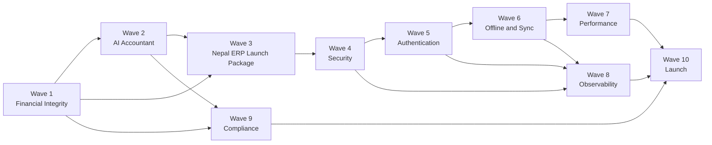

# Production Execution Master Plan

**Project:** NIOS / Sutra ERP  
**Role:** CTO execution authority — single source of truth for all remaining engineering work  
**Generated:** 2026-07-10  
**Status:** Active — no code changes until items are explicitly scheduled  
**Evidence base:** Full repository inspection, `SYSTEM-05`, `SYSTEM-15`, `LAUNCH_CHECKLIST.md`, runtime wiring trace

---

## 1. Purpose & Scope

This document catalogs **every known remaining issue** blocking or affecting commercial launch in Nepal. It does **not** authorize new features. It authorizes **wiring, hardening, scope reduction, and certification** of what already exists.

**Launch definition (v1):** Offline-capable Nepal SME ERP with conversational accounting (e-Khata), deterministic books, VAT/TDS reports, optional CBMS, and honest single-device or repaired multi-device sync.

**Out of scope for v1 launch:** Plugin marketplace, full CQRS cutover, NIOS federation, 214-page surface parity with Tally/Busy.

---

## 2. How to Use This Document

| Field | Meaning |
|-------|---------|
| **Blocks launch** | Must be **Done** before any paid customer or public GA |
| **Effort** | Person-days (1 dev); `S` ≤2, `M` 3–5, `L` 6–10, `XL` 11+ |
| **Risk** | Low / Medium / High / Critical |
| **Dependencies** | Issue IDs that must complete first |

**Issue ID scheme:** `{WAVE}-{NNN}` e.g. `FI-001`, `AI-012`, `SEC-004`

**Cross-references:** `W-###` = SYSTEM-05 weakness; `PB-##` = SYSTEM-15 production blocker; `VG-##` = validation gate

---

## 3. Execution Wave Overview

| Wave | Theme | Issue count | Est. calendar (2–3 seniors) | Launch-critical |
|------|-------|-------------|----------------------------|-----------------|
| 1 | Financial Integrity | 22 | 3–4 weeks | Yes |
| 2 | AI Accountant | 20 | 3–4 weeks | Yes |
| 3 | Nepal ERP Launch Package | 24 | 2–3 weeks | Yes |
| 4 | Security | 18 | 2–3 weeks | Yes |
| 5 | Authentication | 14 | 2 weeks | Yes (if cloud) |
| 6 | Offline & Sync | 24 | 4–8 weeks | Conditional |
| 7 | Performance | 12 | 3–5 weeks | Partial |
| 8 | Observability | 12 | 2 weeks | Yes |
| 9 | Compliance | 18 | 3–4 weeks | Yes |
| 10 | Launch | 16 | 2 weeks | Yes |

---

## 4. Issue Record Template (reference)

Each issue below includes: **ID, Title, Description, Why it matters, Business impact, Technical impact, Files involved, Dependencies, Estimated effort, Risk, Acceptance criteria, Rollback plan, Required tests, Blocks launch**.

---

# Wave 1 — Financial Integrity

> **Wave goal:** One ledger truth. Every screen that shows money must agree with voucher lines to ₹0.01. No silent auto-balancing.

---

### FI-001 — Triple balance truth model

| Field | Value |
|-------|-------|
| **Description** | Three authorities compete: `accounts.balance` denorm on post, voucher-line aggregation in reports, and `_loadAllData` recompute on login. They diverge silently mid-session. |
| **Why it matters** | CA audit failure; users make decisions on wrong numbers. |
| **Business impact** | Critical — legal, trust, churn |
| **Technical impact** | CONTRADICTION-01; W-021, W-170, PB-05 |
| **Files involved** | `src/store/index.ts`, `src/store/slices/voucherSlice.ts`, `src/lib/accounting.ts`, `src/lib/balanceSheetEngine.ts`, `src/lib/profitLossEngine.ts`, `src/pages/TrialBalance.tsx`, `src/pages/BalanceSheet.tsx` |
| **Dependencies** | None (wave entry) |
| **Effort** | L (8d) |
| **Risk** | Critical |
| **Acceptance criteria** | Golden fixture: 100 mixed vouchers → account list, TB, P&L, BS agree ±0.01; SSOT documented in `nios/docs/dexie-pg-canonical.md` |
| **Rollback plan** | Flag `USE_DENORM_BALANCE` restores current denorm write for one release |
| **Required tests** | Unit: `validateDoubleEntry`, TB/BS compute; integration: post invoice → all views match |
| **Blocks launch** | **Yes** |

---

### FI-002 — Eliminate or derive denormalized account balance

| Field | Value |
|-------|-------|
| **Description** | `postInvoiceJournal` and voucher slice write `accounts.balance` directly while reports ignore it. |
| **Why it matters** | Root fix for FI-001. |
| **Business impact** | High |
| **Technical impact** | Removes P3 truth plane (SYSTEM-05.40) |
| **Files involved** | `src/store/index.ts` (`postInvoiceJournal`), `src/store/slices/voucherSlice.ts`, `src/store/slices/accountSlice.ts` |
| **Dependencies** | FI-001 |
| **Effort** | M (5d) |
| **Risk** | High |
| **Acceptance criteria** | Either (A) denorm removed and balance always computed from lines, or (B) denorm updated atomically from same function reports use |
| **Rollback plan** | Keep dual path behind flag until FI-005 passes |
| **Required tests** | Post → edit → cancel → verify balance each step |
| **Blocks launch** | **Yes** |

---

### FI-003 — Round-off auto-balancing masks errors

| Field | Value |
|-------|-------|
| **Description** | Invoice posting auto-posts round-off to `acc-indirect-expenses` instead of rejecting imbalance. |
| **Why it matters** | Hides configuration/tax bugs; W-063. |
| **Business impact** | Medium — misstated expenses |
| **Technical impact** | Silent data corruption |
| **Files involved** | `src/store/index.ts` (`postInvoiceJournal`), `src/components/invoice/SalesInvoiceForm.tsx` |
| **Dependencies** | FI-001 |
| **Effort** | S (2d) |
| **Risk** | Medium |
| **Acceptance criteria** | Imbalance > tolerance throws; round-off only when user enables explicit round-off account |
| **Rollback plan** | Config flag `ALLOW_AUTO_ROUND_OFF` default false |
| **Required tests** | Invoice with deliberate 0.02 imbalance must fail |
| **Blocks launch** | **Yes** |

---

### FI-004 — Pre-post validateDoubleEntry on invoice forms

| Field | Value |
|-------|-------|
| **Description** | `SalesInvoiceForm` saves without calling `validateDoubleEntry` before post; W-042. |
| **Why it matters** | Unbalanced journals can enter books. |
| **Business impact** | High |
| **Technical impact** | Integrity bypass at UI boundary |
| **Files involved** | `src/components/invoice/SalesInvoiceForm.tsx`, `src/pages/SalesVoucher.tsx`, `src/pages/PurchaseVoucher.tsx` |
| **Dependencies** | None |
| **Effort** | S (1d) |
| **Risk** | Low |
| **Acceptance criteria** | Save blocked with clear error if proposed journal unbalanced |
| **Rollback plan** | N/A — safe always |
| **Required tests** | Form validation unit test |
| **Blocks launch** | **Yes** |

---

### FI-005 — Golden accounting fixture suite

| Field | Value |
|-------|-------|
| **Description** | No automated proof that books stay balanced; CI is lint/tsc only; VG-01 failed. |
| **Why it matters** | Cannot certify for Nepal CA firms; PB-07. |
| **Business impact** | Critical — no enterprise sales |
| **Technical impact** | W-178, TD-MIG-08 |
| **Files involved** | New `src/__tests__/accounting/`, `scripts/golden-fixtures/`, `.github/workflows/test.yml`, `src/platform/flags/registry.ts` (`MIGRATION_GOLDEN_CI`) |
| **Dependencies** | FI-001, FI-002 |
| **Effort** | M (5d) |
| **Risk** | Medium |
| **Acceptance criteria** | CI fails on imbalance; covers sales/purchase/returns, TDS, reversal, period lock |
| **Rollback plan** | Advisory-only job first week, then required |
| **Required tests** | Self — the golden suite IS the test |
| **Blocks launch** | **Yes** |

---

### FI-006 — updateInvoice skips stock when journal exists

| Field | Value |
|-------|-------|
| **Description** | Editing posted invoice may not reverse/repost stock; W-016. |
| **Why it matters** | Inventory and COGS diverge from invoices. |
| **Business impact** | High for traders with stock |
| **Technical impact** | Split atomic posting |
| **Files involved** | `src/store/index.ts` (`updateInvoice`), `src/store/slices/inventorySlice.ts` |
| **Dependencies** | FI-001 |
| **Effort** | M (4d) |
| **Risk** | High |
| **Acceptance criteria** | Edit posted invoice → stock movements reversed and reposted in one Dexie transaction |
| **Rollback plan** | Block edit of posted invoices until fixed (UI guard) |
| **Required tests** | Integration: post → edit qty → verify movements |
| **Blocks launch** | **Yes** (if inventory in launch scope) |

---

### FI-007 — PDC convert without transaction wrapper

| Field | Value |
|-------|-------|
| **Description** | `convertPDCToBank` performs multi-step writes without Dexie transaction; W-012. |
| **Why it matters** | Partial PDC conversion corrupts bank book. |
| **Business impact** | Medium |
| **Technical impact** | Non-atomic banking |
| **Files involved** | `src/store/slices/voucherSlice.ts`, `src/pages/PDCManagement.tsx` |
| **Dependencies** | None |
| **Effort** | S (2d) |
| **Risk** | High |
| **Acceptance criteria** | All PDC conversion steps in single `db.transaction`; failure rolls back |
| **Rollback plan** | Disable PDC convert button until fixed |
| **Required tests** | Simulate mid-failure → no partial state |
| **Blocks launch** | **No** (unless PDC in launch menu) |

---

### FI-008 — Voucher cancel bypasses period lock

| Field | Value |
|-------|-------|
| **Description** | Cancel/reversal can target locked periods; W-069, W-070. |
| **Why it matters** | Audit control failure. |
| **Business impact** | High for audited clients |
| **Technical impact** | Period lock invariant broken |
| **Files involved** | `src/store/slices/voucherSlice.ts`, `src/lib/accounting.ts` |
| **Dependencies** | None |
| **Effort** | S (2d) |
| **Risk** | Medium |
| **Acceptance criteria** | Cancel/reversal respects `periodLocks` same as post |
| **Rollback plan** | N/A |
| **Required tests** | Lock period → attempt cancel → must fail |
| **Blocks launch** | **Yes** |

---

### FI-009 — Serial number collision race

| Field | Value |
|-------|-------|
| **Description** | `generateSerialNumberSync` uses max-scan without lock; multi-tab collision; W-068, W-072. |
| **Why it matters** | Duplicate voucher numbers break audit trail. |
| **Business impact** | High |
| **Technical impact** | Concurrency bug |
| **Files involved** | `src/lib/accounting.ts`, `src/store/slices/voucherSlice.ts` |
| **Dependencies** | None |
| **Effort** | M (3d) |
| **Risk** | Medium |
| **Acceptance criteria** | Atomic increment inside Dexie transaction; no duplicates under parallel test |
| **Rollback plan** | UUID suffix fallback |
| **Required tests** | Parallel post stress test |
| **Blocks launch** | **Yes** |

---

### FI-010 — Hardcoded chart-of-accounts IDs

| Field | Value |
|-------|-------|
| **Description** | Posting uses magic strings `acc-sales`, `acc-purchase`, etc.; W-064, TD-06. |
| **Why it matters** | Breaks on non-seed COA; Nepal implementations vary. |
| **Business impact** | Medium |
| **Technical impact** | Fragile posting |
| **Files involved** | `src/store/index.ts`, seed data in `src/store/index.ts` init |
| **Dependencies** | None |
| **Effort** | M (5d) |
| **Risk** | Medium |
| **Acceptance criteria** | Posting resolves accounts by type/code mapping table, not hardcoded IDs |
| **Rollback plan** | Seed COA mapping file |
| **Required tests** | Custom COA company → post still works |
| **Blocks launch** | **Yes** |

---

### FI-011 — Party balance not updated from khata/vouchers

| Field | Value |
|-------|-------|
| **Description** | Party outstanding can drift from ledger; W-023. |
| **Why it matters** | Udhar/credit tracking wrong. |
| **Business impact** | High for Khata users |
| **Technical impact** | Secondary truth plane |
| **Files involved** | `src/store/index.ts`, `src/lib/billWiseEngine.ts`, khata confirm path |
| **Dependencies** | FI-001, AI-003 |
| **Effort** | M (4d) |
| **Risk** | Medium |
| **Acceptance criteria** | Party balance = sum of open bill-wise entries from vouchers |
| **Rollback plan** | Compute on read only |
| **Required tests** | Khata confirm → party balance matches ledger |
| **Blocks launch** | **Yes** |

---

### FI-012 — Triple P&L / Balance Sheet implementation paths

| Field | Value |
|-------|-------|
| **Description** | `accounting.ts`, `balanceSheetEngine.ts`, `nepalFinancialStatements.ts`, and shadow `report-engine` disagree; W-167. |
| **Why it matters** | Different reports show different profit. |
| **Business impact** | Critical |
| **Technical impact** | Report SSOT violation |
| **Files involved** | `src/lib/accounting.ts`, `src/lib/balanceSheetEngine.ts`, `src/lib/profitLossEngine.ts`, `src/lib/nepalFinancialStatements.ts`, `src/domains/report-engine/` |
| **Dependencies** | FI-001 |
| **Effort** | M (5d) |
| **Risk** | High |
| **Acceptance criteria** | Launch-scope reports call one engine; golden snapshots match |
| **Rollback plan** | Document which report uses which engine; hide others |
| **Required tests** | Golden BS/P&L for FY 2081/82 sample |
| **Blocks launch** | **Yes** |

---

### FI-013 — Audit log failure swallowed

| Field | Value |
|-------|-------|
| **Description** | Voucher add catches audit write errors silently; W-017. |
| **Why it matters** | Compliance trail incomplete without user knowing. |
| **Business impact** | Medium |
| **Technical impact** | Silent failure |
| **Files involved** | `src/store/slices/voucherSlice.ts` |
| **Dependencies** | None |
| **Effort** | S (1d) |
| **Risk** | Low |
| **Acceptance criteria** | Audit failure surfaces toast + structured log; post still succeeds or fails per policy (document choice) |
| **Rollback plan** | N/A |
| **Required tests** | Mock audit failure → user notified |
| **Blocks launch** | **No** |

---

### FI-014 — Partial voucher merge in updateVoucher

| Field | Value |
|-------|-------|
| **Description** | Zustand merge may leave stale nested fields; W-027. |
| **Why it matters** | UI shows old line data after edit. |
| **Business impact** | Medium |
| **Technical impact** | State corruption |
| **Files involved** | `src/store/slices/voucherSlice.ts`, `src/store/index.ts` |
| **Dependencies** | None |
| **Effort** | S (2d) |
| **Risk** | Medium |
| **Acceptance criteria** | Full voucher replace on update; Dexie and RAM consistent |
| **Rollback plan** | Force reload after edit |
| **Required tests** | Edit lines → save → reload → verify |
| **Blocks launch** | **No** |

---

### FI-015 — Inactive party check incorrect

| Field | Value |
|-------|-------|
| **Description** | Invoice can post to inactive party; W-065. |
| **Why it matters** | Data quality / fraud |
| **Business impact** | Low |
| **Technical impact** | Validation gap |
| **Files involved** | `src/store/index.ts` (`addInvoice`), `src/components/invoice/SalesInvoiceForm.tsx` |
| **Dependencies** | None |
| **Effort** | S (1d) |
| **Risk** | Low |
| **Acceptance criteria** | Post blocked for inactive party with clear message |
| **Rollback plan** | N/A |
| **Required tests** | Unit validation test |
| **Blocks launch** | **No** |

---

### FI-016 — Random invoice line IDs

| Field | Value |
|-------|-------|
| **Description** | Line IDs use `Math.random()`; sync/edit fragile; W-066. |
| **Why it matters** | Orphan lines on edit/sync. |
| **Business impact** | Medium |
| **Technical impact** | Identity instability |
| **Files involved** | `src/components/invoice/SalesInvoiceForm.tsx`, `src/store/index.ts` |
| **Dependencies** | None |
| **Effort** | S (1d) |
| **Risk** | Low |
| **Acceptance criteria** | Stable `generateId()` for all line IDs |
| **Rollback plan** | N/A |
| **Required tests** | IDs unique and stable across edit |
| **Blocks launch** | **No** (Yes if sync in scope — see SYNC-019) |

---

### FI-017 — guardPostedVoucher inconsistent

| Field | Value |
|-------|-------|
| **Description** | Some paths allow edit of posted vouchers, others don't; W-075. |
| **Why it matters** | Unpredictable immutability. |
| **Business impact** | Medium |
| **Technical impact** | Inconsistent guards |
| **Files involved** | `src/store/slices/voucherSlice.ts`, various pages |
| **Dependencies** | FI-008 |
| **Effort** | S (2d) |
| **Risk** | Medium |
| **Acceptance criteria** | Single `assertEditableVoucher()` used everywhere |
| **Rollback plan** | N/A |
| **Required tests** | All edit entry points tested |
| **Blocks launch** | **Yes** |

---

### FI-018 — Banking operations non-transactional

| Field | Value |
|-------|-------|
| **Description** | Several banking ops in voucherSlice lack transaction wrappers; W-076. |
| **Why it matters** | Partial bank updates. |
| **Business impact** | Medium |
| **Technical impact** | Integrity |
| **Files involved** | `src/store/slices/voucherSlice.ts`, `src/pages/BankReconciliation.tsx` |
| **Dependencies** | FI-007 |
| **Effort** | M (4d) |
| **Risk** | Medium |
| **Acceptance criteria** | Audit all banking write paths; wrap in Dexie transactions |
| **Rollback plan** | Disable affected actions |
| **Required tests** | Banking integration tests |
| **Blocks launch** | **No** (Yes if bank reco in launch menu) |

---

### FI-019 — StockAdjustment bypasses inventory slice valuation

| Field | Value |
|-------|-------|
| **Description** | Direct adjustment path skips valuation policy; MR-10. |
| **Why it matters** | COGS and stock value wrong. |
| **Business impact** | Medium |
| **Technical impact** | Invariant drift |
| **Files involved** | `src/pages/PhysicalStockPage.tsx`, `src/store/slices/inventorySlice.ts` |
| **Dependencies** | FI-006 |
| **Effort** | S (2d) |
| **Risk** | Medium |
| **Acceptance criteria** | All adjustments route through `inventorySlice` with valuation method |
| **Rollback plan** | N/A |
| **Required tests** | FIFO/WAvg adjustment test |
| **Blocks launch** | **No** |

---

### FI-020 — Negative stock policy undefined

| Field | Value |
|-------|-------|
| **Description** | Behavior when qty < 0 not consistently enforced; W-081. |
| **Why it matters** | Inventory truth unknown. |
| **Business impact** | Medium |
| **Technical impact** | Evidence gap |
| **Files involved** | `src/store/index.ts` (`postInvoiceStock`), `src/domains/inventory-engine/` |
| **Dependencies** | FI-006 |
| **Effort** | S (2d) |
| **Risk** | Medium |
| **Acceptance criteria** | Policy documented and enforced: block or allow with flag per company setting |
| **Rollback plan** | Default block |
| **Required tests** | Oversell attempt test |
| **Blocks launch** | **No** |

---

### FI-021 — periodLocks schema / enforcement gap

| Field | Value |
|-------|-------|
| **Description** | Period lock table may not cover all voucher types; W-074. |
| **Why it matters** | Year-end close incomplete. |
| **Business impact** | High for CAs |
| **Technical impact** | Control gap |
| **Files involved** | `src/lib/db.ts`, `src/store/slices/voucherSlice.ts`, `src/pages/YearEndProcess.tsx` |
| **Dependencies** | FI-008 |
| **Effort** | M (3d) |
| **Risk** | Medium |
| **Acceptance criteria** | All post paths call `enforcePeriodLock`; year-end locks all modules in scope |
| **Rollback plan** | N/A |
| **Required tests** | Lock → attempt post on each voucher type |
| **Blocks launch** | **Yes** |

---

### FI-022 — Init failure masks DB not ready

| Field | Value |
|-------|-------|
| **Description** | `initializeApp` catch sets `isDbReady: true` on failure; W-005. |
| **Why it matters** | User posts into broken DB. |
| **Business impact** | High |
| **Technical impact** | Destructive UX |
| **Files involved** | `src/store/index.ts`, `src/lib/db.ts` |
| **Dependencies** | None |
| **Effort** | S (1d) |
| **Risk** | High |
| **Acceptance criteria** | DB init failure shows blocking error screen; no writes allowed |
| **Rollback plan** | N/A |
| **Required tests** | Mock IDB failure → UI blocked |
| **Blocks launch** | **Yes** |

---

# Wave 2 — AI Accountant

> **Wave goal:** One AI confirm path into deterministic posting. AI proposes; human confirms; same pipeline as manual forms.

---

### AI-001 — AI posted disconnect (server vs Dexie)

| Field | Value |
|-------|-------|
| **Description** | Server/chat can imply "posted" while Dexie has no matching voucher; W-106, PB-03. |
| **Why it matters** | Core product promise broken. |
| **Business impact** | Critical |
| **Technical impact** | P5 truth plane (SYSTEM-05.40) |
| **Files involved** | `src/store/eKhataStore.ts`, `src/lib/ekhata/processMessage.ts`, `erp_bot/src/khata/entry_engine.py`, `erp_bot/src/conversation/manager.py` |
| **Dependencies** | FI-001 |
| **Effort** | M (5d) |
| **Risk** | Critical |
| **Acceptance criteria** | Success toast only after Dexie commit; server never claims posted without client confirm |
| **Rollback plan** | Change copy to "draft ready" until confirm |
| **Required tests** | E2E: confirm → voucher in Dexie; network failure → no false success |
| **Blocks launch** | **Yes** |

---

### AI-002 — e-Khata bypasses proposal/approval pipeline

| Field | Value |
|-------|-------|
| **Description** | `confirmKhataEntry` writes directly; F13 unused; VG-10 failed; W-094, HR-07. |
| **Why it matters** | No AI governance for money mutations. |
| **Business impact** | High |
| **Technical impact** | PB-03, MIGRATION_NIOS_COMMAND_GATE not enforced |
| **Files involved** | `src/store/eKhataStore.ts`, `src/domains/ai-proposal/`, `src/domains/nios-core/commandGateway.ts` |
| **Dependencies** | AI-001 |
| **Effort** | M (5d) |
| **Risk** | High |
| **Acceptance criteria** | Confirm → proposal → approval gate → `executeCommand` or legacy post; `MIGRATION_AI_EXECUTION` honored |
| **Rollback plan** | Keep direct path behind flag for internal dev |
| **Required tests** | VG-10 scenario; unapproved proposal cannot write |
| **Blocks launch** | **Yes** |

---

### AI-003 — Unify khata confirm into addVoucher/addInvoice pipeline

| Field | Value |
|-------|-------|
| **Description** | Khata uses parallel confirm logic vs invoice forms; W-061 triple khata. |
| **Why it matters** | Different rules → different books. |
| **Business impact** | Critical |
| **Technical impact** | Duplicate posting logic |
| **Files involved** | `src/lib/ekhata/*`, `src/store/index.ts`, `src/components/invoice/SalesInvoiceForm.tsx` |
| **Dependencies** | AI-001, FI-011 |
| **Effort** | M (4d) |
| **Risk** | High |
| **Acceptance criteria** | Same journal output for equivalent NL and form entry (golden pairs) |
| **Rollback plan** | N/A |
| **Required tests** | 15/15 NLU + ledger 6/6 + new parity pairs |
| **Blocks launch** | **Yes** |

---

### AI-004 — Khata confirm idempotency

| Field | Value |
|-------|-------|
| **Description** | Double-tap confirm can duplicate vouchers; W-014, W-149. |
| **Why it matters** | Duplicate udhar entries. |
| **Business impact** | High |
| **Technical impact** | No idempotency key on confirm |
| **Files involved** | `src/store/eKhataStore.ts`, `src/lib/ekhata/processMessage.ts` |
| **Dependencies** | AI-003 |
| **Effort** | S (2d) |
| **Risk** | Medium |
| **Acceptance criteria** | Same confirm card ID → single voucher |
| **Rollback plan** | Disable double-submit in UI |
| **Required tests** | Double confirm test |
| **Blocks launch** | **Yes** |

---

### AI-005 — Nested Dexie transactions in khata confirm

| Field | Value |
|-------|-------|
| **Description** | Outer/inner transactions in confirm path; W-011, HR-04. |
| **Why it matters** | Unclear rollback on partial failure. |
| **Business impact** | High |
| **Technical impact** | Transaction integrity |
| **Files involved** | `src/store/eKhataStore.ts`, khata confirm helpers |
| **Dependencies** | AI-003 |
| **Effort** | S (2d) |
| **Risk** | High |
| **Acceptance criteria** | Single top-level transaction per confirm |
| **Rollback plan** | N/A |
| **Required tests** | Failure injection mid-confirm |
| **Blocks launch** | **Yes** |

---

### AI-006 — Khata batch partial failure

| Field | Value |
|-------|-------|
| **Description** | Compound entries can partially post; W-013. |
| **Why it matters** | Half-posted compound transactions. |
| **Business impact** | Medium |
| **Technical impact** | No compensation |
| **Files involved** | `src/lib/ekhata/processMessage.ts`, `erp_bot/src/nlu/compound_entry_batch.py` |
| **Dependencies** | AI-005 |
| **Effort** | M (3d) |
| **Risk** | Medium |
| **Acceptance criteria** | All-or-nothing batch post |
| **Rollback plan** | Reject compound in v1 |
| **Required tests** | Batch with one invalid line |
| **Blocks launch** | **No** |

---

### AI-007 — Four parallel client AI stacks

| Field | Value |
|-------|-------|
| **Description** | e-Khata, Falcon, SUTRA AI, NIOS client coexist; W-103, AD-01. |
| **Why it matters** | Unmaintainable; inconsistent behavior. |
| **Business impact** | Medium |
| **Technical impact** | PB-08 |
| **Files involved** | `src/store/eKhataStore.ts`, `src/store/falconStore.ts`, `src/store/sutraAiStore.ts`, `src/store/niosStore.ts`, `src/components/Layout.tsx` |
| **Dependencies** | AI-002 |
| **Effort** | L (8d) |
| **Risk** | Medium |
| **Acceptance criteria** | Launch UI exposes e-Khata only for accounting; others hidden or help-only |
| **Rollback plan** | Feature flags per assistant |
| **Required tests** | Smoke: only e-Khata can post |
| **Blocks launch** | **Yes** |

---

### AI-008 — Three parallel server intelligence stacks

| Field | Value |
|-------|-------|
| **Description** | Legacy agent, Orbix, NIOS gateway, conversation manager; W-104, AD-02. |
| **Why it matters** | Ops complexity; wrong routing. |
| **Business impact** | Medium |
| **Technical impact** | Multiple entry points |
| **Files involved** | `erp_bot/src/api/server.py`, `erp_bot/src/agent/`, `erp_bot/src/orbix/`, `erp_bot/src/nios/gateway.py`, `erp_bot/src/conversation/manager.py` |
| **Dependencies** | AI-007 |
| **Effort** | M (5d) |
| **Risk** | Medium |
| **Acceptance criteria** | Documented routing: khata → entry_engine; help → falcon; single prod khata path |
| **Rollback plan** | Keep legacy routes for dev |
| **Required tests** | Route matrix integration test |
| **Blocks launch** | **No** |

---

### AI-009 — platform/ai-runtime not wired (flag off)

| Field | Value |
|-------|-------|
| **Description** | `MIGRATION_AI_RUNTIME: false`; 73 files unused in prod; unit tests TODO. |
| **Why it matters** | Future architecture idle. |
| **Business impact** | Low for v1 |
| **Technical impact** | Dead code path |
| **Files involved** | `src/platform/ai-runtime/`, `src/platform/flags/registry.ts` |
| **Dependencies** | AI-002 |
| **Effort** | XL (15d) — defer post-launch |
| **Risk** | Low |
| **Acceptance criteria** | Document as Phase 2; flag stays false for v1 |
| **Rollback plan** | Flag stays false |
| **Required tests** | Optional `scripts/test-ai-runtime.ts` |
| **Blocks launch** | **No** |

---

### AI-010 — Dual proposal stores (F12 vs F13)

| Field | Value |
|-------|-------|
| **Description** | nios-core and ai-proposal separate proposal state; HR-06. |
| **Why it matters** | Broken governance model. |
| **Business impact** | Medium |
| **Technical impact** | TD-MIG-05 |
| **Files involved** | `src/domains/nios-core/`, `src/domains/ai-proposal/` |
| **Dependencies** | AI-002 |
| **Effort** | M (4d) |
| **Risk** | Medium |
| **Acceptance criteria** | Single proposal store; one approval UI |
| **Rollback plan** | Use ai-proposal only |
| **Required tests** | Proposal lifecycle test |
| **Blocks launch** | **Yes** |

---

### AI-011 — Approval UI before AI execution

| Field | Value |
|-------|-------|
| **Description** | No enforced approval for AI-initiated writes; MIGRATION_AI_EXECUTION false. |
| **Why it matters** | Trust and liability for AI accountant. |
| **Business impact** | High |
| **Technical impact** | VG-10 |
| **Files involved** | `src/domains/ai-proposal/approval/`, `src/components/ekhata/` |
| **Dependencies** | AI-010 |
| **Effort** | M (5d) |
| **Risk** | Medium |
| **Acceptance criteria** | Confirm card required; high-risk actions need explicit second confirm |
| **Rollback plan** | N/A |
| **Required tests** | UX: user must confirm before write |
| **Blocks launch** | **Yes** |

---

### AI-012 — Khata confirm skips stock movements

| Field | Value |
|-------|-------|
| **Description** | Inventory khata entries skip stock; W-071. |
| **Why it matters** | Wrong stock for traders. |
| **Business impact** | Medium |
| **Technical impact** | Incomplete posting |
| **Files involved** | Khata confirm path, `src/store/index.ts` |
| **Dependencies** | AI-003, FI-006 |
| **Effort** | M (4d) |
| **Risk** | Medium |
| **Acceptance criteria** | Stock khata entries create movements when inventory enabled |
| **Rollback plan** | Document financial-only khata in v1 |
| **Required tests** | Stock khata integration |
| **Blocks launch** | **No** |

---

### AI-013 — eKhataStore ignores /v2/chat

| Field | Value |
|-------|-------|
| **Description** | Server v2 conversation manager unused; W-107. |
| **Why it matters** | Best server path unused. |
| **Business impact** | Low |
| **Technical impact** | Split brain |
| **Files involved** | `src/store/eKhataStore.ts`, `erp_bot/src/conversation/manager.py` |
| **Dependencies** | AI-008 |
| **Effort** | M (3d) |
| **Risk** | Low |
| **Acceptance criteria** | Online path documented and tested |
| **Rollback plan** | Offline brain only |
| **Required tests** | Online/offline routing test |
| **Blocks launch** | **No** |

---

### AI-014 — NIOS cache message-only key collision

| Field | Value |
|-------|-------|
| **Description** | Cache key ignores session/context; W-109. |
| **Why it matters** | Wrong answer reused. |
| **Business impact** | Medium |
| **Technical impact** | Incorrect AI responses |
| **Files involved** | `erp_bot/src/nios/gateway.py` |
| **Dependencies** | None |
| **Effort** | S (1d) |
| **Risk** | Medium |
| **Acceptance criteria** | Cache key includes tenant, session, company |
| **Rollback plan** | Disable cache |
| **Required tests** | Context collision test |
| **Blocks launch** | **No** |

---

### AI-015 — processMessage god-router

| Field | Value |
|-------|-------|
| **Description** | 30+ try branches; W-112, TD-08. |
| **Why it matters** | Regression risk. |
| **Business impact** | Medium |
| **Technical impact** | Maintainability |
| **Files involved** | `src/lib/ekhata/processMessage.ts` |
| **Dependencies** | AI-003 |
| **Effort** | L (10d) — partial defer OK |
| **Risk** | Medium |
| **Acceptance criteria** | All ekhata-ci tests pass |
| **Rollback plan** | N/A |
| **Required tests** | Full ekhata-ci suite |
| **Blocks launch** | **No** |

---

### AI-016 — runtimeMaps bundle bloat

| Field | Value |
|-------|-------|
| **Description** | 8000+ line generated maps; W-113. |
| **Why it matters** | Slow mobile load. |
| **Business impact** | Medium |
| **Technical impact** | Performance |
| **Files involved** | `src/lib/nepal-ai/generated/runtimeMaps.ts` |
| **Dependencies** | PERF-003 |
| **Effort** | M (5d) |
| **Risk** | Low |
| **Acceptance criteria** | Lazy load or split maps |
| **Rollback plan** | N/A |
| **Required tests** | Bundle size CI budget |
| **Blocks launch** | **No** |

---

### AI-017 — Offline vs LLM path parity

| Field | Value |
|-------|-------|
| **Description** | Offline and online paths disagree; AD-07. |
| **Why it matters** | Different results with/without Ollama. |
| **Business impact** | Medium |
| **Technical impact** | User confusion |
| **Files involved** | `src/lib/ekhata/processMessage.ts`, `scripts/test-ekhata-parser-parity.ts` |
| **Dependencies** | AI-003 |
| **Effort** | M (4d) |
| **Risk** | Medium |
| **Acceptance criteria** | Parser parity in CI |
| **Rollback plan** | Online-only flag |
| **Required tests** | `test:ekhata-parser-parity` in main CI |
| **Blocks launch** | **Yes** |

---

### AI-018 — emitNiosEvent swallowed

| Field | Value |
|-------|-------|
| **Description** | Client NIOS events fail silently; W-041, W-118. |
| **Why it matters** | Missing AI context. |
| **Business impact** | Low |
| **Technical impact** | W-165 |
| **Files involved** | `src/nios/events/eventBus.ts` |
| **Dependencies** | None |
| **Effort** | S (1d) |
| **Risk** | Low |
| **Acceptance criteria** | Failures logged |
| **Rollback plan** | N/A |
| **Required tests** | Mock failure → log |
| **Blocks launch** | **No** |

---

### AI-019 — NLU tests in main CI

| Field | Value |
|-------|-------|
| **Description** | 15/15 NLU only in path-filtered workflow. |
| **Why it matters** | Main can break Khata silently. |
| **Business impact** | High |
| **Technical impact** | CI gap |
| **Files involved** | `.github/workflows/test.yml`, `erp_bot/scripts/test_falcon_trader_nlu.py` |
| **Dependencies** | None |
| **Effort** | S (1d) |
| **Risk** | Low |
| **Acceptance criteria** | Main CI runs NLU 15/15 |
| **Rollback plan** | N/A |
| **Required tests** | Self |
| **Blocks launch** | **Yes** |

---

### AI-020 — Playwright e-Khata E2E gate

| Field | Value |
|-------|-------|
| **Description** | E2E not in main test.yml. |
| **Why it matters** | AI UX regressions. |
| **Business impact** | High |
| **Technical impact** | Coverage gap |
| **Files involved** | `e2e/ekhata-panel.spec.ts`, `.github/workflows/test.yml` |
| **Dependencies** | AI-003 |
| **Effort** | S (2d) |
| **Risk** | Low |
| **Acceptance criteria** | E2E on release branch |
| **Rollback plan** | Documented manual UAT |
| **Blocks launch** | **Yes** |

---

# Wave 3 — Nepal ERP Launch Package

> **Wave goal:** Ship a honest, wired "Busy Core" — every marketed screen works; no mock data; no silent fallbacks.

**Launch Core menu (reference):** Dashboard, COA, Parties, Items, Sales/Purchase Invoice, Journal/Payment/Receipt, Day Book, TB, P&L, BS, VAT/TDS reports, Bank Reco (import), e-Khata.

---

### ERP-001 — 107 unwired pages / FinancialDashboard fallback

| **Description** | ~107 of 214 pages not in `App.tsx` switch; land on empty dashboard; W-172, TD-04 |
| **Why it matters** | Users click menu items → blank/wrong screen |
| **Business impact** | Critical trust |
| **Technical impact** | PB-12, HR-10 |
| **Files** | `src/App.tsx`, menu components, `src/pages/FinancialDashboard.tsx` |
| **Dependencies** | None |
| **Effort** | M (5d) |
| **Risk** | Medium |
| **Acceptance criteria** | Every visible menu item has wired route OR is hidden |
| **Rollback** | Hide unreleased menu sections |
| **Tests** | Menu crawl script |
| **Blocks launch** | **Yes** |

### ERP-002 — Define and publish Launch Core sitemap

| **Description** | No authoritative list of v1 modules |
| **Why it matters** | Sales/support/eng misalignment |
| **Business impact** | High |
| **Technical impact** | Scope control |
| **Files** | New `docs/LAUNCH_CORE_SITEMAP.md`, `src/App.tsx` |
| **Dependencies** | ERP-001 |
| **Effort** | S (1d) |
| **Risk** | Low |
| **Acceptance criteria** | Signed sitemap; only listed modules visible |
| **Rollback** | N/A |
| **Tests** | Review checklist |
| **Blocks launch** | **Yes** |

### ERP-003 — VouchersLog mock data

| **Description** | Page uses hardcoded mock, not store; shell page |
| **Why it matters** | Fake data in production |
| **Business impact** | High |
| **Technical impact** | Misleading UI |
| **Files** | `src/pages/VouchersLog.tsx` |
| **Dependencies** | ERP-001 |
| **Effort** | S (2d) |
| **Risk** | Low |
| **Acceptance criteria** | Reads real vouchers OR page removed from menu |
| **Rollback** | Hide page |
| **Tests** | Render with seed data |
| **Blocks launch** | **Yes** |

### ERP-004 — VouchersRegisterFull coming-soon actions

| **Description** | View/Print show "coming soon" toasts |
| **Why it matters** | Broken register workflow |
| **Business impact** | Medium |
| **Technical impact** | Incomplete feature |
| **Files** | `src/pages/VouchersRegisterFull.tsx` |
| **Dependencies** | ERP-001 |
| **Effort** | S (2d) |
| **Risk** | Low |
| **Acceptance criteria** | Print works via `printUtils` OR page hidden |
| **Rollback** | Hide |
| **Tests** | Print smoke |
| **Blocks launch** | **No** |

### ERP-005 — Duplicate invoice UIs (BillingInvoice vs SalesVoucher)

| **Description** | Two full sales entry implementations |
| **Why it matters** | Maintenance drift; different bugs |
| **Business impact** | Medium |
| **Technical impact** | Duplicate logic |
| **Files** | `src/pages/BillingInvoice.tsx`, `src/pages/SalesVoucher.tsx`, `src/components/invoice/SalesInvoiceForm.tsx` |
| **Dependencies** | ERP-002 |
| **Effort** | M (4d) |
| **Risk** | Medium |
| **Acceptance criteria** | One primary path in launch menu; other deprecated/hidden |
| **Rollback** | Keep both, document primary |
| **Tests** | Post via both → same Dexie shape |
| **Blocks launch** | **No** |

### ERP-006 — Payroll employee master split-brain

| **Description** | `PayrollRun` uses Dexie; `PayrollProcessing` uses localStorage; W-061 adjacent |
| **Why it matters** | Wrong payroll on wrong employee set |
| **Business impact** | High |
| **Technical impact** | Dual persistence |
| **Files** | `src/pages/PayrollRun.tsx`, `src/pages/PayrollProcessing.tsx`, `src/store/index.ts` |
| **Dependencies** | ERP-002 |
| **Effort** | M (3d) |
| **Risk** | High |
| **Acceptance criteria** | Single `employees` source in Dexie |
| **Rollback** | Hide PayrollProcessing |
| **Tests** | Add employee → appears in both flows |
| **Blocks launch** | **Yes** (if payroll in scope) |

### ERP-007 — POSBilling fire-and-forget writes

| **Description** | Swallowed errors on POS post; HR-03 |
| **Why it matters** | Silent data loss at counter |
| **Business impact** | High |
| **Technical impact** | Unhandled promise |
| **Files** | `src/pages/POSBilling.tsx`, `src/pages/POSMode.tsx` |
| **Dependencies** | FI-004 |
| **Effort** | S (2d) |
| **Risk** | High |
| **Acceptance criteria** | Errors surfaced; await post completion |
| **Rollback** | Hide POS from launch menu |
| **Tests** | Failure injection |
| **Blocks launch** | **No** |

### ERP-008 — Consolidate bank reconciliation pages

| **Description** | BankReconciliation, AutoBankReconciliation, SmartBankReconciliation overlap |
| **Why it matters** | User confusion; duplicate maintenance |
| **Business impact** | Medium |
| **Technical impact** | Fragmented UX |
| **Files** | `src/pages/BankReconciliation.tsx`, `src/pages/AutoBankReconciliation.tsx`, `src/pages/SmartBankReconciliation.tsx` |
| **Dependencies** | ERP-002 |
| **Effort** | M (4d) |
| **Risk** | Low |
| **Acceptance criteria** | One bank reco in launch menu |
| **Rollback** | Hide extras |
| **Tests** | Import + match smoke |
| **Blocks launch** | **No** |

### ERP-009 — @ts-nocheck on launch-scope pages

| **Description** | ~130 files with @ts-nocheck; TD-03 |
| **Why it matters** | Type errors hide posting bugs |
| **Business impact** | Medium |
| **Technical impact** | W-134 |
| **Files** | Launch-scope pages per ERP-002 |
| **Dependencies** | ERP-002 |
| **Effort** | L (10d) — prioritize launch pages first |
| **Risk** | Medium |
| **Acceptance criteria** | Zero @ts-nocheck on launch-scope pages |
| **Rollback** | N/A |
| **Tests** | tsc strict on scope |
| **Blocks launch** | **No** (Yes for listed launch pages: partial) |

### ERP-010 — Dead form components in repo

| **Description** | StockItems, PurchaseInvoiceForm, ReturnInvoiceForm unused per AGENTS.md |
| **Why it matters** | Confuses contributors |
| **Business impact** | Low |
| **Technical impact** | LR-09 |
| **Files** | Dead files (do not edit per rules — mark deprecated in docs only) |
| **Dependencies** | None |
| **Effort** | S (1d) |
| **Risk** | Low |
| **Acceptance criteria** | Documented as dead in LAUNCH_CORE_SITEMAP |
| **Rollback** | N/A |
| **Tests** | N/A |
| **Blocks launch** | **No** |

### ERP-011 — String routing vs React Router

| **Description** | `currentPage` string switch; W-172, AD-03 |
| **Why it matters** | No deep links; fragile nav |
| **Business impact** | Medium |
| **Technical impact** | Maintainability |
| **Files** | `src/App.tsx`, `scripts/build-falcon-page-index.mjs` |
| **Dependencies** | ERP-001 |
| **Effort** | XL (20d) — **post-v1** |
| **Risk** | Medium |
| **Acceptance criteria** | v1: stable string routes for launch menu only |
| **Rollback** | N/A |
| **Tests** | Nav integration |
| **Blocks launch** | **No** |

### ERP-012 — Falcon page index stale coupling

| **Description** | Nav index built from filesystem; W-173, W-036 |
| **Why it matters** | Falcon sends users to unwired pages |
| **Business impact** | Medium |
| **Technical impact** | Hidden coupling |
| **Files** | `scripts/build-falcon-page-index.mjs`, `src/lib/falcon/` |
| **Dependencies** | ERP-001, ERP-002 |
| **Effort** | S (2d) |
| **Risk** | Low |
| **Acceptance criteria** | Index only includes launch-core wired routes |
| **Rollback** | Disable Falcon nav suggestions |
| **Tests** | Index build + sample queries |
| **Blocks launch** | **No** |

### ERP-013 — God store direct page mutations

| **Description** | 190+ pages call `useStore` directly; PB-01, W-001 |
| **Why it matters** | Blocks platform migration; untestable |
| **Business impact** | Medium for v1 if books correct |
| **Technical impact** | VG-03 failed |
| **Files** | `src/pages/**`, `src/store/index.ts`, `src/store/facadeWriteRouter.ts` |
| **Dependencies** | FI-005 — **post-launch full strangler** |
| **Effort** | XL (30d) |
| **Risk** | High |
| **Acceptance criteria** | v1: launch pages use store safely; post-v1: facades only |
| **Rollback** | MIGRATION_DOMAIN_FACADES false |
| **Tests** | Incremental per page |
| **Blocks launch** | **No** (Yes for F15 cutover) |

### ERP-014 — Inventory valuation beyond FIFO/WAvg

| **Description** | LIFO, standard cost stubs return 0 |
| **Why it matters** | Wrong COGS if user selects unsupported method |
| **Business impact** | Medium |
| **Technical impact** | Shadow engine incomplete |
| **Files** | `src/domains/inventory-engine/`, `src/pages/StockBook.tsx` |
| **Dependencies** | ERP-002 |
| **Effort** | M (5d) |
| **Risk** | Medium |
| **Acceptance criteria** | Unsupported methods hidden OR implemented |
| **Rollback** | FIFO/WAvg only in UI |
| **Tests** | Valuation unit tests |
| **Blocks launch** | **No** |

### ERP-015 — Stock not in sync scope (document)

| **Description** | Stock movements not synced; W-078, W-047 |
| **Why it matters** | Multi-device stock wrong |
| **Business impact** | High if sync marketed |
| **Technical impact** | Partial sync |
| **Files** | `src/lib/syncEngine.ts`, `docs/LAUNCH_CORE_SITEMAP.md` |
| **Dependencies** | SYNC-015 |
| **Effort** | S (1d) doc + SYNC fix |
| **Risk** | Medium |
| **Acceptance criteria** | Documented OR fixed in SYNC wave |
| **Rollback** | Single-device messaging |
| **Tests** | Sync integration |
| **Blocks launch** | **Conditional** |

### ERP-016 — AdvancedReportHub / ReportScheduler shells

| **Description** | Report hub pages likely partial implementations |
| **Why it matters** | Enterprise feature expectations |
| **Business impact** | Low |
| **Technical impact** | Scope creep |
| **Files** | `src/pages/AdvancedReportHub.tsx`, `src/pages/ReportScheduler.tsx` |
| **Dependencies** | ERP-002 |
| **Effort** | S (1d) |
| **Risk** | Low |
| **Acceptance criteria** | Hidden from launch menu |
| **Rollback** | N/A |
| **Tests** | N/A |
| **Blocks launch** | **No** |

### ERP-017 — Year-end and opening balance UX certification

| **Description** | Year-end is large real UI; needs UAT |
| **Why it matters** | FY close is CA-critical in Nepal |
| **Business impact** | High |
| **Technical impact** | Complex workflow |
| **Files** | `src/pages/YearEndProcess.tsx`, `src/pages/OpeningBalance.tsx` |
| **Dependencies** | FI-021 |
| **Effort** | M (3d) |
| **Risk** | Medium |
| **Acceptance criteria** | CA walkthrough on FY 2081/82 sample company |
| **Rollback** | Manual journal workaround documented |
| **Tests** | Golden year-end fixture |
| **Blocks launch** | **Yes** (for full ERP claim) |

### ERP-018 — Nepali date consistency

| **Description** | BS/AD mixing across pages |
| **Why it matters** | Nepal users expect BS primary |
| **Business impact** | Medium |
| **Technical impact** | UX |
| **Files** | `src/components/ui/NepaliDatePicker.tsx`, report filters |
| **Dependencies** | ERP-002 |
| **Effort** | S (2d) |
| **Risk** | Low |
| **Acceptance criteria** | Launch reports default BS; AD toggle consistent |
| **Rollback** | N/A |
| **Tests** | Visual QA checklist |
| **Blocks launch** | **No** |

### ERP-019 — Export/backup for single-device launch

| **Description** | Users need data export when sync unavailable |
| **Why it matters** | Data loss fear blocks purchase |
| **Business impact** | High |
| **Technical impact** | Offline-first promise |
| **Files** | `src/lib/db.ts`, backup pages, export utilities |
| **Dependencies** | SYNC-001 |
| **Effort** | M (4d) |
| **Risk** | Medium |
| **Acceptance criteria** | Full Dexie export/import documented and tested |
| **Rollback** | N/A |
| **Tests** | Export → import → verify TB |
| **Blocks launch** | **Yes** (single-device track) |

### ERP-020 — Design system compliance on launch pages

| **Description** | AGENTS.md tokens; some pages use wrong typography/heights |
| **Why it matters** | Professional CA software positioning |
| **Business impact** | Medium |
| **Technical impact** | UX consistency |
| **Files** | Launch-scope pages per ERP-002 |
| **Dependencies** | ERP-002 |
| **Effort** | M (5d) |
| **Risk** | Low |
| **Acceptance criteria** | Launch pages pass design checklist in AGENTS.md |
| **Rollback** | N/A |
| **Tests** | Visual review |
| **Blocks launch** | **No** |

### ERP-021 — Mobile layout for launch pages

| **Description** | Desktop-first; sidebar mobile exists but untested |
| **Why it matters** | Nepal mobile-first users |
| **Business impact** | Medium |
| **Technical impact** | Responsive gaps |
| **Files** | `src/components/Layout.tsx`, launch pages |
| **Dependencies** | ERP-002 |
| **Effort** | M (4d) |
| **Risk** | Low |
| **Acceptance criteria** | Launch core usable on 390px width |
| **Rollback** | Desktop-only marketing |
| **Tests** | Manual device matrix |
| **Blocks launch** | **No** |

### ERP-022 — Help/onboarding for Nepal users

| **Description** | README is one line; no in-app onboarding |
| **Why it matters** | Adoption friction |
| **Business impact** | Medium |
| **Technical impact** | Docs |
| **Files** | `README.md`, optional onboarding component |
| **Dependencies** | ERP-002 |
| **Effort** | M (3d) |
| **Risk** | Low |
| **Acceptance criteria** | Nepali/English quick-start for launch modules |
| **Rollback** | PDF guide |
| **Tests** | UAT feedback |
| **Blocks launch** | **No** |

### ERP-023 — Remove default admin from production builds

| **Description** | admin/admin123 seeded; W-084 — also SEC-012 |
| **Why it matters** | Trivial breach |
| **Business impact** | Critical |
| **Technical impact** | Security |
| **Files** | `src/store/index.ts` init seed |
| **Dependencies** | SEC-012, AUTH-003 |
| **Effort** | S (1d) |
| **Risk** | High |
| **Acceptance criteria** | Prod build requires user-created admin on first run |
| **Rollback** | Env-gated seed for dev only |
| **Tests** | Prod build smoke |
| **Blocks launch** | **Yes** |

### ERP-024 — Platform CQRS not required for v1 — document deferral

| **Description** | PB-01 through PB-05 are migration blockers for F15, not v1 offline launch |
| **Why it matters** | Prevents scope creep |
| **Business impact** | High — timeline |
| **Technical impact** | Clarifies v1 vs v2 |
| **Files** | This document, `docs/SYSTEM-15_PRODUCTION_READINESS_VERIFICATION.md` |
| **Dependencies** | None |
| **Effort** | S (0.5d) |
| **Risk** | Low |
| **Acceptance criteria** | CTO sign-off: v1 uses legacy store path with FI fixes |
| **Rollback** | N/A |
| **Tests** | N/A |
| **Blocks launch** | **No** |

---

# Wave 4 — Security

> **Wave goal:** No internet-facing deployment until mutating APIs require auth, tenant is from token, and defaults are removed.

---

### SEC-001 — NIOS API unauthenticated (47 routes)

| **Description** | `/nios/v1/*` largely open; W-091, PB-08 |
| **Why it matters** | Remote code/data access |
| **Business impact** | Critical |
| **Technical impact** | Full system compromise |
| **Files** | `erp_bot/src/nios/api.py`, `erp_bot/src/api/server.py` |
| **Dependencies** | AUTH-001 |
| **Effort** | M (5d) |
| **Risk** | Critical |
| **Acceptance criteria** | All mutating routes return 401 without JWT |
| **Rollback** | `REQUIRE_AUTH=false` staging only |
| **Tests** | Auth matrix pytest |
| **Blocks launch** | **Yes** |

### SEC-002 — Tenant impersonation via request body

| **Description** | Tenant ID from body not token; W-092 |
| **Why it matters** | Cross-tenant data access |
| **Business impact** | Critical |
| **Technical impact** | Multi-tenant breach |
| **Files** | `erp_bot/src/nios/api.py`, `packages/backend/src/routes/khata.ts`, `backend/knowledge/` |
| **Dependencies** | AUTH-001 |
| **Effort** | M (3d) |
| **Risk** | Critical |
| **Acceptance criteria** | Tenant always from JWT claims |
| **Rollback** | N/A |
| **Tests** | Spoof body tenant → 403 |
| **Blocks launch** | **Yes** |

### SEC-003 — Knowledge API unauthenticated

| **Description** | `/knowledge/v1/*` open; W-096, W-123 |
| **Why it matters** | Tenant document leak |
| **Business impact** | High |
| **Technical impact** | R-01 |
| **Files** | `backend/knowledge/`, mount in `erp_bot/src/api/server.py` |
| **Dependencies** | SEC-001 |
| **Effort** | M (3d) |
| **Risk** | High |
| **Acceptance criteria** | JWT + tenant scope on upload/search |
| **Rollback** | Disable knowledge mount |
| **Tests** | Unauthorized upload fails |
| **Blocks launch** | **Yes** (if knowledge enabled) |

### SEC-004 — Khata API no JWT

| **Description** | packages/backend khata routes open; W-097 |
| **Why it matters** | Mobile API abuse |
| **Business impact** | High |
| **Technical impact** | R-02 |
| **Files** | `packages/backend/src/routes/khata.ts`, `packages/backend/src/middleware/auth.ts` |
| **Dependencies** | AUTH-001 |
| **Effort** | M (3d) |
| **Risk** | High |
| **Acceptance criteria** | All khata routes except health require auth |
| **Rollback** | API key interim |
| **Tests** | khata-app integration with token |
| **Blocks launch** | **Yes** (mobile track) |

### SEC-005 — erp_bot CORS wildcard

| **Description** | CORS `*`; W-098 |
| **Why it matters** | CSRF-like abuse from malicious sites |
| **Business impact** | Medium |
| **Technical impact** | TD-23 |
| **Files** | `erp_bot/src/api/server.py` |
| **Dependencies** | None |
| **Effort** | S (1d) |
| **Risk** | Medium |
| **Acceptance criteria** | Allowlist production origins only |
| **Rollback** | Staging wildcard |
| **Tests** | CORS preflight test |
| **Blocks launch** | **Yes** |

### SEC-006 — Public capability execution

| **Description** | NIOS capabilities callable without auth; W-094 |
| **Why it matters** | Arbitrary ERP actions |
| **Business impact** | Critical |
| **Technical impact** | PB-08 |
| **Files** | `erp_bot/src/nios/capabilities/`, `security_manager.py` |
| **Dependencies** | SEC-001 |
| **Effort** | M (4d) |
| **Risk** | Critical |
| **Acceptance criteria** | Capability registry enforces role + tenant |
| **Rollback** | Disable public catalog |
| **Tests** | Capability auth test |
| **Blocks launch** | **Yes** |

### SEC-007 — Spoofed ERP events to NIOS

| **Description** | `/events/*` accepts fake posts; W-095 |
| **Why it matters** | False AI/automation triggers |
| **Business impact** | High |
| **Technical impact** | Event integrity |
| **Files** | `erp_bot/src/nios/api.py` |
| **Dependencies** | SEC-001 |
| **Effort** | S (2d) |
| **Risk** | High |
| **Acceptance criteria** | Signed events or JWT required |
| **Rollback** | Disable event ingest |
| **Tests** | Unsigned event → 401 |
| **Blocks launch** | **Yes** |

### SEC-008 — Governance decide unauthenticated

| **Description** | W-093 |
| **Why it matters** | Approval bypass |
| **Business impact** | High |
| **Technical impact** | AI governance |
| **Files** | `erp_bot/src/nios/governance/` |
| **Dependencies** | SEC-001 |
| **Effort** | S (2d) |
| **Risk** | High |
| **Acceptance criteria** | Admin role required |
| **Rollback** | Disable endpoint |
| **Tests** | Auth test |
| **Blocks launch** | **No** |

### SEC-009 — SSE exception strings to client

| **Description** | W-099 — stack traces in stream |
| **Why it matters** | Info disclosure |
| **Business impact** | Low |
| **Technical impact** | Security hygiene |
| **Files** | `erp_bot/src/agent/`, stream handlers |
| **Dependencies** | None |
| **Effort** | S (1d) |
| **Risk** | Medium |
| **Acceptance criteria** | Generic error messages to client |
| **Rollback** | N/A |
| **Tests** | Induce error → no stack in SSE |
| **Blocks launch** | **No** |

### SEC-010 — Unbounded OCR upload DoS

| **Description** | W-100 |
| **Why it matters** | Resource exhaustion |
| **Business impact** | Medium |
| **Technical impact** | Availability |
| **Files** | `erp_bot/src/nios/api.py` OCR routes |
| **Dependencies** | SEC-001 |
| **Effort** | S (1d) |
| **Risk** | Medium |
| **Acceptance criteria** | Max file size + rate limit |
| **Rollback** | Disable OCR |
| **Tests** | Large upload → 413 |
| **Blocks launch** | **No** |

### SEC-011 — src/server.js default PG credentials

| **Description** | W-102, TD-22 |
| **Why it matters** | Legacy API breach |
| **Business impact** | High if exposed |
| **Technical impact** | Default creds |
| **Files** | `src/server.js`, `src/db/pool.js` |
| **Dependencies** | None |
| **Effort** | S (1d) |
| **Risk** | High |
| **Acceptance criteria** | Fail start without env creds; not deployed publicly |
| **Rollback** | Disable legacy server in prod |
| **Tests** | Config validation |
| **Blocks launch** | **Yes** (if legacy server exposed) |

### SEC-012 — Default admin/admin123 seed

| **Description** | W-084 — see ERP-023 |
| **Why it matters** | Trivial login |
| **Business impact** | Critical |
| **Technical impact** | Auth |
| **Files** | `src/store/index.ts` |
| **Dependencies** | AUTH-003 |
| **Effort** | S (1d) |
| **Risk** | Critical |
| **Acceptance criteria** | No default password in prod |
| **Rollback** | Dev env only |
| **Tests** | Prod build test |
| **Blocks launch** | **Yes** |

### SEC-013 — Payment webhook secret validation

| **Description** | R-17 — webhook unset/weak |
| **Why it matters** | Fake payment events |
| **Business impact** | High (mobile) |
| **Technical impact** | khata premium |
| **Files** | `packages/backend/src/routes/khata.ts`, `.env.example` |
| **Dependencies** | SEC-004 |
| **Effort** | S (2d) |
| **Risk** | High |
| **Acceptance criteria** | HMAC verify on webhook; fail closed |
| **Rollback** | Disable webhooks |
| **Tests** | Invalid signature → 401 |
| **Blocks launch** | **No** |

### SEC-014 — Dexie data not encrypted at rest

| **Description** | Client ledger readable on device |
| **Why it matters** | Device theft exposure |
| **Business impact** | Medium |
| **Technical impact** | Inferred risk |
| **Files** | `src/lib/db.ts` |
| **Dependencies** | None |
| **Effort** | L (10d) — post-v1 |
| **Risk** | Medium |
| **Acceptance criteria** | v1: document risk |
| **Rollback** | N/A |
| **Tests** | N/A |
| **Blocks launch** | **No** |

### SEC-015 — CSP / CSRF headers on SPA

| **Description** | Not observed |
| **Why it matters** | XSS impact amplification |
| **Business impact** | Medium |
| **Technical impact** | Defense in depth |
| **Files** | `serve.mjs`, Render headers |
| **Dependencies** | None |
| **Effort** | S (2d) |
| **Risk** | Medium |
| **Acceptance criteria** | CSP report-only minimum |
| **Rollback** | Report-only |
| **Tests** | Header scan |
| **Blocks launch** | **No** |

### SEC-016 — Rate limiting on public endpoints

| **Description** | erp_bot no rate limit |
| **Why it matters** | Abuse/brute force |
| **Business impact** | Medium |
| **Technical impact** | Availability |
| **Files** | `erp_bot/src/api/server.py`, `packages/backend/src/middleware/rateLimit.ts` |
| **Dependencies** | SEC-001 |
| **Effort** | S (2d) |
| **Risk** | Medium |
| **Acceptance criteria** | Rate limit on chat/login/sync |
| **Rollback** | N/A |
| **Tests** | Load test 429 |
| **Blocks launch** | **Yes** |

### SEC-017 — Authorization on command/query dispatch

| **Description** | PB-06 |
| **Why it matters** | Role bypass |
| **Business impact** | High |
| **Technical impact** | Platform authz |
| **Files** | `src/platform/command-bus/dispatch.ts`, `src/platform/identity/authorization.ts` |
| **Dependencies** | AUTH-005 |
| **Effort** | M (4d) |
| **Risk** | High |
| **Acceptance criteria** | Permission checks on executeCommand |
| **Rollback** | Flag off |
| **Tests** | Role matrix tests |
| **Blocks launch** | **Yes** (multi-user) |

### SEC-018 — Plugin sandbox not enforced

| **Description** | PB-09 |
| **Why it matters** | Plugin escape |
| **Business impact** | Low v1 |
| **Technical impact** | VG-11 |
| **Files** | `src/domains/plugin-kernel/` |
| **Dependencies** | None |
| **Effort** | M (3d) |
| **Risk** | Medium |
| **Acceptance criteria** | Enforced before plugins enabled |
| **Rollback** | Plugins off |
| **Tests** | Forbidden import blocked |
| **Blocks launch** | **No** |

---

# Wave 5 — Authentication

> **Wave goal:** One understandable auth story for SPA, cloud API, and AI backend.

### AUTH-001 — Cloud JWT not wired to SPA login

| **Description** | `writeAccessToken` defined but never called; W-039, W-086 |
| **Why it matters** | Sync/cloud dead |
| **Business impact** | Critical (cloud track) |
| **Technical impact** | PB-02 |
| **Files** | `src/store/index.ts`, `src/platform/identity/session.ts`, `packages/backend/src/routes/auth.ts` |
| **Dependencies** | SEC-001 |
| **Effort** | M (5d) |
| **Risk** | High |
| **Acceptance criteria** | Login → token stored → sync 200 |
| **Rollback** | Offline-only |
| **Tests** | Login + sync E2E |
| **Blocks launch** | **Conditional** |

### AUTH-002 — Three coexisting auth models documented

| **Description** | Local PBKDF2, platform identity, cloud JWT; C-03 |
| **Why it matters** | Ops/security confusion |
| **Business impact** | High |
| **Technical impact** | W-087 |
| **Files** | `src/platform/identity/`, `packages/backend/`, docs |
| **Dependencies** | AUTH-001 |
| **Effort** | M (5d) |
| **Risk** | High |
| **Acceptance criteria** | Deployment mode doc with auth matrix |
| **Rollback** | N/A |
| **Tests** | Review |
| **Blocks launch** | **Yes** |

### AUTH-003 — First-run admin provisioning

| **Description** | Replace default admin seed |
| **Why it matters** | SEC-012 |
| **Business impact** | Critical |
| **Technical impact** | Onboarding |
| **Files** | `src/pages/SignUpWizard.tsx`, `src/store/index.ts` |
| **Dependencies** | ERP-023 |
| **Effort** | M (3d) |
| **Risk** | Medium |
| **Acceptance criteria** | Fresh install creates admin |
| **Rollback** | N/A |
| **Tests** | First-run E2E |
| **Blocks launch** | **Yes** |

### AUTH-004 — JWT refresh flow

| **Description** | Short-lived access token |
| **Why it matters** | Mid-session sync fail |
| **Business impact** | Medium |
| **Technical impact** | Session UX |
| **Files** | `packages/backend/src/routes/auth.ts`, `src/lib/syncEngine.ts` |
| **Dependencies** | AUTH-001 |
| **Effort** | M (3d) |
| **Risk** | Medium |
| **Acceptance criteria** | Refresh or re-auth before expiry |
| **Rollback** | Longer TTL interim |
| **Tests** | Expiry sim |
| **Blocks launch** | **No** |

### AUTH-005 — Unified token module for sync

| **Description** | syncEngine reads localStorage independently; MR-11 |
| **Why it matters** | Token desync |
| **Business impact** | Medium |
| **Technical impact** | Consistency |
| **Files** | `src/lib/syncEngine.ts`, `src/platform/identity/session.ts`, `src/platform/sync/syncTransport.ts` |
| **Dependencies** | AUTH-001 |
| **Effort** | S (2d) |
| **Risk** | Medium |
| **Acceptance criteria** | Single read/write API for token |
| **Rollback** | N/A |
| **Tests** | Unit |
| **Blocks launch** | **Yes** (if sync) |

### AUTH-006 — Legacy password hash upgrade on login

| **Description** | Multiple hash formats; W-089 |
| **Why it matters** | Weak legacy hashes |
| **Business impact** | Medium |
| **Technical impact** | Migration |
| **Files** | `src/store/index.ts` |
| **Dependencies** | AUTH-003 |
| **Effort** | S (2d) |
| **Risk** | Low |
| **Acceptance criteria** | Upgrade to PBKDF2 on successful login |
| **Rollback** | N/A |
| **Tests** | Legacy login |
| **Blocks launch** | **No** |

### AUTH-007 — Auth timeout vs DB init race

| **Description** | 10s gateway timeout; W-088 |
| **Why it matters** | Bad first impression |
| **Business impact** | Medium |
| **Technical impact** | UX |
| **Files** | `src/App.tsx` |
| **Dependencies** | FI-022 |
| **Effort** | S (1d) |
| **Risk** | Low |
| **Acceptance criteria** | Wait for `isDbReady` before auth timeout |
| **Rollback** | N/A |
| **Tests** | Slow IDB |
| **Blocks launch** | **No** |

### AUTH-008 — Session persistence policy

| **Description** | sessionStorage-only; W-085 |
| **Why it matters** | Tab close loses session |
| **Business impact** | Low |
| **Technical impact** | UX |
| **Files** | Auth flow in store |
| **Dependencies** | None |
| **Effort** | S (2d) |
| **Risk** | Low |
| **Acceptance criteria** | Documented; optional remember-me |
| **Rollback** | N/A |
| **Tests** | Manual |
| **Blocks launch** | **No** |

### AUTH-009 — OIDC deferred (MIGRATION_OIDC false)

| **Description** | Enterprise SSO not built; TD-MIG-14 |
| **Why it matters** | Enterprise sales later |
| **Business impact** | Low v1 |
| **Technical impact** | Future |
| **Files** | `src/platform/identity/` |
| **Dependencies** | AUTH-002 |
| **Effort** | XL post-v1 |
| **Risk** | Low |
| **Acceptance criteria** | Documented deferral |
| **Rollback** | N/A |
| **Tests** | N/A |
| **Blocks launch** | **No** |

### AUTH-010 — Client JWT signature verification

| **Description** | Expiry-only validation |
| **Why it matters** | Forged client-side token |
| **Business impact** | Medium |
| **Technical impact** | Defense in depth |
| **Files** | `src/platform/identity/tokenValidator.ts` |
| **Dependencies** | AUTH-001 |
| **Effort** | M (3d) |
| **Risk** | Medium |
| **Acceptance criteria** | Verify sig OR never trust client-only |
| **Rollback** | Backend-only |
| **Tests** | Forged token |
| **Blocks launch** | **No** |

### AUTH-011 — Cloud vs local password unification

| **Description** | bcrypt vs PBKDF2 split |
| **Why it matters** | Same user, two systems |
| **Business impact** | Medium |
| **Technical impact** | C-03 |
| **Files** | `packages/backend/`, `src/store/` |
| **Dependencies** | AUTH-002 |
| **Effort** | M (4d) |
| **Risk** | Medium |
| **Acceptance criteria** | Single credential model per deployment |
| **Rollback** | Separate cloud accounts |
| **Tests** | Cross-auth |
| **Blocks launch** | **Conditional** |

### AUTH-012 — khata-app phone auth + JWT

| **Description** | Mobile onboarding without API auth |
| **Why it matters** | Mobile track security |
| **Business impact** | High |
| **Technical impact** | SEC-004 |
| **Files** | `khata-app/`, `packages/backend/src/routes/khata.ts` |
| **Dependencies** | AUTH-001, SEC-004 |
| **Effort** | M (4d) |
| **Risk** | High |
| **Acceptance criteria** | All mobile API calls authenticated |
| **Rollback** | Disable mobile |
| **Tests** | Mobile E2E |
| **Blocks launch** | **Yes** (mobile) |

### AUTH-013 — Logout and shared-device data clearing

| **Description** | Logout clears RAM not Dexie; W-006 |
| **Why it matters** | Shared PC privacy |
| **Business impact** | Medium |
| **Technical impact** | Hygiene |
| **Files** | `src/store/index.ts` |
| **Dependencies** | None |
| **Effort** | S (2d) |
| **Risk** | Medium |
| **Acceptance criteria** | Optional clear-company-data on logout |
| **Rollback** | N/A |
| **Tests** | Logout flow |
| **Blocks launch** | **No** |

### AUTH-014 — PII minimization in localStorage

| **Description** | Chat/phone in LS; R-16 |
| **Why it matters** | Privacy |
| **Business impact** | Medium |
| **Technical impact** | Compliance |
| **Files** | `src/store/eKhataStore.ts`, khata-app |
| **Dependencies** | None |
| **Effort** | S (2d) |
| **Risk** | Low |
| **Acceptance criteria** | PII audit passed |
| **Rollback** | N/A |
| **Tests** | Privacy review |
| **Blocks launch** | **No** |

---

# Wave 6 — Offline & Sync

> **Wave goal:** Honest offline-first — working sync OR explicit single-device mode with backup.

### SYNC-001 — Choose authoritative sync path (ADR)

| **Description** | Legacy syncEngine vs platform syncClient; PB-02 |
| **Why it matters** | Neither reliable today |
| **Business impact** | Critical |
| **Technical impact** | TD-MIG-06 |
| **Files** | `src/lib/syncEngine.ts`, `src/platform/sync/`, `docs/` |
| **Dependencies** | AUTH-001 |
| **Effort** | S (2d) |
| **Risk** | Critical |
| **Acceptance criteria** | Signed ADR: path A / B / C |
| **Rollback** | Path C default |
| **Tests** | N/A |
| **Blocks launch** | **Yes** |

### SYNC-002 — Repair legacy entity sync

| **Description** | W-039–W-054, W-050 server LWW |
| **Why it matters** | Multi-device integrity |
| **Business impact** | Critical |
| **Technical impact** | VG-06, VG-07 |
| **Files** | `src/lib/syncEngine.ts`, `packages/backend/src/routes/sync.ts` |
| **Dependencies** | SYNC-001, AUTH-001, AUTH-005 |
| **Effort** | XL (20d) |
| **Risk** | Critical |
| **Acceptance criteria** | Two-device E2E pass |
| **Rollback** | SYNC-004 |
| **Tests** | Multi-device integration |
| **Blocks launch** | **Conditional** |

### SYNC-003 — Event sync backend OR disable flag

| **Description** | PB-11 — client only |
| **Why it matters** | Dead path with flag on |
| **Business impact** | High |
| **Technical impact** | MIGRATION_EVENT_SYNC |
| **Files** | `src/platform/sync/`, `packages/backend/` |
| **Dependencies** | SYNC-001 |
| **Effort** | XL (25d) or S (1d disable) |
| **Risk** | High |
| **Acceptance criteria** | Backend routes OR flag false |
| **Rollback** | Flag false |
| **Tests** | Event replay |
| **Blocks launch** | **No** (if legacy path) |

### SYNC-004 — Single-device launch mode

| **Description** | Disable sync; export/import |
| **Why it matters** | Fast honest launch |
| **Business impact** | High |
| **Technical impact** | Avoids sync bugs |
| **Files** | `Layout.tsx`, `syncEngine.ts`, ERP-019 |
| **Dependencies** | SYNC-001, ERP-019 |
| **Effort** | S (2d) |
| **Risk** | Low |
| **Acceptance criteria** | No sync errors; messaging clear |
| **Rollback** | Enable beta sync |
| **Tests** | Disabled smoke |
| **Blocks launch** | **No** (alt to SYNC-002) |

### SYNC-005 — Pull → Zustand refresh

| **Description** | W-008 |
| **Why it matters** | Stale UI after pull |
| **Business impact** | High |
| **Technical impact** | Read staleness |
| **Files** | `syncEngine.ts`, `store/index.ts` |
| **Dependencies** | SYNC-002 |
| **Effort** | M (3d) |
| **Risk** | High |
| **Acceptance criteria** | Pull updates visible data |
| **Rollback** | Full reload |
| **Tests** | Pull UI test |
| **Blocks launch** | **Yes** (if sync) |

### SYNC-006 — Pull balance zeroing fix

| **Description** | W-042 |
| **Why it matters** | Wrong balances |
| **Business impact** | Critical |
| **Technical impact** | Corruption |
| **Files** | `syncEngine.ts`, backend sync |
| **Dependencies** | SYNC-002, FI-001 |
| **Effort** | M (3d) |
| **Risk** | Critical |
| **Acceptance criteria** | Balances correct post-pull |
| **Rollback** | Disable pull |
| **Tests** | Balance pull test |
| **Blocks launch** | **Yes** (if sync) |

### SYNC-007 — Voucher line merge on pull

| **Description** | W-043 |
| **Why it matters** | Wrong TB |
| **Business impact** | Critical |
| **Technical impact** | Line sync |
| **Files** | Backend pull handlers |
| **Dependencies** | SYNC-002 |
| **Effort** | M (4d) |
| **Risk** | High |
| **Acceptance criteria** | Lines match server |
| **Rollback** | N/A |
| **Tests** | Line edit sync |
| **Blocks launch** | **Yes** (if sync) |

### SYNC-008 — Versioning and conflict policy

| **Description** | W-044, W-050, PB-10 |
| **Why it matters** | Silent overwrites |
| **Business impact** | Critical |
| **Technical impact** | LWW |
| **Files** | Backend + `conflictResolver.ts` |
| **Dependencies** | SYNC-002 |
| **Effort** | L (8d) |
| **Risk** | Critical |
| **Acceptance criteria** | Version + conflict UI |
| **Rollback** | Single-writer |
| **Tests** | Concurrent edit |
| **Blocks launch** | **Yes** (if sync) |

### SYNC-009 — Outbox dedup and prune

| **Description** | W-041, W-046 |
| **Why it matters** | Bloat + dup push |
| **Business impact** | Medium |
| **Technical impact** | Performance |
| **Files** | `syncEngine.ts`, `db.ts` |
| **Dependencies** | SYNC-002 |
| **Effort** | M (3d) |
| **Risk** | Medium |
| **Acceptance criteria** | Dedup + prune |
| **Rollback** | N/A |
| **Tests** | Outbox stress |
| **Blocks launch** | **No** |

### SYNC-010 — Idle pull when outbox empty

| **Description** | W-040 |
| **Why it matters** | Passive device stale |
| **Business impact** | High |
| **Technical impact** | Sync loop |
| **Files** | `syncEngine.ts` |
| **Dependencies** | SYNC-002 |
| **Effort** | S (2d) |
| **Risk** | Medium |
| **Acceptance criteria** | Periodic pull always |
| **Rollback** | N/A |
| **Tests** | Idle device test |
| **Blocks launch** | **Yes** (if sync) |

### SYNC-011 — Surfaced pull failures

| **Description** | W-045 |
| **Why it matters** | Silent sync fail |
| **Business impact** | High |
| **Technical impact** | UX |
| **Files** | `syncEngine.ts`, Layout sync UI |
| **Dependencies** | SYNC-002 |
| **Effort** | S (1d) |
| **Risk** | Medium |
| **Acceptance criteria** | Error visible + retry |
| **Rollback** | N/A |
| **Tests** | HTTP 500 test |
| **Blocks launch** | **Yes** (if sync) |

### SYNC-012 — Expand synced entity types

| **Description** | W-047 — 5 types only |
| **Why it matters** | Partial cloud ERP |
| **Business impact** | High |
| **Technical impact** | Scope |
| **Files** | Sync mapping both sides |
| **Dependencies** | SYNC-002 |
| **Effort** | L (10d) |
| **Risk** | High |
| **Acceptance criteria** | Launch entities sync |
| **Rollback** | Document exclusions |
| **Tests** | Entity matrix |
| **Blocks launch** | **Conditional** |

### SYNC-013 — Delete tombstones

| **Description** | W-048 |
| **Why it matters** | Deletes don't propagate |
| **Business impact** | Medium |
| **Technical impact** | Ghost rows |
| **Files** | Sync handlers |
| **Dependencies** | SYNC-002 |
| **Effort** | M (4d) |
| **Risk** | Medium |
| **Acceptance criteria** | Tombstone sync |
| **Rollback** | N/A |
| **Tests** | Delete E2E |
| **Blocks launch** | **No** |

### SYNC-014 — MIGRATION_DUAL_WRITE resolution

| **Description** | Skips legacy outbox when event sync on |
| **Why it matters** | No sync runs |
| **Business impact** | High |
| **Technical impact** | W-055 |
| **Files** | `syncEnqueueRouter.ts`, flags |
| **Dependencies** | SYNC-001 |
| **Effort** | M (5d) |
| **Risk** | High |
| **Acceptance criteria** | One enqueue path |
| **Rollback** | Legacy only |
| **Tests** | Flag matrix |
| **Blocks launch** | **Yes** (if flags on) |

### SYNC-015 — Stock movement sync

| **Description** | W-057, W-078 |
| **Why it matters** | Wrong stock multi-device |
| **Business impact** | High |
| **Technical impact** | ERP-015 |
| **Files** | Sync entity map |
| **Dependencies** | SYNC-012 |
| **Effort** | M (5d) |
| **Risk** | High |
| **Acceptance criteria** | Stock synced or excluded |
| **Rollback** | Single-device |
| **Tests** | Stock E2E |
| **Blocks launch** | **Conditional** |

### SYNC-016 — Safe openDB (no delete on timeout)

| **Description** | W-059 |
| **Why it matters** | Total data loss |
| **Business impact** | Critical |
| **Technical impact** | Destructive recovery |
| **Files** | `src/lib/db.ts` |
| **Dependencies** | FI-022 |
| **Effort** | S (2d) |
| **Risk** | Critical |
| **Acceptance criteria** | MIGRATION_SAFE_OPEN_DB: no auto-delete |
| **Rollback** | N/A |
| **Tests** | Timeout sim |
| **Blocks launch** | **Yes** |

### SYNC-017 — khata-app offline queue UAT

| **Description** | LAUNCH_CHECKLIST incomplete |
| **Why it matters** | Mobile offline |
| **Business impact** | High (mobile) |
| **Technical impact** | PWA |
| **Files** | `khata-app/src/lib/offlineQueue.ts`, `sw.js` |
| **Dependencies** | AUTH-012 |
| **Effort** | M (3d) |
| **Risk** | Medium |
| **Acceptance criteria** | Android + DevTools offline pass |
| **Rollback** | Online-only |
| **Tests** | Manual UAT |
| **Blocks launch** | **Yes** (mobile) |

### SYNC-018 — Conflict resolution UI

| **Description** | PB-10 |
| **Why it matters** | User must resolve |
| **Business impact** | High |
| **Technical impact** | Merge not applied |
| **Files** | `conflictResolver.ts`, UI |
| **Dependencies** | SYNC-008 |
| **Effort** | M (5d) |
| **Risk** | High |
| **Acceptance criteria** | User picks winner |
| **Rollback** | LWW + warning |
| **Tests** | Conflict E2E |
| **Blocks launch** | **Yes** (if sync) |

### SYNC-019 — Server transactional voucher upsert

| **Description** | W-018, W-019 |
| **Why it matters** | Orphan lines |
| **Business impact** | High |
| **Technical impact** | PG integrity |
| **Files** | `packages/backend/src/routes/sync.ts` |
| **Dependencies** | SYNC-002 |
| **Effort** | M (4d) |
| **Risk** | High |
| **Acceptance criteria** | PG transaction per voucher |
| **Rollback** | N/A |
| **Tests** | Mid-failure test |
| **Blocks launch** | **Yes** (if sync) |

### SYNC-020 — Reject sync without valid accountId

| **Description** | W-052 default UUID |
| **Why it matters** | Wrong GL |
| **Business impact** | Critical |
| **Technical impact** | Silent mis-post |
| **Files** | Backend sync validation |
| **Dependencies** | SYNC-002 |
| **Effort** | S (2d) |
| **Risk** | Critical |
| **Acceptance criteria** | 400 on missing account |
| **Rollback** | N/A |
| **Tests** | Invalid payload |
| **Blocks launch** | **Yes** (if sync) |

### SYNC-021 — Cloud immutable ledger policy

| **Description** | W-056, C-12 |
| **Why it matters** | Audit consistency |
| **Business impact** | High |
| **Technical impact** | Compliance |
| **Files** | PG triggers, client guards |
| **Dependencies** | FI-017, SYNC-002 |
| **Effort** | M (5d) |
| **Risk** | High |
| **Acceptance criteria** | Policy doc + enforced edits |
| **Rollback** | N/A |
| **Tests** | Edit posted cloud row |
| **Blocks launch** | **Conditional** |

### SYNC-022 — Multi-tab write warning

| **Description** | W-068, evidence gap |
| **Why it matters** | Duplicate serials |
| **Business impact** | Medium |
| **Technical impact** | Concurrency |
| **Files** | `App.tsx`, FI-009 |
| **Dependencies** | FI-009 |
| **Effort** | S (1d) |
| **Risk** | Medium |
| **Acceptance criteria** | Banner: use one tab |
| **Rollback** | N/A |
| **Tests** | Manual |
| **Blocks launch** | **No** |

### SYNC-023 — erp_bot proxy health accuracy

| **Description** | C-09 misleading status |
| **Why it matters** | False AI connected |
| **Business impact** | Medium |
| **Technical impact** | UX |
| **Files** | `serve.mjs`, e-Khata status |
| **Dependencies** | None |
| **Effort** | S (1d) |
| **Risk** | Low |
| **Acceptance criteria** | Status = actual bot health |
| **Rollback** | N/A |
| **Tests** | Bot down test |
| **Blocks launch** | **No** |

### SYNC-024 — Document event store deferral

| **Description** | PB-04 CQRS not v1 |
| **Why it matters** | Scope control |
| **Business impact** | Low |
| **Technical impact** | Migration |
| **Files** | docs, ERP-024 |
| **Dependencies** | ERP-024 |
| **Effort** | S (0.5d) |
| **Risk** | Low |
| **Acceptance criteria** | In LAUNCH_CORE doc |
| **Rollback** | N/A |
| **Tests** | N/A |
| **Blocks launch** | **No** |

---

# Wave 7 — Performance

> **Wave goal:** Usable on mid-range Nepal hardware with 5k+ vouchers.

### PERF-001 — Full RAM hydrate on login

| **Description** | `_loadAllData` O(all tables); W-131 |
| **Why it matters** | Slow start; memory pressure |
| **Business impact** | High |
| **Technical impact** | Scale ceiling |
| **Files** | `src/store/index.ts` |
| **Dependencies** | ERP-002 |
| **Effort** | L (10d) |
| **Risk** | High |
| **Acceptance criteria** | Login <3s with 5k vouchers |
| **Rollback** | Lazy load flag |
| **Tests** | Perf benchmark |
| **Blocks launch** | **No** |

### PERF-002 — Reports scan full voucher RAM

| **Description** | W-132 |
| **Why it matters** | Slow TB/P&L |
| **Business impact** | Medium |
| **Technical impact** | O(n) reports |
| **Files** | Report pages, engines |
| **Dependencies** | FI-012 |
| **Effort** | M (5d) |
| **Risk** | Medium |
| **Acceptance criteria** | Launch reports <5s at 5k vouchers |
| **Rollback** | Date range limits |
| **Tests** | Benchmark |
| **Blocks launch** | **No** |

### PERF-003 — Build heap 6GB / bundle size

| **Description** | W-135, W-113, R-10 |
| **Why it matters** | CI/deploy fragility; slow mobile load |
| **Business impact** | Medium |
| **Technical impact** | Ops |
| **Files** | `vite.config.ts`, `package.json`, `runtimeMaps.ts` |
| **Dependencies** | AI-016 |
| **Effort** | M (5d) |
| **Risk** | Medium |
| **Acceptance criteria** | Build <4GB heap; initial JS budget met |
| **Rollback** | N/A |
| **Tests** | CI bundle check |
| **Blocks launch** | **No** |

### PERF-004 — Serial number max-scan

| **Description** | W-133 |
| **Why it matters** | O(n) per new voucher |
| **Business impact** | Medium |
| **Technical impact** | Slow posting at scale |
| **Files** | `accounting.ts`, voucher slice |
| **Dependencies** | FI-009 |
| **Effort** | M (3d) |
| **Risk** | Medium |
| **Acceptance criteria** | Counter table or indexed max |
| **Rollback** | N/A |
| **Tests** | Benchmark post |
| **Blocks launch** | **No** |

### PERF-005 — Ollama/GPU single point of failure

| **Description** | W-136, AD-11 |
| **Why it matters** | AI down = degraded UX |
| **Business impact** | Medium |
| **Technical impact** | Availability |
| **Files** | `DEPLOYMENT.md`, erp_bot config |
| **Dependencies** | AI-017 |
| **Effort** | S (2d) doc + offline brains |
| **Risk** | Medium |
| **Acceptance criteria** | Offline brain works without Ollama; status clear |
| **Rollback** | N/A |
| **Tests** | Bot down → offline path |
| **Blocks launch** | **No** |

### PERF-006 — Chroma embedded in-process

| **Description** | W-125, W-142 |
| **Why it matters** | Memory + redeploy loss |
| **Business impact** | Medium |
| **Technical impact** | RAG perf |
| **Files** | `erp_bot/src/vectorstore/` |
| **Dependencies** | OBS-005 |
| **Effort** | M (5d) |
| **Risk** | Medium |
| **Acceptance criteria** | Persistent volume OR rebuild script |
| **Rollback** | Reindex on deploy |
| **Tests** | Redeploy RAG smoke |
| **Blocks launch** | **No** |

### PERF-007 — Sync 30s poll no backoff

| **Description** | Performance under error |
| **Why it matters** | Battery/network waste |
| **Business impact** | Low |
| **Technical impact** | Mobile |
| **Files** | `syncEngine.ts` |
| **Dependencies** | SYNC-002 |
| **Effort** | S (1d) |
| **Risk** | Low |
| **Acceptance criteria** | Exponential backoff on errors |
| **Rollback** | N/A |
| **Tests** | Error loop test |
| **Blocks launch** | **No** |

### PERF-008 — Report pagination / virtualization

| **Description** | Not observed — full render |
| **Why it matters** | Large ledgers freeze UI |
| **Business impact** | Medium |
| **Technical impact** | UX |
| **Files** | Report pages, `ReportShell.tsx` |
| **Dependencies** | ERP-002 |
| **Effort** | M (5d) |
| **Risk** | Medium |
| **Acceptance criteria** | Day book paginated |
| **Rollback** | Row limits |
| **Tests** | 10k row render |
| **Blocks launch** | **No** |

### PERF-009 — Knowledge ingest single-thread worker

| **Description** | W-124, TD-16 |
| **Why it matters** | Slow tenant onboarding |
| **Business impact** | Low v1 |
| **Technical impact** | Throughput |
| **Files** | `backend/knowledge/pipeline/` |
| **Dependencies** | SEC-003 |
| **Effort** | M (5d) |
| **Risk** | Low |
| **Acceptance criteria** | Queue depth visible; 1 doc/min minimum |
| **Rollback** | Manual ingest |
| **Tests** | Upload benchmark |
| **Blocks launch** | **No** |

### PERF-010 — NIOS gateway / RAG fan-in latency

| **Description** | W-137 |
| **Why it matters** | Slow AI responses |
| **Business impact** | Medium |
| **Technical impact** | Latency |
| **Files** | `erp_bot/src/nios/gateway.py`, `unified_retriever` |
| **Dependencies** | AI-008 |
| **Effort** | M (5d) |
| **Risk** | Medium |
| **Acceptance criteria** | p95 chat <8s on reference hardware |
| **Rollback** | Disable RAG for khata |
| **Tests** | Latency benchmark |
| **Blocks launch** | **No** |

### PERF-011 — outbox / syncOutbox unbounded

| **Description** | W-141 |
| **Why it matters** | IDB bloat |
| **Business impact** | Low |
| **Technical impact** | SYNC-009 related |
| **Files** | `db.ts` |
| **Dependencies** | SYNC-009 |
| **Effort** | S (1d) |
| **Risk** | Low |
| **Acceptance criteria** | Covered by SYNC-009 |
| **Rollback** | N/A |
| **Tests** | N/A |
| **Blocks launch** | **No** |

### PERF-012 — Dexie schema migration chain latency

| **Description** | v18–v22 chain on boot |
| **Why it matters** | Slow upgrade users |
| **Business impact** | Low |
| **Technical impact** | Startup |
| **Files** | `src/lib/db.ts` |
| **Dependencies** | None |
| **Effort** | S (2d) |
| **Risk** | Low |
| **Acceptance criteria** | Migration progress UI |
| **Rollback** | N/A |
| **Tests** | Upgrade test |
| **Blocks launch** | **No** |

---

# Wave 8 — Observability

> **Wave goal:** Operate paying customers — know when things break.

### OBS-001 — Production ops runbook

| **Description** | No `docs/OPS.md` |
| **Why it matters** | Support cannot respond |
| **Business impact** | High |
| **Technical impact** | Operations |
| **Files** | New `docs/OPS.md` |
| **Dependencies** | None |
| **Effort** | M (3d) |
| **Risk** | Medium |
| **Acceptance criteria** | Runbook: deploy, rollback, backup, incident |
| **Rollback** | N/A |
| **Tests** | Tabletop exercise |
| **Blocks launch** | **Yes** |

### OBS-002 — Structured client error logging

| **Description** | console.error only |
| **Why it matters** | Cannot diagnose field issues |
| **Business impact** | Medium |
| **Technical impact** | LR-10 structured errors unused |
| **Files** | `src/main.tsx`, `src/platform/` |
| **Dependencies** | None |
| **Effort** | M (3d) |
| **Risk** | Low |
| **Acceptance criteria** | Errors include correlation id + user/company context (no PII) |
| **Rollback** | N/A |
| **Tests** | Induced error captured |
| **Blocks launch** | **No** |

### OBS-003 — erp_bot health and metrics endpoint

| **Description** | Basic /status only |
| **Why it matters** | AI outage invisible |
| **Business impact** | Medium |
| **Technical impact** | W-181 |
| **Files** | `erp_bot/src/api/server.py`, NIOS telemetry |
| **Dependencies** | None |
| **Effort** | S (2d) |
| **Risk** | Low |
| **Acceptance criteria** | `/health` with Ollama, Chroma, SQLite checks |
| **Rollback** | N/A |
| **Tests** | Health curl |
| **Blocks launch** | **Yes** |

### OBS-004 — Render / SPA health with commit SHA

| **Description** | Exists — verify and monitor |
| **Why it matters** | Deploy verification |
| **Business impact** | Medium |
| **Technical impact** | DEPLOYMENT.md |
| **Files** | `serve.mjs`, `render-deploy.yml` |
| **Dependencies** | None |
| **Effort** | S (1d) |
| **Risk** | Low |
| **Acceptance criteria** | Uptime check on /health; alert on fail |
| **Rollback** | N/A |
| **Tests** | curl health |
| **Blocks launch** | **Yes** |

### OBS-005 — Chroma / SQLite backup on deploy

| **Description** | W-125, W-156, R-14 |
| **Why it matters** | RAG + NIOS memory loss on redeploy |
| **Business impact** | High |
| **Technical impact** | Data loss |
| **Files** | erp_bot deploy config, scripts |
| **Dependencies** | None |
| **Effort** | M (3d) |
| **Risk** | High |
| **Acceptance criteria** | Persistent disk OR nightly backup restore tested |
| **Rollback** | Reindex script |
| **Tests** | Restore drill |
| **Blocks launch** | **Yes** (if AI server deployed) |

### OBS-006 — PostgreSQL backup for cloud API

| **Description** | packages/backend data |
| **Why it matters** | Khata/mobile data loss |
| **Business impact** | Critical (cloud track) |
| **Technical impact** | Ops |
| **Files** | Render PG, `packages/backend/` |
| **Dependencies** | SYNC-002 |
| **Effort** | S (2d) |
| **Risk** | High |
| **Acceptance criteria** | Daily backup + restore test |
| **Rollback** | N/A |
| **Tests** | Restore drill |
| **Blocks launch** | **Conditional** |

### OBS-007 — Sync status UI accuracy

| **Description** | Misleading synced state; silent failures |
| **Why it matters** | User trust |
| **Business impact** | Medium |
| **Technical impact** | SYNC-011 |
| **Files** | `Layout.tsx`, sync UI |
| **Dependencies** | SYNC-011 |
| **Effort** | S (2d) |
| **Risk** | Medium |
| **Acceptance criteria** | Shows last sync time, error, pending count |
| **Rollback** | N/A |
| **Tests** | UI states |
| **Blocks launch** | **Yes** (if sync) |

### OBS-008 — AI metrics / aiDiagnostics wired

| **Description** | Platform ai-metrics unused |
| **Why it matters** | Cannot tune AI |
| **Business impact** | Low |
| **Technical impact** | ai-runtime scaffold |
| **Files** | `src/platform/ai-runtime/aiMetrics.ts`, `aiDiagnostics.ts` |
| **Dependencies** | AI-009 post-v1 |
| **Effort** | M (3d) |
| **Risk** | Low |
| **Acceptance criteria** | v1: erp_bot logs sufficient |
| **Rollback** | N/A |
| **Tests** | Log review |
| **Blocks launch** | **No** |

### OBS-009 — backend mount silent fail

| **Description** | W-126, R-07 |
| **Why it matters** | Knowledge/storage missing silently |
| **Business impact** | Medium |
| **Technical impact** | Startup |
| **Files** | `erp_bot/src/api/server.py` |
| **Dependencies** | None |
| **Effort** | S (1d) |
| **Risk** | Medium |
| **Acceptance criteria** | Startup fails loud if required mount fails |
| **Rollback** | Optional mount flag |
| **Tests** | Missing dep startup |
| **Blocks launch** | **No** |

### OBS-010 — Shutdown hooks on app unload

| **Description** | LR-04 |
| **Why it matters** | Flush pending sync |
| **Business impact** | Low |
| **Technical impact** | Data loss edge |
| **Files** | `src/platform/` shutdown exports |
| **Dependencies** | SYNC-002 |
| **Effort** | S (2d) |
| **Risk** | Low |
| **Acceptance criteria** | beforeunload flushes outbox attempt |
| **Rollback** | N/A |
| **Tests** | Close tab test |
| **Blocks launch** | **No** |

### OBS-011 — CBMS queue worker visibility

| **Description** | Async CBMS with W-040 race |
| **Why it matters** | E-invoice failures invisible |
| **Business impact** | Medium |
| **Technical impact** | W-147 |
| **Files** | `src/lib/cbmsService.ts`, CBMS dashboard |
| **Dependencies** | COMP-006 |
| **Effort** | S (2d) |
| **Risk** | Medium |
| **Acceptance criteria** | Queue status in UI |
| **Rollback** | N/A |
| **Tests** | Failed submit visible |
| **Blocks launch** | **No** |

### OBS-012 — CI release gate dashboard

| **Description** | Tests scattered across workflows |
| **Why it matters** | Release confidence |
| **Business impact** | Medium |
| **Technical impact** | LAUNCH-010 |
| **Files** | `.github/workflows/` |
| **Dependencies** | FI-005, AI-019, AI-020 |
| **Effort** | S (2d) |
| **Risk** | Low |
| **Blocks launch** | **Yes** |

---

# Wave 9 — Compliance

> **Wave goal:** Nepal VAT, TDS, payroll statutory, fiscal year (BS), and optional CBMS — CA-signable.

### COMP-001 — VAT line computation certification

| **Description** | taxUtils 13% + classifications |
| **Why it matters** | IRD audit |
| **Business impact** | Critical |
| **Technical impact** | Core tax |
| **Files** | `src/lib/taxUtils.ts`, invoice forms |
| **Dependencies** | FI-001 |
| **Effort** | M (3d) |
| **Risk** | High |
| **Acceptance criteria** | Sample invoices match manual VAT calc |
| **Rollback** | N/A |
| **Tests** | VAT golden fixtures |
| **Blocks launch** | **Yes** |

### COMP-002 — VAT Annex A/B/C reports reconcile to GL

| **Description** | VatReports from posted invoices |
| **Why it matters** | Monthly IRD filing |
| **Business impact** | Critical |
| **Technical impact** | Compliance output |
| **Files** | `src/pages/VatReports.tsx`, `src/lib/taxUtils.ts` |
| **Dependencies** | COMP-001, FI-012 |
| **Effort** | M (4d) |
| **Risk** | High |
| **Acceptance criteria** | Annex totals = GL VAT accounts ±0.01 |
| **Rollback** | N/A |
| **Tests** | Golden FY sample |
| **Blocks launch** | **Yes** |

### COMP-003 — TDS engine vs UI consistency

| **Description** | tdsNepal.ts vs AdvancedTaxCompliance inline; divergence |
| **Why it matters** | Wrong TDS deducted |
| **Business impact** | High |
| **Technical impact** | Dual tables |
| **Files** | `src/lib/tdsNepal.ts`, `src/pages/AdvancedTaxCompliance.tsx`, `PurchaseVoucher.tsx` |
| **Dependencies** | COMP-001 |
| **Effort** | M (3d) |
| **Risk** | High |
| **Acceptance criteria** | Single TDS source; all UIs use `calculateNepalTds` |
| **Rollback** | Hide advanced page |
| **Tests** | TDS section fixtures FY 2081/82 |
| **Blocks launch** | **Yes** (if purchase/TDS in scope) |

### COMP-004 — TDS reports and certificates

| **Description** | TdsReport, TdsCertificatePage, TdsPayment linkage |
| **Why it matters** | IRD TDS compliance |
| **Business impact** | High |
| **Technical impact** | End-to-end unverified |
| **Files** | `src/pages/TdsReport.tsx`, `TdsCertificatePage.tsx`, `TdsPayment.tsx` |
| **Dependencies** | COMP-003 |
| **Effort** | M (5d) |
| **Risk** | Medium |
| **Acceptance criteria** | TDS deducted in purchase → appears in report |
| **Rollback** | Manual export |
| **Tests** | TDS E2E |
| **Blocks launch** | **No** |

### COMP-005 — Nepal payroll SSF/PF/income tax

| **Description** | nepalPayrollEngine real; persistence split |
| **Why it matters** | Statutory payroll |
| **Business impact** | High |
| **Technical impact** | ERP-006 |
| **Files** | `src/lib/nepalPayrollEngine.ts`, `PayrollRun.tsx` |
| **Dependencies** | ERP-006 |
| **Effort** | M (4d) |
| **Risk** | High |
| **Acceptance criteria** | Payroll run → balanced vouchers; SSF/PF rates FY 2081/82 |
| **Rollback** | Hide payroll |
| **Tests** | Payroll golden employee set |
| **Blocks launch** | **Conditional** |

### COMP-006 — CBMS e-invoice integration

| **Description** | cbmsService; disabled by default; W-040 race |
| **Why it matters** | Legal e-invoicing for VAT registrants |
| **Business impact** | High |
| **Technical impact** | Async race |
| **Files** | `src/lib/cbmsService.ts`, `CbmsDashboard.tsx`, voucher slice |
| **Dependencies** | COMP-001, FI-003 |
| **Effort** | M (5d) |
| **Risk** | High |
| **Acceptance criteria** | Sandbox submit success; queue visible; no partial invoice state |
| **Rollback** | Opt-in only |
| **Tests** | Sandbox API test |
| **Blocks launch** | **No** (opt-in) |

### COMP-007 — BS fiscal year and Nepali date

| **Description** | nepali-date-converter; fiscal year in settings |
| **Why it matters** | Nepal legal year |
| **Business impact** | High |
| **Technical impact** | ERP-018 |
| **Files** | `nepali-date-converter`, fiscal year pages, report filters |
| **Dependencies** | FI-021 |
| **Effort** | S (2d) |
| **Risk** | Low |
| **Acceptance criteria** | FY 2081/82 boundaries correct on reports |
| **Rollback** | N/A |
| **Tests** | Date boundary fixtures |
| **Blocks launch** | **Yes** |

### COMP-008 — PAN/VAT validation

| **Description** | nepalValidation.ts |
| **Why it matters** | Master data quality |
| **Business impact** | Medium |
| **Technical impact** | Compliance |
| **Files** | `src/lib/nepalValidation.ts`, party master |
| **Dependencies** | None |
| **Effort** | S (1d) |
| **Risk** | Low |
| **Acceptance criteria** | Invalid PAN/VAT rejected on save |
| **Rollback** | Warn only |
| **Tests** | Validation unit tests |
| **Blocks launch** | **No** |

### COMP-009 — Form 25B and statutory exports

| **Description** | Form25B page exists |
| **Why it matters** | CA firm deliverables |
| **Business impact** | Medium |
| **Technical impact** | Report export |
| **Files** | `src/pages/Form25B.tsx` |
| **Dependencies** | COMP-002 |
| **Effort** | M (3d) |
| **Risk** | Medium |
| **Acceptance criteria** | CA validates sample output |
| **Rollback** | Hide |
| **Tests** | Snapshot |
| **Blocks launch** | **No** |

### COMP-010 — NFRS / Nepal financial statement formats

| **Description** | nepalFinancialStatements.ts |
| **Why it matters** | CA reporting standards |
| **Business impact** | Medium |
| **Technical impact** | FI-012 |
| **Files** | `src/lib/nepalFinancialStatements.ts`, BS/P&L pages |
| **Dependencies** | FI-012 |
| **Effort** | M (4d) |
| **Risk** | Medium |
| **Acceptance criteria** | CA sign-off on format |
| **Rollback** | Standard TB/P&L |
| **Tests** | Golden statements |
| **Blocks launch** | **No** |

### COMP-011 — Knowledge base Nepal tax content accuracy

| **Description** | erp_bot/knowledge/nepal/*.md |
| **Why it matters** | AI gives wrong tax advice |
| **Business impact** | High |
| **Technical impact** | RAG liability |
| **Files** | `erp_bot/knowledge/nepal/`, ingest scripts |
| **Dependencies** | AI-017 |
| **Effort** | M (5d) |
| **Risk** | High |
| **Acceptance criteria** | CA review of vat-rate, tds, ssf facts; disclaimer in UI |
| **Rollback** | Disable tax Q&A |
| **Tests** | Citation QA sample |
| **Blocks launch** | **Yes** (if AI tax answers enabled) |

### COMP-012 — Khata mobile: no PAN/VAT in UI

| **Description** | LAUNCH_CHECKLIST done — maintain |
| **Why it matters** | Simplified mobile compliance |
| **Business impact** | Medium |
| **Technical impact** | Product split |
| **Files** | khata-app UI |
| **Dependencies** | None |
| **Effort** | S (0.5d) verify |
| **Risk** | Low |
| **Acceptance criteria** | CI grep check passes |
| **Rollback** | N/A |
| **Tests** | compliance-pipe check |
| **Blocks launch** | **Yes** (mobile) |

### COMP-013 — Gratuity calculation certification

| **Description** | GratuityCalculation page + knowledge |
| **Why it matters** | Labor law |
| **Business impact** | Medium |
| **Technical impact** | HR module |
| **Files** | `src/pages/GratuityCalculation.tsx`, `erp_bot/knowledge/nepal/gratuity.md` |
| **Dependencies** | COMP-005 |
| **Effort** | M (3d) |
| **Risk** | Medium |
| **Acceptance criteria** | Matches Nepal labor rules reference |
| **Rollback** | Hide |
| **Tests** | Golden cases |
| **Blocks launch** | **No** |

### COMP-014 — Invoice print legal fields

| **Description** | printUtils PDF — VAT/PAN on invoice |
| **Why it matters** | Legal invoice format |
| **Business impact** | High |
| **Technical impact** | Customer-facing |
| **Files** | `src/lib/printUtils.ts`, invoice templates |
| **Dependencies** | COMP-001 |
| **Effort** | M (3d) |
| **Risk** | Medium |
| **Acceptance criteria** | Sample invoice passes CA review |
| **Rollback** | N/A |
| **Tests** | PDF snapshot |
| **Blocks launch** | **Yes** |

### COMP-015 — Year-end close compliance

| **Description** | YearEndProcess with period lock |
| **Why it matters** | FY close |
| **Business impact** | High |
| **Technical impact** | ERP-017, FI-021 |
| **Files** | `src/pages/YearEndProcess.tsx` |
| **Dependencies** | FI-021, ERP-017 |
| **Effort** | M (3d) |
| **Risk** | Medium |
| **Acceptance criteria** | CA walkthrough complete |
| **Rollback** | Manual journals |
| **Tests** | Year-end golden |
| **Blocks launch** | **Yes** (full ERP) |

### COMP-016 — AI disclaimer and liability copy

| **Description** | Trust message for Khata; ERP needs equivalent |
| **Why it matters** | AI liability |
| **Business impact** | High |
| **Technical impact** | Legal |
| **Files** | e-Khata panel, khata-app onboarding |
| **Dependencies** | AI-011 |
| **Effort** | S (2d) |
| **Risk** | Medium |
| **Acceptance criteria** | Nepali + English disclaimer approved by legal |
| **Rollback** | N/A |
| **Tests** | Copy review sign-off |
| **Blocks launch** | **Yes** |

### COMP-017 — HS code / VAT classification masters

| **Description** | HSCodeMaster, VATClassificationMaster |
| **Why it matters** | Correct VAT treatment |
| **Business impact** | Medium |
| **Technical impact** | Master data |
| **Files** | Related master pages |
| **Dependencies** | COMP-001, ERP-002 |
| **Effort** | S (2d) |
| **Risk** | Low |
| **Acceptance criteria** | Wired in launch menu or seeded defaults |
| **Rollback** | Default classification |
| **Tests** | Master CRUD |
| **Blocks launch** | **No** |

### COMP-018 — Immutable audit trail for posted vouchers

| **Description** | Client mutable vs cloud immutable W-056 |
| **Why it matters** | Audit defensibility |
| **Business impact** | High |
| **Technical impact** | SYNC-021 |
| **Files** | voucher slice, PG triggers |
| **Dependencies** | FI-017, SYNC-021 |
| **Effort** | M (4d) |
| **Risk** | High |
| **Acceptance criteria** | Posted vouchers cannot edit without reversal |
| **Rollback** | N/A |
| **Tests** | Edit posted → blocked |
| **Blocks launch** | **Yes** |

---

# Wave 10 — Launch

> **Wave goal:** Ship pilot — checklist signed, docs accurate, two tracks ready.

### LAUNCH-001 — CTO launch sign-off checklist

| **Description** | Consolidate all blockers |
| **Why it matters** | Go/no-go gate |
| **Business impact** | Critical |
| **Technical impact** | Governance |
| **Files** | This document §Appendix A |
| **Dependencies** | All blocking items |
| **Effort** | S (1d) |
| **Risk** | Low |
| **Acceptance criteria** | All **Blocks launch: Yes** items Done or waived with sign-off |
| **Rollback** | Delay launch |
| **Tests** | Checklist review |
| **Blocks launch** | **Yes** |

### LAUNCH-002 — Update LAUNCH_CHECKLIST for ERP track

| **Description** | Current checklist is mobile Khata only |
| **Why it matters** | Wrong checklist for ERP GA |
| **Business impact** | High |
| **Technical impact** | Process |
| **Files** | `LAUNCH_CHECKLIST.md`, this doc |
| **Dependencies** | ERP-002 |
| **Effort** | S (1d) |
| **Risk** | Low |
| **Acceptance criteria** | Separate ERP + Mobile sections |
| **Rollback** | N/A |
| **Tests** | Review |
| **Blocks launch** | **Yes** |

### LAUNCH-003 — Manual UAT script execution (ERP)

| **Description** | No ERP UAT script exists |
| **Why it matters** | Unknown UX failures |
| **Business impact** | High |
| **Technical impact** | Quality |
| **Files** | New `docs/UAT_ERP_SCRIPT.md` |
| **Dependencies** | ERP-002, FI-005 |
| **Effort** | M (5d) |
| **Risk** | Medium |
| **Acceptance criteria** | 2 CAs or accountants complete UAT; issues filed |
| **Rollback** | Extended pilot |
| **Tests** | UAT sign-off forms |
| **Blocks launch** | **Yes** |

### LAUNCH-004 — Manual UAT — 2 real traders (mobile)

| **Description** | LAUNCH_CHECKLIST item |
| **Why it matters** | Product-market fit |
| **Business impact** | High |
| **Technical impact** | Feedback |
| **Files** | LAUNCH_CHECKLIST.md |
| **Dependencies** | SYNC-017, AUTH-012 |
| **Effort** | M (5d) field |
| **Risk** | Medium |
| **Acceptance criteria** | 2 pilots complete 11-step script |
| **Rollback** | Extended beta |
| **Tests** | Pilot feedback log |
| **Blocks launch** | **Yes** (mobile) |

### LAUNCH-005 — PWA Lighthouse ≥90 (mobile)

| **Description** | LAUNCH_CHECKLIST item |
| **Why it matters** | Mobile UX quality |
| **Business impact** | Medium |
| **Technical impact** | PWA |
| **Files** | khata-app, `sw.js` |
| **Dependencies** | PERF-003 |
| **Effort** | M (3d) |
| **Risk** | Medium |
| **Acceptance criteria** | Lighthouse PWA/Perf/A11y ≥90 |
| **Rollback** | Lower threshold documented |
| **Tests** | Lighthouse CI |
| **Blocks launch** | **No** |

### LAUNCH-006 — eSewa/Khalti deep link device test

| **Description** | LAUNCH_CHECKLIST item |
| **Why it matters** | Payment revenue |
| **Business impact** | High (mobile premium) |
| **Technical impact** | SEC-013 |
| **Files** | khata-app payment flow |
| **Dependencies** | SEC-013, AUTH-012 |
| **Effort** | M (3d) |
| **Risk** | Medium |
| **Acceptance criteria** | Real device payment round-trip |
| **Rollback** | Free tier only |
| **Tests** | Device test log |
| **Blocks launch** | **No** |

### LAUNCH-007 — Trust message legal approval

| **Description** | LAUNCH_CHECKLIST item |
| **Why it matters** | Liability |
| **Business impact** | High |
| **Technical impact** | COMP-016 |
| **Files** | khata-app settings, e-Khata |
| **Dependencies** | COMP-016 |
| **Effort** | S (2d) |
| **Risk** | Medium |
| **Acceptance criteria** | Written legal approval on file |
| **Rollback** | N/A |
| **Tests** | Copy exact match |
| **Blocks launch** | **Yes** |

### LAUNCH-008 — FREE_TIER_MONTHLY_LIMIT review

| **Description** | LAUNCH_CHECKLIST item |
| **Why it matters** | Business model |
| **Business impact** | Medium |
| **Technical impact** | Product |
| **Files** | khata-app constants |
| **Dependencies** | None |
| **Effort** | S (0.5d) |
| **Risk** | Low |
| **Acceptance criteria** | Business sign-off on limit |
| **Rollback** | N/A |
| **Tests** | N/A |
| **Blocks launch** | **No** |

### LAUNCH-009 — Production deployment topology documented

| **Description** | SPA on Render; erp_bot separate; DEPLOYMENT.md |
| **Why it matters** | Ops handoff |
| **Business impact** | High |
| **Technical impact** | W-186 doc contradiction |
| **Files** | `DEPLOYMENT.md`, `render-deploy.yml`, `GEMINI.md` |
| **Dependencies** | OBS-001 |
| **Effort** | S (2d) |
| **Risk** | Low |
| **Acceptance criteria** | Single accurate deploy guide; stale docs marked |
| **Rollback** | N/A |
| **Tests** | Fresh deploy from doc |
| **Blocks launch** | **Yes** |

### LAUNCH-010 — Unified CI release gate

| **Description** | OBS-012 — lint + golden + NLU + E2E |
| **Why it matters** | Prevent broken releases |
| **Business impact** | High |
| **Technical impact** | PB-07 |
| **Files** | `.github/workflows/test.yml`, `ekhata-ci.yml` |
| **Dependencies** | FI-005, AI-019, AI-020 |
| **Effort** | S (2d) |
| **Risk** | Low |
| **Acceptance criteria** | `main` cannot ship failing gates |
| **Rollback** | N/A |
| **Tests** | Intentional fail → blocked |
| **Blocks launch** | **Yes** |

### LAUNCH-011 — Voice input UAT (mobile)

| **Description** | LAUNCH_CHECKLIST step 8 |
| **Why it matters** | Key mobile UX |
| **Business impact** | Medium |
| **Technical impact** | voiceInput.ts |
| **Files** | `khata-app/src/lib/voiceInput.ts` |
| **Dependencies** | AUTH-012 |
| **Effort** | S (2d) |
| **Risk** | Low |
| **Acceptance criteria** | Chrome Android Nepali voice → confirm |
| **Rollback** | Hide mic |
| **Tests** | Device UAT |
| **Blocks launch** | **No** |

### LAUNCH-012 — OCR bill capture UAT (mobile)

| **Description** | LAUNCH_CHECKLIST step 9 |
| **Why it matters** | Differentiation |
| **Business impact** | Medium |
| **Technical impact** | ocrInput.ts, NIOS OCR |
| **Files** | `khata-app/src/lib/ocrInput.ts`, `erp_bot/src/nios/ocr/` |
| **Dependencies** | SEC-010 |
| **Effort** | S (2d) |
| **Risk** | Medium |
| **Acceptance criteria** | Photo → editable amount in input |
| **Rollback** | Hide OCR |
| **Tests** | Device UAT |
| **Blocks launch** | **No** |

### LAUNCH-013 — Pilot support channel and SLA

| **Description** | No support process |
| **Why it matters** | Commercial launch requires support |
| **Business impact** | High |
| **Technical impact** | Operations |
| **Files** | `docs/OPS.md` |
| **Dependencies** | OBS-001 |
| **Effort** | S (2d) |
| **Risk** | Low |
| **Acceptance criteria** | Email/WhatsApp support + 24h response SLA for pilot |
| **Rollback** | N/A |
| **Tests** | Trial ticket |
| **Blocks launch** | **Yes** |

### LAUNCH-014 — Pricing and packaging sign-off

| **Description** | ERP vs Mobile vs AI tiers |
| **Why it matters** | Revenue |
| **Business impact** | High |
| **Technical impact** | Feature flags |
| **Files** | Business docs |
| **Dependencies** | ERP-002 |
| **Effort** | S (2d) business |
| **Risk** | Low |
| **Acceptance criteria** | Written packaging doc |
| **Rollback** | N/A |
| **Tests** | N/A |
| **Blocks launch** | **Yes** |

### LAUNCH-015 — Rollback / incident drill

| **Description** | No tested rollback |
| **Why it matters** | Launch safety |
| **Business impact** | High |
| **Technical impact** | OBS-001 |
| **Files** | Render deploy, `serve.mjs` |
| **Dependencies** | LAUNCH-009, OBS-001 |
| **Effort** | S (2d) |
| **Risk** | Medium |
| **Acceptance criteria** | Rollback to prior commit <15 min demonstrated |
| **Rollback** | N/A |
| **Tests** | Drill log |
| **Blocks launch** | **Yes** |

### LAUNCH-016 — Post-launch CQRS cutover backlog registered

| **Description** | PB-01–PB-12 deferred to post-v1 per ERP-024 |
| **Why it matters** | Team knows v2 work |
| **Business impact** | Medium |
| **Technical impact** | `docs/SYSTEM-16_F15_CUTOVER_IMPLEMENTATION.md` |
| **Files** | SYSTEM-16, this doc |
| **Dependencies** | ERP-024 |
| **Effort** | S (1d) |
| **Risk** | Low |
| **Acceptance criteria** | Post-v1 epic created with PB-01–12 |
| **Rollback** | N/A |
| **Tests** | N/A |
| **Blocks launch** | **No** |

---

## Appendix A — Launch Blocker Summary (Must-Do)

| ID | Title | Wave |
|----|-------|------|
| FI-001 | Triple balance truth | 1 |
| FI-002 | Denorm balance fix | 1 |
| FI-003 | Round-off masking | 1 |
| FI-004 | validateDoubleEntry on forms | 1 |
| FI-005 | Golden accounting CI | 1 |
| FI-008 | Cancel period lock | 1 |
| FI-009 | Serial number race | 1 |
| FI-010 | Hardcoded COA | 1 |
| FI-011 | Party balance | 1 |
| FI-012 | Single report engine | 1 |
| FI-017 | Posted voucher guards | 1 |
| FI-021 | Period locks | 1 |
| FI-022 | DB init failure handling | 1 |
| AI-001 | AI posted disconnect | 2 |
| AI-002 | Proposal pipeline | 2 |
| AI-003 | Unified confirm path | 2 |
| AI-004 | Khata idempotency | 2 |
| AI-005 | Nested transactions | 2 |
| AI-007 | Consolidate AI stacks (UI) | 2 |
| AI-010 | Single proposal store | 2 |
| AI-011 | Approval UI | 2 |
| AI-017 | Offline/online parity CI | 2 |
| AI-019 | NLU in main CI | 2 |
| AI-020 | E2E gate | 2 |
| ERP-001 | Unwired pages | 3 |
| ERP-002 | Launch sitemap | 3 |
| ERP-003 | Mock VouchersLog | 3 |
| ERP-006 | Payroll employee SSOT | 3 |
| ERP-017 | Year-end UAT | 3 |
| ERP-019 | Export/backup | 3 |
| ERP-023 | No default admin | 3 |
| SEC-001–007, SEC-012, SEC-016 | Security baseline | 4 |
| AUTH-002, AUTH-003 | Auth story + first-run | 5 |
| SYNC-001, SYNC-016 | Sync ADR + safe openDB | 6 |
| OBS-001, OBS-003, OBS-004, OBS-012 | Ops + health + CI | 8 |
| COMP-001–003, COMP-007, COMP-011, COMP-014–016, COMP-018 | Nepal compliance | 9 |
| LAUNCH-001–004, LAUNCH-007, LAUNCH-009–010, LAUNCH-013–015 | Launch gates | 10 |

**Conditional blockers (track-dependent):** AUTH-001/005, SYNC-002–008, AUTH-012, SYNC-017, COMP-005, LAUNCH-004/006, SEC-004, OBS-006.

---

## Appendix B — Validation Gates (SYSTEM-07)

| Gate | Issue mapping | v1 required? |
|------|---------------|--------------|
| VG-01 Golden fixtures | FI-005 | **Yes** |
| VG-02 No circular imports | LAUNCH-016 post-v1 | No |
| VG-03 100% writes via bus | ERP-013 post-v1 | No |
| VG-04 Command→event 1:1 | SYNC-024 post-v1 | No |
| VG-05 Projection = accounting | SYNC-024 post-v1 | No |
| VG-06 Sync JWT | AUTH-001, SYNC-002 | If sync |
| VG-07 Multi-device | SYNC-002 | If sync |
| VG-08 Atomic invoice saga | FI-006 post-v1 | Partial |
| VG-09 Report goldens | FI-005, FI-012 | **Yes** |
| VG-10 Zero unapproved AI writes | AI-002, AI-011 | **Yes** |
| VG-11 Plugins only | SEC-018 post-v1 | No |

---

## Appendix C — SYSTEM-15 Production Blockers Traceability

| PB | Title | Primary issues |
|----|-------|----------------|
| PB-01 | UI bypasses command bus | ERP-013, LAUNCH-016 (post-v1) |
| PB-02 | Dual sync | SYNC-001, SYNC-014 |
| PB-03 | e-Khata direct write | AI-001, AI-002, AI-003 |
| PB-04 | Empty event store | SYNC-024 |
| PB-05 | Stale projections | FI-001, SYNC-024 |
| PB-06 | Authz not enforced | SEC-017 |
| PB-07 | No golden CI | FI-005, LAUNCH-010 |
| PB-08 | Legacy AI HTTP | AI-007, SEC-001 |
| PB-09 | Plugin sandbox | SEC-018 |
| PB-10 | Conflict merge | SYNC-008, SYNC-018 |
| PB-11 | Event sync pull | SYNC-003 |
| PB-12 | VG-03–11 failed | Appendix B |

---

## Appendix D — Recommended Execution Order

1. **Wave 1** (FI-*) — financial truth — **weeks 1–4**
2. **Wave 2** (AI-*) — parallel weeks 3–6 after FI-001
3. **Wave 3** (ERP-*) — scope cut — **weeks 2–5**
4. **Wave 4** (SEC-*) — **weeks 5–7** (before public URL)
5. **Wave 5** (AUTH-*) — **weeks 6–8**
6. **Wave 6** (SYNC-*) — **weeks 7–14** OR SYNC-004 path in week 7
7. **Wave 9** (COMP-*) — overlap weeks 4–10
8. **Wave 7** (PERF-*) — overlap weeks 8–12
9. **Wave 8** (OBS-*) — weeks 10–12
10. **Wave 10** (LAUNCH-*) — weeks 12–14

**Fastest path (single-device ERP + e-Khata):** Waves 1 → 2 → 3 → 4 → 5 (local auth only) → SYNC-004 + ERP-019 → 9 → 8 → 10. **~10–12 weeks.**

**Full cloud multi-device:** Add SYNC-002 full repair. **~16–20 weeks.**

---

## Appendix E — Issue Index by ID

| Wave | IDs | Count |
|------|-----|-------|
| 1 Financial Integrity | FI-001 … FI-022 | 22 |
| 2 AI Accountant | AI-001 … AI-020 | 20 |
| 3 Nepal ERP Launch | ERP-001 … ERP-024 | 24 |
| 4 Security | SEC-001 … SEC-018 | 18 |
| 5 Authentication | AUTH-001 … AUTH-014 | 14 |
| 6 Offline & Sync | SYNC-001 … SYNC-024 | 24 |
| 7 Performance | PERF-001 … PERF-012 | 12 |
| 8 Observability | OBS-001 … OBS-012 | 12 |
| 9 Compliance | COMP-001 … COMP-018 | 18 |
| 10 Launch | LAUNCH-001 … LAUNCH-016 | 16 |
| **Total** | | **180** |

---

## Appendix F — Document Maintenance

| Action | Owner | When |
|--------|-------|------|
| Mark issue Done | Engineering lead | On merge + acceptance met |
| Add new issue | CTO / Architect | On discovery |
| Waive blocker | CTO + Legal | Written sign-off only |
| Sync with SYSTEM-15 | Architect | Each sprint |

**Version:** 1.0.0 — Initial exhaustive catalog from repository inspection 2026-07-10.

---

*End of Production Execution Master Plan. No application code was modified.*

