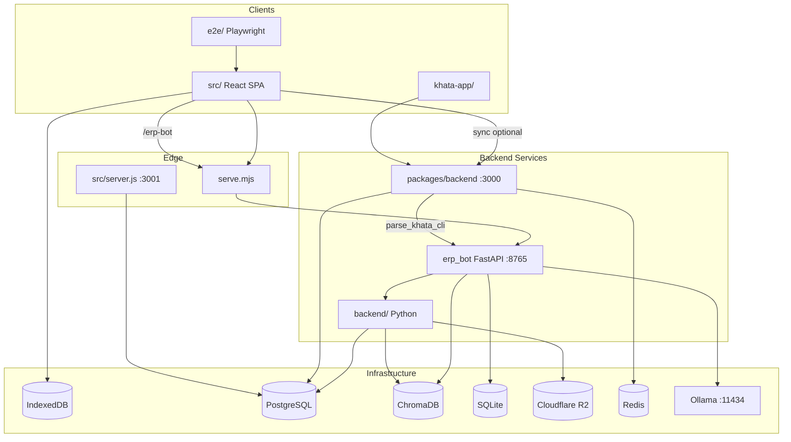

# Repository Intelligence Report

**Project:** Sutra ERP (BUSY ERP monorepo)  
**Generated:** 2026-07-10  
**Scope:** All reachable source under `/home/tapendraawasthi/My-Current-ERP` excluding `node_modules`, `dist`, `build`, `coverage`, `.cache`, `.next`, `.vite`, `tmp`, `logs`, `.venv`, `venv`, and large generated data (`data/`, `datasets/`, `embeddings/`, `vector_db/`, `jsonl/`, `pdf/`, `models/`, `checkpoints/`) unless referenced by code.

**Inventory totals:** ~1,267 TypeScript/Python/JS source files across 7 top-level code packages.

| Package | Source files | Role |
|---------|-------------|------|
| `src/` | 801 | React/Vite SPA — ERP UI, Dexie persistence, 4 AI stacks |
| `erp_bot/` | 334 | Python FastAPI — Ollama, RAG, NIOS, Orbix, e-Khata |
| `backend/` | 68 | Python — Cloudflare R2 storage + tenant knowledge pipeline |
| `scripts/` | 31 | Build, test, eval, corpus generation |
| `khata-app/` | 31 | Capacitor mobile Khata PWA |
| `packages/backend/` | 16 | Express sync/auth/Khata API (PostgreSQL + Redis) |
| `e2e/` | 2 | Playwright specs |

---

## Table of Contents

1. [Repository Tree](#1-repository-tree)
2. [Architectural Layers](#2-architectural-layers)
3. [Dependency Graph](#3-dependency-graph)
4. [Import Graph](#4-import-graph)
5. [Runtime Graph](#5-runtime-graph)
6. [Service Graph](#6-service-graph)
7. [Ownership Graph](#7-ownership-graph)
8. [Module Inventory](#8-module-inventory)
9. [Public APIs](#9-public-apis)
10. [Private APIs](#10-private-apis)
11. [Coupling Analysis](#11-coupling-analysis)
12. [Duplicate Implementations](#12-duplicate-implementations)
13. [Dead Code](#13-dead-code)
14. [Legacy Code](#14-legacy-code)
15. [Hidden Coupling](#15-hidden-coupling)
16. [Circular Dependencies](#16-circular-dependencies)
17. [Singleton Usage](#17-singleton-usage)
18. [Technical Debt](#18-technical-debt)
19. [Architectural Debt](#19-architectural-debt)
20. [Contradictions](#20-contradictions)
21. [Risk Register](#21-risk-register)

---

## 1. Repository Tree

```
My-Current-ERP/
├── AGENTS.md                    # Design system + scope rules
├── DEPLOYMENT.md                # Render + erp_bot deploy guide
├── GEMINI.md                    # Legacy BUSY/Next.js docs (stale)
├── LAUNCH_CHECKLIST.md          # Mobile Khata launch checklist
├── README.md                    # Monorepo stub
├── package.json                 # Root npm scripts + deps
├── serve.mjs                    # Production HTTP: static + /erp-bot proxy
├── vite.config.ts               # Vite build + chunk splitting
├── render.yaml                  # Render.com service definition
├── vercel.json                  # SPA rewrites (secondary deploy)
├── docker-compose.yml           # Local postgres + redis + packages/backend
├── playwright.config.ts
├── eslint.config.js
│
├── .github/workflows/
│   ├── test.yml                 # lint + tsc
│   ├── ekhata-ci.yml            # Python + TS + Playwright e-Khata
│   ├── render-deploy.yml        # Render deploy hook
│   └── frontend-deploy.yml      # Vercel optional
│
├── scripts/                     # 31 files — build, test, eval, corpus
│
├── e2e/
│   ├── ekhata-panel.spec.ts
│   ├── ekhata.html
│   └── helpers/indexedDb.ts
│
├── docs/
│   ├── PREMIUM_UI_REDESIGN_SPEC.md
│   ├── ekhata-ai-weakness-analysis-and-500-questions.md
│   └── Repository_Intelligence.md  # (this file)
│
├── public/                      # Static assets, uploads/logos
│
├── src/                         # 801 files — primary ERP SPA
│   ├── main.tsx, App.tsx, server.js, styles.css
│   ├── ai/                      # 134 — SUTRA AI stack
│   ├── components/              # 175 — UI shell + domain widgets
│   ├── pages/                   # 214 — ERP screens
│   ├── lib/                     # 204 — business engines
│   ├── store/                   # 17 — Zustand state
│   ├── nios/                    # 18 — NIOS v3 client stubs
│   ├── context/                 # 3 — theme, language, screen
│   ├── hooks/                   # 12 — keyboard, search, permissions
│   ├── data/                    # 12 JSON — Nepali/ERP corpora
│   ├── db/                      # pool.js, migrate.js (Node PG)
│   ├── routes/                  # 7 Express route stubs
│   ├── controllers/             # 6 Express controllers
│   ├── middleware/              # audit.js
│   ├── e2e/                     # Playwright harness
│   └── styles/
│
├── erp_bot/                     # 334 Python files
│   ├── requirements.txt, .env.example
│   ├── scripts/                 # 66 — start, ingest, benchmark, CI
│   ├── knowledge/nepal/         # 14 markdown RAG sources
│   ├── training/qlora/          # LoRA train/merge for orbix-nepali
│   ├── tests/                   # 17 pytest files
│   └── src/
│       ├── config.py
│       ├── api/                 # FastAPI main server (:8765)
│       ├── agent/               # Legacy Orbix/Falcon chat (15)
│       ├── orbix/               # Orbix v2 plan/tool/verify (21)
│       ├── nios/                # NIOS v3 platform (112)
│       ├── khata/               # e-Khata entry pipeline (11)
│       ├── falcon_trader/       # Rule-based Khata NLU (5)
│       ├── nlu/                 # Extended NLU engine (11)
│       ├── knowledge/           # RAG orchestration (15)
│       ├── vectorstore/         # Chroma adapters (6)
│       ├── ingestion/           # Codebase scan/embed (4)
│       ├── conversation/        # v2 conversation manager (4)
│       ├── bridges/             # Dexie session snapshot (3)
│       ├── reasoning/           # Journal reasoner (4)
│       ├── intelligence/        # Anomaly/proactive (2)
│       ├── memory/              # Layered memory (1)
│       ├── education/           # Accounting tutor (1)
│       ├── eval/                # Sector holdout (2)
│       ├── personality/         # Response enhancer (1)
│       ├── reports/             # Chat reports (1)
│       ├── watcher/             # Filesystem reindex (1)
│       └── ui/                  # Static widget assets
│
├── backend/                     # 68 Python files
│   ├── api/                     # /storage/health
│   ├── config/                  # R2 config
│   ├── knowledge/               # Tenant doc ingestion + search
│   ├── storage/                 # Cloudflare R2 SDK wrapper
│   └── tests/
│
├── packages/backend/            # 16 TS files — Express API
│   └── src/
│       ├── server.ts
│       ├── db/schema.sql, migrate.js
│       ├── lib/                 # db, redis, sync, falconNlu, messaging
│       ├── middleware/          # auth, rateLimit, envelope
│       └── routes/              # health, auth, sync, messaging, khata
│
├── khata-app/                   # Mobile Khata (Capacitor PWA)
│   ├── src/                     # 25 TS/TSX
│   ├── android/                 # Capacitor Android project
│   └── public/sw.js             # Service worker
│
└── nios/                        # Root-level NIOS contracts/docs only
    ├── contracts/
    └── docs/dexie-pg-canonical.md
```

---

## 2. Architectural Layers

```
┌─────────────────────────────────────────────────────────────────────────┐
│ LAYER 0 — CLIENTS                                                       │
│  Browser SPA (src/) │ Mobile Khata (khata-app/) │ Playwright E2E        │
└───────────────────────────────┬─────────────────────────────────────────┘
                                │
┌───────────────────────────────▼─────────────────────────────────────────┐
│ LAYER 1 — PRESENTATION                                                  │
│  pages/ (214) │ components/ (175) │ context/ │ hooks/                   │
│  Routing: Zustand currentPage switch in App.tsx (no React Router)       │
└───────────────────────────────┬─────────────────────────────────────────┘
                                │
┌───────────────────────────────▼─────────────────────────────────────────┐
│ LAYER 2 — APPLICATION STATE                                               │
│  store/index.ts (monolithic Zustand) │ slices/ │ AI stores              │
│  sutraAiStore │ falconStore │ eKhataStore │ niosStore │ orbixStore        │
└───────────────────────────────┬─────────────────────────────────────────┘
                                │
┌───────────────────────────────▼─────────────────────────────────────────┐
│ LAYER 3 — DOMAIN / BUSINESS LOGIC                                       │
│  lib/accounting.ts │ *Engine.ts │ nepalTax │ cbmsService │ syncEngine   │
│  lib/ekhata/ │ lib/falcon/ │ lib/nepal-ai/ │ lib/orbix/                │
│  ai/ (SUTRA AI orchestration) │ nios/ (client stubs)                    │
└───────────────────────────────┬─────────────────────────────────────────┘
                                │
┌───────────────────────────────▼─────────────────────────────────────────┐
│ LAYER 4 — PERSISTENCE (CLIENT)                                          │
│  lib/db.ts — Dexie IndexedDB (SutraERPDatabase, v22, 70+ tables)        │
│  ai/learning/SutraAiDexie — separate AI learning DB                     │
│  sessionStorage / localStorage — drafts, auth, NIOS session             │
└───────────────────────────────┬─────────────────────────────────────────┘
                                │
┌───────────────────────────────▼─────────────────────────────────────────┐
│ LAYER 5 — EDGE / PROXY                                                  │
│  serve.mjs — static dist + /erp-bot reverse proxy                       │
│  src/server.js — Node Express ERP API (:3001, PG) — parallel/legacy     │
└───────────────────────────────┬─────────────────────────────────────────┘
                                │
        ┌───────────────────────┼───────────────────────┐
        ▼                       ▼                       ▼
┌───────────────┐     ┌─────────────────┐     ┌─────────────────────┐
│ erp_bot       │     │ packages/backend│     │ backend/ (Python)   │
│ FastAPI :8765 │     │ Express :3000   │     │ R2 + knowledge v1   │
│ Ollama + RAG  │     │ PG + Redis      │     │ mounted on erp_bot  │
└───────────────┘     └─────────────────┘     └─────────────────────┘
        │
        ▼
┌─────────────────────────────────────────────────────────────────────────┐
│ LAYER 6 — AI INTELLIGENCE (erp_bot)                                     │
│  Stack A: agent/ (Legacy Orbix/Falcon)                                  │
│  Stack B: orbix/ (v2 plan→tool→verify)                                  │
│  Stack C: nios/ (v3 kernel + gateway + 200+ capabilities)               │
│  Shared: knowledge/, vectorstore/, khata/, nlu/, conversation/           │
└───────────────────────────────┬─────────────────────────────────────────┘
                                │
┌───────────────────────────────▼─────────────────────────────────────────┐
│ LAYER 7 — DATA STORES                                                   │
│  IndexedDB (browser) │ PostgreSQL (cloud ERP + knowledge metadata)      │
│  ChromaDB (local vectors) │ SQLite (NIOS/Orbix memory, telemetry)     │
│  Cloudflare R2 (object storage) │ Redis (sessions, rate limit)         │
│  Ollama (LLM + embeddings)                                            │
└─────────────────────────────────────────────────────────────────────────┘
```

---

## 3. Dependency Graph

### 3.1 Top-level package dependencies



### 3.2 Frontend internal dependency flow

```
main.tsx → App.tsx → Layout.tsx → pages/*
                              ↓
                         useStore (store/index.ts)
                              ↓
                    ┌─────────┼─────────┐
                    ↓         ↓         ↓
              lib/db.ts  lib/accounting  lib/*Engine
                    ↓
              Dexie IndexedDB

AI providers (mutually gated by VITE_NIOS_PLATFORM_V3):
  FalconProvider → falconStore → lib/falcon/* → erpBotClient
  EKhataProvider → eKhataStore → lib/ekhata/* → orbixQwenClient → erpBotClient
  SutraAiProvider → sutraAiStore → ai/core/IntelligenceCore → erpBotClient/Ollama
  NiosProvider → niosStore → nios/client/niosClient → /nios/v1
```

### 3.3 erp_bot intelligence stack dependencies

```
api/server.py
  ├── agent/agent_builder (Legacy: /chat, /orbix/chat/stream)
  ├── orbix/api (v2: /orbix/v2/*)
  ├── nios/api (v3: /nios/v1/*)
  ├── khata/* (/khata/*, /v2/chat)
  ├── conversation/manager (v2 multi-turn)
  └── backend.* (conditional: storage health, knowledge v1)

Shared hubs:
  knowledge/unified_retriever ← vectorstore/*, hybrid_rag
  agent/cascade_router ← intent_router
  nios/gateway ← kernel, khata, cascade_router, research_loop
```

### 3.4 npm runtime dependencies (root package.json — selected)

| Dependency | Used by |
|------------|---------|
| react, react-dom | SPA |
| zustand | store |
| dexie, dexie-react-hooks | lib/db.ts, pages |
| @tanstack/react-query | Some data fetching |
| express, pg, ioredis, jsonwebtoken | src/server.js, packages/backend |
| vite, tailwindcss | Build |
| jspdf, xlsx | Export/print |
| nepali-date-converter | Date UI |

### 3.5 Python runtime dependencies (erp_bot/requirements.txt — selected)

| Dependency | Used by |
|------------|---------|
| fastapi, uvicorn | api/server |
| langchain, langchain-ollama | agent, khata, conversation |
| chromadb | vectorstore |
| tree-sitter | ingestion/ts_chunker |
| rank-bm25 | knowledge/hybrid_rag |
| psycopg2 | NIOS PG memory (optional) |
| boto3 | backend/storage (parent mount) |

---

## 4. Import Graph

### 4.1 Frontend import hotspots

| Importer | Imports | Callees |
|----------|---------|---------|
| `store/index.ts` | lib/db, lib/accounting, slices/*, nios/events | 200+ pages, all CRUD |
| `App.tsx` | 90+ page components, Layout, auth | Entire routed UI |
| `Layout.tsx` | AI providers, syncEngine, TopMenuBar, BusyMenuBar | Shell |
| `ai/core/IntelligenceCore.ts` | 50+ ai/* modules | sutraAiStore |
| `lib/ekhata/processMessage.ts` | 40+ ekhata + nepal-ai modules | eKhataStore |
| `lib/erpBotClient.ts` | nios/session, selfContainedAi | All AI stores |
| `pages/*` | useStore, components/ui, lib/* | Per-screen |

### 4.2 Cross-package Python imports

| From | To | Nature |
|------|-----|--------|
| `erp_bot/src/api/server.py` | `backend.api`, `backend.knowledge` | Conditional mount (try/except) |
| `erp_bot/src/nios/knowledge/federation.py` | `backend.knowledge.container` | Tenant doc search |
| `backend/knowledge/adapters/ocr.py` | `erp_bot.src.nios.ocr.invoice_parser` | Cross-package OCR |
| `packages/backend/lib/falconNlu.ts` | `erp_bot/scripts/parse_khata_cli.py` | Subprocess spawn |

### 4.3 Path alias conventions

| Alias | Target | Usage |
|-------|--------|-------|
| `@/` | `src/` | Newer AI, auth, nios files |
| Relative `../../` | Various | Older pages/components |

### 4.4 Generated imports (build-time)

| Generator | Output | Consumer |
|-----------|--------|----------|
| `scripts/build-falcon-page-index.mjs` | `src/lib/falcon/generatedPageIndex.ts` | Falcon navigation |
| `erp_bot/scripts/export_nepal_ai_runtime_maps.py` | `src/lib/nepal-ai/generated/runtimeMaps.ts` | e-Khata brains |
| `scripts/build-conceptual-framework-knowledge.mjs` | `data/ekhata/conceptual-framework-knowledge.json` | CA knowledge store |

---

## 5. Runtime Graph

### 5.1 Production runtime (Render)

```
User Browser
  → https://my-current-erp.onrender.com (serve.mjs :10000)
      ├── GET /* → dist/ static SPA
      ├── GET /health → JSON health + git SHA
      └── /erp-bot/* → proxy → ERP_BOT_BACKEND_URL (GPU VPS :8765)
              └── erp_bot FastAPI + Ollama

Optional (not in npm start):
  packages/backend :3000 → PostgreSQL + Redis (sync, Khata API)
```

### 5.2 Local development runtime

```
Terminal 1: npm run dev → Vite :3000 (strictPort)
Terminal 2: erp_bot/scripts/start.py → uvicorn :8765 + Ollama :11434
Terminal 3 (optional): packages/backend npm run dev → :3000
Terminal 4 (optional): docker-compose → postgres:5432, redis:6379
```

### 5.3 SPA boot sequence

```
main.tsx
  → App.useEffect → initializeApp()
      → openDB() / Dexie migrate v18→22
      → seed defaults (accounts, admin user, voucher types)
      → check companySettings → set authStage
  → authenticated → Layout
      → startSyncLoop() + autoBackupScheduler
      → mount AI providers (gated by VITE_NIOS_PLATFORM_V3)
      → renderPage() switch on currentPage
```

### 5.4 erp_bot request lifecycle (NIOS path — canonical when flag on)

```
POST /nios/v1/chat
  → NiosGateway.chat()
      → domain_guard + uil_parser + goal_tree
      → world_state.query + federation.query
      → cognitive_os.meta_decide + resource_manager
      → gateway_scheduler (multi-step) OR cache OR _route() deterministic
      → autonomous_research (RAG loop) OR agent_society OR classify_cascade
      → build_evidence_bundle + provenance + telemetry
```

### 5.5 erp_bot request lifecycle (Legacy Orbix/Falcon path)

```
POST /chat/stream
  → agent_builder.run_routed_agent_stream()
      → classify_cascade (4b/32b/none)
      → unified_retriever (if needs_rag)
      → intent branch: chitchat | ledger_query | khata_entry | accounting_qa | erp_howto | code_qa
      → SSE stream to client
```

### 5.6 Invoice posting runtime (client-only)

```
SalesInvoiceForm submit
  → useStore.addInvoice / voucherSlice
  → postInvoiceJournal + postInvoiceStock (store/index.ts)
  → lib/accounting.validateDoubleEntry
  → Dexie vouchers + invoices + ledger entries
  → emitNiosEvent(voucher.posted, invoice.created)
  → enqueueSyncRecord (optional cloud sync)
```

---

## 6. Service Graph

| Service | Process | Port | Protocol | Consumers |
|---------|---------|------|----------|-----------|
| **Vite dev server** | `vite dev` | 3000 | HTTP | Developers |
| **serve.mjs** | `node serve.mjs` | PORT/10000 | HTTP | Production users |
| **erp_bot API** | `uvicorn src.api.server:app` | 8765 | HTTP/SSE | SPA via /erp-bot, khata-app via CLI |
| **Ollama** | `ollama serve` | 11434 | HTTP | erp_bot (LLM + embeddings) |
| **packages/backend** | `tsx src/server.ts` | 3000 | HTTP REST | syncEngine, khata-app |
| **src/server.js** | Node Express | 3001 | HTTP REST | Legacy ERP API (parallel) |
| **PostgreSQL** | docker/Render | 5432 | TCP | packages/backend, backend/knowledge, NIOS PG memory |
| **Redis** | docker/Render | 6379 | TCP | packages/backend sessions, rate limit |
| **ChromaDB** | embedded persistent | — | local | erp_bot vectorstore, backend/knowledge |
| **Cloudflare R2** | S3 API | — | HTTPS | backend/storage, knowledge pipeline |
| **NIOS knowledge worker** | daemon thread in erp_bot | — | internal | backend/knowledge/jobs/worker |

### API surface map

| Prefix | Owner | Auth |
|--------|-------|------|
| `/erp-bot/*` (proxied) | erp_bot | None (CORS *) |
| `/nios/v1/*` | erp_bot/nios | Tenant IDs in body (no JWT) |
| `/orbix/v2/*` | erp_bot/orbix | None |
| `/chat`, `/khata/*`, `/v2/*` | erp_bot | Session ID |
| `/knowledge/v1/*` | backend/knowledge | None (tenant UUID in params) |
| `/storage/health` | backend/storage | None |
| `/api/*` | packages/backend | JWT on protected routes |
| `/api/khata/*` | packages/backend | None (tenant in body) |

---

## 7. Ownership Graph

### 7.1 Data ownership

| Data domain | Primary owner (write) | Storage | Readers |
|-------------|----------------------|---------|---------|
| ERP transactions (vouchers, invoices, parties, items) | `store/index.ts` | Dexie IndexedDB | pages, lib/accounting, AI RAG context |
| Company settings, users, fiscal year | `store/slices/settingsSlice` | Dexie | auth, reports |
| AI chat sessions (SUTRA) | `sutraAiStore` + `ai/learning/*` | SutraAiDexie + localStorage | IntelligenceCore |
| AI chat sessions (Falcon) | `falconStore` | localStorage | falconBrain |
| AI chat sessions (e-Khata/Orbix) | `eKhataStore` | localStorage + orbixChatStorage | processMessage, orbixQwenClient |
| NIOS session/tenant | `nios/session.ts` | localStorage | niosClient, erpBotClient |
| Ledger snapshot (for bot) | `erp_bot/bridges/session_data` | In-memory dict | agent, nios federation |
| Tenant documents (upload) | `backend/knowledge/orchestrator` | R2 + PG + Chroma | NIOS federation |
| Khata vouchers (mobile) | `packages/backend/routes/khata` | PostgreSQL | khata-app |
| Vector indexes (codebase) | `erp_bot/ingestion/embedder` | Chroma `erp_codebase` | agent tools, Falcon code_qa |
| Nepal KB | `erp_bot/vectorstore/nepal_knowledge_store` | Chroma | unified_retriever |
| NLU training embeddings | `erp_bot/vectorstore/nlu_knowledge_store` | Chroma | hybrid_nlu_search |

### 7.2 Module ownership (team/domain)

| Domain | Owning package | Critical modules |
|--------|---------------|------------------|
| **Core ERP UI** | `src/pages`, `src/components` | BillingInvoice, ChartOfAccounts, voucher pages |
| **Accounting engine** | `src/lib/accounting.ts` | validateDoubleEntry, computeTrialBalance, computeProfitLoss |
| **Client persistence** | `src/lib/db.ts` | Dexie schema, migrations |
| **Application state** | `src/store/` | index.ts god store |
| **SUTRA AI** | `src/ai/` | IntelligenceCore |
| **e-Khata (client)** | `src/lib/ekhata/` | processMessage, confirmKhata |
| **Falcon (client)** | `src/lib/falcon/` | falconBrain, smartAssistant |
| **NIOS (client stubs)** | `src/nios/` | niosClient, session |
| **erp_bot orchestration** | `erp_bot/src/conversation/` | manager.py |
| **NIOS platform** | `erp_bot/src/nios/` | gateway, kernel |
| **Orbix agent** | `erp_bot/src/orbix/` | reasoning/engine |
| **Legacy chat** | `erp_bot/src/agent/` | agent_builder |
| **Khata NLU (server)** | `erp_bot/src/nlu/` + `khata/` | engine, khata_engine |
| **RAG** | `erp_bot/src/knowledge/` + `vectorstore/` | unified_retriever |
| **Cloud storage** | `backend/storage/` | R2StorageService |
| **Tenant knowledge** | `backend/knowledge/` | orchestrator |
| **Cloud sync API** | `packages/backend/` | syncHandlers, khata routes |
| **Mobile Khata** | `khata-app/` | App.tsx, khataApi |

---

## 8. Module Inventory

### 8.1 `src/` — Frontend (801 files)

#### 8.1.1 Root

| Module | Files | Purpose | Criticality |
|--------|-------|---------|-------------|
| `main.tsx` | 1 | React bootstrap, global error handlers | P0 |
| `App.tsx` | 1 | Auth gate + currentPage router (~100 routes) | P0 |
| `server.js` | 1 | Node Express ERP API (:3001) | P2 |
| `styles.css` | 1 | Design tokens, CSS variables | P1 |
| `vite-env.d.ts` | 1 | Vite types | P3 |

#### 8.1.2 `src/ai/` (134 files)

| Submodule | Files | Purpose | Criticality |
|-----------|-------|---------|-------------|
| `core/` | 4 | IntelligenceCore, OllamaClient, ContextManager | P0 |
| `rag/` | 31 | ERP query handlers (ledger, stock, khata, invoice, overdue, digest…) | P0 |
| `context/` | 13 | Entity extraction, intent, date, fiscal resolvers | P0 |
| `actions/` | 10 | Invoice/party/khata draft bridges to ERP pages | P1 |
| `routing/` | 3 | ShortcutRouter, HybridLlmRouter, ExamplesRouter | P1 |
| `guard/` | 4 | Duplicate, stock, credit limit, confirmation gates | P1 |
| `learning/` | 11 | Feedback, LLM cache, session memory, profiles | P1 |
| `language/` | 6 | Detection, translation, transliteration | P1 |
| `error-correction/` | 7 | Spelling, grammar, clarifiers | P2 |
| `intelligence/` | 10 | Digest, overdue, anomaly, proactive alerts | P1 |
| `interface/` | 13 | AIChat UI, voice, autocomplete | P1 |
| `knowledge/` | 6 | Domain vocab, profiles | P2 |
| `conversation/` | 7 | Formatters (WhatsApp, emotional, teach-back) | P2 |
| `reasoning/` | 5 | Chain-of-thought, decision maker | P2 |
| `prompts/` | 1 | System prompt | P2 |
| `validation/` | 1 | Response validator | P1 |
| `types.ts`, `index.ts` | 2 | Types + ~120 public exports | P0 |

#### 8.1.3 `src/components/` (175 files)

| Submodule | Files | Purpose | Criticality |
|-----------|-------|---------|-------------|
| `ui/` | 32 | Design system primitives (Button, Select, NepaliDatePicker…) | P0 |
| `auth/` + `wizard/` | 10 | SignUpWizard, GatewayScreen, CompanyLoginScreen | P0 |
| `invoice/` | 5 | SalesInvoiceForm (single form for all billing tabs) | P0 |
| `falcon/` | 4 | FalconProvider, FalconPanel, FalconLauncher | P1 |
| `ekhata/` | 12 | EKhataProvider, Orbix panel UI | P0 |
| `nios/` | 3 | NiosProvider, NiosShell, NiosLauncher | P2 |
| `sutra-ai/` | 2 | SutraAiProvider | P1 |
| `orbix/` | 2 | OrbixPanel (alternate) | P2 |
| `reporting/` | 6 | ReportShell, ReportGrid, TFormatReport | P1 |
| `reports/` | 4 | NepalFinancialStatementView, LedgerDrillPanel | P1 |
| `tally/` | ~20 | Tally Prime mimic UI (mostly unwired) | P3 |
| `topbar/` | 10 | TopMenuBar submenus, GoToPanel | P1 |
| `voucher/` | 8 | Payment/Receipt/Journal form shells | P1 |
| `party/`, `item/`, `order/`, `delivery/`, `print/`, `pl/`, `tax/`, `accounts/` | ~30 | Domain widgets | P1 |
| Root components | ~15 | Layout, Sidebar, BusyMenuBar, ChartOfAccounts | P0 |

#### 8.1.4 `src/pages/` (214 files)

| ERP Domain | Count | Wired in App.tsx | Examples |
|------------|-------|------------------|----------|
| Masters | ~45 | ~25 | Parties, StockBook, LedgerMaster, Warehouses |
| Sales/Purchase transactions | ~25 | ~15 | BillingInvoice, SalesVoucher, PurchaseVoucher |
| Finance vouchers | ~20 | ~12 | JournalEntries, PaymentVoucher, VoucherEntryHub |
| Inventory vouchers | ~15 | ~10 | StockTransfer, ProductionPage, StockJournalPage |
| Financial reports | ~20 | ~15 | BalanceSheet, ProfitLoss, TrialBalance, DayBook |
| Party/AR/AP reports | ~12 | ~6 | OutstandingReceivables, AgingReport |
| Inventory reports | ~12 | ~5 | StockSummaryReport, StockLedgerReport |
| Tax/Payroll | ~15 | ~8 | VatReports, Payroll, TdsReport |
| Banking | ~12 | ~6 | BankReconciliation, ChequeRegister |
| Admin/Utilities | ~15 | ~8 | UsersManagement, BackupRestore, AuditLog |
| Dashboard | 3 | 1 | FinancialDashboard (active); Dashboard.tsx orphaned |
| Auth/Config hubs | ~10 | ~5 | ConfigurationHub, MasterControlCentre |
| **Unwired total** | **~107** | **0** | Silent fallback to FinancialDashboard |

#### 8.1.5 `src/lib/` (204 files)

| Submodule | Files | Purpose | Criticality |
|-----------|-------|---------|-------------|
| Root engines | ~54 | accounting, db, syncEngine, erpBotClient, nepalTax, *Engine.ts | P0 |
| `ekhata/` | ~40 | processMessage, brains, Orbix clients, CA entry | P0 |
| `falcon/` | ~30 | falconBrain, KB, intent, page index | P1 |
| `nepal-ai/` | ~40 | Nepali NLP lexicons + generated runtimeMaps | P1 |
| `orbix/` | 4 | orbixClient, sessionMemory, localFallback | P2 |
| `bankParsers/` | 1 | 10 Nepal bank CSV parsers | P1 |
| `seeders/` | 1 | nepalNasCoaSeeder | P1 |

#### 8.1.6 `src/store/` (17 files)

| Module | Purpose | Criticality |
|--------|---------|-------------|
| `index.ts` | Monolithic Zustand (~2300 lines) | P0 |
| `store.types.ts` | Types, password crypto, seeds | P0 |
| `slices/accountSlice.ts` | Accounts, parties | P0 |
| `slices/voucherSlice.ts` | Vouchers, invoices | P0 |
| `slices/inventorySlice.ts` | Items, stock | P0 |
| `slices/settingsSlice.ts` | Company, users, FY | P0 |
| `slices/authSlice.ts` | Empty placeholder | DEAD |
| `eKhataStore.ts` | e-Khata/Orbix chat state | P0 |
| `falconStore.ts` | Falcon chat state | P1 |
| `sutraAiStore.ts` | SUTRA AI chat state | P1 |
| `niosStore.ts` | NIOS shell UI | P2 |
| `orbixStore.ts` | Alternate Orbix panel | P2 |
| `permissionsStore.ts` | RBAC | P1 |
| `topbarStore.ts` | Menu chrome | P2 |
| `workflowActions.ts` | PO/SO/GRN workflow | P1 |

#### 8.1.7 `src/nios/` (18 files)

| Module | Purpose | Criticality |
|--------|---------|-------------|
| `session.ts` | Unified session/tenant IDs | P1 |
| `client/niosClient.ts` | HTTP facade /nios/v1 | P1 |
| `events/eventBus.ts` | Browser pub/sub | P2 |
| `cognitive/CognitiveOS.ts` | Meta-decision stub | P3 |
| `contracts/*` | UIL, capabilities types | P2 |
| `intelligence/*` | Truth, evidence, domain guard stubs | P3 |
| `execution/simulationEngine.ts` | Payroll simulation | P2 |
| `memory/memoryBus.ts` | In-memory KV | P3 |
| `marketplace/registry.ts` | Capability catalog | P3 |
| `agents/goalTree.ts` | Goal decomposition | P3 |
| `representations/*` | UIL parser, world state stubs | P3 |

#### 8.1.8 Other `src/` modules

| Module | Files | Purpose |
|--------|-------|---------|
| `context/` | 3 | Theme, language, screen context |
| `hooks/` | 12 | Keyboard, F12, search, permissions |
| `data/` | 12 | Static JSON corpora |
| `db/` | 2 | Node PG pool + migrate |
| `routes/` | 7 | Express route stubs |
| `controllers/` | 6 | PG controllers (company, fiscal, backup…) |
| `middleware/` | 1 | audit.js |
| `e2e/` | 2 | Playwright harness |

---

### 8.2 `erp_bot/` (334 Python files)

#### 8.2.1 `erp_bot/src/api/` (3)

| Module | Purpose | Criticality |
|--------|---------|-------------|
| `server.py` | Main FastAPI app, mounts all routers | P0 |
| `cache.py` | LRU + semantic response cache | P1 |
| `streaming.py` | v2 SSE streaming | P2 |

#### 8.2.2 `erp_bot/src/nios/` (112)

| Submodule | Files | Purpose | Criticality |
|-----------|-------|---------|-------------|
| `gateway.py` | 1 | Sole NIOS intelligence entry | P0 |
| `api.py` | 1 | /nios/v1 REST (40+ endpoints) | P0 |
| `kernel/` | 14 | NiosKernel, registry, memory_bus, plugins, scheduler | P0 |
| `cognitive/` | 6 | CognitiveOS, meta_reasoner, uncertainty | P0 |
| `intelligence/` | 11 | research_loop, evidence, provenance, truth | P0 |
| `capabilities/` | 4 | runtime, top50, catalog_runtime | P0 |
| `knowledge/` | 8 | federation, feeds, erp_retrieval, policy | P1 |
| `representations/` | 8 | UIL parser, world_state, ontology, digital_twin | P1 |
| `dsl/` | 7 | workflow, tax, accounting/legal/investment compilers | P1 |
| `execution/` | 8 | simulation, scenario, optimization, erp/tax engines | P1 |
| `domains/` | 4 | legal, investment, consultant engines | P2 |
| `governance/` | 6 | audit, approvals, quality_gates, retention | P2 |
| `learning/` | 4 | self_improvement, automation, evolution | P2 |
| `agents/` | 2 | goal_tree, society | P1 |
| `marketplace/` | 3 | capability_catalog, domain_plugins, skills | P1 |
| `ocr/` | 2 | pipeline, invoice_parser | P2 |
| `benchmarks/nightly/` | 5 | runner, suites, model_swap | P3 |
| `contracts/` | 1 | intelligence_contract types | P0 |
| Other | ~15 | gateway_scheduler, telemetry, etc. | P1–P3 |

#### 8.2.3 `erp_bot/src/orbix/` (21)

| Submodule | Purpose | Criticality |
|-----------|---------|-------------|
| `api.py` | /orbix/v2 endpoints | P0 |
| `bootstrap.py` | Singleton engine wiring | P0 |
| `reasoning/engine.py` | Plan→tool→verify loop | P0 |
| `reasoning/planner.py`, `verifier.py`, `answerer.py` | Reasoning stages | P0 |
| `tools/` | ledger, code, web, memory tools | P0 |
| `memory/store.py` | SQLite working + episodic memory | P1 |
| `llm/ollama_client.py` | Async Ollama JSON/chat | P0 |
| `config.py`, `schemas.py`, `prompts.py` | Configuration | P1 |

#### 8.2.4 `erp_bot/src/agent/` (15) — Legacy Orbix/Falcon

| Module | Purpose | Criticality |
|--------|---------|-------------|
| `agent_builder.py` | ask(), run_routed_agent_stream() | P0 |
| `cascade_router.py` | 4b/32b/none model tier | P0 |
| `intent_router.py` | Intent classification | P0 |
| `unified_tools.py` | LangChain tools (RAG, nav, ledger) | P1 |
| `ledger_query_handler.py` | Deterministic ledger Q&A | P1 |
| `nav_resolver.py` | ERP navigation resolver | P1 |
| `answer_verifier.py`, `verifier.py`, `chain_verifier.py` | Verification | P1 |
| `agent_loop.py`, `intent_classifier.py` | Legacy paths | P3 |

#### 8.2.5 `erp_bot/src/khata/` (11)

| Module | Purpose | Criticality |
|--------|---------|-------------|
| `khata_parser.py` | LLM + regex extraction | P0 |
| `khata_validator.py` | Journal generation + balance check | P0 |
| `khata_engine.py` | Parser→validator→card pipeline | P0 |
| `entry_engine.py` | Extended Phase-4 rich txn types | P1 |
| `khata_chat.py` | Legacy conversational khata | P1 |
| `context_intelligence.py` | Session NLU context | P1 |
| `feedback_store.py` | User feedback JSONL | P2 |

#### 8.2.6 `erp_bot/src/nlu/` (11)

| Module | Purpose | Criticality |
|--------|---------|-------------|
| `engine.py` | Regex→NN→LLM pipeline | P0 |
| `hybrid_nlu_search.py` | Dense + BM25 RRF | P0 |
| `knowledge_enrich.py` | Sector KB enrichment | P0 |
| `nearest_neighbor_intent.py` | Training-example classifier | P1 |
| `clarification_planner.py` | Multi-turn slot filling | P0 |
| `context_wsd.py` | Word-sense disambiguation | P0 |
| `text_normalize.py` | Roman/Devanagari normalization | P0 |
| `compound.py`, `compound_entry_batch.py` | Multi-entry messages | P1 |
| `erp_action_policy.py` | Training label → runtime policy | P1 |

#### 8.2.7 `erp_bot/src/falcon_trader/` (5) — Legacy regex NLU

| Module | Purpose | Criticality |
|--------|---------|-------------|
| `__init__.py` | parse_khata_message() facade | P2 (fallback) |
| `normalizer.py` | Unicode digit, Nepali numbers | P1 |
| `intent_classifier.py` | 40+ regex intents | P2 |
| `entity_extractor.py` | Amount/party/item/date | P2 |
| `disambiguation.py` | Clarifying questions | P2 |

#### 8.2.8 `erp_bot/src/knowledge/` (15)

| Module | Purpose | Criticality |
|--------|---------|-------------|
| `unified_retriever.py` | RRF merge all sources | P0 |
| `hybrid_rag.py` | Dense Chroma + BM25 | P0 |
| `knowledge_registry.py` | Tiered segmented KB | P1 |
| `citation_qa.py` | Citation-enforced Q&A | P1 |
| `nepal_accounting_kb.py` | CoA, tax rates, entry rules | P1 |
| `static_answers.py` | Precomputed FAQ | P1 |
| `embed_cache.py` | Query embedding cache | P2 |
| `knowledge_init.py` | Startup index ensure | P1 |
| Others | domain_router, sector_profile, vocabulary_loader, chart_of_accounts_framework, rag_search, nepal_ai_runtime | P2–P3 |

#### 8.2.9 `erp_bot/src/vectorstore/` (6)

| Module | Collection | Criticality |
|--------|------------|-------------|
| `chroma_store.py` | erp_codebase | P1 |
| `nlu_knowledge_store.py` | nlu_knowledge | P0 |
| `nepal_knowledge_store.py` | nepal_knowledge | P1 |
| `ca_knowledge_store.py` | ca_knowledge | P2 |
| `nav_index_store.py` | nav_index | P2 |
| `nepali_grammar_store.py` | nepali_grammar | P2 |

#### 8.2.10 Other `erp_bot/src/` packages

| Package | Files | Purpose | Criticality |
|---------|-------|---------|-------------|
| `conversation/` | 4 | manager.py hub (~1400 lines) | P0 |
| `reasoning/` | 4 | accounting_reasoner, journal_verifier_chain | P0 |
| `ingestion/` | 4 | scanner, parser, ts_chunker, embedder | P1 |
| `bridges/` | 3 | session_data, dexie_bridge | P1 |
| `intelligence/` | 2 | proactive_engine, anomaly_detector | P2 |
| `memory/` | 1 | layered_memory | P1 |
| `education/` | 1 | accounting_tutor | P3 |
| `eval/` | 2 | sector_holdout | P2 |
| `personality/` | 1 | response_enhancer | P3 |
| `reports/` | 1 | chat_reports | P2 |
| `watcher/` | 1 | filesystem reindex | P2 |
| `config.py` | 1 | Central env config | P0 |

#### 8.2.11 `erp_bot/scripts/` (66)

| Category | Count | Examples |
|----------|-------|----------|
| Runtime/ops | 8 | start.py, start_nios_api.sh, health_check.py |
| Vector ingest | 15 | ingest_nlu_knowledge_embeddings.py, ingest_nepal_sector_knowledge.py |
| Data bootstrap | 10 | bootstrap_nepal_ai_*, export_nepal_ai_runtime_maps.py |
| Golden corpus builders | 12 | build_*_scenarios.py |
| CI test scripts | 18 | test_hybrid_nlu_search.py, test_journal_verifier_chain.py |
| Eval harnesses | 2 | eval_sector_nlu_holdout.py, eval_khata_benchmark.py |
| NIOS ops | 4 | nios_nightly.sh, nios_verify_prod.py |

#### 8.2.12 `erp_bot/knowledge/nepal/` (14 markdown)

vat.md, tds.md, ssf.md, fiscal-year.md, double-entry.md, gratuity.md, income-tax.md, nfrs-overview.md, eis.md, facts/*.md, README.md, quick_reference.md

#### 8.2.13 `erp_bot/tests/` (17)

NIOS contract tests (8), khata tests (2), intent_router (1), orbix tests (2), misc (4)

---

### 8.3 `backend/` (68 Python files)

| Package | Files | Purpose | Criticality |
|---------|-------|---------|-------------|
| `storage/` | 25 | Cloudflare R2 wrapper (public facade + internal) | P0 |
| `knowledge/` | 22 | Tenant doc ingestion pipeline | P0 |
| `api/` | 2 | /storage/health | P2 |
| `config/` | 2 | R2 config singleton | P0 |
| `tests/` | 17 | unit + integration | P2 |

---

### 8.4 `packages/backend/` (16 TS files)

| Module | Purpose | Criticality |
|--------|---------|-------------|
| `server.ts` | Express app entry | P1 |
| `routes/auth.ts` | JWT login/refresh/logout | P1 |
| `routes/sync.ts` | Pull/push sync | P1 |
| `routes/khata.ts` | Mobile Khata API | P1 |
| `routes/messaging.ts` | Email/SMS | P2 |
| `routes/health.ts` | Health check | P2 |
| `lib/syncHandlers.ts` | Push upsert handlers | P1 |
| `lib/syncPull.ts` | Incremental pull | P1 |
| `lib/falconNlu.ts` | Python NLU subprocess | P1 |
| `lib/db.ts`, `lib/redis.ts` | PG + Redis clients | P1 |
| `middleware/auth.ts` | JWT middleware | P1 |
| `db/schema.sql` | Full PG schema (~772 lines) | P1 |

---

### 8.5 `khata-app/` (31 source files)

| Module | Purpose | Criticality |
|--------|---------|-------------|
| `App.tsx` | Chat-first ledger app | P1 |
| `api/khataApi.ts` | Backend REST client | P1 |
| `lib/offlineQueue.ts` | IndexedDB offline confirm queue | P1 |
| `lib/ocrInput.ts` | Tesseract OCR | P2 |
| `lib/voiceInput.ts` | Speech recognition | P2 |
| `lib/insightEngine.ts` | Business insights | P2 |
| `components/ChatWindow.tsx` | Main chat UI | P1 |
| `components/OnboardingFlow.tsx` | Phone onboarding | P1 |
| `public/sw.js` | Service worker + background sync | P1 |

---

### 8.6 `scripts/` (31 root)

Build: build-falcon-page-index.mjs, build-conceptual-framework-knowledge.mjs  
Test: test-falcon-intents.ts, test-ekhata-*.ts (10+), test-sutra-ai.ts  
Eval: eval-ekhata-benchmark.ts  
Corpus: generate-ekhata-training-corpus.ts, validate-ekhata-corpus.ts  
Deploy: render-build.sh

---

## 9. Public APIs

### 9.1 Frontend public exports

| Entry | Exports | Consumers |
|-------|---------|-----------|
| `src/ai/index.ts` | ~120 symbols: IntelligenceCore, handlers, guards, types | sutraAiStore, tests |
| `src/nios/index.ts` | niosClient, session helpers, types | NiosProvider, erpBotClient |
| `src/lib/erpBotClient.ts` | askErpBot, classifyIntent, stream helpers | falconStore, eKhataStore |
| `src/lib/accounting.ts` | validateDoubleEntry, computeTrialBalance, computeProfitLoss, etc. | store, pages, orbixReportEngine |
| `src/lib/db.ts` | openDB, getDB, DB* interfaces, generateId | store, all pages |
| `src/store/index.ts` | useStore, postInvoiceJournal | App, pages, AI |
| `src/lib/ekhata/index.ts` | processEKhataMessage*, confirmKhata | eKhataStore |
| `src/lib/falcon/smartAssistant.ts` | askSmartAssistantAsync | falconStore |

### 9.2 erp_bot HTTP public API

**Main server (`/`):**
- `GET /health`, `GET /status`
- `POST /chat`, `POST /chat/stream`, `POST /orbix/chat/stream`
- `POST /classify`, `DELETE /chat/session/{id}`, `GET /chat/session/{id}/history`
- `POST /khata/chat`, `POST /khata/parse`, `POST /khata/validate`, `POST /khata/feedback`
- `POST /v2/chat`, `POST /v2/chat/stream`
- `POST /reindex`, `GET/POST /knowledge/nepal/*`, `GET/POST /cache/*`

**NIOS (`/nios/v1`):** chat, chat/stream, simulate, scenario, optimize, world-state, federation, OCR, benchmarks, governance, legal, investment, consultant, marketplace, evidence, memory, plugins, public/v1

**Orbix v2 (`/orbix/v2`):** status, chat, chat/stream, reindex, memory/forget

### 9.3 backend Python public API

| Module | Public interface |
|--------|------------------|
| `backend.storage` | upload_file, download_bytes, delete_file, list_objects, file_exists, generate_public_url |
| `backend.knowledge.api` | POST/GET /knowledge/v1/documents, POST /knowledge/v1/search |
| `backend.api.health_routes` | GET /storage/health |

### 9.4 packages/backend REST API

| Route | Method | Auth |
|-------|--------|------|
| `/api/health` | GET | No |
| `/api/auth/login` | POST | No |
| `/api/auth/refresh` | POST | No |
| `/api/auth/logout` | POST | JWT |
| `/api/sync/pull` | GET | JWT |
| `/api/sync/push` | POST | JWT |
| `/api/messaging/email` | POST | JWT |
| `/api/messaging/sms` | POST | JWT |
| `/api/khata/transaction` | POST | No |
| `/api/khata/confirm` | POST | No |
| `/api/khata/balance` | GET | No |
| `/api/khata/insights` | GET | No |
| `/api/khata/payment-webhook` | POST | Webhook secret |

---

## 10. Private APIs

### 10.1 Frontend internal (not barrel-exported)

| Module | Internal consumers |
|--------|-------------------|
| `store/slices/*` | store/index.ts only |
| `lib/ekhata/*Brain.ts` (30+) | processMessage.ts only |
| `lib/nepal-ai/generated/runtimeMaps.ts` | ekhata brains (8000+ lines) |
| `ai/prompts/systemPrompt.ts` | IntelligenceCore |
| `components/invoice/PurchaseInvoiceForm.tsx` | DEAD |
| `src/server.js` controllers | Express only, not used by SPA auth |
| `lib/ekhata/vocabulary/stubs/node-*.ts` | Vite build stubs for fs |

### 10.2 erp_bot internal

| Module | Notes |
|--------|-------|
| `nios/kernel/*` | Accessed via get_kernel(), not direct HTTP |
| `agent/agent_loop.py` | Superseded by agent_builder |
| `knowledge/rag_search.py` | Legacy wrapper |
| `intelligence/anomaly_detector.py` | Called from conversation manager |
| `personality/response_enhancer.py` | Optional polish layer |
| `eval/sector_holdout.py` | QA only |

### 10.3 backend internal

| Module | Notes |
|--------|-------|
| `storage/internal/service.py` | ~700 lines, all ops via container |
| `storage/internal/circuit_breaker.py` | Internal resilience |
| `knowledge/pipeline/orchestrator.py` | Called by API + worker thread |
| `knowledge/repository.py` | PG CRUD, no HTTP |

---

## 11. Coupling Analysis

### 11.1 Tight coupling (high fan-in)

| Module | Fan-in | Risk |
|--------|--------|------|
| `store/index.ts` | All pages, AI stores, sync | God object; any change ripples widely |
| `lib/db.ts` | store, accounting, pages, ekhata | Schema change affects 70+ tables |
| `lib/accounting.ts` | reports, ekhata, store validation | Triple P&L/BS paths increase drift |
| `erp_bot/conversation/manager.py` | 15+ subsystems | Highest Python fan-in |
| `erp_bot/nios/gateway.py` | kernel, agent, khata, research | Central intelligence bottleneck |
| `knowledge/unified_retriever.py` | agent, nios, citation_qa, orbix tools | Single RAG hub |

### 11.2 Loose coupling (good)

| Boundary | Mechanism |
|----------|-----------|
| AI stacks | Feature flag `VITE_NIOS_PLATFORM_V3` mutual exclusion |
| Client/server | HTTP + session IDs; no shared DB |
| Action drafts | sessionStorage bridges (invoice, khata, party) |
| Sync outbox | IndexedDB queue decouples offline writes |
| NIOS events | CustomEvent bus (`nios:event`) |

### 11.3 Coupling metrics (qualitative)

| Pair | Coupling | Notes |
|------|----------|-------|
| pages ↔ store | **Very high** | Direct useStore in 190+ files |
| ai ↔ store | **Medium** | erpContext passed in, not imported |
| erp_bot ↔ backend | **Low** | Conditional try/except mount |
| khata-app ↔ packages/backend | **Medium** | REST only |
| falcon ↔ ekhata | **Medium** | Shared erpBotClient, markdown renderer |
| nios frontend ↔ nios backend | **Medium** | HTTP contract; stubs on frontend |

---

## 12. Duplicate Implementations

| Domain | Implementations | Location |
|--------|-----------------|----------|
| **P&L / Balance Sheet** | 3 paths | `accounting.ts` (sync), `profitLossEngine.ts`/`balanceSheetEngine.ts` (async), store inline journal |
| **Khata NLU** | 4 paths | `falcon_trader/` (regex), `nlu/engine.py` (regex→NN→LLM), `khata/khata_parser.py`, `lib/ekhata/parseKhata.ts` |
| **Khata journal posting** | 3 paths | `confirmKhata.ts` (Dexie), `packages/backend/khata.ts` (PG), `orbix/tools/ledger_tools.py` |
| **ERP help assistant** | 4 stacks | SUTRA AI (`ai/`), Falcon (`lib/falcon/`), e-Khata/Orbix (`lib/ekhata/`), NIOS (`nios/`) |
| **Falcon reasoner** | 2 engines | `lib/falcon/engine.ts` (offline KB) vs `falconBrain.ts` (smartAssistant) |
| **Orbix branding** | 3 UIs | `components/ekhata/Orbix*`, `components/orbix/OrbixPanel`, `lib/orbix/orbixClient` |
| **Dashboard** | 2 pages | `FinancialDashboard.tsx` (wired) vs `Dashboard.tsx` (798-line orphaned) |
| **Quotation/Orders** | Legacy + current | `Quotation.tsx`/`SalesOrder.tsx` vs `QuotationPage.tsx`/`OrderVoucherPage.tsx` |
| **Stock summary** | 2 pages | `StockSummary.tsx` vs `StockSummaryReport.tsx` |
| **Report framework** | 2 dirs | `components/reporting/` vs `components/reports/` |
| **Cost centres** | 2 tables | `costCenters` (v18) vs `costCentres` (v20) in Dexie |
| **Sales persons** | 2 tables | `salesPersons` vs `salespersons` in Dexie |
| **Express ERP API** | 2 servers | `src/server.js` (:3001) vs `packages/backend` (:3000) |
| **Chroma RAG** | 2 systems | erp_bot static collections vs backend tenant `tenant_documents` |
| **Session memory** | 4 stores | agent in-memory, orbix SQLite, nios memory_bus, eKhata conversationState |
| **Navigation** | 4 sources | Sidebar, BusyMenuBar, TopMenuBar/GoTo, App.tsx switch (no single source of truth) |

---

## 13. Dead Code

| Item | Location | Evidence |
|------|----------|----------|
| `StockItems.tsx` | `src/components/` | AGENTS.md: dead/unused |
| `PurchaseInvoiceForm.tsx` | `src/components/invoice/` | AGENTS.md: dead |
| `ReturnInvoiceForm.tsx` | `src/components/invoice/` | AGENTS.md: dead |
| `slices/authSlice.ts` | `src/store/slices/` | Empty placeholder |
| `useAccountingStore` | `src/store/useStore.ts` | Empty stub |
| `UnknownPartyHandler` | `src/ai/rag/` | Exported but not wired in IntelligenceCore |
| `PartyStatement.tsx` | `src/pages/` | Imported in App.tsx but unused in switch |
| `Quotation.tsx`, `SalesOrder.tsx`, `PurchaseOrder.tsx` | `src/pages/` | Imported but switch uses newer pages |
| `PhysicalStockPage.tsx`, `StockSummary.tsx` | `src/pages/` | Imported but superseded |
| `agent_loop.py` | `erp_bot/src/agent/` | Superseded by agent_builder |
| `intent_classifier.py` | `erp_bot/src/agent/` | Legacy regex fallback |
| `scripts/generate-index.mjs` | `scripts/` | Expects SSR dist/server (unused) |
| `src/routes/*.js` (most) | `src/routes/` | Stubs returning `{ success: true }` |
| `storage/internal/lifecycle*.py` | `backend/storage/` | Not wired to R2 API |
| `cdn.invalidate_cdn_paths` | `backend/storage/internal/cdn.py` | No-op |
| ~107 unwired pages | `src/pages/` | No App.tsx case; unreachable via router |
| `components/tally/*` (~20) | `src/components/tally/` | Mostly disconnected from App.tsx |
| `Header.tsx`, `Gateway.tsx`, `ReportHub.tsx` | `src/components/` | Not used in Layout |

---

## 14. Legacy Code

| Item | Location | Status |
|------|----------|--------|
| **Legacy Orbix/Falcon stack** | `erp_bot/src/agent/` | Still serves `/chat`, `/orbix/chat/stream` |
| **falcon_trader regex NLU** | `erp_bot/src/falcon_trader/` | Fallback; superseded by `nlu/engine.py` |
| **khata_chat legacy** | `erp_bot/src/khata/khata_chat.py` | `/khata/chat` endpoint |
| **Falcon engine.ts** | `src/lib/falcon/engine.ts` | Offline KB path; parallel to falconBrain |
| **Root falcon*.ts** | `src/lib/falconWebSearch.ts`, etc. | Parallel to `lib/falcon/` package |
| **AuthGateway.tsx** | `src/pages/` | Legacy gateway |
| **src/server.js** | `src/` | Node ERP API parallel to packages/backend |
| **GEMINI.md** | root | Documents Next.js/Vercel BUSY (stale) |
| **Tally-green UI stack** | `components/tally/`, `styles/tally-green.css` | Tally Prime mimic, largely unwired |
| **OrbixPanel standalone** | `components/orbix/` | Alternate to e-Khata embedded Orbix |
| **ekhataLlmClient.ts** | `src/lib/ekhata/` | Legacy bot API; overlapped by orbixQwenClient |
| **Stringly-typed routing** | `App.tsx` currentPage switch | Pre-React Router pattern |
| **Plain password formats** | `store.types.ts` | Legacy hash formats (denied at login) |

---

## 15. Hidden Coupling

| Coupling | Mechanism | Impact |
|----------|-----------|--------|
| **Build-time route index** | `build-falcon-page-index.mjs` parses App.tsx + Sidebar | Falcon nav breaks if routes change without rebuild |
| **Nepal AI runtime maps** | Python export → `runtimeMaps.ts` (8000+ lines) | TS/Python parity required; build step mandatory |
| **window CustomEvent navigate** | App.tsx listener + scattered dispatchers | Implicit routing not in type system |
| **sessionStorage draft keys** | `sutra:ai-*-draft` strings | Invoice/khata/party forms coupled to AI via string keys |
| **Module-global conversation state** | `eKhataStore` conversationContext, `falconBrain` conversationMemory | Not per-session; cross-tab leakage |
| **Hardcoded system account IDs** | `postInvoiceJournal` uses `acc-sales`, `acc-vat-payable` | Coupled to seed data, not COA lookup |
| **PYTHONPATH for backend mount** | erp_bot start.py doesn't add repo root | backend may fail silently (try/except) |
| **Falcon NLU subprocess** | packages/backend spawns parse_khata_cli.py | Docker dev image lacks Python/erp_bot |
| **NIOS session ID sync** | `nios_session_id` ↔ `erp_bot_session_id` in localStorage | Cross-AI session coupling |
| **Dexie version cascade** | v18→22 migration chain | Hidden tables (v21 fix) indicate schema drift history |
| **erp_bot imports agent.cascade in NIOS gateway** | Python cross-stack | NIOS fallback depends on legacy agent package |
| **OCR cross-package** | backend OCR adapter → erp_bot nios OCR | Knowledge pipeline coupled to NIOS OCR module |
| **F12 config per screen** | `useF12Config` + screen type from ScreenContext | Keyboard shortcuts coupled to currentPage strings |

---

## 16. Circular Dependencies

### 16.1 Known / likely cycles

| Cycle | Packages | Nature |
|-------|----------|--------|
| `nlu/engine` ↔ `knowledge_enrich` | erp_bot | engine imports enrich; enrich imports engine types (TYPE_CHECKING mitigated) |
| `nlu/erp_action_policy` ↔ `engine` | erp_bot | TYPE_CHECKING + runtime import for NON_TRANSACTION |
| `storage/internal/service` ↔ `container` | backend | TYPE_CHECKING import for StorageContainer |
| `store/index.ts` self-references | src | Large monolith; slices spread into same store object |
| `processMessage.ts` ↔ brains ↔ nepal-ai | src | Mutual imports within ekhata (runtime-safe via function calls) |

### 16.2 Architectural cycles (logical)

```
NIOS gateway → classify_cascade (agent) → unified_retriever → NIOS federation → knowledge container → back to NIOS
Frontend eKhata → erpBotClient → NIOS /nios/v1/chat → khata_chat_fn → same khata engines as legacy /khata/chat
```

No automated circular dependency tooling detected in CI; risk is managed by convention.

---

## 17. Singleton Usage

| Singleton | Location | Lifecycle |
|-----------|----------|-----------|
| `get_kernel()` | `erp_bot/nios/kernel/kernel.py` | Lazy; bootstraps 200+ capabilities |
| `get_gateway()` | `erp_bot/nios/gateway.py` | Lazy wrapper over kernel |
| `get_engine()` | `erp_bot/orbix/bootstrap.py` | Async lock; OrbixAgentEngine |
| `get_storage_container()` | `backend/storage/internal/container.py` | Process singleton |
| `get_knowledge_container()` | `backend/knowledge/container.py` | Process singleton |
| `get_r2_config()` | `backend/config/r2.py` | `@lru_cache` |
| `get_response_cache()` | `erp_bot/api/cache.py` | In-memory LRU |
| `get_hybrid_rag()` | `erp_bot/knowledge/hybrid_rag.py` | Lazy Chroma+BM25 |
| `ChromaDocumentStore` client | `backend/knowledge/adapters/chroma_store.py` | Module-level persistent client |
| `event_bus` | `erp_bot/nios/kernel/event_bus.py` | Process lifetime |
| `cognitive_os` | `erp_bot/nios/cognitive/cognitive_os.py` | Module singleton |
| `provenance_graph` | `erp_bot/nios/intelligence/provenance_graph.py` | SQLite singleton |
| `useStore` | `src/store/index.ts` | Zustand single store |
| `openDB()` / Dexie | `src/lib/db.ts` | Single DB instance |
| `pg Pool` | `packages/backend/lib/db.ts`, `src/db/pool.js` | Connection pool singleton |
| `redis client` | `packages/backend/lib/redis.ts` | Lazy singleton |
| Module-global `conversationMemory` | `src/lib/falcon/falconBrain.ts` | Not per-user |
| Module-global `conversationContext` | `eKhataStore.ts` | Not per-session |
| `_session_histories` | `erp_bot/agent/agent_builder.py` | In-memory dict |
| Knowledge worker thread | `backend/knowledge/jobs/worker.py` | Single daemon thread |

---

## 18. Technical Debt

| ID | Area | Description | Severity |
|----|------|-------------|----------|
| TD-01 | `store/index.ts` | 2300-line god store mixing auth, CRUD, posting, payroll | High |
| TD-02 | `lib/db.ts` | `@ts-nocheck`; duplicate DBEmployee/DBPayrollEntry types; 70+ Table\<any\> | High |
| TD-03 | Pages | 190 files with `@ts-nocheck` | High |
| TD-04 | Routing | ~107 unwired pages; broken nav slugs silently fall back | High |
| TD-05 | Accounting | Triple P&L/BS implementation paths | High |
| TD-06 | `postInvoiceJournal` | Hardcoded account IDs, not COA-driven | High |
| TD-07 | `generateSerialNumberSync` | Random suffix; collision risk | Medium |
| TD-08 | `processMessage.ts` | 1000+ line god-router with 30+ try* branches | High |
| TD-09 | `runtimeMaps.ts` | 8000+ line generated file in bundle | Medium |
| TD-10 | Falcon | Module-global conversation memory | Medium |
| TD-11 | e-Khata | Module-global conversationContext in store | Medium |
| TD-12 | backend/knowledge | No auth on /knowledge/v1/* | High |
| TD-13 | packages/backend/khata | No JWT on Khata routes | High |
| TD-14 | backend/knowledge | PDF scanned OCR flagged but not implemented | Medium |
| TD-15 | backend/knowledge | PyMuPDF (fitz) used but not in requirements.txt | Medium |
| TD-16 | backend/knowledge | Single-threaded worker; no horizontal scale | Medium |
| TD-17 | backend/knowledge | No Alembic; raw schema.sql only | Medium |
| TD-18 | erp_bot | Redis in requirements but unused in Python | Low |
| TD-19 | syncEngine | `sutra_access_token` never written by login flow | Medium |
| TD-20 | `_loadAllData` | Loads 70+ tables on init; login latency | Medium |
| TD-21 | Missing Dexie tables | schemes, billsOfMaterial referenced but not in schema | Medium |
| TD-22 | `src/server.js` | Default PG creds in source | Medium |
| TD-23 | erp_bot | CORS allow_origins=["*"] | Medium |
| TD-24 | khata-app Docker | No Python for Falcon NLU in backend container | Medium |
| TD-25 | Tests | No automated circular dependency checks | Low |
| TD-26 | IntelligenceCore | UnknownPartyHandler exported but unwired | Low |
| TD-27 | feedbackCalibrator | Imported in IntelligenceCore but unused there | Low |

---

## 19. Architectural Debt

| ID | Description | Migration difficulty | Replacement difficulty |
|----|-------------|---------------------|------------------------|
| AD-01 | **Four parallel AI stacks** (SUTRA, Falcon, e-Khata, NIOS) with partial mutual exclusion | High — NIOS flag exists but stubs incomplete | High — each has distinct UX and data paths |
| AD-02 | **Three erp_bot intelligence stacks** (agent, orbix v2, nios v3) sharing RAG/khata | High — NIOS imports agent cascade | High — production may use different endpoints per deploy |
| AD-03 | **No React Router** — stringly currentPage with 100+ aliases | Medium — would touch App, all nav sources | Medium |
| AD-04 | **Client-only ERP** (Dexie) vs **cloud ERP** (PG) dual persistence | High — sync covers masters only, not ledgers | High |
| AD-05 | **Two Express backends** (src/server.js vs packages/backend) | Medium | Medium |
| AD-06 | **Single-tenant browser** vs **multi-tenant NIOS scaffolding** (localStorage tenant_id) | High | High |
| AD-07 | **Offline-first** vs **LLM-required** e-Khata paths (4 routing branches) | High | Medium |
| AD-08 | **Monolithic store** vs slice pattern (slices exist but merged inline) | Medium | High — 200+ consumers |
| AD-09 | **Build-time code generation** for Falcon index + Nepal maps | Low — scripts exist | Low |
| AD-10 | **Chroma embedded** — not horizontally scalable | High | High |
| AD-11 | **Ollama dependency** — single GPU bottleneck | High | High (cloud LLM migration) |
| AD-12 | **107 orphan pages** — scaffold sprawl from Tally/Busy parity effort | Medium — wire or delete | Low per page |
| AD-13 | **Parallel Tally UI stack** disconnected from main shell | Medium | Low |
| AD-14 | **Khata triple implementation** (client Dexie, mobile PG, orbix ledger_tools) | High | High |
| AD-15 | **NIOS frontend stubs** (Phase 0) vs full backend (Phase 6+) | Medium | Low for stubs |

---

## 20. Contradictions

| ID | Contradiction | Details |
|----|---------------|---------|
| C-01 | **Deploy docs vs reality** | GEMINI.md says Next.js/Vercel; DEPLOYMENT.md says Vite/Render |
| C-02 | **Orbix vs Falcon naming** | system_prompt: "Orbix (also called Falcon)"; codebase treats as overlapping brands |
| C-03 | **Auth models** | Client PBKDF2 Dexie users vs packages/backend JWT vs no auth on Khata/knowledge APIs |
| C-04 | **Tenant model** | NIOS localStorage tenant_id vs single-company Dexie (`companySettings` id "main") |
| C-05 | **Primary AI surface** | VITE_NIOS_PLATFORM_V3 hides legacy AI UIs but frontend NIOS modules are mostly stubs |
| C-06 | **items route** | AGENTS.md: items → StockBook.tsx; Sidebar also aliases stock-book, item-master |
| C-07 | **Desktop navigation** | Sidebar has full nav tree but Layout only shows it on mobile |
| C-08 | **Active dashboard** | Rich Dashboard.tsx exists; FinancialDashboard (minimal) is wired as home |
| C-09 | **erp_bot status offline** | serve.mjs returns `status: online, mode: builtin` when no backend — misleading |
| C-10 | **Redis dependency** | In erp_bot requirements.txt but zero Python imports |
| C-11 | **User rule vs repo** | user_info said "not a git repo"; .git exists with remotes |
| C-12 | **Immutable ledger** | packages/backend blocks ledger UPDATE/DELETE; client Dexie has no such enforcement |
| C-13 | **SutraAiProvider** | Mounted on mobile Layout only; omitted on desktop authenticated layout |
| C-14 | **companyRoutes stub** | src/routes says "use packages/backend" but src/server.js still mounts controllers |
| C-15 | **Two Khata products** | In-ERP e-Khata panel vs standalone khata-app with different persistence models |

---

## 21. Risk Register

| ID | Risk | Likelihood | Impact | Mitigation state |
|----|------|------------|--------|------------------|
| R-01 | **Unauthenticated knowledge API** — tenant UUID guessing enables upload/search | Medium | High | None — document only |
| R-02 | **Unauthenticated Khata API** — voucher posting with tenant_id/company_id | Medium | High | Idempotency keys exist; no auth |
| R-03 | **God store regression** | High | High | No unit tests on store |
| R-04 | **Broken navigation** — users land on wrong page silently | High | Medium | ~50% pages unwired |
| R-05 | **Ollama/GPU single point of failure** | High | High | Built-in offline brains (limited) |
| R-06 | **Schema drift Dexie** | Medium | High | Version chain v18→22; duplicate types |
| R-07 | **backend mount silent failure** | Medium | Medium | try/except in server.py startup |
| R-08 | **Concurrent serial number collision** | Low | High | Sync random fallback |
| R-09 | **Cross-tab AI state leakage** | Medium | Low | Module-global memory |
| R-10 | **Bundle size / OOM on build** | Medium | High | Manual chunks + 6GB heap (mitigated) |
| R-11 | **Triple khata journal logic divergence** | Medium | High | Separate test suites |
| R-12 | **Sync token never set** | High | Medium | Cloud sync non-functional |
| R-13 | **CORS wide open on erp_bot** | High | Medium | No origin restriction |
| R-14 | **Chroma data loss on redeploy** | Medium | High | Local disk only; no backup in CI |
| R-15 | **190 @ts-nocheck files** | High | Medium | Type errors suppressed |
| R-16 | **PII in localStorage** | Medium | Medium | Session IDs, chat history |
| R-17 | **Payment webhook secret** | Low | High | Env-gated |
| R-18 | **Force push to Lovable** | Low | Critical | Documented in AGENTS.md |
| R-19 | **Docker backend without Python** | High | Low | Mock NLU fallback |
| R-20 | **NIOS stub vs production backend mismatch** | Medium | High | Feature flag gates UI only |

---

## Appendix A — Environment Variables (cross-cutting)

| Variable | Layer | Purpose |
|----------|-------|---------|
| `ERP_BOT_BACKEND_URL` | serve.mjs | Proxy target for /erp-bot |
| `VITE_NIOS_PLATFORM_V3` | Frontend build | Unified NIOS AI surface |
| `VITE_SELF_CONTAINED_AI` | Frontend build | Force offline brains |
| `VITE_ERP_BOT_URL` | Frontend build | Override AI backend URL |
| `VITE_API_URL` / `VITE_PUBLIC_API_URL` | Frontend | Sync/messaging API |
| `DATABASE_URL` | PG services | PostgreSQL connection |
| `REDIS_URL` | packages/backend | Sessions, rate limit |
| `R2_*` | backend/storage | Cloudflare R2 credentials |
| `OLLAMA_BASE_URL` | erp_bot | LLM host |
| `NIOS_MEMORY_BACKEND` / `NIOS_PG_URL` | erp_bot/nios | Optional PG memory |
| `ORBIX_*_MODEL` | erp_bot/orbix | Model overrides |
| `KNOWLEDGE_WORKER_ENABLED` | backend/knowledge | Background ingest thread |
| `PAYMENT_WEBHOOK_SECRET` | packages/backend | Khata payment webhook |

---

## Appendix B — CI/CD Summary

| Workflow | Trigger | Actions |
|----------|---------|---------|
| `test.yml` | push/PR main | lint, tsc (root + packages/backend) |
| `ekhata-ci.yml` | path filter | Python run_ekhata_ci.sh, TS ekhata tests, Playwright e2e |
| `render-deploy.yml` | push main | build, Render deploy hook, health check |
| `frontend-deploy.yml` | push main | Vercel deploy (optional) |

---

## Appendix C — Criticality Legend

- **P0 / Critical** — Core ERP or primary AI path fails without it
- **P1 / High** — Major feature or safety gate
- **P2 / Medium** — Secondary feature, ops, or extension
- **P3 / Low** — Stubs, benchmarks, dead code, dev tooling

---

*End of Repository Intelligence Report.*
