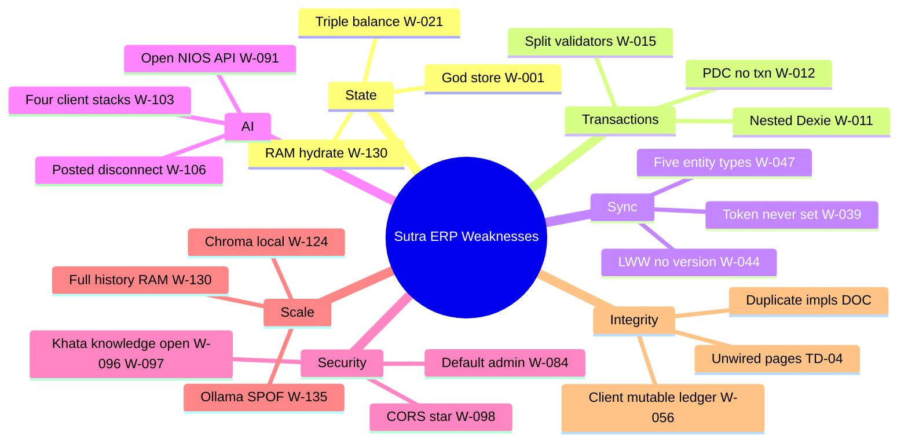
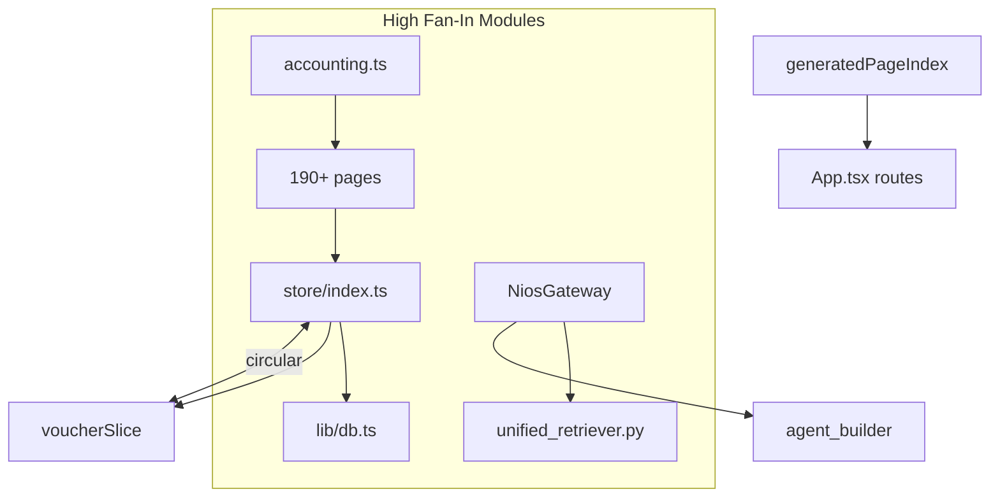
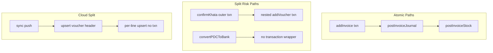
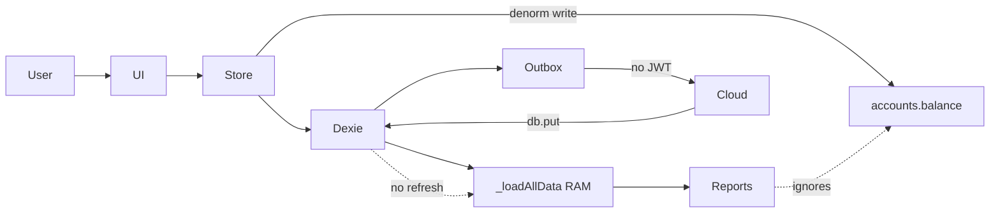
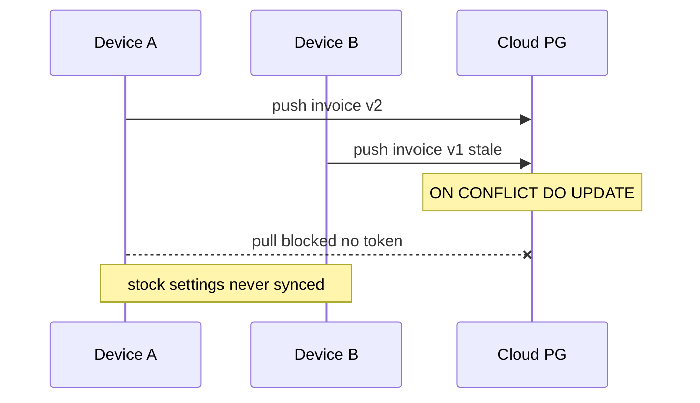
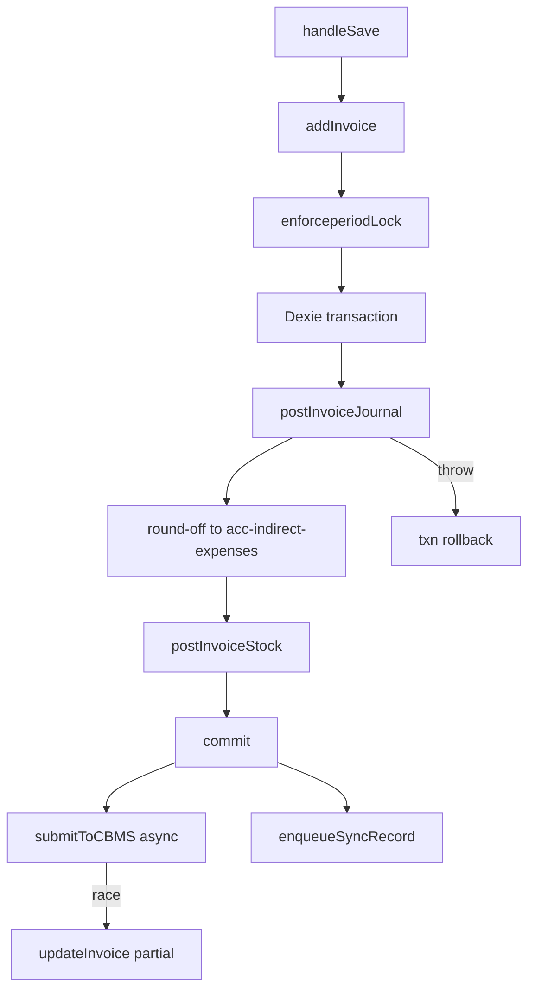
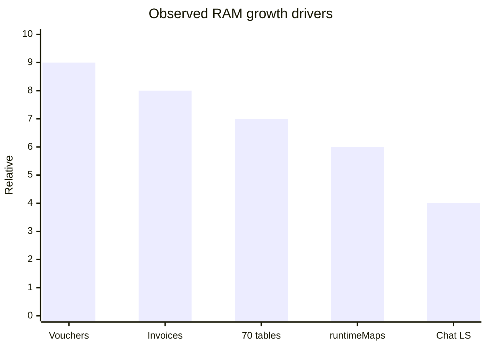
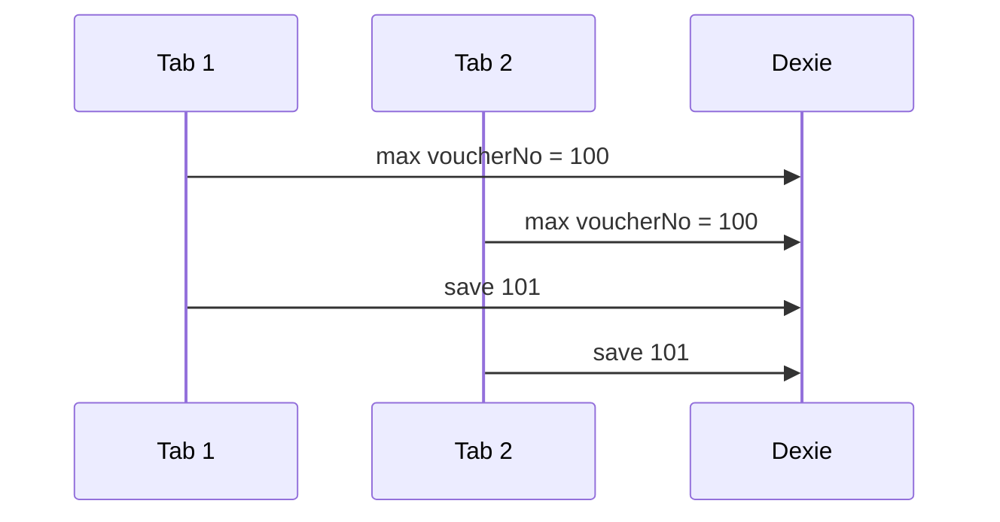
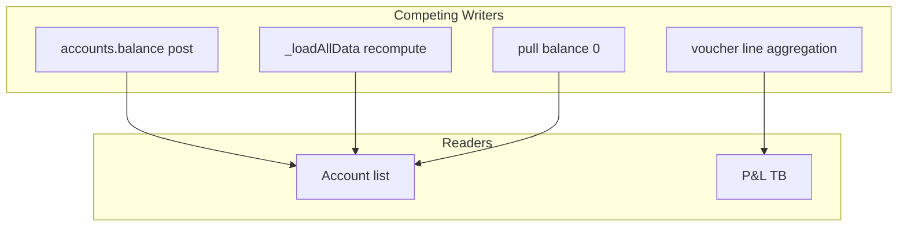
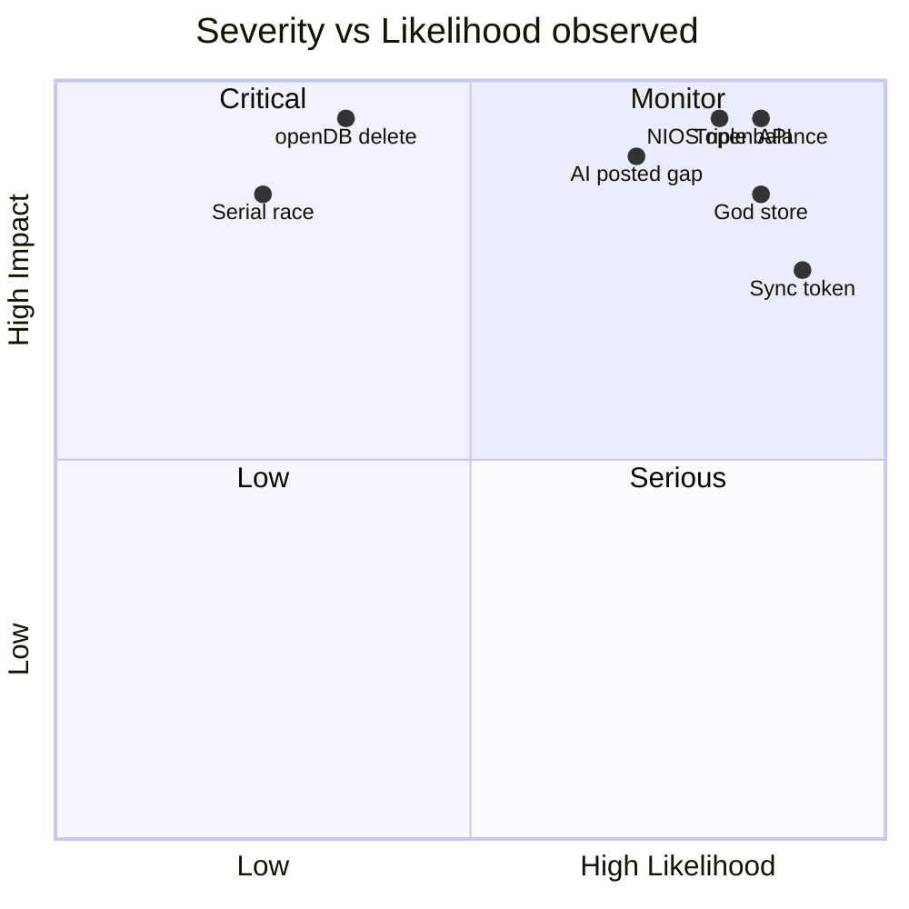

# SYSTEM-05: Critical Architecture Weakness Reconstruction

**Project:** Sutra ERP (BUSY ERP monorepo)  
**Session:** SYSTEM-05  
**Prerequisites:** SYSTEM-01, SYSTEM-02, SYSTEM-03, SYSTEM-04  
**Evidence basis:** RKB inventory 01–10, `Repository_Intelligence.md`, `CONVERSATION_EXPORT` spine reviews  
**Constraint:** Reconstruction only — no fixes, no redesign  
**Generated:** 2026-07-10

---

## Issue Record Schema

Each weakness **W-###** uses:

| Field | Description |
|-------|-------------|
| **ID** | Unique weakness identifier |
| **Category** | Integrity / coupling / security / sync / AI / scale / debt |
| **Subsystem** | SS-01…SS-11 or domain |
| **Observed Evidence** | File/function or doc reference |
| **Evidence Tags** | `[CODE]` `[DOC]` `[CONFIG]` `[INFERRED]` `[NOT OBSERVED]` |
| **Failure Scenario** | What breaks at runtime |
| **Propagation Path** | How failure spreads |
| **Likelihood** | Low / Medium / High |
| **Severity** | Low / Medium / High / Critical |
| **Detectability** | Low / Medium / High |
| **Business Impact** | Accounting / compliance / UX |
| **Technical Impact** | Data / state / API |
| **Affected Runtime Layers** | L0–L8 per SYSTEM-02 |
| **Related RKB IDs** | Prior verified facts |
| **Related SYSTEM-04 Sections** | Cross-reference |

Mapped finding families: **F-*** (spine), **TD-*** / **AD-*** / **R-*** / **C-*** (`Repository_Intelligence.md`), **RKB-*** (conversation export).

---

## SYSTEM-05.1 Global Architecture Weakness Map



| Domain | Density | Primary evidence | Tags |
|--------|---------|------------------|------|
| Client ERP core | Very high | F-SYS-01, F-STORE-*, F-VCH-*, TD-01–06 | `[CODE]` `[DOC]` |
| Accounting truth | Critical | CONTRADICTION-01/02, F-ACCT-01 | `[CODE]` |
| Sync dual-write | Critical | F-SYNC-01–11, F-SYNC-BE-01–11, AD-04 | `[CODE]` `[DOC]` |
| AI integration | Very high | F-KHATA-02, F-CONV-01, AD-01/02, F-NIOS-* | `[CODE]` `[DOC]` |
| Security surface | High | R-01–02, F-NIOS-API-*, TD-12/13/23 | `[CODE]` `[DOC]` |
| Operations | Medium–high | R-05, R-07, R-10, R-14, TD-16 | `[DOC]` |

---

## SYSTEM-05.2 Runtime Coupling Analysis



| ID | Coupling | Mechanism | Tags |
|----|----------|-----------|------|
| W-033 | pages ↔ store | 190+ direct `useStore` | `[DOC]` TD-01 |
| W-034 | voucherSlice ↔ index | Circular import posting helpers | `[CODE]` RKB-010 F-VCH-09 |
| W-035 | postInvoiceJournal ↔ seed COA | Hardcoded `acc-sales`, etc. | `[CODE]` TD-06 |
| W-036 | Falcon nav ↔ App.tsx | Build-time page index | `[DOC]` hidden coupling |
| W-037 | AI ↔ forms | `sessionStorage` draft string keys | `[DOC]` |
| W-038 | NIOS ↔ legacy agent | `classify_cascade` import | `[DOC]` AD-02 |
| W-039 | sync ↔ auth | Token read, never written | `[CODE]` F-SYNC-01 TD-19 |

---

## SYSTEM-05.3 Store Architecture Weaknesses

### W-001 — God Store Monolith

| Field | Value |
|-------|-------|
| **Category** | Maintainability / coupling |
| **Subsystem** | SS-01 |
| **Observed Evidence** | `store/index.ts` ~2300 lines; auth, CRUD, posting, payroll inline | `[DOC]` TD-01 |
| **Failure Scenario** | Change in invoice posting breaks unrelated payroll or auth path |
| **Propagation** | 190+ page consumers re-render or break |
| **Likelihood** | High |
| **Severity** | High |
| **Detectability** | Low without tests R-03 |
| **Business Impact** | Regression in production accounting |
| **Technical Impact** | Untestable unit boundaries |
| **Layers** | L2 |
| **RKB** | — |
| **SYSTEM-04** | §04.3 |

### W-002 — Duplicate Inventory Slice Spread

| Field | Value |
|-------|-------|
| **Category** | State duplication |
| **Subsystem** | SS-01 |
| **Observed Evidence** | `createInventorySlice` at :64 and `inventorySlice` at :1036 | `[CODE]` F-STORE-01 RKB-019 |
| **Failure Scenario** | Conflicting inventory actions or overwritten state |
| **Propagation** | Inventory pages → wrong stock arrays |
| **Likelihood** | Medium |
| **Severity** | Medium |
| **Detectability** | Low |
| **Business Impact** | Stock display errors |
| **Technical Impact** | Duplicate reducer keys |
| **Layers** | L2 |
| **RKB** | RKB-019 |
| **SYSTEM-04** | §04.3 |

| ID | Summary | Evidence |
|----|---------|----------|
| W-003 | Slices cosmetic; logic in index | AD-08 `[DOC]` |
| W-004 | `_loadAllData` full hydrate | F-STORE-04 `[CODE]` |
| W-005 | Init failure → `isDbReady: true` | F-STORE-02 RKB-014 `[CODE]` |
| W-006 | `logout` clears RAM not Dexie | RKB-025 `[CODE]` |
| W-007 | No selector layer | `[NOT OBSERVED]` |
| W-008 | Pull sync no Zustand refresh | `[CODE]` CONVERSATION_EXPORT |
| W-009 | `authSlice.ts` dead placeholder | `[DOC]` |
| W-010 | Dead imports in voucherSlice | F-VCH-07 `[CODE]` |

---

## SYSTEM-05.4 Transaction Integrity Problems



| ID | Issue | Evidence | Severity |
|----|-------|----------|----------|
| W-011 | Nested Dexie txns khata confirm | F-KHATA-06 `[CODE]` | High |
| W-012 | PDC convert without transaction | F-VCH-03 RKB-052 `[CODE]` | High |
| W-013 | Khata batch partial failure | F-KHATA-04 `[CODE]` | Medium |
| W-014 | No khata confirm idempotency | F-KHATA-05 `[CODE]` | Medium |
| W-015 | Parallel validators throw vs return | F-KHATA-03 RKB-011 `[CODE]` | Medium |
| W-016 | `updateInvoice` skips stock if jnl exists | F-VCH-01 RKB-047 `[CODE]` | High |
| W-017 | Audit log failure swallowed | `[CODE]` voucherSlice | Medium |
| W-018 | Server voucher header/lines no txn | F-SYNC-BE-03 `[CODE]` | High |
| W-019 | Server orphan lines on edit | F-SYNC-BE-04 `[CODE]` | High |
| W-020 | `operation` ignored server-side | F-SYNC-BE-02 RKB-072 `[CODE]` | High |

---

## SYSTEM-05.5 State Management Problems

### W-021 — Triple Ledger Truth Model

| Field | Value |
|-------|-------|
| **Category** | SSOT violation / data integrity |
| **Subsystem** | SS-01 Accounting |
| **Observed Evidence** | `postInvoiceJournal` writes `accounts.balance`; `computeProfitLoss` aggregates voucher lines; `_loadAllData` recomputes on login | `[CODE]` F-SYS-01 F-ACCT-01 RKB-012 RKB-013 |
| **Failure Scenario** | Account list shows balance X; P&L/TB shows Y for same account |
| **Propagation** | post → denorm → UI; reports read vouchers → diverge |
| **Likelihood** | High |
| **Severity** | Critical |
| **Detectability** | Low (silent) |
| **Business Impact** | Wrong financial decisions; audit failure |
| **Technical Impact** | CONTRADICTION-01 |
| **Layers** | L2, L3, L4 |
| **RKB** | RKB-011, RKB-012, RKB-013, RKB-022 |
| **SYSTEM-04** | §04.3, §04.5, §04.14 |

| ID | Issue | Evidence |
|----|-------|----------|
| W-022 | Mid-session denorm vs reports | CONTRADICTION-02 `[CODE]` partial |
| W-023 | Party balance not updated khata | F-KHATA-07 `[CODE]` |
| W-024 | Falcon module-global memory | TD-10 R-09 `[DOC]` |
| W-025 | eKhata module-global context | TD-11 `[DOC]` |
| W-026 | AI stores separate from god store | `[DOC]` |
| W-027 | `updateVoucher` partial Zustand merge | F-VCH-06 `[CODE]` |
| W-028 | Duplicate `costCenters` / `costCentres` | `[DOC]` |
| W-029 | Duplicate `salesPersons` / `salespersons` | `[DOC]` |

---

## SYSTEM-05.6 Data Flow Weaknesses



| ID | Weakness | Ref |
|----|----------|-----|
| W-021 | Reports vs denorm balance | |
| W-008 | Pull without RAM refresh | |
| W-040 | CBMS outside invoice txn | F-INV-03 |
| W-041 | NIOS events swallowed | RKB-024 |
| W-042 | Form skips `validateDoubleEntry` | F-INV-01 |

---

## SYSTEM-05.7 Synchronization Weaknesses



| ID | Finding | Severity | Tags |
|----|---------|----------|------|
| W-039 | `sutra_access_token` never written | Critical | `[CODE]` F-SYNC-01 |
| W-040 | No idle pull when outbox empty | High | `[CODE]` F-SYNC-02 |
| W-041 | Outbox no entity dedup | High | `[CODE]` F-SYNC-03 |
| W-042 | Pull forces `balance: 0` | High | `[CODE]` F-SYNC-04 |
| W-043 | Pull keeps local voucher lines | High | `[CODE]` F-SYNC-05 |
| W-044 | No versioning / optimistic lock | Critical | `[CODE]` F-SYNC-06 |
| W-045 | Silent pull HTTP failure | Medium | `[CODE]` F-SYNC-07 |
| W-046 | Outbox never pruned | Medium | `[CODE]` F-SYNC-08 |
| W-047 | Only 5 entity types synced | High | `[CODE]` F-SYNC-09 |
| W-048 | No delete tombstones | Medium | `[CODE]` F-SYNC-10 |
| W-049 | `syncedAt` vs `status` mismatch | Low | `[CODE]` F-SYNC-11 |
| W-050 | Server LWW upsert | Critical | `[CODE]` F-SYNC-BE-01 |
| W-051 | No server outbox id dedup | High | `[CODE]` F-SYNC-BE-06 |
| W-052 | Default account UUID on missing line | High | `[CODE]` F-SYNC-BE-08 |
| W-053 | Silent skip records without id | Medium | `[CODE]` F-SYNC-BE-09 |
| W-054 | Weak sync payload validation | High | `[CODE]` F-SYNC-BE-11 |

---

## SYSTEM-05.8 Offline-first Design Risks

| ID | Risk | Evidence |
|----|------|----------|
| W-055 | Dexie vs PG unverified reconciliation | F-SYS-03 AD-04 `[CODE]` `[DOC]` |
| W-056 | Client ledger mutable; cloud immutable | C-12 `[DOC]` |
| W-057 | Stock movements not synced | F-SYNC-09 `[CODE]` |
| W-058 | Multi-device duplicate events | F-SYNC-03 `[CODE]` |
| W-059 | `openDB` deletes DB on timeout | F-DB-01 RKB-082 `[CODE]` |
| W-060 | Offline brains vs LLM-required paths | AD-07 `[DOC]` |
| W-061 | Khata triple implementation | C-15 AD-14 `[DOC]` |

---

## SYSTEM-05.9 Invoice Pipeline Failure Modes



| ID | Mode | Evidence |
|----|------|----------|
| W-042 | No pre `validateDoubleEntry` | F-INV-01 `[CODE]` |
| W-063 | Auto round-off masks imbalance | F-STORE-05 `[CODE]` |
| W-064 | Hardcoded COA IDs | TD-06 `[CODE]` |
| W-040 | CBMS async race | F-INV-03 `[CODE]` |
| W-065 | Inactive party check wrong | F-INV-02 `[CODE]` |
| W-066 | Line IDs `Math.random()` | F-INV-04 `[CODE]` |
| W-016 | updateInvoice stock skip | F-VCH-01 `[CODE]` |
| W-068 | Concurrent invoice numbering | R-08 `[DOC]` |

---

## SYSTEM-05.10 Voucher Pipeline Failure Modes

| ID | Mode | Evidence |
|----|------|----------|
| W-069 | Cancel bypasses period lock | F-VCH-04 RKB-051 `[CODE]` |
| W-070 | Reversal into locked period | F-VCH-04 `[CODE]` |
| W-071 | Khata no stock movements | RKB-028 F-KHATA-01 `[CODE]` |
| W-072 | `generateSerialNumberSync` random | F-ACCT-02 `[CODE]` |
| W-073 | Triple numbering functions | `[CODE]` SYSTEM-03 |
| W-074 | `periodLocks` schema gap | RKB-083 `[NOT OBSERVED]` |
| W-075 | `guardPostedVoucher` inconsistent | F-VCH-08 `[CODE]` |
| W-076 | Banking ops mostly non-transactional | `[CODE]` voucherSlice |

---

## SYSTEM-05.11 Inventory Consistency Risks

| ID | Risk | Evidence |
|----|------|----------|
| W-077 | Movement-based; no item qty in slice | `[CODE]` |
| W-078 | Stock not in sync scope | F-SYNC-09 `[CODE]` |
| W-079 | `postInvoiceStock` reads Zustand inside txn | `[CODE]` |
| W-080 | Reversal additive; originals kept | RKB-049 `[CODE]` |
| W-081 | Negative stock behavior | `[NOT OBSERVED]` |
| W-082 | Valuation / costing | `[NOT OBSERVED]` |
| W-083 | schemes/BOM referenced not in schema | TD-21 `[DOC]` |

---

## SYSTEM-05.12 Authentication & Session Risks

| ID | Risk | Evidence |
|----|------|----------|
| W-084 | Default admin/admin123 seed | F-STORE-03 RKB-020 `[CODE]` |
| W-085 | sessionStorage-only client session | `[CODE]` |
| W-086 | Cloud JWT not wired to SPA login | F-SYNC-01 TD-19 `[CODE]` |
| W-087 | Three auth models coexist | C-03 `[DOC]` |
| W-088 | App 10s auth timeout → gateway | RKB-080 `[CODE]` |
| W-089 | Legacy password formats | `[DOC]` |
| W-090 | PII in localStorage | R-16 `[DOC]` |

---

## SYSTEM-05.13 Security Architecture Weaknesses

| ID | Risk | Evidence | Likelihood | Severity |
|----|------|----------|------------|----------|
| W-091 | NIOS API unauthenticated 47 routes | F-NIOS-API-01 RKB-056 `[CODE]` | High | Critical |
| W-092 | Tenant impersonation via body | F-NIOS-API-02 `[CODE]` | High | Critical |
| W-093 | Governance decide unauthenticated | F-NIOS-API-03 `[CODE]` | Medium | High |
| W-094 | Public capability execution | F-NIOS-API-05 `[CODE]` | Medium | Critical |
| W-095 | Spoofed ERP events to NIOS | F-NIOS-API-11 `[CODE]` | Medium | High |
| W-096 | Knowledge API no auth | R-01 TD-12 `[DOC]` | Medium | High |
| W-097 | Khata API no JWT | R-02 TD-13 `[DOC]` | Medium | High |
| W-098 | erp_bot CORS `*` | TD-23 R-13 `[DOC]` | High | Medium |
| W-099 | SSE exception strings to client | F-NIOS-API-08 `[CODE]` | Medium | Medium |
| W-100 | Unbounded OCR upload | F-NIOS-API-07 `[CODE]` | Low | Medium |
| W-101 | Public endpoint catalog | F-NIOS-API-09 `[CODE]` | High | Low |
| W-102 | src/server.js default PG creds | TD-22 `[DOC]` | Medium | High |

---

## SYSTEM-05.14 AI Runtime Weaknesses

| ID | Weakness | Evidence |
|----|----------|----------|
| W-103 | Four parallel client AI stacks | AD-01 `[DOC]` |
| W-104 | Three server intelligence stacks | AD-02 `[DOC]` |
| W-105 | NIOS flag vs client stubs | C-05 AD-15 `[DOC]` |
| W-106 | Server `posted` ≠ Dexie write | F-CONV-01 F-KHATA-02 `[CODE]` |
| W-107 | eKhataStore ignores `/v2/chat` | RKB-031 `[CODE]` |
| W-108 | Session file persist no lock | F-CONV-02 `[CODE]` |
| W-109 | NIOS cache message-only key | F-NIOS-02 RKB-018 `[CODE]` |
| W-110 | NIOS khata route no Dexie write | F-NIOS-03 `[CODE]` |
| W-111 | IntelligenceCore unwired exports | TD-26 TD-27 `[DOC]` |
| W-112 | processMessage god-router | TD-08 `[DOC]` |
| W-113 | runtimeMaps 8000+ lines bundle | TD-09 `[DOC]` |
| W-114 | Agent in-memory sessions | RKB-084 `[CODE]` |
| W-115 | SutraAiProvider desktop omitted | C-13 `[DOC]` |

---

## SYSTEM-05.15 NIOS Integration Weaknesses

| ID | Weakness | Evidence |
|----|----------|----------|
| W-116 | Client Phase-0 stubs vs full server | AD-15 `[DOC]` |
| W-117 | Single Dexie company vs NIOS tenant IDs | C-04 AD-06 `[DOC]` |
| W-118 | emitNiosEvent swallowed | RKB-024 `[CODE]` |
| W-119 | NIOS imports legacy agent cascade | AD-02 `[DOC]` |
| W-120 | Operational POST endpoints exposed | F-NIOS-API-04 `[CODE]` |
| W-121 | Weak Pydantic on most routes | F-NIOS-API-10 `[CODE]` |
| W-122 | JWT not observed on NIOS path | F-NIOS-API-12 `[CODE]` |

---

## SYSTEM-05.16 Knowledge System Risks

| ID | Risk | Evidence |
|----|------|----------|
| W-123 | Unauthenticated tenant doc API | R-01 `[DOC]` |
| W-124 | Single-threaded ingest worker | TD-16 `[DOC]` |
| W-125 | Chroma data loss on redeploy | R-14 AD-10 `[DOC]` |
| W-126 | backend mount silent fail | R-07 `[DOC]` |
| W-127 | PDF OCR not implemented | TD-14 `[DOC]` |
| W-128 | PyMuPDF not in requirements | TD-15 `[DOC]` |
| W-129 | No Alembic; raw schema.sql | TD-17 `[DOC]` |
| W-130 | Dual Chroma systems | `[DOC]` duplicates |

---

## SYSTEM-05.17 Performance Bottlenecks

| ID | Bottleneck | Evidence |
|----|------------|----------|
| W-131 | `_loadAllData` O(all tables) | F-STORE-04 `[CODE]` |
| W-132 | Reports scan full voucher RAM | `[CODE]` |
| W-133 | `generateSerialNumber` read-all-max | `[CODE]` |
| W-134 | 190 @ts-nocheck pages | TD-03 R-15 `[DOC]` |
| W-135 | Build 6GB heap | R-10 `[DOC]` |
| W-136 | Ollama 32B GPU SPOF | AD-11 R-05 `[DOC]` |
| W-137 | NIOS gateway / unified_retriever fan-in | `[DOC]` |

---

## SYSTEM-05.18 Memory Consumption Analysis



| ID | Consumer | Evidence |
|----|----------|----------|
| W-138 | Full voucher/invoice in Zustand | F-STORE-04 `[CODE]` |
| W-139 | 70+ table hydrate | TD-20 `[CODE]` |
| W-140 | runtimeMaps.ts volume | TD-09 `[DOC]` |
| W-141 | syncOutbox append-only | F-SYNC-08 `[CODE]` |
| W-142 | Chroma embedded in-process | AD-10 `[DOC]` |
| W-143 | Ollama model VRAM | `[DOC]` |
| W-144 | Module-global AI memory | TD-10/11 `[DOC]` |

---

## SYSTEM-05.19 Startup Bottlenecks

| Step | Bottleneck | ID |
|------|------------|-----|
| Dexie migrate v18–22 | Schema chain latency | `[DOC]` |
| openDB 15s timeout | False ready | W-005 |
| Seed + migrateWorkflowFields | Blocks boot | `[CODE]` |
| `_loadAllData` | Dominates authenticated start | W-131 |
| CBMS worker start | Extra init | `[CODE]` |
| erp_bot KB init | Separate process | `[DOC]` |

---

## SYSTEM-05.20 Concurrency Analysis

| Surface | Model | Weakness |
|---------|-------|----------|
| Dexie IDB | Per-origin | Multi-tab writes `[NOT OBSERVED]` |
| Zustand | Per-tab RAM | No cross-tab sync |
| Numbering | max-scan | R-08 W-068 |
| syncEngine | `isSyncing` single-flight | Does not guard Dexie |
| erp_bot sessions | In-memory dict | F-CONV-02 |
| Knowledge worker | Single thread | TD-16 |

---

## SYSTEM-05.21 Race Conditions



| ID | Race | Evidence |
|----|------|----------|
| W-068 | Serial number collision | R-08 F-ACCT-02 `[CODE]` `[DOC]` |
| W-147 | CBMS updateInvoice after navigate | F-INV-03 `[CODE]` |
| W-148 | Push batch all rows fail together | `[CODE]` |
| W-149 | Khata duplicate confirm | F-KHATA-05 `[CODE]` |
| W-150 | Concurrent sync LWW | F-SYNC-BE-01 `[CODE]` |

---

## SYSTEM-05.22 Failure Recovery Weaknesses

| ID | Gap | Evidence |
|----|-----|----------|
| W-151 | No shutdown teardown | `[NOT OBSERVED]` |
| W-152 | openDB destructive delete | F-DB-01 `[CODE]` |
| W-153 | Init catch → no-company no retry | F-STORE-02 `[CODE]` |
| W-154 | Pull failure silent | F-SYNC-07 `[CODE]` |
| W-155 | Khata batch no compensation | F-KHATA-04 `[CODE]` |
| W-156 | Chroma no CI backup | R-14 `[DOC]` |
| W-157 | Session files no lock | F-CONV-02 `[CODE]` |
| W-158 | No rollback partial cloud sync | F-SYNC-BE-03 `[CODE]` |

---

## SYSTEM-05.23 Error Handling Analysis

| Pattern | Risk ID |
|---------|---------|
| Swallow audit on voucher add | W-017 |
| Swallow NIOS events | W-041 |
| Swallow pull after push | `[CODE]` |
| Silent pull `!res.ok` | W-045 |
| SSE `str(exc)` to client | W-099 |
| Enhancer broad swallow | F-CONV-03 W-159 |
| Init masks DB errors | W-005 |

---

## SYSTEM-05.24 Event System Weaknesses

| ID | Weakness | Evidence |
|----|----------|----------|
| W-160 | `sync.started`/`finished` not observed | `[NOT OBSERVED]` |
| W-161 | NIOS client events swallowed | RKB-024 `[CODE]` |
| W-162 | Spoofable server event ingest | F-NIOS-API-11 `[CODE]` |
| W-163 | Untyped `navigate` CustomEvent | `[DOC]` |
| W-164 | No guaranteed voucher.posted subscriber | `[INFERRED]` |
| W-165 | Browser bus vs kernel bus disconnected | `[DOC]` |

---

## SYSTEM-05.25 Reporting Consistency Risks

| ID | Risk | Evidence |
|----|------|----------|
| W-166 | Reports vs denorm balance | F-ACCT-01 `[CODE]` |
| W-167 | Triple P&L/BS paths | TD-05 `[DOC]` |
| W-168 | BS embeds P&L filter | F-ACCT-03 `[CODE]` |
| W-169 | Pull zeros balance | F-SYNC-04 `[CODE]` |
| W-170 | Mid-session account widget wrong | CONTRADICTION-02 `[CODE]` |

---

## SYSTEM-05.26 Background Worker Problems

| Worker | Weakness |
|--------|----------|
| Sync 30s poll | No idle pull W-040; no backoff |
| CBMS | Async race W-040 |
| Knowledge | Single thread W-124 |
| Auto backup | Interval `[NOT OBSERVED]` |
| File watcher | Reindex load `[DOC]` |
| khata-app SW | Separate queue `[DOC]` |

---

## SYSTEM-05.27 Cloud Sync Failure Matrix

| Scenario | Client | Server | Outcome |
|----------|--------|--------|---------|
| No JWT | Pull no-op | Auth blocks | W-039 |
| Stale push | Enqueue always | LWW upsert | W-050 |
| Idle device | No pull | — | W-040 |
| Pull 500 | Silent return | — | W-045 |
| Edit lines | Push full | Orphan lines | W-019 |
| Missing accountId | — | Default UUID | W-052 |
| Duplicate outbox | All pushed | Re-upsert | W-041 W-051 |
| Stock change | Not enqueued | — | W-047 |

---

## SYSTEM-05.28 Data Ownership Violations



| Violation | ID |
|-----------|-----|
| Balance triple authority | W-021 |
| Party balance vs ledger | W-023 |
| Cloud immutable vs client mutable | W-056 |
| NIOS tenant vs Dexie company | W-117 |
| Server posted vs client ERP | W-106 |
| Pull without RAM owner refresh | W-008 |
| Triple khata | W-061 |

---

## SYSTEM-05.29 Single Source of Truth Violations

| Concept | Authorities | ID |
|---------|-------------|-----|
| Account balance | denorm / lines / login | W-021 |
| Ledger lines | local pull vs server | W-043 |
| Navigation | 4 sources | `[DOC]` |
| P&L/BS | 3 implementations | W-167 |
| AI path | NIOS + 3 legacy | W-103 |
| Khata post | Dexie / PG / server card | W-061 |
| ERP API | packages/backend vs server.js | AD-05 |

---

## SYSTEM-05.30 Hidden Technical Debt Inventory

See TD-01 through TD-27 and AD-01 through AD-15 in `Repository_Intelligence.md` `[DOC]`. Consolidated count: **42 tracked debt items**.

---

## SYSTEM-05.31 Architecture Smells

| Smell | ID |
|-------|-----|
| God object | W-001 |
| Shotgun surgery | W-033 |
| Circular dependency | W-034 |
| Dead code | `[DOC]` §13 |
| Stringly routing | AD-03 W-172 |
| Lava flow legacy stacks | `[DOC]` §14 |
| Magic strings drafts | W-037 |
| Silent catch | W-017 W-041 W-045 |

---

## SYSTEM-05.32 Scalability Limits

| Dimension | Limit | ID |
|-----------|-------|-----|
| Client data volume | Full RAM hydrate | W-131 |
| Multi-tab | Numbering races | W-068 |
| Multi-device | Partial sync LWW | W-055 |
| AI throughput | Single GPU | W-136 |
| Vectors | Local Chroma disk | W-125 |
| Ingest | Single worker | W-124 |
| Outbox | Unbounded rows | W-046 |
| UI surface | 107 unwired pages | TD-04 |

---

## SYSTEM-05.33 Maintainability Risks

W-172 (no React Router), W-173 (build nav index), W-174 (import aliases), W-175 (801-file frontend), W-176 (polyglot monorepo), W-177 (no circ-dep CI), W-178 (no store tests), W-179 (stale deploy docs C-01) — all `[DOC]`.

---

## SYSTEM-05.34 Testing Obstacles

God store R-03; circular imports W-034; Dexie coupling; Ollama GPU; 190 @ts-nocheck R-15; multi-stack AI AD-01; partial Playwright `[DOC]`.

---

## SYSTEM-05.35 Deployment Risks

W-180 erp_bot GPU SPOF; W-181 misleading proxy status C-09; W-182 backend mount silent R-07; W-183 Chroma not durable R-14; W-184 Lovable force-push R-18; W-185 Docker no NLU R-19; W-186 deploy doc contradiction C-01.

---

## SYSTEM-05.36 Future Evolution Blockers

AD-01 through AD-15 `[DOC]`: four AI stacks, three server stacks, dual persistence, god store, Chroma scale, Ollama dependency, 107 orphan pages, khata triple impl, NIOS stubs.

---

## SYSTEM-05.37 Architecture Contradictions

| ID | Contradiction |
|----|---------------|
| C-01 | GEMINI Next.js vs Vite Render |
| C-02 | Orbix/Falcon naming |
| C-03 | Three auth models |
| C-04 | Single company vs NIOS tenant |
| C-05 | NIOS flag vs stubs |
| C-12 | Immutable cloud vs mutable client |
| C-13 | SutraAi mobile only |
| C-15 | Two Khata products |
| CONTRADICTION-01 | denorm vs report lines |
| CONTRADICTION-02 | login recompute vs live denorm |
| C-09 | serve.mjs misleading offline |
| C-10 | Redis unused in erp_bot |

---

## SYSTEM-05.38 Evidence Gap Register

| Gap | Impact |
|-----|--------|
| Multi-tab Dexie concurrency | Race severity unknown |
| periodLocks schema | Lock model incomplete RKB-083 |
| Negative stock / costing | Inventory risk unknown |
| Approval on post | Control gap unknown |
| voucherNumbering.ts | Numbering domain unverified |
| syncPull.ts server | Pull half unverified RKB-077 |
| Shutdown/teardown | Recovery incomplete |
| Permission matrix | Security coverage unknown |

---

## SYSTEM-05.39 Risk Severity Matrix



**P0 (Critical):** W-021, W-039, W-044, W-050, W-056, W-059, W-091, W-092, W-106  
**P1 (High):** W-011–W-020, W-040–W-048, W-063, W-069, W-078, W-103, W-131  
**P2 (Medium):** W-045, W-046, W-072, W-099, W-123, W-134  
**P3 (Low):** W-049, W-101, TD-18, TD-25

---

## SYSTEM-05.40 Canonical Weakness Model

**Name:** Optimistic offline monolith with competing truth planes

```
Truth Planes:
  P1 Dexie write authority
  P2 Zustand RAM read authority (UI + reports)
  P3 accounts.balance denorm (account list mid-session)
  P4 PostgreSQL (when sync works — often disabled W-039)
  P5 AI server chat semantics (not ERP persistence)

Failure Classes:
  A Silent divergence (balance, sync, AI posted)
  B Explicit throw (period lock, validateVoucherBalance)
  C Destructive recovery (openDB delete W-059)
  D Security exposure (open APIs W-091–W-097)
  E Scale ceiling (RAM W-131, GPU W-136, Chroma W-125)
```

---

# Ranked Weakness Lists

## 1. Top 100 Critical Weaknesses (severity × evidence)

1. W-021 Triple balance truth — 2. W-091 NIOS open API — 3. W-092 Tenant spoof — 4. W-059 openDB delete — 5. W-056 Client mutable ledger — 6. W-050 Server LWW — 7. W-044 No versioning — 8. W-106 AI posted disconnect — 9. W-039 Sync token never set — 10. W-094 Capability exec open — 11. W-097 Khata no JWT — 12. W-096 Knowledge no auth — 13. W-063 Round-off mask — 14. W-001 God store — 15. W-055 Dual persistence — 16. W-016 Stock skip on update — 17. W-012 PDC no txn — 18. W-043 Pull local lines — 19. W-042 Pull balance zero — 20. W-019 Orphan server lines — 21. W-018 Partial cloud voucher — 22. W-052 Default account UUID — 23. W-084 Default admin — 24. W-064 Hardcoded COA — 25. W-131 Full RAM hydrate — 26. W-005 Init masks ready — 27. W-040 Idle no pull — 28. W-103 Four AI stacks — 29. W-104 Three server stacks — 30. W-011 Nested Dexie khata — 31. W-013 Batch khata partial — 32. W-014 Khata no idempotency — 33. W-069 Cancel no period lock — 34. W-071 Khata no stock — 35. W-078 Stock not synced — 36. W-068 Serial race — 37. W-072 Random sync serial — 38. W-041 NIOS events swallowed — 39. W-042 Form no validateDoubleEntry — 40. W-040 CBMS race — 41. W-095 Spoofed NIOS events — 42. W-098 CORS star — 43. W-117 Tenant mismatch — 44. W-105 NIOS stubs — 45. W-136 Ollama SPOF — 46. W-125 Chroma data loss — 47. W-126 Backend mount silent — 48. W-008 Pull no RAM refresh — 49. W-041 Outbox no dedup — 50. W-046 Outbox growth — 51. W-034 Circular import — 52. W-002 Duplicate slice — 53. W-167 Triple P&L/BS — 54. W-170 Report vs list — 55. W-023 Party balance — 56. W-173 Nav build coupling — 57. W-172 Unwired pages — 58. W-061 Triple khata — 59. W-020 Operation ignored — 60. W-051 Server outbox no dedup — 61. W-045 Silent pull — 62. W-099 SSE leak — 63. W-093 Governance open — 64. W-109 NIOS cache key — 65. W-110 NIOS khata no write — 66. W-112 processMessage router — 67. W-113 runtimeMaps bundle — 68. TD-02 db nocheck — 69. W-135 Build OOM — 70. W-178 No store tests — 71. W-114 Agent sessions RAM — 72. W-108 Session file no lock — 73. W-157 Session race — 74. W-015 Dual validators — 75. W-075 guard inconsistent — 76. W-027 Partial voucher merge — 77. W-066 Random line IDs — 78. W-065 Inactive party — 79. W-017 Audit swallowed — 80. W-159 Enhancer swallow — 81. W-083 Missing tables — 82. W-074 periodLocks gap — 83. W-088 Auth timeout — 84. W-181 Proxy status — 85. W-102 server.js creds — 86. W-100 OCR DoS — 87. W-124 Single worker — 88. W-054 Weak validation — 89. W-053 Silent skip id — 90. W-048 No tombstones — 91. W-049 Status mismatch — 92. W-024 Falcon memory — 93. W-025 eKhata context — 94. W-146 Multi-tab RAM — 95. W-115 SutraAi omitted — 96. TD-26 unwired handler — 97. W-038 NIOS legacy dep — 98. W-130 Dual Chroma — 99. W-185 Docker NLU — 100. W-186 Doc contradiction

## 2. Top 50 Hidden Risks (low detectability)

1. W-021 balance divergence — 2. W-106 AI posted empty books — 3. W-039 sync disabled — 4. W-045 pull silent — 5. W-005 init masks failure — 6. W-043 stale lines — 7. W-052 wrong account — 8. W-017 audit swallow — 9. W-041 NIOS swallow — 10. W-008 RAM stale after pull — 11. W-022 mid-session drift — 12. W-023 party balance — 13. W-016 posted no stock — 14. W-011 nested txn — 15. W-020 operation ignored — 16. W-053 missing id skip — 17. W-074 periodLocks missing — 18. W-107 v2 unwired — 19. W-126 mount silent — 20. W-181 proxy status — 21. W-049 status confusion — 22. W-027 partial voucher — 23. W-146 tab numbering — 24. W-147 CBMS partial — 25. W-024 AI memory leak — 26. W-164 no event handler — 27. W-165 bus disconnected — 28. W-110 NIOS cards only — 29. W-109 cache collision — 30. W-168 P&L path pick — 31. W-029 duplicate tables — 32. W-037 draft keys — 33. W-036 stale falcon index — 34. W-083 missing schema — 35. W-076 banking split — 36. W-080 double reversal edge — 37. W-081 negative stock — 38. W-151 no shutdown — 39. W-157 file session race — 40. W-114 restart loses chat — 41. W-077 qty drift — 42. W-079 stale Zustand stock — 43. W-050 stale overwrite — 44. W-041 outbox replay — 45. W-096 tenant UUID guess — 46. W-092 body spoof — 47. W-095 fake events — 48. W-028 cost centre dup — 49. W-171 naming confusion — 50. W-105 stubs look live

## 3. Top 50 Silent Failure Points

emitNiosEvent swallow; audit swallow; pull `!res.ok` return; pull after push swallow; init catch ready; round-off auto-balance; low evidence NIOS fallback; enhancer swallow; sync missing id continue; pull balance 0; pull local lines kept; default account UUID; operation ignored; delete not synced; server posted semantic; eKhata ignores posted; sync status misleading; serve.mjs online C-09; backend mount try/except; CBMS .then no await; batch khata partial; pendingCard on error; logout no Dexie clear; outbox never deleted; status vs syncedAt; safeTableGet no-op; unwired page fallback; generateSerialNumberSync random; dead imports; UnknownPartyHandler unwired; feedbackCalibrator unused; authSlice empty; companyRoutes stub; Redis unused; idle no pull; push without token; server Unnamed defaults; num()→0 coercion; clientIdToUuid hash; orphan lines accumulate; reversal no period lock; PDC split; party balance stale; denorm stale; reports ignore denorm opposite; NIOS stubs functional appearance; Docker NLU mock; bool false default; records dropped no failed

## 4. Top 50 Data Corruption Risks

W-021; W-050; W-044; W-043; W-042; W-016; W-012; W-011; W-013; W-014; W-019; W-018; W-052; W-068; W-072; W-059; W-056; W-069; W-080 edge; W-047; W-078; W-041; W-020; W-023; W-063; W-064; W-028; W-061; stale push; outbox replay; W-008; W-170; W-077; W-083; W-029; F-SYNC-BE-05; W-053; W-054; W-066; W-147; jnl exists no stock; cancel stock logic; PG vs Dexie edit; multi-device dup IDs; outbox order; IDB bloat; VersionError delete; periodLocks no-op; schemes runtime error; dual Chroma divergence

## 5. Top 50 Performance Risks

W-131; W-132; W-133; W-113; W-135; W-136; W-137; W-139; W-141; W-124; W-125; W-112; W-111; W-114; W-142; W-143; W-046; 30s poll; W-100; W-120; R-10; TD-03; W-175; W-004; W-145 migrate; W-005 timeout; file watcher; W-088; full history RAM; no pagination INFERRED; no virtualization NOT OBSERVED; SSE backpressure NOT OBSERVED; NIOS 200 caps boot; hybrid RAG per query; embed cache; BM25 pickle; provenance SQLite; orbix memory SQLite; session JSON disk; SutraAiDexie cache; localStorage chat; Table any indexes; OLLAMA_NUM_PARALLEL 2; push batch 20; per-line upsert loops; max-scan herd; Playwright CI; ekhata-ci heavy; manual chunks large

## 6. Top 50 Maintainability Risks

TD-01; TD-04; AD-03; W-034; TD-08; AD-01; AD-02; TD-05; W-173; W-174; TD-02; TD-03; W-177; W-178; AD-05; AD-08; W-010; TD-26; TD-27; authSlice; dead invoice forms; Tally stack; legacy agent; falcon_trader; ekhataLlmClient; server.js; GEMINI stale; C-02 naming; W-171; 801 files; 334 erp_bot; manager 1400 lines; gateway central; 30+ try branches; runtimeMaps 8k; PYTHONPATH fragile; no shared types; 100 string routes; F12 coupling; duplicate report dirs; duplicate order pages; unused Header Gateway; tally unwired; TD-25; JS/TS mix; nios contracts only; khata-app separate; 66 scripts; 17 pytest; 2 e2e; AGENTS vs 214 pages

## 7. Top 50 AI Integration Risks

W-106; W-107; F-KHATA-02; W-103; W-104; W-105; W-109; W-110; W-091; W-092; W-095; W-094; W-114; W-108; W-111; W-112; W-113; W-024; W-025; W-115; W-038; F-NIOS-03; F-NIOS-04; F-CONV-05; AD-07; AD-14; W-061; R-11; W-071; W-014; RKB-033; W-037; C-05; R-20; W-120; W-099; W-100; W-101; F-NIOS-API-10; W-122; erpBotClient flag; VITE_SELF_CONTAINED_AI; offline brains limited; qlora optional; orbix-nepali optional; cascade routing; unified_tools; citation_qa gaps; UnknownPartyHandler; confirm vs manager parallel

## 8. Top 50 Sync Risks

W-039; W-040; W-044; W-050; W-041; W-042; W-043; W-045; W-046; W-047; W-048; W-049; W-020; W-018; W-019; W-051; W-052; W-053; W-054; W-008; W-055; W-056; W-057; W-058; F-SYNC-BE-05; RKB-070; RKB-076; F-SYNC-BE-07; RKB-077 NOT OBSERVED; push no token; 30s no backoff; batch all fail; syncedAt status; no conflict UI; watermark only; no device id; invoice line merge; voucher local lines; party replace; item replace; no cancel tomb; cancelled on cloud INFERRED; JWT 15m no refresh CONFIG; messaging token read; C-03 auth split; two Express; immutable client gap; khata PG separate; knowledge not synced; CBMS not synced

## 9. Top 50 Security Risks

W-091; W-092; W-094; W-095; W-096; W-097; W-093; W-098; W-099; W-100; W-101; W-084; W-102; W-086; W-090; F-NIOS-API-04; F-NIOS-API-06; R-17 webhook; RKB-058 no rate limit; erp_bot no JWT; khata tenant body; knowledge tenant param; VITE_BRAVE in bundle; webhook unset; JWT dev fallback; immutable cloud only; Dexie no encryption; sessionStorage XSS INFERRED; CSP NOT OBSERVED; CSRF NOT OBSERVED; bcrypt vs PBKDF2; legacy passwords; loginHistory; audit PG only; R2 server ok; decided_by admin default; client KernelContext; live feed refresh; learning automate POST; benchmarks nightly; public v1 catalog; chat stream open; federation open; world_state open; legal_search open; storage health open; erp-bot proxy open; khata idempotency no auth; multi-tenant mismatch; R-18 force push

## 10. Top 50 Technical Debt Items

TD-01 through TD-27; AD-01 through AD-15; W-034; W-010; authSlice; useAccountingStore stub; agent_loop; intent_classifier; generate-index.mjs; lifecycle R2 unwired; cdn no-op; 107 orphan pages; tally stack; orbix panel alt; string routing; duplicate P&L; duplicate khata NLU×4; duplicate COA tables; duplicate Express; duplicate Chroma; duplicate session memory×4; duplicate nav×4; duplicate dashboard; duplicate stock summary; duplicate cost centre spelling; plain password formats; @ts-nocheck db; @ts-nocheck pages; no circ dep CI; no store tests; GEMINI stale; Redis erp_bot unused; feedbackCalibrator; UnknownPartyHandler; authSlice placeholder; companyRoutes stub; src/routes stubs; PhysicalStock unwired; PurchaseInvoiceForm dead; ReturnInvoiceForm dead; StockItems dead; Header unused; Gateway unused; ReportHub unused; agent_loop superseded; intent_classifier legacy; generate-index unused; storage lifecycle unwired

---

## Evidence Provenance Note

| Source | Scope |
|--------|-------|
| `Repository_Intelligence.md` | TD-*, AD-*, R-*, C-*, coupling, duplicates, risks `[DOC]` |
| `CONVERSATION_EXPORT` spine | F-STORE/ACCT/INV/SYNC/VCH/KHATA/NIOS/CONV/SYS `[CODE]` |
| F-NIOS-API-*, F-SYNC-BE-*, F-DB-*, RKB-056–092 | Spine reviews cited in export; **not** separate files on disk `[DOC]` export note |
| SYSTEM-01–04 | Cross-reference sections |

---

*End of SYSTEM-05 Critical Architecture Weakness Reconstruction.*
