# SYSTEM-06: Canonical Future-State Architecture

**Project:** Sutra ERP + NIOS — Financial Intelligence Operating System (FIOS)  
**Session:** SYSTEM-06  
**Prerequisites:** SYSTEM-01 through SYSTEM-05  
**Evidence basis:** Runtime Knowledge Base weaknesses W-001–W-186, TD-*, AD-*, R-*, C-*  
**Nature:** Target architecture design — not implementation, not code, not migration  
**Generated:** 2026-07-10

---

## How to Read This Document

Every design element maps to **SYSTEM-05 weakness IDs** it eliminates. Tags on evidence of *current* problems: weaknesses from prior reconstruction. Tags on *target* design: architectural intent of SYSTEM-06.

**Resolved** means the weakness class cannot recur if invariants are obeyed.

---

## SYSTEM-06.1 Architecture Vision

### Purpose
Define Sutra FIOS as a globally scalable, AI-native, audit-grade financial operating system unifying ERP, intelligence (NIOS), and multi-channel clients under one canonical event-sourced core.

### Responsibilities
- Single semantic model for accounting, inventory, tax, documents, and intelligence
- Offline-first local operation with deterministic cloud convergence
- Multi-tenant SaaS, local-first desktop, and mobile from one platform kernel
- Autonomous multi-agent orchestration with human-gated ERP mutations

### Resolves
W-021, W-055, W-061, W-103, W-104, W-105, W-117, AD-01, AD-02, AD-04, AD-06, AD-14, AD-15

### Vision Statement
```
One Ledger Truth (event store)
  → Many Read Models (CQRS projections)
  → One Identity Plane
  → One Command Boundary for ERP writes
  → One AI Platform (NIOS) with governed agents
  → Many Clients (web, desktop, mobile, API)
  → Horizontal scale at cloud tier; local sovereignty at edge
```

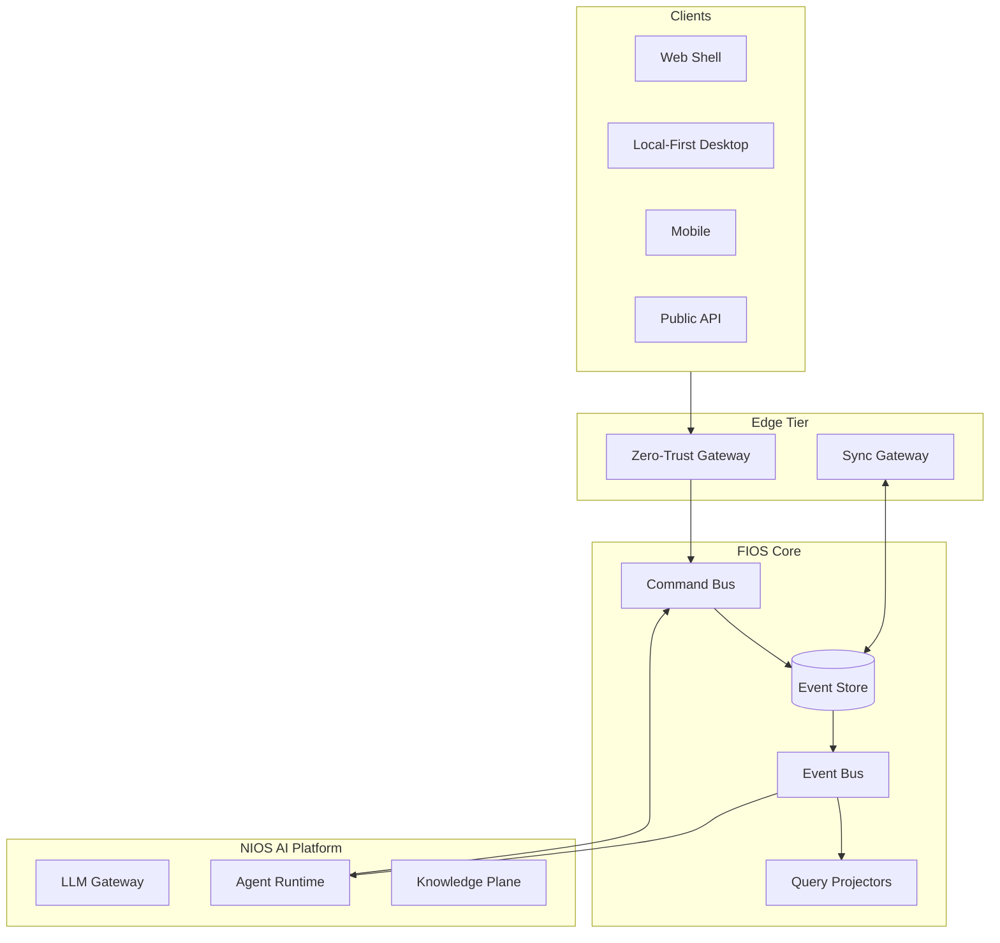

---

## SYSTEM-06.2 Architecture Principles

| # | Principle | Resolves |
|---|-----------|----------|
| P1 | **Ledger immutability** — financial facts are append-only events | W-056, W-017, C-12 |
| P2 | **Single write path** — all ERP mutations via validated commands | W-001, W-106, W-107 |
| P3 | **CQRS separation** — commands ≠ queries; no denormalized write shortcuts | W-021, W-166, W-167, CONTRADICTION-01/02 |
| P4 | **Event-first integration** — subsystems integrate via domain events, not shared mutable state | W-041, W-165, W-161 |
| P5 | **Zero-trust security** — authenticate every call; authorize every command | W-091–W-098, W-096, W-097 |
| P6 | **Offline sovereignty** — local event log is source for edge; cloud is replica + aggregate | W-055, W-039, W-040, AD-04 |
| P7 | **Deterministic sync** — version vectors + conflict engine, never silent LWW | W-044, W-050, W-045, W-043, W-042 |
| P8 | **AI proposes, humans/commands dispose** — no autonomous ERP post | W-106, W-110, F-CONV-01 |
| P9 | **Bounded contexts** — strict module boundaries, explicit anti-corruption layers | W-033, W-034, AD-08, TD-01 |
| P10 | **Plugin extensibility** — core microkernel; domains as plugins | AD-12, W-172, TD-04 |
| P11 | **Observable by default** — traces, metrics, structured audit | W-045, W-154, W-017 |
| P12 | **One identity plane** — JWT/OIDC everywhere including sync and AI | W-039, W-086, W-087, C-03 |

---

## SYSTEM-06.3 Canonical Layered Architecture

| Layer | Name | Ownership | Resolves |
|-------|------|-----------|----------|
| L0 | **Experience** — shells, UI composition | Client teams | W-172, C-07, C-08 |
| L1 | **Application** — use cases, command handlers | App services | W-001, W-003 |
| L2 | **Domain** — aggregates, invariants, domain events | Domain modules | W-015, W-064, W-069 |
| L3 | **Infrastructure** — event store, projections, gateways | Platform team | W-012, W-018 |
| L4 | **Intelligence** — NIOS agents, RAG, verification | AI platform | W-103–W-115 |
| L5 | **Integration** — webhooks, CBMS, banks, plugins | Integration hub | W-040, W-185 |
| L6 | **Data** — event store, OLAP, object storage, vector index | Data platform | W-125, W-124, W-130 |

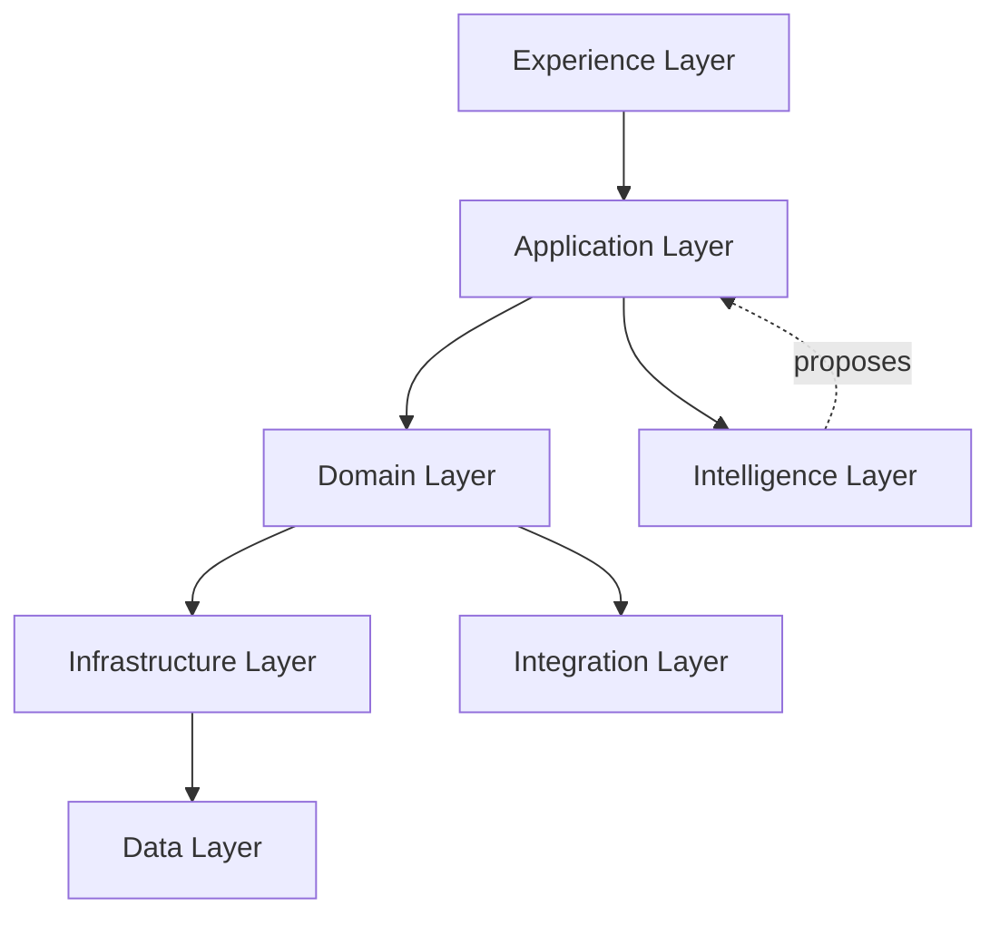

**Per-layer contract (all layers):**

| Attribute | Definition |
|-----------|------------|
| **Inputs** | User intent, API requests, domain events, sync envelopes |
| **Outputs** | Commands, events, projections, side-effect intents |
| **Failure handling** | Compensating events; never silent swallow (W-017, W-041, W-045) |
| **Extension points** | Plugin slots at L1, L4, L5 |
| **Scalability** | L0-L2 scale via client; L3-L6 horizontal pods |
| **Security** | Policy enforcement at gateway + per-command |

---

## SYSTEM-06.4 Bounded Context Map

| Context | Core responsibility | Upstream/downstream | Resolves |
|---------|---------------------|---------------------|----------|
| **Ledger** | Journal, posting, balances | Publishes `Ledger* events` | W-021, W-069, W-070 |
| **Billing** | Invoices, credit notes | Commands → Ledger + Inventory | W-016, W-042, W-063 |
| **Inventory** | Stock ledger, valuation | Commands → Ledger | W-077–W-082, W-078 |
| **Tax** | VAT, TDS, CBMS | Commands → Ledger + Integration | W-040, W-064 |
| **Masters** | Party, item, COA, FY | Reference data commands | W-064, W-035 |
| **Documents** | Numbering, series, locks | Policy service | W-068, W-072, W-073, W-074 |
| **Identity** | AuthN, tenants, orgs | All contexts | W-084–W-090, C-04 |
| **Sync** | Replication, conflict | Event envelope exchange | W-039–W-054 |
| **Workflow** | Approval, tasks | Gates commands | W-074, `[NOT OBSERVED]` approval |
| **Reporting** | Read models, analytics | Subscribes to events | W-166–W-170 |
| **NIOS** | Agents, knowledge, verify | Proposes commands only | W-103–W-122 |
| **Integration** | External systems | Async adapters | W-040, W-181 |

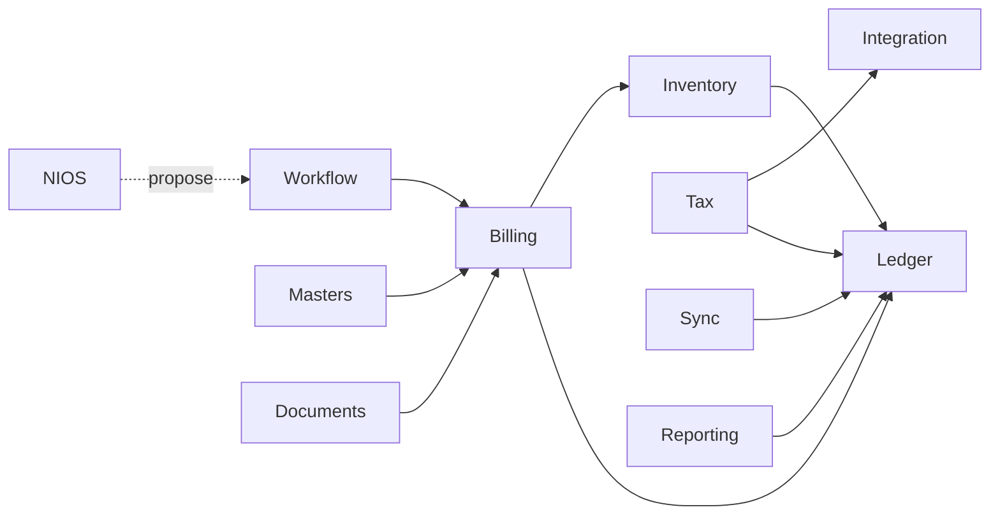

---

## SYSTEM-06.5 Domain-Driven Design Model

### Purpose
Model ERP as aggregates with explicit invariants; eliminate god-store and slice circularity.

### Aggregates (canonical)
| Aggregate | Root entity | Invariants | Resolves |
|-----------|-------------|------------|----------|
| `Company` | CompanyId | Single tenant scope | W-117, C-04 |
| `FiscalYear` | FiscalYearId | Date bounds | W-069 |
| `Account` | AccountId | COA tree, no hardcoded IDs | W-064, W-035, TD-06 |
| `Voucher` | VoucherId | Dr=Cr, period lock | W-015, W-069, W-070 |
| `Invoice` | InvoiceId | Atomic bill+post intent | W-016, W-042 |
| `StockPosition` | ItemWarehouseId | Movement ledger | W-077, W-081 |
| `Party` | PartyId | AR/AP sub-ledger via events | W-023 |
| `DocumentSeries` | SeriesId | Numbering policy | W-068, W-072 |
| `SyncCursor` | DeviceId | Vector clock | W-044, W-041 |
| `ApprovalRequest` | RequestId | Human gate | approval gap |

### Responsibilities
- Enforce invariants inside aggregate boundaries only
- Emit domain events on state transition
- Never expose mutable cross-aggregate writes

### State ownership
- **Write:** aggregate event streams per tenant
- **Read:** projections (CQRS)

### Resolves
W-001, W-003, W-034, W-010, TD-01, AD-08

---

## SYSTEM-06.6 Canonical Service Decomposition

| Service | Type | Runtime ownership | Resolves |
|---------|------|-------------------|----------|
| **api-gateway** | Edge | Platform | W-098, W-091 |
| **identity-service** | Core | Platform | W-039, W-086, W-087 |
| **command-service** | Core | Ledger platform | W-001, W-106 |
| **query-service** | Core | Reporting platform | W-131, W-132 |
| **event-store** | Data | Data platform | W-056, W-021 |
| **projection-workers** | Async | Data platform | W-008 |
| **sync-service** | Core | Platform | W-039–W-054 |
| **workflow-service** | Core | Platform | period lock, approval |
| **document-service** | Domain | Documents context | W-068–W-073 |
| **tax-service** | Domain | Tax context | W-063, W-040 |
| **integration-service** | Integration | Platform | CBMS, banks |
| **nios-gateway** | AI | AI platform | W-103, W-109 |
| **llm-gateway** | AI | AI platform | W-136, AD-11 |
| **knowledge-service** | AI | AI platform | W-123–W-129 |
| **agent-runtime** | AI | AI platform | W-104, AD-02 |
| **notification-service** | Support | Platform | W-160 |
| **job-scheduler** | Support | Platform | W-046, TD-16 |
| **observability-collector** | Support | Platform | W-045, W-154 |

**Dependencies:** All domain services → event-store; clients → api-gateway only.

**Failure handling:** Saga orchestration via process managers + compensating events (W-011, W-012, W-013).

**Scalability:** Stateless services horizontal; event store partitioned by `tenantId`.

---

## SYSTEM-06.7 Microkernel / Plugin Architecture

### Purpose
Replace monolith pages and four AI stacks with a kernel + plugins.

### Kernel responsibilities
- Command bus registration
- Event bus
- Identity context propagation
- Plugin lifecycle (load, isolate, version)

### Plugin types
| Plugin | Examples | Resolves |
|--------|----------|----------|
| Domain | Payroll, Fixed Assets, POS | TD-04, AD-12 |
| Report | Nepal VAT, TDS, custom | W-167 |
| Integration | CBMS, eSewa, banks | W-040 |
| AI skill | Khata entry, OCR invoice | W-061, AD-14 |
| UI module | Screen packs | W-172, ~107 unwired |

### Extension points
- `registerCommandHandler`, `registerProjection`, `registerAgentTool`, `registerUIRoute`

### Security
- Plugins run sandboxed; capability tokens per plugin

### Resolves
AD-01, AD-02, AD-12, AD-13, W-103, W-172, TD-04

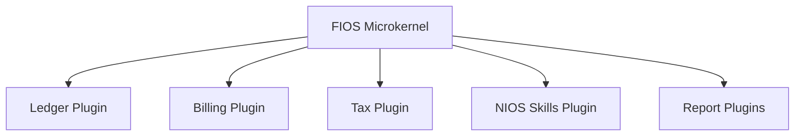

---

## SYSTEM-06.8 Application Shell Architecture

### Purpose
Unified client shell replacing stringly `currentPage` routing.

### Responsibilities
- Declarative route registry from plugins
- Auth gate, tenant/company context
- Command dispatch UI → command bus
- Query subscription UI → read models

### Runtime ownership
- **Web:** SPA shell + module federation
- **Desktop:** Tauri/Electron local-first shell
- **Mobile:** Capacitor shell (khata evolution)

### Resolves
AD-03, W-172, C-07, C-08, C-13, W-115

---

## SYSTEM-06.9 Frontend Runtime Architecture

| Attribute | Target design | Resolves |
|-----------|---------------|----------|
| **Purpose** | Thin client; no business invariants in UI | W-042, W-065, F-INV-* |
| **State** | View models from query cache only | W-021, W-008 |
| **Boot** | Shell → identity → sync cursor → hydrate projections | W-005, W-131, W-145 |
| **Routing** | Typed route table from plugins | AD-03 |
| **AI UI** | Single NIOS panel; skills as plugins | W-103, W-105, C-05 |
| **Failure** | Explicit error surfaces; no silent ready | W-005 |
| **Scalability** | Virtualized lists; paginated queries | W-131, W-132 |

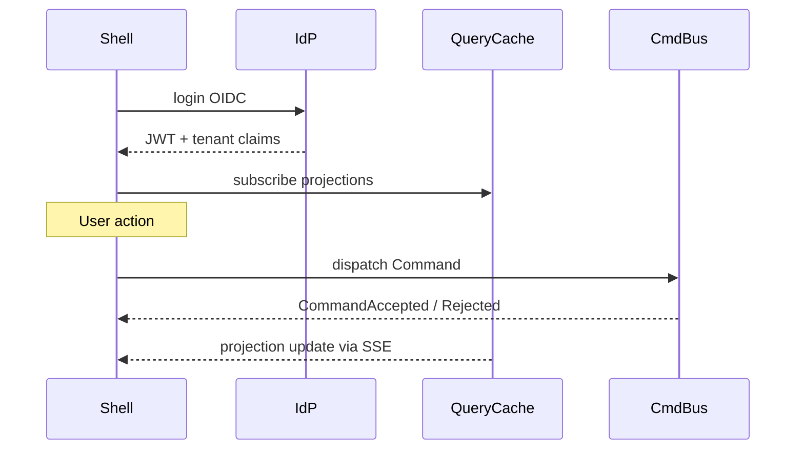

---

## SYSTEM-06.10 State Management Architecture

### Purpose
Eliminate god store and duplicate RAM truth.

### Design
| Concern | Owner | Mechanism |
|---------|-------|-----------|
| Server truth | Event store | Append-only |
| Client read | Query cache (TanStack Query or equivalent pattern) | Projections + pagination |
| Optimistic UI | Ephemeral UI state only | Rollback on command reject |
| AI chat | Agent session store | Separate bounded context |
| Drafts | `DraftAggregate` events | Replaces sessionStorage magic keys W-037 |

### Resolves
W-001, W-002, W-007, W-008, W-021, W-022, W-024, W-025, W-026, W-027, W-028, W-029, F-STORE-04

**Invariants:** No `accounts.balance` denormalized write path; balances are projections only.

---

## SYSTEM-06.11 Command Bus Architecture

### Purpose
Single mutation pipeline replacing store/slice/direct Dexie writes.

### Responsibilities
- Validate command schema
- Resolve tenant/company/user from JWT (not body) W-092
- Enforce authorization policy
- Route to aggregate handler
- Persist events atomically
- Publish to event bus

### Inputs
`CommandEnvelope { commandId, tenantId, companyId, userId, aggregateId, payload, correlationId }`

### Outputs
`CommandResult { accepted | rejected, eventIds[], errors[] }`

### Failure handling
- Reject with explicit errors (no round-off mask W-063)
- Idempotency via `commandId` W-014, W-149

### Resolves
W-001, W-034, W-106, W-014, W-149, W-015, RKB-011

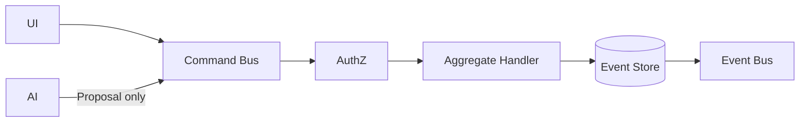

---

## SYSTEM-06.12 Query Architecture (CQRS)

### Purpose
Separate read models; reports never read denormalized write fields.

### Responsibilities
- Projections consume domain events
- Materialized views: TrialBalance, LedgerStatement, StockLedger, PartyBalance, DashboardMetrics
- Paginated, filterable APIs
- Read replicas for scale

### State ownership
- Projections owned by query-service; rebuildable from event store

### Resolves
W-021, W-166, W-167, W-168, W-169, W-170, CONTRADICTION-01/02, TD-05, F-ACCT-03

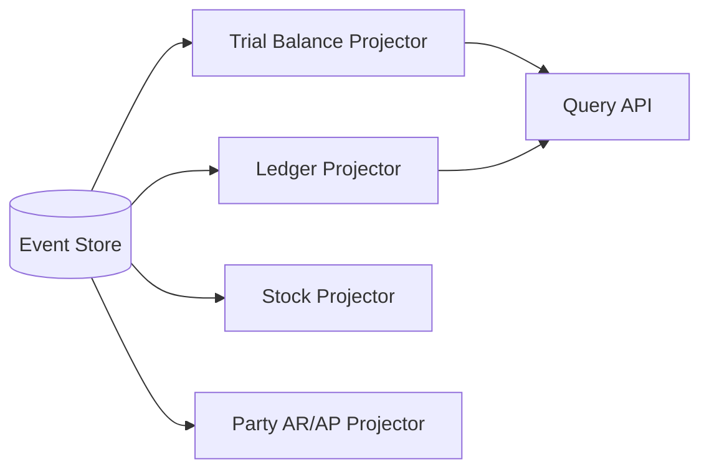

---

## SYSTEM-06.13 Event Sourcing Architecture

### Purpose
Immutable financial truth; audit-grade replay.

### Event store model
- Stream per aggregate: `{tenantId}/{aggregateType}/{aggregateId}`
- Global tenant stream for cross-aggregate sagas
- Event metadata: `eventId, version, causationId, correlationId, userId, timestamp`

### Responsibilities
- Append-only writes
- Optimistic concurrency `expectedVersion`
- Snapshot strategy for long streams

### Resolves
W-056, W-017, W-056, C-12, W-021, W-080, W-049

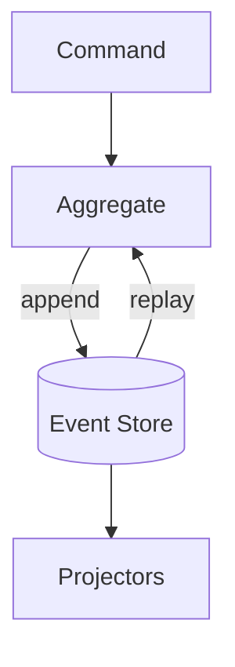

---

## SYSTEM-06.14 Event Bus Design

### Purpose
Replace swallowed CustomEvents and disconnected kernel/browser buses.

### Design
| Bus | Scope | Delivery |
|-----|-------|----------|
| **Domain bus** | In-process / Kafka/NATS cloud | At-least-once |
| **Integration bus** | External webhooks | Outbox pattern |
| **Client bus** | SSE/WebSocket to shells | Subscription per tenant |

### Events (typed schemas, versioned)
- No silent swallow — failed handlers go to DLQ with alert W-041, W-161

### Resolves
W-041, W-161, W-165, W-162, W-160, F-NIOS-API-11

---

## SYSTEM-06.15 Workflow Engine

### Purpose
Approval, period lock, and multi-step business flows as first-class.

### Responsibilities
- Gate commands until approval satisfied
- Period lock as policy on command types
- Compensation sagas for batch khata W-013

### Resolves
W-069, W-070, W-074, approval `[NOT OBSERVED]`, F-KHATA-04

---

## SYSTEM-06.16 Domain Event Catalog

| Event | Producer | Consumers | Resolves |
|-------|----------|-----------|----------|
| `VoucherPosted` | Ledger | Reporting, NIOS, Audit, Tax | W-041, W-161 |
| `InvoicePosted` | Billing | Ledger, Inventory, Tax, CBMS | W-040, W-016 |
| `InvoiceCancelled` | Billing | Ledger, Inventory | W-069 |
| `StockMoved` | Inventory | Stock projection | W-077 |
| `PartyCreated` | Masters | Sync, CRM | W-023 |
| `PeriodLocked` | Workflow | Command policy | W-074 |
| `DocumentNumberAllocated` | Documents | Billing, Ledger | W-068 |
| `SyncBatchApplied` | Sync | Projections refresh | W-008 |
| `ConflictDetected` | Sync | UI conflict resolver | W-044 |
| `AIOperationProposed` | NIOS | Workflow | W-106 |
| `CommandAccepted` / `CommandRejected` | Command bus | UI, Audit | W-106 |

---

## SYSTEM-06.17 Transaction Architecture

### Purpose
Replace nested Dexie transactions and split PDC paths with sagas + single event append.

### Pattern
- **Single aggregate:** one event append with expected version
- **Cross-aggregate (invoice post):** `InvoicePostingSaga` orchestrates ordered events with compensation

### Saga: Invoice Post
1. `InvoiceMarkedPosted`
2. `VoucherAutoJournalCreated` (Ledger)
3. `StockMovementsRecorded` (Inventory)
4. `TaxLinesRecorded` (Tax)
5. `IntegrationDispatchRequested` (CBMS async)

Failure at any step → compensating events (not silent partial W-016).

### Resolves
W-011, W-012, W-013, W-016, W-018, W-019, F-VCH-01, F-VCH-03, RKB-046

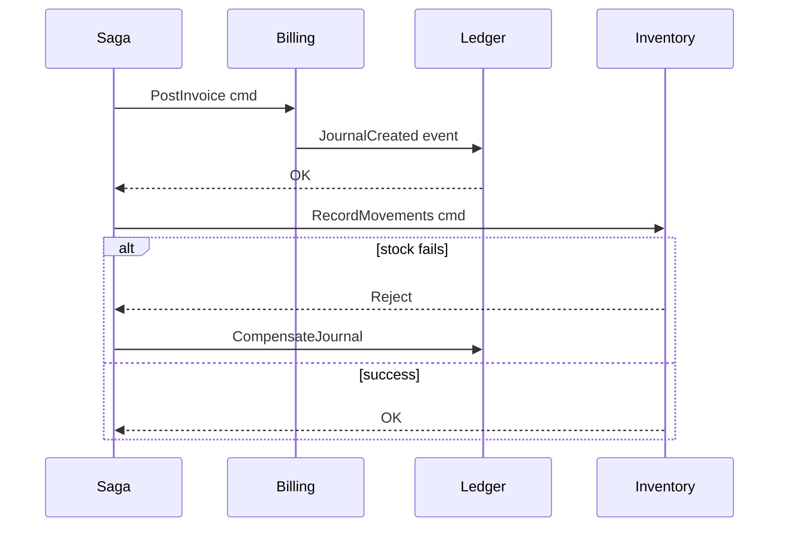

---

## SYSTEM-06.18 Accounting Engine Architecture

### Purpose
One posting engine; voucher lines are sole financial truth.

### Components
- **PostingPolicy** — COA resolution from config, not hardcoded IDs
- **DoubleEntryValidator** — single validator (replaces parallel validators)
- **BalanceProjection** — derived only
- **ReversalPolicy** — reversals respect period lock W-070

### Resolves
W-021, W-015, W-063, W-064, W-035, TD-06, F-ACCT-01, F-ACCT-03, RKB-011

---

## SYSTEM-06.19 Inventory Engine Architecture

### Purpose
Movement-ledger with valuation policy plugin; synced events.

### Components
- `StockMovementRecorded` events
- Valuation plugin (FIFO/WAC) — policy slot W-082
- Negative stock policy explicit W-081

### Resolves
W-077, W-078, W-079, W-080, W-081, W-082, W-083, F-SYNC-09

---

## SYSTEM-06.20 Tax Engine Architecture

### Purpose
Tax as command side-effect producing ledger events + integration intents.

### Components
- VAT/TDS rule plugins (Nepal default)
- CBMS dispatch via outbox (not fire-and-forget `.then` W-040)

### Resolves
W-040, W-063, W-064, F-INV-03

---

## SYSTEM-06.21 Document Engine

### Purpose
Central numbering service; eliminates triple numbering functions.

### Design
| Policy dimension | Configuration |
|------------------|---------------|
| Prefix | Per series |
| Fiscal year reset | Series policy |
| Branch prefix | Optional dimension |
| User prefix | Optional audit dimension |
| Manual override | Permission-gated command |
| Auto increment | Atomic allocator per series |
| Gap handling | Policy: allow / disallow / audit |
| Cancelled numbers | Status in series ledger; no reuse without permission |
| Locking | Distributed lock per series |
| Duplicate prevention | Idempotent `commandId` + series state |

### Resolves
W-068, W-072, W-073, W-074, R-08, F-ACCT-02, `[NOT OBSERVED]` voucherNumbering.ts

---

## SYSTEM-06.22 Synchronization Architecture

### Purpose
Deterministic multi-device convergence replacing broken syncEngine.

### Design
- **Event-carried state transfer** — sync envelopes of domain events, not entity snapshots
- **Vector clocks per device** — W-044
- **Sync gateway** authenticated via same JWT W-039
- **Idle pull** — background sync even when no local pending W-040
- **Outbox on client** — event envelopes with dedup key `(deviceId, localSeq)` W-041
- **Prune synced envelopes** — retention policy W-046
- **Full entity set** — all bounded contexts publish syncable events W-047

### Resolves
W-039–W-054, F-SYNC-BE-01–11, TD-19, R-12, AD-04

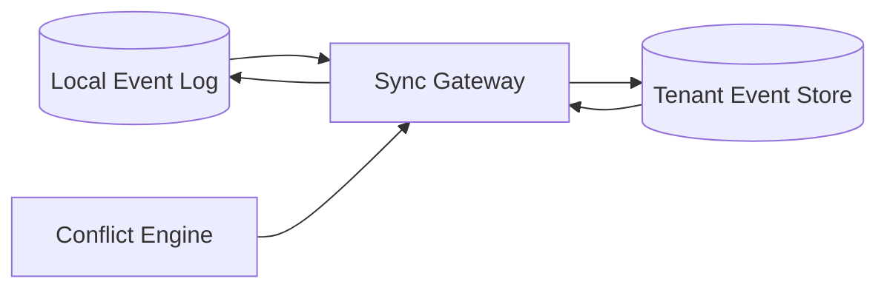

---

## SYSTEM-06.23 Offline Engine

### Purpose
True offline-first with local event sovereignty.

### Design
- Local event store (SQLite embedded) — not destructive open on timeout W-059
- Commands queue locally; replay when online
- Projections run locally for offline UI
- `NIOS` degraded mode: local skills only; cloud agents when online AD-07

### Resolves
W-055, W-059, F-DB-01, RKB-082, W-060, AD-07, AD-04

---

## SYSTEM-06.24 Conflict Resolution Engine

### Purpose
Replace silent LWW and pull merge hacks.

### Strategies (per event type policy)
| Type | Strategy |
|------|----------|
| Masters | Field-level merge with audit |
| Posted vouchers | Immutable — conflict = branch + manual resolution |
| Drafts | Device-branch merge |
| Deletes | Tombstone events W-048, W-020 |

### UI
- Conflict inbox with diff; user resolves → `ConflictResolved` event

### Resolves
W-044, W-050, W-043, W-042, W-045, W-058, F-SYNC-05, F-SYNC-06

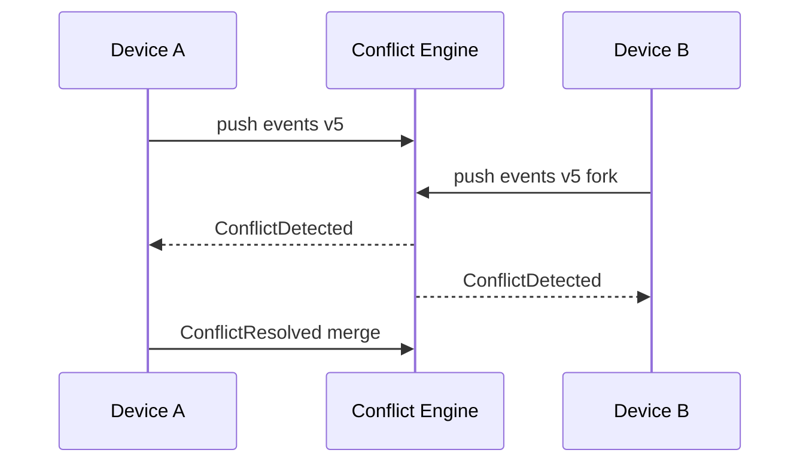

---

## SYSTEM-06.25 Identity & Authentication Architecture

### Purpose
One identity plane for SPA, sync, AI, mobile, API.

### Design
- OIDC provider (Keycloak/Auth0/self-hosted)
- JWT access + refresh wired to all clients on login W-086
- Device registration for sync
- No default admin seed in production; bootstrap ceremony W-084
- Session: short access, rotating refresh; Redis denylist pattern retained conceptually

### Resolves
W-084, W-085, W-086, W-087, W-088, W-089, W-090, C-03, F-SYNC-01, TD-19

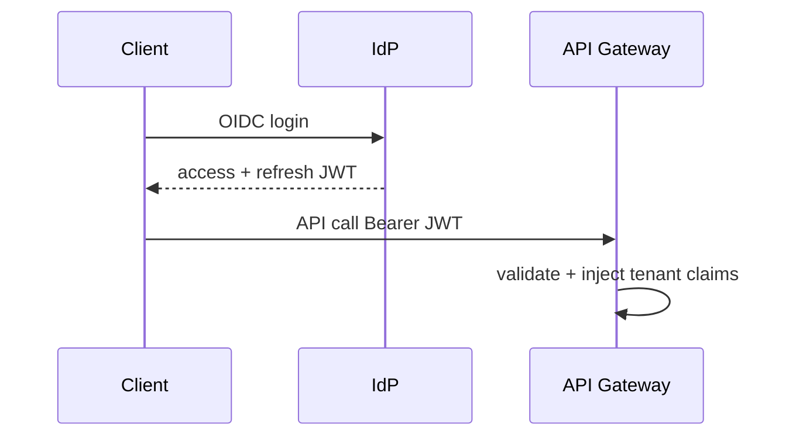

---

## SYSTEM-06.26 Authorization Architecture (RBAC + ABAC)

### Purpose
Replace permissionsStore ad-hoc checks with policy engine.

### Design
- **RBAC:** roles → permissions
- **ABAC:** attributes (tenant, company, branch, period, amount thresholds)
- Command bus enforces policy pre-handler
- NIOS capabilities require capability tokens W-094

### Resolves
W-034 permission matrix gap, W-093, W-094, `[NOT OBSERVED]` enforcement coverage

---

## SYSTEM-06.27 Security Model

### Layers
| Layer | Control |
|-------|---------|
| Edge | WAF, TLS, rate limit W-098 |
| Gateway | JWT validation, tenant binding W-092 |
| Service | mTLS internal |
| Data | Encryption at rest, tenant isolation |
| AI | Safety layer W-106; no raw exception leak W-099 |
| Upload | Size caps W-100 |

### Resolves
W-091–W-102, W-098, W-099, W-100, W-101, R-01, R-02, R-13, R-16, TD-12, TD-13, TD-23, F-NIOS-API-*

---

## SYSTEM-06.28 Audit Architecture

### Purpose
Append-only audit from event store; no swallowed audit logs.

### Design
- Every command → `AuditRecord` event
- Immutable audit projection
- Cross-tenant audit requires platform admin role W-092

### Resolves
W-017, W-056, C-12, F-NIOS-API-06

---

## SYSTEM-06.29 Versioning Strategy

| Artifact | Versioning |
|----------|------------|
| Domain events | Schema registry; upcasters |
| Commands | Explicit command version |
| Projections | Rebuild from scratch |
| Plugins | Semver + compatibility matrix |
| API | `/v1`, `/v2` URL versioning |

### Resolves
W-044, F-SYNC-06, W-121 weak validation

---

## SYSTEM-06.30 Schema Migration Architecture

### Purpose
Replace destructive Dexie recovery and raw schema.sql only.

### Design
- Event store: forward-compatible event versioning
- Local SQLite: migrator with backup-before-migrate (never delete-on-timeout W-059)
- Cloud PG: migration tool (Alembic-class) per service TD-17
- Projection rebuild as migration strategy

### Resolves
W-059, F-DB-01, RKB-082, TD-17, R-06, TD-02, TD-21

---

## SYSTEM-06.31 Reporting Architecture

### Purpose
All reports from projections; paginated; no full RAM scan.

### Read models
TrialBalance, Ledger, DayBook, CashBook, P&L, BalanceSheet, StockSummary, VAT, TDS, Aging, Dashboard

### Resolves
W-131, W-132, W-166–W-170, TD-05, W-167

---

## SYSTEM-06.32 Analytics Architecture

### Purpose
OLAP tier for heavy analytics without impacting OLTP event store.

### Design
- Event stream → warehouse (ClickHouse/BigQuery-class)
- BI connectors
- Separate from operational projections

### Resolves
W-131, W-132 performance reporting paths

---

## SYSTEM-06.33 Notification Architecture

### Purpose
Replace ad-hoc toasts and missing sync events.

### Channels
In-app (SSE), email, SMS, push (mobile)

### Events trigger
`CommandRejected`, `ConflictDetected`, `ApprovalRequired`, `CBMSResult`, `SyncCompleted`

### Resolves
W-160, W-045, F-INV-03

---

## SYSTEM-06.34 Background Job Architecture

### Purpose
Replace single-thread workers and unbounded outbox with managed job platform.

### Design
- Queue: Redis/SQS-class
- Workers horizontal for knowledge ingest, projections, CBMS, sync retry
- Idempotent job keys

### Resolves
W-046, W-123, W-124, TD-16, W-040, F-INV-03

---

## SYSTEM-06.35 Scheduler Architecture

### Purpose
Cron-class scheduling for recurring vouchers, backups, reports, NIOS benchmarks.

### Design
- `job-scheduler` service with lease-based execution
- Recurring voucher as scheduled command (not clone hack W-073)

### Resolves
recurring path, auto backup `[NOT OBSERVED]`, F-NIOS-API-04 ops endpoints

---

## SYSTEM-06.36 Observability Architecture

### Purpose
Eliminate silent failures.

### Pillars
- **Traces:** OpenTelemetry across gateway → command → projection → AI
- **Metrics:** RED/USE per service
- **Logs:** Structured JSON
- **Dashboards:** SLO per tenant tier

### Resolves
W-045, W-154, W-017, W-041, W-181, R-07

---

## SYSTEM-06.37 Logging Architecture

- Correlation IDs from command through events
- No PII in logs by default W-090
- Audit log separate from debug log

### Resolves
W-090, W-099, W-017

---

## SYSTEM-06.38 Telemetry Architecture

- AI inference metrics (latency, tokens, model route)
- Sync lag per device
- Projection lag per read model

### Resolves
W-136, W-040, W-109 cache observability

---

## SYSTEM-06.39 Error Handling Architecture

### Rules
- **No silent swallow** — every failure → typed error event or DLQ
- User-visible errors for command reject
- Pull/sync errors surface in UI W-045
- AI errors generic to client; detail in logs W-099

### Resolves
W-005, W-017, W-041, W-045, W-154, W-159, F-CONV-03, F-STORE-02

---

## SYSTEM-06.40 Recovery Architecture

| Scenario | Recovery |
|----------|----------|
| Projection corrupt | Rebuild from event store |
| Local DB corrupt | Restore from encrypted backup; replay events |
| Partial saga | Compensating events + admin tool |
| Chroma loss | Re-embed from object storage W-125 |
| Region failure | Multi-AZ event store replicas |

### Resolves
W-152, W-155, W-158, W-156, R-14, F-DB-01

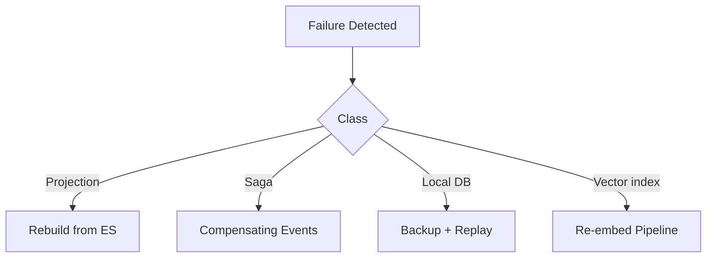

---

## SYSTEM-06.41 AI Platform Architecture

### Purpose
Unify SUTRA, Falcon, e-Khata, Orbix, NIOS into **one NIOS AI Platform** with skill plugins.

### Architecture
```
User → Conversation Service → Agent Runtime → [Planner → Tools → Verifier] → Proposal Command
                                                                              ↓
                                                                        Workflow Gate
                                                                              ↓
                                                                        Command Bus (ERP)
```

### Resolves
W-103, W-104, W-105, W-115, AD-01, AD-02, AD-15, C-05, C-13, R-20

---

## SYSTEM-06.42 LLM Gateway

### Purpose
Abstract Ollama/GPU/local/cloud models; eliminate SPOF W-136.

### Responsibilities
- Provider pool (local GPU, cloud API, fallback)
- Rate limit per tenant
- Token accounting

### Resolves
W-136, AD-11, R-05, R-10

---

## SYSTEM-06.43 Model Router

- Route by task class: router/small, reasoning/large, embed, verify
- Replaces cascade scattered across agent/nios/orbix W-104

### Resolves
W-104, AD-02, W-109

---

## SYSTEM-06.44 Agent Runtime

- Multi-agent orchestration with bounded tool steps
- Episodic memory per tenant session (durable store, not RAM W-114)
- Replaces agent_builder in-memory W-084, F-CONV-02

### Resolves
W-114, W-108, F-CONV-02, RKB-084

---

## SYSTEM-06.45 Planner Architecture

- Goal decomposition → tool plan → human checkpoint for ERP mutations
- Replaces scattered planners (Orbix, NIOS goal_tree, processMessage) W-112

### Resolves
W-112, TD-08, AD-02

---

## SYSTEM-06.46 Tool Calling Framework

- Registered tools with capability tokens
- ERP tools return **proposals**, not writes W-106
- RAG, ledger query, nav, OCR as tools

### Resolves
W-106, W-110, W-094, F-NIOS-03

---

## SYSTEM-06.47 Memory Architecture

| Tier | Store | Scope |
|------|-------|-------|
| Working | Session cache | Per conversation |
| Episodic | Durable per tenant/user | Agent runtime |
| Semantic | Vector + knowledge graph | Knowledge service |
| ERP context | Query API read models | No Dexie snapshot bridge |

### Resolves
W-024, W-025, W-114, W-144, TD-10, TD-11, session memory ×4 duplicate

---

## SYSTEM-06.48 Knowledge Architecture

- Tenant document ingestion with auth W-123
- Horizontal ingest workers W-124
- Object storage + vector index + metadata PG
- Federation API authenticated

### Resolves
W-123–W-130, R-01, TD-12–TD-17, R-07, R-14

---

## SYSTEM-06.49 RAG Architecture

- Hybrid dense + sparse retrieval
- Authority scoring per source
- Tenant isolation in collections

### Resolves
dual Chroma W-130, unified_retriever fan-in W-137

---

## SYSTEM-06.50 Retrieval Pipeline

```
Query → embed → hybrid search → rerank → authority filter → context pack → consumer
```

### Resolves
W-137, W-109 cache key — cache includes tenant+session+query hash

---

## SYSTEM-06.51 Verification Pipeline

- Journal balance verify
- Citation verify for RAG answers
- ERP command preview verify before proposal

### Resolves
W-015, W-063, F-KHATA-03, F-NIOS-04

---

## SYSTEM-06.52 Reasoning Pipeline

- Structured reasoning traces stored as events (audit)
- Sector templates as plugins, not scattered brains W-112

### Resolves
W-112, W-113, TD-08, TD-09, R-11, AD-14

---

## SYSTEM-06.53 AI Safety Layer

| Control | Mechanism |
|---------|-----------|
| ERP write ban | Agents cannot call command bus directly |
| Tenant scope | JWT claims only W-092 |
| PII redaction | Pre-LLM filter |
| Output filter | Post-LLM policy |
| Rate limits | Per tenant/user |
| Upload caps | W-100 |

### Resolves
W-106, W-092, W-094, W-095, W-099, W-100, F-NIOS-API-*

---

## SYSTEM-06.54 Autonomous Task Architecture

- Scheduled agents for reports, anomaly scan, reconciliation suggestions
- **Suggest → Approval → Command** pipeline only

### Resolves
W-106, autonomous post risks, F-NIOS-03

---

## SYSTEM-06.55 Conversation Architecture

- Single conversation service API
- Replaces v2 disconnect W-107, eKhataStore parallel paths
- `action: confirm` → `ProposalSubmitted` event → workflow

### Resolves
W-106, W-107, F-KHATA-02, F-CONV-01, RKB-030, RKB-031

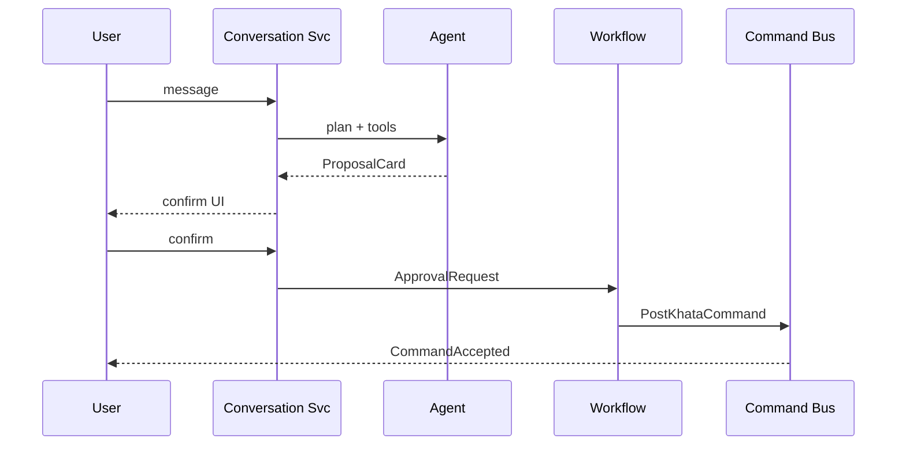

---

## SYSTEM-06.56 ERP Command Execution Boundary

### Invariant
```
∀ ERP state mutations: ∃ Command ∧ Authorization ∧ Event append
¬ ∃ direct DB/UI/AI write path
```

### Resolves
W-106, W-107, W-110, RKB-027, RKB-028, F-SYS-02, W-037 drafts → DraftCommands

---

## SYSTEM-06.57 Approval Workflow Architecture

- Policy-driven gates (amount, account, period, AI-origin)
- `ApprovalGranted` event unlocks command execution

### Resolves
approval `[NOT OBSERVED]`, W-069, W-106, F-NIOS-API-03

---

## SYSTEM-06.58 Business Rules Engine

- Declarative rules (DSL) for tax, posting, validation
- Single evaluator invoked by command bus pre-check

### Resolves
W-015, W-075, W-042, parallel validators

---

## SYSTEM-06.59 Rules Evaluation Pipeline

```
Command → context load → rule chain → pass | reject with codes
```

### Resolves
F-KHATA-03, F-INV-01, RKB-011

---

## SYSTEM-06.60 Integration Architecture

- Outbox pattern for CBMS, banks, webhooks
- Idempotent external dispatch
- Status events drive UI (not orphan `.then` W-040)

### Resolves
W-040, F-INV-03, W-185, R-19

---

## SYSTEM-06.61 Public API Architecture

- OpenAPI-first REST + GraphQL for queries
- All endpoints behind gateway auth
- No public NIOS catalog in prod W-101

### Resolves
W-091, W-101, unauthenticated APIs

---

## SYSTEM-06.62 SDK Architecture

- TypeScript/Python SDKs for commands, queries, webhooks
- Tenant-scoped API keys for server integrations

### Resolves
ad-hoc HTTP clients, khata-app separate coupling C-15

---

## SYSTEM-06.63 Plugin SDK

- `registerPlugin(manifest)` — commands, projections, UI routes, agent tools
- Sandbox + capability declarations

### Resolves
AD-12, W-172, plugin sprawl

---

## SYSTEM-06.64 Developer Platform

- Docs, sandbox tenant, event catalog, command playground
- Replaces 66 scripts ops burden

### Resolves
maintainability scripts surface `[DOC]`

---

## SYSTEM-06.65 Module Isolation Strategy

- Strict bounded contexts; no cross-context table access
- Anti-corruption layers for legacy import during transition AD-04

### Resolves
W-033, W-034, hidden coupling W-036–W-038

---

## SYSTEM-06.66 Dependency Direction Rules

```
Experience → Application → Domain → (nothing)
Infrastructure → Domain (interfaces only)
AI → Application (proposals only)
Integration → Infrastructure
```

### Resolves
W-034 circular import, AD-08, TD-25

---

## SYSTEM-06.67 Data Ownership Model

| Data | Owner | Readers | Writers |
|------|-------|---------|---------|
| Domain events | Event store (platform) | Projections, sync, audit | Command handlers only |
| Read models | Query service | UI, AI, API | Projectors only |
| AI memory | AI platform | Agents | Agent runtime |
| Knowledge objects | Knowledge service | RAG | Ingest pipeline |
| Identity | Identity service | All | Identity service |
| Local event log | Device | Offline engine | Local command queue |

### Resolves
W-021, W-023, W-056, W-117, W-061, ownership violations §05.28

---

## SYSTEM-06.68 Single Source of Truth Model

| Concern | SSOT |
|---------|------|
| Financial truth | Event store voucher/invoice events |
| Balances | Balance projection (rebuildable) |
| Stock | Stock movement projection |
| Party AR/AP | Party ledger projection |
| AI chat state | Conversation service store |
| Tenant config | Identity + config service |
| Document numbers | Document series aggregate |

### Resolves
all SSOT violations §05.29, CONTRADICTION-01/02

---

## SYSTEM-06.69 Persistence Architecture

| Tier | Technology class | Workload |
|------|------------------|----------|
| Event store OLTP | PostgreSQL/EventStoreDB-class | Append streams |
| Local edge | SQLite | Offline event log |
| Read OLTP | PostgreSQL read replicas | Projections |
| OLAP | Column store | Analytics |
| Object | S3/R2-class | Documents |
| Vector | Managed vector DB | RAG |
| Cache | Redis | Sessions, rate limit, job queue |

### Resolves
W-124, W-125, W-130, AD-10, polyglot persistence AD-04 (unified behind interfaces)

---

## SYSTEM-06.70 Storage Hierarchy

```
Hot: Redis cache / read replicas
Warm: Event store primary
Cold: Object storage + warehouse
Edge: Local SQLite event log
```

### Resolves
W-131 RAM-as-store pattern

---

## SYSTEM-06.71 Caching Strategy

| Cache | Invalidation |
|-------|--------------|
| Query cache | On projection update SSE |
| Embed cache | TTL + version key |
| LLM response | Tenant+query hash (not message-only W-109) |
| CDN | Static assets |

### Resolves
W-109, W-008, embed cache growth

---

## SYSTEM-06.72 Performance Architecture

- Paginated queries everywhere
- Projection lag SLO < N seconds
- No full table hydrate on boot
- Virtualized UI lists

### Resolves
W-131, W-132, W-004, TD-20, F-STORE-04, W-133

---

## SYSTEM-06.73 Scalability Architecture

- Horizontal stateless services
- Event store partition by tenant
- Projection workers scale independently
- LLM gateway pool
- Ingest workers scale W-124

### Resolves
W-136, W-137, W-123, TD-16, AD-10, AD-11

---

## SYSTEM-06.74 Deployment Architecture

| Environment | Topology |
|-------------|----------|
| Local dev | Docker compose kernel services |
| Staging | K8s single region |
| Production | Multi-AZ K8s, managed PG, managed Redis |
| Edge | CDN + API gateway |
| GPU | Dedicated LLM node pool |

### Resolves
W-180, W-181, W-182, W-186, C-01, C-09

---

## SYSTEM-06.75 Container Architecture

- One container per service
- Sidecars for OTEL
- Init containers for migrations

### Resolves
W-185 Docker NLU gap — NLU as containerized service

---

## SYSTEM-06.76 Cloud Architecture

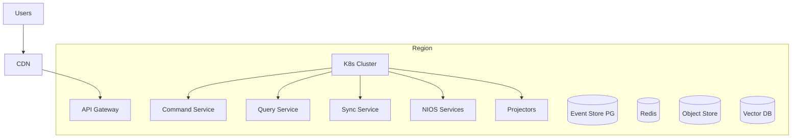

### Resolves
W-180 SPOF, AD-11, R-05

---

## SYSTEM-06.77 Edge Architecture

- CDN for static shells
- API gateway with WAF
- Regional read replicas optional

### Resolves
W-181 misleading proxy, W-098

---

## SYSTEM-06.78 Desktop Architecture

- Local-first shell with embedded SQLite event store
- Background sync agent
- Optional local LLM via LLM gateway localhost route

### Resolves
AD-04 offline-first, W-059, single-tenant desktop vs SaaS AD-06 via same event sync

---

## SYSTEM-06.79 Mobile Architecture

- Capacitor/khata as thin shell
- Same command/query SDK
- Offline queue of event envelopes (replaces separate PG khata model AD-14)

### Resolves
C-15, W-061, AD-14, khata-app separate queue `[DOC]`

---

## SYSTEM-06.80 Future Evolution Strategy

| Phase | Focus | Weakness class addressed |
|-------|-------|--------------------------|
| **F0** | Event store + command bus + identity | W-021, W-039, W-091 |
| **F1** | CQRS projections + document engine | W-166, W-068 |
| **F2** | Sync + conflict engine | W-044–W-054 |
| **F3** | NIOS unification + command boundary | W-103–W-107 |
| **F4** | Plugin marketplace + SDK | AD-12, W-172 |
| **F5** | Multi-region + OLAP | W-136, scale |

---

# Canonical Runtime Sequence Diagrams

## Boot (Client)
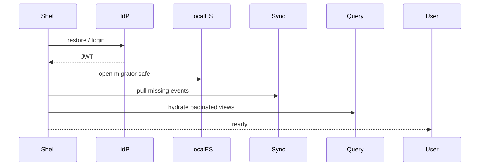
Resolves: W-005, W-059, W-131, W-040

## Login
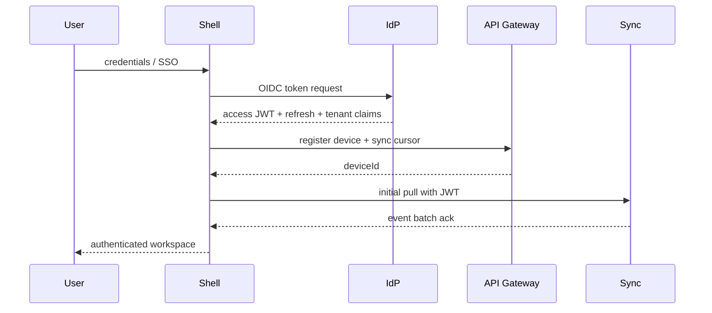
Resolves: W-084, W-086, W-039, W-087, W-088, C-03, F-SYNC-01

## Invoice Posting
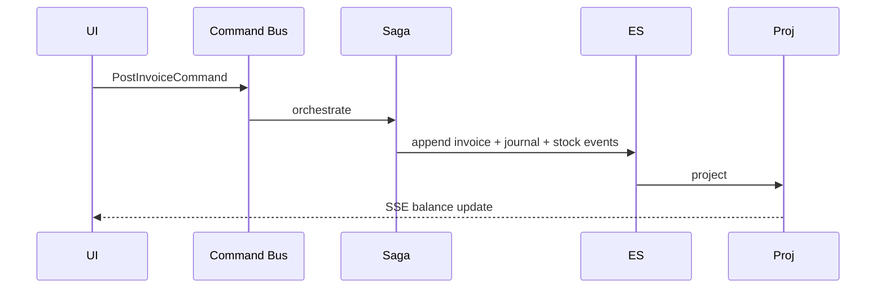
Resolves: W-016, W-042, W-063, W-040, F-VCH-01

## Voucher Posting
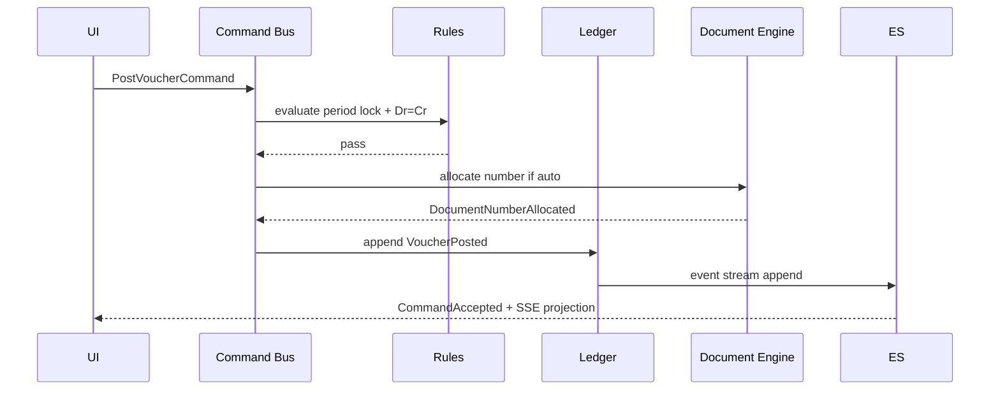
Resolves: W-015, W-069, W-014, W-072, W-070, W-063

## Inventory Update
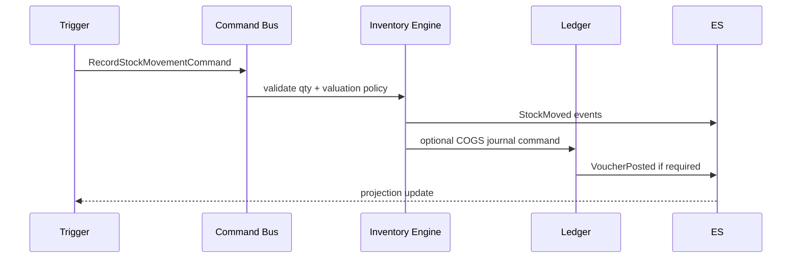
Resolves: W-077, W-078, W-079, W-080, W-081, W-082

## Sync
```mermaid
sequenceDiagram
  participant Device
  participant LocalES
  participant SyncGW
  participant CloudES
  participant Proj
  loop every interval
    Device->>LocalES: read pending envelopes
    Device->>SyncGW: push batch JWT + vector clock
    SyncGW->>CloudES: append if no conflict
    CloudES-->>SyncGW: ack seq
    SyncGW-->>Device: ack + server events
    Device->>LocalES: apply server events
    LocalES->>Proj: local project
  end
```
Resolves: W-039, W-040, W-041, W-046, W-047, W-054, F-SYNC-BE-01

## Conflict Resolution
```mermaid
sequenceDiagram
  participant A as Device A
  participant CE as Conflict Engine
  participant Admin
  participant ES
  A->>CE: push forked stream
  CE->>ES: detect vector divergence
  CE-->>A: ConflictDetected event
  Admin->>CE: resolve policy / manual merge
  CE->>ES: ConflictResolved + merged events
  CE-->>A: replay canonical branch
```
Resolves: W-044, W-050, W-043, W-042, W-045, W-058

## AI Request
```mermaid
sequenceDiagram
  participant User
  participant NIOS
  participant LLM
  participant Verifier
  participant WF
  User->>NIOS: chat
  NIOS->>LLM: routed prompt
  LLM-->>NIOS: draft
  NIOS->>Verifier: validate
  Verifier-->>NIOS: ok
  NIOS-->>User: ProposalCard
  User->>WF: approve
  WF->>CB: Command
```
Resolves: W-106, W-109, W-099, W-103

## Knowledge Retrieval
```mermaid
sequenceDiagram
  participant Agent
  participant RAG
  participant Embed
  participant VDB
  participant Auth
  Agent->>Auth: tenant scope check
  Agent->>RAG: retrieval query
  RAG->>Embed: query vector
  RAG->>VDB: hybrid search tenant-filtered
  VDB-->>RAG: chunks + scores
  RAG->>RAG: rerank + authority filter
  RAG-->>Agent: context pack + citations
```
Resolves: W-123, W-124, W-125, W-130, W-137, R-01

## Agent Execution
```mermaid
sequenceDiagram
  participant Conv
  participant AR as Agent Runtime
  participant Planner
  participant Tools
  participant Mem
  participant Verifier
  Conv->>AR: goal + sessionId
  AR->>Mem: load episodic context
  AR->>Planner: decompose
  loop bounded steps
    Planner->>Tools: invoke capability
    Tools-->>Planner: observation
  end
  Planner->>Verifier: validate proposal
  Verifier-->>Conv: ProposalCard or reject
```
Resolves: W-114, W-108, W-104, W-112, F-CONV-02

## Approval Workflow
```mermaid
sequenceDiagram
  participant User
  participant WF as Workflow
  participant Policy
  participant CB as Command Bus
  participant Audit
  User->>WF: submit proposal / high-value cmd
  WF->>Policy: evaluate gates
  Policy-->>WF: ApprovalRequired
  WF-->>User: pending approval UI
  User->>WF: approve
  WF->>CB: execute gated command
  CB->>Audit: AuditRecord event
  CB-->>User: CommandAccepted
```
Resolves: W-106, W-074, W-069, approval gap

## Plugin Execution
```mermaid
sequenceDiagram
  participant Shell
  participant Kernel
  participant Plugin
  participant CB as Command Bus
  Shell->>Kernel: load plugin manifest
  Kernel->>Kernel: verify capabilities + semver
  Kernel->>Plugin: activate sandbox
  Shell->>Plugin: user action route
  Plugin->>CB: dispatch registered command
  CB-->>Shell: result via event bus
```
Resolves: AD-12, W-172, TD-04

---

# Canonical Rules (Permanent Reference)

## 1. Canonical Runtime Principles
1. Events are facts; projections are opinions (rebuildable).
2. Commands are intentions; events are outcomes.
3. AI proposes; commands dispose.
4. Offline is normal; sync is continuous.
5. Security is mandatory, not optional.
6. Failures are visible, typed, and auditable.
7. Plugins extend; kernel invariant.

## 2. Canonical Design Rules
- D1: No mutable financial row updates — append events only. (W-056)
- D2: No business logic in UI shells. (W-042)
- D3: No cross-context database joins. (W-033)
- D4: No identity from request body. (W-092)
- D5: No silent catch on financial paths. (W-017)
- D6: No denormalized balance writes. (W-021)
- D7: No autonomous ERP writes from AI. (W-106)
- D8: No destructive DB open recovery. (W-059)
- D9: No LWW without version vector. (W-050)
- D10: No god state container. (W-001)

## 3. Dependency Rules
- Domain never imports infrastructure implementations.
- AI never imports domain write models.
- Experience never imports event store directly.
- Plugins depend on kernel SDK, not each other.

## 4. Architecture Invariants
- **I1:** ∀ posted voucher: sum(debit) = sum(credit) in event payload.
- **I2:** ∀ invoice post saga: journal + stock events same correlationId or compensated.
- **I3:** ∀ sync envelope: authenticated + vector clock.
- **I4:** ∀ ERP mutation: ∃ commandId + audit event.
- **I5:** ∀ balance display: sourced from projection version ≥ event cursor.

## 5. Data Ownership Rules
- Event store owns writes; projectors own reads.
- Tenant isolation at stream prefix.
- Device owns local queue until acked by sync.

## 6. Event Rules
- Events immutable, versioned, typed.
- Domain events ≠ integration events (translate explicitly).
- Tombstones for deletes. (W-048)

## 7. Transaction Rules
- Single-aggregate: one append, expected version.
- Multi-aggregate: saga + compensation. (W-011, W-012)
- Reversals respect period policy. (W-070)
- Idempotent commands via commandId. (W-014)

## 8. AI Safety Rules
- No direct command bus from agent without workflow gate.
- Tenant from JWT only.
- Verifier required before proposal surfacing.
- No raw stack traces to client. (W-099)

## 9. Sync Rules
- Push and pull on schedule even if idle. (W-040)
- Conflict → event, not silent merge. (W-045)
- Prune acknowledged envelopes. (W-046)
- All bounded contexts syncable. (W-047)

## 10. Plugin Rules
- Manifest declares capabilities.
- Sandbox execution.
- Semver compatibility with kernel.

## 11. Performance Rules
- Paginate all list queries.
- No full-history RAM hydrate.
- Projection lag monitored.

## 12. Security Rules
- Zero-trust gateway.
- Rate limits on AI and auth endpoints.
- Secrets never in client bundle except public OIDC client id.

## 13. Testing Rules
- Aggregate unit tests from event fixtures.
- Projection rebuild tests.
- Saga compensation tests.
- Contract tests on command schemas.
- No production default passwords. (W-084)

## 14. Deployment Rules
- Migrations before traffic.
- Health checks per service.
- Feature flags per plugin, not per scattered env hacks. (C-05)

## 15. Future Extension Rules
- New domains = new plugin (commands + projections + UI).
- New markets = tax plugin pack.
- New AI skills = agent tool plugin.
- Kernel semver governs compatibility.

---

# Architecture Diagram Gallery

## Complete Runtime Architecture
```mermaid
flowchart TB
  subgraph experience [Experience Tier]
    Web[Web Shell]
    Desktop[Desktop Shell]
    Mobile[Mobile Shell]
    ExtAPI[Partner API Clients]
  end
  subgraph edge [Edge]
    CDN[CDN]
    APIGW[Zero-Trust API Gateway]
    WAF[WAF + Rate Limit]
  end
  subgraph application [Application Tier]
    CMD[Command Service]
    QRY[Query Service]
    WF[Workflow Service]
    SYNC[Sync Gateway]
    INT[Integration Service]
    NOTIF[Notification Service]
    JOB[Job Workers]
  end
  subgraph domain [Domain Tier - Plugins]
    LED[Ledger Plugin]
    BILL[Billing Plugin]
    INV[Inventory Plugin]
    TAX[Tax Plugin]
    DOC[Document Plugin]
    MAST[Masters Plugin]
  end
  subgraph intelligence [NIOS Intelligence Tier]
    CONV[Conversation Service]
    AR[Agent Runtime]
    LLM[LLM Gateway]
    MR[Model Router]
    RAG[RAG Service]
    KNOW[Knowledge Service]
    SAFE[AI Safety Layer]
  end
  subgraph data [Data Tier]
    ES[(Event Store)]
    PGRO[(Read Replicas)]
    REDIS[(Redis)]
    OBJ[(Object Storage)]
    VDB[(Vector Index)]
    OLAP[(OLAP Warehouse)]
  end
  experience --> CDN --> WAF --> APIGW
  APIGW --> CMD
  APIGW --> QRY
  APIGW --> SYNC
  APIGW --> CONV
  CMD --> domain
  domain --> ES
  ES --> JOB
  JOB --> PGRO
  ES --> OLAP
  CONV --> AR --> MR --> LLM
  AR --> RAG --> VDB
  KNOW --> OBJ
  KNOW --> VDB
  AR -.proposal.-> WF --> CMD
  SAFE --> AR
  INT --> ES
  SYNC <--> ES
  QRY --> PGRO
  NOTIF --> experience
```

## Dependency Graph (Allowed Directions)
```mermaid
flowchart BT
  UI[Experience] --> APP[Application]
  APP --> DOM[Domain Plugins]
  DOM --> DOMEVT[Domain Events]
  DOMEVT --> INF[Infrastructure]
  INF --> DATA[Data Stores]
  AI[NIOS] --> APP
  AI -.X direct write.-> DATA
  PLG[Plugins] --> KERNEL[Microkernel SDK]
  INTG[Integration Adapters] --> INF
```

## Command Flow
```mermaid
flowchart LR
  C[Client Intent] --> G[Gateway AuthN]
  G --> Z[AuthZ Policy]
  Z --> V[Command Validator]
  V --> H[Aggregate Handler]
  H --> ES[(Event Store Append)]
  ES --> EB[Event Bus]
  EB --> P[Projectors]
  EB --> AUD[Audit]
  EB --> INT[Integration Outbox]
  P --> Q[Query API]
  Q --> C
```

## Query Flow (CQRS)
```mermaid
flowchart LR
  UI[UI] --> QAPI[Query API]
  QAPI --> CACHE[Query Cache]
  CACHE -->|miss| RR[Read Replica]
  RR --> MV[Materialized Views]
  ES[(Event Store)] --> PROJ[Projection Workers]
  PROJ --> MV
  PROJ -->|invalidate| CACHE
  PROJ -->|SSE| UI
```

## Event Sourcing (Global)
```mermaid
flowchart TB
  subgraph write [Write Path]
    CMD[Command] --> AGG[Aggregate Replay]
    AGG --> APPEND[Append Event]
  end
  subgraph read [Read Path]
    APPEND --> STREAM[Per-Aggregate Stream]
    STREAM --> GLOBAL[Tenant Stream Fan-out]
    GLOBAL --> PR1[Ledger Projector]
    GLOBAL --> PR2[Stock Projector]
    GLOBAL --> PR3[Dashboard Projector]
  end
  subgraph audit [Audit Path]
    APPEND --> AUD[Immutable Audit Log]
  end
```

## CQRS Split
```mermaid
flowchart TB
  subgraph commands [Command Side]
    UI1[Write UI] --> CB[Command Bus]
    CB --> WMODEL[Write Model Aggregates]
    WMODEL --> ES[(Event Store)]
  end
  subgraph queries [Query Side]
    ES --> PROJ[Async Projectors]
    PROJ --> RM[Read Models]
    UI2[Read UI] --> QA[Query API] --> RM
  end
```

## AI Pipeline
```mermaid
flowchart LR
  IN[User Input] --> CONV[Conversation]
  CONV --> SAFE[Safety Pre-filter]
  SAFE --> AR[Agent Runtime]
  AR --> PLAN[Planner]
  PLAN --> TOOLS[Tool Router]
  TOOLS --> RAG[RAG]
  TOOLS --> QAPI[Query API Read-Only]
  TOOLS --> OCR[OCR Plugin]
  PLAN --> LLM[LLM Gateway]
  LLM --> VER[Verifier]
  VER --> PROP[Proposal Card]
  PROP --> WF[Workflow Gate]
  WF --> CB[Command Bus]
```

## Knowledge Pipeline
```mermaid
flowchart LR
  UP[Upload/API] --> AUTH[Auth + Tenant Scope]
  AUTH --> ING[Ingest Worker]
  ING --> OBJ[(Object Store)]
  ING --> CHUNK[Chunk + Embed]
  CHUNK --> VDB[(Vector DB)]
  ING --> META[(Metadata PG)]
  VDB --> RAG[RAG Service]
  META --> RAG
```

## Memory Pipeline
```mermaid
flowchart TB
  MSG[Message] --> WM[Working Memory Session]
  WM --> EP[Episodic Store Durable]
  MSG --> SEM[Semantic Index Optional]
  CTX[ERP Context] --> QAPI[Query API Snapshots]
  QAPI --> WM
  EP --> AR[Agent Runtime Recall]
  SEM --> AR
```

## Synchronization Topology
```mermaid
flowchart TB
  D1[Device 1 Local ES] --> SG[Sync Gateway]
  D2[Device 2 Local ES] --> SG
  D3[Desktop Local ES] --> SG
  SG --> CES[(Cloud Tenant Event Store)]
  SG --> CE[Conflict Engine]
  CE --> CES
  CES --> PROJ[Cloud Projectors]
```

## Offline Architecture
```mermaid
flowchart TB
  subgraph device [Device Offline Sovereign]
    UI[Shell UI]
    LCB[Local Command Bus]
    LES[(SQLite Event Log)]
    LPROJ[Local Projectors]
    OUTBOX[Sync Outbox]
  end
  UI --> LCB --> LES
  LES --> LPROJ --> UI
  LES --> OUTBOX
  OUTBOX -.when online.-> SYNC[Sync Gateway]
```

## Plugin Loading
```mermaid
flowchart TB
  BOOT[Shell Boot] --> KERN[Kernel Init]
  KERN --> MAN[Plugin Manifest Registry]
  MAN --> VFY[Verify Signature + Semver]
  VFY --> LOAD[Load Sandbox]
  LOAD --> REG[Register Commands Routes Tools]
  REG --> READY[Plugin Ready Event]
```

## Module Communication
```mermaid
flowchart LR
  subgraph sync [Synchronous]
    CMD[Command Request/Response]
  end
  subgraph async [Asynchronous]
    EVT[Domain Events]
    INT[Integration Events]
  end
  BILL[Billing Plugin] -->|command| LED[Ledger Plugin]
  BILL -->|events| EB[Event Bus]
  LED -->|events| EB
  EB --> TAX[Tax Plugin]
  EB --> REP[Report Projectors]
  NIOS[NIOS] -->|proposal cmd| WF[Workflow]
```

## Deployment Topology
```mermaid
flowchart TB
  subgraph prod [Production Region]
    LB[Load Balancer]
    LB --> GW[API Gateway Pods]
    GW --> SVC[K8s Services]
    SVC --> CMD[Command]
    SVC --> QRY[Query]
    SVC --> SYNC[Sync]
    SVC --> NIOS[NIOS]
    SVC --> PROJ[Projectors]
    HA[(PG HA Cluster)]
    RED[(Redis Cluster)]
  end
  CI[CI/CD] --> prod
  MON[Observability Stack] --> prod
```

## Authentication Flow
```mermaid
flowchart LR
  U[User] --> OIDC[OIDC Provider]
  OIDC --> JWT[JWT Access Token]
  JWT --> GW[API Gateway]
  GW --> CLAIMS[Inject tenantId companyId roles]
  CLAIMS --> SVC[Services]
```

## Authorization Flow
```mermaid
flowchart LR
  REQ[Request + JWT] --> RBAC[RBAC Role Check]
  RBAC --> ABAC[ABAC Attribute Check]
  ABAC --> CMDPOL[Command Policy Matrix]
  CMDPOL -->|allow| EXEC[Execute Handler]
  CMDPOL -->|deny| REJ[403 CommandRejected]
```

## ERP Posting Flow
```mermaid
flowchart TB
  START[Business Document] --> VAL[Rules Engine]
  VAL --> SAGA[Posting Saga]
  SAGA --> J[Journal Events]
  SAGA --> S[Stock Events]
  SAGA --> T[Tax Events]
  J --> ES[(Event Store)]
  S --> ES
  T --> ES
  ES --> PROJ[Projections]
  ES --> CBMS[CBMS Outbox]
```

## Invoice Flow
```mermaid
flowchart LR
  DRAFT[Draft Invoice] --> CMD[PostInvoiceCommand]
  CMD --> NUM[Document Number]
  NUM --> INV[InvoicePosted]
  INV --> JRNL[Auto Journal]
  JRNL --> STK[Stock Movements]
  STK --> VAT[Tax Lines]
  VAT --> INT[Integration Dispatch]
```

## Voucher Flow
```mermaid
flowchart LR
  FORM[Voucher Entry] --> CMD[PostVoucherCommand]
  CMD --> LOCK[Period Lock Check]
  LOCK --> BAL[Dr=Cr Validation]
  BAL --> NUM[Series Allocation]
  NUM --> POST[VoucherPosted Event]
```

## Inventory Flow
```mermaid
flowchart LR
  MV[Movement Intent] --> CMD[RecordStockMovement]
  CMD --> QTY[Qty Policy]
  QTY --> VAL[Valuation Plugin]
  VAL --> EVT[StockMoved]
  EVT --> COGS[Optional COGS Post]
```

## Recovery Flow
```mermaid
flowchart TD
  DET[Failure Detected] --> TYP{Failure Type}
  TYP -->|Projection corrupt| R1[Rebuild from ES]
  TYP -->|Saga partial| R2[Compensating Events]
  TYP -->|Local DB| R3[Backup Restore + Replay]
  TYP -->|Vector index| R4[Re-embed from Object Store]
  TYP -->|Region outage| R5[Failover Replica]
  R1 --> VERIFY[Integrity Verify]
  R2 --> VERIFY
  R3 --> VERIFY
  R4 --> VERIFY
  R5 --> VERIFY
```

---

# Section Attribute Reference (06.1–06.80)

Each row consolidates the mandatory section attributes. **Owner** = runtime ownership; **Resolves** = SYSTEM-05 weakness IDs.

| § | Owner | Inputs | Outputs | Dependencies | Interfaces | Internal Components | State | Failure | Extension | Scale | Security | Resolves |
|---|-------|--------|---------|--------------|------------|---------------------|-------|---------|-----------|-------|----------|----------|
| 06.1 Vision | Architecture board | Business goals, weakness catalog | Target reference model | SYSTEM-05 | N/A | Vision pillars | N/A | N/A | Phase roadmap | Global | Trust model | W-021,W-103,AD-01 |
| 06.2 Principles | Architecture board | Weakness patterns | Design constraints | 06.1 | Principle API | P1–P12 | N/A | N/A | New principles via ADR | All tiers | P5,P6 | W-021,W-044,W-106 |
| 06.3 Layers | Platform | Commands, events, queries | Layer contracts | 06.2 | Layer SDK | L0–L6 | Per-layer stores | Layer isolation breach → reject | Plugin slots | Tier-specific | Gateway at L0 | W-001,W-172 |
| 06.4 Contexts | Domain leads | Domain boundaries | Context map | 06.5 | ACL, events | 12 contexts | Event streams per context | Context violation → DLQ | New context plugin | Partition by tenant | Tenant scope | W-033,W-064 |
| 06.5 DDD | Domain platform | Commands | Domain events | 06.3 | Aggregate API | Aggregates, factories | Aggregate streams | Invariant reject | New aggregates | Shard by tenant | Command authZ | W-001,W-034,W-015 |
| 06.6 Services | Platform SRE | All traffic | Service endpoints | 06.5,06.11 | gRPC/REST | 18 services | Service-local ephemeral | Circuit break, retry | New microservice | HPA per service | mTLS, JWT | W-091,W-039,W-136 |
| 06.7 Microkernel | Platform | Plugin manifests | Registered capabilities | 06.6 | Plugin SDK | Kernel, loader, sandbox | Registry | Plugin crash isolate | register* hooks | Per-plugin scale | Capability tokens | AD-12,W-103,W-172 |
| 06.8 Shell | Client platform | Routes, auth | Composed UI | 06.9,06.7 | Shell API | Web/Desktop/Mobile shells | Session UI state | Degraded mode | UI route plugins | CDN static | OIDC | AD-03,W-172,C-07 |
| 06.9 Frontend | Client teams | Queries, SSE | Commands dispatched | 06.10,06.11 | Command/Query client | Shell, views, forms | Query cache only | Error boundaries | Screen plugins | Virtualized lists | No secrets | W-042,W-131 |
| 06.10 State | Client + query svc | Projections | View models | 06.12 | Query subscriptions | Cache, drafts | Read models | Rollback optimistic | Draft commands | Pagination | Tenant filter | W-001,W-021,W-008 |
| 06.11 Command Bus | Command service | CommandEnvelope | CommandResult, events | 06.25,06.26,06.5 | Command API | Validator, router, idempotency | Idempotency keys | Reject + audit | Custom handlers | Partition queue | AuthZ pre-check | W-001,W-106,W-014 |
| 06.12 CQRS | Query service | Events | Read APIs | 06.13,06.69 | Query API, SSE | Projectors, views | Materialized views | Rebuild projection | Custom projections | Read replicas | Read authZ | W-021,W-166–170 |
| 06.13 Event Sourcing | Data platform | Commands | Appended events | 06.69 | Event store API | Streams, snapshots | Event streams | Concurrency conflict | Snapshot policy | Partition streams | Encrypt at rest | W-056,W-021,C-12 |
| 06.14 Event Bus | Platform | Events | Deliveries | 06.13 | Pub/sub | Domain, integration, client buses | Offsets, DLQ | DLQ + alert | New subscribers | Kafka partitions | ACL per topic | W-041,W-161,W-045 |
| 06.15 Workflow | Workflow svc | Proposals, commands | Gated execution | 06.11,06.57 | Workflow API | State machine, timers | Workflow instances | Timeout escalate | Policy plugins | Horizontal | Approval authZ | W-069,W-074,W-106 |
| 06.16 Event Catalog | Architecture | Domain changes | Schema registry | 06.13 | Avro/JSON schema | Event types | Registry versions | Schema compat fail | Versioned events | N/A | PII classification | W-041,W-160 |
| 06.17 Transactions | Command + saga | Multi-step cmds | Saga events | 06.18–06.20 | Saga orchestrator | Process managers | Correlation state | Compensate | New sagas | Async workers | Atomic append | W-011–013,W-016 |
| 06.18 Accounting | Ledger plugin | Post cmds | Ledger events | 06.13 | Posting API | Validator, COA resolver | Journal streams | Reject unbalanced | COA plugins | Heavy projection | Period lock | W-021,W-015,W-064 |
| 06.19 Inventory | Inventory plugin | Movement cmds | Stock events | 06.18 | Stock API | Valuation, movement | Stock streams | Negative policy | Valuation plugins | Movement volume | Warehouse ACL | W-077–083 |
| 06.20 Tax | Tax plugin | Tax cmds | Tax events | 06.18,06.60 | Tax API | Rule packs, CBMS | Tax lines | Reject invalid | Country plugins | Batch filing | Credential vault | W-040,W-063 |
| 06.21 Documents | Document svc | Series cmds | Number events | 06.11 | Allocator API | Series, locks | Series state | Lock timeout | Series policies | Per-series lock | Override permission | W-068–074 |
| 06.22 Sync | Sync gateway | Event envelopes | Ack, server batch | 06.25,06.13 | Sync protocol | Push, pull, cursor | Vector clocks | Retry backoff | Custom filters | Multi-device | JWT device bind | W-039–054 |
| 06.23 Offline | Edge runtime | Local cmds | Local events | 06.22 | Local command bus | SQLite ES, outbox | Device log | Safe migrate | Offline plugins | Device-bound | Encrypt local | W-055,W-059 |
| 06.24 Conflict | Sync + workflow | Divergent events | Resolution events | 06.22 | Conflict API | Merge strategies | Conflict inbox | Escalate manual | Strategy plugins | Per-tenant queue | Audit merge | W-044,W-050,W-043 |
| 06.25 Identity | Identity svc | Credentials | JWT, sessions | OIDC | OIDC, token API | IdP bridge, refresh | Sessions | Lockout | SSO plugins | Central | MFA, no default admin | W-084–090,C-03 |
| 06.26 AuthZ | Policy engine | JWT, cmd | Allow/deny | 06.25 | Policy API | RBAC, ABAC | Policy cache | Deny default | Policy packs | Cache scale | Least privilege | W-093,W-094 |
| 06.27 Security | Security platform | All requests | Protected assets | 06.25–26 | WAF, mTLS | Gateway, vault | Secrets | Incident response | Security plugins | Edge scale | Zero-trust | W-091–102 |
| 06.28 Audit | Audit projector | All events | Audit trail | 06.13 | Audit query API | Immutable log | Audit projection | Never delete | Export adapters | Archive tier | Tamper-evident | W-017,W-056 |
| 06.29 Versioning | Platform | Schema changes | Version tags | 06.13,06.30 | Registry | Upcasters | Version metadata | Rollback plan | Upcaster plugins | N/A | Compat gates | W-044,W-121 |
| 06.30 Migration | Data platform | Schema deltas | Migrated stores | 06.69 | Migrator CLI | Backup, migrate, verify | Migration ledger | Backup-first | Per-store migrators | Offline window | Encrypted backup | W-059,TD-17 |
| 06.31 Reporting | Query platform | Read models | Report APIs | 06.12 | Report API | Standard reports | Report cache | Stale indicator | Report plugins | Paginate | Report authZ | W-166–170,W-131 |
| 06.32 Analytics | Data platform | Event stream | OLAP datasets | 06.13 | BI connectors | ETL, warehouse | OLAP tables | Rebuild pipeline | Custom cubes | Column store | Anonymize | W-131,W-132 |
| 06.33 Notification | Notification svc | Trigger events | Multi-channel msgs | 06.14 | Notify API | Email, push, in-app | Delivery log | Retry DLQ | Channel plugins | Queue workers | PII minimize | W-160,W-045 |
| 06.34 Jobs | Job platform | Job enqueue | Job results | Redis/SQS | Job API | Workers, scheduler | Job state | Idempotent retry | Job types | Worker HPA | Job authZ | W-046,W-123 |
| 06.35 Scheduler | Scheduler svc | Cron defs | Scheduled cmds | 06.34 | Schedule API | Lease, cron | Schedule registry | Missed fire alert | Cron plugins | Distributed lease | Service account | W-073,recurring |
| 06.36 Observability | SRE | Telemetry | Dashboards | All services | OTEL | Traces, metrics | Time series | SLO breach page | Exporters | Collector scale | Redact PII | W-045,W-154 |
| 06.37 Logging | SRE | Log streams | Structured logs | 06.36 | Log API | Correlation | Log indices | Log flood throttle | Parsers | Hot/warm storage | No secrets | W-090,W-099 |
| 06.38 Telemetry | SRE + AI | Metrics | SLO signals | 06.36,06.42 | Metrics API | AI, sync, proj lag | Metrics TSDB | Alert rules | Custom metrics | Cardinality control | Tenant quotas | W-136,W-109 |
| 06.39 Errors | All services | Failures | Typed errors | 06.14 | Error schema | DLQ, user errors | Error events | No silent swallow | Error mappers | N/A | Safe messages | W-005,W-017,W-041 |
| 06.40 Recovery | SRE + data | Failure signals | Restored state | 06.13,06.30 | Runbooks | Rebuild, restore | Recovery jobs | Verify integrity | Recovery plugins | DR region | Encrypted backup | W-152,W-155,W-059 |
| 06.41 AI Platform | AI platform | User goals | Proposals | 06.42–56 | NIOS API | Unified stack | Session, proposals | Degrade offline | Skill plugins | GPU pool | Safety layer | W-103–115,AD-01 |
| 06.42 LLM GW | AI infra | Prompts | Completions | Providers | LLM API | Pool, fallback | Rate counters | Provider failover | Provider plugins | Multi-provider | API keys vault | W-136,AD-11 |
| 06.43 Model Router | AI platform | Task class | Model selection | 06.42 | Router API | Routing rules | Route cache | Fallback model | Route policies | Load balance | Tenant quotas | W-104,W-109 |
| 06.44 Agent RT | AI platform | Goals | Tool calls | 06.45–47 | Agent API | Runtime, memory | Episodic store | Step limit | Agent templates | Horizontal pods | Sandboxed tools | W-114,W-108 |
| 06.45 Planner | AI platform | Goal | Plan steps | 06.46 | Planner API | Decomposer | Plan state | Replan on fail | Sector templates | N/A | Bounded autonomy | W-112,TD-08 |
| 06.46 Tools | AI platform | Tool invocations | Observations | 06.12,06.56 | Tool registry | ERP, RAG, OCR tools | Tool audit log | Tool timeout | Custom tools | Concurrent tools | Capability tokens | W-106,W-110 |
| 06.47 Memory | AI platform | Messages | Context packs | 06.48 | Memory API | Working, episodic, semantic | Tiered stores | Eviction policy | Memory plugins | Per-tenant | Encrypt episodic | W-024,W-114 |
| 06.48 Knowledge | AI data | Documents | Indexed knowledge | 06.69 | Ingest API | Workers, metadata | Object+vector | Re-embed job | Source connectors | Worker scale | Upload auth | W-123–130 |
| 06.49 RAG | AI platform | Queries | Context+cites | 06.48,06.50 | RAG API | Hybrid retriever | Query cache | Empty retrieval flag | Rerankers | Vector scale | Tenant filter | W-130,W-137 |
| 06.50 Retrieval | RAG service | Query | Ranked chunks | Embed svc | Retrieve API | Embed, search, rerank | Cache keys | Stale cache bust | Pipeline stages | Batch embed | Auth scope | W-109,W-137 |
| 06.51 Verification | AI + domain | Drafts | Pass/fail | 06.18,06.58 | Verify API | Balance, cite checks | Verify log | Block on fail | Verify rules | N/A | No auto-post | W-015,F-KHATA-03 |
| 06.52 Reasoning | AI platform | Context | Traces | 06.42 | Reason API | Templates, traces | Trace store | Hallucination flag | Template plugins | N/A | Audit traces | W-112,W-113 |
| 06.53 AI Safety | AI security | AI I/O | Filtered I/O | 06.25 | Safety API | Pre/post filters | Policy state | Block violation | Policy packs | N/A | PII, tenant | W-092,W-099,W-106 |
| 06.54 Autonomous | AI + scheduler | Schedules | Suggestions | 06.55,06.57 | Task API | Anomaly, recon bots | Task state | Human gate | Task plugins | Cron scale | Read-only default | W-106 |
| 06.55 Conversation | AI UX | Messages | Proposals | 06.41 | Chat API | Threads, cards | Thread store | Session recover | UI card plugins | WebSocket scale | Tenant scope | W-106,W-107 |
| 06.56 ERP Boundary | Architecture | Proposals | Commands only | 06.11 | Invariant spec | Gate enforcement | N/A | Reject bypass | N/A | N/A | Mandatory | W-106,W-107,W-110 |
| 06.57 Approval | Workflow | Pending items | Approved cmds | 06.15 | Approval API | Gates, escalations | Approval queue | Timeout | Gate policies | N/A | Segregation duty | W-074,W-106 |
| 06.58 Rules | Domain platform | Commands | Rule results | 06.5 | Rules DSL | Rule repository | Rule versions | Reject coded | Rule packs | Cache rules | Rule authZ | W-015,W-075 |
| 06.59 Rules Pipe | Command svc | Command ctx | Pass/reject | 06.58 | Pipeline API | Evaluator chain | N/A | First-fail stop | Chain plugins | N/A | N/A | W-042,F-INV-01 |
| 06.60 Integration | Integration hub | Outbox events | External calls | 06.14 | Webhook API | CBMS, banks | Outbox | Retry DLQ | Adapter plugins | Async workers | Credential mgmt | W-040,W-185 |
| 06.61 Public API | API platform | HTTP requests | API responses | 06.6 | OpenAPI | REST, GraphQL | N/A | Rate limit | API versions | Gateway scale | OAuth, API keys | W-091,W-101 |
| 06.62 SDK | Dev platform | API contracts | Client libs | 06.61 | npm/pypi | TS, Python SDK | N/A | Version semver | SDK generators | N/A | Key management | C-15 |
| 06.63 Plugin SDK | Dev platform | Manifests | Plugins | 06.7 | Plugin manifest | CLI, sandbox | N/A | Compat check | Templates | N/A | Signing | AD-12,W-172 |
| 06.64 Dev Platform | DevRel | Docs, sandbox | Developer UX | 06.61–63 | Portal | Docs, playground | Sandbox data | Reset sandbox | Extensions | N/A | Isolated sandbox | maintainability |
| 06.65 Isolation | Architecture | Module deps | ACL boundaries | 06.4 | ACL contracts | Context walls | N/A | Violation CI block | ACL adapters | N/A | N/A | W-033,W-036–038 |
| 06.66 Dep Rules | Architecture | Code graph | Allowed edges | 06.3 | Lint rules | Dependency linter | N/A | CI fail | N/A | N/A | N/A | W-034,AD-08 |
| 06.67 Data Ownership | Data governance | Data classes | Ownership matrix | 06.68 | Governance doc | Registry | Per-owner stores | Escalation | N/A | N/A | Classification | W-021,W-117 |
| 06.68 SSOT | Architecture | Truth claims | SSOT table | 06.13,06.12 | Invariants | Truth registry | N/A | Contradiction alert | N/A | N/A | N/A | CONTRADICTION-01/02 |
| 06.69 Persistence | Data platform | Events, blobs | Durable stores | Cloud | Store APIs | PG, SQLite, S3, VDB | Per-tier | Failover | Store adapters | HA clusters | Encryption | W-124,W-125,AD-10 |
| 06.70 Storage Hier | Data platform | Access patterns | Tier routing | 06.69 | Tier policy | Hot/warm/cold | Tier metadata | Promote/demote | Lifecycle rules | Auto-tier | Access logs | W-131 |
| 06.71 Caching | Platform | Queries | Cached reads | 06.12,06.42 | Cache API | Redis, CDN, embed | TTL keys | Invalidate on event | Cache plugins | Cluster | Tenant key prefix | W-109,W-008 |
| 06.72 Performance | SRE + client | Load | SLO met | 06.12,06.71 | Perf budgets | Pagination, virtual | N/A | Degrade graceful | Perf plugins | Scale out | N/A | W-131,W-132,W-133 |
| 06.73 Scalability | Platform | Growth | Elastic capacity | 06.6,06.69 | Scale policies | HPA, partitions | N/A | Auto-scale | N/A | Multi-region | Quotas | W-136,W-137,TD-16 |
| 06.74 Deployment | SRE | Artifacts | Running system | 06.75 | CI/CD | Env matrix | N/A | Rollback | Feature flags | Multi-AZ | Secrets mgr | W-180–182,C-09 |
| 06.75 Containers | SRE | Images | Running pods | K8s | Helm charts | Services, sidecars | N/A | Health restart | Sidecar plugins | Pod scale | Image scan | W-185 |
| 06.76 Cloud | SRE | Infra spec | Regional stack | 06.74 | IaC | K8s, managed DB | N/A | AZ failover | Region plugins | Multi-AZ | Network policies | W-180,AD-11 |
| 06.77 Edge | SRE | Traffic | Edge-terminated | CDN | Edge config | CDN, WAF, GW | N/A | Edge failover | Edge rules | Global | DDoS protect | W-181,W-098 |
| 06.78 Desktop | Client platform | Local use | Local-first app | 06.23 | Desktop shell | Tauri/Electron | Local ES | Offline mode | Desktop plugins | Device | Local encrypt | W-059,AD-04 |
| 06.79 Mobile | Mobile team | Mobile use | Mobile shell | 06.62 | Mobile SDK | Capacitor | Local queue | Push notify | Mobile plugins | Device | Biometric opt | C-15,W-061 |
| 06.80 Evolution | Architecture | Roadmap | Phased delivery | All § | ADR process | Phase gates | N/A | Phase rollback | N/A | Incremental | Security first | AD-01–15 |

---

## Weakness Resolution Index (SYSTEM-05 → SYSTEM-06)

| Weakness cluster | Primary SYSTEM-06 sections | Key design decision |
|------------------|--------------------------|---------------------|
| **W-001** god store | 06.5, 06.10, 06.11 | Command bus + bounded contexts replace Zustand monolith |
| **W-011–013** txn integrity | 06.17, 06.18 | Sagas + compensating events replace nested Dexie txns |
| **W-014** idempotency | 06.11, 06.21 | commandId dedup on bus and document allocator |
| **W-015** double-entry | 06.18, 06.51, 06.58 | Single validator in posting engine + verify pipeline |
| **W-016** invoice atomicity | 06.17 | InvoicePostingSaga — journal+stock or compensate |
| **W-021** triple balance | 06.12, 06.13, 06.18, 06.68 | Balances are projections only; no denorm writes |
| **W-034** circular imports | 06.5, 06.66 | Dependency direction rules + event integration |
| **W-039** sync JWT | 06.25, 06.22 | OIDC JWT written on login; sync gateway requires it |
| **W-040** CBMS fire-forget | 06.20, 06.60 | Integration outbox with status events |
| **W-041–046** sync outbox | 06.14, 06.22, 06.34 | Event-carried transfer + prune + idle pull |
| **W-044, W-050** LWW | 06.24 | Vector clocks + conflict engine |
| **W-047** partial sync | 06.22 | All contexts publish syncable domain events |
| **W-056** mutable cloud | 06.13, 06.28 | Append-only event store everywhere |
| **W-059** DB destroy | 06.23, 06.30, 06.40 | Safe migrator; backup-before-migrate; never delete-on-timeout |
| **W-061** khata paths | 06.55, 06.56, 06.79 | Single conversation → proposal → command boundary |
| **W-068–074** numbering | 06.21 | Central document engine with series policies |
| **W-077–083** inventory | 06.19 | Movement-ledger + valuation plugins + sync events |
| **W-084–090** auth | 06.25, 06.26 | Unified OIDC; no default admin; JWT for all paths |
| **W-091–102** open APIs | 06.27, 06.53, 06.61 | Zero-trust gateway; tenant from JWT not body |
| **W-103–115** AI sprawl | 06.41–06.56 | Unified NIOS platform; agents propose only |
| **W-106** AI posted ≠ ERP | 06.56, 06.55, 06.57 | ERP command execution boundary + approval |
| **W-123–130** knowledge | 06.48–06.50 | Auth ingest, horizontal workers, tenant vector isolation |
| **W-131–133** RAM hydrate | 06.10, 06.12, 06.72 | Paginated CQRS; no full boot hydrate |
| **W-166–170** reports | 06.12, 06.31 | Projection-only reporting |
| **W-172** routing | 06.8, 06.9, 06.63 | Plugin route registry replaces stringly navigation |
| **AD-01–15** arch debt | 06.7, 06.41, 06.80 | Microkernel + phased evolution |
| **C-03** three auth models | 06.25 | One identity plane |
| **C-12** immutable vs mutable | 06.13, 06.28 | Event sourcing audit trail |
| **C-15** khata products | 06.79, 06.62 | Mobile shell + shared SDK |
| **CONTRADICTION-01/02** | 06.68, 06.12 | SSOT + projection versioning invariant I5 |

---

*End of SYSTEM-06 Canonical Future-State Architecture.*
