# SYSTEM-07: Canonical Migration Blueprint

**Project:** Sutra ERP (BUSY ERP Monorepo) → Sutra FIOS  
**Session:** SYSTEM-07  
**Prerequisites:** SYSTEM-01 through SYSTEM-06  
**Evidence basis:** Runtime Knowledge Base, SYSTEM-04 (current execution), SYSTEM-05 (weaknesses), SYSTEM-06 (target FIOS)  
**Nature:** Migration architecture design — not implementation, not code, not file rewrites  
**Generated:** 2026-07-10

---

## How to Read This Document

Every migration element references three anchors:

| Anchor | Source | Role |
|--------|--------|------|
| **CURRENT** | SYSTEM-04 | What exists today at runtime |
| **WEAKNESS** | SYSTEM-05 | Why change is required (W-###, AD-###, C-###) |
| **TARGET** | SYSTEM-06 | Where the system must arrive (§06.###) |

**Migration invariant:** Accounting correctness and user operability are never sacrificed for architectural purity. The system remains usable at every phase boundary.

---

## SYSTEM-07.1 Migration Philosophy

### Purpose
Define how Sutra ERP evolves into FIOS without a destructive big-bang rewrite, preserving financial integrity while systematically eliminating architectural debt.

### Core tenets
1. **Strangler fig** — new paths grow alongside old; old paths retire only when validated.
2. **Ledger-first** — accounting and audit correctness trump feature velocity.
3. **Prove, then cut** — shadow mode, dual-read validation, then deprecation.
4. **Always shippable** — each phase ends in a deployable, usable release.
5. **Weakness-driven sequencing** — migration order follows dependency and risk, not convenience.

### Resolves (philosophy enables)
W-021, W-001, W-039, W-106, AD-01, AD-04, C-12

### Target sections reached
06.80 (Future Evolution Strategy)

---

## SYSTEM-07.2 Migration Principles

| # | Principle | CURRENT pain | TARGET gain | Weakness |
|---|-----------|--------------|-------------|----------|
| MP1 | No silent cutover | Swallowed errors, LWW merge | Typed validation gates | W-017, W-045, W-041 |
| MP2 | Dual-read before dual-write | Triple balance truth | Projection parity proofs | W-021, CONTRADICTION-01 |
| MP3 | Commands wrap slices first | God store direct mutations | Command bus as façade | W-001, W-034 |
| MP4 | Events follow proven commands | No event store | Append after command validation | W-056 |
| MP5 | Identity before sync | `sutra_access_token` never set | OIDC JWT everywhere | W-039, C-03 |
| MP6 | AI last among writes | AI `posted` ≠ Dexie | Proposal boundary first | W-106 |
| MP7 | Reports migrate after projections | RAM scan + denorm balance | CQRS read models | W-131, W-166 |
| MP8 | Plugins after kernel | 107 unwired pages | Microkernel stable | W-172, AD-12 |
| MP9 | Rollback is designed, not hoped | openDB deletes DB | Backup-first migrations | W-059 |
| MP10 | Feature flags per path | `VITE_NIOS_PLATFORM_V3` scatter | Unified flag registry | C-05 |

---

## SYSTEM-07.3 Migration Constraints

### Hard constraints
| Constraint | Rationale | CURRENT evidence |
|------------|-----------|------------------|
| **HC1** | No production data loss | Dexie is sole authority offline | W-055, AD-04 |
| **HC2** | No forced downtime > maintenance window | SPA single-tenant usage | AD-06 |
| **HC3** | Lovable branch must stay deployable | Connected git sync | AGENTS.md |
| **HC4** | Nepal VAT/CBMS compliance uninterrupted | CBMS fire-and-forget today | W-040 |
| **HC5** | Existing vouchers/invoices remain queryable | 70+ Dexie tables | SYSTEM-03 |
| **HC6** | No force-push / history rewrite | Lovable sync | AGENTS.md |
| **HC7** | Khata and invoice paths converge, not fork | Two Khata products | C-15, W-061 |

### Soft constraints
- Minimize simultaneous dual-write surfaces (max 2 per domain)
- Prefer additive schema over destructive
- Cloud backend (`packages/backend`) optional until F7+

---

## SYSTEM-07.4 Current vs Target Architecture Matrix

| Concern | CURRENT (SYSTEM-04) | TARGET (SYSTEM-06) | Gap severity |
|---------|---------------------|---------------------|--------------|
| **State** | Zustand god store + slices | Command bus + query cache | Critical |
| **Persistence** | Dexie v22 direct writes | Event store + local SQLite log | Critical |
| **Ledger truth** | Denorm `accounts.balance` + voucher lines + login recompute | Event-sourced journal + projections | Critical |
| **Mutations** | `addInvoice`, `addVoucher`, slice methods | `PostInvoiceCommand`, `PostVoucherCommand` | Critical |
| **Transactions** | Nested Dexie txns, PDC no txn | Sagas + compensating events | High |
| **Sync** | syncOutbox 5 types, LWW, no JWT | Event-carried transfer + vector clocks | Critical |
| **Auth** | sessionStorage + Dexie users + open NIOS API | OIDC JWT all paths | Critical |
| **AI** | 4 stacks (SUTRA/Falcon/e-Khata/NIOS/Orbix) | Unified NIOS + proposal gate | High |
| **Reports** | `accounting.ts` from lines + denorm | CQRS projections | High |
| **Routing** | `currentPage` string | Plugin route registry | Medium |
| **Numbering** | 3 parallel functions | Document engine service | Medium |
| **Offline recovery** | openDB timeout → delete DB | Safe migrator + backup | Critical |
| **Integration** | CBMS `.then` orphan | Integration outbox | Medium |

---

## SYSTEM-07.5 Dependency Analysis

### Migration dependency graph (must precede)

```
F0 Foundation
  └─► F1 Domain Isolation
        └─► F2 Command Bus (façade over slices)
              ├─► F3 Event Bus
              │     └─► F4 Event Store
              │           ├─► F5 CQRS
              │           │     └─► F6 Projection Engine
              │           │           └─► F11 Reporting Engine
              │           ├─► F9 Inventory Engine
              │           └─► F10 Accounting Engine
              └─► F7 Authentication (parallel after F2 start)
                    └─► F8 Synchronization Engine
F6 + F10 ──► F12 AI Platform ──► F13 NIOS Integration
F2 + F5 + F6 ──► F14 Plugin System
```

### Critical path
**F0 → F1 → F2 → F4 → F6 → F10 → F11 → F8 → F7** (ledger correctness before sync scale; auth parallelizable from F2)

### Blockers
| Blocker | Blocks | Unblocks when |
|---------|--------|---------------|
| God store circular imports | F1 clean isolation | Slice boundary extraction |
| No JWT on login | F8 sync pull | F7 auth migration |
| Triple balance | F11 report cutover | F6 projection parity |
| AI direct writes | F13 NIOS cutover | F12 proposal boundary |

---

## SYSTEM-07.6 Migration Readiness Assessment

| Dimension | Readiness | CURRENT state | Required before F4 |
|-----------|-----------|---------------|-------------------|
| **Domain map** | Ready | SYSTEM-03 complete | — |
| **Weakness catalog** | Ready | SYSTEM-05 W-001–186 | — |
| **Target architecture** | Ready | SYSTEM-06 complete | — |
| **Test harness for ledger** | Partial | Manual voucher tests | Golden fixture suite (F0) |
| **CI/CD** | Partial | Docker compose exists | Per-phase gates (F0) |
| **Cloud backend** | Optional | packages/backend partial | Not blocking F0–F6 |
| **Team alignment on strangler** | Required | ADR adoption | F0 kickoff |
| **Data export tooling** | Not observed | Dexie export exists | F4 prerequisite |
| **OIDC provider** | Not deployed | sessionStorage auth | F7 prerequisite |

**Overall readiness:** Architecture-ready; execution-ready after F0 foundation (flags, fixtures, observability).

---

## SYSTEM-07.7 Migration Phases Overview

| Phase | Name | Duration band | Primary outcome | SYSTEM-06 § |
|-------|------|---------------|-----------------|-------------|
| **F0** | Foundation | 2–3 weeks | Flags, fixtures, observability, ADR | 06.36, 06.39 |
| **F1** | Domain Isolation | 3–4 weeks | Bounded slice boundaries, no new circular deps | 06.4, 06.5, 06.65 |
| **F2** | Command Bus | 4–6 weeks | All writes via command façade | 06.11, 06.56 |
| **F3** | Event Bus | 2–3 weeks | Typed domain events replace CustomEvents | 06.14, 06.16 |
| **F4** | Event Store | 6–8 weeks | Append-only stream alongside Dexie | 06.13, 06.69 |
| **F5** | CQRS | 3–4 weeks | Query/command split in client | 06.12, 06.10 |
| **F6** | Projection Engine | 6–8 weeks | Rebuildable read models | 06.12, 06.18, 06.19 |
| **F7** | Authentication | 4–6 weeks | OIDC JWT all paths | 06.25, 06.26 |
| **F8** | Synchronization | 6–8 weeks | Event sync replaces entity outbox | 06.22, 06.24 |
| **F9** | Inventory Engine | 4–5 weeks | Movement-ledger projection | 06.19 |
| **F10** | Accounting Engine | 5–7 weeks | Single posting validator + saga | 06.17, 06.18 |
| **F11** | Reporting Engine | 4–6 weeks | Reports from projections only | 06.31 |
| **F12** | AI Platform | 6–8 weeks | Unified NIOS runtime | 06.41–06.46 |
| **F13** | NIOS Integration | 4–6 weeks | Proposal → approval → command | 06.55, 06.57 |
| **F14** | Plugin System | 6–10 weeks | Microkernel + plugin SDK | 06.7, 06.63 |

**Total estimated calendar:** 18–24 months with parallel workstreams (auth, AI, plugins partially parallel).

---

## Phase Specifications (F0–F14)

Each phase follows the mandatory template below.

---

## SYSTEM-07.8 Phase F0 — Foundation

| Attribute | Detail |
|-----------|--------|
| **Purpose** | Establish migration infrastructure without changing user-visible behavior |
| **Prerequisites** | SYSTEM-06 approved; engineering alignment |
| **Inputs** | Weakness priority list; current module map (SYSTEM-04) |
| **Outputs** | Feature flag registry; golden ledger fixtures; migration ADR template; observability baseline |
| **Dependencies** | None |
| **Files/Modules affected** | CI config, docs/ADR, test harness scaffolding, `Layout` observability hooks |
| **Breaking changes** | None |
| **Non-breaking changes** | Structured logging; correlation IDs on voucher/invoice paths |
| **Backward compatibility** | 100% |
| **Rollback method** | Remove flags/logging; no data impact |
| **Validation criteria** | Golden vouchers pass; boot time baseline captured; error swallow audit complete |
| **Risks** | Analysis paralysis; scope creep into F1 |
| **Weakness IDs resolved** | W-005, W-045, W-154 (observability foundation) |
| **Target sections** | 06.36, 06.37, 06.39 |

**Activities:** Inventory silent catch sites; document boot phases A–J; establish `MIGRATION_*` feature flag namespace; create voucher/invoice golden datasets from SYSTEM-03 rules.

---

## SYSTEM-07.9 Phase F1 — Domain Isolation

| Attribute | Detail |
|-----------|--------|
| **Purpose** | Break god-store coupling; establish bounded context boundaries without changing write semantics |
| **Prerequisites** | F0 complete |
| **Inputs** | Slice dependency graph (voucherSlice ↔ index.ts circularity) |
| **Outputs** | Context modules: Ledger, Billing, Inventory, Masters, Sync, AI (facades only) |
| **Dependencies** | F0 |
| **Files/Modules affected** | `store/index.ts`, `voucherSlice`, `invoiceSlice`, `accountSlice`, `partySlice`, `itemSlice`, `syncSlice` |
| **Breaking changes** | Internal import paths for store consumers |
| **Non-breaking changes** | Public store API preserved via re-export façade |
| **Backward compatibility** | All existing UI calls `useStore.getState().addVoucher` unchanged |
| **Rollback method** | Revert module boundary commits; monolithic re-export |
| **Validation criteria** | No new circular imports; bundle size neutral ±5%; all pages smoke test |
| **Risks** | Refactor-only PRs large; merge conflicts |
| **Weakness IDs resolved** | W-001 (partial), W-033, W-034, W-036–W-038, AD-08 |
| **Target sections** | 06.4, 06.5, 06.65, 06.66 |

---

## SYSTEM-07.10 Phase F2 — Command Bus

| Attribute | Detail |
|-----------|--------|
| **Purpose** | Introduce command bus as sole mutation entry; slices become handlers |
| **Prerequisites** | F1 domain facades |
| **Inputs** | Command catalog: `PostVoucher`, `PostInvoice`, `CancelInvoice`, `AddParty`, etc. |
| **Outputs** | `dispatchCommand()` API; idempotency key support; command audit log (local) |
| **Dependencies** | F1 |
| **Files/Modules affected** | All slice write methods; `SalesInvoiceForm`; voucher forms; `confirmKhataEntry` |
| **Breaking changes** | Direct slice writes deprecated (lint rule) |
| **Non-breaking changes** | Slices still execute Dexie writes internally |
| **Backward compatibility** | Command bus delegates to existing slice logic |
| **Rollback method** | Feature flag `MIGRATION_COMMAND_BUS=false` bypasses bus |
| **Validation criteria** | 100% write paths traced through bus; commandId dedup on invoice post |
| **Risks** | Missed write path bypassing bus |
| **Weakness IDs resolved** | W-001, W-014, W-106 (boundary prep), W-149 |
| **Target sections** | 06.11, 06.56, 06.59 |

**CURRENT → TARGET:** `addInvoice()` → `dispatch(PostInvoiceCommand)` → `addInvoice()` (temporary).

---

## SYSTEM-07.11 Phase F3 — Event Bus

| Attribute | Detail |
|-----------|--------|
| **Purpose** | Replace ad-hoc CustomEvents and disconnected buses with typed domain event bus |
| **Prerequisites** | F2 command bus emitting post-command hooks |
| **Inputs** | Domain event catalog (SYSTEM-06.16) |
| **Outputs** | `DomainEventBus`; subscribers: audit, NIOS listener, projection prep, notifications |
| **Dependencies** | F2 |
| **Files/Modules affected** | NIOS event hooks, CBMS callbacks, sync enqueue, Layout listeners |
| **Breaking changes** | CustomEvent names deprecated |
| **Non-breaking changes** | Dual-publish: old CustomEvent + new bus during transition |
| **Backward compatibility** | Adapters translate old → new for 1 release |
| **Rollback method** | Flag `MIGRATION_EVENT_BUS=false` |
| **Validation criteria** | No swallowed handler failures; DLQ or console+alert for failures |
| **Risks** | Event ordering assumptions in listeners |
| **Weakness IDs resolved** | W-041, W-161, W-165, W-160 |
| **Target sections** | 06.14, 06.16, 06.33 |

---

## SYSTEM-07.12 Phase F4 — Event Store

| Attribute | Detail |
|-----------|--------|
| **Purpose** | Append-only event log alongside Dexie; Dexie remains read/write until F6 parity |
| **Prerequisites** | F3 event bus; data export tooling |
| **Inputs** | Historical Dexie vouchers, invoices, stockMovements |
| **Outputs** | Local event store table; cloud event store (PG) optional; dual-write on command success |
| **Dependencies** | F2, F3 |
| **Files/Modules affected** | Dexie schema (additive), command handlers, `openDB` migrator |
| **Breaking changes** | None user-visible |
| **Non-breaking changes** | New Dexie table `domainEvents` or parallel SQLite (desktop prep) |
| **Backward compatibility** | Dexie tables remain authoritative for reads |
| **Rollback method** | Stop dual-write; event store becomes audit-only |
| **Validation criteria** | Every command produces ≥1 event; event count matches command count; replay sample matches Dexie |
| **Risks** | Storage growth; dual-write drift; W-059 migrator must not delete on timeout |
| **Weakness IDs resolved** | W-056, W-017, W-059 (safe migrator), C-12 |
| **Target sections** | 06.13, 06.69, 06.30 |

**CURRENT → TARGET:** Dexie row insert → command → Dexie insert + event append.

---

## SYSTEM-07.13 Phase F5 — CQRS

| Attribute | Detail |
|-----------|--------|
| **Purpose** | Separate command path from query path in client architecture |
| **Prerequisites** | F4 event store populating |
| **Inputs** | Query catalog: trial balance, ledger, stock, party balance |
| **Outputs** | Query service layer; UI reads labeled `query.*` vs `command.*` |
| **Dependencies** | F4 |
| **Files/Modules affected** | Report pages, dashboard, list pages |
| **Breaking changes** | None yet (reads still from Zustand/Dexie) |
| **Non-breaking changes** | Query façade introduced; shadow reads possible |
| **Backward compatibility** | Full |
| **Rollback method** | Remove query façade; direct store reads |
| **Validation criteria** | No business logic added to query layer; command path unchanged |
| **Risks** | Premature query optimization |
| **Weakness IDs resolved** | W-008 (partial), W-021 (prep) |
| **Target sections** | 06.12, 06.10 |

---

## SYSTEM-07.14 Phase F6 — Projection Engine

| Attribute | Detail |
|-----------|--------|
| **Purpose** | Build rebuildable read models from event store; prove parity with Dexie/Zustand |
| **Prerequisites** | F4 event store with historical backfill; F5 CQRS façade |
| **Inputs** | Backfilled `VoucherPosted`, `InvoicePosted`, `StockMoved` events |
| **Outputs** | Projectors: TrialBalance, LedgerStatement, StockLedger, PartyBalance, AccountBalance |
| **Dependencies** | F4, F5 |
| **Files/Modules affected** | `accounting.ts`, balance displays, `accounts.balance` writers |
| **Breaking changes** | None until F11 cutover |
| **Non-breaking changes** | Shadow projections compared to current reports nightly |
| **Backward compatibility** | Dexie/Zustand remain UI source |
| **Rollback method** | Disable projectors; reads revert to current |
| **Validation criteria** | **Parity gate:** projection balance = `accounting.ts` balance for 100% golden set ±0.01 |
| **Risks** | W-021 parity failure; performance on large history |
| **Weakness IDs resolved** | W-021, W-022, W-023, W-024, W-025, CONTRADICTION-01/02 |
| **Target sections** | 06.12, 06.18, 06.19, 06.68 |

**Critical gate:** Do not proceed to F11 until parity proven.

---

## SYSTEM-07.15 Phase F7 — Authentication Migration

| Attribute | Detail |
|-----------|--------|
| **Purpose** | Unified OIDC identity; JWT on login for sync, API, NIOS |
| **Prerequisites** | F2 command bus (inject claims); OIDC provider deployed |
| **Inputs** | CURRENT sessionStorage auth; Dexie users; open NIOS endpoints |
| **Outputs** | OIDC login; JWT in secure storage; `sutra_access_token` equivalent populated |
| **Dependencies** | F2 (parallel from F2 onward) |
| **Files/Modules affected** | `initializeApp` auth gate, login UI, sync pull, NIOS API calls, `packages/backend` auth |
| **Breaking changes** | Default admin seed disabled in prod; NIOS unauthenticated endpoints blocked |
| **Non-breaking changes** | Dev mode legacy auth behind flag |
| **Backward compatibility** | Migration path: Dexie users → identity service import |
| **Rollback method** | Flag `MIGRATION_OIDC=false`; legacy sessionStorage |
| **Validation criteria** | Sync pull succeeds with JWT; NIOS returns 401 without token; no tenant spoof via body |
| **Risks** | User lockout; token refresh failures |
| **Weakness IDs resolved** | W-039, W-084–W-090, W-091–W-092, W-096, W-097, C-03 |
| **Target sections** | 06.25, 06.26, 06.27 |

---

## SYSTEM-07.16 Phase F8 — Synchronization Engine

| Attribute | Detail |
|-----------|--------|
| **Purpose** | Replace entity outbox + LWW with event-carried state transfer |
| **Prerequisites** | F4 event store; F7 JWT auth |
| **Inputs** | CURRENT syncOutbox (account/party/item/voucher/invoice); 30s push loop |
| **Outputs** | Event envelope sync; vector clocks; conflict inbox; idle pull |
| **Dependencies** | F4, F7 |
| **Files/Modules affected** | `syncSlice`, sync push/pull, `packages/backend` sync endpoints |
| **Breaking changes** | Old sync protocol deprecated |
| **Non-breaking changes** | Adapter: entity outbox → event envelope during transition |
| **Backward compatibility** | Dual protocol support 2 releases |
| **Rollback method** | Flag `MIGRATION_EVENT_SYNC=false`; entity outbox |
| **Validation criteria** | Multi-device test: no silent data loss; conflict surfaces in UI; prune works |
| **Risks** | W-050 LWW regression; partial entity set W-047 |
| **Weakness IDs resolved** | W-039–W-054, F-SYNC-BE-*, F-SYNC-* |
| **Target sections** | 06.22, 06.24, 06.14 |

---

## SYSTEM-07.17 Phase F9 — Inventory Engine

| Attribute | Detail |
|-----------|--------|
| **Purpose** | Movement-ledger as event-sourced; valuation policy slot |
| **Prerequisites** | F6 projection engine (stock projector) |
| **Inputs** | CURRENT `postInvoiceStock`, stockMovements table |
| **Outputs** | `StockMoved` events; stock projection; valuation plugin interface |
| **Dependencies** | F6, F4 |
| **Files/Modules affected** | `postInvoiceStock`, inventory reports, item master |
| **Breaking changes** | Stock reads from projection (coordinated with F11) |
| **Non-breaking changes** | Dual-write stock movements to Dexie + events until cutover |
| **Backward compatibility** | Dexie stockMovements mirrored during transition |
| **Rollback method** | Revert to Dexie stockMovements authoritative |
| **Validation criteria** | Stock ledger projection = current stock report for golden set |
| **Risks** | W-078 nested txn; W-081 negative stock policy |
| **Weakness IDs resolved** | W-077–W-083, F-SYNC-09 |
| **Target sections** | 06.19, 06.17 (invoice saga stock leg) |

---

## SYSTEM-07.18 Phase F10 — Accounting Engine

| Attribute | Detail |
|-----------|--------|
| **Purpose** | Single posting validator; invoice posting saga; eliminate triple balance paths |
| **Prerequisites** | F6 projections; F9 inventory events |
| **Inputs** | CURRENT `postInvoiceJournal`, `addVoucher`, parallel validators |
| **Outputs** | `InvoicePostingSaga`; unified `DoubleEntryValidator`; document engine integration |
| **Dependencies** | F6, F9, F2 |
| **Files/Modules affected** | `store/index.ts` invoice post, voucherSlice, PDC path, recurring vouchers |
| **Breaking changes** | `accounts.balance` denorm writes stopped |
| **Non-breaking changes** | Saga wraps existing journal logic initially |
| **Backward compatibility** | Projection becomes balance SSOT; denorm field frozen then removed |
| **Rollback method** | Re-enable denorm write behind flag (emergency only) |
| **Validation criteria** | Dr=Cr on all posts; saga atomicity; PDC in transaction |
| **Risks** | W-011 nested txn; W-012 PDC; W-016 partial invoice post |
| **Weakness IDs resolved** | W-015, W-016, W-011–W-013, W-063, W-064, W-035, W-069, W-070 |
| **Target sections** | 06.17, 06.18, 06.21, 06.58 |

---

## SYSTEM-07.19 Phase F11 — Reporting Engine

| Attribute | Detail |
|-----------|--------|
| **Purpose** | All reports from CQRS projections; retire RAM hydrate and denorm reads |
| **Prerequisites** | F6 parity gate passed; F10 accounting cutover |
| **Inputs** | CURRENT `accounting.ts`, report pages, `_loadAllData` |
| **Outputs** | Paginated query APIs; projection-backed reports; lazy boot hydrate |
| **Dependencies** | F6, F10 |
| **Files/Modules affected** | All report routes, dashboard, `_loadAllData`, trial balance, P&L |
| **Breaking changes** | Reports require projection lag tolerance; paginated APIs |
| **Non-breaking changes** | Export formats preserved |
| **Backward compatibility** | Shadow report comparison for 1 release |
| **Rollback method** | Flag `MIGRATION_CQRS_REPORTS=false` |
| **Validation criteria** | All SYSTEM-03 report types match golden outputs; boot < baseline |
| **Risks** | W-131 full RAM hydrate; W-167 report divergence |
| **Weakness IDs resolved** | W-131, W-132, W-166–W-170, W-004, F-STORE-04 |
| **Target sections** | 06.31, 06.12, 06.72 |

---

## SYSTEM-07.20 Phase F12 — AI Platform

| Attribute | Detail |
|-----------|--------|
| **Purpose** | Unify four AI stacks behind NIOS gateway; LLM router; agent runtime |
| **Prerequisites** | F2 command bus; F5 query façade (read-only ERP context) |
| **Inputs** | CURRENT SUTRA, Falcon, e-Khata, NIOS, Orbix paths |
| **Outputs** | NIOS gateway; model router; agent runtime; tool registry (read-only tools first) |
| **Dependencies** | F2, F5, F7 (auth) |
| **Files/Modules affected** | erp_bot, AI panels in Layout, `VITE_NIOS_PLATFORM_V3` gates |
| **Breaking changes** | Legacy AI entry points deprecated |
| **Non-breaking changes** | Adapter routes old intents to NIOS |
| **Backward compatibility** | Feature flag per legacy stack during transition |
| **Rollback method** | Re-enable legacy stack flags |
| **Validation criteria** | All AI read operations work; zero autonomous ERP writes |
| **Risks** | W-103 sprawl; W-136 LLM SPOF |
| **Weakness IDs resolved** | W-103–W-105, W-108, W-112–W-115, W-136, W-137, AD-01, AD-02 |
| **Target sections** | 06.41–06.46, 06.42, 06.43, 06.44 |

---

## SYSTEM-07.21 Phase F13 — NIOS Integration

| Attribute | Detail |
|-----------|--------|
| **Purpose** | AI proposal → approval → command execution; close `action:posted` disconnect |
| **Prerequisites** | F12 AI platform; F2 command bus; F7 auth; workflow service (minimal) |
| **Inputs** | CURRENT `confirmKhataEntry`, `action:"posted"` ≠ Dexie |
| **Outputs** | ProposalCard UI; approval workflow; `PostKhataCommand` via bus |
| **Dependencies** | F12, F2, F7, F10 |
| **Files/Modules affected** | Khata flows, NIOS conversation, eKhataStore, mobile khata |
| **Breaking changes** | AI no longer calls `addVoucher` directly |
| **Non-breaking changes** | Khata UX preserved; extra confirm step if needed |
| **Backward compatibility** | Legacy khata behind flag until mobile converged |
| **Rollback method** | `MIGRATION_NIOS_COMMAND_GATE=false` |
| **Validation criteria** | Every AI ERP write has commandId + audit; no `posted` without event |
| **Risks** | W-106, W-107, F-CONV-01, user friction on confirm |
| **Weakness IDs resolved** | W-106, W-107, W-110, F-KHATA-02, F-CONV-01, RKB-027–031 |
| **Target sections** | 06.55, 06.56, 06.57, 06.53 |

---

## SYSTEM-07.22 Phase F14 — Plugin System

| Attribute | Detail |
|-----------|--------|
| **Purpose** | Microkernel; plugin SDK; retire stringly routing and unwired pages |
| **Prerequisites** | F2 command bus; F5 CQRS; F6 projections; stable kernel APIs |
| **Inputs** | CURRENT `currentPage`, ~107 unwired components, scattered domain logic |
| **Outputs** | Plugin manifest registry; `registerCommand/Projection/Route/Tool`; sandbox |
| **Dependencies** | F2, F5, F6, F11 |
| **Files/Modules affected** | App routing, page components, report packs, tax packs |
| **Breaking changes** | Internal route strings → plugin IDs |
| **Non-breaking changes** | Core plugins bundle in-repo first |
| **Backward compatibility** | Built-in plugins = current pages |
| **Rollback method** | Monolithic route table restore |
| **Validation criteria** | Core ERP works with plugins only; third-party plugin loads in sandbox |
| **Risks** | W-172; over-abstraction; AD-12 scope creep |
| **Weakness IDs resolved** | W-172, AD-12, AD-13, TD-04, C-07, C-08 |
| **Target sections** | 06.7, 06.8, 06.63, 06.64 |

---

## SYSTEM-07.23 Database Migration Strategy

### Purpose
Evolve persistence from Dexie-centric to event store + projections without data loss.

### Strategy
| Stage | CURRENT | TARGET | Method |
|-------|---------|--------|--------|
| **S1** | Dexie v22 sole | Dexie + `domainEvents` table | Additive schema |
| **S2** | Dexie authoritative | Dual-write Dexie + events | Command hook |
| **S3** | Historical gap | Backfill job from Dexie → events | Batch converter |
| **S4** | Dexie read | Projections read; Dexie write-through | Strangler |
| **S5** | Dexie legacy | Dexie export-only / deprecated tables | Archive |
| **S6** | Cloud optional | PG event store per tenant | Sync gateway |

### Safe migration rules (W-059)
- **Never** delete IndexedDB on open timeout
- Backup export before any schema bump
- Forward-only Dexie version bumps with rollback export

### Resolves
W-059, F-DB-01, RKB-082, 06.30, 06.69

---

## SYSTEM-07.24 Data Conversion Strategy

| Source (CURRENT) | Target event / projection | Converter |
|------------------|---------------------------|-----------|
| `vouchers` + lines | `VoucherPosted` | VoucherBackfillJob |
| `invoices` | `InvoicePosted` + saga events | InvoiceBackfillJob |
| `stockMovements` | `StockMoved` | StockBackfillJob |
| `accounts.balance` | `AccountBalance` projection | Recompute from vouchers (not copy denorm) |
| `parties` | `PartyCreated/Updated` | MasterBackfillJob |
| `items` | `ItemCreated/Updated` | MasterBackfillJob |
| `syncOutbox` | Event envelopes | OutboxMigrationAdapter |
| Dexie users | Identity service users | UserImportJob (F7) |
| AI session blobs | Conversation service | Optional archive (F13) |

**Validation:** Checksum counts + sample replay per entity type.

### Resolves
W-021 (recompute not copy), W-047, 06.68

---

## SYSTEM-07.25 Event Migration Strategy

### Phases
1. **Capture** — F4 dual-write on live commands
2. **Backfill** — historical conversion (offline job)
3. **Verify** — replay aggregates vs Dexie state
4. **Cutover** — projections authoritative (F6/F11)
5. **Decommission** — stop Dexie writes per aggregate (F10+)

### Event versioning
- Backfill events tagged `migrationVersion: 1`
- Up casters for schema drift (06.29)

### Resolves
W-044, W-056, 06.13, 06.29

---

## SYSTEM-07.26 Projection Rebuild Strategy

| Projection | Trigger | Rebuild source | SLO |
|------------|---------|----------------|-----|
| TrialBalance | `VoucherPosted` | Event store | < 5s lag |
| LedgerStatement | `VoucherPosted` | Event store | < 5s lag |
| StockLedger | `StockMoved` | Event store | < 5s lag |
| PartyBalance | `VoucherPosted` | Event store | < 5s lag |
| Dashboard | Multiple | Event store | < 30s lag |

**Rebuild procedure:** Stop projector → truncate projection table → replay from position 0 → parity check → resume.

### Resolves
W-021, W-152, 06.12, 06.40

---

## SYSTEM-07.27 API Migration Strategy

| CURRENT API | TARGET API | Phase | Notes |
|-------------|------------|-------|-------|
| Direct Dexie (client) | Command bus (client) | F2 | Internal |
| `serve.mjs` proxy | API gateway | F7 | Auth required |
| Open NIOS HTTP | NIOS gateway + JWT | F7 | W-091 |
| `packages/backend` REST | Command/query services | F4–F8 | Strangler |
| erp_bot Python | NIOS services containerized | F12 | W-185 |
| CBMS inline | Integration outbox API | F10 | W-040 |
| Sync push/pull entity | Sync event envelope | F8 | W-039 |

### Versioning
- `/v1` current behavior (compat adapters)
- `/v2` command/query split (F5+)

### Resolves
W-091, W-101, 06.61

---

## SYSTEM-07.28 Frontend Migration Strategy

| CURRENT | TARGET | Phase |
|---------|--------|-------|
| `currentPage` string routing | Plugin route registry | F14 |
| God store selectors | Query cache subscriptions | F5–F11 |
| Form → slice direct | Form → command dispatch | F2 |
| Full boot hydrate | Paginated query hydrate | F11 |
| 4 AI UI panels | Single NIOS panel | F12–F13 |
| Stringly tab billing | Typed invoice command types | F2 |

### UX continuity
- No screen removal until plugin equivalent ships
- Billing tabs remain; backend path changes only

### Resolves
W-172, W-131, W-042, 06.8, 06.9

---

## SYSTEM-07.29 State Management Migration

| Stage | CURRENT | TARGET |
|-------|---------|--------|
| **SM-1** | Zustand monolith | Bounded facades (F1) |
| **SM-2** | Slice writes | Command bus (F2) |
| **SM-3** | Slice reads | Query façade (F5) |
| **SM-4** | Zustand RAM truth | Projection cache (F6) |
| **SM-5** | `_loadAllData` | Lazy paginated queries (F11) |
| **SM-6** | sessionStorage drafts | `DraftCommand` events (F2) |
| **SM-7** | AI chat in store | Conversation service (F13) |

### Resolves
W-001, W-007, W-008, W-037, W-021, 06.10

---

## SYSTEM-07.30 Offline Migration

| CURRENT | TARGET | Phase |
|---------|--------|-------|
| Dexie offline authority | Local event log authority | F4 |
| openDB timeout delete | Safe migrator + backup | F0/F4 |
| syncOutbox queue | Event envelope outbox | F8 |
| No idle pull | Scheduled pull | F8 |
| Conflict LWW | Conflict inbox | F8 |

### Desktop path (AD-04)
- F4 introduces SQLite option for desktop shell
- Web remains Dexie → event table until desktop shell F14+

### Resolves
W-055, W-059, W-040, AD-04, AD-07, 06.23

---

## SYSTEM-07.31 Security Migration

| CURRENT risk | Migration action | Phase |
|--------------|------------------|-------|
| Default admin seed | Disable prod; bootstrap ceremony | F7 |
| NIOS unauthenticated | Gateway JWT | F7 |
| Tenant in body | Claims from JWT | F7 |
| Open catalog API | Auth + prod disable | F7 |
| No rate limits | Gateway rate limit | F7 |
| Secrets in client | OIDC public client only | F7 |
| AI exception leak | Safety layer | F12 |

### Resolves
W-084–W-102, 06.25–06.27, 06.53

---

## SYSTEM-07.32 Testing Strategy

| Layer | CURRENT gap | TARGET harness | Phase |
|-------|-------------|----------------|-------|
| **Golden ledger** | Manual | Fixture suite from SYSTEM-03 rules | F0 |
| **Command contract** | None | Schema tests per command | F2 |
| **Event replay** | None | Aggregate tests from events | F4 |
| **Projection parity** | None | Nightly shadow compare | F6 |
| **Sync multi-device** | Ad hoc | Automated 2-device sim | F8 |
| **Auth** | None | JWT integration tests | F7 |
| **AI boundary** | None | Assert no write without command | F13 |
| **Saga compensation** | None | Failure injection tests | F10 |
| **E2E** | Manual | Invoice + voucher + report paths | F11 |

### Resolves
W-005, testing gap §05.38, 06.13 Testing Rules

---

## SYSTEM-07.33 Validation Gates

| Gate ID | Name | Phase exit | Criteria |
|---------|------|------------|----------|
| **VG-01** | Foundation | F0 | Golden fixtures pass; error audit doc complete |
| **VG-02** | Isolation | F1 | Zero new circular imports |
| **VG-03** | Command coverage | F2 | 100% writes via bus |
| **VG-04** | Event capture | F4 | Command→event 1:1 |
| **VG-05** | Parity | F6 | Projection = accounting.ts for goldens |
| **VG-06** | Auth | F7 | Sync pull with JWT; 401 without |
| **VG-07** | Sync | F8 | Multi-device no silent loss |
| **VG-08** | Saga | F10 | Invoice post atomic or compensated |
| **VG-09** | Reports | F11 | All report types match goldens |
| **VG-10** | AI boundary | F13 | Zero unapproved AI writes |
| **VG-11** | Plugins | F14 | Core ERP via plugins only |

---

## SYSTEM-07.34 Rollback Strategy

| Phase | Rollback trigger | Method | Data impact |
|-------|------------------|--------|-------------|
| F0–F1 | CI failure | Git revert | None |
| F2 | Command regression | Flag bypass bus | None |
| F3 | Event handler storm | Disable bus | None |
| F4 | Dual-write drift | Event store audit-only | Events orphan OK |
| F6 | Parity failure | Disable projections | Dexie authoritative |
| F7 | Auth outage | Legacy auth flag | Session restore |
| F8 | Sync corruption | Entity outbox flag | Manual reconcile |
| F10 | Balance mismatch | Emergency denorm flag | Requires audit |
| F11 | Report wrong | CQRS reports flag | Dexie reads |
| F13 | AI blocked | Legacy AI flags | None |

### Rollback invariants
- Never rollback by deleting user Dexie data
- Always export before schema migration
- Compensating events preferred over hard delete

### Resolves
W-059, 06.40

---

## SYSTEM-07.35 Deployment Strategy

| Environment | Strategy | Phase |
|-------------|----------|-------|
| **Dev** | Feature flags default on for active phase | All |
| **Staging** | Shadow parity jobs | F6+ |
| **Production** | Canary 5% → 25% → 100% per flag | F2+ |
| **Lovable** | One phase per merge window; branch always deployable | All |

### Deployment timeline principle
- F0–F2: client-only deploys
- F4+: optional cloud event store
- F7: coordinated client + gateway deploy
- F8: client + sync service deploy
- F12–F13: erp_bot + client coordinated

### Resolves
C-09, W-180, 06.74

---

## SYSTEM-07.36 Risk Register

| ID | Risk | Likelihood | Impact | Mitigation | Phase |
|----|------|------------|--------|------------|-------|
| R-M01 | Balance parity failure | High | Critical | VG-05 gate; shadow mode | F6 |
| R-M02 | Dual-write drift | High | Critical | Nightly reconcile job | F4 |
| R-M03 | Migration fatigue | High | High | Phase timeboxes; ship usable | All |
| R-M04 | Sync regression | Medium | Critical | Dual protocol; VG-07 | F8 |
| R-M05 | Auth lockout | Medium | High | Legacy flag; user import | F7 |
| R-M06 | AI user friction | Medium | Medium | Preserve UX; clear confirm | F13 |
| R-M07 | Scope creep to rewrite | High | High | Strangler only; no SYSTEM-06 redesign | All |
| R-M08 | Lovable merge conflicts | High | Medium | Small PRs per sub-phase | F1 |
| R-M09 | openDB data loss | Low | Critical | Safe migrator F0/F4 | F4 |
| R-M10 | CBMS interruption | Medium | High | Outbox with retry | F10 |
| R-M11 | Performance regression | Medium | Medium | Pagination F11; benchmarks F0 | F11 |
| R-M12 | Incomplete write path | Medium | Critical | Command coverage audit F2 | F2 |
| R-M13 | Team parallel conflict | Medium | Medium | Phase ownership matrix | All |
| R-M14 | Cloud cost spike | Low | Medium | Event retention policy | F4 |
| R-M15 | Plugin over-engineering | Medium | Medium | F14 last; in-repo plugins first | F14 |

---

## SYSTEM-07.37 Critical Path Analysis

**Longest path:** F0 → F1 → F2 → F4 → F6 → F10 → F11 → F8 (with F7 parallel)

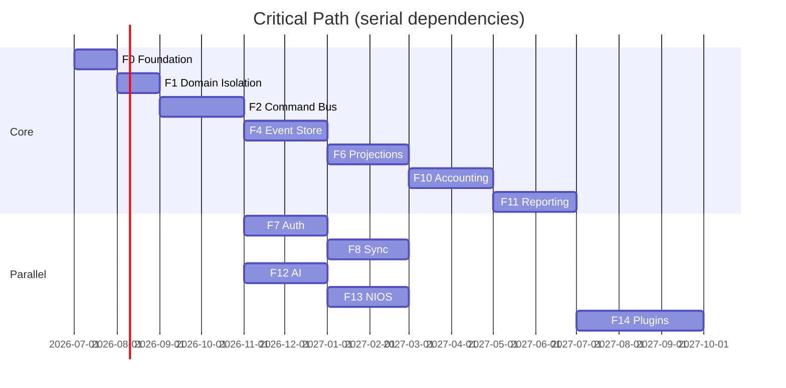

**Float:** F3, F5, F9 have float if F4/F6 staffed; F12–F13 parallel to F8–F11 if separate team.

---

## SYSTEM-07.38 Estimated Engineering Effort

| Phase | Person-weeks (range) | Team shape |
|-------|---------------------|------------|
| F0 | 4–6 | 1 platform + 1 QA |
| F1 | 8–12 | 2 client |
| F2 | 16–24 | 2 client + 1 domain |
| F3 | 6–8 | 1 platform |
| F4 | 24–32 | 2 platform + 1 data |
| F5 | 8–12 | 1 client |
| F6 | 24–32 | 2 platform + 1 domain |
| F7 | 16–24 | 1 platform + 1 backend |
| F8 | 24–32 | 2 platform + 1 backend |
| F9 | 12–16 | 1 domain |
| F10 | 20–28 | 2 domain |
| F11 | 16–24 | 2 client |
| F12 | 24–32 | 2 AI + 1 platform |
| F13 | 16–24 | 1 AI + 1 client |
| F14 | 24–40 | 2 platform + 1 client |

**Total:** ~220–330 person-weeks (~4–6 person-years calendar at parallelization).

---

## SYSTEM-07.39 Final Migration Checklist

- [ ] All validation gates VG-01 through VG-11 passed
- [ ] Zero P0 weaknesses open (SYSTEM-05 P0 list)
- [ ] Projection parity signed off by domain owner
- [ ] Sync multi-device test signed off
- [ ] OIDC in production; legacy auth disabled
- [ ] AI writes only via command bus + approval
- [ ] Reports 100% projection-backed
- [ ] Dexie write paths decommissioned per aggregate
- [ ] Plugin registry loads core ERP
- [ ] Rollback runbooks tested per phase
- [ ] Observability SLOs met
- [ ] Security pen test on gateway + NIOS
- [ ] Documentation: ADRs for each phase
- [ ] Lovable branch stable and deployed

---

## SYSTEM-07.40 Canonical Migration Model

```
CURRENT (SYSTEM-04)                    TARGET (SYSTEM-06)
─────────────────────                  ────────────────────
Zustand god store          ──F1/F2──►  Command bus + query cache
Dexie direct writes        ──F4───►    Event store append
Denorm balances            ──F6/F10─►  Projections only
Entity sync outbox         ──F8───►    Event-carried sync
sessionStorage auth        ──F7───►    OIDC JWT
4 AI stacks                ──F12/F13► Unified NIOS + gate
accounting.ts reports      ──F11──►    CQRS projections
currentPage routing        ──F14──►    Plugin registry
```

**Completion definition:** See Section 10 at end.

---

# Architecture Diagram Gallery

## Complete Migration Roadmap
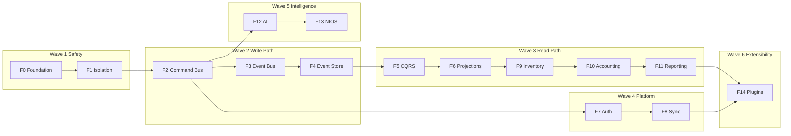

## Phase Dependency Graph
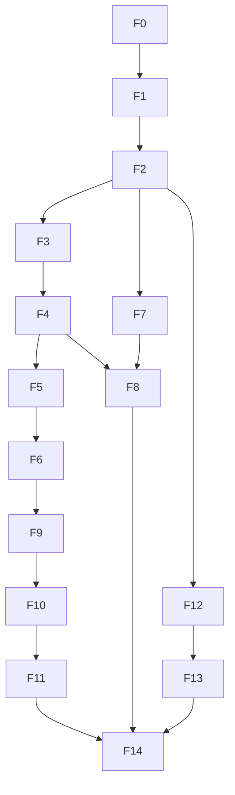

## Module Migration Graph
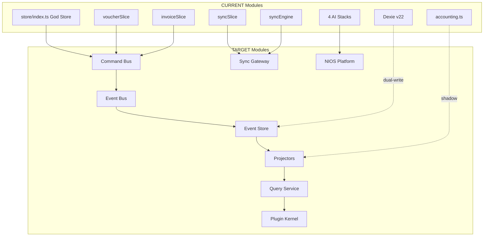

## Database Evolution
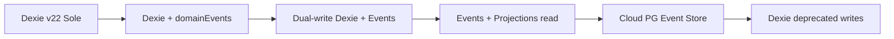

## Command Flow Evolution
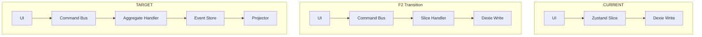

## Event Flow Evolution
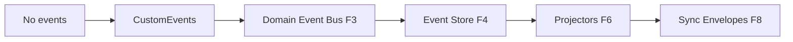

## CQRS Adoption Timeline
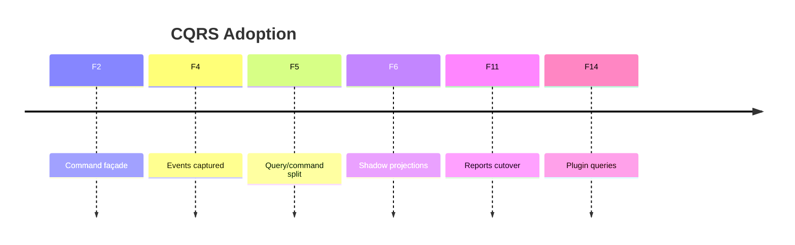

## Sync Migration
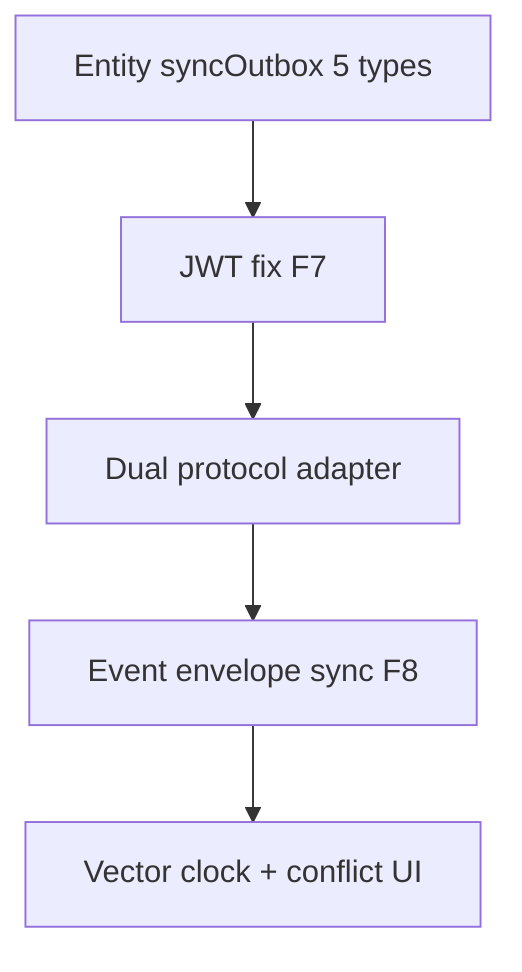

## AI Migration
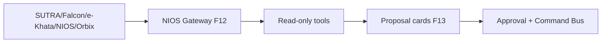

## Authentication Migration
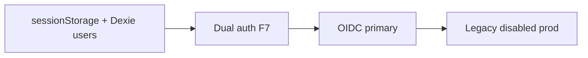

## Deployment Timeline
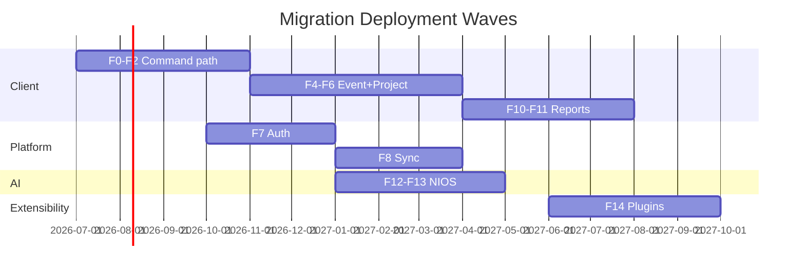

## Rollback Flow
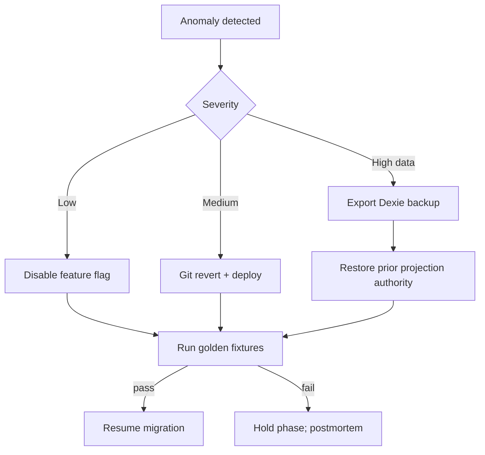

---

# Migration Matrices

## Old Module → New Module

| CURRENT (SYSTEM-04) | TARGET (SYSTEM-06) | Phase |
|---------------------|---------------------|-------|
| `store/index.ts` | Command bus + kernel | F1–F2 |
| `voucherSlice` | Ledger plugin / command handlers | F1–F10 |
| `invoiceSlice` + `addInvoice` | Billing plugin + `PostInvoiceCommand` | F2–F10 |
| `postInvoiceJournal` | Accounting engine / saga | F10 |
| `postInvoiceStock` | Inventory engine | F9–F10 |
| `syncSlice` + syncEngine | Sync gateway client | F8 |
| `accounting.ts` | Projection query service | F6–F11 |
| `confirmKhataEntry` | NIOS proposal → `PostKhataCommand` | F13 |
| `initializeApp` | Shell boot + safe migrator | F0, F4 |
| `_loadAllData` | Paginated query hydrate | F11 |
| erp_bot (NIOS/Orbix) | NIOS platform services | F12 |
| `serve.mjs` | API gateway | F7 |
| `packages/backend` | Command/query/sync services | F4–F8 |
| permissionsStore | Policy engine (RBAC+ABAC) | F7 |
| CustomEvent listeners | Domain event bus | F3 |

## Old API → New API

| CURRENT | TARGET | Phase |
|---------|--------|-------|
| `useStore().addVoucher(...)` | `dispatch(PostVoucherCommand)` | F2 |
| `useStore().addInvoice(...)` | `dispatch(PostInvoiceCommand)` | F2 |
| `confirmKhataEntry(...)` | `dispatch(PostKhataCommand)` via approval | F13 |
| Dexie direct read in UI | `query.getTrialBalance(...)` | F5–F11 |
| NIOS HTTP unauthenticated | `POST /nios/v1/chat` + Bearer | F7 |
| Sync push entity JSON | `POST /sync/v1/envelopes` | F8 |
| Report inline compute | `GET /query/v1/reports/trial-balance` | F11 |
| CBMS inline call | `POST /integration/v1/cbms/dispatch` | F10 |

## Old Store → New State Model

| CURRENT Zustand state | TARGET state owner | Phase |
|-----------------------|-------------------|-------|
| `accounts[]` + `.balance` | AccountBalance projection | F6–F10 |
| `vouchers[]` | Voucher read model / paginated query | F6–F11 |
| `invoices[]` | Invoice read model | F6–F11 |
| `stockMovements[]` | StockLedger projection | F9–F11 |
| `parties[]` | Party read model | F6 |
| `syncOutbox[]` | Event envelope outbox | F8 |
| `currentPage` | Plugin router state | F14 |
| AI chat blobs in store | Conversation service | F13 |
| Session draft keys | DraftCommand events | F2 |

## Old Sync → New Sync

| CURRENT | TARGET | Phase |
|---------|--------|-------|
| 5 entity types only | All domain events | F8 |
| No JWT on pull | OIDC JWT required | F7 |
| 30s push only | Push + idle pull | F8 |
| LWW merge | Vector clock + conflict engine | F8 |
| No versioning | Event schema version | F4 |
| Orphan outbox | Prune + ack policy | F8 |
| Client mutable / cloud immutable | Append-only both sides | F4–F8 |

## Old AI → New AI Platform

| CURRENT | TARGET | Phase |
|---------|--------|-------|
| SUTRA panel | NIOS skill plugin | F12 |
| Falcon | Model router backend | F12 |
| e-Khata store | Conversation service | F13 |
| NIOS v3 gated | NIOS always via gateway | F12 |
| Orbix goal_tree | Planner service | F12 |
| `action:"posted"` | `ProposalSubmitted` event | F13 |
| AI → `addVoucher` direct | AI → approval → command bus | F13 |
| In-memory agent_builder | Durable agent runtime | F12 |
| Chroma dual | Unified knowledge service | F12 |

## Old Database → New Storage

| CURRENT | TARGET | Phase |
|---------|--------|-------|
| Dexie `vouchers` | `VoucherPosted` stream | F4 |
| Dexie `invoices` | `InvoicePosted` stream | F4 |
| Dexie `accounts.balance` | Balance projection | F6–F10 |
| Dexie `stockMovements` | `StockMoved` stream | F4, F9 |
| Dexie `syncOutbox` | Event envelope outbox | F8 |
| IndexedDB delete on timeout | Safe migrator | F0, F4 |
| PG (backend optional) | Tenant event store PG | F4–F8 |
| R2 documents | Object store + knowledge | F12 |
| Chroma | Managed vector index | F12 |
| Redis (backend) | Cache + job queue | F7–F8 |

## Old Reports → New Projections

| CURRENT report | TARGET projection | Phase |
|----------------|-------------------|-------|
| Trial balance (`accounting.ts`) | TrialBalanceProjection | F6–F11 |
| Ledger statement | LedgerStatementProjection | F6–F11 |
| Day book | DayBookProjection | F11 |
| Stock summary | StockLedgerProjection | F9–F11 |
| Party aging | PartyAgingProjection | F11 |
| P&L / Balance sheet | FinancialStatementProjections | F11 |
| VAT report | TaxProjection + plugin | F11 |
| Dashboard widgets | DashboardProjection | F11 |

---

# Ordered Engineering Lists

## 1. Top 100 Migration Tasks (ordered)

1. Establish F0 feature flag registry (`MIGRATION_*`)
2. Create golden voucher fixture suite (SYSTEM-03 rules)
3. Create golden invoice fixture suite
4. Audit all silent `catch` on financial paths
5. Document boot phases A–J baseline timings
6. ADR template + migration governance
7. Add correlation IDs to invoice post path
8. Add correlation IDs to voucher post path
9. Map all Zustand write call sites
10. Map circular import graph (voucherSlice ↔ index)
11. Extract Ledger context facade (F1)
12. Extract Billing context facade (F1)
13. Extract Inventory context facade (F1)
14. Extract Masters context facade (F1)
15. Extract Sync context facade (F1)
16. Extract AI context facade (F1)
17. Eliminate new circular imports (lint rule)
18. Define command catalog v1
19. Implement `dispatchCommand()` shell (F2)
20. Route `addVoucher` through command bus
21. Route `addInvoice` through command bus
22. Route `cancelInvoice` through command bus
23. Route master writes through command bus
24. Add `commandId` idempotency to invoice post
25. Command coverage CI check (100% writes)
26. Local command audit log
27. Define domain event schema registry
28. Implement domain event bus (F3)
29. Dual-publish CustomEvent + domain bus
30. Subscribe audit listener (no swallow)
31. Subscribe sync prep listener
32. Design `domainEvents` Dexie table schema
33. Implement safe openDB migrator (no delete on timeout)
34. Dual-write events on command success (F4)
35. Backfill job: vouchers → events
36. Backfill job: invoices → events
37. Backfill job: stockMovements → events
38. Backfill job: masters → events
39. Nightly command↔event count reconcile
40. Introduce query façade (F5)
41. Label UI reads vs writes in codeowners
42. TrialBalance projector (F6)
43. LedgerStatement projector
44. StockLedger projector
45. PartyBalance projector
46. AccountBalance projector
47. Shadow parity job: projection vs accounting.ts
48. **VG-05 parity gate sign-off**
49. Deploy OIDC provider (staging)
50. Wire JWT on login (fix W-039)
51. Secure NIOS endpoints behind gateway (F7)
52. Remove tenant-from-body pattern
53. User import: Dexie → identity service
54. Disable default admin in prod
55. Rate limits on gateway
56. JWT refresh flow in SPA
57. Sync pull with JWT integration test
58. Event envelope sync protocol design
59. Sync adapter: entity outbox → envelopes
60. Vector clock implementation
61. Conflict inbox UI
62. Idle pull scheduler
63. Outbox prune policy
64. Expand sync to all entity event types
65. Stock movement event migration (F9)
66. Valuation policy plugin interface
67. InvoicePostingSaga (F10)
68. Unified DoubleEntryValidator
69. Document engine: series allocator
70. Retire `accounts.balance` writes
71. PDC path inside saga transaction
72. Recurring voucher → scheduled command
73. CBMS integration outbox
74. Report shadow mode (F11)
75. Paginate trial balance API
76. Paginate ledger API
77. Replace `_loadAllData` with lazy queries
78. **VG-09 report cutover sign-off**
79. NIOS gateway unified entry (F12)
80. Model router (replace cascade scatter)
81. Agent runtime durable memory
82. Tool registry (read-only phase)
83. LLM gateway provider pool
84. Knowledge ingest auth + workers
85. ProposalCard UI component
86. Approval workflow minimal (F13)
87. Route `confirmKhataEntry` → command gate
88. Eliminate `action:posted` without event
89. Mobile khata → shared SDK path
90. Plugin manifest schema
91. Kernel `registerPlugin` API
92. Core ERP as built-in plugins
93. Plugin route registry replaces currentPage
94. Sandbox capability tokens
95. Developer sandbox tenant
96. Projection rebuild runbook
97. Rollback drill per phase
98. Security pen test
99. Decommission Dexie write per aggregate
100. **Final migration checklist (07.39) sign-off**

---

## 2. Top 50 High-Risk Migrations

1. F6 projection parity with accounting.ts (W-021)
2. F10 stopping `accounts.balance` denorm writes
3. F10 InvoicePostingSaga atomicity (W-016)
4. F8 sync protocol cutover (W-050)
5. F7 OIDC login replacing sessionStorage (W-086)
6. F4 dual-write Dexie + events drift
7. F4 historical backfill correctness
8. F8 multi-device conflict resolution
9. F13 AI command gate (user friction + correctness)
10. F11 report cutover (W-166)
11. F1 god store refactor merge conflicts
12. F2 missed write path bypassing bus
13. F10 PDC transaction inclusion (W-012)
14. F10 nested Dexie removal (W-011)
15. F7 NIOS API lockdown (W-091)
16. F8 JWT dependency for sync pull (W-039)
17. F4 openDB migrator (W-059)
18. F10 period lock enforcement (W-069)
19. F10 reversal policy (W-070)
20. F9 negative stock policy (W-081)
21. F6 performance on large voucher history
22. F11 boot hydrate removal (W-131)
23. F8 prune policy data loss (W-046)
24. F10 CBMS outbox migration (W-040)
25. F13 khata vs invoice path convergence (C-15)
26. F7 default admin removal (W-084)
27. F12 LLM gateway SPOF (W-136)
28. F4 cloud PG event store tenancy isolation
29. F8 cloud immutable vs client mutable (C-12)
30. F10 document numbering unification (W-068)
31. F6 party AR/AP projection (W-023)
32. F2 khata batch partial post (W-013)
33. F11 VAT report parity
34. F8 sync partial entity set expansion (W-047)
35. F13 eKhataStore parallel path retirement
36. F14 routing regression (W-172)
37. F7 token refresh failure offline
38. F4 storage growth on mobile
39. F10 round-off / tax line validation (W-063)
40. F6 login balance recompute retirement
41. F8 server LWW backward compat
42. F12 four-stack adapter bugs (W-103)
43. F10 recurring voucher clone hack removal (W-073)
44. F11 dashboard metric drift
45. F7 permissionsStore → policy engine
46. F4 event ordering across aggregates
47. F10 cancel/reversal/repost lifecycle
48. F8 sync token expiry mid-push
49. F13 AI cache key tenant leak (W-109)
50. F14 third-party plugin security sandbox

---

## 3. Top 50 Breaking Changes

1. Default admin seed disabled in production
2. NIOS API requires authentication
3. Tenant ID from JWT only (not request body)
4. Sync pull requires valid JWT
5. `accounts.balance` no longer written
6. Reports return paginated APIs (not full arrays)
7. `_loadAllData` removed; lazy load required
8. `addVoucher` direct call deprecated
9. `addInvoice` direct call deprecated
10. CustomEvent names deprecated
11. Entity sync protocol deprecated
12. LWW silent merge removed
13. AI `action:posted` no longer implies ERP write
14. `confirmKhataEntry` requires approval gate
15. openDB no longer deletes DB on timeout
16. Open catalog API disabled in prod
17. Rate limits on public endpoints
18. Session-only auth deprecated
19. Dexie users deprecated
20. Invoice post becomes async saga (latency change)
21. Stock reads from projection (eventual consistency)
22. Trial balance shows projection lag indicator
23. Conflict inbox blocks auto-merge
24. Manual voucher number override permission-gated
25. Cancelled document numbers policy enforced
26. Period lock hard reject (no bypass)
27. PDC post requires saga completion
28. Recurring voucher via scheduler (not clone)
29. CBMS status via outbox events (not inline)
30. Khata mobile must use SDK auth
31. `currentPage` routing internal IDs change
32. Plugin route URLs may change
33. Report export column order from projection schema
34. Dashboard requires network for fresh data (optional offline cache)
35. Multi-tab Dexie concurrency behavior changes
36. Sync outbox schema change
37. Event schema version required on sync
38. AI upload size caps enforced
39. Legacy SUTRA panel removed
40. Legacy Falcon path removed
41. Orbix direct planner removed
42. e-Khata parallel store removed
43. `VITE_NIOS_PLATFORM_V3` flag removed (always on)
44. permissionsStore checks replaced by policy engine
45. Hardcoded COA IDs removed (W-035)
46. Round-off no longer masks imbalance (W-063)
47. Negative stock rejected by policy (configurable)
48. Cloud posting API append-only (no mutable PUT)
49. Integration webhooks require signed payloads
50. Dexie v22 → v23 schema additive bump

---

## 4. Top 50 Validation Checkpoints

1. VG-01: Golden fixtures pass post-F0
2. Voucher Dr=Cr on all golden vouchers
3. Invoice journal + stock on all golden invoices
4. Boot time within 110% baseline
5. Zero silent catch on financial paths (audited)
6. Circular import graph acyclic
7. 100% write paths through command bus
8. commandId dedup prevents double invoice
9. Every command emits ≥1 event
10. Event count = command count (24h window)
11. Backfill voucher count = Dexie count
12. Backfill invoice count = Dexie count
13. TrialBalance projection = accounting.ts (±0.01)
14. LedgerStatement matches per-account
15. StockLedger matches stock report
16. PartyBalance matches party ledger
17. Login no longer triggers balance recompute
18. OIDC login succeeds staging + prod
19. Sync pull succeeds with JWT
20. Sync pull fails without JWT (401)
21. NIOS returns 401 without token
22. Tenant spoof attempt blocked
23. Multi-device sync no data loss (48h test)
24. Conflict surfaced in UI (forced test)
25. Outbox prune does not delete pending
26. Idle pull retrieves server events
27. All entity types sync (not just 5)
28. Invoice saga: journal+stock or neither
29. PDC post atomic
30. Period lock rejects backdated post
31. Reversal respects locked period
32. Document numbers monotonic per series
33. Cancelled invoice creates correct reversal events
34. CBMS outbox retry succeeds
35. Report cutover: all types match goldens
36. Paginated trial balance < 2s p95
37. Boot hydrate < 50% RAM vs baseline
38. AI read tools return correct ledger data
39. AI cannot write without approval (pen test)
40. ProposalCard matches executed command
41. Khata confirm creates audit event
42. Mobile SDK auth works
43. Rate limit triggers 429 appropriately
44. Projection rebuild from zero succeeds
45. Rollback flag restores prior behavior < 15 min
46. No Dexie delete on open timeout (fault inject)
47. Core ERP loads via plugins only
48. Third-party plugin sandbox blocks filesystem
49. Observability: trace from UI → command → event
50. Final checklist 07.39 all items checked

---

## 5. Top 50 Rollback Checkpoints

1. RC-01: F0 flag disable — no behavior change
2. RC-02: F1 revert — monolithic re-export works
3. RC-03: F2 `MIGRATION_COMMAND_BUS=false`
4. RC-04: F3 `MIGRATION_EVENT_BUS=false`
5. RC-05: F4 dual-write off — Dexie sole
6. RC-06: F4 event store audit-only mode
7. RC-07: F5 query façade bypass to store
8. RC-08: F6 projections disabled
9. RC-09: F6 shadow mode only (no user impact)
10. RC-10: F7 `MIGRATION_OIDC=false`
11. RC-11: F7 legacy sessionStorage restore
12. RC-12: F8 entity outbox protocol restore
13. RC-13: F8 dual-protocol mode extend
14. RC-14: F9 Dexie stock authoritative
15. RC-15: F10 emergency denorm balance flag
16. RC-16: F10 saga bypass (emergency only)
17. RC-17: F11 `MIGRATION_CQRS_REPORTS=false`
18. RC-18: F11 shadow reports continue
19. RC-19: F12 legacy AI stack flag on
20. RC-20: F13 `MIGRATION_NIOS_COMMAND_GATE=false`
21. RC-21: F14 monolithic route table
22. RC-22: Dexie export before any schema bump
23. RC-23: Projection truncate + rebuild procedure
24. RC-24: Identity service outage → legacy auth
25. RC-25: Sync gateway outage → offline queue
26. RC-26: Event store read-only mode
27. RC-27: Cloud PG failover to client-only
28. RC-28: CBMS outbox pause + manual dispatch
29. RC-29: Git revert last phase deploy
30. RC-30: Canary 5% → 0% traffic shift
31. RC-31: Disable prune job
32. RC-32: Disable idle pull
33. RC-33: Disable conflict auto-resolution
34. RC-34: Restore CustomEvent adapters
35. RC-35: Restore `postInvoiceJournal` direct path
36. RC-36: Restore `_loadAllData` boot
37. RC-37: Chroma re-embed from object store
38. RC-38: Agent runtime in-memory fallback
39. RC-39: Plugin sandbox disable (dev only)
40. RC-40: Rate limit relax (incident)
41. RC-41: JWT expiry grace period extend
42. RC-42: Rollback runbook drill documented
43. RC-43: Post-rollback golden fixture pass required
44. RC-44: Post-rollback 24h monitoring
45. RC-45: Incident postmortem before resume
46. RC-46: Lovable branch hotfix protocol
47. RC-47: Data reconcile script (sync divergence)
48. RC-48: Manual voucher adjustment procedure
49. RC-49: Customer communication template
50. RC-50: Phase resume approval gate (eng lead)

---

## 6. Top 50 Testing Milestones

1. TM-01: Golden fixture harness green (F0)
2. TM-02: Boot integration test baseline
3. TM-03: Command schema contract tests (F2)
4. TM-04: Command coverage 100% (F2)
5. TM-05: Idempotent invoice post test
6. TM-06: Domain event bus handler tests (F3)
7. TM-07: No swallowed event handler test
8. TM-08: Dual-write event emission test (F4)
9. TM-09: Backfill job integration test
10. TM-10: Safe migrator fault injection (F4)
11. TM-11: Event replay aggregate test
12. TM-12: TrialBalance parity test (F6)
13. TM-13: LedgerStatement parity test
14. TM-14: StockLedger parity test
15. TM-15: Nightly shadow parity CI
16. TM-16: OIDC login E2E (F7)
17. TM-17: JWT sync pull E2E
18. TM-18: NIOS 401 without auth test
19. TM-19: Tenant spoof blocked test
20. TM-20: Two-device sync sim (F8)
21. TM-21: Conflict forced E2E
22. TM-22: Outbox prune safety test
23. TM-23: Idle pull test
24. TM-24: Invoice saga happy path (F10)
25. TM-25: Invoice saga stock-fail compensation
26. TM-26: PDC atomic post test
27. TM-27: Period lock reject test
28. TM-28: Reversal locked period test
29. TM-29: Document number monotonic test
30. TM-30: CBMS outbox retry test
31. TM-31: All report types golden (F11)
32. TM-32: Paginated report perf test
33. TM-33: Boot RAM benchmark (F11)
34. TM-34: NIOS read tool integration (F12)
35. TM-35: Model router fallback test
36. TM-36: Agent memory durability test
37. TM-37: AI write blocked without approval (F13)
38. TM-38: Khata proposal → command E2E
39. TM-39: Mobile SDK auth test
40. TM-40: Plugin load sandbox test (F14)
41. TM-41: Plugin route navigation test
42. TM-42: Projection rebuild from zero
43. TM-43: Rollback flag drill per phase
44. TM-44: Load test command bus p95
45. TM-45: Load test query API p95
46. TM-46: Chaos: event store slow
47. TM-47: Chaos: sync gateway down
48. TM-48: Security pen test pass
49. TM-49: Accessibility regression suite
50. TM-50: Full regression pre-F14 release

---

## 7. Critical Engineering Timeline

| Window | Milestone | Exit gate |
|--------|-----------|-----------|
| **M1** (Months 1–3) | F0 + F1 + F2 | VG-03 command coverage |
| **M2** (Months 4–6) | F3 + F4 + F5 | VG-04 event capture |
| **M3** (Months 7–9) | F6 + F7 | VG-05 parity + VG-06 auth |
| **M4** (Months 10–12) | F9 + F10 | VG-08 saga |
| **M5** (Months 13–15) | F11 + F8 | VG-09 reports + VG-07 sync |
| **M6** (Months 16–18) | F12 + F13 | VG-10 AI boundary |
| **M7** (Months 19–22) | F14 + hardening | VG-11 plugins + 07.39 |

**First user-visible risk reduction:** M3 (auth + balance parity)  
**Largest correctness win:** M4 (accounting saga)  
**Operational completeness:** M5 (reports + sync)

---

## 8. Canonical Migration Sequence

```
F0 → F1 → F2 → F3 → F4 → F5 → F6
                    ↓
              F7 (parallel from F2)
                    ↓
                   F8
F6 → F9 → F10 → F11
F2 → F12 → F13
F11 + F8 + F13 → F14
```

**Non-negotiable order:**
1. Command bus before event store (F2 before F4)
2. Event store before projections (F4 before F6)
3. Projection parity before report cutover (F6 before F11)
4. Auth before sync pull fix (F7 before F8)
5. Accounting saga before denorm retirement (F10)
6. AI platform before NIOS command gate (F12 before F13)
7. Kernel stable before plugins (F11 before F14)

---

## 9. Definition of Migration Completion

Migration is **complete** when all of the following are true:

| Criterion | Evidence |
|-----------|----------|
| **C1** | All P0 SYSTEM-05 weaknesses closed with verified fix |
| **C2** | VG-01 through VG-11 passed in production |
| **C3** | 100% ERP writes via command bus → event store |
| **C4** | 100% financial reads via projections (no denorm, no accounting.ts in prod path) |
| **C5** | Sync uses event envelopes + JWT + conflict engine |
| **C6** | OIDC sole auth in production |
| **C7** | AI ERP effects only via approval → command |
| **C8** | Core ERP delivered as built-in plugins on microkernel |
| **C9** | Dexie write paths decommissioned (export/archive only) |
| **C10** | Rollback runbooks tested; no open R-M01–R-M05 incidents |
| **C11** | SYSTEM-07.39 checklist 100% checked |
| **C12** | Architecture conformance review against SYSTEM-06 invariants I1–I5 |

---

## 10. Definition of Production Readiness (per phase release)

A phase release is **production-ready** when:

| Gate | Requirement |
|------|-------------|
| **PR1** | All phase validation criteria met |
| **PR2** | Rollback method tested in staging |
| **PR3** | Golden fixtures + phase-specific tests green |
| **PR4** | Feature flag default off in prod; canary plan documented |
| **PR5** | Observability dashboards show new path metrics |
| **PR6** | No P0/P1 open bugs for phase scope |
| **PR7** | Lovable branch deploys without broken build |
| **PR8** | Customer-facing release notes for breaking changes |
| **PR9** | On-call runbook updated |
| **PR10** | Eng lead sign-off on weakness IDs claimed resolved |

**FIOS production readiness (final):** Migration completion (§9) + 30-day production soak with SLO met + security pen test passed.

---

## Weakness → Phase Resolution Map

| Weakness | Primary phase | Secondary |
|----------|---------------|-----------|
| W-001 god store | F1, F2 | F10 |
| W-011–013 txn | F10 | F4 |
| W-014 idempotency | F2 | F21 doc engine |
| W-015 double-entry | F10 | F6 |
| W-016 invoice atomic | F10 | F4 |
| W-021 triple balance | F6, F10, F11 | — |
| W-034 circular | F1 | — |
| W-039 sync JWT | F7 | F8 |
| W-040 CBMS | F10 | F60 integration |
| W-041–046 sync | F8 | F3, F4 |
| W-044, W-050 LWW | F8 | F24 conflict |
| W-047 partial sync | F8 | — |
| W-056 mutable | F4 | F8 |
| W-059 DB destroy | F0, F4 | F30 offline |
| W-061 khata | F13 | F79 mobile |
| W-068–074 numbering | F10 | F21 doc |
| W-077–083 inventory | F9 | F10 |
| W-084–090 auth | F7 | — |
| W-091–102 security | F7 | F31 security |
| W-103–115 AI | F12, F13 | — |
| W-106 AI posted | F13 | F2 |
| W-123–130 knowledge | F12 | — |
| W-131–133 perf | F11 | F6 |
| W-166–170 reports | F11 | F6 |
| W-172 routing | F14 | F28 frontend |
| AD-01–15 | F12–F14 | F80 evolution |
| C-03 auth | F7 | — |
| C-12 immutable | F4, F8 | — |
| C-15 khata products | F13 | F79 |

---

*End of SYSTEM-07 Canonical Migration Blueprint.*
