# SYSTEM-08: F0 Implementation Playbook

**Project:** Sutra FIOS  
**Phase:** F0 — Foundation  
**Prerequisites:** SYSTEM-01 through SYSTEM-07  
**Nature:** Implementation design only — no code, no file rewrites, no repository scans  
**Generated:** 2026-07-10

---

## Traceability Model

Every design element in this playbook carries a four-way mapping:

| Tag | Source | Meaning |
|-----|--------|---------|
| **CURRENT** | SYSTEM-04 | What exists in runtime today |
| **WEAKNESS** | SYSTEM-05 | Defect or debt being addressed |
| **TARGET** | SYSTEM-06 | Canonical future-state component |
| **PHASE** | SYSTEM-07 | When this design is implemented |

**F0 scope:** Establish structure, contracts, catalogs, flags, fixtures, and observability design. F0 delivers **design artifacts + scaffolding plan**; command bus runtime lands in F2, event store in F4, projections in F6 per SYSTEM-07.

---

## F0 Executive Summary

| Attribute | Value |
|-----------|-------|
| **Purpose** | Create the engineering foundation so F1–F14 execute without architectural drift |
| **Duration** | 2–3 weeks (SYSTEM-07.38: 4–6 person-weeks) |
| **User-visible change** | None (HC2, SYSTEM-07.3) |
| **Exit gate** | VG-01 (SYSTEM-07.33) |
| **Primary weaknesses** | W-005, W-017, W-045, W-154, W-059 (prep) |
| **TARGET sections** | 06.36, 06.37, 06.39, 06.65, 06.66 |

---

# 1. F0 Repository Restructuring

## Purpose
Introduce a **planned** physical layout that separates kernel contracts from legacy god-store implementation, enabling F1 domain isolation without circular imports.

## CURRENT (SYSTEM-04)
- Monolithic `src/store/index.ts` re-exports all slices
- Circular dependency: `voucherSlice` ↔ `index.ts` (W-034)
- Domain logic, UI, sync, AI intertwined under `src/`
- No `packages/fios-*` kernel packages
- Backend split: `packages/backend`, `erp_bot`, `serve.mjs` (AD-04)

## WEAKNESS
W-001, W-033, W-034, W-036–W-038, AD-08, TD-01, TD-25

## TARGET (SYSTEM-06)
§06.65 Module Isolation, §06.66 Dependency Direction, §06.7 Microkernel prep

## PHASE (SYSTEM-07)
F0 = design layout; F1 = physical extraction; F14 = plugin packaging

## Restructuring principles (F0 design only)

| Rule | Rationale |
|------|-----------|
| **R1** | New code only under planned namespaces; legacy untouched in F0 |
| **R2** | Kernel contracts live in dependency-inverted packages |
| **R3** | Legacy store becomes an adapter behind interfaces until F2 |
| **R4** | No file moves in F0 — ADR documents target paths |
| **R5** | Lovable branch stays buildable after every F0 commit (HC3) |

## Planned top-level layout

```
sutra-erp/
├── docs/                          # KB + ADRs (existing)
├── packages/
│   ├── fios-kernel/               # NEW (F0 design) — contracts only
│   ├── fios-testing/              # NEW (F0 design) — golden fixtures
│   └── backend/                   # EXISTING — cloud services (F4+)
├── src/
│   ├── app/                       # EXISTING — shell, boot (SYSTEM-04 A–J)
│   ├── legacy/                    # PLANNED (F1) — moved store/slices
│   ├── platform/                  # NEW (F0 design) — bus interfaces, flags
│   ├── domains/                   # NEW (F0 design) — bounded contexts
│   └── ...                        # pages, components (unchanged F0)
├── erp_bot/                       # EXISTING — NIOS Python (F12)
└── serve.mjs                      # EXISTING — edge proxy (F7)
```

## F0 deliverables (no moves yet)
1. ADR-001: Repository restructuring rationale
2. ADR-002: Dependency direction rules
3. Path mapping table: CURRENT file → TARGET home (design)
4. ESLint boundary rules spec (enforce from F1)

## Breaking changes
None in F0.

## Rollback
Delete planned empty package stubs; revert ADRs.

---

# 2. Domain Boundaries

## Purpose
Define canonical bounded contexts and anti-corruption boundaries before F1 extraction.

## CURRENT (SYSTEM-04)
- Logical domains exist in slices but share mutable Zustand state (W-001)
- Invoice path: `addInvoice` → `postInvoiceJournal` + `postInvoiceStock`
- Khata path: `confirmKhataEntry` → `addVoucher` only (W-061, C-15)
- Reports: `accounting.ts` crosses voucher + account domains (W-021)
- Sync: only 5 entity types enqueued (W-047)

## WEAKNESS
W-001, W-033, W-061, W-047, C-15, AD-08

## TARGET (SYSTEM-06)
§06.4 Bounded Context Map

## PHASE
F0 = boundary definition; F1 = facade extraction; F9–F13 = engine cutover

## Canonical bounded contexts (F0)

| Context ID | Name | CURRENT owner | Write authority (TARGET) | Integration style |
|------------|------|---------------|--------------------------|-------------------|
| **BC-LED** | Ledger | voucherSlice, accounting.ts | Ledger aggregate / events | Events out |
| **BC-BIL** | Billing | invoiceSlice, SalesInvoiceForm | Invoice aggregate | Commands → LED, INV |
| **BC-INV** | Inventory | postInvoiceStock, items | StockPosition aggregate | Events → LED |
| **BC-TAX** | Tax | invoice tax lines, CBMS | Tax plugin | Events + outbox |
| **BC-MST** | Masters | account/party/item slices | Master aggregates | Reference commands |
| **BC-DOC** | Documents | voucher numbering fns | DocumentSeries aggregate | Policy service |
| **BC-SYN** | Sync | syncSlice, syncEngine | SyncCursor aggregate | Event envelopes |
| **BC-IDN** | Identity | sessionStorage, Dexie users | Identity service | JWT claims |
| **BC-WFL** | Workflow | `[NOT OBSERVED]` approval | ApprovalRequest | Gates commands |
| **BC-RPT** | Reporting | accounting.ts, report pages | Read models only | Subscribes events |
| **BC-NIOS** | Intelligence | erp_bot, AI panels | Proposal only | Proposes → WFL |
| **BC-INT** | Integration | CBMS `.then` | Outbox dispatcher | Async |

## Context boundary rules

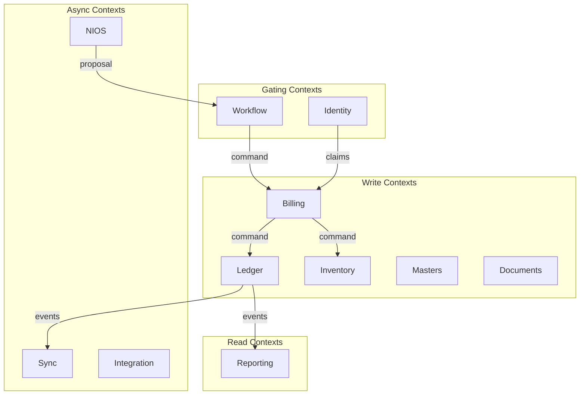

## Anti-corruption layers (planned)
| Boundary | ACL role |
|----------|----------|
| Legacy store → Domain facades | Translate slice calls to domain DTOs (F1) |
| Domain → Command bus | Translate DTOs to commands (F2) |
| Dexie → Event store | Translate rows to events (F4) |
| AI → ERP | Translate chat intents to proposals (F13) |

---

# 3. Module Ownership

## Purpose
Assign team/runtime ownership to prevent god-module regression.

## CURRENT
De facto single `store/` ownership; no CODEOWNERS for domains (W-036)

## WEAKNESS
W-036, W-038, AD-08

## TARGET
§06.6 Service Decomposition, §06.67 Data Ownership

## PHASE
F0 = RACI matrix; F1+ = CODEOWNERS enforcement

## Ownership matrix

| Module (planned path) | Owner team | Runtime | Writes? | Reads? |
|----------------------|------------|---------|---------|--------|
| `packages/fios-kernel` | Platform | Client+Cloud | No | Contracts |
| `src/platform/command` | Platform | Client | Routes | No |
| `src/platform/event` | Platform | Client | Publishes | Subscribes |
| `src/platform/flags` | Platform | Client | No | Yes |
| `src/domains/ledger` | Domain — Accounting | Client | F2+ | F5+ |
| `src/domains/billing` | Domain — Billing | Client | F2+ | F5+ |
| `src/domains/inventory` | Domain — Inventory | Client | F2+ | F5+ |
| `src/domains/masters` | Domain — Masters | Client | F2+ | F5+ |
| `src/domains/sync` | Platform | Client | F8 | F8 |
| `src/domains/reporting` | Domain — Reporting | Client | No | F6+ |
| `src/legacy/store` | Migration tiger team | Client | F0–F10 | F0–F11 |
| `packages/backend` | Platform | Cloud | F4+ | F4+ |
| `erp_bot` | AI Platform | Cloud | F12+ | F12+ |

## RACI (F0)

| Activity | Platform | Domain | AI | SRE |
|----------|----------|--------|-----|-----|
| Kernel contracts | **R** | C | C | I |
| Golden fixtures | C | **R** | I | C |
| Feature flags | **R** | I | I | C |
| Observability | C | I | I | **R** |
| ADRs | **R** | A | C | C |

---

# 4. Command Bus Design

## Purpose
Define the command bus **contract** that F2 will implement; F0 produces schema and routing spec only.

## CURRENT (SYSTEM-04)
- All mutations: direct Zustand slice methods (`addVoucher`, `addInvoice`, etc.)
- No idempotency key on invoice post (W-014)
- AI can reach `addVoucher` via `confirmKhataEntry` (W-106)
- Khata vs invoice divergent paths (W-061)

## WEAKNESS
W-001, W-014, W-106, W-149, W-015

## TARGET
§06.11 Command Bus, §06.56 ERP Command Execution Boundary

## PHASE
F0 = design; **F2 = implement**; F13 = AI gate

## Command bus architecture (design)

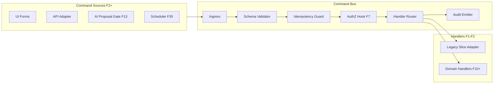

## Command envelope (canonical schema — design)

| Field | Type | Source | Notes |
|-------|------|--------|-------|
| `commandId` | UUID | Client-generated | Idempotency (W-014) |
| `commandType` | string enum | Catalog §9 | Versioned |
| `commandVersion` | int | Catalog | Default 1 |
| `tenantId` | UUID | JWT claim F7 | **Not body** (W-092) |
| `companyId` | UUID | JWT / session | |
| `userId` | UUID | JWT / session | |
| `correlationId` | UUID | Trace chain | Observability (W-154) |
| `causationId` | UUID? | Prior event/cmd | Event sourcing prep |
| `aggregateType` | string | Catalog | Routing |
| `aggregateId` | string? | Client or allocator | |
| `payload` | typed object | Per command | Schema validated |
| `issuedAt` | ISO8601 | Client clock | Sync prep |
| `clientMeta` | object | deviceId, appVersion | Sync prep |

## Command result (design)

| Field | Values |
|-------|--------|
| `status` | `accepted` \| `rejected` \| `duplicate` |
| `eventIds` | string[] (empty until F4) |
| `errors` | `{ code, message, field? }[]` |
| `correlationId` | echo |

## F0 command bus deliverables
1. `COMMAND_CATALOG.md` (§9 below)
2. Interface spec: `ICommandBus`, `ICommandHandler`, `ICommandValidator`
3. Routing table: commandType → legacy handler mapping (F2 adapter)
4. Idempotency policy document
5. Feature flag: `MIGRATION_COMMAND_BUS` (default `false`)

## F0 behavior
**No runtime command bus.** Legacy slice calls remain sole write path.

---

# 5. Event Bus Design

## Purpose
Define typed domain event bus replacing ad-hoc CustomEvents and swallowed listeners.

## CURRENT (SYSTEM-04)
- CustomEvents for NIOS, sync side-effects (W-041, W-161)
- Swallowed failures in financial paths (W-017)
- No DLQ or typed schema (W-165)
- Kernel/browser bus disconnected (W-161)

## WEAKNESS
W-017, W-041, W-161, W-165, W-160

## TARGET
§06.14 Event Bus, §06.16 Domain Event Catalog

## PHASE
F0 = design; **F3 = implement**; F4 = persist to store

## Event bus architecture (design)

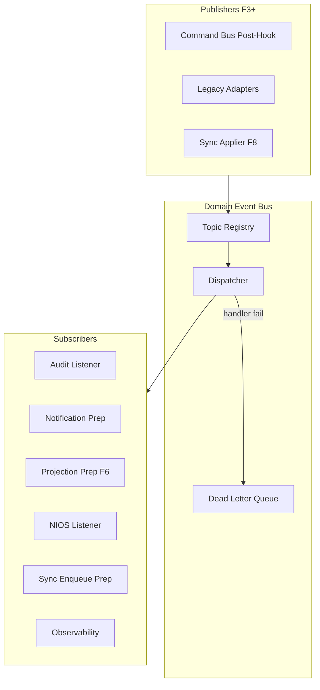

## Event envelope (design)

| Field | Type | Notes |
|-------|------|-------|
| `eventId` | UUID | Unique |
| `eventType` | string enum | Catalog §8 |
| `eventVersion` | int | Schema registry |
| `aggregateType` | string | |
| `aggregateId` | string | |
| `tenantId` | UUID | |
| `companyId` | UUID | |
| `sequence` | int | Per-aggregate (F4) |
| `correlationId` | UUID | |
| `causationId` | UUID | |
| `payload` | object | Typed per event |
| `occurredAt` | ISO8601 | |
| `metadata` | object | userId, deviceId |

## Delivery guarantees (design)
| Bus | Scope | Guarantee |
|-----|-------|-----------|
| In-process (client) | F3 | At-least-once; sync handlers |
| Integration (cloud) | F8+ | Outbox + at-least-once |
| Client SSE | F11+ | Best-effort subscription |

## F0 deliverables
1. `DOMAIN_EVENT_CATALOG.md` (§8)
2. Interface spec: `IEventBus`, `IEventHandler`, `IEventSchemaRegistry`
3. DLQ policy: no silent swallow (W-017)
4. Feature flag: `MIGRATION_EVENT_BUS` (default `false`)
5. CustomEvent → domain event mapping table

---

# 6. Event Store Schema

## Purpose
Define append-only event store schema for F4 dual-write; F0 produces schema spec only.

## CURRENT (SYSTEM-04)
- Dexie v22: mutable row updates on vouchers, invoices, accounts.balance (W-056)
- No event log table (W-021)
- openDB timeout may delete entire IndexedDB (W-059)
- Cloud PG optional via packages/backend (AD-04)

## WEAKNESS
W-021, W-056, W-059, C-12, F-DB-01

## TARGET
§06.13 Event Sourcing, §06.69 Persistence

## PHASE
F0 = schema design; **F4 = implement**; F8 = cloud replica

## Stream naming convention
```
{tenantId}/{aggregateType}/{aggregateId}
```

Global tenant fan-out stream:
```
{tenantId}/$all
```

## Local event store (Dexie/SQLite — F4 target)

### Table: `domainEvents` (design)

| Column | Type | Index | Notes |
|--------|------|-------|-------|
| `id` | string (UUID) | PK | eventId |
| `tenantId` | string | IDX | |
| `companyId` | string | IDX | |
| `aggregateType` | string | IDX | |
| `aggregateId` | string | IDX | |
| `sequence` | int | COMPOSITE | `(aggregateType, aggregateId, sequence)` unique |
| `eventType` | string | IDX | |
| `eventVersion` | int | | |
| `payload` | JSON | | |
| `correlationId` | string | IDX | |
| `causationId` | string? | | |
| `commandId` | string? | IDX | Idempotency link |
| `occurredAt` | ISO8601 | IDX | |
| `recordedAt` | ISO8601 | | Server/device receipt |
| `metadata` | JSON | | userId, deviceId |
| `migrationTag` | string? | | `backfill-v1` for converted rows |

### Table: `eventSnapshots` (design — F4 optional)

| Column | Type | Notes |
|--------|------|-------|
| `aggregateKey` | string | PK composite |
| `sequence` | int | Snapshot at version |
| `state` | JSON | Serialized aggregate |
| `createdAt` | ISO8601 | |

### Table: `syncCursors` (design — F8)

| Column | Type | Notes |
|--------|------|-------|
| `deviceId` | string | PK |
| `tenantId` | string | |
| `lastServerSequence` | int | |
| `vectorClock` | JSON | Device vector |
| `updatedAt` | ISO8601 | |

## Cloud event store (PostgreSQL — F4+ design)

Mirror `domainEvents` with partition by `tenantId`. Additional:
- `event_store_streams` — stream metadata
- `outbox_integration` — CBMS/webhooks (W-040)

## Safe open policy (F0 ADR — addresses W-059)
| Rule | Action |
|------|--------|
| Open timeout | Retry with backoff; **never** `deleteDatabase()` |
| Schema bump | Export backup first |
| Corruption detect | Offer restore from last export |
| Migration fail | Roll forward with fix; no destructive reset |

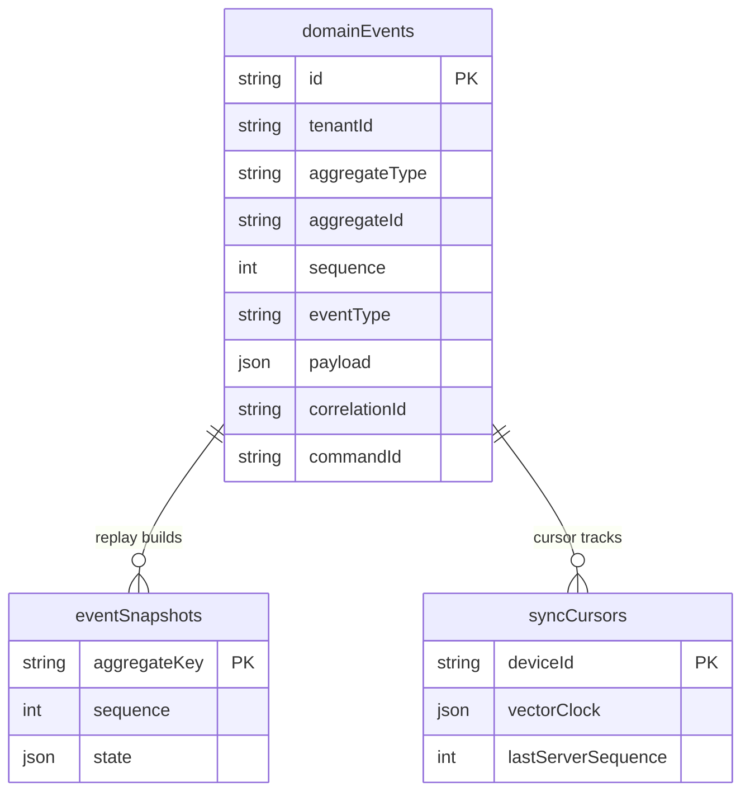

---

# 7. Aggregate Definitions

## Purpose
Define aggregate roots, invariants, and command/event ownership before F4 event sourcing.

## CURRENT (SYSTEM-04)
- No explicit aggregates; vouchers/invoices are Dexie rows (W-001)
- `accounts.balance` denormalized (W-021)
- Period lock checked ad-hoc (W-069)
- Document numbering: 3 parallel functions (W-068)

## WEAKNESS
W-001, W-015, W-021, W-068, W-069, W-070

## TARGET
§06.5 DDD Model

## PHASE
F0 = definitions; F4 = event streams; F10 = invariant enforcement

## Aggregate catalog (design)

### AGG-001: Voucher
| Attribute | Value |
|-----------|-------|
| **ID** | `VoucherId` (UUID or serial per series) |
| **CURRENT** | `vouchers` Dexie table + lines |
| **Commands** | `PostVoucher`, `CancelVoucher`, `ReverseVoucher` |
| **Events** | `VoucherPosted`, `VoucherCancelled`, `VoucherReversed` |
| **Invariants** | Dr=Cr (W-015); period not locked (W-069); series valid (W-068) |
| **Stream** | `{tenant}/Voucher/{id}` |

### AGG-002: Invoice
| Attribute | Value |
|-----------|-------|
| **ID** | `InvoiceId` |
| **CURRENT** | `invoices` + `addInvoice` saga implicit |
| **Commands** | `PostInvoice`, `CancelInvoice`, `AmendInvoice` |
| **Events** | `InvoicePosted`, `InvoiceCancelled` + saga child events |
| **Invariants** | Atomic journal+stock intent (W-016); tax valid (W-063) |
| **Stream** | `{tenant}/Invoice/{id}` |

### AGG-003: Account (COA node)
| Attribute | Value |
|-----------|-------|
| **ID** | `AccountId` |
| **CURRENT** | `accounts` with mutable `.balance` |
| **Commands** | `CreateAccount`, `UpdateAccount`, `DeactivateAccount` |
| **Events** | `AccountCreated`, `AccountUpdated`, `AccountDeactivated` |
| **Invariants** | No hardcoded COA IDs (W-035); balance **not** on aggregate (W-021) |
| **Stream** | `{tenant}/Account/{id}` |

### AGG-004: StockPosition
| Attribute | Value |
|-----------|-------|
| **ID** | `{ItemId}:{WarehouseId}` |
| **CURRENT** | `stockMovements` derived qty |
| **Commands** | `RecordStockMovement`, `AdjustStock` |
| **Events** | `StockMoved`, `StockAdjusted` |
| **Invariants** | Negative stock policy (W-081); valuation plugin (W-082) |
| **Stream** | `{tenant}/StockPosition/{id}` |

### AGG-005: Party
| Attribute | Value |
|-----------|-------|
| **ID** | `PartyId` |
| **CURRENT** | `parties` table |
| **Commands** | `CreateParty`, `UpdateParty` |
| **Events** | `PartyCreated`, `PartyUpdated` |
| **Stream** | `{tenant}/Party/{id}` |

### AGG-006: DocumentSeries
| Attribute | Value |
|-----------|-------|
| **ID** | `SeriesId` |
| **CURRENT** | `voucherSeriesConfig`, `generateSerialNumber`, etc. |
| **Commands** | `AllocateDocumentNumber`, `ConfigureSeries` |
| **Events** | `DocumentNumberAllocated`, `SeriesConfigured` |
| **Invariants** | Monotonic; fiscal reset policy (W-068, W-072) |
| **Stream** | `{tenant}/DocumentSeries/{id}` |

### AGG-007: FiscalYear / PeriodLock
| Attribute | Value |
|-----------|-------|
| **ID** | `FiscalYearId` |
| **CURRENT** | `periodLocks` `[NOT OBSERVED]` schema |
| **Commands** | `LockPeriod`, `UnlockPeriod` |
| **Events** | `PeriodLocked`, `PeriodUnlocked` |
| **Stream** | `{tenant}/FiscalYear/{id}` |

### AGG-008: SyncCursor
| Attribute | Value |
|-----------|-------|
| **ID** | `DeviceId` |
| **CURRENT** | sync state implicit in syncSlice |
| **Commands** | `AdvanceCursor`, `RecordConflict` |
| **Events** | `SyncBatchApplied`, `ConflictDetected`, `ConflictResolved` |
| **Stream** | `{tenant}/SyncCursor/{deviceId}` |

## Aggregate lifecycle (diagram)

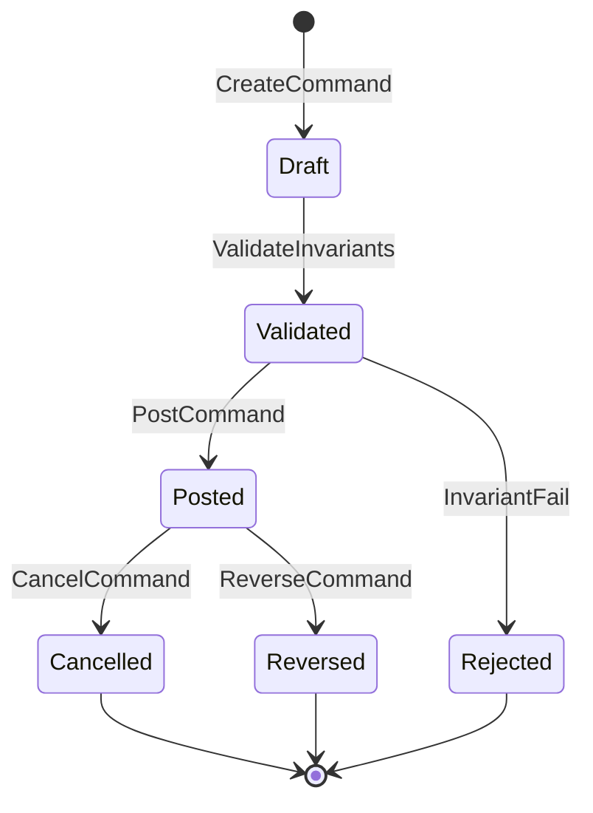

---

# 8. Domain Event Catalog

## Purpose
Canonical typed events for bus (F3) and store (F4).

## CURRENT
Ad-hoc events, CustomEvents, no registry (W-165)

## TARGET
§06.16 Domain Event Catalog

## PHASE
F0 = catalog; F3 = publish; F4 = persist

## Event registry (v1 design)

| Event Type | Aggregate | Producer | Key Payload Fields | Consumers | Weakness |
|------------|-----------|----------|-------------------|-----------|----------|
| `VoucherPosted` | Voucher | Ledger | lines[], voucherNo, date, totals | RPT, SYN, AUD, NIOS | W-041 |
| `VoucherCancelled` | Voucher | Ledger | voucherId, reason | RPT, SYN | W-069 |
| `VoucherReversed` | Voucher | Ledger | originalId, reversalId | RPT, SYN | W-070 |
| `InvoicePosted` | Invoice | Billing | invoiceNo, partyId, lines, totals | LED, INV, TAX, SYN | W-016 |
| `InvoiceCancelled` | Invoice | Billing | invoiceId | LED, INV, SYN | W-069 |
| `StockMoved` | StockPosition | Inventory | itemId, qty, direction, valuation | RPT, SYN | W-077 |
| `AccountCreated` | Account | Masters | accountId, parentId, type | SYN, RPT | W-035 |
| `AccountUpdated` | Account | Masters | accountId, changes | SYN | W-064 |
| `PartyCreated` | Party | Masters | partyId, type | SYN | W-023 |
| `PartyUpdated` | Party | Masters | partyId, changes | SYN | |
| `ItemCreated` | Item | Masters | itemId | SYN | W-047 |
| `DocumentNumberAllocated` | DocumentSeries | Documents | seriesId, number | AUD | W-068 |
| `PeriodLocked` | FiscalYear | Workflow | fromDate, toDate | CMD policy | W-074 |
| `PeriodUnlocked` | FiscalYear | Workflow | periodId | CMD policy | |
| `CommandAccepted` | — | Command Bus | commandId, type | OBS, AUD | W-106 |
| `CommandRejected` | — | Command Bus | commandId, errors[] | UI, OBS | W-005 |
| `SyncBatchApplied` | SyncCursor | Sync | batchId, count | PROJ | W-008 |
| `ConflictDetected` | SyncCursor | Sync | entityRef, clocks | UI | W-044 |
| `ConflictResolved` | SyncCursor | Sync | resolution | SYN | W-043 |
| `AIOperationProposed` | — | NIOS | proposalId, intent | WFL | W-106 |
| `ApprovalGranted` | ApprovalRequest | Workflow | requestId | CMD | approval gap |
| `IntegrationDispatchRequested` | — | Integration | type, payload | INT outbox | W-040 |
| `IntegrationDispatchCompleted` | — | Integration | status | UI, NOTIF | W-040 |

## Event versioning policy (F0)
- `eventVersion` increment on breaking payload change
- Upcasters registered in schema registry (F4)
- Backfill events tagged `migrationTag: backfill-v1`

---

# 9. Command Catalog

## Purpose
Complete command vocabulary for bus routing (F2+).

## CURRENT
Implicit slice methods — no catalog (W-001)

## TARGET
§06.11 Command Bus

## PHASE
F0 = catalog; F2 = route; F10 = saga commands

## Command registry (v1 design)

| Command Type | Aggregate | CURRENT method | Phase | Idempotent? | Weakness |
|--------------|-----------|----------------|-------|-------------|----------|
| `PostVoucher` | Voucher | `addVoucher` | F2 | Yes | W-015, W-014 |
| `CancelVoucher` | Voucher | cancel paths | F2 | Yes | W-069 |
| `ReverseVoucher` | Voucher | reversal paths | F2 | Yes | W-070 |
| `PostInvoice` | Invoice | `addInvoice` | F2 | Yes | W-016, W-014 |
| `CancelInvoice` | Invoice | cancel invoice | F2 | Yes | W-069 |
| `PostKhataEntry` | Voucher | `confirmKhataEntry` | F13 | Yes | W-061, W-106 |
| `CreateAccount` | Account | account slice add | F2 | Yes | W-035 |
| `UpdateAccount` | Account | account slice update | F2 | Yes | |
| `CreateParty` | Party | party slice add | F2 | Yes | |
| `UpdateParty` | Party | party slice update | F2 | Yes | |
| `CreateItem` | Item | item slice add | F2 | Yes | |
| `UpdateItem` | Item | item slice update | F2 | Yes | |
| `RecordStockMovement` | StockPosition | `postInvoiceStock` | F9 | Yes | W-077 |
| `AllocateDocumentNumber` | DocumentSeries | `generateSerialNumber` etc. | F10 | Yes | W-068 |
| `LockPeriod` | FiscalYear | period lock | F10 | Yes | W-074 |
| `SubmitAIProposal` | — | NIOS confirm | F13 | Yes | W-106 |
| `ApproveCommand` | ApprovalRequest | `[NOT OBSERVED]` | F13 | Yes | approval gap |
| `EnqueueSyncPush` | SyncCursor | syncSlice push | F8 | Yes | W-041 |
| `SaveDraft` | Draft | sessionStorage drafts | F2 | Yes | W-037 |

## Command → legacy adapter map (F2 design)
All F2 handlers initially delegate to existing slice methods unchanged.

---

# 10. Projection Catalog

## Purpose
Define read models F6 will build; F0 establishes parity targets against `accounting.ts`.

## CURRENT
- `accounting.ts` computes from voucher lines (W-021 partial truth)
- `accounts.balance` denormalized (W-021)
- Login recompute path (CONTRADICTION-02)
- Full RAM hydrate `_loadAllData` (W-131)

## WEAKNESS
W-021, W-131, W-166–W-170, CONTRADICTION-01/02

## TARGET
§06.12 CQRS, §06.31 Reporting

## PHASE
F0 = catalog + parity spec; **F6 = implement**; **F11 = cutover**

## Projection registry (design)

| Projection ID | Name | Source Events | CURRENT equivalent | Parity gate |
|---------------|------|---------------|-------------------|-------------|
| **PRJ-01** | TrialBalance | `VoucherPosted`, reversals | Trial balance report | VG-05 ±0.01 |
| **PRJ-02** | LedgerStatement | `VoucherPosted` | Ledger report | VG-05 |
| **PRJ-03** | AccountBalance | `VoucherPosted` | `accounts.balance` | VG-05 — replaces denorm |
| **PRJ-04** | PartyBalance | `VoucherPosted` | Party ledger | VG-05 |
| **PRJ-05** | StockLedger | `StockMoved` | Stock report | VG-05 |
| **PRJ-06** | DayBook | `VoucherPosted` | Day book report | VG-09 |
| **PRJ-07** | CashBook | `VoucherPosted` | Cash book | VG-09 |
| **PRJ-08** | ProfitAndLoss | `VoucherPosted` | P&L report | VG-09 |
| **PRJ-09** | BalanceSheet | `VoucherPosted` | Balance sheet | VG-09 |
| **PRJ-10** | VATReport | Tax events | VAT report | VG-09 |
| **PRJ-11** | DashboardMetrics | Multiple | Dashboard | VG-09 |
| **PRJ-12** | AuditTrail | All commands/events | None unified | F0 audit prep |

## Projection metadata (design)
Each projection stores: `projectionId`, `lastEventSequence`, `lastRebuildAt`, `checksum`, `version`.

## F0 projection deliverables
1. Parity spec: field-by-field mapping CURRENT report → projection
2. Golden output snapshots (§15)
3. Shadow comparison job design (runs F6+)

---

# 11. Repository Interfaces

## Purpose
Dependency-inverted persistence contracts separating domain from Dexie/event store.

## CURRENT
- Direct Dexie calls in slices (W-033)
- Nested Dexie transactions (W-011)
- No repository abstraction

## WEAKNESS
W-033, W-011, W-034, TD-25

## TARGET
§06.69 Persistence, §06.66 Dependency Rules

## PHASE
F0 = interfaces; F1 = facades; F4 = event repo impl

## Interface catalog (design — no code)

### `IEventStore`
| Method | Purpose | Phase |
|--------|---------|-------|
| `append(streamId, events, expectedVersion)` | Atomic append | F4 |
| `getStream(streamId, fromSequence)` | Read for replay | F4 |
| `getTenantStream(tenantId, fromPosition)` | Fan-out read | F4 |

### `IVoucherRepository` (read/write adapter)
| Method | CURRENT | Phase |
|--------|---------|-------|
| `save(voucher)` | Dexie `vouchers.put` | F1 facade |
| `getById(id)` | Dexie get | F1 |
| `list(query)` | Dexie filter | F5 paginate |

### `IInvoiceRepository`
| Method | CURRENT | Phase |
|--------|---------|-------|
| `save(invoice)` | Dexie `invoices` | F1 |
| `getById(id)` | Dexie get | F1 |

### `IAccountRepository`
| Method | CURRENT | Phase |
|--------|---------|-------|
| `save(account)` | Dexie — **stop balance write F10** | F1 |
| `listChart()` | Dexie accounts | F1 |

### `IProjectionReader`
| Method | Phase |
|--------|-------|
| `getTrialBalance(params)` | F6 |
| `getLedgerStatement(accountId, range)` | F6 |
| `getStockLedger(itemId, range)` | F6 |

### `ISyncOutbox`
| Method | CURRENT | Phase |
|--------|---------|-------|
| `enqueue(record)` | `enqueueSyncRecord` | F1 facade |
| `getPending()` | syncOutbox read | F1 |
| `markSynced(id)` | sync slice | F1 |

### `ICommandBus` (see §4)
### `IEventBus` (see §5)

## Adapter strategy
```
F0–F1: Interface defined; DexieLegacyAdapter implements (wraps existing)
F4:    EventStoreAdapter added; dual-write decorator
F6:    ProjectionReader added; shadow mode
F11:   ProjectionReader becomes primary read
```

---

# 12. Dependency Inversion Plan

## Purpose
Eliminate circular imports and enforce TARGET dependency direction.

## CURRENT
`voucherSlice` ↔ `store/index.ts` circular (W-034); UI imports Dexie (W-033)

## WEAKNESS
W-034, W-033, W-036, AD-08, TD-25

## TARGET
§06.66 Dependency Direction Rules

## PHASE
F0 = plan + lint rules spec; F1 = enforce

## Allowed dependency graph

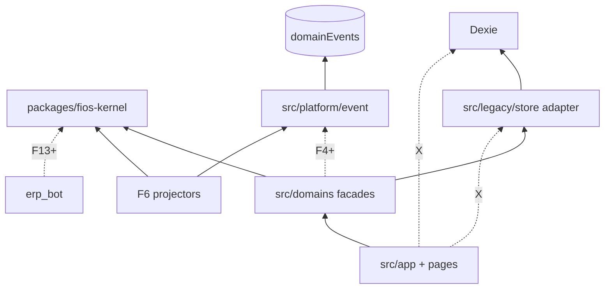

## Layer rules

| Layer | May import | Must not import |
|-------|------------|-----------------|
| `packages/fios-kernel` | Nothing internal | src/, Dexie, React |
| `src/platform/*` | fios-kernel | domains/legacy, pages |
| `src/domains/*` | fios-kernel, platform | pages, other domains' internals |
| `src/legacy/*` | Dexie, domains (interfaces only) | pages |
| `src/app`, `pages` | domains facades, platform | legacy/store internals, Dexie |
| `erp_bot` | HTTP contracts | Dexie |

## F0 deliverables
1. ADR-002: Dependency inversion
2. ESLint `import/no-restricted-paths` rule spec
3. Circular dependency CI check (madge-class) baseline snapshot
4. Import migration checklist per slice (F1)

---

# 13. Feature Flag Strategy

## Purpose
Unified migration flag namespace replacing scattered env gates.

## CURRENT
- `VITE_NIOS_PLATFORM_V3` and scattered toggles (C-05)
- No `MIGRATION_*` namespace
- Flags imply behavior divergence without docs

## WEAKNESS
C-05, W-005 (silent paths under flags)

## TARGET
§06.74 Deployment (feature flags per plugin)

## PHASE
F0 = registry; each phase adds flags per SYSTEM-07

## Flag registry (F0 design)

| Flag | Default F0 | Phase active | Purpose | Rollback |
|------|------------|--------------|---------|----------|
| `MIGRATION_COMMAND_BUS` | `false` | F2 | Route writes via bus | Instant |
| `MIGRATION_EVENT_BUS` | `false` | F3 | Typed domain events | Instant |
| `MIGRATION_EVENT_STORE` | `false` | F4 | Dual-write events | Instant |
| `MIGRATION_DUAL_WRITE` | `false` | F4 | Dexie + events | Instant |
| `MIGRATION_QUERY_FACADE` | `false` | F5 | Query layer intro | Instant |
| `MIGRATION_SHADOW_PROJECTIONS` | `false` | F6 | Nightly parity job | Instant |
| `MIGRATION_OIDC` | `false` | F7 | OIDC auth | F7 rollback |
| `MIGRATION_EVENT_SYNC` | `false` | F8 | Event sync protocol | F8 rollback |
| `MIGRATION_CQRS_REPORTS` | `false` | F11 | Reports from projections | F11 rollback |
| `MIGRATION_NIOS_COMMAND_GATE` | `false` | F13 | AI approval gate | F13 rollback |
| `MIGRATION_PLUGINS` | `false` | F14 | Plugin routing | F14 rollback |
| `MIGRATION_SAFE_OPEN_DB` | `false` | F0→F4 | No delete on timeout | F0 — **enable first** |
| `MIGRATION_STRUCTURED_ERRORS` | `false` | F0 | Surface financial errors | F0 |
| `MIGRATION_CORRELATION_IDS` | `false` | F0 | Trace voucher/invoice | F0 |
| `MIGRATION_GOLDEN_CI` | `false` | F0 | Run golden fixtures in CI | F0 |

## Flag implementation design
| Concern | Design |
|---------|--------|
| Storage | `src/platform/flags/registry.ts` + env override |
| Evaluation | Central `isEnabled(flag, context)` |
| Context | `{ env, tenantId?, userId?, phase }` |
| Observability | Log flag state on financial commands |
| Docs | `docs/flags/MIGRATION_FLAGS.md` |

## F0 priority flags to implement first
1. `MIGRATION_SAFE_OPEN_DB` — W-059
2. `MIGRATION_CORRELATION_IDS` — W-154
3. `MIGRATION_STRUCTURED_ERRORS` — W-005, W-017
4. `MIGRATION_GOLDEN_CI` — VG-01

## Legacy flag mapping
| CURRENT | TARGET |
|---------|--------|
| `VITE_NIOS_PLATFORM_V3` | Deprecate → `MIGRATION_NIOS_COMMAND_GATE` + NIOS gateway (F12) |

---

# 14. Parallel-Run Architecture

## Purpose
Define how old and new paths coexist during migration without user-visible regression.

## CURRENT
Single path only; no shadow mode (W-021 undetected drift)

## TARGET
§06.68 SSOT, SYSTEM-07 dual-read/dual-write strategy

## PHASE
F0 = parallel-run design; F4+ = activate per flag

## Parallel-run modes

| Mode | Description | Active phase | Weakness |
|------|-------------|--------------|----------|
| **PR-0: Legacy only** | Default F0 | F0 | — |
| **PR-1: Instrumented legacy** | Correlation IDs + structured errors | F0 | W-005, W-154 |
| **PR-2: Command wrap** | Bus delegates to slices | F2 | W-001 |
| **PR-3: Dual-publish** | CustomEvent + domain bus | F3 | W-041 |
| **PR-4: Dual-write** | Dexie + event append | F4 | W-056 |
| **PR-5: Shadow projections** | Compare projection vs accounting.ts | F6 | W-021 |
| **PR-6: Shadow reports** | Compare report outputs | F11 | W-166 |
| **PR-7: Dual sync** | Entity outbox + event envelopes | F8 | W-047 |

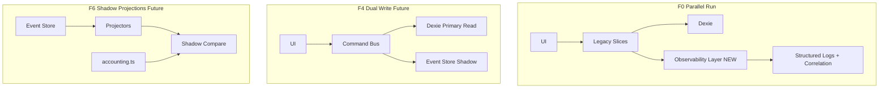

## Authority matrix during parallel-run

| Phase | Write authority | Read authority | Compare |
|-------|-----------------|----------------|---------|
| F0 | Dexie | Dexie + Zustand | Golden fixtures |
| F2 | Dexie (via bus) | Dexie + Zustand | Command audit log |
| F4 | Dexie | Dexie | Event count reconcile |
| F6 | Dexie | Dexie (UI) | Shadow projections nightly |
| F10 | Event store + Dexie | Projections (beta) | Balance parity |
| F11 | Event store | Projections | Reports parity |
| F8 | Event store | Projections | Sync round-trip |

## Divergence handling
| Divergence | Action |
|------------|--------|
| Golden fixture fail | Block phase promotion |
| Shadow projection mismatch | Alert + ticket; no user impact |
| Event count mismatch | Block F4 promotion |
| Report shadow mismatch | Block F11 promotion |

---

# 15. Golden Test Fixture Strategy

## Purpose
Establish accounting correctness harness before any architectural cutover.

## CURRENT
Manual testing; no golden fixture CI (W-005); triple balance paths (W-021)

## WEAKNESS
W-005, W-015, W-016, W-021, W-063, CONTRADICTION-01

## TARGET
§06.13 Testing Rules, SYSTEM-07 VG-01, VG-05

## PHASE
**F0 = primary deliverable**

## Fixture categories

| Category | ID | Covers | CURRENT source | Weakness |
|----------|-----|--------|----------------|----------|
| Manual voucher | GF-V-001..020 | Dr=Cr, multi-line, contra | voucherSlice | W-015 |
| Invoice post | GF-I-001..020 | Journal + stock + tax | addInvoice path | W-016, W-063 |
| Khata entry | GF-K-001..010 | Voucher only, no invoice | confirmKhataEntry | W-061 |
| Cancel/reversal | GF-C-001..010 | Period interactions | cancel paths | W-069, W-070 |
| Party/Account | GF-M-001..010 | Masters + postings | masters + vouchers | W-023, W-035 |
| Stock | GF-S-001..010 | Movements, negative policy | postInvoiceStock | W-077, W-081 |
| Reports | GF-R-001..015 | TB, ledger, P&L, stock | accounting.ts | W-166 |
| Sync | GF-Y-001..005 | Outbox enqueue shapes | syncSlice | W-047 |

## Fixture structure (design)

```
packages/fios-testing/
├── fixtures/
│   ├── vouchers/
│   ├── invoices/
│   ├── khata/
│   ├── masters/
│   └── expected/
│       ├── trial-balance/
│       ├── ledger/
│       └── stock/
├── rules/
│   └── BR-REFERENCE.md          # Links to SYSTEM-03 BR-01..38
├── harness/
│   └── GOLDEN_HARNESS_SPEC.md   # Input → execute → compare
└── parity/
    └── SHADOW_COMPARE_SPEC.md     # F6+ design
```

## Golden harness flow (design)

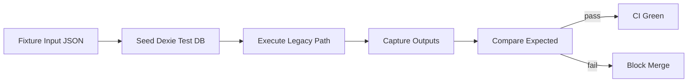

## Comparison rules
| Output | Tolerance | Source of truth F0 |
|--------|-----------|---------------------|
| Trial balance totals | ±0.01 | `accounting.ts` output |
| Voucher line count | Exact | Fixture spec |
| Stock qty | Exact | Stock movement sum |
| Invoice total | ±0.01 | Invoice + tax rules |

## F0 deliverables
1. 50+ fixture definitions (JSON design docs, not code)
2. BR-traceability matrix: fixture → business rule → weakness
3. `MIGRATION_GOLDEN_CI` flag spec
4. VG-01 acceptance: all F0 fixtures pass against CURRENT system

---

# 16. Migration Checkpoints

## Purpose
F0-specific gates aligned with SYSTEM-07 VG-01 and F0 exit criteria.

## PHASE
F0 exit = VG-01; enables F1 start

## F0 checkpoint list

| ID | Checkpoint | Validation method | Blocker if fail |
|----|------------|-------------------|-----------------|
| **CP-F0-01** | ADR-001..003 approved | Architecture review | F1 |
| **CP-F0-02** | Folder structure ADR published | Doc review | F1 |
| **CP-F0-03** | Command catalog v1 complete | Catalog review | F2 |
| **CP-F0-04** | Event catalog v1 complete | Catalog review | F3 |
| **CP-F0-05** | Event store schema reviewed | Data review | F4 |
| **CP-F0-06** | Aggregate definitions signed off | Domain review | F4 |
| **CP-F0-07** | Projection catalog + parity spec | Domain review | F6 |
| **CP-F0-08** | Repository interfaces defined | Platform review | F1 |
| **CP-F0-09** | Dependency rules in ESLint spec | Platform review | F1 |
| **CP-F0-10** | Feature flag registry live | Flag audit | F2 |
| **CP-F0-11** | Golden fixtures ≥50 defined | QA review | F0 |
| **CP-F0-12** | Golden harness green on CURRENT | CI | F0 |
| **CP-F0-13** | Silent catch audit complete | Error audit doc | F0 |
| **CP-F0-14** | Boot baseline captured | Metrics | F0 |
| **CP-F0-15** | Correlation ID design on invoice/voucher | Observability review | F0 |
| **CP-F0-16** | Safe openDB ADR approved | Data review | F4 |
| **CP-F0-17** | Parallel-run modes documented | Migration review | F4 |
| **CP-F0-18** | Rollback runbook F0 drafted | SRE review | F0 |
| **CP-F0-19** | Risk matrix accepted | Eng lead sign-off | F0 |
| **CP-F0-20** | Implementation order agreed | Sprint plan | F0 |

## VG-01 composite (SYSTEM-07)
**CP-F0-11 + CP-F0-12 + CP-F0-13** = VG-01 pass

---

# 17. Rollback Strategy

## Purpose
F0-specific rollback — design artifacts and flags only; zero data impact.

## CURRENT risk
W-059 destructive recovery; no migration rollback culture

## TARGET
§06.40 Recovery, SYSTEM-07.34

## PHASE
F0 rollback = instant; no user data touched

## F0 rollback procedures

| Trigger | Action | Time | Data impact |
|---------|--------|------|-------------|
| Golden CI false positive | Fix fixture or harness | Hours | None |
| Flag causes regression | `MIGRATION_*=false` | Minutes | None |
| Observability overhead | Disable correlation flag | Minutes | None |
| ADR rejected | Revise doc; no code revert needed | Days | None |
| Package stub breaks build | Remove empty package | Minutes | None |

## Rollback flow (F0)

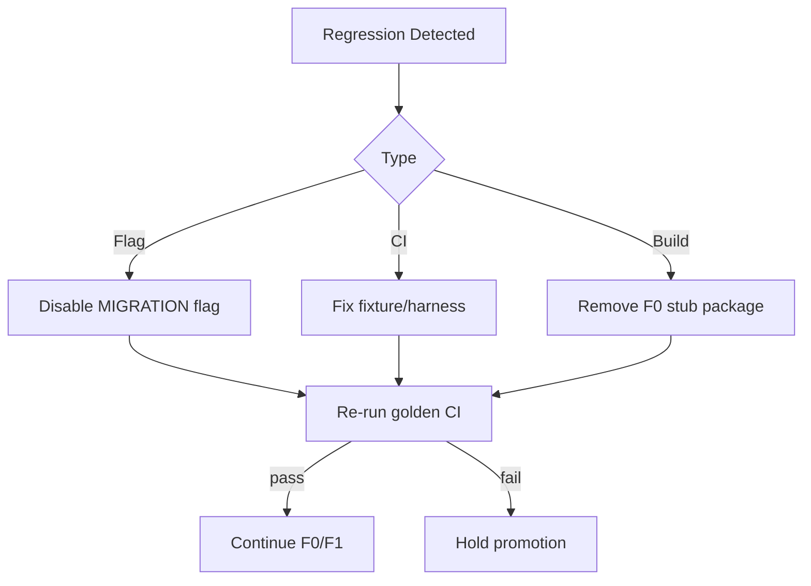

## F0 rollback invariants
1. No Dexie schema changes in F0
2. No write path changes in F0
3. Golden fixtures must pass before and after rollback
4. Lovable branch deployable throughout

---

# 18. Risk Matrix

## Purpose
F0-scoped risks with mitigation.

| ID | Risk | L | I | Mitigation | Weakness | Phase |
|----|------|---|---|------------|----------|-------|
| RF0-01 | F0 scope creep into F1/F2 code | H | H | Strict F0 checklist; no slice moves | R-M07 | F0 |
| RF0-02 | Golden fixtures wrong → false confidence | M | C | Domain owner sign-off; BR traceability | W-021 | F0 |
| RF0-03 | Over-engineering kernel packages | M | M | Interfaces only; no runtime F0 | AD-12 | F0 |
| RF0-04 | Flag proliferation | M | M | Central registry; deprecation policy | C-05 | F0 |
| RF0-05 | Silent catch audit incomplete | M | H | Checklist per financial path | W-017 | F0 |
| RF0-06 | Boot baseline noisy | L | L | Multiple runs; median capture | W-131 prep | F0 |
| RF0-07 | Team ignores ADRs | M | H | CP-F0-01 gate; review meeting | AD-08 | F0 |
| RF0-08 | Lovable merge conflict on stubs | M | M | Minimal F0 commits; docs-first | R-M08 | F0 |
| RF0-09 | Catalog/command schema churn | M | M | Version field; change control | W-044 prep | F0 |
| RF0-10 | Parallel-run doc not followed in F4 | M | C | CP-F0-17; eng lead review | R-M02 | F0→F4 |
| RF0-11 | Dependency lint too aggressive | L | M | Baseline snapshot first | W-034 | F1 |
| RF0-12 | Observability PII leak | L | H | Redaction spec in logging ADR | W-090 | F0 |
| RF0-13 | Fixture maintenance burden | M | M | Start with 50; grow per phase | W-005 | F0 |
| RF0-14 | Safe openDB ADR not implemented F4 | M | C | CP-F0-16 blocks F4 | W-059 | F0 |
| RF0-15 | Khata fixtures miss invoice divergence | M | H | GF-K + GF-I separate | W-061, C-15 | F0 |

---

# 19. Folder Structure

## Purpose
Canonical target tree for F0 design through F14. **F0 creates stubs and docs only.**

## CURRENT (SYSTEM-04) — known paths
```
src/store/index.ts, *Slice.ts
src/db/ (Dexie)
src/pages/, src/components/
src/utils/accounting.ts
erp_bot/, packages/backend/, serve.mjs
```

## TARGET package layout (full design)

```
My-Current-ERP/
├── docs/
│   ├── SYSTEM-*.md
│   ├── adr/
│   │   ├── ADR-001-repository-restructure.md
│   │   ├── ADR-002-dependency-inversion.md
│   │   └── ADR-003-safe-open-db.md
│   ├── catalogs/
│   │   ├── COMMAND_CATALOG_v1.md
│   │   ├── DOMAIN_EVENT_CATALOG_v1.md
│   │   ├── AGGREGATE_DEFINITIONS_v1.md
│   │   └── PROJECTION_CATALOG_v1.md
│   └── flags/
│       └── MIGRATION_FLAGS.md
├── packages/
│   ├── fios-kernel/                    # F0 stub
│   │   ├── README.md
│   │   └── contracts/                  # Interface specs (markdown/TS types F1)
│   │       ├── ICommandBus.md
│   │       ├── IEventBus.md
│   │       ├── IEventStore.md
│   │       └── IRepository.md
│   ├── fios-testing/                   # F0 stub
│   │   ├── fixtures/                   # JSON fixture files F0
│   │   ├── GOLDEN_HARNESS_SPEC.md
│   │   └── parity/
│   └── backend/                        # existing
├── src/
│   ├── platform/                       # F0 create
│   │   ├── flags/
│   │   │   └── registry.spec.md
│   │   ├── observability/
│   │   │   ├── correlation.spec.md
│   │   │   └── structured-errors.spec.md
│   │   └── migration/
│   │       └── PHASE_STATE.md
│   ├── domains/                        # F0 create (empty context dirs)
│   │   ├── ledger/README.md
│   │   ├── billing/README.md
│   │   ├── inventory/README.md
│   │   ├── masters/README.md
│   │   ├── sync/README.md
│   │   ├── reporting/README.md
│   │   └── nios/README.md
│   ├── legacy/                         # F1 — store moves here
│   │   └── store/                      # CURRENT location until F1
│   ├── store/                          # CURRENT — unchanged F0
│   ├── db/                             # CURRENT Dexie — unchanged F0
│   ├── pages/                          # CURRENT — unchanged F0
│   └── components/                     # CURRENT — unchanged F0
├── erp_bot/                            # existing
└── serve.mjs                           # existing
```

## Repository structure diagram

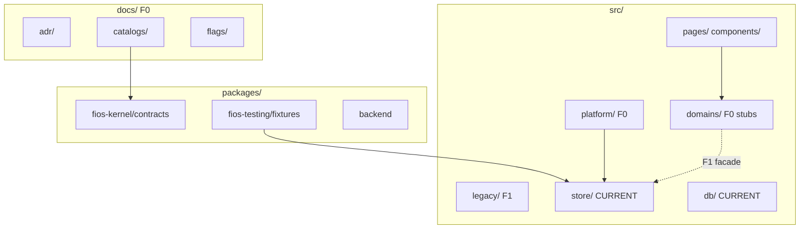

---

# 20. Exact Implementation Order

## Purpose
Sequenced F0 work items — design and scaffolding only, no legacy rewrites.

## Rule
Each step must complete before the next begins unless marked parallel.

## Week 1 — Governance & catalogs

| Step | Deliverable | CP | Weakness | TARGET |
|------|-------------|-----|----------|--------|
| 1 | ADR-001 Repository restructure | CP-F0-01 | W-034 | §06.65 |
| 2 | ADR-002 Dependency inversion | CP-F0-01 | W-034, AD-08 | §06.66 |
| 3 | ADR-003 Safe openDB policy | CP-F0-16 | W-059 | §06.30 |
| 4 | Create `docs/catalogs/` structure | CP-F0-02 | — | §06.5 |
| 5 | Aggregate definitions v1 doc | CP-F0-06 | W-001 | §06.5 |
| 6 | Domain event catalog v1 | CP-F0-04 | W-165 | §06.16 |
| 7 | Command catalog v1 | CP-F0-03 | W-001 | §06.11 |
| 8 | Projection catalog v1 + parity spec | CP-F0-07 | W-021 | §06.12 |

## Week 1–2 — Platform design (parallel after step 4)

| Step | Deliverable | CP | Weakness | TARGET |
|------|-------------|-----|----------|--------|
| 9 | `ICommandBus` contract spec | CP-F0-08 | W-001 | §06.11 |
| 10 | `IEventBus` contract spec | CP-F0-08 | W-041 | §06.14 |
| 11 | Event store schema doc | CP-F0-05 | W-056 | §06.13 |
| 12 | Repository interface specs | CP-F0-08 | W-033 | §06.69 |
| 13 | Feature flag registry doc | CP-F0-10 | C-05 | §06.74 |
| 14 | Parallel-run architecture doc | CP-F0-17 | W-021 | §07.14 |
| 15 | Domain boundary READMEs (7 contexts) | CP-F0-02 | W-033 | §06.4 |
| 16 | Module ownership / RACI | — | W-036 | §06.6 |

## Week 2 — Testing & observability

| Step | Deliverable | CP | Weakness | TARGET |
|------|-------------|-----|----------|--------|
| 17 | Golden fixture set (≥50 JSON) | CP-F0-11 | W-005 | Testing Rules |
| 18 | Golden harness spec | CP-F0-12 | W-015, W-016 | VG-01 |
| 19 | BR-traceability matrix | CP-F0-11 | W-015 | SYSTEM-03 |
| 20 | Silent catch audit document | CP-F0-13 | W-017 | §06.39 |
| 21 | Correlation ID spec (invoice/voucher) | CP-F0-15 | W-154 | §06.37 |
| 22 | Structured error spec | CP-F0-13 | W-005 | §06.39 |
| 23 | Boot baseline capture runbook | CP-F0-14 | W-131 | §06.72 |

## Week 2–3 — Scaffolding & gates

| Step | Deliverable | CP | Weakness | TARGET |
|------|-------------|-----|----------|--------|
| 24 | `packages/fios-kernel` stub + README | CP-F0-02 | AD-08 | §06.7 |
| 25 | `packages/fios-testing` stub + fixtures | CP-F0-11 | W-005 | VG-01 |
| 26 | `src/platform/` directory + specs | CP-F0-10 | W-154 | §06.36 |
| 27 | `src/domains/*` stub READMEs | CP-F0-02 | W-033 | §06.4 |
| 28 | ESLint boundary rule spec | CP-F0-09 | W-034 | §06.66 |
| 29 | Circular dep baseline snapshot | CP-F0-09 | W-034 | §06.66 |
| 30 | F0 rollback runbook | CP-F0-18 | W-059 | §06.40 |
| 31 | F0 risk matrix sign-off | CP-F0-19 | R-M07 | §07.36 |
| 32 | **VG-01 gate review** | CP-F0-20 | — | §07.33 |
| 33 | F1 kickoff packet | — | — | §07.9 |

## Implementation order diagram

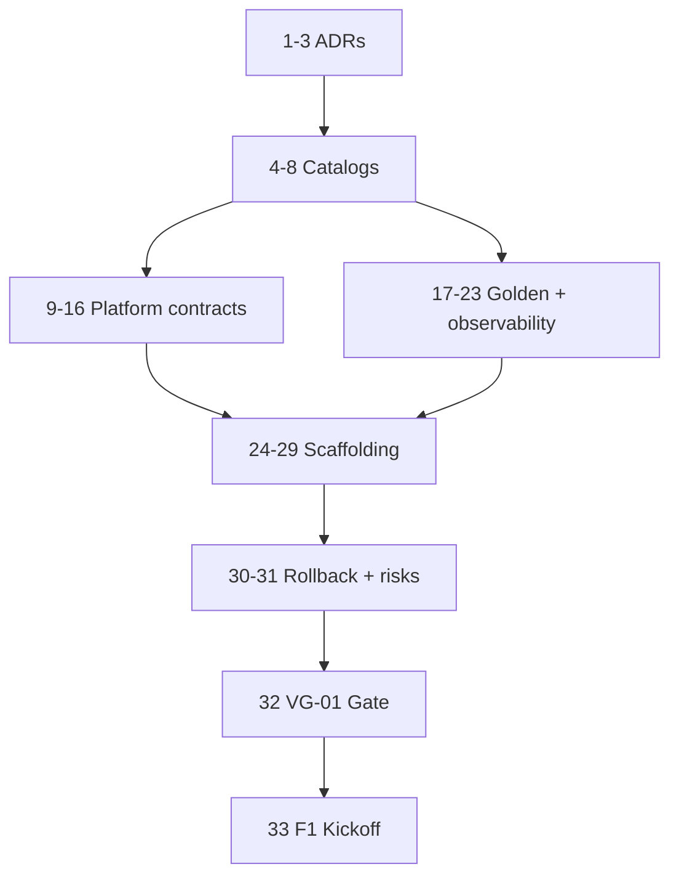

## F0 explicit non-goals
- ❌ Move `store/` to `legacy/`
- ❌ Implement command bus runtime
- ❌ Add `domainEvents` Dexie table
- ❌ Change `addInvoice` / `addVoucher` behavior
- ❌ Modify report calculations
- ❌ Deploy OIDC
- ❌ Change sync protocol
- ❌ Unify AI stacks

---

# Diagram Gallery

## Command Flow (F0 design → F2 implement)

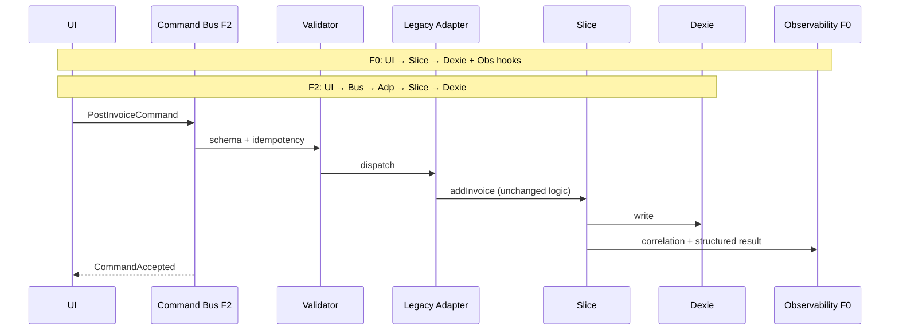

## Event Flow (F0 design → F3/F4 implement)

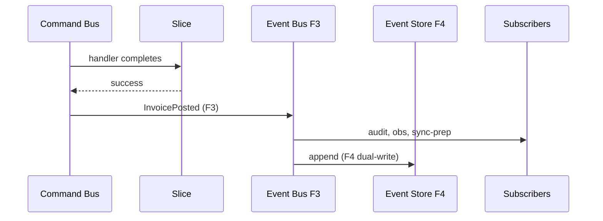

## Event Store (logical)

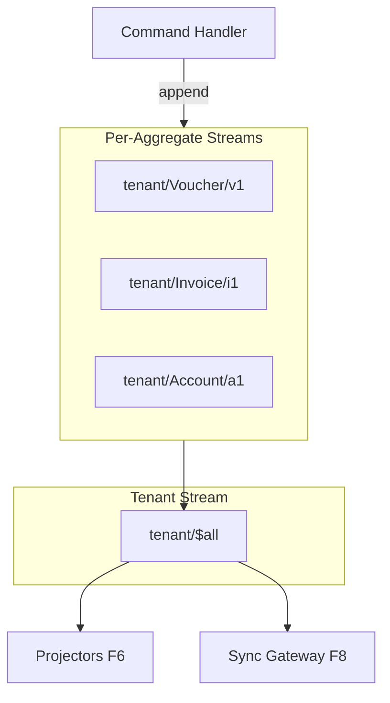

## Dependency Graph (F0 target)

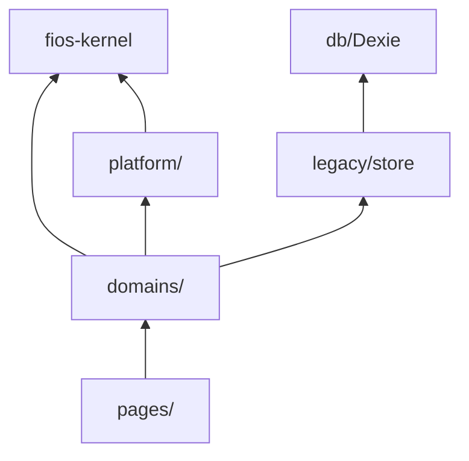

---

# F0 → F1 Handoff Packet

When VG-01 passes, F1 receives:

| Artifact | Location |
|----------|----------|
| Repository layout ADR | `docs/adr/ADR-001` |
| Dependency rules | `docs/adr/ADR-002` |
| Command catalog | `docs/catalogs/COMMAND_CATALOG_v1.md` |
| Event catalog | `docs/catalogs/DOMAIN_EVENT_CATALOG_v1.md` |
| Aggregate defs | `docs/catalogs/AGGREGATE_DEFINITIONS_v1.md` |
| Projection catalog | `docs/catalogs/PROJECTION_CATALOG_v1.md` |
| Kernel contracts | `packages/fios-kernel/contracts/` |
| Golden fixtures | `packages/fios-testing/fixtures/` |
| Flag registry | `docs/flags/MIGRATION_FLAGS.md` |
| Silent catch audit | `docs/audits/F0_SILENT_CATCH_AUDIT.md` |
| Boot baseline | `docs/benchmarks/F0_BOOT_BASELINE.md` |
| Parallel-run spec | `docs/migration/PARALLEL_RUN_MODES.md` |

## F1 first actions (preview — not F0 scope)
1. Extract ledger facade → `src/domains/ledger/`
2. Move store → `src/legacy/store/` with re-export shim
3. Enable ESLint boundary rules
4. Zero new circular imports (VG-02)

---

# Traceability Summary

| F0 deliverable | CURRENT | WEAKNESS | TARGET | PHASE |
|----------------|---------|----------|--------|-------|
| Repository ADR | god store | W-001, W-034 | §06.65 | F0→F1 |
| Command catalog | slice methods | W-001, W-014 | §06.11 | F0→F2 |
| Event catalog | CustomEvents | W-041, W-165 | §06.16 | F0→F3 |
| Event store schema | Dexie only | W-056, W-059 | §06.13 | F0→F4 |
| Projection catalog | accounting.ts | W-021, W-166 | §06.12 | F0→F6 |
| Golden fixtures | manual QA | W-005, W-015 | Testing Rules | F0 |
| Feature flags | VITE_NIOS_* | C-05 | §06.74 | F0→all |
| Safe openDB ADR | delete on timeout | W-059 | §06.30 | F0→F4 |
| Correlation IDs | none | W-154 | §06.37 | F0 |
| Structured errors | silent catch | W-005, W-017 | §06.39 | F0 |
| Domain boundaries | shared state | W-033 | §06.4 | F0→F1 |
| Dependency plan | circular imports | W-034 | §06.66 | F0→F1 |

---

*End of SYSTEM-08 F0 Implementation Playbook.*
