# SYSTEM-09: Canonical Repository Skeleton & Module Specification

**Project:** Sutra FIOS  
**Session:** SYSTEM-09  
**Prerequisites:** SYSTEM-01 through SYSTEM-08  
**Nature:** Canonical repository/module specification — no code, no repo scans, no legacy modification  
**Generated:** 2026-07-10

---

## Traceability Legend

| Tag | Source |
|-----|--------|
| **CURRENT** | SYSTEM-04 runtime implementation |
| **WEAKNESS** | SYSTEM-05 IDs (W-###, AD-###, C-###) |
| **TARGET** | SYSTEM-06 sections (§06.###) |
| **PHASE** | SYSTEM-07 migration phase (F0–F14) |
| **OWNER** | SYSTEM-08 F0/F1 ownership |

**Specification invariant:** Legacy code remains in place until its PHASE; new packages start as contracts/stubs in F0–F1.

---

## Package Specification Template

Every package below includes:

| Field | Meaning |
|-------|---------|
| **Purpose** | Why the package exists |
| **Responsibilities** | What it owns |
| **Public interfaces** | Consumable by other packages |
| **Internal interfaces** | Private to package |
| **Allowed dependencies** | May import |
| **Forbidden dependencies** | Must never import |
| **Runtime ownership** | Where it executes |
| **Persistence ownership** | Data it owns |
| **Event ownership** | Events published/consumed |
| **Security ownership** | AuthZ/authN scope |
| **Testing ownership** | Test package location |
| **Migration phase** | When implemented |
| **Weaknesses eliminated** | SYSTEM-05 mapping |

---

# 1. Complete Folder Hierarchy

## Canonical repository tree

```
sutra-fios/                                    # Monorepo root (CURRENT: My-Current-ERP)
│
├── docs/                                      # Knowledge base + ADRs [EXISTING]
│   ├── SYSTEM-*.md
│   ├── adr/
│   ├── catalogs/
│   ├── flags/
│   ├── audits/
│   └── benchmarks/
│
├── packages/                                  # Shared npm/workspace packages
│   ├── fios-kernel/                           # Kernel contracts [F0 stub]
│   ├── fios-command-bus/                      # Command bus runtime [F2]
│   ├── fios-event-bus/                        # Domain event bus [F3]
│   ├── fios-event-store/                      # Event store client [F4]
│   ├── fios-projections/                      # Projection engine [F6]
│   ├── fios-sync/                             # Sync client protocol [F8]
│   ├── fios-identity/                         # Auth client SDK [F7]
│   ├── fios-plugin-sdk/                       # Plugin manifest + sandbox [F14]
│   ├── fios-testing/                            # Golden fixtures + harness [F0]
│   ├── fios-shared/                             # DTOs, types, utils [F0]
│   └── backend/                                 # Cloud services monorepo [EXISTING F4+]
│       ├── api-gateway/                       # Edge gateway [F7]
│       ├── command-service/                   # Cloud command handler [F4]
│       ├── query-service/                     # Cloud query API [F6]
│       ├── sync-service/                      # Sync gateway [F8]
│       ├── identity-service/                  # OIDC bridge [F7]
│       ├── projection-worker/                 # Cloud projectors [F6]
│       ├── integration-service/               # CBMS/outbox [F10]
│       ├── notification-service/              # Notifications [F3+]
│       ├── job-worker/                        # Background jobs [F4+]
│       └── nios-service/                      # NIOS HTTP gateway [F12]
│
├── services/                                  # Non-Node runtimes
│   └── erp_bot/                               # Python NIOS/AI [EXISTING → F12]
│       ├── nios/
│       ├── orbix/
│       ├── khata/
│       └── knowledge/
│
├── src/                                       # Primary SPA shell [EXISTING]
│   ├── app/                                   # Boot, layout, providers
│   ├── platform/                              # Cross-cutting client infra [F0]
│   │   ├── flags/
│   │   ├── observability/
│   │   └── migration/
│   ├── domains/                               # Bounded context facades [F1+]
│   │   ├── accounting/
│   │   ├── voucher/
│   │   ├── invoice/
│   │   ├── inventory/
│   │   ├── party/
│   │   ├── company/
│   │   ├── fiscal-year/
│   │   ├── numbering/
│   │   ├── tax/
│   │   ├── reporting/
│   │   ├── audit/
│   │   ├── notification/
│   │   ├── document/
│   │   ├── sync/
│   │   └── nios/
│   ├── legacy/                                # Strangler adapters [F1]
│   │   └── store/                             # CURRENT store/ relocated F1
│   ├── plugins/                               # Built-in plugins [F14]
│   │   ├── core-erp/
│   │   ├── nepal-tax/
│   │   └── reports/
│   ├── db/                                    # Dexie schema [CURRENT → F4 adapter]
│   ├── pages/                                 # Route pages [CURRENT → F14 plugins]
│   ├── components/                            # Shared UI [CURRENT]
│   └── utils/                                 # Legacy utils [CURRENT → deprecate]
│
├── apps/                                      # Deployable app shells [F14+]
│   ├── web/                                   # Vite SPA entry [CURRENT src/]
│   ├── desktop/                               # Tauri shell [F14]
│   └── mobile/                                # Capacitor shell [F14]
│
├── infra/                                     # Deployment [F7+]
│   ├── docker/
│   ├── k8s/
│   └── terraform/
│
├── serve.mjs                                  # Dev edge proxy [CURRENT → F7 gateway]
└── package.json                               # Workspace root
```

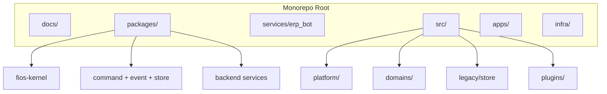

---

# 2. Package Boundaries

| Boundary | Packages inside | May talk to | Must not leak into |
|----------|-----------------|-------------|-------------------|
| **Kernel** | fios-kernel | All via public API | Legacy internals |
| **Platform client** | fios-command-bus, event-bus, event-store, sync, identity, flags | Kernel, domains | pages directly |
| **Domain client** | src/domains/* | Platform, kernel, legacy adapters | Other domains' internals |
| **Legacy** | src/legacy/store, src/db | Dexie only | New domain logic |
| **Cloud** | packages/backend/* | Kernel contracts, PG, Redis | Client Dexie |
| **AI** | erp_bot, nios-service | Kernel proposals API | Direct ERP writes |
| **Plugins** | fios-plugin-sdk, src/plugins/* | Kernel SDK only | Cross-plugin imports |
| **Testing** | fios-testing | All (test only) | Production bundles |

## CURRENT → TARGET boundary shift

| CURRENT | Weakness | TARGET boundary | Phase |
|---------|----------|-----------------|-------|
| Monolithic `src/store/` | W-001 | `domains/` + `legacy/store/` | F1 |
| Dexie calls in pages | W-033 | `domains/` facades only | F1–F5 |
| erp_bot direct HTTP | W-091 | `api-gateway` + `nios-service` | F7, F12 |
| `accounting.ts` in utils | W-021 | `fios-projections` + `domains/reporting` | F6, F11 |

---

# 3. Domain Modules (`src/domains/`)

Domain modules are **client-side bounded context facades**. They expose use-case APIs to UI; they do not contain React components.

## Domain module template

Each domain follows:

```
src/domains/{name}/
├── README.md              # Context boundary doc
├── index.ts               # Public facade exports only
├── commands.ts            # Command builders (F2+)
├── queries.ts             # Query builders (F5+)
├── types.ts               # Domain DTOs
├── adapters/
│   └── legacy.ts          # Delegates to legacy/store (F1)
└── __tests__/             # Domain contract tests
```

| Domain dir | BC ID | CURRENT slice/module | Phase | Owner |
|------------|-------|----------------------|-------|-------|
| `accounting/` | BC-LED | voucherSlice, accounting.ts | F1/F10 | Domain — Accounting |
| `voucher/` | BC-LED | voucherSlice | F1/F2 | Domain — Accounting |
| `invoice/` | BC-BIL | invoiceSlice, SalesInvoiceForm path | F1/F2 | Domain — Billing |
| `inventory/` | BC-INV | postInvoiceStock, items | F1/F9 | Domain — Inventory |
| `party/` | BC-MST | partySlice | F1 | Domain — Masters |
| `company/` | BC-MST | company config in store | F1 | Domain — Masters |
| `fiscal-year/` | BC-MST | FY, periodLocks | F1/F10 | Domain — Masters |
| `numbering/` | BC-DOC | generateSerialNumber*, voucherSeriesConfig | F1/F10 | Domain — Documents |
| `tax/` | BC-TAX | tax lines, CBMS hooks | F1/F10 | Domain — Tax |
| `reporting/` | BC-RPT | report pages logic | F1/F11 | Domain — Reporting |
| `audit/` | BC-RPT | scattered logs | F3 | Platform + Domain |
| `notification/` | BC-INT | toasts, Layout | F3 | Platform |
| `document/` | BC-DOC | attachments, prints | F1/F14 | Domain — Documents |
| `sync/` | BC-SYN | syncSlice, syncEngine | F1/F8 | Platform |
| `nios/` | BC-NIOS | AI panels, confirmKhataEntry | F1/F13 | AI Platform |

---

# 4. Kernel Modules (`packages/fios-kernel`)

## Purpose
Dependency-inverted contract layer — zero runtime, zero I/O. All packages depend inward on kernel; kernel depends on nothing in the monorepo.

## Responsibilities
- Command/event/aggregate type contracts
- Repository interfaces
- Plugin manifest schema
- Error code registry
- Correlation/causation ID types

## Public interfaces
| Interface | Consumers |
|-----------|-----------|
| `ICommand`, `ICommandBus`, `ICommandHandler` | command-bus, domains |
| `IEvent`, `IEventBus`, `IEventHandler` | event-bus, projections |
| `IEventStore`, `IStreamId` | event-store, sync |
| `IRepository<T>`, `IUnitOfWork` | domains, legacy adapters |
| `IProjection`, `IProjectionReader` | projections, reporting |
| `IPluginManifest`, `IPluginContext` | plugin-sdk |
| `ITenantContext`, `IUserContext` | identity, all domains |
| `IFiosError`, `ErrorCode` | all |

## Internal interfaces
None — kernel has no internals.

## Allowed dependencies
- TypeScript standard lib only
- Optional: `zod` for schema types (dev contract validation)

## Forbidden dependencies
- React, Dexie, axios, Zustand
- `src/`, `legacy/`, `erp_bot`
- Any concrete implementation package

## Runtime ownership
Build-time + type-check only; no runtime bundle (tree-shaken interfaces).

## Persistence ownership
None.

## Event ownership
Event/command **type definitions** only; no publish.

## Security ownership
`ITenantContext`, `IAuthorizationPolicy` interface shapes.

## Testing ownership
`packages/fios-kernel/__tests__/contract/` — schema conformance.

## Migration phase
**F0** (stub) → **F1** (types stable) → semver locked at **F2**

## Weaknesses eliminated
W-034, W-033, AD-08, TD-25 — enables dependency inversion.

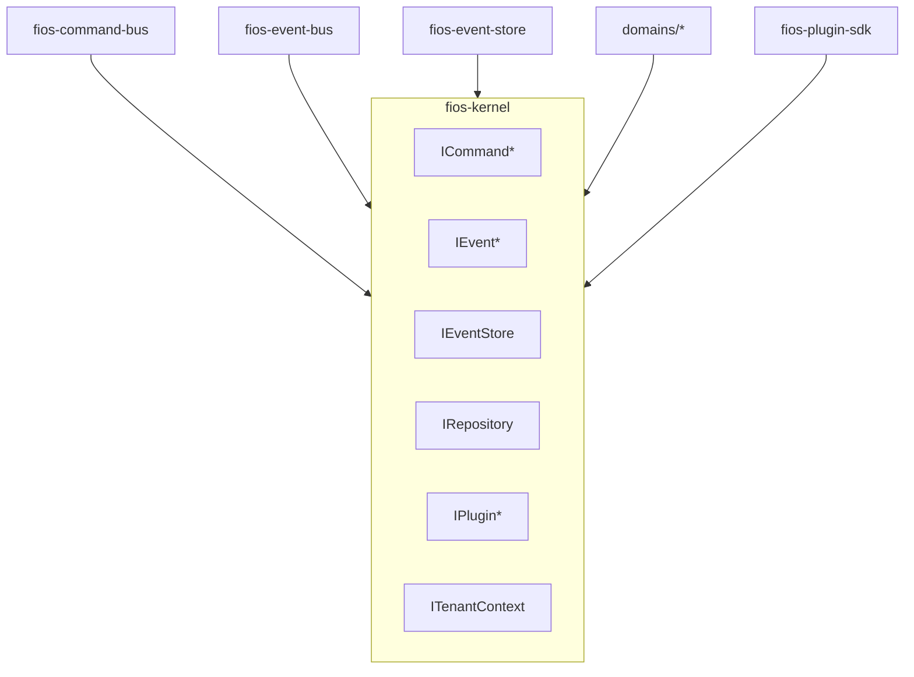

---

# 5. Platform Modules (`src/platform/` + platform packages)

## `src/platform/` (client cross-cutting)

| Subdir | Purpose | Phase | CURRENT |
|--------|---------|-------|---------|
| `flags/` | `MIGRATION_*` registry | F0 | `VITE_NIOS_PLATFORM_V3` (C-05) |
| `observability/` | Correlation, structured errors | F0 | silent catch (W-017) |
| `migration/` | Phase state, parallel-run mode | F0 | none |

## Platform package summary

| Package | See section | Phase |
|---------|-------------|-------|
| fios-command-bus | §10 | F2 |
| fios-event-bus | §11 | F3 |
| fios-event-store | §9 | F4 |
| fios-projections | §12 | F6 |
| fios-sync | §13 | F8 |
| fios-identity | §14 | F7 |
| fios-shared | §7 | F0 |
| fios-testing | §7 | F0 |

**Platform owner:** Platform team (SYSTEM-08).

---

# 6. Infrastructure Modules (`infra/` + `packages/backend/`)

## Purpose
Cloud-native deployment, gateways, workers, managed persistence.

## Responsibilities
- Container images, K8s manifests, IaC
- Managed PG event store, Redis, object storage
- API gateway, mTLS internal mesh
- Observability collectors

## Public interfaces
- HTTP/gRPC external APIs via api-gateway
- Internal service discovery

## Internal interfaces
- Service-to-service admin APIs
- Migration job runners

## Allowed dependencies
- Kernel types (shared npm)
- Cloud SDKs, OTEL

## Forbidden dependencies
- Client `src/`, Dexie, React

## Runtime ownership
SRE / Platform — K8s clusters per region.

## Persistence ownership
Cloud PG (event store, projections, identity), Redis, R2/S3, vector DB.

## Event ownership
Cloud event bus fan-out; integration outbox.

## Security ownership
WAF, mTLS, secrets manager, JWT validation at gateway.

## Testing ownership
`packages/backend/*/integration/`, contract tests against kernel schemas.

## Migration phase
**F4** (event store cloud) → **F7** (gateway) → **F8** (sync service)

## Weaknesses eliminated
W-180, W-181, W-091, W-098, AD-10, AD-11, C-09

---

# 7. Shared Libraries (`packages/fios-shared`)

## Purpose
DTOs, enums, money/date types, validation schemas shared across client, backend, and tests without importing domain logic.

## Responsibilities
- `Money`, `FiscalDate`, `VoucherLine`, `InvoiceLine` DTOs
- Command/event payload schemas (zod)
- Nepal tax enum constants
- Error code constants

## Public interfaces
- Exported types and schemas only

## Internal interfaces
- Schema builders, format helpers

## Allowed dependencies
- fios-kernel (types only)
- zod, date-fns (or equivalent)

## Forbidden dependencies
- Dexie, React, domain facades, legacy store

## Runtime ownership
Shared — tree-shaken per consumer.

## Persistence ownership
None.

## Event ownership
Payload shape definitions only.

## Security ownership
PII field markers on DTOs.

## Testing ownership
`packages/fios-shared/__tests__/schemas/`

## Migration phase
**F0** (core DTOs) → grows per phase with command catalog

## Weaknesses eliminated
W-121 (weak validation), W-063 (typed tax amounts)

---

# 8. Plugin SDK Structure (`packages/fios-plugin-sdk`)

## Purpose
Microkernel extension mechanism — register commands, projections, routes, agent tools.

## Responsibilities
- Plugin manifest validation
- `registerPlugin(context)` lifecycle
- Capability token declarations
- Semver compatibility check with kernel

## Public interfaces
| API | Purpose |
|-----|---------|
| `definePlugin(manifest)` | Plugin entry |
| `registerCommand(handler)` | Extend command bus |
| `registerProjection(projector)` | Extend read models |
| `registerRoute(route)` | Extend UI shell |
| `registerAgentTool(tool)` | Extend NIOS |
| `registerReport(report)` | Extend reporting |

## Internal interfaces
- Sandbox loader
- Manifest signature verifier

## Allowed dependencies
- fios-kernel, fios-shared

## Forbidden dependencies
- legacy/store, Dexie direct, other plugins

## Runtime ownership
Client shell + optional server plugin host (F14).

## Persistence ownership
Plugin config in manifest; data via kernel APIs only.

## Event ownership
Plugins publish via event bus only.

## Security ownership
Capability tokens; sandbox execution.

## Testing ownership
`packages/fios-plugin-sdk/__tests__/sandbox/`

## Migration phase
**F14** (design in F0 catalogs)

## Weaknesses eliminated
W-172, AD-12, AD-13, TD-04, C-07, C-08

## Plugin SDK folder structure

```
packages/fios-plugin-sdk/
├── manifest.schema.ts
├── lifecycle/
│   ├── load.ts
│   ├── activate.ts
│   └── deactivate.ts
├── sandbox/
├── register/
│   ├── commands.ts
│   ├── projections.ts
│   ├── routes.ts
│   └── tools.ts
└── __tests__/
```

---

# 9. Event Store Package (`packages/fios-event-store`)

## Purpose
Append-only event persistence — local (Dexie/SQLite) and cloud (PG) adapters.

## Responsibilities
- Stream append with optimistic concurrency
- Stream read / replay
- Snapshot read/write
- Migration backfill adapter

## Public interfaces
| API | Description |
|-----|-------------|
| `IEventStore.append(stream, events, expectedVersion)` | Atomic append |
| `IEventStore.readStream(stream, from)` | Replay |
| `IEventStore.readAll(tenantId, from)` | Tenant fan-out |
| `ISnapshotStore` | Aggregate snapshots |

## Internal interfaces
- `DexieEventStoreAdapter` (F4)
- `SqliteEventStoreAdapter` (desktop F14)
- `PgEventStoreAdapter` (cloud F4)
- `DualWriteDecorator` (F4)

## Allowed dependencies
- fios-kernel, fios-shared, Dexie (local adapter only)

## Forbidden dependencies
- React, pages, Zustand, domain facades

## Runtime ownership
Client (local adapter) + projection-worker/command-service (cloud).

## Persistence ownership
**Authoritative financial truth** — `domainEvents` table (TARGET SSOT §06.68).

## Event ownership
**Owns storage** of all domain events; does not define business events.

## Security ownership
Tenant stream isolation; encrypt at rest.

## Testing ownership
`packages/fios-event-store/__tests__/append/, replay/`

## Migration phase
**F4** (design F0 §SYSTEM-08)

## Weaknesses eliminated
W-021, W-056, W-059, C-12, F-DB-01

---

# 10. Command Bus Package (`packages/fios-command-bus`)

## Purpose
Single ERP mutation pipeline — validate, authorize, route, idempotency, audit.

## Responsibilities
- Command ingress from UI, API, scheduler, AI gate
- Schema validation
- Idempotency guard (`commandId`)
- Handler routing
- Post-success hook → event bus (F3)

## Public interfaces
| API | Description |
|-----|-------------|
| `dispatch(command): CommandResult` | Sync dispatch |
| `registerHandler(type, handler)` | Handler registration |
| `onResult(callback)` | Observability |

## Internal interfaces
- `LegacySliceAdapter` (F2 — wraps addVoucher, addInvoice)
- `IdempotencyStore`
- `CommandAuditLog`

## Allowed dependencies
- fios-kernel, fios-shared, fios-event-bus (post-hook F3)
- fios-identity (claims F7)

## Forbidden dependencies
- pages, React components, Dexie (except via handlers/adapters)

## Runtime ownership
Client command bus (F2); cloud command-service mirrors for API (F4).

## Persistence ownership
Idempotency keys, command audit log (local until F4 events).

## Event ownership
Publishes `CommandAccepted`, `CommandRejected`.

## Security ownership
Pre-handler AuthZ hook; tenant from `ITenantContext` not payload (W-092).

## Testing ownership
`packages/fios-command-bus/__tests__/routing/, idempotency/`

## Migration phase
**F2** implement; **F0** contract only

## Weaknesses eliminated
W-001, W-014, W-106 (prep), W-149, W-015 (routing to validator)

---

# 11. Event Bus Package (`packages/fios-event-bus`)

## Purpose
Typed in-process (and future cloud) pub/sub replacing CustomEvents.

## Responsibilities
- Topic registry
- At-least-once dispatch
- DLQ on handler failure
- Subscriber lifecycle

## Public interfaces
| API | Description |
|-----|-------------|
| `publish(event)` | Emit domain event |
| `subscribe(type, handler)` | Register handler |
| `unsubscribe(id)` | Cleanup |

## Internal interfaces
- `DeadLetterQueue`
- `CustomEventAdapter` (F3 transition)
- `CloudBridge` (F8)

## Allowed dependencies
- fios-kernel, fios-shared

## Forbidden dependencies
- Dexie, legacy store, React

## Runtime ownership
Client (F3); cloud Kafka/NATS bridge (F8+).

## Persistence ownership
DLQ local table; optional cloud DLQ.

## Event ownership
**Transports** events; does not define payloads.

## Security ownership
Tenant-scoped subscription filters.

## Testing ownership
`packages/fios-event-bus/__tests__/delivery/, dlq/`

## Migration phase
**F3**

## Weaknesses eliminated
W-017, W-041, W-161, W-165, W-160

---

# 12. Projection Engine Package (`packages/fios-projections`)

## Purpose
Consume events → materialized read models for CQRS queries.

## Responsibilities
- Projector registry
- Incremental projection updates
- Full rebuild from event store
- Shadow parity comparison (F6)
- Projection lag metrics

## Public interfaces
| API | Description |
|-----|-------------|
| `IProjectionReader.getTrialBalance(q)` | Query API |
| `IProjectionReader.getLedgerStatement(q)` | Query API |
| `registerProjector(projector)` | Extension |
| `rebuild(projectionId, from)` | Admin |

## Internal interfaces
- Per-projection engines (TrialBalance, Ledger, Stock, Party, Dashboard)
- `ShadowCompareRunner`
- `ProjectionCheckpointStore`

## Allowed dependencies
- fios-kernel, fios-shared, fios-event-store, fios-event-bus

## Forbidden dependencies
- legacy store writes, command bus, React

## Runtime ownership
Client local projectors (F6); `projection-worker` cloud (F6).

## Persistence ownership
Projection tables — **read-only SSOT** for balances (§06.68).

## Event ownership
**Consumes** all financial events; publishes `ProjectionUpdated` (internal).

## Security ownership
Read AuthZ per tenant/company.

## Testing ownership
`packages/fios-projections/__tests__/parity/` + fios-testing goldens

## Migration phase
**F6** (shadow) → **F11** (authoritative reads)

## Weaknesses eliminated
W-021, W-166–W-170, CONTRADICTION-01/02, W-131 (with F11)

---

# 13. Sync Engine Package (`packages/fios-sync`)

## Purpose
Deterministic multi-device replication via event envelopes.

## Responsibilities
- Local sync outbox (event envelopes)
- Push/pull protocol client
- Vector clock management
- Conflict detection surfacing
- Idle pull scheduler

## Public interfaces
| API | Description |
|-----|-------------|
| `SyncClient.push()` | Push pending |
| `SyncClient.pull()` | Pull server events |
| `SyncClient.getConflicts()` | Conflict inbox |
| `resolveConflict(resolution)` | Apply resolution |

## Internal interfaces
- `EntityOutboxAdapter` (F8 transition from CURRENT syncOutbox)
- `VectorClockStore`
- `EnvelopeSerializer`

## Allowed dependencies
- fios-kernel, fios-event-store, fios-identity, fios-shared

## Forbidden dependencies
- Zustand, pages, accounting.ts

## Runtime ownership
Client `domains/sync` + `packages/backend/sync-service`.

## Persistence ownership
`syncCursors`, local envelope outbox; cloud tenant stream.

## Event ownership
Publishes `SyncBatchApplied`, `ConflictDetected`, `ConflictResolved`.

## Security ownership
JWT on every sync call (W-039); device registration.

## Testing ownership
`packages/fios-sync/__tests__/multi-device/`

## Migration phase
**F8** (requires F4, F7)

## Weaknesses eliminated
W-039–W-054, F-SYNC-*, C-12

---

# 14. Identity/Auth Package (`packages/fios-identity`)

## Purpose
Unified OIDC client SDK — JWT acquisition, refresh, claims propagation.

## Responsibilities
- OIDC login/logout/refresh
- Secure token storage
- `ITenantContext` population
- Device registration for sync

## Public interfaces
| API | Description |
|-----|-------------|
| `auth.login()` | OIDC flow |
| `auth.getAccessToken()` | JWT for API/sync |
| `auth.getContext(): ITenantContext` | Claims |
| `auth.registerDevice()` | Sync device ID |

## Internal interfaces
- `LegacySessionAdapter` (F7 transition from sessionStorage)
- `TokenRefreshScheduler`

## Allowed dependencies
- fios-kernel, fios-shared

## Forbidden dependencies
- Dexie user table (except import adapter), legacy store

## Runtime ownership
Client + `packages/backend/identity-service`.

## Persistence ownership
Refresh tokens (secure storage); identity service owns user directory.

## Event ownership
`UserLoggedIn`, `DeviceRegistered` (F7).

## Security ownership
**Primary** — MFA, lockout, no default admin (W-084).

## Testing ownership
`packages/fios-identity/__tests__/oidc/`

## Migration phase
**F7**

## Weaknesses eliminated
W-039, W-084–W-090, W-092, C-03

---

# 15. AI/NIOS Package (`services/erp_bot/` + `packages/backend/nios-service` + `src/domains/nios`)

## Purpose
Unified intelligence platform — conversation, agents, tools; **propose only** to ERP.

## Responsibilities
- Conversation API
- Agent runtime orchestration
- Tool registry (read-only ERP tools F12; proposal tools F13)
- LLM gateway client
- Model routing

## Public interfaces
| API | Description |
|-----|-------------|
| `POST /nios/v1/chat` | Conversation |
| `POST /nios/v1/proposals/{id}/confirm` | User confirm |
| `AgentToolRegistry` | Tool extension |

## Internal interfaces
- Legacy adapters: SUTRA, Falcon, e-Khata, Orbix (F12 strangler)
- Planner, verifier pipelines
- Episodic memory store

## Allowed dependencies
- fios-kernel (proposal commands), fios-identity
- Query API read-only (F6)

## Forbidden dependencies
- Command bus direct write, Dexie, legacy store mutations

## Runtime ownership
AI Platform — Python erp_bot + nios-service containers.

## Persistence ownership
Conversation store, agent memory, prompt caches.

## Event ownership
`AIOperationProposed`, `ApprovalGranted` (downstream).

## Security ownership
AI safety layer (W-106); rate limits; PII filter.

## Testing ownership
`services/erp_bot/tests/`, `src/domains/nios/__tests__/boundary/`

## Migration phase
**F12** platform → **F13** command gate

## Weaknesses eliminated
W-103–W-115, W-106, W-107, AD-01, AD-02, C-05, C-13

---

# 16. Knowledge Package (`services/erp_bot/knowledge/` + cloud knowledge workers)

## Purpose
Tenant document ingestion, embedding, RAG retrieval.

## Responsibilities
- Authenticated ingest pipeline
- Object storage + vector index
- Horizontal ingest workers
- RAG retrieval API

## Public interfaces
| API | Description |
|-----|-------------|
| `POST /knowledge/v1/ingest` | Upload |
| `POST /knowledge/v1/retrieve` | RAG query |

## Internal interfaces
- Chunker, embedder, hybrid retriever
- Chroma/vector DB adapter

## Allowed dependencies
- fios-identity, object storage SDK

## Forbidden dependencies
- ERP command bus, Dexie

## Runtime ownership
AI Platform + job-worker.

## Persistence ownership
Object store, vector DB, metadata PG.

## Event ownership
`DocumentIngested`, `IndexUpdated`.

## Security ownership
Tenant-scoped collections (W-123); upload caps (W-100).

## Testing ownership
`services/erp_bot/knowledge/tests/`

## Migration phase
**F12**

## Weaknesses eliminated
W-123–W-130, W-137, R-01, R-14

---

# 17. Reporting Package (`src/domains/reporting/` + `fios-projections` + report plugins)

## Purpose
Financial and operational reports from projections — never from denorm or RAM scan.

## Responsibilities
- Report query orchestration
- Export formatting (PDF, Excel)
- Report plugin slot

## Public interfaces
| API | Description |
|-----|-------------|
| `reporting.getTrialBalance(filters)` | Query |
| `reporting.getProfitAndLoss(period)` | Query |
| `registerReport(plugin)` | F14 |

## Internal interfaces
- Projection reader clients
- Legacy `accounting.ts` shadow adapter (F6 only)

## Allowed dependencies
- fios-projections, fios-shared, fios-kernel

## Forbidden dependencies
- legacy store writes, Dexie full table scan

## Runtime ownership
Client UI orchestration + query-service cloud.

## Persistence ownership
None — reads projections only.

## Event ownership
Consumes `ProjectionUpdated`.

## Security ownership
Report-level AuthZ.

## Testing ownership
`fios-testing` golden reports GF-R-*

## Migration phase
**F6** shadow → **F11** cutover

## Weaknesses eliminated
W-131, W-166–W-170, W-167

---

# 18. Inventory Package (`src/domains/inventory/`)

## Purpose
Stock movement ledger, valuation policy, stock queries.

## Responsibilities
- `RecordStockMovement` commands
- Valuation plugin slot (FIFO/WAC)
- Negative stock policy enforcement

## Public interfaces
| API | Phase |
|-----|-------|
| `inventory.recordMovement(cmd)` | F2 |
| `inventory.getStockLedger(q)` | F6 |

## Internal interfaces
- `LegacyStockAdapter` → postInvoiceStock (F1)

## Allowed dependencies
- fios-kernel, fios-command-bus, fios-shared, legacy adapter

## Forbidden dependencies
- invoice domain internals, pages

## Runtime ownership
Domain — Inventory team.

## Persistence ownership
Stock events via event store (F4); Dexie mirror until F9 cutover.

## Event ownership
**Publishes** `StockMoved`, `StockAdjusted`.

## Security ownership
Warehouse/branch ABAC.

## Testing ownership
`fios-testing` GF-S-*

## Migration phase
**F1** facade → **F9** engine → **F10** invoice saga integration

## Weaknesses eliminated
W-077–W-083, F-SYNC-09

---

# 19. Accounting Package (`src/domains/accounting/` + `src/domains/voucher/`)

## Purpose
Ledger posting, double-entry validation, COA — **voucher domain lives under accounting BC**.

## Responsibilities
- Post/cancel/reverse vouchers
- Double-entry validation (single validator)
- COA resolution from config (not hardcoded IDs)
- Balance queries via projections

## Public interfaces
| API | Phase |
|-----|-------|
| `voucher.post(cmd)` | F2 |
| `accounting.getTrialBalance(q)` | F6 |

## Internal interfaces
- `LegacyVoucherAdapter` → addVoucher
- `PostingPolicy`, `DoubleEntryValidator`

## Allowed dependencies
- fios-kernel, command-bus, projections, numbering, fiscal-year

## Forbidden dependencies
- invoice slice direct, pages, denorm balance writes (F10+)

## Runtime ownership
Domain — Accounting team.

## Persistence ownership
Voucher events; projection balances.

## Event ownership
**Publishes** `VoucherPosted`, `VoucherCancelled`, `VoucherReversed`.

## Security ownership
Period lock policy; amount thresholds.

## Testing ownership
GF-V-*, GF-R-* parity

## Migration phase
**F1** → **F2** → **F10**

## Weaknesses eliminated
W-015, W-021, W-035, W-064, W-069, W-070, F-ACCT-*

---

# 20. Tax Package (`src/domains/tax/`)

## Purpose
VAT/TDS computation, tax lines on invoices, CBMS integration intents.

## Responsibilities
- Tax rule evaluation (Nepal default plugin)
- Tax line generation on invoice post
- CBMS dispatch via integration outbox

## Public interfaces
| API | Phase |
|-----|-------|
| `tax.computeInvoiceTax(invoice)` | F2 |
| `tax.getVATReport(period)` | F11 |

## Internal interfaces
- `CBMSOutboxAdapter` (replaces `.then` W-040)
- Nepal tax rule pack

## Allowed dependencies
- fios-kernel, fios-shared, integration-service client

## Forbidden dependencies
- Direct CBMS HTTP from UI

## Runtime ownership
Domain — Tax + integration.

## Persistence ownership
Tax line events; outbox table.

## Event ownership
`TaxLinesRecorded`, `IntegrationDispatchRequested`.

## Security ownership
CBMS credentials in vault.

## Testing ownership
GF-I-* tax scenarios

## Migration phase
**F1** → **F10** → integration-service **F10**

## Weaknesses eliminated
W-040, W-063, W-064

---

# 21. Voucher Package (`src/domains/voucher/`)

## Purpose
Voucher aggregate lifecycle — subset facade of accounting BC for voucher-specific use cases.

## Responsibilities
- Voucher draft → post → cancel → reverse
- Voucher line validation
- Series integration with numbering

## Public interfaces
`voucher.post`, `voucher.cancel`, `voucher.reverse`, `voucher.get(id)`

## Internal interfaces
`LegacyVoucherAdapter`

## Allowed dependencies
accounting (shared validator), numbering, fiscal-year, command-bus

## Forbidden dependencies
invoice internals, inventory

## Runtime ownership
Domain — Accounting (voucher sub-team).

## Persistence ownership
Voucher aggregate stream.

## Event ownership
`VoucherPosted`, `VoucherCancelled`, `VoucherReversed`.

## Security ownership
Voucher type permissions.

## Testing ownership
GF-V-*

## Migration phase
**F1** → **F2** → **F10**

## Weaknesses eliminated
W-015, W-072, W-014, W-069, W-070

---

# 22. Invoice Package (`src/domains/invoice/`)

## Purpose
Billing aggregate — invoices, credit notes; orchestrates posting saga.

## Responsibilities
- Invoice create/post/cancel
- Saga intent: journal + stock + tax
- Billing tab command types (sales, purchase, returns)

## Public interfaces
`invoice.post`, `invoice.cancel`, `invoice.get`, `invoice.list`

## Internal interfaces
`LegacyInvoiceAdapter` → addInvoice; `InvoicePostingSaga` (F10)

## Allowed dependencies
voucher, inventory, tax, numbering, command-bus

## Forbidden dependencies
pages (SalesInvoiceForm calls facade only), Dexie direct

## Runtime ownership
Domain — Billing.

## Persistence ownership
Invoice aggregate stream.

## Event ownership
`InvoicePosted`, `InvoiceCancelled` + saga child events.

## Security ownership
Invoice type + amount approval gates.

## Testing ownership
GF-I-*

## Migration phase
**F1** → **F2** → **F10** saga

## Weaknesses eliminated
W-016, W-042, W-063, F-VCH-01, F-INV-*

---

# 23. Party Package (`src/domains/party/`)

## Purpose
AR/AP master — customers, suppliers, ledgers.

## Responsibilities
- Party CRUD commands
- Party balance queries (via projection F6)

## Public interfaces
`party.create`, `party.update`, `party.getBalance`

## Internal interfaces
`LegacyPartyAdapter` → partySlice

## Allowed dependencies
fios-kernel, command-bus, projections

## Forbidden dependencies
voucher internals

## Runtime ownership
Domain — Masters.

## Persistence ownership
Party master events.

## Event ownership
`PartyCreated`, `PartyUpdated`.

## Security ownership
Party data PII classification.

## Testing ownership
GF-M-*

## Migration phase
**F1** → **F2** → sync **F8**

## Weaknesses eliminated
W-023, W-047

---

# 24. Company Package (`src/domains/company/`)

## Purpose
Tenant company profile, settings, branch config.

## Responsibilities
- Company CRUD
- Settings that affect posting policy
- Multi-company context switching

## Public interfaces
`company.getCurrent`, `company.updateSettings`

## Internal interfaces
`LegacyCompanyAdapter`

## Allowed dependencies
fios-kernel, fios-identity

## Forbidden dependencies
voucher/invoice logic

## Runtime ownership
Domain — Masters + Platform.

## Persistence ownership
Company config events / read model.

## Event ownership
`CompanyUpdated`, `SettingsChanged`.

## Security ownership
Company admin role.

## Testing ownership
Domain unit tests

## Migration phase
**F1** → **F7** (JWT company claim)

## Weaknesses eliminated
W-117, C-04

---

# 25. Fiscal Year Package (`src/domains/fiscal-year/`)

## Purpose
Fiscal year bounds, period lock policy.

## Responsibilities
- FY configuration
- Lock/unlock periods
- Command policy: reject posts in locked periods

## Public interfaces
`fiscalYear.lock(period)`, `fiscalYear.isLocked(date)`

## Internal interfaces
`LegacyPeriodLockAdapter` (periodLocks table `[NOT OBSERVED]`)

## Allowed dependencies
fios-kernel, command-bus

## Forbidden dependencies
reporting internals

## Runtime ownership
Domain — Accounting + Workflow.

## Persistence ownership
FiscalYear aggregate stream.

## Event ownership
`PeriodLocked`, `PeriodUnlocked`.

## Security ownership
Lock/unlock admin permission.

## Testing ownership
GF-C-* cancel/reversal with locks

## Migration phase
**F1** → **F10**

## Weaknesses eliminated
W-069, W-070, W-074

---

# 26. Numbering Package (`src/domains/numbering/`)

## Purpose
Central document series allocation — vouchers, invoices.

## Responsibilities
- Series configuration
- Atomic number allocation
- Fiscal reset, prefix, gap policy

## Public interfaces
`numbering.allocate(seriesId)`, `numbering.configure(series)`

## Internal interfaces
`LegacyNumberingAdapter` → generateSerialNumber*, voucherSeriesConfig

## Allowed dependencies
fios-kernel, command-bus, fiscal-year

## Forbidden dependencies
invoice/voucher posting logic

## Runtime ownership
Domain — Documents.

## Persistence ownership
DocumentSeries aggregate.

## Event ownership
`DocumentNumberAllocated`, `SeriesConfigured`.

## Security ownership
Manual override permission.

## Testing ownership
Numbering monotonic tests

## Migration phase
**F1** → **F10**

## Weaknesses eliminated
W-068, W-072, W-073, W-074, R-08

---

# 27. Audit Package (`src/domains/audit/`)

## Purpose
Immutable audit trail from commands and events.

## Responsibilities
- Subscribe all commands/events
- Audit projection
- Export for compliance

## Public interfaces
`audit.query(filters)`, `audit.export(range)`

## Internal interfaces
`AuditProjector`

## Allowed dependencies
fios-event-bus, fios-event-store, fios-kernel

## Forbidden dependencies
Mutable audit writes

## Runtime ownership
Platform + compliance.

## Persistence ownership
Audit projection (append-only).

## Event ownership
**Consumes all**; publishes `AuditRecordExported`.

## Security ownership
Tamper-evident; platform admin for cross-tenant.

## Testing ownership
Audit completeness tests

## Migration phase
**F3** → **F4**

## Weaknesses eliminated
W-017, W-056, C-12

---

# 28. Notification Package (`src/domains/notification/`)

## Purpose
User notifications — in-app, email, push.

## Responsibilities
- Subscribe to CommandRejected, ConflictDetected, ApprovalRequired, CBMSResult
- Channel dispatch

## Public interfaces
`notification.subscribe()`, `notification.toast(event)`

## Internal interfaces
`NotificationServiceClient` → backend notification-service

## Allowed dependencies
fios-event-bus, fios-shared

## Forbidden dependencies
Financial write paths

## Runtime ownership
Platform client + notification-service.

## Persistence ownership
Delivery log.

## Event ownership
Consumes domain events; publishes `NotificationSent`.

## Security ownership
PII minimization in notifications.

## Testing ownership
Event → notification integration tests

## Migration phase
**F3**

## Weaknesses eliminated
W-160, W-045, F-INV-03

---

# 29. Document Package (`src/domains/document/`)

## Purpose
Attachments, print templates, document metadata (not numbering).

## Responsibilities
- Document attach/detach
- Print template registry
- Object storage references

## Public interfaces
`document.attach`, `document.getPrintTemplate`

## Internal interfaces
R2/S3 adapter

## Allowed dependencies
fios-kernel, object storage SDK

## Forbidden dependencies
Ledger posting

## Runtime ownership
Domain — Documents.

## Persistence ownership
Document metadata; blobs in object store.

## Event ownership
`DocumentAttached`.

## Security ownership
Upload caps (W-100).

## Testing ownership
Attachment integration tests

## Migration phase
**F1** → **F14** print plugins

## Weaknesses eliminated
W-100, scattered print logic

---

# 30. API Gateway Package (`packages/backend/api-gateway`)

## Purpose
Zero-trust edge — JWT validation, rate limit, routing.

## Responsibilities
- Terminate TLS
- Validate OIDC JWT
- Inject tenant claims
- Route to command/query/sync/nios services
- WAF, rate limits

## Public interfaces
- External HTTPS API
- OpenAPI `/v1`, `/v2`

## Internal interfaces
- Service mesh routing
- `serve.mjs` strangler adapter (CURRENT)

## Allowed dependencies
fios-kernel, identity-service

## Forbidden dependencies
Business logic, Dexie

## Runtime ownership
SRE / Platform — edge pods.

## Persistence ownership
None (stateless).

## Event ownership
Access audit events.

## Security ownership
**Primary edge security** (W-091–W-098).

## Testing ownership
Gateway contract + pen tests

## Migration phase
**F7** (replaces open NIOS proxy pattern W-181)

## Weaknesses eliminated
W-091, W-098, W-181, W-096, W-097, W-101

---

# 31. Backend Services (`packages/backend/*`)

| Service | Purpose | Phase | CURRENT |
|---------|---------|-------|---------|
| **command-service** | Cloud command append | F4 | packages/backend partial |
| **query-service** | Paginated read APIs | F6 | ad-hoc reads |
| **sync-service** | Event sync gateway | F8 | sync pull `[NOT OBSERVED]` server |
| **identity-service** | OIDC, users, devices | F7 | Dexie users, sessionStorage |
| **projection-worker** | Async projectors | F6 | none |
| **integration-service** | CBMS, webhooks outbox | F10 | CBMS `.then` |
| **notification-service** | Multi-channel notify | F3 | toasts only |
| **job-worker** | Backfill, ingest, rebuild | F4 | single-thread workers |
| **nios-service** | NIOS HTTP gateway | F12 | erp_bot direct |

### Backend service template
Each service: `src/`, `Dockerfile`, `openapi.yaml`, `integration/`, health/readiness probes.

## Weaknesses eliminated (collective)
W-039, W-040, W-046, W-123, W-124, W-136, W-180, AD-10, AD-11

---

# 32. Worker Services

| Worker | Package | Trigger | Phase |
|--------|---------|---------|-------|
| **projection-rebuild** | projection-worker | Admin / lag threshold | F6 |
| **event-backfill** | job-worker | F4 migration | F4 |
| **sync-retry** | sync-service | Failed push/pull | F8 |
| **cbms-dispatch** | integration-service | Outbox poll | F10 |
| **knowledge-ingest** | job-worker | Upload event | F12 |
| **shadow-parity** | fios-projections | Nightly cron | F6 |
| **outbox-prune** | fios-sync | Ack policy | F8 |
| **report-snapshot** | query-service | Scheduled | F11 |

## Worker ownership
Platform SRE + domain on-call per queue.

---

# 33. Deployment Layout

```
infra/
├── docker/
│   ├── docker-compose.dev.yml      # F0: existing + future services
│   └── Dockerfile.*                # Per service
├── k8s/
│   ├── base/                       # Deployments, services, ingress
│   ├── overlays/
│   │   ├── staging/
│   │   └── production/
│   └── helm/fios/                  # Umbrella chart F7+
└── terraform/
    ├── modules/
    │   ├── pg-event-store/
    │   ├── redis/
    │   └── object-storage/
    └── environments/
```

| Environment | Components | Phase |
|-------------|------------|-------|
| **Local dev** | SPA + serve.mjs + optional docker compose | F0+ |
| **Staging** | K8s single region, managed PG | F4+ |
| **Production** | Multi-AZ K8s, HA PG, Redis, CDN | F7+ |
| **Desktop** | Embedded SQLite + local projectors | F14 |
| **GPU pool** | LLM inference nodes | F12 |

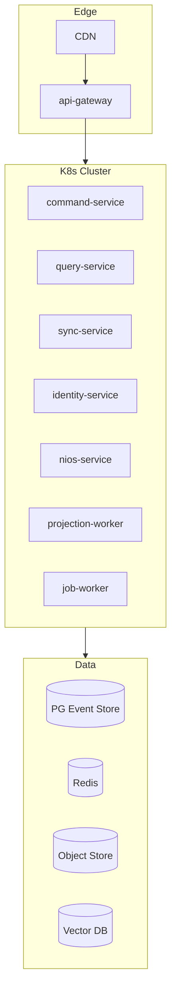

---

# 34. Package Dependency Rules

## Rule set (canonical)

| Rule | Description |
|------|-------------|
| **PD-1** | All packages may depend on `fios-kernel` |
| **PD-2** | `fios-kernel` depends on nothing internal |
| **PD-3** | Domain packages depend on kernel + platform, not each other's internals |
| **PD-4** | Platform packages depend on kernel; not on `src/pages` |
| **PD-5** | Legacy depends on Dexie only (+ kernel types for adapters) |
| **PD-6** | Backend services depend on kernel + shared; never import client |
| **PD-7** | Plugins depend on plugin-sdk + kernel only |
| **PD-8** | AI services propose via kernel commands; never import legacy |
| **PD-9** | fios-testing may import all (devDependency) |
| **PD-10** | No upward imports (domain → pages forbidden) |

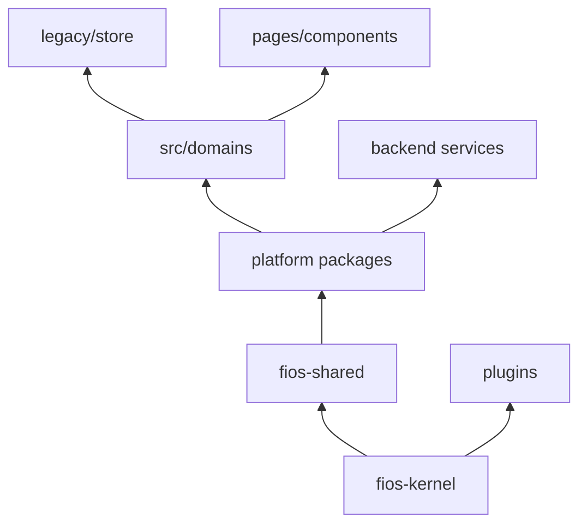

---

# 35. Import Rules

## ESLint `import/no-restricted-paths` (canonical)

| From | Allowed | Forbidden |
|------|---------|-----------|
| `src/pages/**` | `src/domains/*/index`, `src/platform/**`, `src/components/**` | `src/legacy/**`, `src/db/**`, `packages/*/src/internal/**` |
| `src/domains/**` | `packages/fios-*` public, `src/legacy/*/adapters` | other domains' `internal/`, `src/pages` |
| `src/legacy/**` | `src/db`, `packages/fios-kernel` | `src/pages`, `src/domains` (except adapters receiving) |
| `packages/fios-kernel/**` | — | entire `src/`, all other packages |
| `packages/backend/**` | `packages/fios-kernel`, `fios-shared` | `src/**` |
| `services/erp_bot/**` | HTTP contracts, shared schemas | Dexie, Zustand |

## Barrel export rule
Each package exposes **only** `index.ts` public API; deep imports forbidden in CI.

---

# 36. Public API Contracts

| Package | Public entry | Contract doc |
|---------|--------------|--------------|
| fios-kernel | `packages/fios-kernel/index.ts` | Kernel interfaces |
| fios-command-bus | `dispatch`, `registerHandler` | COMMAND_CATALOG_v1 |
| fios-event-bus | `publish`, `subscribe` | DOMAIN_EVENT_CATALOG_v1 |
| fios-event-store | `append`, `readStream` | Event store schema |
| fios-projections | `IProjectionReader` | PROJECTION_CATALOG_v1 |
| fios-sync | `SyncClient` | Sync protocol spec F8 |
| fios-identity | `auth.*` | OIDC integration spec |
| fios-plugin-sdk | `definePlugin` | Plugin manifest schema |
| domains/* | `src/domains/{name}/index.ts` | Per-domain README |
| api-gateway | OpenAPI `/v1/*` | PUBLIC_API spec |

**Versioning:** All public APIs semver; breaking changes require `commandVersion` / `eventVersion` bump.

---

# 37. Internal API Contracts

| Package | Internal (not exported) |
|---------|-------------------------|
| fios-command-bus | `LegacySliceAdapter`, `IdempotencyStore` |
| fios-event-store | `DexieEventStoreAdapter`, `DualWriteDecorator` |
| fios-projections | `ShadowCompareRunner`, per-projector engines |
| fios-sync | `EntityOutboxAdapter`, `VectorClockStore` |
| domains/* | `adapters/legacy.ts` |
| legacy/store | All slice internals |
| erp_bot | Legacy stack adapters (SUTRA, Orbix) |

**Rule:** Internal APIs may change without semver; never imported cross-package.

---

# 38. Extension Points

| Extension point | Register via | Phase | Example |
|-----------------|--------------|-------|---------|
| Command handler | command-bus | F2 | `PostVoucher` |
| Event handler | event-bus | F3 | Audit subscriber |
| Projector | projections | F6 | VAT projection |
| Report | reporting plugin | F14 | Nepal VAT |
| Tax rule pack | tax domain | F10 | Nepal VAT rules |
| Valuation policy | inventory domain | F9 | FIFO |
| UI route | plugin-sdk | F14 | Payroll screen |
| Agent tool | plugin-sdk | F12–F13 | Ledger query tool |
| Integration adapter | integration-service | F10 | CBMS |
| COA resolver | accounting domain | F10 | Industry COA pack |

---

# 39. Plugin Lifecycle

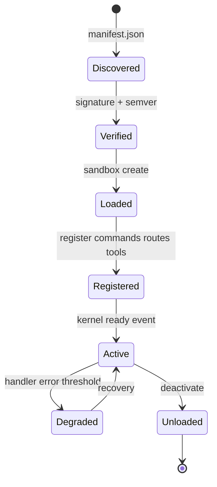

| Stage | Actor | Validation |
|-------|-------|------------|
| **Discover** | Shell boot | Manifest schema |
| **Verify** | plugin-sdk | Signature, semver compat |
| **Load** | Sandbox | Capability tokens |
| **Register** | Kernel | No duplicate command types |
| **Active** | Runtime | Health check |
| **Unload** | Shell / admin | Clean unsubscribe |

## Built-in plugins (ship in-repo F14)
- `src/plugins/core-erp` — voucher, invoice, masters UI
- `src/plugins/nepal-tax` — VAT, CBMS, TDS reports
- `src/plugins/reports` — standard report pack

---

# 40. Module Ownership Matrix

| Module / Package | Owner | Runtime | Write? | Phase | Key weaknesses |
|------------------|-------|---------|--------|-------|----------------|
| fios-kernel | Platform | Build | No | F0 | W-034 |
| fios-shared | Platform | All | No | F0 | W-121 |
| fios-testing | Domain+QA | CI | No | F0 | W-005 |
| src/platform | Platform | Client | No | F0 | W-154, C-05 |
| fios-command-bus | Platform | Client+Cloud | Routes | F2 | W-001 |
| fios-event-bus | Platform | Client+Cloud | Pub | F3 | W-041 |
| fios-event-store | Platform | Client+Cloud | Append | F4 | W-056 |
| fios-projections | Platform | Client+Cloud | Proj | F6 | W-021 |
| fios-sync | Platform | Client+Cloud | Sync | F8 | W-039 |
| fios-identity | Platform | Client+Cloud | Auth | F7 | C-03 |
| fios-plugin-sdk | Platform | Client | Register | F14 | W-172 |
| domains/accounting | Domain Acct | Client | Cmd | F1–F10 | W-015 |
| domains/voucher | Domain Acct | Client | Cmd | F1–F10 | W-072 |
| domains/invoice | Domain Bill | Client | Cmd | F1–F10 | W-016 |
| domains/inventory | Domain Inv | Client | Cmd | F9 | W-077 |
| domains/party | Domain Masters | Client | Cmd | F1 | W-023 |
| domains/company | Domain Masters | Client | Cmd | F1 | W-117 |
| domains/fiscal-year | Domain Acct | Client | Cmd | F10 | W-069 |
| domains/numbering | Domain Docs | Client | Cmd | F10 | W-068 |
| domains/tax | Domain Tax | Client | Cmd | F10 | W-040 |
| domains/reporting | Domain RPT | Client | Read | F11 | W-166 |
| domains/audit | Platform | Client | Read | F3 | W-017 |
| domains/notification | Platform | Client | Notify | F3 | W-160 |
| domains/document | Domain Docs | Client | Meta | F1 | W-100 |
| domains/sync | Platform | Client | Sync | F8 | W-047 |
| domains/nios | AI Platform | Client | Propose | F13 | W-106 |
| legacy/store | Migration tiger | Client | Legacy | F1–F10 | W-001 |
| src/db (Dexie) | Migration tiger | Client | Legacy | F4–F11 | W-059 |
| api-gateway | SRE | Cloud | Route | F7 | W-091 |
| command-service | Platform | Cloud | Append | F4 | W-056 |
| query-service | Platform | Cloud | Read | F6 | W-131 |
| sync-service | Platform | Cloud | Sync | F8 | W-050 |
| identity-service | Platform | Cloud | Auth | F7 | W-084 |
| nios-service | AI Platform | Cloud | AI | F12 | W-103 |
| erp_bot | AI Platform | Cloud | AI | F12 | W-103 |
| knowledge workers | AI Platform | Cloud | Index | F12 | W-123 |
| integration-service | Platform | Cloud | Outbox | F10 | W-040 |
| projection-worker | Platform | Cloud | Proj | F6 | W-021 |
| job-worker | Platform | Cloud | Jobs | F4 | W-046 |
| notification-service | Platform | Cloud | Notify | F3 | W-160 |
| src/plugins/* | Platform+Domain | Client | Extend | F14 | AD-12 |
| infra/* | SRE | Cloud | Deploy | F7 | W-180 |

---

# Diagram Gallery

## Repository Tree (simplified)

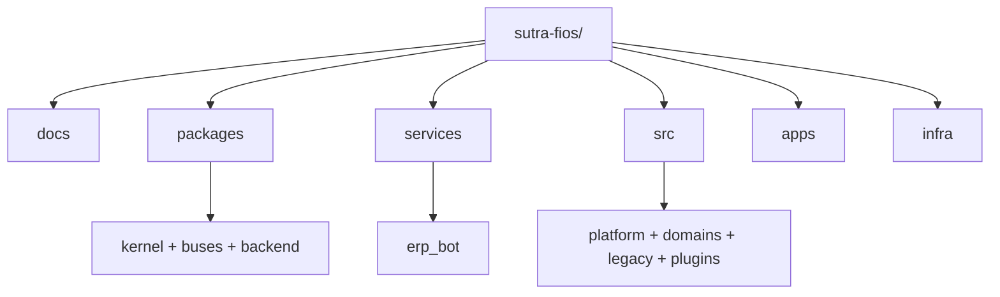

## Domain Dependency Graph

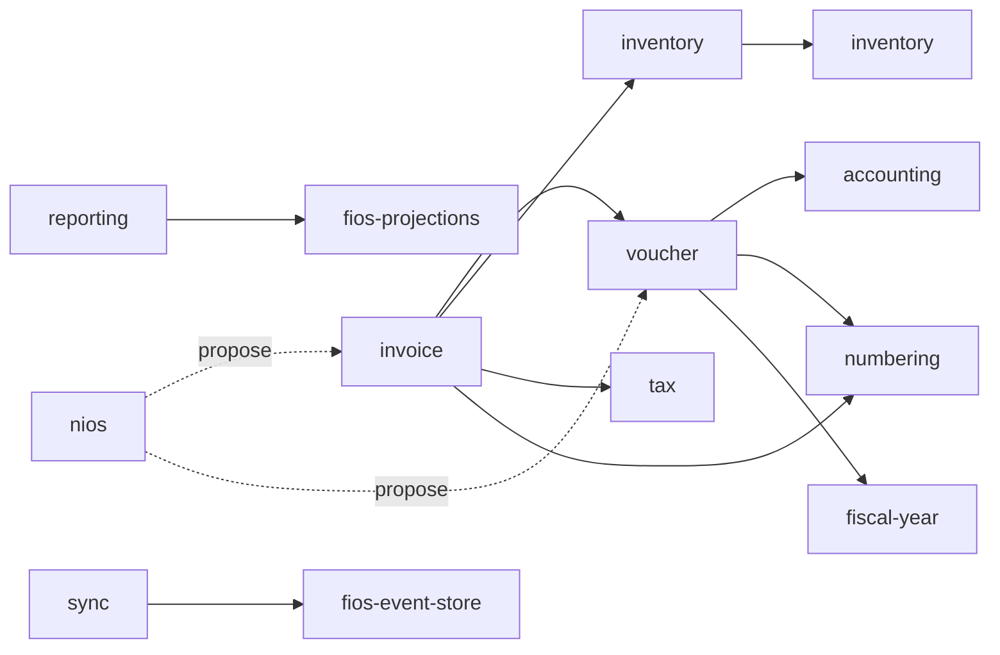

## Plugin Architecture

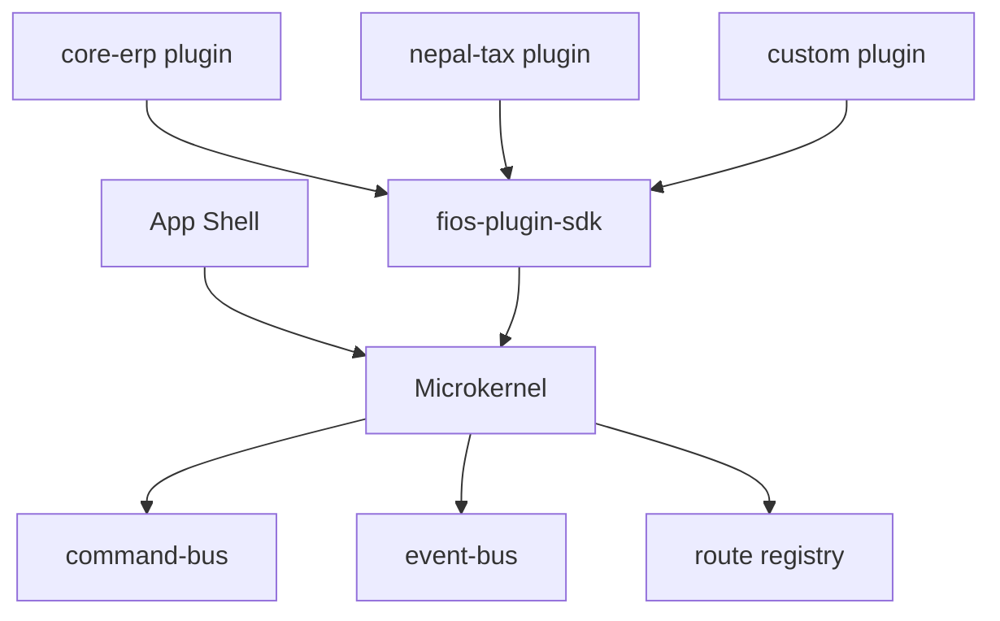

## Frontend Architecture

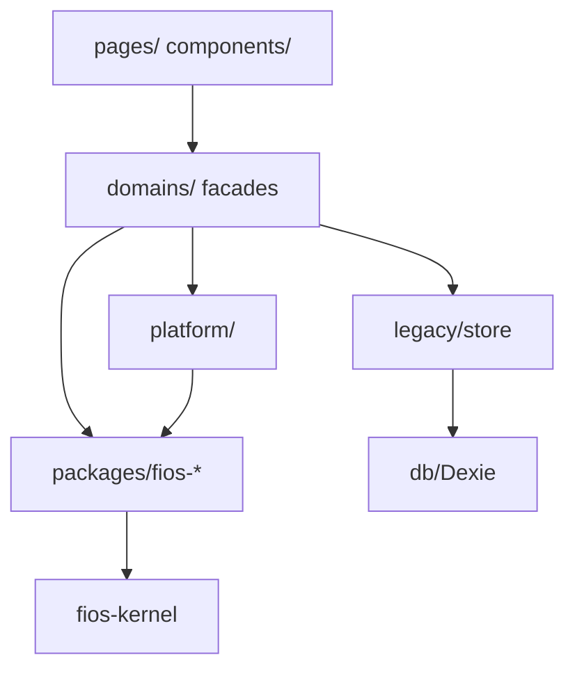

## Module Communication

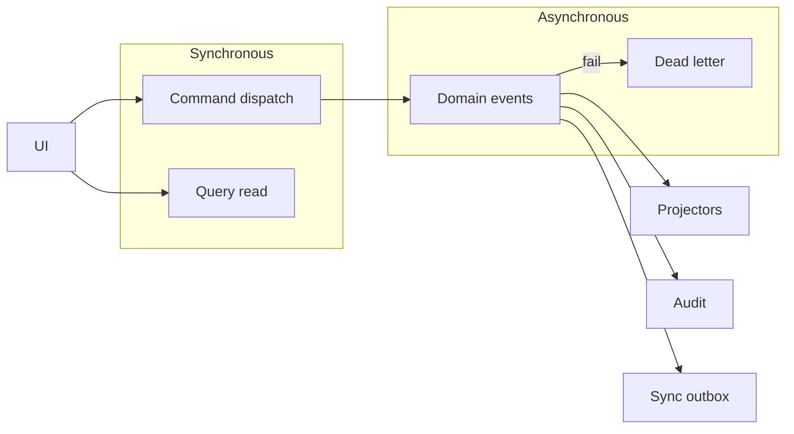

## Event Ownership

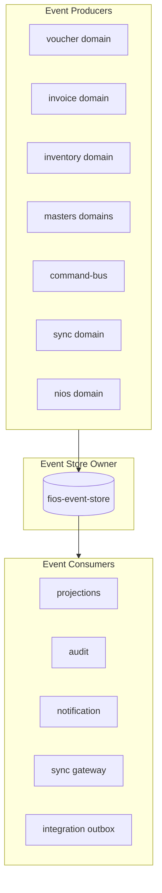

---

# CURRENT → TARGET Module Map (Summary)

| CURRENT (SYSTEM-04) | New home | Phase |
|---------------------|----------|-------|
| `store/index.ts` | `legacy/store` + `domains/*` | F1 |
| `voucherSlice` | `domains/voucher` + `domains/accounting` | F1 |
| `invoiceSlice`, `addInvoice` | `domains/invoice` | F1 |
| `postInvoiceJournal/Stock` | `domains/accounting` + `inventory` + saga F10 | F10 |
| `accounting.ts` | `fios-projections` + `domains/reporting` | F6/F11 |
| `syncSlice`, syncEngine | `domains/sync` + `fios-sync` | F8 |
| `confirmKhataEntry` | `domains/nios` → command gate | F13 |
| `initializeApp` | `src/app` + `platform/migration` | F0 |
| `_loadAllData` | `domains/reporting` paginated queries | F11 |
| Dexie `db/` | `fios-event-store` adapter + legacy | F4 |
| `serve.mjs` | `api-gateway` | F7 |
| `packages/backend` | `packages/backend/*` services | F4+ |
| `erp_bot` | `services/erp_bot` + `nios-service` | F12 |
| AI panels / NIOS v3 | `domains/nios` + plugins | F12–F13 |
| `currentPage` routing | `plugins` route registry | F14 |

---

# Specification Completion Criteria

This document is the **permanent engineering reference** when:

1. All 40 sections defined with ownership and phase
2. Every package traces CURRENT → WEAKNESS → TARGET → PHASE
3. Dependency and import rules enforceable in CI
4. Public vs internal API boundaries documented
5. Extension points and plugin lifecycle defined
6. Deployment layout aligned with SYSTEM-06 §06.74–06.77

**Next step:** F0 implementation begins with stubs matching this skeleton (SYSTEM-08 §20) — no legacy modification until F1.

---

*End of SYSTEM-09 Canonical Repository Skeleton & Module Specification.*
