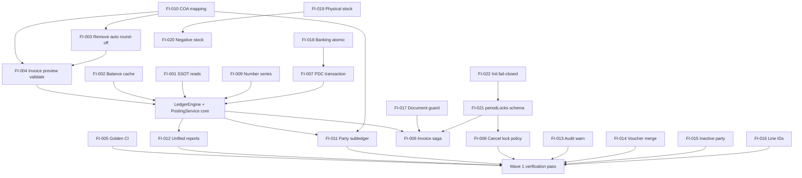

# Wave 1 Solution Architecture — Financial Integrity

**Role:** Principal Financial Systems Architect, NIOS  
**Status:** Pre-implementation design (no code)  
**Inputs:** Wave 1 audit (FI-001–FI-022), `docs/PRODUCTION_EXECUTION_MASTER_PLAN.md`, `nios/docs/dexie-pg-canonical.md`  
**Date:** 2026-07-10

---

## 0. Executive design decision

### Target state (one sentence)

**Posted journal lines are the single source of financial truth; every balance, report, and party outstanding is a deterministic read model derived from those lines, with period locks enforced at the posting boundary and no silent auto-balancing.**

### Architectural pattern

Adopt the **Subledger + GL read model** pattern used by SAP (FI line items / FAGLFLEXT), Oracle GL (journal lines → balances), Microsoft Dynamics (General Ledger entries), NetSuite (transaction accounting lines), and Odoo (`account.move.line` aggregation):

| Layer | NIOS mapping |
|-------|----------------|
| **Journal (immutable posted facts)** | Dexie `vouchers` + auto-journals `jnl-{invoiceId}` |
| **Subledgers** | Invoices, stock movements, party bill-wise |
| **GL balance read model** | Computed from lines (+ opening balance), optionally cached |
| **Reporting** | One `LedgerEngine` consumed by TB, P&L, BS, party outstanding |
| **Posting service** | Single `PostingService` — all writes route here |

### Non-goals for Wave 1

- Full CQRS/event-store cutover (Wave 12+ in master plan)
- Multi-tenant PG sync repair (Wave 6)
- AI runtime v2 (Wave 2+)
- Replacing Zustand god store (incremental strangler only at posting boundary)

---

## 1. Per-issue solution design

---

### FI-001 — Triple balance truth model

| Dimension | Detail |
|-----------|--------|
| **Root cause** | Three write/read authorities: (1) `accounts.balance` denorm on post, (2) `_loadAllData` line recompute on login, (3) report engines aggregating lines independently. Mid-session UI reads denorm; reports read lines. |
| **Correct accounting principle** | **General Ledger balances are always the algebraic sum of posted journal entry lines** plus documented opening balances. No second “balance field” may disagree with the ledger. (IAS 1 / NFRS presentation; SAP FI-GL principle.) |
| **Correct software architecture** | Introduce **`LedgerEngine.getAccountBalance(accountId, asAtDate?)`** as the only balance API. UI, reports, and AI RAG read through it. Optional **`AccountBalanceCache`** table updated in the same Dexie transaction as line writes — never updated by a separate code path. |
| **Industry best practice** | SAP: line-item ledger is truth; FS10N derived. Oracle: `GL_JE_LINES` → balances. Odoo: `account.move.line` sum. NetSuite: transaction lines. Dynamics: `GeneralJournalAccountEntry` aggregation. |
| **Implementation strategy** | 1) Document SSOT in `nios/docs/dexie-pg-canonical.md` §Client Ledger Truth. 2) Implement `LedgerEngine` in `src/lib/ledger/` (pure functions + Dexie readers). 3) Phase A: reports + account list read via engine while still writing denorm (parity mode). 4) Phase B: stop UI reading `accounts.balance` directly. 5) Golden tests prove agreement ±0.01. |
| **Data migration** | One-time **balance reconciliation job**: recompute all account balances from lines; write to cache or overwrite `accounts.balance` consistently; log discrepancies > ₹0.01 for support. |
| **Backward compatibility** | Keep `accounts.balance` column during transition; mark deprecated in types. Old exports that read balance field still work if cache is kept in sync. |
| **Rollback strategy** | Flag `W1_USE_LINE_BALANCE_READS` (default false → true). If rollback, UI reverts to `accounts.balance`; cache writes disabled. |
| **Performance impact** | Full recompute O(lines) on login replaced by incremental cache update O(posting lines) per transaction. Login may be faster; first read after migration one-time cost. |
| **Testing strategy** | Golden fixture: 100 mixed vouchers → compare account list, TB, P&L, BS via `LedgerEngine`. Property test: post → edit → cancel → balances match lines. |
| **Risks** | Missing auto-journal lines in TB filters (W1-E07). Mitigation: include all `status=posted` vouchers regardless of type prefix. |
| **Acceptance criteria** | All launch-scope money views agree ±₹0.01; SSOT doc approved; golden CI green. |

---

### FI-002 — Eliminate or derive denormalized account balance

| Dimension | Detail |
|-----------|--------|
| **Root cause** | `postInvoiceJournal`, `addVoucher`, `updateVoucher`, `cancelVoucher`, `convertPDCToBank` each update `accounts.balance` with inline arithmetic separate from report aggregation. |
| **Correct accounting principle** | **Posting is append-only facts (lines); balance is a derived function.** Mutating a balance field without a corresponding line is a control violation. |
| **Correct software architecture** | **`PostingService.applyLines(lines, metadata)`** writes lines then calls **`BalanceCache.applyDelta(lines)`** inside one Dexie transaction. Remove all direct `db.accounts.update({ balance })` outside `BalanceCache`. |
| **Industry best practice** | SAP BTE / posting updates FAGLFLEXT in same LUW as BSEG. Oracle: balance tables updated by posting program, not UI. Odoo: `create()` on move lines triggers computed stored fields. |
| **Implementation strategy** | Extract balance mutations from `store/index.ts`, `voucherSlice.ts` into `src/lib/ledger/balanceCache.ts`. Single entry: `applyPostingDelta(lines, direction: 'post' \| 'reverse')`. |
| **Data migration** | Same as FI-001 reconciliation job (run once with FI-001). |
| **Backward compatibility** | `accounts.balance` remains populated as cache for one release cycle. |
| **Rollback strategy** | Flag `W1_BALANCE_CACHE_WRITES` — off reverts to legacy inline updates. |
| **Performance impact** | Neutral to positive (batch delta vs read-modify-write per account in loop). |
| **Testing strategy** | Unit: delta application. Integration: every posting path calls `PostingService` only. |
| **Risks** | Missed call site (grep CI rule: no `accounts.update.*balance` outside balanceCache). |
| **Acceptance criteria** | Zero direct balance writes outside `balanceCache.ts`; post→edit→cancel balances correct. |

---

### FI-003 — Round-off auto-balancing masks errors

| Dimension | Detail |
|-----------|--------|
| **Root cause** | `postInvoiceJournal` auto-inserts “Rounding Difference” to `acc-indirect-expenses` when \|Dr−Cr\| ≥ 0.01 (`index.ts` ~2221–2241). |
| **Correct accounting principle** | **Imbalance is a posting error, not an expense.** Round-off is a deliberate user/accounting policy entry (IAS 21 / local practice), typically ≤ ₹0.01 with explicit account. |
| **Correct software architecture** | **`PostingValidator.validateBalanced(lines, tolerance)`** throws `UNBALANCED_POSTING`. Optional **`RoundOffPolicy`**: explicit user line or company setting `roundOffAccountId` + max ₹0.01 auto only if enabled. |
| **Industry best practice** | SAP: document must balance before posting (message F5 681). Oracle: journal import rejects imbalance. Dynamics: validation on journal balance. Odoo: `UserError` if not balanced. |
| **Implementation strategy** | Remove auto-residual block. Keep `pushRoundOff()` only for user-supplied `invoice.roundOff`. Add company setting `allowAutoRoundOff: boolean` default **false**, max 0.01 if true. |
| **Data migration** | None. Historical “Rounding Difference” lines remain in ledger (audit trail). |
| **Backward compatibility** | Companies relying on silent round-off must enable flag explicitly (document in release notes). |
| **Rollback strategy** | Flag `W1_ALLOW_AUTO_ROUND_OFF` restores old behavior (default false). |
| **Performance impact** | Negligible. |
| **Testing strategy** | Invoice with 0.02 imbalance must fail. With flag on and ≤0.01, succeeds with explicit line. |
| **Risks** | Existing users with sloppy tax config see more errors — correct behavior, needs UX message. |
| **Acceptance criteria** | Imbalance > tolerance throws; no silent expense line unless policy enabled. |

---

### FI-004 — Pre-post validateDoubleEntry on invoice forms

| Dimension | Detail |
|-----------|--------|
| **Root cause** | `SalesInvoiceForm.validate()` checks commercial fields only; journal built later in `postInvoiceJournal` without pre-validation at UI. |
| **Correct accounting principle** | **Validate the accounting entry before commit** (double-entry integrity at submission boundary). |
| **Correct software architecture** | **`InvoicePostingPreview.buildJournal(invoice)`** pure function (same logic as post). Form calls `validateDoubleEntry(preview.lines)` before `addInvoice` when status=posted. |
| **Industry best practice** | SAP: simulation posting (FBV1). Oracle: journal validation before Post. NetSuite: client-side + server validation. |
| **Implementation strategy** | Extract journal line builder from `postInvoiceJournal` into `src/lib/ledger/invoiceJournalBuilder.ts`. Form imports builder for preview. Share with posting service. |
| **Data migration** | None. |
| **Backward compatibility** | Stricter validation may block previously “successful” posts — intentional. |
| **Rollback strategy** | Flag `W1_STRICT_INVOICE_VALIDATE` (default true). |
| **Performance impact** | One extra in-memory journal build per save — negligible. |
| **Testing strategy** | Unit: preview matches post. Form test: unbalanced preview blocks save. |
| **Risks** | Duplicate logic if builder not shared — enforce single module. |
| **Acceptance criteria** | Posted save blocked with clear error if preview journal unbalanced. |

---

### FI-005 — Golden accounting fixture suite

| Dimension | Detail |
|-----------|--------|
| **Root cause** | CI runs lint/tsc only; no automated proof of accounting invariants. |
| **Correct accounting principle** | **Regression suite for invariants:** Dr=Cr, period lock, reversal symmetry, stock↔invoice linkage. |
| **Correct software architecture** | `src/__tests__/accounting/` with fake-indexeddb; fixtures in `scripts/golden-fixtures/wave1/`; CI job `accounting-golden`; wire `MIGRATION_GOLDEN_CI` → `W1_GOLDEN_CI`. |
| **Industry best practice** | SAP: regression tests on posting programs. Oracle: GL diagnostic sets. All major ERPs: automated reconciliation tests before release. |
| **Implementation strategy** | Fixtures: sales/purchase/returns, TDS purchase, voucher cancel, period lock reject, invoice edit repost, khata confirm (minimal). Enable CI gate on main. |
| **Data migration** | None. |
| **Backward compatibility** | N/A — test-only. |
| **Rollback strategy** | CI job advisory-only for 1 week, then required. |
| **Performance impact** | CI +30–90s. |
| **Testing strategy** | Self — golden suite is the deliverable. |
| **Risks** | Flaky Dexie in Node — use `fake-indexeddb` consistently. |
| **Acceptance criteria** | CI fails on imbalance; covers FI-001–004, 006, 008, 009, 021 scenarios. |

---

### FI-006 — updateInvoice skips stock when journal exists

| Dimension | Detail |
|-----------|--------|
| **Root cause** | Draft→posted path skips journal+stock if `jnl-${id}` exists (`voucherSlice.ts` ~342–347). |
| **Correct accounting principle** | **Invoice posting is atomic:** GL + inventory subledger move together (IAS 2 / NFRS inventory). |
| **Correct software architecture** | **`InvoicePostingSaga.post(invoiceId)`** — idempotent by invoice version/hash, not by journal existence alone. If jnl exists but stock missing, repair. Use `invoice.postingVersion` increment on edit. |
| **Industry best practice** | SAP: MM-FI integration single document flow. Odoo: `action_post` on move triggers stock moves. NetSuite: item fulfillment tied to invoice. |
| **Implementation strategy** | Replace `jnlExists` skip with saga: verify journal **and** stock movements for invoice; if partial, run `repostInvoiceJournalAndStock`. Add `postingChecksum` on invoice. |
| **Data migration** | Repair script: find invoices posted with journal but zero stock movements where lines have items → run repost stock. |
| **Backward compatibility** | Repair script fixes historical partial state. |
| **Rollback strategy** | Flag `W1_INVOICE_POSTING_SAGA` — off uses legacy path with documented jnlExists bug. |
| **Performance impact** | One extra query per draft→posted (existence check) — negligible. |
| **Testing strategy** | Integration: draft→posted with orphaned jnl → stock still posted. Edit posted → repost. |
| **Risks** | Duplicate stock if repost logic wrong — saga must reverse before repost (already in `repostInvoiceJournalAndStock`). |
| **Acceptance criteria** | No invoice posted with items lacks stock movements; edit reposts in one transaction. |

---

### FI-007 — PDC convert without transaction wrapper

| Dimension | Detail |
|-----------|--------|
| **Root cause** | `convertPDCToBank` performs voucher add, balance updates, PDC update, audit log without Dexie transaction. |
| **Correct accounting principle** | **Banking conversion is one atomic financial event** (cheque presented = Dr Bank, Cr PDC). |
| **Correct software architecture** | Wrap in `db.transaction('rw', [vouchers, accounts, pdCheques, auditLogs])` and route voucher through `PostingService`. |
| **Industry best practice** | SAP: FB05 single document. All ERPs: atomic journal for PDC realisation. |
| **Implementation strategy** | Refactor `convertPDCToBank` to call `addVoucher` / `PostingService` inside transaction; remove duplicate balance loop. |
| **Data migration** | None unless repair needed for orphaned PDC states (support script). |
| **Backward compatibility** | Behavior unchanged when successful; failures now roll back (improvement). |
| **Rollback strategy** | Low risk — transactional wrapper only. |
| **Performance impact** | Negligible. |
| **Testing strategy** | Inject failure after voucher add → PDC status unchanged. |
| **Risks** | Low. |
| **Acceptance criteria** | All PDC conversion steps atomic; partial state impossible. |

---

### FI-008 — Voucher cancel bypasses period lock

| Dimension | Detail |
|-----------|--------|
| **Root cause** | `cancelVoucher` / `cancelInvoice` do not call `enforceperiodLock`; reversal dated **today** not original date. |
| **Correct accounting principle** | **Reversals affect the period they are recorded in**; if that period is locked, reversal must be blocked OR use allowed “adjustment in open period” policy with audit. (SAP: posting period control on reversal date.) |
| **Correct software architecture** | **`CancellationService.cancel(document, reason)`** — (1) lock check on **reversal posting date** (configurable: today vs original), (2) create reversal voucher, (3) never mutate original lines. Default policy: **reversal date = original document date** if period open, else block. |
| **Industry best practice** | SAP OB52 period lock applies to reversal posting date. Oracle: Open Period Validation on reversal. Dynamics: fiscal calendar on all entries. |
| **Implementation strategy** | Add `enforcePeriodLock(reversalDate)` before reversal. Add company policy `reversalDatePolicy: 'original' \| 'today'` default `'original'`. Fix cancel to use original date when policy says so. |
| **Data migration** | None. |
| **Backward compatibility** | Stricter — previously allowed cancels in locked periods stop. |
| **Rollback strategy** | Flag `W1_STRICT_CANCEL_LOCK` + policy override for support. |
| **Performance impact** | Negligible. |
| **Testing strategy** | Lock period → cancel must fail; open period → succeeds. |
| **Risks** | UX: users expect cancel in current period — document policy in UI. |
| **Acceptance criteria** | Cancel/reversal respects period lock; policy documented and tested. |

---

### FI-009 — Serial number collision race

| Dimension | Detail |
|-----------|--------|
| **Root cause** | `generateSerialNumberSync` uses random suffix; async max-scan without atomic counter; multi-tab race. |
| **Correct accounting principle** | **Document numbers must be unique and sequential per series** (audit trail requirement). |
| **Correct software architecture** | **`NumberSeriesService.next(seriesKey)`** — Dexie table `numberSeriesCounters` with atomic read-increment inside posting transaction. Format: prefix + zero-padded seq per FY. |
| **Industry best practice** | SAP: Number range objects (SNRO). Oracle: document sequencing. Odoo: `ir.sequence` with `no_gap` option. NetSuite: auto-numbering with locking. |
| **Implementation strategy** | Replace max-scan with counter table. Deprecate `generateSerialNumberSync` for posting paths; allow only preview with “(draft)” suffix. Add multi-tab warning (SYNC-022) until leader election. |
| **Data migration** | Seed counters from `max(existing voucherNo)` per series per FY. |
| **Backward compatibility** | Existing numbers unchanged; new numbers from counter ≥ max+1. |
| **Rollback strategy** | Flag `W1_NUMBER_SERIES` — off uses legacy max-scan. |
| **Performance impact** | O(1) vs O(n) — improvement at scale. |
| **Testing strategy** | Parallel post simulation (2 tabs / Promise.all) — no duplicates. |
| **Risks** | Counter desync if migration max wrong — validate against all voucher types. |
| **Acceptance criteria** | No duplicate voucher/invoice numbers under parallel test. |

---

### FI-010 — Hardcoded chart-of-accounts IDs

| Dimension | Detail |
|-----------|--------|
| **Root cause** | `postInvoiceJournal` uses magic strings `acc-sales`, `acc-purchase`, etc. Khata uses parallel `KH-*` codes. |
| **Correct accounting principle** | **Posting maps economic events to accounts via configurable chart mapping**, not code constants (COA flexibility). |
| **Correct software architecture** | **`CoaMappingService.resolve(role: AccountRole)`** — roles: `SALES`, `PURCHASE`, `VAT_OUTPUT`, `VAT_INPUT`, `TDS_PAYABLE`, etc. Mapping stored in `accountRoleMappings` table or `companySettings.defaultAccounts`. Seed defaults on company create. |
| **Industry best practice** | SAP: posting keys + GL accounts. Oracle: accounting setup. Odoo: account on product/category. Dynamics: posting profiles. |
| **Implementation strategy** | 1) Define `AccountRole` enum. 2) Seed map from existing seed COA IDs. 3) Replace hardcoded strings in journal builder. 4) **Khata convergence:** map KH-* roles to same role enum (single COA). |
| **Data migration** | Build mapping from existing accounts by code/name heuristics; manual override UI in Settings → Default Accounts. |
| **Backward compatibility** | Seed companies keep same IDs via mapping table pointing to existing accounts. |
| **Rollback strategy** | Flag `W1_COA_MAPPING` — off uses hardcoded fallback map in code (frozen copy of seed). |
| **Performance impact** | Map cached in memory per session — negligible. |
| **Testing strategy** | Custom COA company → post sales invoice succeeds. Khata + ERP share roles. |
| **Risks** | Wrong mapping → wrong GL — golden tests per role. |
| **Acceptance criteria** | No magic account IDs in posting code; custom COA posts correctly. |

---

### FI-011 — Party balance not updated from khata/vouchers

| Dimension | Detail |
|-----------|--------|
| **Root cause** | `parties.balance` field stale; AI/rag reads it; outstanding computed from invoices only in some paths. |
| **Correct accounting principle** | **Party balance = open item / subledger balance** derived from posted receivable/payable lines and bill-wise allocations (SAP FI-AR/FI-AP open item management). |
| **Correct software architecture** | Remove reliance on `party.balance` for truth. **`PartySubledger.getOutstanding(partyId)`** = sum of `computeInvoiceOutstanding` + open khata/voucher lines on party accounts. Optionally cache on party with same invalidation as FI-002. |
| **Industry best practice** | SAP: FBL5N from open items, not master balance field. Oracle: subledger detail. Dynamics: customer balance from transactions. |
| **Implementation strategy** | 1) Implement `PartySubledger` using bill-wise engine + party account lines. 2) Update AI handlers to use subledger API. 3) Deprecate `party.balance` writes or sync cache on post. |
| **Data migration** | Recompute party outstanding cache from invoices/vouchers; write to `parties.balance` as cache only. |
| **Backward compatibility** | Field remains populated as cache for legacy UI. |
| **Rollback strategy** | Flag `W1_PARTY_SUBLEDGER_READS`. |
| **Performance impact** | O(invoices) per party — acceptable with indexing by partyId; cache on post. |
| **Testing strategy** | Khata confirm → party outstanding matches ledger. |
| **Risks** | Khata uses party-less cash entries — define rules for party-optional intents. |
| **Acceptance criteria** | Party outstanding matches bill-wise + ledger; AI reads subledger API. |

---

### FI-012 — Triple P&L / Balance Sheet implementation paths

| Dimension | Detail |
|-----------|--------|
| **Root cause** | `profitLossEngine`, `balanceSheetEngine`, inline TB in page, `accounting.ts` helpers, `nepalFinancialStatements.ts`, unused `report-engine`. |
| **Correct accounting principle** | **One calculation kernel per report type** with shared line aggregation input (SAP: same GL totals for FS10N and financial statements). |
| **Correct software architecture** | **`FinancialReportEngine`** module: `computeTrialBalance`, `computeProfitLoss`, `computeBalanceSheet` — all call `LedgerEngine.aggregateByAccount(period)`. Pages become thin UI. NAS format = presentation layer on same numbers. |
| **Industry best practice** | SAP: report painter on same tables. Oracle: FSG on same balances. Odoo: single `get_report` pipeline. |
| **Implementation strategy** | 1) Extract shared aggregation from `profitLossEngine` / TB page. 2) Refactor BS/P&L pages to use `FinancialReportEngine`. 3) Golden snapshot FY 2081/82. 4) Mark `accounting.ts` compute* deprecated. 5) Defer shadow `report-engine` cutover. |
| **Data migration** | None. |
| **Backward compatibility** | Report numbers may shift slightly if old engines had bugs — document in release notes; golden tests lock correct behavior. |
| **Rollback strategy** | Flag `W1_UNIFIED_REPORT_ENGINE` per report page. |
| **Performance impact** | Single aggregation pass can be shared — potential improvement. |
| **Testing strategy** | Golden BS/P&L/TB snapshots; cross-report tie-out (BS equity = prior + P&L). |
| **Risks** | NAS presentation differences — separate formatter, not separate math. |
| **Acceptance criteria** | Launch reports use one engine; golden snapshots pass. |

---

### FI-013 — Audit log failure swallowed

| Dimension | Detail |
|-----------|--------|
| **Root cause** | Empty catch on audit write in `addVoucher`, `cancelVoucher` with comment “non-critical”. |
| **Correct accounting principle** | **Audit trail is a control activity** (ISA 315/330). Failure must be visible; posting may continue or halt per policy. |
| **Correct software architecture** | **`AuditService.log(event)`** — returns result; on failure: structured console + toast + optional `auditFailures` table. Policy: **`auditFailPolicy: 'warn' \| 'block'`** default `'warn'` for v1. |
| **Industry best practice** | SAP: change documents; failure surfaces SM21. Oracle: audit options. SOX environments often block post if audit fails. |
| **Implementation strategy** | Replace empty catch with `AuditService.log`. Surface toast on warn. Log to diagnostics. |
| **Data migration** | None. |
| **Backward compatibility** | Posting still succeeds by default (warn). |
| **Rollback strategy** | N/A — strict improvement. |
| **Performance impact** | Negligible. |
| **Testing strategy** | Mock audit failure → toast shown. |
| **Risks** | Low. |
| **Acceptance criteria** | User notified on audit failure; policy documented. |

---

### FI-014 — Partial voucher merge in updateVoucher

| Dimension | Detail |
|-----------|--------|
| **Root cause** | Shallow merge `{ ...v, ...updates }` in Zustand; partial Dexie update. |
| **Correct accounting principle** | N/A (UX/consistency). |
| **Correct software architecture** | **`updateVoucher` replaces full document** — merge in service layer produces complete voucher; Dexie `put` not partial `update` for lines. |
| **Industry best practice** | Standard document replace pattern. |
| **Implementation strategy** | Load original, deep merge lines array, validate, put full record, refresh RAM from Dexie. |
| **Data migration** | None. |
| **Backward compatibility** | Full replace may fix existing corrupted RAM state on next edit. |
| **Rollback strategy** | Low risk. |
| **Performance impact** | Negligible. |
| **Testing strategy** | Edit lines → save → reload → lines match. |
| **Risks** | Low. |
| **Acceptance criteria** | Dexie and RAM consistent after update. |

---

### FI-015 — Inactive party check incorrect

| Dimension | Detail |
|-----------|--------|
| **Root cause** | Form checks party **ledger account** inactive in line loop; not `party.isActive`; `addInvoice` has no check. |
| **Correct accounting principle** | **Cannot post to inactive master data** (master data governance). |
| **Correct software architecture** | **`MasterDataValidator.assertPartyActive(partyId)`** at posting service boundary (not form only). |
| **Industry best practice** | SAP: posting block on blocked customer/vendor. |
| **Implementation strategy** | Add check in `PostingService` for invoice/voucher with partyId. Fix form to check `party.isActive`. |
| **Data migration** | None. |
| **Backward compatibility** | Stricter validation. |
| **Rollback strategy** | Flag `W1_INACTIVE_PARTY_BLOCK`. |
| **Performance impact** | Negligible. |
| **Testing strategy** | Inactive party → post fails with message. |
| **Risks** | Low. |
| **Acceptance criteria** | Post blocked for inactive party at service layer. |

---

### FI-016 — Random invoice line IDs

| Dimension | Detail |
|-----------|--------|
| **Root cause** | `SalesInvoiceForm` uses `Math.random()` for line uid; stock movement fallback uses random. |
| **Correct accounting principle** | **Stable line identifiers** for audit, edit, sync (NetSuite line unique key; SAP line item number). |
| **Correct software architecture** | Use **`generateId()`** everywhere; line id immutable for life of line. |
| **Industry best practice** | Persistent line IDs for integration/sync. |
| **Implementation strategy** | Replace `uid()` with `generateId()`. Stock mov fallback: `generateId()` only. |
| **Data migration** | None for existing; new lines stable. |
| **Backward compatibility** | Old random IDs remain. |
| **Rollback strategy** | N/A. |
| **Performance impact** | None. |
| **Testing strategy** | Edit invoice → line ids unchanged. |
| **Risks** | Sync merge (Wave 6) benefits — coordinate with SYNC-019. |
| **Acceptance criteria** | All new lines use `generateId()`. |

---

### FI-017 — guardPostedVoucher inconsistent

| Dimension | Detail |
|-----------|--------|
| **Root cause** | `guardPostedVoucher` only on some paths; no shared immutability for posted documents. |
| **Correct accounting principle** | **Posted documents are immutable** except via reversal or controlled adjustment workflow (SAP: document change rules). |
| **Correct software architecture** | **`DocumentGuard.assertEditable(doc)`** — single module; checks status != posted OR allowed adjustment types. All update entry points call it. |
| **Industry best practice** | SAP: change tolerance keys. Oracle: journal update control. |
| **Implementation strategy** | Export `assertEditableVoucher/Invoice` from `src/lib/ledger/documentGuard.ts`. Wire store, forms, pages. Posted edit → force reversal workflow or block. |
| **Data migration** | None. |
| **Backward compatibility** | May block edits that previously partially worked. |
| **Rollback strategy** | Flag `W1_STRICT_POSTED_IMMUTABILITY`. |
| **Performance impact** | Negligible. |
| **Testing strategy** | Matrix: all edit entry points × posted/draft. |
| **Risks** | Users expect edit posted invoice — keep `updateInvoice` repost saga as allowed path with guard. |
| **Acceptance criteria** | Single guard used everywhere; behavior documented. |

---

### FI-018 — Banking operations non-transactional

| Dimension | Detail |
|-----------|--------|
| **Root cause** | PDC convert and related banking writes outside transactions (FI-007); ePayment batch helpers individual puts. |
| **Correct accounting principle** | Banking batch = atomic journal set. |
| **Correct software architecture** | All banking mutations through **`BankingPostingService`** with Dexie transactions. |
| **Industry best practice** | SAP electronic bank statement as integrated posting. |
| **Implementation strategy** | Audit all methods in voucherSlice banking section; wrap or delegate to PostingService. Bank reco voucher creation already uses addVoucher — ensure transactional save in `BankReconciliation.tsx`. |
| **Data migration** | Optional repair for inconsistent PDC. |
| **Backward compatibility** | Improved atomicity. |
| **Rollback strategy** | Per-method flags if needed. |
| **Performance impact** | Negligible. |
| **Testing strategy** | Banking integration tests. |
| **Risks** | Medium scope — limit to launch-scope banking features. |
| **Acceptance criteria** | Audit checklist: all banking writes in transactions. |

---

### FI-019 — StockAdjustment bypasses inventory slice valuation

| Dimension | Detail |
|-----------|--------|
| **Root cause** | `addPhysicalStock` forces DRAFT in record while checking POSTED on input; physical stock path bypasses consistent status. |
| **Correct accounting principle** | **Inventory adjustments post at valuation policy** (FIFO/WAvg per IAS 2). |
| **Correct software architecture** | Route **`addPhysicalStock` → `inventorySlice.postPhysicalStock`** only; fix status handling; use `buildInMovement`/`buildOutMovement` (already in slice). |
| **Industry best practice** | SAP MIRO/MIGO valuation. Odoo: stock.move with price unit. |
| **Implementation strategy** | Fix `addPhysicalStock` to preserve POSTED status; remove duplicate logic from index.ts; single path through slice. |
| **Data migration** | Repair: physical stock entries marked DRAFT but movements exist → set POSTED. |
| **Backward compatibility** | Status fix may affect list filters. |
| **Rollback strategy** | Low risk. |
| **Performance impact** | Negligible. |
| **Testing strategy** | Physical stock post → movements with valuation method. |
| **Risks** | Low. |
| **Acceptance criteria** | All adjustments through inventorySlice; status consistent. |

---

### FI-020 — Negative stock policy undefined

| Dimension | Detail |
|-----------|--------|
| **Root cause** | `postInvoiceStock` no check; `postRejectionStock` checks `allowNegativeStock` inconsistently. |
| **Correct accounting principle** | **Inventory policy is company choice** — block or allow negative with audit (IAS 2 prudence). |
| **Correct software architecture** | **`InventoryPolicy.allowNegativeStock`** from company settings; enforced in **`StockPostingService.post(lines)`** uniformly. |
| **Industry best practice** | SAP: negative stocks configurable. Odoo: product type constraints. |
| **Implementation strategy** | Central check before stock movement add; default **block**. Document in settings UI. |
| **Data migration** | None. |
| **Backward compatibility** | Companies allowing negative must enable flag. |
| **Rollback strategy** | Flag `W1_ENFORCE_NEGATIVE_STOCK_POLICY`. |
| **Performance impact** | O(1) qty check per line. |
| **Testing strategy** | Oversell blocked when flag false. |
| **Risks** | Low. |
| **Acceptance criteria** | Policy documented and enforced on all stock post paths. |

---

### FI-021 — periodLocks schema / enforcement gap

| Dimension | Detail |
|-----------|--------|
| **Root cause** | `periodLocks` table used by UI/enforcement but **not declared in Dexie schema v18–v25**; `enforceperiodLock` no-ops when table missing. |
| **Correct accounting principle** | **Period close prevents backdating and new posts** (SAP OB52; Oracle period status; year-end close). |
| **Correct software architecture** | Add **`periodLocks`** to Dexie v26 schema. **`PeriodLockService.isLocked(date)`** used by all posting entry points. Year-end process writes locks. |
| **Industry best practice** | SAP OB52 posting period variant. Dynamics fiscal calendar. NetSuite: period locking. |
| **Implementation strategy** | 1) Dexie v26 migration. 2) Migrate existing locks from ephemeral table if any IndexedDB auto-created data. 3) Wire `PeriodLockService` into PostingService (replaces enforceperiodLock). 4) Test all voucher types. |
| **Data migration** | **Required:** Dexie v26 adds `periodLocks: 'id, periodKey, lockedAt'`. Import from backup if PeriodLockPage data exists. |
| **Backward compatibility** | New installs get working locks; upgrades migrate. |
| **Rollback strategy** | Flag `W1_PERIOD_LOCK_ENFORCE` — off skips checks (emergency only). |
| **Performance impact** | O(locks) scan — tiny table, cache in memory per session. |
| **Testing strategy** | Lock → post each document type fails; unlock → succeeds. |
| **Risks** | **Critical dependency** for FI-008 — implement FI-021 first. |
| **Acceptance criteria** | periodLocks in schema; all post paths enforce; year-end creates locks. |

---

### FI-022 — Init failure masks DB not ready

| Dimension | Detail |
|-----------|--------|
| **Root cause** | `initializeApp` catch sets `isDbReady: true` on any failure. |
| **Correct accounting principle** | N/A (system integrity). |
| **Correct software architecture** | **`authStage: 'error'`** with blocking screen; `isDbReady: false`; no store writes until successful init. Separate `_loadAllData` failure from fatal init failure. |
| **Industry best practice** | Fail-closed startup for financial apps. |
| **Implementation strategy** | Add error stage in App.tsx; catch sets error state with retry/clear-cache actions. `_loadAllData` failure: stay authenticated but show data warning banner (W1-E08). |
| **Data migration** | None. |
| **Backward compatibility** | Users with corrupt IDB see error instead of silent bad state — improvement. |
| **Rollback strategy** | Flag `W1_FAIL_CLOSED_INIT`. |
| **Performance impact** | None. |
| **Testing strategy** | Mock IDB failure → blocking UI; no post possible. |
| **Risks** | Low. |
| **Acceptance criteria** | Init failure blocks app; writes disabled. |

---

### Hidden edge cases (from audit)

| ID | Solution summary |
|----|------------------|
| W1-E01 | Resolved by FI-001/FI-002 — all reads via LedgerEngine |
| W1-E02 | Resolved by FI-008 + FI-021 — reversal date policy + locks |
| W1-E03 | **Change `reverseInvoiceJournal` to reversal voucher pattern** (like cancelInvoice), not delete — add to Stage 2 saga work |
| W1-E04 | Resolved by FI-019 |
| W1-E05 | Resolved by FI-010 — Khata uses same CoaMapping roles |
| W1-E06 | Out of Wave 1 scope — observability (OBS-002) |
| W1-E07 | TB must include all posted vouchers including `jnl-*` — test in FI-012 golden |
| W1-E08 | `_loadAllData` failure → banner, not `isDbReady: true` — part of FI-022 |
| W1-E09 | Implement flags listed in §10 |

---

## 2. Dependency graph (implementation order)



**Critical path:** FI-022 → FI-021 → PostingService/LedgerEngine (FI-002, FI-003, FI-004, FI-010) → FI-012 + FI-011 → FI-005 → Verification.

---

## 3. Issues solvable together (work packages)

| Package | Issues | Rationale |
|---------|--------|-----------|
| **WP-A: Platform safety** | FI-022, FI-021, FI-008 | Period control foundation |
| **WP-B: Posting kernel** | FI-002, FI-003, FI-004, FI-010, FI-017, FI-007, FI-009 | Single `PostingService` extraction |
| **WP-C: Ledger truth** | FI-001, FI-012, FI-011 | Read models from same engine |
| **WP-D: Invoice/inventory saga** | FI-006, FI-019, FI-020, W1-E03 | Atomic invoice+stock; reversal not delete |
| **WP-E: Governance** | FI-013, FI-014, FI-015, FI-016 | Lower risk, parallel after WP-B |
| **WP-F: Banking** | FI-018 (+ FI-007 if not in WP-B) | Isolated slice |
| **WP-G: Quality gate** | FI-005 | CI after WP-B/C minimum |

---

## 4. Layer impact matrix

| Issue | DB migration | API changes | UI changes | Accounting engine | Report engine | AI changes | Sync changes | Feature flags |
|-------|:------------:|:-----------:|:----------:|:-----------------:|:-------------:|:----------:|:------------:|:-------------:|
| FI-001 | ● cache | ● LedgerEngine API | ● Account list reads | ● Core | ● | ● RAG reads | ○ future cache sync | W1_USE_LINE_BALANCE_READS |
| FI-002 | ● reconcile | ● PostingService | ○ | ● Core | ○ | ○ | ○ | W1_BALANCE_CACHE_WRITES |
| FI-003 | ○ | ● stricter post | ● Error messages | ● Validator | ○ | ○ | ○ | W1_ALLOW_AUTO_ROUND_OFF |
| FI-004 | ○ | ● preview API | ● Form validate | ● Builder | ○ | ○ | ○ | W1_STRICT_INVOICE_VALIDATE |
| FI-005 | ○ | ○ | ○ | ● Tests | ● Tests | ○ | ○ | W1_GOLDEN_CI |
| FI-006 | ● repair script | ● Invoice saga | ○ | ● Saga | ○ | ○ | ○ | W1_INVOICE_POSTING_SAGA |
| FI-007 | ○ | ● PDC atomic | ○ | ● | ○ | ○ | ○ | ○ |
| FI-008 | ○ | ● CancelService | ● Policy copy | ● | ○ | ○ | ○ | W1_STRICT_CANCEL_LOCK |
| FI-009 | ● numberSeriesCounters | ● NumberSeries | ○ preview | ● | ○ | ○ | ● stable ids help sync | W1_NUMBER_SERIES |
| FI-010 | ● accountRoleMappings | ● CoaMapping | ● Settings UI | ● Core | ○ | ● Khata roles | ○ | W1_COA_MAPPING |
| FI-011 | ● party cache | ● PartySubledger | ● Party views | ● Subledger | ○ | ● Handlers | ○ | W1_PARTY_SUBLEDGER_READS |
| FI-012 | ○ | ● ReportEngine | ● Report pages | ○ | ● Unified | ○ | ○ | W1_UNIFIED_REPORT_ENGINE |
| FI-013 | ○ optional auditFailures | ● AuditService | ● Toast | ○ | ○ | ○ | ○ | ○ |
| FI-014 | ○ | ● updateVoucher | ○ | ○ | ○ | ○ | ○ | ○ |
| FI-015 | ○ | ● validator | ● Form | ● | ○ | ○ | ○ | W1_INACTIVE_PARTY_BLOCK |
| FI-016 | ○ | ○ | ● Form ids | ○ | ○ | ○ | ● line id stability | ○ |
| FI-017 | ○ | ● DocumentGuard | ● Edit blocked msgs | ● | ○ | ○ | ○ | W1_STRICT_POSTED_IMMUTABILITY |
| FI-018 | ○ | ● BankingService | ● Reco save | ● | ○ | ○ | ○ | ○ |
| FI-019 | ● status repair | ● fix addPhysicalStock | ○ | ○ | ○ | ○ | ○ | ○ |
| FI-020 | ○ | ● StockPolicy | ● Settings | ● | ○ | ○ | ○ | W1_ENFORCE_NEGATIVE_STOCK |
| FI-021 | ● **v26 periodLocks** | ● PeriodLockService | ● Period lock page fix | ● | ○ | ○ | ○ | W1_PERIOD_LOCK_ENFORCE |
| FI-022 | ○ | ● init states | ● Error screen | ○ | ○ | ○ | ○ | W1_FAIL_CLOSED_INIT |

Legend: ● = required · ○ = none or minimal

**API changes** = internal TypeScript service boundaries (not HTTP) unless `packages/backend` sync later.

---

## 5. Target module layout (new files)

```
src/lib/ledger/
  ledgerEngine.ts          # aggregate balances from lines
  balanceCache.ts          # transactional cache update
  postingService.ts        # single write entry
  postingValidator.ts      # balance, period, party, COA
  invoiceJournalBuilder.ts # shared preview + post
  documentGuard.ts         # posted immutability
  cancellationService.ts   # reversal + lock policy
  coaMappingService.ts     # AccountRole → accountId
  numberSeriesService.ts   # atomic sequences
  periodLockService.ts     # replaces enforceperiodLock
  partySubledger.ts        # outstanding computation
  stockPostingService.ts   # negative stock policy

src/lib/reports/
  financialReportEngine.ts # TB, P&L, BS unified

src/__tests__/accounting/
  golden-wave1.test.ts
  postingService.test.ts
  periodLock.test.ts

scripts/golden-fixtures/wave1/
  mixed-100-vouchers.json
  fy-2081-82-snapshot.json
```

Update `nios/docs/dexie-pg-canonical.md` §Client Ledger Truth (SSOT rules).

---

## 6. Implementation roadmap (5 independently releasable stages)

Each stage: **shippable behind flags**, **backward compatible**, **verifiable** without completing Wave 2.

---

### Stage 1 — Safety & period control (Foundation)

**Goal:** Fail-closed startup; working period locks; no posting into closed periods.

| Items | FI-022, FI-021, FI-008 (partial — lock on post only first) |
|-------|-------------------------------------------------------------|
| **Release value** | Prevents silent posting in broken DB or closed periods |
| **Flags** | `W1_FAIL_CLOSED_INIT`, `W1_PERIOD_LOCK_ENFORCE` |
| **DB** | Dexie **v26**: `periodLocks` table |
| **Migration** | Import existing lock rows from IDB if present; else empty |
| **Verification** | Lock month → manual post fails; init error shows block screen |
| **Rollback** | Disable enforce flag (emergency); v26 schema additive only |

**Independent release criteria:** Period Lock page persists locks across reload; init failure shows error UI.

---

### Stage 2 — Posting kernel (Write path unification)

**Goal:** Single posting service; no auto round-off; COA mapping; atomic PDC; number series.

| Items | FI-002 (cache writes), FI-003, FI-004, FI-010, FI-009, FI-007, FI-017, W1-E03 (reversal not delete) |
|-------|------------------------------------------------------------------------------------------------------|
| **Release value** | All new posts go through validated, mapped, atomic pipeline |
| **Flags** | `W1_BALANCE_CACHE_WRITES`, `W1_ALLOW_AUTO_ROUND_OFF` (default false), `W1_COA_MAPPING`, `W1_NUMBER_SERIES`, `W1_STRICT_INVOICE_VALIDATE`, `W1_STRICT_POSTED_IMMUTABILITY` |
| **DB** | v27: `numberSeriesCounters`, `accountRoleMappings`; optional `postingMetadata` on invoices |
| **Migration** | Seed counters from max numbers; seed role map from seed COA; balance reconciliation job |
| **Verification** | Golden tests for post paths; PDC atomic test; no magic acc-* in new posts |
| **Rollback** | Per-flag revert to legacy paths (frozen fallback map for COA) |

**Independent release criteria:** New postings use PostingService; old data readable; reconciliation report shows ≤0.01 drift.

---

### Stage 3 — Ledger truth reads (Read path unification)

**Goal:** Account list, TB, P&L, BS, party outstanding from one engine; Khata on same COA roles.

| Items | FI-001, FI-012, FI-011, FI-006, FI-019, FI-020 |
|-------|--------------------------------------------------|
| **Release value** | Users see consistent numbers across all screens |
| **Flags** | `W1_USE_LINE_BALANCE_READS`, `W1_UNIFIED_REPORT_ENGINE`, `W1_PARTY_SUBLEDGER_READS`, `W1_INVOICE_POSTING_SAGA` |
| **DB** | Repair scripts for invoice/stock partial posts; party balance cache refresh |
| **Migration** | One-time read-path cutover; optional nightly reconcile job |
| **Verification** | 100-voucher golden; cross-report tie-out; khata party outstanding |
| **Rollback** | Flip read flags off; cache still maintained for legacy reads |

**Independent release criteria:** TB = account list = P&L/BS inputs ±0.01; invoice edit reposts stock.

---

### Stage 4 — Governance & edge hardening

**Goal:** Audit visibility; data quality; banking atomicity; inactive party block.

| Items | FI-013, FI-014, FI-015, FI-016, FI-018, FI-008 (full cancel policy + reversal date) |
|-------|----------------------------------------------------------------------------------------|
| **Release value** | Operational controls for CAs and auditors |
| **Flags** | `W1_STRICT_CANCEL_LOCK`, `W1_INACTIVE_PARTY_BLOCK` |
| **DB** | Optional `auditFailures` table |
| **Migration** | Minimal |
| **Verification** | Audit toast test; inactive party block; banking checklist |
| **Rollback** | Policy flags |

**Independent release criteria:** Audit failures visible; cancel respects locks with documented reversal date policy.

---

### Stage 5 — Certification (CI gate & documentation)

**Goal:** Wave 1 formally complete; no regression without CI failure.

| Items | FI-005, SSOT documentation, remove deprecated paths (soft) |
|-------|----------------------------------------------------------|
| **Release value** | Commercial launch confidence for financial integrity |
| **Flags** | `W1_GOLDEN_CI` required in main CI |
| **DB** | None |
| **Migration** | None |
| **Verification** | Full Wave 1 audit re-run — all FI AC pass |
| **Rollback** | CI job advisory only (not recommended post-launch) |

**Independent release criteria:** `npm run test:accounting-golden` green on main; CTO sign-off on Wave 1 checklist.

---

## 7. Stage dependency summary

| Stage | Depends on | Can release without |
|-------|------------|---------------------|
| 1 | — | Stages 2–5 |
| 2 | Stage 1 (period lock) | Stage 3 read cutover |
| 3 | Stage 2 (PostingService) | Stage 4 governance |
| 4 | Stage 2 | Stage 5 CI (but recommended before launch) |
| 5 | Stages 1–3 minimum | Stage 4 (not recommended) |

**Recommended minimum for Nepal ERP launch:** Stages **1 + 2 + 3 + 5**. Stage 4 within same release train if bank reco in launch scope.

---

## 8. Sync & AI boundaries (Wave 1)

| Concern | Wave 1 scope | Deferred |
|---------|--------------|--------|
| **Sync** | FI-016 stable line IDs prepare for sync; balance cache format documented for future PG push | Pull balance zeroing (SYNC-006), entity sync — Wave 6 |
| **AI** | FI-010 Khata COA convergence; FI-011 party subledger for RAG handlers | Proposal pipeline, idempotency — Wave 2 |
| **CQRS** | PostingService compatible with future `executeCommand` handlers | Event store cutover — post-v1 |

---

## 9. Feature flag registry (Wave 1)

| Flag | Default (final) | Stage |
|------|-----------------|-------|
| `W1_FAIL_CLOSED_INIT` | true | 1 |
| `W1_PERIOD_LOCK_ENFORCE` | true | 1 |
| `W1_BALANCE_CACHE_WRITES` | true | 2 |
| `W1_ALLOW_AUTO_ROUND_OFF` | false | 2 |
| `W1_COA_MAPPING` | true | 2 |
| `W1_NUMBER_SERIES` | true | 2 |
| `W1_STRICT_INVOICE_VALIDATE` | true | 2 |
| `W1_STRICT_POSTED_IMMUTABILITY` | true | 2 |
| `W1_USE_LINE_BALANCE_READS` | true | 3 |
| `W1_UNIFIED_REPORT_ENGINE` | true | 3 |
| `W1_PARTY_SUBLEDGER_READS` | true | 3 |
| `W1_INVOICE_POSTING_SAGA` | true | 3 |
| `W1_STRICT_CANCEL_LOCK` | true | 4 |
| `W1_INACTIVE_PARTY_BLOCK` | true | 4 |
| `W1_ENFORCE_NEGATIVE_STOCK` | true | 3 |
| `W1_GOLDEN_CI` | true | 5 |

Register in `src/platform/flags/registry.ts` as `W1_*` namespace (separate from `MIGRATION_*`).

---

## 10. Wave 1 completion definition

Wave 1 is **complete** when:

1. All FI-001–FI-022 acceptance criteria **PASS** on re-audit.
2. `W1_GOLDEN_CI` green on every main branch merge.
3. `nios/docs/dexie-pg-canonical.md` updated with client SSOT.
4. Balance reconciliation report run on pilot companies with zero unexplained drift > ₹0.01.
5. No launch-scope screen reads stale `accounts.balance` or `party.balance` without cache invalidation.

---

## 11. Risk register (program level)

| Risk | Mitigation |
|------|------------|
| Stricter validation breaks existing user data flows | Reconciliation job + clear error messages + pilot period |
| COA mapping wrong for custom companies | Settings UI + golden tests + support override |
| Performance regression on large datasets | Incremental cache; lazy aggregation for reports with date filters |
| Khata/ERP COA merge breaks existing khata books | Migration maps KH-* to roles; one-time account merge wizard (Stage 3) |
| Team bypasses PostingService | ESLint rule + CI grep: no direct `accounts.update.*balance` |
| Period lock locks users out | Admin unlock + PIN (existing PeriodLockPage) + support runbook |

---

*End of Wave 1 Solution Architecture. No application code modified.*
