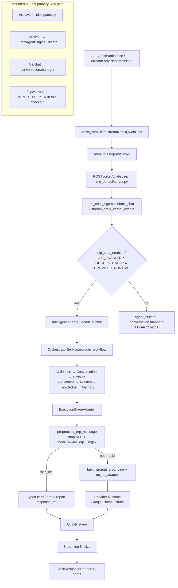
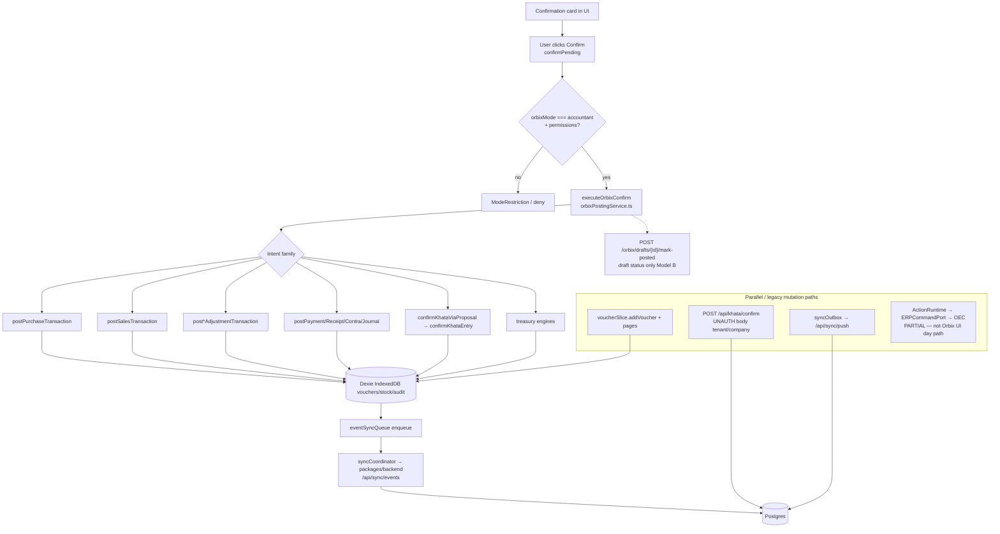
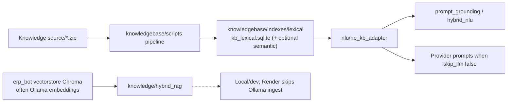
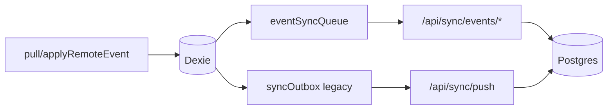

# MAI-00 Runtime Flow (actual code paths)

Diagrams reflect **current checkout behavior**, not only the target master architecture.

Trust boundaries:

- Browser (untrusted client) ↔ Node `serve.mjs` / optional `packages/backend`
- Browser ↔ Python `erp_bot` via `/erp-bot` reverse proxy
- Python providers (Groq/Ollama) — external LLM boundary
- Dexie IndexedDB — local ledger authority (Model B)
- Postgres — sync / khata-app authority

---

## A. Active read / answer pipeline

### Notes

1. **OIP `/oip/v1` HTTP mount fails** in this environment because
   `erp_bot/src/oip/modules/planner/api/router.py` imports
   `...application.commands` which resolves to missing
   `src.oip.modules.application` (should be `..application`).
   Chat ingress still imports when `oip_chat_enabled()` is true; container is
   async via `get_container()`.
2. Deterministic preprocess frequently returns without calling a provider.
3. Ask mode policy is enforced in mode-aware ERP and frontend confirm gates —
   incomplete as executable global constitution (MAI-01).

---

## B. Active mutation pipeline (product path)

### OEC-only verdict (for diagrams)

**Disproved for primary Orbix/Sutra ledger writes.** OEC is a real Python
module and orchestrator stage, but Dexie Model B + Node khata/sync are the
live writers.

---

## C. Active RAG / knowledge path

Language zips are **offline inputs**, not loaded into prompts wholesale at chat time.

---

## D. Sync overview

Accounting entities are blocked from legacy outbox via `syncEnqueueRouter`
(intended), while domain posts use event sync.

---

## Legacy / duplicate paths (summary)

| Path | Status |
|------|--------|
| `/nios/v1` | Mounted if imports succeed; parallel Cognitive/Multi-agent |
| `/orbix/v2` | Ollama agent loop; not SPA Orbix SSE target |
| `/v2/chat`, `/khata/*` | Legacy e-Khata endpoints |
| Falcon TS panel | ERP help NLP, not posting authority |
| Action→OEC | Implemented; not sole product mutation path |
| `/oip/v1` module routers | Present in tree; **cannot mount** due to planner import bug in this checkout |
