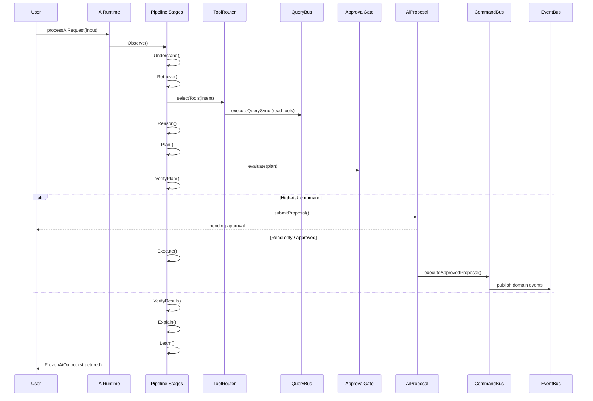
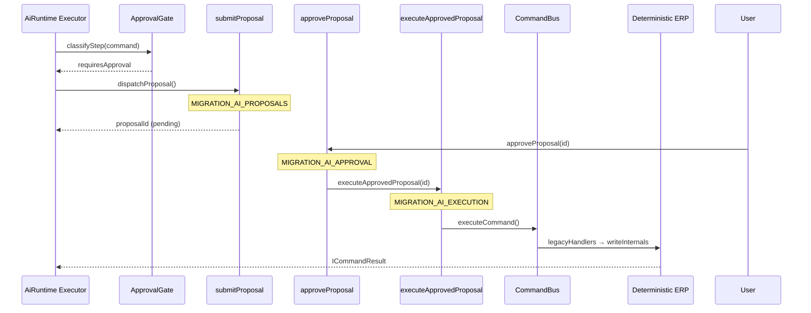
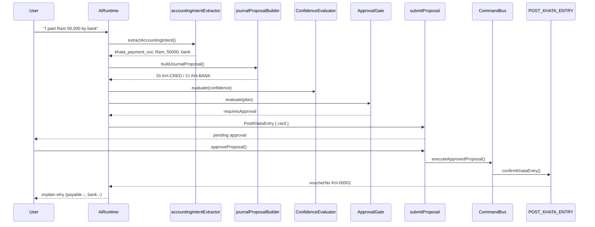
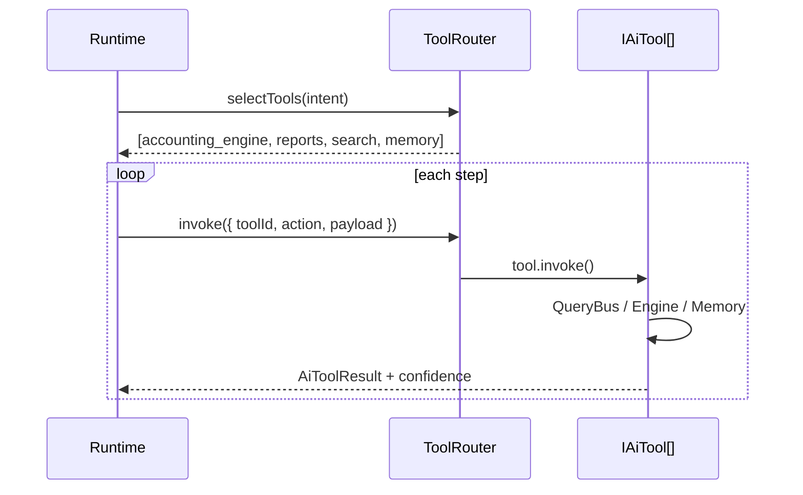

# AI Execution Runtime — Sequence Diagrams

## Request Lifecycle

```mermaid
sequenceDiagram
    participant User
    participant Runtime as AiRuntime
    participant Pipeline as Pipeline Stages
    participant Router as ToolRouter
    participant Query as QueryBus
    participant Approval as ApprovalGate
    participant Proposal as AiProposal
    participant Cmd as CommandBus
    participant Events as EventBus

    User->>Runtime: processAiRequest(input)
    Runtime->>Pipeline: Observe()
    Pipeline->>Pipeline: Understand()
    Pipeline->>Pipeline: Retrieve()
    Pipeline->>Router: selectTools(intent)
    Router->>Query: executeQuerySync (read tools)
    Pipeline->>Pipeline: Reason()
    Pipeline->>Pipeline: Plan()
    Pipeline->>Approval: evaluate(plan)
    Pipeline->>Pipeline: VerifyPlan()
    alt High-risk command
        Pipeline->>Proposal: submitProposal()
        Proposal-->>User: pending approval
    else Read-only / approved
        Pipeline->>Pipeline: Execute()
        Proposal->>Cmd: executeApprovedProposal()
        Cmd->>Events: publish domain events
    end
    Pipeline->>Pipeline: VerifyResult()
    Pipeline->>Pipeline: Explain()
    Pipeline->>Pipeline: Learn()
    Runtime-->>User: FrozenAiOutput (structured)
```

## Command Write Path (AI never touches state directly)

```mermaid
sequenceDiagram
    participant AI as AiRuntime Executor
    participant Gate as ApprovalGate
    participant Prop as submitProposal
    participant Approve as approveProposal
    participant Exec as executeApprovedProposal
    participant Bus as CommandBus
    participant ERP as Deterministic ERP

    AI->>Gate: classifyStep(command)
    Gate-->>AI: requiresApproval
    AI->>Prop: dispatchProposal()
    Note over Prop: MIGRATION_AI_PROPOSALS
    Prop-->>AI: proposalId (pending)
    User->>Approve: approveProposal(id)
    Note over Approve: MIGRATION_AI_APPROVAL
    Approve->>Exec: executeApprovedProposal(id)
    Note over Exec: MIGRATION_AI_EXECUTION
    Exec->>Bus: executeCommand()
    Bus->>ERP: legacyHandlers → writeInternals
    ERP-->>AI: ICommandResult
```

## Bank Payment Example

```mermaid
sequenceDiagram
    participant User
    participant Runtime as AiRuntime
    participant Extract as accountingIntentExtractor
    participant Reason as journalProposalBuilder
    participant Conf as ConfidenceEvaluator
    participant Approve as ApprovalGate
    participant Prop as submitProposal
    participant Bus as CommandBus
    participant ERP as POST_KHATA_ENTRY

    User->>Runtime: "I paid Ram 50,000 by bank"
    Runtime->>Extract: extractAccountingIntent()
    Extract-->>Runtime: khata_payment_out, Ram, 50000, bank
    Runtime->>Reason: buildJournalProposal()
    Reason-->>Runtime: Dr KH-CRED / Cr KH-BANK
    Runtime->>Conf: evaluate(confidence)
    Runtime->>Approve: evaluate(plan)
    Approve-->>Runtime: requiresApproval
    Runtime->>Prop: PostKhataEntry { card }
    Prop-->>User: pending approval
    User->>Prop: approveProposal()
    Prop->>Bus: executeApprovedProposal()
    Bus->>ERP: confirmKhataEntry()
    ERP-->>Runtime: voucherNo KH-00001
    Runtime-->>User: explain why (payable ↓, bank ↓)
```

```mermaid
sequenceDiagram
    participant Runtime
    participant Router as ToolRouter
    participant Tools as IAiTool[]

    Runtime->>Router: selectTools(intent)
    Router-->>Runtime: [accounting_engine, reports, search, memory]
    loop each step
        Runtime->>Router: invoke({ toolId, action, payload })
        Router->>Tools: tool.invoke()
        Tools->>Tools: QueryBus / Engine / Memory
        Tools-->>Runtime: AiToolResult + confidence
    end
```
